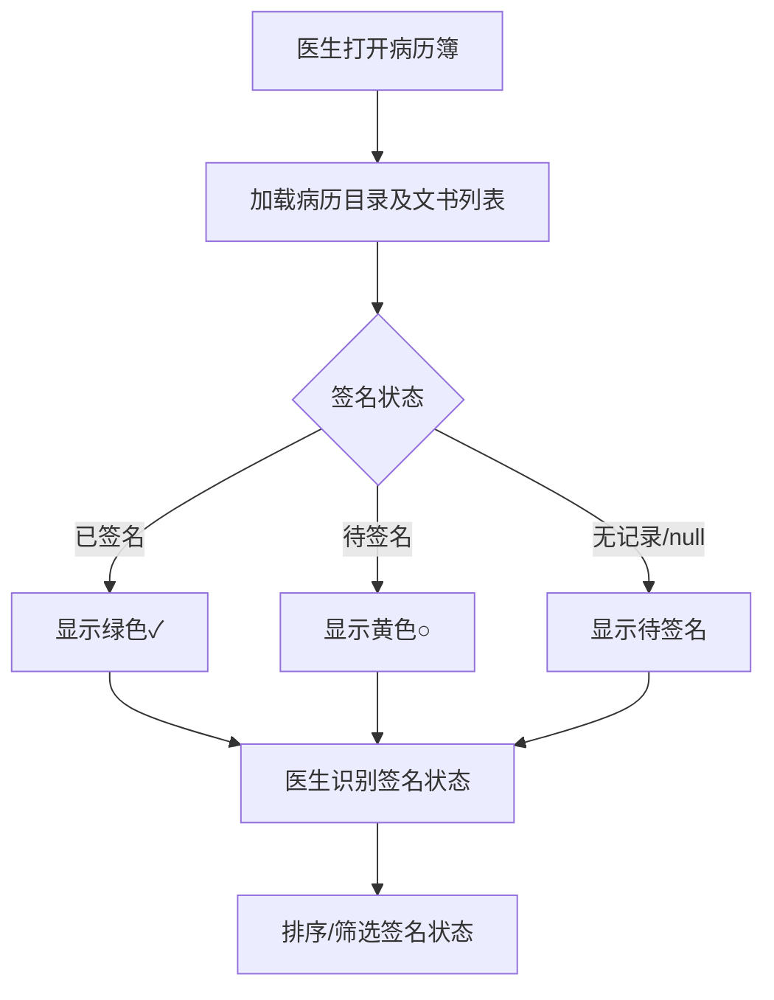
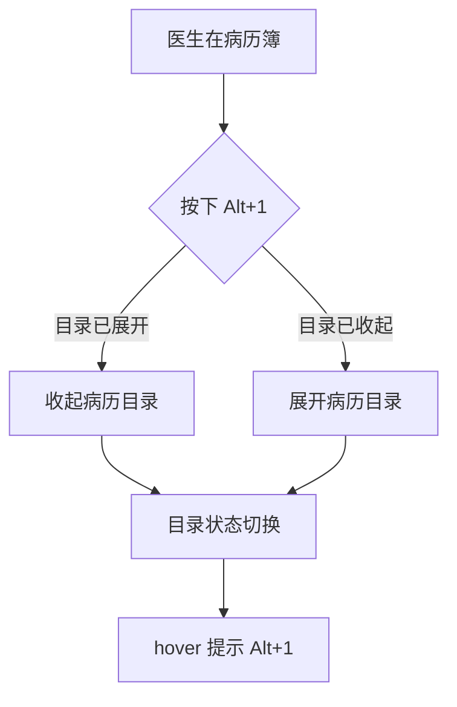

# BLGL-08-BLML-003文书目录展示_ Analyst - Spec

> **需求编号**：BLGL-08-BLML-003
> **父需求**：BLGL-08-BLML
> **关联PM Spec**：BLGL-08-BLML-003_文书目录展示_PM-spec.md
> **Spec版本**：V1.0
> **编写时间**：2026-08-15
> **编写人**：需求分析师

---

## 一、功能编号体系

> 使用带父子层级的 `<功能编号>-ID` 编号，便于追溯和讨论。

### 1.1 功能层级结构

```
BLGL-08-BLML-003: 文书目录展示
 ├─ BLGL-08-BLML-003-01: 病历簿目录展示
 ├─ BLGL-08-BLML-003-02: 患者签名标志
 ├─ BLGL-08-BLML-003-03: 目录展开收起（快捷键）
 └─ BLGL-08-BLML-003-04: 目录颜色与缩放标识
```

### 1.2 功能编号表

| REQ-ID | 功能名称 | 类型 | 优先级 | 说明 |
|--------|---------|------|--------|
| BLGL-08-BLML-003 | 文书目录展示 | 功能 | P1 | 病历簿目录展示、文书数量、签名标志、展开收起（L2） |
| BLGL-08-BLML-003-01 | 病历簿目录展示 | 子功能 | P1 | 病历簿目录树展示、文书数量显示 |
| BLGL-08-BLML-003-02 | 患者签名标志 | 子功能 | P1 | 已签名/待签名标志 |
| BLGL-08-BLML-003-03 | 目录展开收起（快捷键） | 子功能 | P1 | Alt+1 快捷键展开收起 |
| BLGL-08-BLML-003-04 | 目录颜色与缩放标识 | 子功能 | P1 | 缩放按钮颜色、非本科室颜色、换肤 |

---

## 二、核心业务流程

> 每个主流程一个 Mermaid flowchart。**流程步骤必须能在需求原文中找到对应描述，不推测中间步骤。**

### 2.1 签名状态展示



### 2.2 目录展开收起



---

## 三、功能规格说明

> 每个 REQ-ID 展开详细描述，包含功能概述、用户角色、业务流程、验收标准。

---

### BLGL-08-BLML-003-01: 病历簿目录展示

#### 3.1.1 功能概述

病历簿目录展示承载医生查看病历文书的导航入口，展示病历目录树及患者病历列表。

#### 3.1.2 用户角色

| 角色 | 使用场景 | 权限要求 | 操作频率 |
|------|---------|---------|---------|
| 住院医生 | 查看病历簿目录、定位文书 | 病历查看权限 | 高频 |

#### 3.1.3 业务流程（Given/When/Then）

##### 主流程（至少 1 个）

**Scenario 1: 病历簿目录展示**

```gherkin
Given:
 - 住院医生已打开病历簿

When:
 - 系统加载病历目录树及患者病历列表

Then:
 - 病历目录树及患者病历列表正确展示
```

##### 异常流程（至少 3 个）

**Scenario 2: 业务异常——目录无文书**

```gherkin
Given:
 - 某目录下无病历文书

When:
 - 医生点击该目录

Then:
 - ⏳ 待确认：空目录的展示行为未在资料区明确
```

**Scenario 3: 数据异常——文书数量显示异常**

```gherkin
Given:
 - 文书数量接口返回异常值

When:
 - 医生查看目录文书数量

Then:
 - ⏳ 待确认：数量显示异常的降级处理未在资料区明确
```

**Scenario 4: 系统异常——目录加载失败**

```gherkin
Given:
 - 病历目录加载接口异常

When:
 - 医生打开病历簿

Then:
 - ⏳ 待确认：加载失败的降级与提示未在资料区明确
```

##### 边界流程（至少 2 个）

**Scenario 5: 边界场景——多目录展开**

```gherkin
Given:
 - 病历目录含多个分类

When:
 - 医生展开多个目录

Then:
 - ⏳ 待确认：多目录展开的默认状态未在资料区明确
```

**Scenario 6: 边界场景——大量文书数据**

```gherkin
Given:
 - 患者病历文书数量达 1000+ 条

When:
 - 医生加载文书总览列表

Then:
 - 1000 条病历数据加载时间不超过 3 秒
```

#### 3.1.4 数据字段定义

| 字段名 | 类型 | 必填 | 默认值 | 取值范围 | 说明 | 概念ID |
|--------|------|------|--------|---------|------|--------|
| INP_EMR_CLASS_ID | Long | 否 | - | - | 病历目录关联 | ⏳ 待确认 |
| INP_EMR_SET_TITLE | String | 否 | - | - | 病历标题 | ⏳ 待确认 |

#### 3.1.5 验收标准

| AC编号 | 验收标准 | 对应REQ-ID | 验证方法 | 验证场景 |
|--------|---------|-----------|--------|
| AC-001 | 病历簿目录树及患者病历列表正确展示 | BLGL-08-BLML-003-01 | 功能测试 | Scenario 1 |

---

### BLGL-08-BLML-003-02: 患者签名标志

#### 3.2.1 功能概述

在文书总览列表中增加"待患者签名"和"已患者签名"两列；在病历目录中为每个病历增加患者签名状态标志，医生无需打开病历即可识别签名状态。

#### 3.2.2 用户角色

| 角色 | 使用场景 | 权限要求 | 操作频率 |
|------|---------|---------|---------|
| 住院医生 | 查看签名状态、筛选排序 | 病历查看权限 | 高频 |

#### 3.2.3 业务流程（Given/When/Then）

##### 主流程（至少 1 个）

**Scenario 1: 签名状态展示**

```gherkin
Given:
 - 医生已打开文书总览或病历目录

When:
 - 系统展示签名状态列/标志

Then:
 - 已签名显示绿色✓，待签名显示黄色○
```

##### 异常流程（至少 3 个）

**Scenario 2: 业务异常——无签名记录**

```gherkin
Given:
 - 患者无任何签名记录

When:
 - 医生查看签名状态

Then:
 - 默认显示为"待签名"
```

**Scenario 3: 数据异常——签名状态为空**

```gherkin
Given:
 - 签名状态字段为 null

When:
 - 医生查看签名状态

Then:
 - 显示为"待签名"
```

**Scenario 4: 系统异常——签名查询接口异常**

```gherkin
Given:
 - 签名记录服务查询接口异常

When:
 - 医生加载签名状态

Then:
 - ⏳ 待确认：签名查询失败的降级与提示未在资料区明确
```

##### 边界流程（至少 2 个）

**Scenario 5: 边界场景——签名状态排序**

```gherkin
Given:
 - 点击签名状态列标题进行排序

When:
 - 医生点击排序

Then:
 - 待签名病历排在前面
```

**Scenario 6: 边界场景——签名状态筛选**

```gherkin
Given:
 - 使用签名状态下拉框进行筛选

When:
 - 医生筛选对应状态

Then:
 - 表格仅显示对应状态的病历
```

#### 3.2.4 数据字段定义

| 字段名 | 类型 | 必填 | 默认值 | 取值范围 | 说明 | 概念ID |
|--------|------|------|--------|---------|------|--------|
| PATIENT_SIGNED_FLAG | Long | 否 | - | - | 患者签名标志 | ⏳ 待确认 |

#### 3.2.5 验收标准

| AC编号 | 验收标准 | 对应REQ-ID | 验证方法 | 验证场景 |
|--------|---------|-----------|--------|
| AC-002 | 已签名显示绿色✓，待签名显示黄色○ | BLGL-08-BLML-003-02 | 功能测试 | Scenario 1 |
| AC-003 | 无签名记录或字段 null 时显示"待签名" | BLGL-08-BLML-003-02 | 功能测试 | Scenario 2/3 |
| AC-004 | 待签名病历排序在前，筛选仅显示对应状态 | BLGL-08-BLML-003-02 | 功能测试 | Scenario 5/6 |

---

### BLGL-08-BLML-003-03: 目录展开收起（快捷键）

#### 3.3.1 功能概述

按住"Alt+1"键可对病历目录进行收起和展开，鼠标悬浮 hover 时文字提示"Alt+1"。

#### 3.3.2 用户角色

| 角色 | 使用场景 | 权限要求 | 操作频率 |
|------|---------|---------|---------|
| 住院医生 | 快捷键展开收起病历目录 | 无特殊权限要求 | 中频 |

#### 3.3.3 业务流程（Given/When/Then）

##### 主流程（至少 1 个）

**Scenario 1: 快捷键展开收起目录**

```gherkin
Given:
 - 医生在病历簿界面

When:
 - 医生按住 Alt+1 键
 - 鼠标悬浮目录

Then:
 - 病历目录收起/展开
 - hover 文字提示"Alt+1"
```

##### 异常流程（至少 3 个）

**Scenario 2: 业务异常——焦点不在病历簿**

```gherkin
Given:
 - 焦点不在病历簿界面

When:
 - 医生按下 Alt+1

Then:
 - ⏳ 待确认：焦点不在时的快捷键行为未在资料区明确
```

**Scenario 3: 数据异常——目录状态异常**

```gherkin
Given:
 - 病历目录展开状态数据异常

When:
 - 医生按下 Alt+1

Then:
 - ⏳ 待确认：状态异常的切换行为未在资料区明确
```

**Scenario 4: 系统异常——快捷键冲突**

```gherkin
Given:
 - Alt+1 与系统其他快捷键冲突

When:
 - 医生按下 Alt+1

Then:
 - ⏳ 待确认：快捷键冲突的处理未在资料区明确
```

##### 边界流程（至少 2 个）

**Scenario 5: 边界场景——目录已收起时展开**

```gherkin
Given:
 - 病历目录已收起

When:
 - 医生按下 Alt+1

Then:
 - 病历目录展开
```

**Scenario 6: 边界场景——hover 提示显示**

```gherkin
Given:
 - 鼠标悬浮在目录上

When:
 - 观察提示

Then:
 - 文字提示"Alt+1"
```

#### 3.3.4 数据字段定义

| 字段名 | 类型 | 必填 | 默认值 | 取值范围 | 说明 | 概念ID |
|--------|------|------|--------|---------|------|--------|
| ⏳ 待确认 | ⏳ 待确认 | ⏳ 待确认 | - | - | 目录展开状态字段未在资料区明确 | ⏳ 待确认 |

#### 3.3.5 验收标准

| AC编号 | 验收标准 | 对应REQ-ID | 验证方法 | 验证场景 |
|--------|---------|-----------|--------|
| AC-005 | 按住 Alt+1 可收起/展开病历目录，hover 提示"Alt+1" | BLGL-08-BLML-003-03 | 功能测试 | Scenario 1 |

---

### BLGL-08-BLML-003-04: 目录颜色与缩放标识

#### 3.4.1 功能概述

病历导航界面的缩放按钮边缘线调整为有色并加粗，颜色跟随系统皮肤；病历目录背景色由原先写死的白色改为变量，支持换肤。

#### 3.4.2 用户角色

| 角色 | 使用场景 | 权限要求 | 操作频率 |
|------|---------|---------|---------|
| 住院医生 | 查看缩放按钮与目录配色 | 无特殊权限要求 | 高频 |

#### 3.4.3 业务流程（Given/When/Then）

##### 主流程（至少 1 个）

**Scenario 1: 缩放按钮颜色展示**

```gherkin
Given:
 - 医生打开病历导航界面

When:
 - 观察目录导航缩放按钮

Then:
 - 缩放按钮边缘线调整为有色并加粗，颜色跟随系统皮肤
```

##### 异常流程（至少 3 个）

**Scenario 2: 业务异常——换肤事件未触发**

```gherkin
Given:
 - 系统切换肤色

When:
 - 前端监听换肤事件

Then:
 - 通过 window.$eventBus.$emit("SELECT_THEME_STYLE", theme) 触发换肤
```

**Scenario 3: 数据异常——皮肤变量缺失**

```gherkin
Given:
 - 皮肤变量未配置

When:
 - 渲染病历目录背景色

Then:
 - ⏳ 待确认：变量缺失时的回退颜色未在资料区明确
```

**Scenario 4: 系统异常——编辑器换肤对接失败**

```gherkin
Given:
 - 编辑器无法自行对接框架换肤

When:
 - 业务组监听换肤事件调用编辑器接口

Then:
 - 编辑器需提供接口供业务组调用换肤
```

##### 边界流程（至少 2 个）

**Scenario 5: 边界场景——专用皮肤配色**

```gherkin
Given:
 - 使用重庆西南医院专用皮肤

When:
 - 查看病历目录背景色

Then:
 - 背景色为 #F0F4F8（6号色），其他皮肤保留原有颜色
```

**Scenario 6: 边界场景——非本科室目录颜色**

```gherkin
Given:
 - 病历目录存在非本科室目录

When:
 - 查看非本科室目录

Then:
 - ⏳ 待确认：非本科室目录颜色 #999999 未在本次资料区（病历目录-0813.xlsx）明确，Phase 1 引用的具体颜色待确认
```

#### 3.4.4 数据字段定义

| 字段名 | 类型 | 必填 | 默认值 | 取值范围 | 说明 | 概念ID |
|--------|------|------|--------|---------|------|--------|
| ⏳ 待确认 | ⏳ 待确认 | ⏳ 待确认 | - | - | 颜色/换肤相关字段未在资料区明确 | ⏳ 待确认 |

#### 3.4.5 验收标准

| AC编号 | 验收标准 | 对应REQ-ID | 验证方法 | 验证场景 |
|--------|---------|-----------|--------|
| AC-006 | 缩放按钮边缘线有色加粗并跟随系统皮肤 | BLGL-08-BLML-003-04 | 功能测试 | Scenario 1 |
| AC-007 | 病历目录背景色支持换肤（专用皮肤 #F0F4F8，其他皮肤保留原色） | BLGL-08-BLML-003-04 | 功能测试 | Scenario 5 |

---

## 四、排除范围

本需求不包含以下功能项：

1. **病历目录配置（启停用/挂URL/通用专科目录）** - 属 BLGL-08-BLML-001
2. **模板目录映射与顺序调整** - 属 BLGL-08-BLML-002
3. **病历新建与模板选择** - 属 BLGL-08-BLML-004
4. **文书分组与多语显示** - 属 BLGL-08-BLML-005
5. **新增病历按钮快捷键（Ctrl+N）** - 属 BLGL-08-BLML-004 基础能力 BC-BLML-003

---

## 五、业务规则清单

| 规则ID | 规则名称 | 规则描述 | 优先级 |
|--------|---------|---------|--------|
| BR-001 | 签名状态两列 | 文书总览列表增加"待患者签名"和"已患者签名"两列 | P1 |
| BR-002 | 签名状态标识 | 已签名显示绿色✓，待签名显示黄色○ | P1 |
| BR-003 | 无签名默认待签名 | 无签名记录时默认显示"待签名"；字段 null 时显示"待签名" | P1 |
| BR-004 | 签名状态排序 | 点击签名状态列标题排序，待签名病历排在前面 | P1 |
| BR-005 | 签名状态筛选 | 使用签名状态下拉框筛选，仅显示对应状态病历 | P1 |
| BR-006 | 目录展开收起快捷键 | 按住 Alt+1 收起/展开病历目录，hover 提示"Alt+1" | P1 |
| BR-007 | 缩放按钮颜色 | 缩放按钮边缘线调整为有色并加粗，颜色跟随系统皮肤 | P1 |
| BR-008 | 目录背景换肤 | 病历目录背景色由写死白色改为变量，支持换肤 | P1 |

---

## 六、关联文档

| 文档类型 | 文档路径 | 说明 |
|---------|---------|
| 功能点Spec | BLGL-08-BLML 病历目录功能点Spec.md（V1.0，上级目录） | Phase 1 功能点索引 |
| PM spec | 本目录 BLGL-08-BLML-003_文书目录展示_PM-spec.md（V0.1） | PM 产出的 Spec 文档 |
| -Spec | 本目录 BLGL-08-BLML-003_文书目录展示-Spec.md（V1.0） | 业务背景与目标 Spec |
| data-model.md | 待产出 | 架构师产出的数据建模文档 |
| design.md | 待产出 | 架构师产出的技术方案文档 |
| api-contract.md | 待产出 | 开发经理产出的 API 契约文档 |

---

## 七、待确认问题清单

| 编号 | 问题描述 | 缺失信息 | 影响范围 | 建议补充方 |
|------|---------|---------|--------|
| Q-001 | 签名状态查询接口的具体路径未在代码扫描中定位 | 签名记录服务接口路径 | 第5章接口契约 | 开发经理 |
| Q-002 | 目录加载失败、签名查询失败时的降级与提示未在资料区明确 | 异常降级策略与提示文案 | 第3章场景 | 产品经理 |
| Q-003 | 空目录展示、多目录默认展开状态、文书数量异常降级未在资料区明确 | 空/异常展示行为 | 第3章场景 | 产品经理 |
| Q-004 | 快捷键焦点不在病历簿、快捷键冲突时的行为未在资料区明确 | 快捷键边界行为 | 第3章场景 | 产品经理 |
| Q-005 | 皮肤变量缺失时的回退颜色未在资料区明确 | 换肤回退策略 | 第3章场景 | 产品经理/前端开发 |
| Q-006 | 非本科室目录颜色 #999999 未在本次资料区（病历目录-0813.xlsx）明确 | 具体颜色值 | 第3章场景 | 产品经理 |
| Q-007 | PATIENT_SIGNED_FLAG 等字段的概念ID未在资料区明确 | 概念ID | 第3章数据字段定义 | 产品经理 |
| Q-008 | 本功能点的可用性指标未在资料区提供 | 可用性量化指标 | 第8章非功能要求 | 产品经理 |

---

## 填写检查清单

| 序号 | 检查项 | 是否完成 |
|:----:|--------|:--------:|
| 1 | 功能编号带父子层级 | ✅ |
| 2 | 每个 REQ-ID 有功能概述和用户角色 | ✅ |
| 3 | 主流程至少 1 个 Given/When/Then 场景 | ✅ |
| 4 | 异常流程至少 3 个 Given/When/Then 场景 | ✅ |
| 5 | 边界流程至少 2 个 Given/When/Then 场景 | ✅ |
| 6 | 每个 Given/When/Then 内容具体，不模糊 | ✅ |
| 7 | 数据字段定义完整（字段名、类型、必填、说明、概念ID） | ✅（概念ID ⏳） |
| 8 | 验收标准 AC 编号独立，可验证 | ✅ |
| 9 | 验收标准无"功能正常"等模糊表述 | ✅ |
| 10 | 排除范围明确列出 | ✅ |
| 11 | 业务规则清单列出所有规则，每条标注来源 | ✅（8 条） |
| 12 | 流程图使用 Mermaid 格式（≥2 个） | ✅ |
| 13 | 关联文档索引包含 Phase 1 功能点Spec | ✅ |
| 14 | 待确认问题清单汇总了全文所有 ⏳ 项 | ✅ |
| 15 | 全文无占位符 `< >` 残留 | ✅ |
| 16 | 全文陈述可溯源至资料区（S1~S10 溯源核查） | ✅ |
| 17 | 人工审核确认完成 | ⏳ 待确认 |

---

**文档状态**：⬜ 待审核
**维护责任**：需求分析师规范组
**下次更新**：根据评审反馈优化

---

## 版本历史

| 版本 | 日期 | 变更说明 | 编写人 |
|------|------|---------|--------|
| V1.0 | 2026-08-15 | 初始版本 | 需求分析师 |
