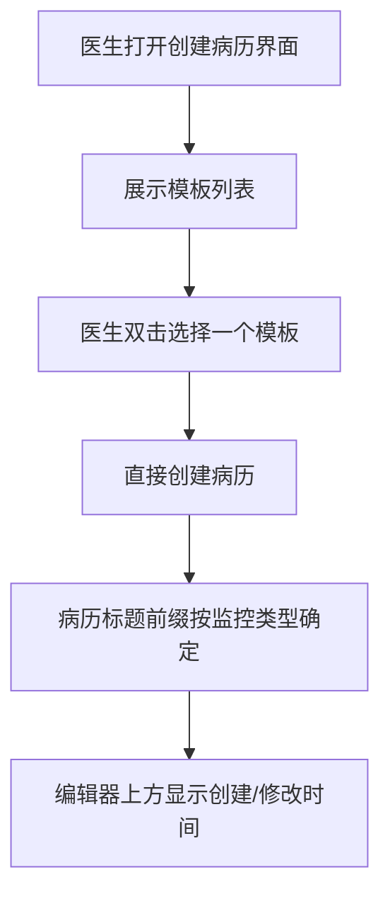
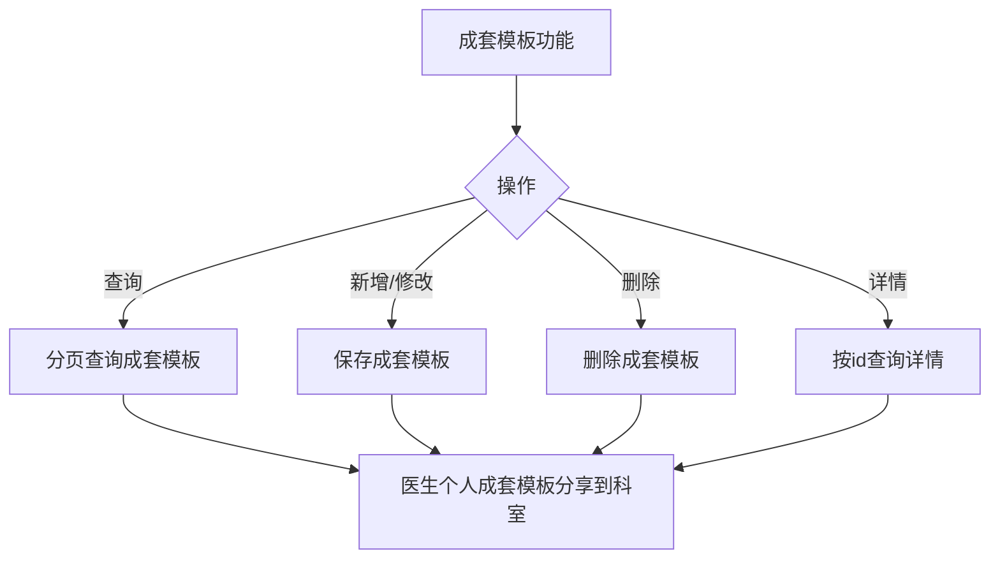

# BLGL-08-BLML-004病历新建与模板选择_ Analyst - Spec

> **需求编号**：BLGL-08-BLML-004
> **父需求**：BLGL-08-BLML
> **关联PM Spec**：BLGL-08-BLML-004_病历新建与模板选择_PM-spec.md
> **Spec版本**：V1.0
> **编写时间**：2026-08-15
> **编写人**：需求分析师

---

## 一、功能编号体系

> 使用带父子层级的 `<功能编号>-ID` 编号，便于追溯和讨论。

### 1.1 功能层级结构

```
BLGL-08-BLML-004: 病历新建与模板选择
 ├─ BLGL-08-BLML-004-01: 双击模板创建病历
 ├─ BLGL-08-BLML-004-02: 成套模板
 ├─ BLGL-08-BLML-004-03: 病历名称前缀编辑
 └─ BLGL-08-BLML-004-04: 病历创建/修改时间显示
```

### 1.2 功能编号表

| REQ-ID | 功能名称 | 类型 | 优先级 | 说明 |
|--------|---------|------|--------|
| BLGL-08-BLML-004 | 病历新建与模板选择 | 功能 | P1 | 双击模板创建病历、成套模板、名称前缀（L2） |
| BLGL-08-BLML-004-01 | 双击模板创建病历 | 子功能 | P1 | 双击模板直接创建病历 |
| BLGL-08-BLML-004-02 | 成套模板 | 子功能 | P1 | 成套模板分页/增删改/详情/分享 |
| BLGL-08-BLML-004-03 | 病历名称前缀编辑 | 子功能 | P1 | 监控类型决定病历标题前缀 |
| BLGL-08-BLML-004-04 | 病历创建/修改时间显示 | 子功能 | P1 | 编辑器上方显示创建/修改人和时间 |

---

## 二、核心业务流程

> 每个主流程一个 Mermaid flowchart。**流程步骤必须能在需求原文中找到对应描述，不推测中间步骤。**

### 2.1 双击模板创建病历



### 2.2 成套模板管理



---

## 三、功能规格说明

> 每个 REQ-ID 展开详细描述，包含功能概述、用户角色、业务流程、验收标准。

---

### BLGL-08-BLML-004-01: 双击模板创建病历

#### 3.1.1 功能概述

住院病历，创建病历时，双击选择一个模板，可以直接创建病历。

#### 3.1.2 用户角色

| 角色 | 使用场景 | 权限要求 | 操作频率 |
|------|---------|---------|---------|
| 住院医生 | 双击模板创建病历 | 病历书写权限 | 高频 |

#### 3.1.3 业务流程（Given/When/Then）

##### 主流程（至少 1 个）

**Scenario 1: 双击模板直接创建病历**

```gherkin
Given:
 - 住院医生已打开创建病历界面
 - 模板列表已展示

When:
 - 医生双击选择一个模板

Then:
 - 直接创建病历
```

##### 异常流程（至少 3 个）

**Scenario 2: 业务异常——模板不可用**

```gherkin
Given:
 - 所选模板不可用或被停用

When:
 - 医生双击模板创建病历

Then:
 - ⏳ 待确认：模板不可用时的处理与提示未在资料区明确
```

**Scenario 3: 数据异常——创建接口出参缺失目录**

```gherkin
Given:
 - 病历创建接口出参病历目录 inpatEmrTypeId 缺失

When:
 - 医生双击模板创建病历

Then:
 - ⏳ 待确认：目录缺失时的处理未在资料区明确
```

**Scenario 4: 系统异常——创建接口失败**

```gherkin
Given:
 - 病历创建接口异常

When:
 - 医生双击模板创建病历

Then:
 - 系统提示创建失败
 - ⏳ 待确认：具体提示文案与回滚策略未在资料区明确
```

##### 边界流程（至少 2 个）

**Scenario 5: 边界场景——连续创建多份病历**

```gherkin
Given:
 - 医生连续双击多个模板

When:
 - 依次创建多份病历

Then:
 - ⏳ 待确认：连续创建的行为未在资料区明确
```

**Scenario 6: 边界场景——无模板可选择**

```gherkin
Given:
 - 创建界面无可用模板

When:
 - 医生尝试创建病历

Then:
 - ⏳ 待确认：无模板时的创建行为未在资料区明确
```

#### 3.1.4 数据字段定义

| 字段名 | 类型 | 必填 | 默认值 | 取值范围 | 说明 | 概念ID |
|--------|------|------|--------|---------|------|--------|
| INP_MRT_ID | Long | 是 | - | - | 住院病历模板标识 | ⏳ 待确认 |
| INP_EMR_CLASS_ID | Long | 否 | - | - | 病历目录关联 | ⏳ 待确认 |

#### 3.1.5 验收标准

| AC编号 | 验收标准 | 对应REQ-ID | 验证方法 | 验证场景 |
|--------|---------|-----------|--------|
| AC-001 | 住院医生双击模板后直接创建病历 | BLGL-08-BLML-004-01 | 功能测试 | Scenario 1 |

---

### BLGL-08-BLML-004-02: 成套模板

#### 3.2.1 功能概述

成套模板配置：分页查询成套模板、新增/修改成套模板、删除成套模板、按 id 查询详情、分页查询已发布全院模板、医生个人成套模板分享到科室。

#### 3.2.2 用户角色

| 角色 | 使用场景 | 权限要求 | 操作频率 |
|------|---------|---------|---------|
| 住院医生 | 使用成套模板、分享个人成套模板到科室 | 病历书写权限 | 中频 |
| 配置管理员 | 配置成套模板 | 病历配置权限 | 中频 |

#### 3.2.3 业务流程（Given/When/Then）

##### 主流程（至少 1 个）

**Scenario 1: 成套模板查询与使用**

```gherkin
Given:
 - 医生打开成套模板功能

When:
 - 医生分页查询成套模板
 - 医生选择成套模板

Then:
 - 成套模板列表展示、可按成套模板使用
```

##### 异常流程（至少 3 个）

**Scenario 2: 业务异常——成套模板删除冲突**

```gherkin
Given:
 - 成套模板正在被使用

When:
 - 医生删除成套模板

Then:
 - ⏳ 待确认：使用中的成套模板删除行为未在资料区明确
```

**Scenario 3: 数据异常——成套模板详情不存在**

```gherkin
Given:
 - 查询的成套模板 id 不存在

When:
 - 查询详情

Then:
 - ⏳ 待确认：id 不存在时的返回未在资料区明确
```

**Scenario 4: 系统异常——成套模板接口失败**

```gherkin
Given:
 - 成套模板保存/删除接口异常

When:
 - 医生执行操作

Then:
 - ⏳ 待确认：失败提示与回滚未在资料区明确
```

##### 边界流程（至少 2 个）

**Scenario 5: 边界场景——个人成套模板分享到科室**

```gherkin
Given:
 - 医生有个人成套模板

When:
 - 医生分享到科室

Then:
 - 分享生效
```

**Scenario 6: 边界场景——已发布全院模板查询**

```gherkin
Given:
 - 存在已发布全院模板

When:
 - 分页查询已发布全院模板

Then:
 - 已发布全院模板列表展示
```

#### 3.2.4 数据字段定义

| 字段名 | 类型 | 必填 | 默认值 | 取值范围 | 说明 | 概念ID |
|--------|------|------|--------|---------|------|--------|
| ⏳ 待确认 | ⏳ 待确认 | ⏳ 待确认 | - | - | 成套模板字段结构未在资料区明确 | ⏳ 待确认 |

#### 3.2.5 验收标准

| AC编号 | 验收标准 | 对应REQ-ID | 验证方法 | 验证场景 |
|--------|---------|-----------|--------|
| AC-002 | 成套模板分页查询、新增/修改、删除、详情查询均生效 | BLGL-08-BLML-004-02 | 功能测试 | Scenario 1 |

---

### BLGL-08-BLML-004-03: 病历名称前缀编辑

#### 3.3.1 功能概述

病历通用设置参数"支持修改病历标题的监控类型"，默认写死上级医师查房相关病历监控类型，可新增其他监控类型。

#### 3.3.2 用户角色

| 角色 | 使用场景 | 权限要求 | 操作频率 |
|------|---------|---------|---------|
| 配置管理员 | 配置病历标题的监控类型 | 病历配置权限 | 低频 |

#### 3.3.3 业务流程（Given/When/Then）

##### 主流程（至少 1 个）

**Scenario 1: 新增监控类型前缀**

```gherkin
Given:
 - 病历通用设置参数"支持修改病历标题的监控类型"，默认写死上级医师查房相关病历监控类型

When:
 - 配置管理员新增其他监控类型

Then:
 - 可新增其他监控类型
```

##### 异常流程（至少 3 个）

**Scenario 2: 业务异常——重复新增监控类型**

```gherkin
Given:
 - 监控类型已存在

When:
 - 配置管理员重复新增

Then:
 - ⏳ 待确认：重复新增的处理未在资料区明确
```

**Scenario 3: 数据异常——默认监控类型缺失**

```gherkin
Given:
 - 默认写死的上级医师查房相关监控类型缺失

When:
 - 系统加载默认监控类型

Then:
 - ⏳ 待确认：默认类型缺失的处理未在资料区明确
```

**Scenario 4: 系统异常——参数保存失败**

```gherkin
Given:
 - 病历通用设置参数保存接口异常

When:
 - 配置管理员保存

Then:
 - ⏳ 待确认：保存失败的提示与回滚未在资料区明确
```

##### 边界流程（至少 2 个）

**Scenario 5: 边界场景——未配置前缀的监控类型**

```gherkin
Given:
 - 某监控类型未配置病历标题前缀

When:
 - 医生创建该监控类型病历

Then:
 - ⏳ 待确认：未配置前缀时的病历命名行为未在资料区明确
```

**Scenario 6: 边界场景——前缀应用于病历标题**

```gherkin
Given:
 - 监控类型已配置前缀

When:
 - 医生创建病历

Then:
 - 病历标题前缀由监控类型决定
```

#### 3.3.4 数据字段定义

| 字段名 | 类型 | 必填 | 默认值 | 取值范围 | 说明 | 概念ID |
|--------|------|------|--------|---------|------|--------|
| INP_EMR_SET_TITLE_PREFIX | String | 否 | - | - | 病历标题前缀 | ⏳ 待确认 |
| INP_MRT_MONITOR_ID | Long | 否 | - | - | 监控类型 | ⏳ 待确认 |

#### 3.3.5 验收标准

| AC编号 | 验收标准 | 对应REQ-ID | 验证方法 | 验证场景 |
|--------|---------|-----------|--------|
| AC-003 | 病历标题前缀按监控类型正确生成，配置管理员可新增其他监控类型 | BLGL-08-BLML-004-03 | 功能测试 | Scenario 1 |

---

### BLGL-08-BLML-004-04: 病历创建/修改时间显示

#### 3.4.1 功能概述

住院病历的编辑器上方增加创建、最新修改的人和时间显示，取右键属性弹窗里面的信息；显示区域固定位置，病历滚动时也一直显示，显示层级低于工具栏上的更多弹窗。

#### 3.4.2 用户角色

| 角色 | 使用场景 | 权限要求 | 操作频率 |
|------|---------|---------|---------|
| 住院医生 | 查看病历创建/修改时间 | 无特殊权限要求 | 高频 |

#### 3.4.3 业务流程（Given/When/Then）

##### 主流程（至少 1 个）

**Scenario 1: 创建/修改时间显示**

```gherkin
Given:
 - 医生已打开病历编辑器

When:
 - 查看编辑器上方

Then:
 - 显示创建、最新修改的人和时间，取右键属性弹窗里的信息
 - 显示区域固定位置，病历滚动时一直显示，显示层级低于工具栏更多弹窗
```

##### 异常流程（至少 3 个）

**Scenario 2: 业务异常——创建信息缺失**

```gherkin
Given:
 - 病历创建/修改信息缺失

When:
 - 查看编辑器上方

Then:
 - ⏳ 待确认：信息缺失时的展示未在资料区明确
```

**Scenario 3: 数据异常——时间字段为空**

```gherkin
Given:
 - 创建时间或修改时间字段为空

When:
 - 查看编辑器上方

Then:
 - ⏳ 待确认：字段为空时的展示未在资料区明确
```

**Scenario 4: 系统异常——信息获取接口失败**

```gherkin
Given:
 - 获取病历属性信息接口异常

When:
 - 查看编辑器上方

Then:
 - ⏳ 待确认：接口失败的降级展示未在资料区明确
```

##### 边界流程（至少 2 个）

**Scenario 5: 边界场景——病历滚动时显示**

```gherkin
Given:
 - 病历内容较长，发生滚动

When:
 - 医生滚动病历

Then:
 - 创建/修改时间显示区域一直显示
```

**Scenario 6: 边界场景——工具栏更多弹窗层级**

```gherkin
Given:
 - 工具栏"更多"弹窗打开

When:
 - 查看显示层级

Then:
 - 时间显示层级低于工具栏更多弹窗
```

#### 3.4.4 数据字段定义

| 字段名 | 类型 | 必填 | 默认值 | 取值范围 | 说明 | 概念ID |
|--------|------|------|--------|---------|------|--------|
| INP_EMR_SET_CREATED_AT | Date | 否 | - | - | 住院病历创建时间 | ⏳ 待确认 |
| MODIFIED_AT | Date | 否 | - | - | 最后修改日期时间 | ⏳ 待确认 |

#### 3.4.5 验收标准

| AC编号 | 验收标准 | 对应REQ-ID | 验证方法 | 验证场景 |
|--------|---------|-----------|--------|
| AC-004 | 病历编辑器上方显示创建、最新修改人和时间，病历滚动时一直显示 | BLGL-08-BLML-004-04 | 功能测试 | Scenario 1/5 |

---

## 四、排除范围

本需求不包含以下功能项：

1. **病历目录配置（启停用/挂URL/通用专科目录）** - 属 BLGL-08-BLML-001
2. **模板目录映射与顺序调整** - 属 BLGL-08-BLML-002
3. **文书目录展示（签名标志/数量显示/展开收起）** - 属 BLGL-08-BLML-003
4. **文书分组与多语显示** - 属 BLGL-08-BLML-005
5. **病历书写内容的编辑** - 属病历书写模块 BLGL-01-BLSX

---

## 五、业务规则清单

| 规则ID | 规则名称 | 规则描述 | 优先级 |
|--------|---------|---------|--------|
| BR-001 | 双击创建病历 | 创建病历时双击选择一个模板可以直接创建病历 | P1 |
| BR-002 | 病历名称前缀监控类型 | 病历通用设置参数"支持修改病历标题的监控类型"，默认写死上级医师查房相关病历监控类型，可新增其他监控类型 | P1 |
| BR-003 | 创建/修改时间显示 | 编辑器上方增加创建、最新修改人和时间显示，取右键属性弹窗信息，固定位置、滚动一直显示、层级低于更多弹窗 | P1 |
| BR-004 | 成套模板增删改查 | 成套模板支持分页查询、新增/修改、删除、详情查询 | P1 |
| BR-005 | 个人成套模板分享 | 医生个人成套模板分享到科室 | P1 |

---

## 六、关联文档

| 文档类型 | 文档路径 | 说明 |
|---------|---------|
| 功能点Spec | BLGL-08-BLML 病历目录功能点Spec.md（V1.0，上级目录） | Phase 1 功能点索引 |
| PM spec | 本目录 BLGL-08-BLML-004_病历新建与模板选择_PM-spec.md（V0.1） | PM 产出的 Spec 文档 |
| -Spec | 本目录 BLGL-08-BLML-004_病历新建与模板选择-Spec.md（V1.0） | 业务背景与目标 Spec |
| data-model.md | 待产出 | 架构师产出的数据建模文档 |
| design.md | 待产出 | 架构师产出的技术方案文档 |
| api-contract.md | 待产出 | 开发经理产出的 API 契约文档 |

---

## 七、待确认问题清单

| 编号 | 问题描述 | 缺失信息 | 影响范围 | 建议补充方 |
|------|---------|---------|--------|
| Q-001 | 病历创建保存请求的结构未在资料区明确 | 创建请求字段结构 | 第4章数据模型 | 架构师/开发经理 |
| Q-002 | 模板不可用、无模板、连续创建、创建接口失败时的处理未在资料区明确 | 异常/边界处理 | 第3章场景 | 产品经理 |
| Q-003 | 需求 76189 状态为"已拒绝"，与"新建病历优化"的承接关系未在资料区明确 | 需求承接关系 | 第2章背景、第5章规则 | 产品经理 |
| Q-004 | "支持修改病历标题的监控类型"参数的具体编码/路径未在资料区明确 | 参数编码/路径 | 第4章系统参数 | 产品经理 |
| Q-005 | 病历创建/修改信息缺失或字段为空时的展示未在资料区明确 | 空值展示 | 第3章场景 | 产品经理 |
| Q-006 | 成套模板使用中的删除、id 不存在、接口失败等异常处理未在资料区明确 | 异常处理 | 第3章场景 | 产品经理 |
| Q-007 | 本功能点的性能/安全/可用性指标未在资料区提供 | 非功能指标 | 第8章非功能要求 | 产品经理 |
| Q-008 | 病历创建相关字段的概念ID未在资料区明确 | 概念ID | 第3章数据字段定义 | 产品经理 |

---

## 填写检查清单

| 序号 | 检查项 | 是否完成 |
|:----:|--------|:--------:|
| 1 | 功能编号带父子层级 | ✅ |
| 2 | 每个 REQ-ID 有功能概述和用户角色 | ✅ |
| 3 | 主流程至少 1 个 Given/When/Then 场景 | ✅ |
| 4 | 异常流程至少 3 个 Given/When/Then 场景 | ✅ |
| 5 | 边界流程至少 2 个 Given/When/Then 场景 | ✅ |
| 6 | 每个 Given/When/Then 内容具体，不模糊 | ✅ |
| 7 | 数据字段定义完整（字段名、类型、必填、说明、概念ID） | ✅（概念ID ⏳） |
| 8 | 验收标准 AC 编号独立，可验证 | ✅ |
| 9 | 验收标准无"功能正常"等模糊表述 | ✅ |
| 10 | 排除范围明确列出 | ✅ |
| 11 | 业务规则清单列出所有规则，每条标注来源 | ✅（5 条） |
| 12 | 流程图使用 Mermaid 格式（≥2 个） | ✅ |
| 13 | 关联文档索引包含 Phase 1 功能点Spec | ✅ |
| 14 | 待确认问题清单汇总了全文所有 ⏳ 项 | ✅ |
| 15 | 全文无占位符 `< >` 残留 | ✅ |
| 16 | 全文陈述可溯源至资料区（S1~S10 溯源核查） | ✅ |
| 17 | 人工审核确认完成 | ⏳ 待确认 |

---

**文档状态**：⬜ 待审核
**维护责任**：需求分析师规范组
**下次更新**：根据评审反馈优化

---

## 版本历史

| 版本 | 日期 | 变更说明 | 编写人 |
|------|------|---------|--------|
| V1.0 | 2026-08-15 | 初始版本 | 需求分析师 |
