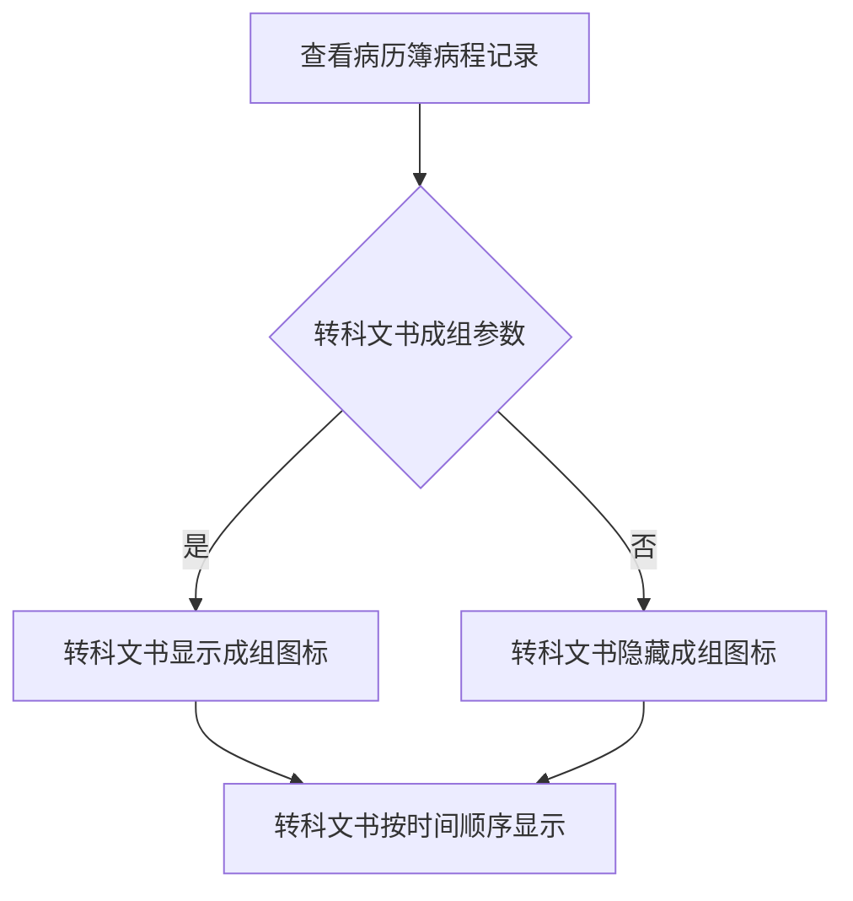
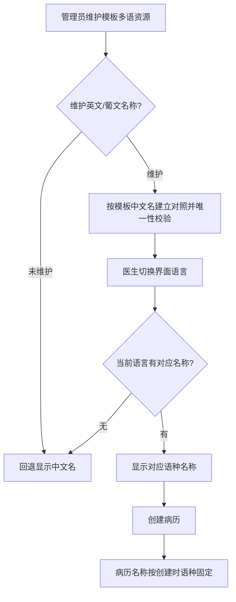

# BLGL-08-BLML-005文书分组与多语显示_ Analyst - Spec

> **需求编号**：BLGL-08-BLML-005
> **父需求**：BLGL-08-BLML
> **关联PM Spec**：BLGL-08-BLML-005_文书分组与多语显示_PM-spec.md
> **Spec版本**：V1.0
> **编写时间**：2026-08-15
> **编写人**：需求分析师

---

## 一、功能编号体系

> 使用带父子层级的 `<功能编号>-ID` 编号，便于追溯和讨论。

### 1.1 功能层级结构

```
BLGL-08-BLML-005: 文书分组与多语显示
 ├─ BLGL-08-BLML-005-01: 转科文书成组
 ├─ BLGL-08-BLML-005-02: 手术相关记录分组
 └─ BLGL-08-BLML-005-03: 模板名称多语维护与展示
```

### 1.2 功能编号表

| REQ-ID | 功能名称 | 类型 | 优先级 | 说明 |
|--------|---------|------|--------|
| BLGL-08-BLML-005 | 文书分组与多语显示 | 功能 | P1 | 转科文书成组、手术分组、多语显示（L2） |
| BLGL-08-BLML-005-01 | 转科文书成组 | 子功能 | P1 | 转科文书成组显示开关 |
| BLGL-08-BLML-005-02 | 手术相关记录分组 | 子功能 | P1 | 手术相关记录分组/移动 |
| BLGL-08-BLML-005-03 | 模板名称多语维护与展示 | 子功能 | P1 | 英文/葡文名称维护与按语言展示 |

---

## 二、核心业务流程

> 每个主流程一个 Mermaid flowchart。**流程步骤必须能在需求原文中找到对应描述，不推测中间步骤。**

### 2.1 转科文书成组



### 2.2 模板名称多语展示



---

## 三、功能规格说明

> 每个 REQ-ID 展开详细描述，包含功能概述、用户角色、业务流程、验收标准。

---

### BLGL-08-BLML-005-01: 转科文书成组

#### 3.1.1 功能概述

病历簿的转科文书成组优化：目前转入转出文书成对显示，不是按创建时间顺序显示；新增转科文书成组的开关参数，控制转科文书显示成组图标。

#### 3.1.2 用户角色

| 角色 | 使用场景 | 权限要求 | 操作频率 |
|------|---------|---------|---------|
| 住院医生 | 查看转科文书成组 | 无特殊权限要求 | 中频 |

#### 3.1.3 业务流程（Given/When/Then）

##### 主流程（至少 1 个）

**Scenario 1: 转科文书成组展示**

```gherkin
Given:
 - 病历簿中转入转出文书已创建
 - 转科文书显示成组开关已开启

When:
 - 医生查看病历簿病程记录

Then:
 - 转科文书按时间顺序显示，显示成组图标
```

##### 异常流程（至少 3 个）

**Scenario 2: 业务异常——成组开关关闭**

```gherkin
Given:
 - 转科文书是否显示成组参数设置为"否"

When:
 - 医生查看病历簿病程记录

Then:
 - 转科文书隐藏成组的图标
```

**Scenario 3: 数据异常——参数未配置**

```gherkin
Given:
 - 转科文书是否显示成组参数未配置

When:
 - 医生查看病历簿病程记录

Then:
 - 默认值为否，转科文书隐藏成组图标
```

**Scenario 4: 系统异常——成组图标渲染失败**

```gherkin
Given:
 - 成组图标渲染异常

When:
 - 医生查看病程记录

Then:
 - ⏳ 待确认：图标渲染失败时的降级展示未在资料区明确
```

##### 边界流程（至少 2 个）

**Scenario 5: 边界场景——无转科文书**

```gherkin
Given:
 - 患者无转入转出文书

When:
 - 医生查看病程记录

Then:
 - ⏳ 待确认：无转科文书时的展示未在资料区明确
```

**Scenario 6: 边界场景——多对转科文书**

```gherkin
Given:
 - 患者有多对转入转出文书

When:
 - 医生查看病程记录

Then:
 - 转科文书按时间顺序显示
```

#### 3.1.4 数据字段定义

| 字段名 | 类型 | 必填 | 默认值 | 取值范围 | 说明 | 概念ID |
|--------|------|------|--------|---------|------|--------|
| ⏳ 待确认 | ⏳ 待确认 | ⏳ 待确认 | - | - | 转科文书成组相关字段未在资料区明确 | ⏳ 待确认 |

#### 3.1.5 验收标准

| AC编号 | 验收标准 | 对应REQ-ID | 验证方法 | 验证场景 |
|--------|---------|-----------|--------|
| AC-001 | 成组开关设为是时转科文书显示成组图标，设为否时隐藏成组图标 | BLGL-08-BLML-005-01 | 功能测试 | Scenario 1/2 |

---

### BLGL-08-BLML-005-02: 手术相关记录分组

#### 3.2.1 功能概述

手术相关记录分组、手术医嘱开立后手动分组。病历簿支持将手术记录移动到某个子目录下。

#### 3.2.2 用户角色

| 角色 | 使用场景 | 权限要求 | 操作频率 |
|------|---------|---------|---------|
| 住院医生 | 查看/移动手术相关记录分组 | 病历书写权限 | 中频 |

#### 3.2.3 业务流程（Given/When/Then）

##### 主流程（至少 1 个）

**Scenario 1: 手术记录移动到子目录**

```gherkin
Given:
 - 病历簿中存在手术记录

When:
 - 医生将手术记录移动到某个子目录下

Then:
 - 手术记录移动到指定子目录
```

##### 异常流程（至少 3 个）

**Scenario 2: 业务异常——目标子目录不可用**

```gherkin
Given:
 - 目标子目录不可用

When:
 - 医生移动手术记录

Then:
 - ⏳ 待确认：目标目录不可用时的处理未在资料区明确
```

**Scenario 3: 数据异常——手术记录不存在**

```gherkin
Given:
 - 手术记录不存在或已删除

When:
 - 医生移动手术记录

Then:
 - ⏳ 待确认：记录不存在时的处理未在资料区明确
```

**Scenario 4: 系统异常——移动接口失败**

```gherkin
Given:
 - 手术记录移动接口异常

When:
 - 医生移动手术记录

Then:
 - ⏳ 待确认：移动失败的提示与回滚未在资料区明确
```

##### 边界流程（至少 2 个）

**Scenario 5: 边界场景——手术医嘱开立后手动分组**

```gherkin
Given:
 - 手术医嘱已开立

When:
 - 医生手动分组手术相关记录

Then:
 - 手术医嘱开立后手动分组
```

**Scenario 6: 边界场景——多份手术记录分组**

```gherkin
Given:
 - 存在多份手术相关记录

When:
 - 医生进行分组

Then:
 - ⏳ 待确认：多份记录的分组行为未在资料区明确
```

#### 3.2.4 数据字段定义

| 字段名 | 类型 | 必填 | 默认值 | 取值范围 | 说明 | 概念ID |
|--------|------|------|--------|---------|------|--------|
| ⏳ 待确认 | ⏳ 待确认 | ⏳ 待确认 | - | - | 手术记录分组相关字段未在资料区明确 | ⏳ 待确认 |

#### 3.2.5 验收标准

| AC编号 | 验收标准 | 对应REQ-ID | 验证方法 | 验证场景 |
|--------|---------|-----------|--------|
| AC-002 | 手术记录可移动到指定子目录，分组生效 | BLGL-08-BLML-005-02 | 功能测试 | Scenario 1 |

---

### BLGL-08-BLML-005-03: 模板名称多语维护与展示

#### 3.3.1 功能概述

在原有"多语资源库"中按模板中文名称为对照，维护每个住院病历模板的英文、葡文名称资源；创建病历时模板名称按医生当前界面语言自动显示对应语种名称。

#### 3.3.2 用户角色

| 角色 | 使用场景 | 权限要求 | 操作频率 |
|------|---------|---------|---------|
| 管理员 | 维护模板名称多语资源 | 多语资源维护权限 | 低频 |
| 住院医生 | 英文/葡文界面创建病历查看模板名称 | 无特殊权限要求 | 中频 |

#### 3.3.3 业务流程（Given/When/Then）

##### 主流程（至少 1 个）

**Scenario 1: 模板名称多语维护与展示**

```gherkin
Given:
 - 管理员进入多语资源库维护界面
 - 已按模板中文名称建立对照

When:
 - 管理员维护英文、葡文名称并保存
 - 医生按偏好设置界面语言并创建病历

Then:
 - 模板名称显示为当前界面语言对应名称，未维护时回退中文
```

##### 异常流程（至少 3 个）

**Scenario 2: 业务异常——中文名称重名**

```gherkin
Given:
 - 两个模板中文名相同

When:
 - 管理员分别维护多语名称

Then:
 - 系统提示中文名称重复，需区分后再维护
```

**Scenario 3: 数据异常——某语种未维护**

```gherkin
Given:
 - 某模板仅维护中文名，英文、葡文名称未维护

When:
 - 医生在英文/葡文界面创建病历

Then:
 - 该模板回退显示中文名
```

**Scenario 4: 系统异常——多语资源库查询失败**

```gherkin
Given:
 - 多语资源库翻译/查询接口异常

When:
 - 医生创建病历获取模板名称

Then:
 - ⏳ 待确认：多语名称获取失败的降级展示未在资料区明确
```

##### 边界流程（至少 2 个）

**Scenario 5: 边界场景——创建后名称固定**

```gherkin
Given:
 - 医生在英文界面下创建病历

When:
 - 切换界面语言为中文后查看病历目录

Then:
 - 已创建病历名称保持创建时的英文名称不变
```

**Scenario 6: 边界场景——所有模板类型支持**

```gherkin
Given:
 - 知情同意书、病程记录、入院记录等模板类型

When:
 - 分别验证多语名称维护与展示

Then:
 - 所有模板类型均支持多语名称维护与展示
```

#### 3.3.4 数据字段定义

| 字段名 | 类型 | 必填 | 默认值 | 取值范围 | 说明 | 概念ID |
|--------|------|------|--------|---------|------|--------|
| EMR_MRT_NAME | String | 否 | - | - | 模板名称字段 | ⏳ 待确认 |
| EMR_MRT_DISP_NAME | String | 否 | - | - | 模板显示名称字段 | ⏳ 待确认 |
| 英文名称 | String | 否 | 空 | - | 多语资源库维护，为空回退中文名 | ⏳ 待确认 |
| 葡文名称 | String | 否 | 空 | - | 多语资源库维护，为空回退中文名 | ⏳ 待确认 |
| LANGUAGE_TYPE_CODE | Long | 否 | - | - | 语言类型代码 | ⏳ 待确认 |

#### 3.3.5 验收标准

| AC编号 | 验收标准 | 对应REQ-ID | 验证方法 | 验证场景 |
|--------|---------|-----------|--------|
| AC-003 | 英文界面创建病历时，已维护英文名的模板显示英文名，未维护的显示中文名 | BLGL-08-BLML-005-03 | 功能测试 | Scenario 1/3 |
| AC-004 | 英文界面下创建的病历，切换界面语言后名称保持英文不变 | BLGL-08-BLML-005-03 | 功能测试 | Scenario 5 |
| AC-005 | 两个模板中文名相同时，维护多语名称系统提示中文名称重复 | BLGL-08-BLML-005-03 | 功能测试 | Scenario 2 |

---

## 四、排除范围

本需求不包含以下功能项：

1. **病历目录配置（启停用/挂URL/通用专科目录）** - 属 BLGL-08-BLML-001
2. **模板目录映射与顺序调整** - 属 BLGL-08-BLML-002
3. **文书目录展示（签名标志/数量显示/展开收起）** - 属 BLGL-08-BLML-003
4. **病历新建与模板选择** - 属 BLGL-08-BLML-004
5. **病历内容的多语翻译（生成/审核多语言病历）** - 属多语言病历业务态（InpEmrI18nController）
6. **框架葡文界面切换** - 由平台版本另行支持

---

## 五、业务规则清单

| 规则ID | 规则名称 | 规则描述 | 优先级 |
|--------|---------|---------|--------|
| BR-001 | 转科文书成组参数 | 参数路径：记录域/病历配置/病历业务配置/住院通用配置；参数名"转科文书是否显示成组"；设置值 是/否，默认否 | P1 |
| BR-002 | 转科文书成组图标 | 参数为是，转科文书显示成组图标；参数为否，隐藏成组图标 | P1 |
| BR-003 | 模板多语对照维护 | 按模板中文名称为对照维护英文/葡文名称，英文/葡文为可选维护项 | P1 |
| BR-004 | 未维护回退中文 | 某语种未维护时，该语种展示回退原名称 | P1 |
| BR-005 | 中文名唯一性校验 | 模板中文名称作为对照键，维护时对中文名称做唯一性校验 | P1 |
| BR-006 | 创建后名称固定 | 创建后病历名称按创建时语种固定，不随框架语言切换变化 | P1 |
| BR-007 | 葡文界面切换边界 | 多语资源库新增葡文语言数据支撑；框架葡文界面切换由平台版本另行支持，本次不涉及 | P1 |

---

## 六、关联文档

| 文档类型 | 文档路径 | 说明 |
|---------|---------|
| 功能点Spec | BLGL-08-BLML 病历目录功能点Spec.md（V1.0，上级目录） | Phase 1 功能点索引 |
| PM spec | 本目录 BLGL-08-BLML-005_文书分组与多语显示_PM-spec.md（V0.1） | PM 产出的 Spec 文档 |
| -Spec | 本目录 BLGL-08-BLML-005_文书分组与多语显示-Spec.md（V1.0） | 业务背景与目标 Spec |
| data-model.md | 待产出 | 架构师产出的数据建模文档 |
| design.md | 待产出 | 架构师产出的技术方案文档 |
| api-contract.md | 待产出 | 开发经理产出的 API 契约文档 |

---

## 七、待确认问题清单

| 编号 | 问题描述 | 缺失信息 | 影响范围 | 建议补充方 |
|------|---------|---------|--------|
| Q-001 | EMR_MRT_NAME/EMR_MRT_DISP_NAME 字段在代码仓库中未定位到住院病历实体的声明 | 模板名称字段归属表/实体 | 第4章数据模型 | 架构师/开发经理 |
| Q-002 | 多语资源库维护接口的具体路径未在代码扫描中定位 | 多语资源库接口路径 | 第5章接口契约 | 开发经理 |
| Q-003 | 成组图标渲染失败、无转科文书时的展示未在资料区明确 | 异常/边界展示 | 第3章场景 | 产品经理 |
| Q-004 | 手术记录移动时目标目录不可用、记录不存在、接口失败的异常处理未在资料区明确 | 异常处理 | 第3章场景 | 产品经理 |
| Q-005 | 多语资源库查询失败时的降级展示未在资料区明确 | 降级策略 | 第3章场景 | 产品经理 |
| Q-006 | 手术记录分组的字段结构未在资料区明确 | 字段结构 | 第3章数据字段定义 | 产品经理/开发经理 |
| Q-007 | 本功能点的性能/安全/可用性指标未在资料区提供 | 非功能指标 | 第8章非功能要求 | 产品经理 |
| Q-008 | 模板多语相关字段的概念ID未在资料区明确 | 概念ID | 第3章数据字段定义 | 产品经理 |

---

## 填写检查清单

| 序号 | 检查项 | 是否完成 |
|:----:|--------|:--------:|
| 1 | 功能编号带父子层级 | ✅ |
| 2 | 每个 REQ-ID 有功能概述和用户角色 | ✅ |
| 3 | 主流程至少 1 个 Given/When/Then 场景 | ✅ |
| 4 | 异常流程至少 3 个 Given/When/Then 场景 | ✅ |
| 5 | 边界流程至少 2 个 Given/When/Then 场景 | ✅ |
| 6 | 每个 Given/When/Then 内容具体，不模糊 | ✅ |
| 7 | 数据字段定义完整（字段名、类型、必填、说明、概念ID） | ✅（概念ID ⏳） |
| 8 | 验收标准 AC 编号独立，可验证 | ✅ |
| 9 | 验收标准无"功能正常"等模糊表述 | ✅ |
| 10 | 排除范围明确列出 | ✅ |
| 11 | 业务规则清单列出所有规则，每条标注来源 | ✅（7 条） |
| 12 | 流程图使用 Mermaid 格式（≥2 个） | ✅ |
| 13 | 关联文档索引包含 Phase 1 功能点Spec | ✅ |
| 14 | 待确认问题清单汇总了全文所有 ⏳ 项 | ✅ |
| 15 | 全文无占位符 `< >` 残留 | ✅ |
| 16 | 全文陈述可溯源至资料区（S1~S10 溯源核查） | ✅ |
| 17 | 人工审核确认完成 | ⏳ 待确认 |

---

**文档状态**：⬜ 待审核
**维护责任**：需求分析师规范组
**下次更新**：根据评审反馈优化

---

## 版本历史

| 版本 | 日期 | 变更说明 | 编写人 |
|------|------|---------|--------|
| V1.0 | 2026-08-15 | 初始版本 | 需求分析师 |
