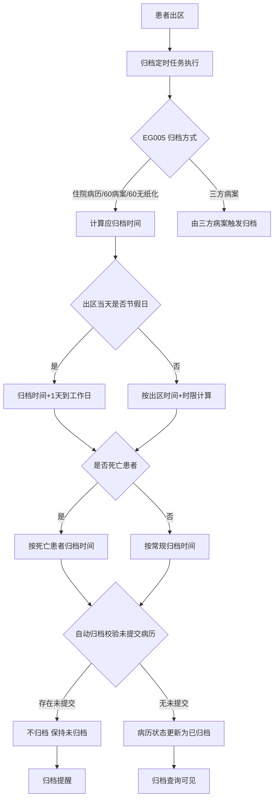
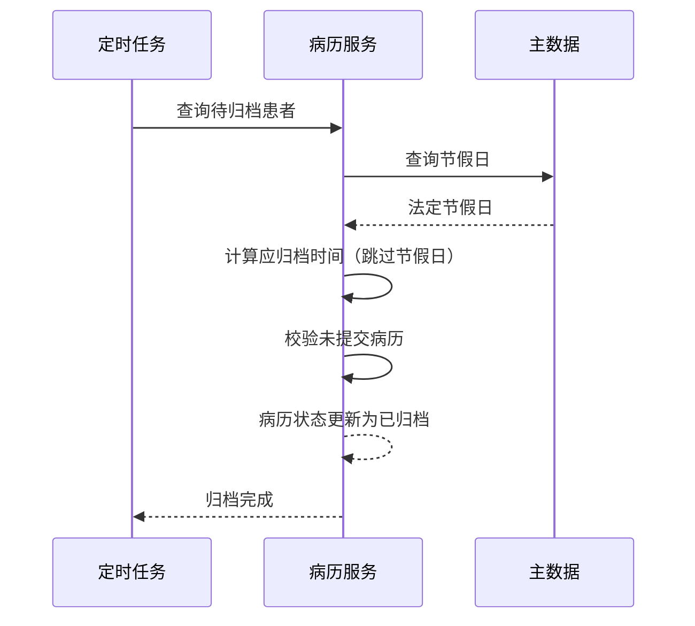

# BLGL-09-GDJY-001 病历自动归档 - Spec

> **功能编号**：BLGL-09-GDJY-001
> **文档类型**：功能Spec（业务背景与设计）
> **文档版本**：V1.0
> **编写时间**：2026-08-15
> **编写人**：RACC

---

## 文档索引

#### 章节索引

**Spec（研发视角）**

| 章节号 | 章节名称 | 内容说明 |
|--------|---------|---------|
| 1、 | 文档概述 | 文档目的、文档范围、术语定义、阅读指南、参考文档 |
| 2、 | 功能背景与定位 | 功能背景、功能定位、目标用户、核心价值 |
| 3、 | 业务流程设计 | 主流程/异常流程/边界流程（Given/When/Then） |
| 4、 | 数据模型设计 | 核心数据结构、状态定义、系统参数定义 |
| 5、 | 接口契约设计 | API列表、接口详细设计、错误码定义 |
| 6、 | 技术方案设计 | 页面路径、技术栈、关键技术点、部署方案 |
| 7、 | 测试用例预设计 | 功能/边界/异常/性能测试用例 |
| 8、 | 非功能性要求 | 性能、安全、可用性、兼容性 |
| 9、 | 依赖与风险 | 外部依赖、风险项 |
| 10、 | 附录 | 流程图、时序图、参考文档 |

**PM-Spec（业务视角）**

| 章节号 | 章节名称 | 内容说明 |
|--------|---------|---------|
| 一 | 目标 | 功能定位与核心价值 |
| 二 | 约束 | 业务/技术/非功能性约束 |
| 三 | 验收标准 | 验收条件与验证方法 |
| 四 | 排除范围 | 本次不做项与明确边界 |
| 五 | 关键决策记录 | 方案决策与选型理由 |
| 六 | 优先级 | 优先级定义 |
| 七 | 关联文档 | 关联文档索引 |
| 附录 | 填写检查清单 | 质量检查 |

**Analyst-Spec（产品视角）**

| 章节号 | 章节名称 | 内容说明 |
|--------|---------|---------|
| 一 | 功能编号体系 | 功能编号与层级结构 |
| 二 | 核心业务流程 | 核心业务流程与时序 |
| 三 | 功能规格说明 | 详细功能规格与验收标准 |
| 四 | 排除范围 | 排除范围 |
| 五 | 业务规则清单 | 业务规则清单 |
| 六 | 关联文档 | 关联文档索引 |
| 七 | 待确认问题清单 | 待确认问题汇总 |
| - | 填写检查清单 | 质量检查 |

#### 版本历史

| 版本 | 日期 | 变更说明 | 编写人 |
|------|------|---------|--------|
| V1.0 | 2026-08-15 | 初始版本 | RACC |

#### 关联文档索引

| 序号 | 文档名称 | 文档类型 | 版本 | 位置 |
|------|---------|---------|------|------|
| 1 | BLGL-09-GDJY 归档借阅功能点Spec.md | 功能点Spec（模块级） | V1.0 | 上级目录 |
| 2 | BLGL-09-GDJY-001_病历自动归档-Spec.md | 功能Spec（业务背景与设计）（本文档） | V1.0 | 本目录 |
| 3 | BLGL-09-GDJY-001_病历自动归档_Analyst-spec.md | Analyst-Spec（分析规格） | V1.0 | 本目录 |
| 4 | BLGL-09-GDJY-001_病历自动归档_PM-spec.md | PM-Spec（需求规格） | V0.1 | 本目录 |

---

## 1、文档概述

### 1.1、文档目的

本文档旨在明确"病历自动归档"功能（BLGL-09-GDJY-001）的业务背景与设计方案，为需求分析、研发实现、测试验收及评审提供统一的业务上下文、设计口径与决策依据。

**具体目的包括**：

1. 梳理病历自动归档功能的业务由来与历史需求演进脉络，说明"为什么要做"；
2. 明确功能的定位边界、目标用户与核心价值，回答"做成什么"；
3. 描述功能的业务流程、数据模型、接口契约与技术方案，回答"怎么做"；
4. 预设计测试用例并明确非功能性要求、依赖与风险，为研发与验收提供依据；
5. 作为 Analyst-Spec 的业务前提与设计输入，保证各层文档业务口径一致。

### 1.2、文档范围

#### 1.2.1 纳入范围

本文档覆盖病历自动归档的完整业务背景与设计，包括：

- 自动归档时间计算：按参数首次归档时间，节假日/周末顺延、补班处理
- 死亡患者归档：死亡患者首次/再次自动归档时间设置
- 自动归档豁免：研究型病房/不会自动归档科室不自动归档
- 自动归档校验：自动归档程序校验患者存在未提交病历（除会诊记录外）不归档
- 归档方式配置：EG005 归档方式（住院病历/60病案/60无纸化/三方病案）影响自动归档
- 自动归档作业：归档定时任务执行、自动归档日志
- 归档状态更新：自动归档后将病历状态更新为已归档，病案首页归档纳入流程

#### 1.2.2 排除范围

本文档不涉及以下内容（详见其他功能点或模块）：

- 病历手动归档（医生/病案室手动操作）—— BLGL-09-GDJY-002
- 病历撤销归档（撤销归档审批流程）—— BLGL-09-GDJY-003
- 病历召回申请/召回审核 —— BLGL-09-GDJY-004/-005
- 病历借阅流程 —— BLGL-09-GDJY-006
- 三方病案系统对接（归档状态同步）—— BLGL-09-GDJY-007
- 归档校验与提醒（归档前校验/提醒消息）—— BLGL-09-GDJY-009
- 归档配置与豁免（归档参数配置）—— BLGL-09-GDJY-010

### 1.3、术语定义

| 术语 | 定义 |
|------|------|
| 自动归档 | 患者出区后由归档定时任务按参数自动将病历置为归档状态 |
| EG001 | 病历首次归档时间参数，控制出区后首次自动归档时限 |
| EG003 | 病历自动归档时间计算方式参数，可设置为出区时间 |
| EG008 | 病历不会自动归档的临床科室参数，配置的科室不自动归档 |
| EG009/EG010 | 死亡患者病历首次/撤销后再次自动归档时间参数 |
| 归档方式（EG005） | 住院病历归档方式：住院病历/60病案/60无纸化/三方病案 |

### 1.4、阅读指南

- **章节关系**：第1~2章为业务全貌，第3~10章为设计实现层。与 Analyst-Spec、PM-Spec 互相引用保持一致。
- **读者对象**：产品经理/需求分析师读第1~2章；研发读第3~6、9~10章；测试读第3、7~8章；评审人员核对各层一致性。

### 1.5、参考文档

| 序号 | 文档名称 | 版本/日期 |
|------|---------|----------|
| 1 | 【历史需求】住院病历的历史需求.xlsx | - |
| 2 | BLGL-09-GDJY-001_病历自动归档_PM-spec.md | V0.1 |
| 3 | BLGL-09-GDJY-001_病历自动归档_Analyst-spec.md | V1.0 |
| 4 | BLGL-09-GDJY 归档借阅功能点Spec.md | V1.0 |

---

## 2、功能背景与定位

### 2.1 功能背景

病历自动归档是归档借阅模块的核心起点，需满足：

- **现状痛点**：设置的归档时间包含节假日，出区患者病历未按工作日归档；节假日出区患者归档时间计算不准确；部分患者病历到期未自动归档
- **管理要求**：死亡患者再次归档时间需支持配置；研究型病房/特定科室病历不自动归档
- **历史需求演进**：病历归档时间优化→ 节假日出区归档时间+1天→ 归档从工作日 00:00 开始算→ 自动归档校验未提交病历（0）→ 归档方式 EG005 拓展三方病案（5、1282281）

### 2.2 功能定位

"病历自动归档"是 WiNEX 病历管理-归档借阅的核心起点，定位为：

- **自动归档执行**：出区患者按参数由定时任务自动归档
- **时间规则**：节假日/工作日/补班/死亡患者归档时间参数化
- **归档校验**：自动归档前校验未提交病历（除会诊记录外）不归档

### 2.3 目标用户

| 用户角色 | 主要使用场景 |
|---------|-------------|
| 住院医生 | 患者出区后病历自动归档，无需手动操作 |
| 病案室管理员 | 查看自动归档状态/结果 |
| 病案管理员 | 配置归档时间/豁免科室参数 |

### 2.4 核心价值

| 价值维度 | 价值描述 |
|---------|---------|
| 归档及时 | 出区患者按参数自动归档，无需人工干预 |
| 时间合规 | 归档时间按工作日计算，节假日顺延 |
| 归档准确 | 未提交病历不归档，避免不完整归档 |

---

## 3、业务流程设计（Given/When/Then）

### 3.1 主流程

**Scenario 1: 患者出区后自动归档**

```gherkin
Given:
  - 患者已出区
  - 归档定时任务已配置（默认凌晨1点执行）
  - 病历首次归档时间参数 EG001 已设置

When:
  - 归档定时任务执行

Then:
  - 计算患者应归档时间（出区时间+首次归档时限，跳过节假日/周末）
  - 校验患者病历是否已提交（无草稿/新建状态病历，除会诊记录外）
  - 校验通过则将病历状态更新为已归档
```

### 3.2 异常流程

**Scenario 2: 业务异常——存在未提交病历**

```gherkin
Given:
  - 参数"自动归档程序是否校验患者存在未提交病历"=是

When:
  - 自动归档程序执行

Then:
  - 患者存在未提交病历（除会诊记录外）时不归档
  - 保持病历未归档状态
```

**Scenario 3: 数据异常——节假日出区**

```gherkin
Given:
  - 患者出区当天是节假日

When:
  - 计算自动归档时间

Then:
  - 出区当天是节假日直接+1天，以此类推到工作日
  - 节假日出区患者归档时间从下个工作日的 00:00+时限开始计算
```

**Scenario 4: 系统异常——自动归档未生效**

```gherkin
Given:
  - 出院患者的病历未自动归档

When:
  - 归档定时任务执行

Then:
  - 病历未自动归档（问题）
  - 需排查参数配置（EG001/EG003）或定时任务
```

### 3.3 边界流程

**Scenario 5: 边界——死亡患者归档**

```gherkin
Given:
  - 患者死亡
  - 参数"死亡患者首次自动归档时间设置（天数）"=7

When:
  - 死亡患者出区

Then:
  - 按死亡患者归档时间自动归档（默认 7 天）
  - 召回后再次归档按"死亡患者再次归档时间设置（天数）"
```

**Scenario 6: 边界——研究型病房豁免**

```gherkin
Given:
  - 参数"病历不会自动归档的临床科室"配置了研究型病房

When:
  - 研究型病房患者出区/撤销提交

Then:
  - 不通过定时任务自动归档
```

---

## 4、数据模型设计

### 4.1 核心数据结构

#### 4.1.1 核心保存请求

| 字段名 | 类型 | 必填 | 备注 |
|--------|------|------|------|
| inpRhbRecordId | Long | 是 | 住院病历患者就诊主记录 ID |
| encounterId | Long | 是 | 就诊标识 |
| 归档状态 | String | 是 | 已归档/未归档/已召回 |

> ⏳ 待确认：自动归档接口完整入参/出参以代码扫描和 API 契约为准。

#### 4.1.2 核心表/实体

| 表/实体 | 关键字段 | 说明 |
|---------|---------|------|
| INPATIENT_EMR_ARCHIVE（InpatientEmrArchivePO） | inpatEmrSetFilingId(INP_EMR_ARCHIVE_ID)、inpatRhbRecordId(INP_RHB_RECORD_ID)、statusCode(INP_EMR_ARCHIVE_STATUS)、inpatEmrSetFilingAt(INP_EMR_ARCHIVED_AT)、inpatEmrSetFilingTypeCode(INP_EMR_ARCHIVE_TYPE_CODE)、deptId、cancelArchiveFlag(CANCEL_ARCHIVE_FLAG) | 住院病历归档表 |
| INP_EMR_ARCHIVE_STATISTICS（InpEmrArchiveStatisticsPO） | planFilingCollectNum(PLAN_ARCHIVE_EMR_COUNT)、manulFilingCollectNum(MAN_ARCHIVE_EMR_COUNT)、autoFilingCollectNum(AUTO_ARCHIVE_EMR_COUNT)、recallFilingCollectNum(RECALL_ARCHIVE_EMR_COUNT)、filingCollectDate(INP_EMR_ARCH_STAT_DATE) | 归档统计表 |

### 4.2 状态定义

| 状态码 | 状态名称 | 说明 |
|--------|---------|------|
| 399058142 | 已归档 | 病历归档状态（FilingStatusConstant.ARCHIVE，代码） |
| 399058143 | 未归档 | 病历归档状态（FilingStatusConstant.UNARCHIVE，代码） |
| 399291265 | 已召回 | 病历归档状态（FilingStatusConstant.RECALLED，代码） |

### 4.3 系统参数定义

| 参数编码 | 参数名称 | 说明 |
|---------|---------|------|
| EG001 | 病历首次归档时间 | 出区后首次自动归档时限 |
| EG002 | 撤销后再次归档的时间 | 召回/撤销归档后再次归档时限 |
| EG003 | 病历自动归档时间计算方式 | 可设置为出区时间 |
| EG008 | 病历不会自动归档的临床科室 | 配置的科室不自动归档 |
| EG009 | 死亡患者病历首次归档时间 | 原"死亡患者自动归档小时数"，默认 168h 改 7 天 |
| EG010 | 死亡患者撤销后再次归档时间 | 死亡患者再次归档时间 |
| EG005 | 住院病历归档方式 | 住院病历/60病案/60无纸化/三方病案 |
| - | 自动归档程序是否校验患者存在未提交病历 | 是/否，默认否，存在时不归档 |

---

## 5、接口契约设计

### 5.1 API列表

| 序号 | API名称（代码函数） | 路径 | 方法 | 说明 |
|:----:|---------|------|:----:|------|
| 1 | 查询病历簿列表信息 | /api/v1/app_record_inpatient/emr_inpatient/emr_rhb_record_list/query/by_example | POST | 归档查询（入参 InpatEmrRHBRecordListQueryByExampleInputAO，出参 List<InpatEmrRHBRecordListQueryOutputVO>） |
| 2 | 查询病历归档统计信息 | /api/v1/app_record_inpatient/emr_inpatient/emr_filing_collect/query/by_example | POST | 归档统计（入参 InpatientEmrFilingCollectQueryInputAO） |
| 3 | 根据 encounterId 查询病历簿归档相关信息 | /api/v1/app_record_inpatient/emr_inpatient/rhb_archive_info/query/by_encounter_id | POST | 归档信息查询（入参 InpEmrRhbArchiveQueryInputAO，出参 InpEmrRhbArchiveInfoOutputVO） |
| 4 | 归档校验 | /api/v1/app_record_inpatient/inpatient_emr_template/emr_filing_by_hand/check | POST | 归档校验（入参 InpatientEmrSetInputAO，出参 InpEmrFilingCheckOutputVO） |
| 5 | 查询节假日 | /api/v2/base_mdm/holiday/query/by_example | POST | 查询国家法定节假日 |

### 5.2 接口详细设计

#### 5.2.1 查询病历簿列表信息（emr_rhb_record_list/query/by_example）

**请求参数**:
```json
{
  "keyword": "张三",
  "dutyDoctIds": [],
  "statusCodes": ["399058142"],
  "pageNo": 1,
  "pageSize": 20
}
```

**返回值（成功）**:
```json
{
  "success": true,
  "data": [
    {
      "inpRhbRecordId": "12345",
      "inpatEmrSetFilingId": "67890",
      "statusCode": "399058142",
      "inpatEmrSetFilingAt": "2026-08-14 10:00:00",
      "dutyDoctName": "张三"
    }
  ]
}
```

> ⏳ 待确认：接口字段名以代码扫描（InpatEmrRHBRecordListQueryOutputVO）和 API 契约为准。

**返回值（失败）**:
```json
{
  "success": false,
  "message": "查询归档状态失败",
  "data": null
}
```

### 5.3 错误码定义

| 错误码 | 错误信息 | 处理方式 |
|--------|---------|---------|
| ⏳ 待确认 | 存在未提交病历不允许归档 | 病历保持未归档状态 |

---

## 6、技术方案设计

### 6.1 页面路径

- **页面路径**: 住院医生站→日常管理→病历归档→归档查询/手动归档（自动归档由后台定时任务触发）
- **后台任务**: 归档定时任务（默认凌晨1点执行）
- **后端模块**: winning-emr-ipt-archive/winning-emr-ipt-archive-provider/controller/InpEmrArchiveController.java（查询病历簿列表信息、查询归档统计信息、归档校验）
- **前端 API**: winning-webui-inpatient-clinicalnote-pango/src/pages/ClinicalnoteArchiveManage/api/index.js（apiQueryInpatClinicalnoteRecord → emr_rhb_record_list/query/by_example、apiInpatFilingCollectQu → emr_filing_collect/query/by_example、queryArchiveFailEmr → emr_filing_by_hand/check）

### 6.2 技术栈

| 类别 | 技术 | 版本 |
|------|------|------|
| 前端框架 | Vue | 2.6.14 |
| 前端UI | element-ui | 2.13.0 |
| 后端框架 | Spring Boot（Java 17）+ JPA/Hibernate | - |
| RPC | winning-akso-rpc-rest（WinRpcResponse/WinPostMapping） | - |
| 归档模块 | winning-emr-ipt-archive（provider/application/bridge） | - |

### 6.3 关键技术点

- 归档定时任务查询明天晚上将要归档的患者
- 节假日查询接口 /api/v2/base_mdm/holiday/query/by_example
- 归档时间从工作日 00:00 开始计算
- 归档状态枚举 FilingStatusConstant：ARCHIVE=399058142、UNARCHIVE=399058143、RECALLED=399291265

### 6.4 部署方案

⏳ 待确认：部署方案未在资料区中找到。

---

## 7、测试用例预设计

### 7.1 功能测试

| 用例编号 | 测试场景 | Given | When | Then |
|---------|---------|-------|------|------|
| TC-001 | 患者出区自动归档 | 患者已出区，定时任务配置 | 归档任务执行 | 病历状态更新为已归档（399058142） |
| TC-002 | 归档查询接口 | 归档查询界面 | 调用 emr_rhb_record_list/query/by_example | 返回病历簿列表（含归档状态字段） |
| TC-003 | 归档统计接口 | 归档统计界面 | 调用 emr_filing_collect/query/by_example | 返回归档统计信息（计划/手动/自动/召回数） |

### 7.2 边界测试

| 用例编号 | 测试场景 | Given | When | Then |
|---------|---------|-------|------|------|
| TC-004 | 节假日出区 | 出区当天是节假日 | 计算归档时间 | 归档时间+1天到工作日 |
| TC-005 | 死亡患者归档 | 死亡患者出区 | 计算归档时间 | 按死亡患者归档时间（默认7天） |

### 7.3 异常测试

| 用例编号 | 测试场景 | Given | When | Then |
|---------|---------|-------|------|------|
| TC-006 | 存在未提交病历 | 参数=是，患者有未提交病历 | 自动归档 | 不归档 |
| TC-007 | 归档校验失败 | 病历校验不通过 | 调用 emr_filing_by_hand/check | 返回校验结果，阻止归档 |

### 7.4 性能测试

| 用例编号 | 测试场景 | 指标 |
|---------|---------|------|
| TC-008 | 自动归档批量执行 | ⏳ 待确认：性能指标未在资料区中找到 |
| TC-009 | 归档查询接口响应 | ⏳ 待确认：性能指标未在资料区中找到 |

---

## 8、非功能性要求

### 8.1 性能要求

| 指标 | 要求 |
|------|------|
| 自动归档批量执行时间 | ⏳ 待确认 |

### 8.2 安全要求

| 要求 | 说明 |
|------|------|
| 归档权限 | 归档状态变更由系统定时任务/病案室执行 |

**医疗行业特殊要求**

| 要求 | 说明 |
|------|------|
| 归档完整性 | 未提交病历不归档，避免不完整归档影响病案 |

### 8.3 可用性要求

| 指标 | 要求值 |
|------|--------|
| 可用性 | ⏳ 待确认 |

### 8.4 兼容性要求

| 类型 | 要求 |
|------|------|
| 归档方式 | EG005 兼容住院病历/60病案/60无纸化/三方病案模式 |
| 病历类型 | 护理文书随病历归档（EMR_SOURCE_CODE 住院/护理渠道） |

---

## 9、依赖与风险

### 9.1 外部依赖

| 依赖项 | 说明 |
|--------|------|
| 主数据系统 | 节假日查询接口 |
| 三方病案系统 | 三方病案模式归档状态同步 |

### 9.2 风险项

| 风险项 | 等级 | 说明 | 应对方案 |
|--------|------|------|---------|
| 归档时间计算错误 | 中 | 节假日/补班/工作日计算复杂易错 | 严格按节假日查询接口+工作日计算 |
| 自动归档未生效 | 中 | 参数配置失效导致病历未归档 | 排查参数配置与定时任务 |

---

## 10、附录

### 10.1 流程图



### 10.2 时序图



### 10.3 参考文档

- BLGL-09-GDJY 归档借阅功能点Spec.md（V1.0，第5章 BLGL-09-GDJY-001 行）
- 关联Spec: BLGL-09-GDJY-001_病历自动归档_PM-spec.md、BLGL-09-GDJY-001_病历自动归档_Analyst-spec.md

---

## 填写检查清单

| 序号 | 检查项 | 是否完成 |
|:----:|--------|:--------:|
| 1 | 章节索引与正文章节一致 | ✅ |
| 2 | 版本历史记录完整 | ✅ |
| 3 | 关联文档索引已登记全部Spec | ✅ |
| 4 | 文档目的明确回答"为什么做/做成什么/怎么做" | ✅ |
| 5 | 纳入范围/排除范围清晰 | ✅ |
| 6 | 术语定义覆盖关键概念，从资料区可溯源 | ✅ |
| 7 | 参考文档已登记 | ✅ |
| 8 | 功能背景基于法规/规范/需求来源组织 | ✅ |
| 9 | 功能定位体现业务价值（3~5个定位点） | ✅ |
| 10 | 目标用户角色覆盖完整，在需求原文中有出处 | ✅ |
| 11 | 核心价值可陈述，与 Phase 1 口径一致 | ✅ |
| 12 | 业务流程：主流程≥1、异常≥3、边界≥2，Given/When/Then 具体 | ✅ |
| 13 | 数据模型：字段/表/状态/参数可溯源 | ✅ |
| 14 | 接口契约：API列表+详细设计+错误码齐全或标记待确认 | ✅ |
| 15 | 技术方案：页面路径/技术栈/关键点/部署方案或标记待确认 | ✅ |
| 16 | 测试用例：功能/边界/异常/性能覆盖 | ✅ |
| 17 | 非功能性要求：性能/安全/可用性/兼容性指标可量化或标记待确认 | ✅ |
| 18 | 依赖与风险：外部依赖登记完整 | ✅ |
| 19 | 附录：流程图/时序图与正文流程一致 | ✅ |
| 20 | 全文无占位符 `< >` 残留 | ✅ |
| 21 | 全文陈述可溯源至资料区 | ✅ |
| 22 | 人工审核确认完成 | ⏳ 待确认 |

---

**文档状态**：⬜ 待审核
**维护责任**：RACC
**下次更新**：根据评审反馈优化
