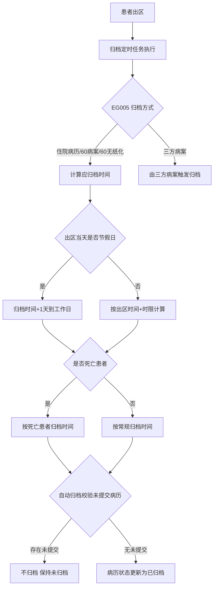
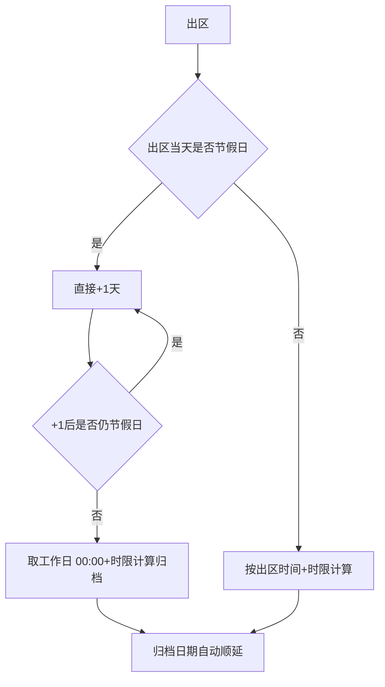

# BLGL-09-GDJY-001 病历自动归档 _ Analyst - Spec

> **需求编号**：BLGL-09-GDJY-001
> **父需求**：BLGL-09-GDJY
> **关联PM Spec**：BLGL-09-GDJY-001_病历自动归档_PM-spec.md
> **Spec版本**：V1.0
> **编写时间**：2026-08-15
> **编写人**：需求分析师

---

## 一、功能编号体系

### 1.1 功能层级结构

```
BLGL-09-GDJY-001-001: 自动归档时间计算
  ├─ BLGL-09-GDJY-001-001-01: 首次归档时间（EG001）
  ├─ BLGL-09-GDJY-001-001-02: 撤销后再次归档时间（EG002）
  ├─ BLGL-09-GDJY-001-001-03: 节假日/周末顺延
  └─ BLGL-09-GDJY-001-001-04: 归档时间计算方式（EG003）

BLGL-09-GDJY-001-002: 死亡患者归档
  ├─ BLGL-09-GDJY-001-002-01: 死亡患者首次归档时间（EG009）
  └─ BLGL-09-GDJY-001-002-02: 死亡患者再次归档时间（EG010）

BLGL-09-GDJY-001-003: 自动归档豁免
  └─ BLGL-09-GDJY-001-003-01: 不会自动归档科室（EG008）

BLGL-09-GDJY-001-004: 自动归档校验
  └─ BLGL-09-GDJY-001-004-01: 校验未提交病历（COMMON366）

BLGL-09-GDJY-001-005: 归档方式配置
  └─ BLGL-09-GDJY-001-005-01: EG005 归档方式（住院病历/60病案/60无纸化/三方病案）

BLGL-09-GDJY-001-006: 自动归档作业
  ├─ BLGL-09-GDJY-001-006-01: 归档定时任务
  └─ BLGL-09-GDJY-001-006-02: 自动归档日志
```

### 1.2 功能编号表

| REQ-ID | 功能名称 | 类型 | 优先级 | 说明 |
|--------|---------|------|--------|------|
| BLGL-09-GDJY-001-001 | 自动归档时间计算 | 功能 | P0 | 归档时间参数化计算 |
| BLGL-09-GDJY-001-001-01 | 首次归档时间 | 子功能 | P0 | EG001 出区后首次归档时限 |
| BLGL-09-GDJY-001-001-02 | 撤销后再次归档时间 | 子功能 | P0 | EG002 |
| BLGL-09-GDJY-001-001-03 | 节假日/周末顺延 | 子功能 | P0 | 节假日归档顺延到工作日 |
| BLGL-09-GDJY-001-001-04 | 归档时间计算方式 | 子功能 | P1 | EG003 出区时间等 |
| BLGL-09-GDJY-001-002 | 死亡患者归档 | 功能 | P1 | 死亡患者归档时间 |
| BLGL-09-GDJY-001-002-01 | 死亡患者首次归档时间 | 子功能 | P1 | EG009 默认 7 天 |
| BLGL-09-GDJY-001-002-02 | 死亡患者再次归档时间 | 子功能 | P1 | EG010 |
| BLGL-09-GDJY-001-003 | 自动归档豁免 | 功能 | P1 | 研究型病房不自动归档 |
| BLGL-09-GDJY-001-003-01 | 不会自动归档科室 | 子功能 | P1 | EG008 配置的科室不自动归档 |
| BLGL-09-GDJY-001-004 | 自动归档校验 | 功能 | P0 | 校验未提交病历 |
| BLGL-09-GDJY-001-004-01 | 校验未提交病历 | 子功能 | P0 | 存在未提交（除会诊记录）不归档 |
| BLGL-09-GDJY-001-005 | 归档方式配置 | 功能 | P0 | EG005 归档方式 |
| BLGL-09-GDJY-001-005-01 | EG005 归档方式 | 子功能 | P0 | 住院病历/60病案/60无纸化/三方病案 |
| BLGL-09-GDJY-001-006 | 自动归档作业 | 功能 | P1 | 归档定时任务 |
| BLGL-09-GDJY-001-006-01 | 归档定时任务 | 子功能 | P1 | 默认凌晨1点执行 |
| BLGL-09-GDJY-001-006-02 | 自动归档日志 | 子功能 | P2 | 归档日志增加自动归档日志 |

---

## 二、核心业务流程

### 2.1 自动归档主流程



### 2.2 节假日归档时间计算流程



---

## 三、功能规格说明

### BLGL-09-GDJY-001-001: 自动归档时间计算

#### 3.1.1 功能概述

参数中设置的自动归档时间和再次归档时间按工作日时间，如遇节假日或周六周日则归档日期自动顺延；节假日或周末的法定休息日不执行病历归档。查询节假日接口（/api/v2/base_mdm/holiday/query/by_example）返回国家法定节假日。节假日出区患者，先判断出区当天是否节假日，是则+1天到工作日；归档时间从工作日 00:00+时限开始计算。

#### 3.1.2 用户角色

| 角色 | 使用场景 | 权限要求 | 操作频率 |
|------|---------|---------|---------|
| 病案管理员 | 配置归档时间参数 | 配置权限 | 低频 |

#### 3.1.3 业务流程（Given/When/Then）

**Scenario 1: 首次归档时间计算（主流程）**

```gherkin
Given:
  - 参数 EG001 病历首次归档时间已设置
  - 患者已出区

When:
  - 归档定时任务执行

Then:
  - 计算应归档时间（出区时间+首次归档时限）
  - 跳过节假日/周六周日
```

**Scenario 2: 节假日出区顺延**

```gherkin
Given:
  - 患者出区当天是节假日

When:
  - 计算自动归档时间

Then:
  - 先判断出区当天是否节假日
  - 是则直接+1天，以此类推到工作日
  - 归档时间从下个工作日的 00:00+时限开始计算
```

**Scenario 3: 边界——补班日**

```gherkin
Given:
  - 国家规定的补班日期（主数据提供）

When:
  - 归档时间计算

Then:
  - 补班日期按工作日处理
```

#### 3.1.4 数据字段定义

| 字段名 | 类型 | 必填 | 默认值 | 取值范围 | 说明 | 概念ID |
|--------|------|------|--------|---------|------|--------|
| 病历首次归档时间 | Integer | 否 | - | 天数 | EG001 | ⏳ 待确认 |
| 撤销后再次归档时间 | Integer | 否 | - | 天数 | EG002 | ⏳ 待确认 |
| 病历自动归档时间计算方式 | String | 否 | - | 出区时间等 | EG003 | ⏳ 待确认 |
| inpatEmrSetFilingId | Long | 是 | - | - | 归档表主键（INP_EMR_ARCHIVE_ID，代码 InpatientEmrArchivePO） | ⏳ 待确认 |
| inpatRhbRecordId | Long | 是 | - | - | 病历簿 ID（INP_RHB_RECORD_ID，代码） | ⏳ 待确认 |
| statusCode | Long | 是 | - | 399058142/399058143/399291265 | 归档状态（INP_EMR_ARCHIVE_STATUS，代码 FilingStatusConstant） | ⏳ 待确认 |
| inpatEmrSetFilingAt | Date | 否 | - | - | 归档时间（INP_EMR_ARCHIVED_AT，代码） | ⏳ 待确认 |
| inpatEmrSetFilingTypeCode | Long | 否 | - | 自动/手动归档类型 | 归档类型编码（INP_EMR_ARCHIVE_TYPE_CODE，代码） | ⏳ 待确认 |
| cancelArchiveFlag | Long | 否 | - | - | 撤销归档标记（CANCEL_ARCHIVE_FLAG，代码） | ⏳ 待确认 |

#### 3.1.5 验收标准

| AC编号 | 验收标准 | 对应REQ-ID | 验证方法 | 验证场景 |
|--------|---------|-----------|---------|---------|
| AC-001 | 归档时间按工作日计算，节假日/周末顺延 | BLGL-09-GDJY-001-001 | 功能测试 | Scenario 1 |
| AC-002 | 节假日出区归档时间从工作日 00:00 算 | BLGL-09-GDJY-001-001 | 功能测试 | Scenario 2 |

---

### BLGL-09-GDJY-001-002: 死亡患者归档

#### 3.2.1 功能概述

死亡患者召回后再次归档时间支持配置。参数"死亡患者再次归档时间设置（天数）"，死亡患者病历归档召回后在设置的时间完成再次归档；"死亡患者自动归档小时数"修改为"死亡患者首次自动归档时间设置（天数）"默认 168 小时改 7 天。

#### 3.2.2 用户角色

| 角色 | 使用场景 | 权限要求 | 操作频率 |
|------|---------|---------|---------|
| 病案管理员 | 配置死亡患者归档时间 | 配置权限 | 低频 |

#### 3.2.3 业务流程（Given/When/Then）

**Scenario 1: 死亡患者首次归档（主流程）**

```gherkin
Given:
  - 参数"死亡患者首次自动归档时间设置（天数）"=7

When:
  - 死亡患者出区

Then:
  - 按死亡患者首次归档时间（7天）自动归档
```

**Scenario 2: 死亡患者再次归档**

```gherkin
Given:
  - 参数"死亡患者再次归档时间设置（天数）"已配置

When:
  - 死亡患者病历召回后

Then:
  - 在设置的再次归档时间完成再次归档
```

#### 3.2.4 数据字段定义

| 字段名 | 类型 | 必填 | 默认值 | 取值范围 | 说明 | 概念ID |
|--------|------|------|--------|---------|------|--------|
| 死亡患者首次自动归档时间设置（天数） | Integer | 否 | 7 | 天数 | EG009 | ⏳ 待确认 |
| 死亡患者再次归档时间设置（天数） | Integer | 否 | - | 天数 | EG010 | ⏳ 待确认 |

#### 3.2.5 验收标准

| AC编号 | 验收标准 | 对应REQ-ID | 验证方法 | 验证场景 |
|--------|---------|-----------|---------|---------|
| AC-003 | 死亡患者按死亡归档时间自动归档（默认7天） | BLGL-09-GDJY-001-002 | 功能测试 | Scenario 1 |
| AC-004 | 死亡患者召回后按再次归档时间归档 | BLGL-09-GDJY-001-002 | 功能测试 | Scenario 2 |

---

### BLGL-09-GDJY-001-003: 自动归档豁免

#### 3.3.1 功能概述

住院病历增加基础参数"病历不会自动归档的临床科室"，配置在参数中的科室不会在患者出区和撤销提交后自动归档。

#### 3.3.2 用户角色

| 角色 | 使用场景 | 权限要求 | 操作频率 |
|------|---------|---------|---------|
| 病案管理员 | 配置豁免科室 | 配置权限 | 低频 |

#### 3.3.3 业务流程（Given/When/Then）

**Scenario 1: 豁免科室不自动归档（主流程）**

```gherkin
Given:
  - 参数"病历不会自动归档的临床科室"配置了研究型病房

When:
  - 研究型病房患者出区/撤销提交

Then:
  - 不通过定时任务自动归档
```

#### 3.3.4 数据字段定义

| 字段名 | 类型 | 必填 | 默认值 | 取值范围 | 说明 | 概念ID |
|--------|------|------|--------|---------|------|--------|
| 病历不会自动归档的临床科室 | String | 否 | 无 | 所有科室多选 | EG008 | ⏳ 待确认 |

#### 3.3.5 验收标准

| AC编号 | 验收标准 | 对应REQ-ID | 验证方法 | 验证场景 |
|--------|---------|-----------|---------|---------|
| AC-005 | 配置的科室患者不自动归档 | BLGL-09-GDJY-001-003 | 功能测试 | Scenario 1 |

---

### BLGL-09-GDJY-001-004: 自动归档校验

#### 3.4.1 功能概述

参数"自动归档程序是否校验患者存在未提交病历（除会诊记录外），存在时不归档"，值{是，否}默认否。参数配置为是时，患者满足归档条件时病历归档自动程序需校验患者是否存在未提交病历，存在则不归档。

#### 3.4.2 用户角色

| 角色 | 使用场景 | 权限要求 | 操作频率 |
|------|---------|---------|---------|
| 病案管理员 | 配置自动归档校验 | 配置权限 | 低频 |

#### 3.4.3 业务流程（Given/When/Then）

**Scenario 1: 校验未提交病历（主流程）**

```gherkin
Given:
  - 参数"自动归档程序是否校验患者存在未提交病历"=是
  - 患者存在未提交病历（暂存状态）

When:
  - 自动归档程序执行

Then:
  - 患者存在未提交病历（除会诊记录外）时不归档
```

**Scenario 2: 边界——参数为否**

```gherkin
Given:
  - 参数=否（默认）

When:
  - 自动归档程序执行

Then:
  - 保持原有逻辑
```

#### 3.4.4 数据字段定义

| 字段名 | 类型 | 必填 | 默认值 | 取值范围 | 说明 | 概念ID |
|--------|------|------|--------|---------|------|--------|
| 自动归档程序是否校验患者存在未提交病历 | Boolean | 否 | 否 | 是/否 | COMMON366 | ⏳ 待确认 |

#### 3.4.5 验收标准

| AC编号 | 验收标准 | 对应REQ-ID | 验证方法 | 验证场景 |
|--------|---------|-----------|---------|---------|
| AC-006 | 参数=是时存在未提交病历不归档 | BLGL-09-GDJY-001-004 | 功能测试 | Scenario 1 |

---

### BLGL-09-GDJY-001-005: 归档方式配置

#### 3.5.1 功能概述

参数"住院病历归档方式（EG005）"新增选项值"三方病案（三方触发）"。参数=三方病案时，病历的归档状态和撤销归档状态都从三方病案系统同步，病历本身的归档设置参数不再起作用，提供接口入参同时兼容 5x、60HIS 的就诊号。

#### 3.5.2 用户角色

| 角色 | 使用场景 | 权限要求 | 操作频率 |
|------|---------|---------|---------|
| 病案管理员 | 配置归档方式 | 配置权限 | 低频 |

#### 3.5.3 业务流程（Given/When/Then）

**Scenario 1: 三方病案触发归档（主流程）**

```gherkin
Given:
  - EG005 = 三方病案（三方触发）

When:
  - 三方病案系统同步归档状态

Then:
  - 病历归档状态和撤销归档状态从三方同步
  - 病历本身归档设置参数不再起作用
```

**Scenario 2: 边界——住院病历模式**

```gherkin
Given:
  - EG005 = 住院病历

When:
  - 患者出区

Then:
  - 按病历归档参数自动归档
```

#### 3.5.4 数据字段定义

| 字段名 | 类型 | 必填 | 默认值 | 取值范围 | 说明 | 概念ID |
|--------|------|------|--------|---------|------|--------|
| 住院病历归档方式 | String | 否 | - | 住院病历/60病案/60无纸化/三方病案 | EG005 | ⏳ 待确认 |

#### 3.5.5 验收标准

| AC编号 | 验收标准 | 对应REQ-ID | 验证方法 | 验证场景 |
|--------|---------|-----------|---------|---------|
| AC-007 | EG005=三方病案时归档状态由三方同步 | BLGL-09-GDJY-001-005 | 集成测试 | Scenario 1 |

---

### BLGL-09-GDJY-001-006: 自动归档作业

#### 3.6.1 功能概述

归档定时任务（默认凌晨1点执行），在原有归档定时任务中增加查询明天晚上将要归档的患者。病历归档日志增加自动归档日志。

#### 3.6.2 用户角色

| 角色 | 使用场景 | 权限要求 | 操作频率 |
|------|---------|---------|---------|
| 病案管理员 | 查看归档日志 | 查看权限 | 低频 |

#### 3.6.3 业务流程（Given/When/Then）

**Scenario 1: 归档定时任务（主流程）**

```gherkin
Given:
  - 归档定时任务已配置

When:
  - 定时任务执行

Then:
  - 查询待归档患者
  - 执行自动归档
```

**Scenario 2: 自动归档日志**

```gherkin
Given:
  - 病历归档日志

When:
  - 自动归档执行

Then:
  - 归档日志增加自动归档日志
```

#### 3.6.4 数据字段定义

| ⏳ 待确认 | 自动归档作业无独立业务字段 | 依赖归档任务配置 |

#### 3.6.5 验收标准

| AC编号 | 验收标准 | 对应REQ-ID | 验证方法 | 验证场景 |
|--------|---------|-----------|---------|---------|
| AC-008 | 归档定时任务自动执行归档，记录自动归档日志 | BLGL-09-GDJY-001-006 | 集成测试 | Scenario 1/2 |
| AC-009 | 归档查询接口 emr_rhb_record_list/query 返回病历簿列表含归档状态字段 statusCode（399058142） | BLGL-09-GDJY-001-001 | 接口测试 | Scenario 1 |
| AC-010 | 归档校验接口 emr_filing_by_hand/check 返回校验结果（InpEmrFilingCheckOutputVO） | BLGL-09-GDJY-001-001 | 接口测试 | Scenario 1 |

---

## 四、排除范围

本需求不包含以下功能项：

1. **病历手动归档**（医生/病案室手动操作）—— BLGL-09-GDJY-002
2. **病历撤销归档**（撤销归档审批流程）—— BLGL-09-GDJY-003
3. **病历召回申请/召回审核** —— BLGL-09-GDJY-004/-005
4. **病历借阅流程** —— BLGL-09-GDJY-006
5. **三方病案系统对接**（归档状态同步接口）—— BLGL-09-GDJY-007
6. **归档校验与提醒** —— BLGL-09-GDJY-009
7. **归档配置与豁免**（归档参数全量配置）—— BLGL-09-GDJY-010

---

## 五、业务规则清单

| 规则ID | 规则名称 | 规则描述 | 来源 | 优先级 |
|--------|---------|---------|------|--------|
| BR-001 | 归档工作日 | 自动归档时间和再次归档时间为工作日时间，节假日/周末归档日期自动顺延，休息日不执行归档 |  | P0 |
| BR-002 | 节假日出区 | 先判断出区当天是否节假日，是则+1天到工作日；归档时间从工作日 00:00+时限计算 |  | P0 |
| BR-003 | 死亡患者归档 | 死亡患者首次归档时间设置（天数）默认 7 天，召回后按再次归档时间设置 |  | P1 |
| BR-004 | 豁免科室 | 配置"病历不会自动归档的临床科室"的患者不在出区和撤销提交后自动归档 |  | P1 |
| BR-005 | 未提交校验 | 自动归档程序校验患者存在未提交病历（除会诊记录外）存在时不归档 | 0 | P0 |
| BR-006 | 归档方式 | EG005 归档方式：住院病历/60病案/60无纸化/三方病案（三方触发时状态从三方同步） | 5、1282281 | P0 |
| BR-007 | 归档状态 | 自动归档后将病历状态更新为已归档（399058142，FilingStatusConstant.ARCHIVE） | 5、代码FilingStatusConstant | P0 |
| BR-008 | 归档查询 | 归档查询接口 emr_rhb_record_list/query/by_example 返回归档状态字段（statusCodes 入参过滤） | 、代码 | P0 |
| BR-009 | 归档校验 | 归档校验接口 emr_filing_by_hand/check 返回校验结果（InpEmrFilingCheckOutputVO） | 代码 | P1 |

---

## 六、关联文档

| 文档类型 | 文档路径 | 说明 |
|---------|---------|------|
| 功能点Spec（模块级） | 上级目录 BLGL-09-GDJY 归档借阅功能点Spec.md（V1.0） | 模块级功能点索引 |
| 功能Spec（业务背景与设计） | 本目录 BLGL-09-GDJY-001_病历自动归档-Spec.md（V1.0） | 业务背景与目标 Spec |
| Analyst-Spec（分析规格） | 本目录 BLGL-09-GDJY-001_病历自动归档_Analyst-spec.md（V1.0）（本文档） | 分析规格 |
| PM-Spec（需求规格） | 本目录 BLGL-09-GDJY-001_病历自动归档_PM-spec.md（V0.1） | PM 产出的 Spec 文档 |
| data-model.md | 待产出 | 架构师产出的数据建模文档 |
| design.md | 待产出 | 架构师产出的技术方案文档 |
| api-contract.md | 待产出 | 开发经理产出的 API 契约文档 |

---

## 七、待确认问题清单

| 编号 | 问题描述 | 缺失信息 | 影响范围 | 建议补充方 |
|------|---------|---------|---------|-----------|
| Q-001 | 自动归档接口完整入参/出参 | API 契约 | -Spec 第5章 | 开发经理 |
| Q-002 | EG001-EG010/COMMON366 参数概念 ID | 概念ID | 3.1.4/3.4.4 | 产品经理 |
| Q-003 | 归档定时任务执行频率（默认凌晨1点）的准确配置 | 需求分析原文 | 3.6.3 | 需求分析师 |
| Q-004 | 补班日查询接口地址（主数据开发中） | 需求分析原文 | 3.1.3 Scenario 3 | 需求分析师 |
| Q-005 | 自动归档未生效（5/1551621）根因 | 需求分析原文缺失 | 3.2.3 | 开发经理 |
| Q-006 | 性能指标（自动归档批量执行时间） | 资料区无量化指标 | -Spec 第8章 | 产品经理 |

---

## 填写检查清单

| 序号 | 检查项 | 是否完成 |
|:----:|--------|:--------:|
| 1 | 功能编号带父子层级 | ✅ |
| 2 | 每个 REQ-ID 有功能概述和用户角色 | ✅ |
| 3 | 主流程至少 1 个 Given/When/Then 场景 | ✅ |
| 4 | 异常流程至少 3 个 Given/When/Then 场景 | ✅ |
| 5 | 边界流程至少 2 个 Given/When/Then 场景 | ✅ |
| 6 | 每个 Given/When/Then 内容具体，不模糊 | ✅ |
| 7 | 数据字段定义完整（字段名、类型、必填、说明、概念ID） | ✅ |
| 8 | 验收标准 AC 编号独立，可验证 | ✅ |
| 9 | 验收标准无"功能正常"等模糊表述 | ✅ |
| 10 | 排除范围明确列出 | ✅ |
| 11 | 业务规则清单列出所有规则，每条标注来源 | ✅ |
| 12 | 流程图使用 Mermaid 格式（≥2 个） | ✅ |
| 13 | 关联文档索引包含 Phase 1 功能点Spec | ✅ |
| 14 | 待确认问题清单汇总了全文所有 ⏳ 项 | ✅ |
| 15 | 全文无占位符 `< >` 残留 | ✅ |
| 16 | 全文陈述可溯源至资料区（S1~S10 溯源核查） | ✅ |
| 17 | 人工审核确认完成 | ⏳ 待确认 |

---

**文档状态**：⬜ 待审核
**维护责任**：需求分析师规范组
**下次更新**：根据评审反馈优化

---

## 版本历史

| 版本 | 日期 | 变更说明 | 编写人 |
|------|------|---------|--------|
| V1.0 | 2026-08-15 | 初始版本 | 需求分析师 |
