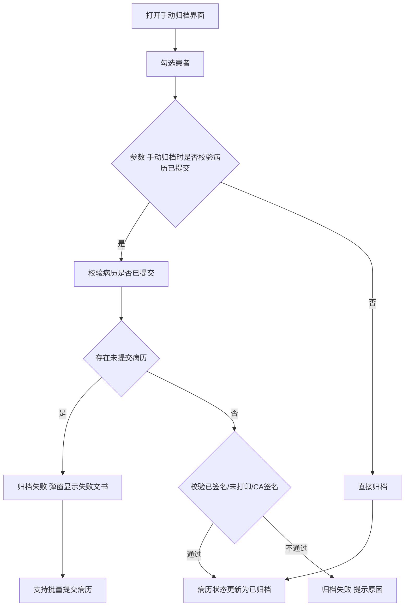
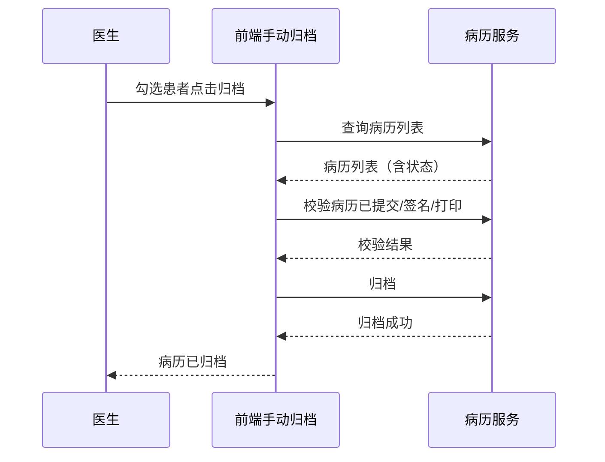

# BLGL-09-GDJY-002 病历手动归档 - Spec

> **功能编号**：BLGL-09-GDJY-002
> **文档类型**：功能Spec（业务背景与设计）
> **文档版本**：V1.0
> **编写时间**：2026-08-15
> **编写人**：RACC

---

## 文档索引

#### 章节索引

**Spec（研发视角）**

| 章节号 | 章节名称 | 内容说明 |
|--------|---------|---------|
| 1、 | 文档概述 | 文档目的、文档范围、术语定义、阅读指南、参考文档 |
| 2、 | 功能背景与定位 | 功能背景、功能定位、目标用户、核心价值 |
| 3、 | 业务流程设计 | 主流程/异常流程/边界流程（Given/When/Then） |
| 4、 | 数据模型设计 | 核心数据结构、状态定义、系统参数定义 |
| 5、 | 接口契约设计 | API列表、接口详细设计、错误码定义 |
| 6、 | 技术方案设计 | 页面路径、技术栈、关键技术点、部署方案 |
| 7、 | 测试用例预设计 | 功能/边界/异常/性能测试用例 |
| 8、 | 非功能性要求 | 性能、安全、可用性、兼容性 |
| 9、 | 依赖与风险 | 外部依赖、风险项 |
| 10、 | 附录 | 流程图、时序图、参考文档 |

**PM-Spec（业务视角）**

| 章节号 | 章节名称 | 内容说明 |
|--------|---------|---------|
| 一 | 目标 | 功能定位与核心价值 |
| 二 | 约束 | 业务/技术/非功能性约束 |
| 三 | 验收标准 | 验收条件与验证方法 |
| 四 | 排除范围 | 本次不做项与明确边界 |
| 五 | 关键决策记录 | 方案决策与选型理由 |
| 六 | 优先级 | 优先级定义 |
| 七 | 关联文档 | 关联文档索引 |
| 附录 | 填写检查清单 | 质量检查 |

**Analyst-Spec（产品视角）**

| 章节号 | 章节名称 | 内容说明 |
|--------|---------|---------|
| 一 | 功能编号体系 | 功能编号与层级结构 |
| 二 | 核心业务流程 | 核心业务流程与时序 |
| 三 | 功能规格说明 | 详细功能规格与验收标准 |
| 四 | 排除范围 | 排除范围 |
| 五 | 业务规则清单 | 业务规则清单 |
| 六 | 关联文档 | 关联文档索引 |
| 七 | 待确认问题清单 | 待确认问题汇总 |
| - | 填写检查清单 | 质量检查 |

#### 版本历史

| 版本 | 日期 | 变更说明 | 编写人 |
|------|------|---------|--------|
| V1.0 | 2026-08-15 | 初始版本 | RACC |

#### 关联文档索引

| 序号 | 文档名称 | 文档类型 | 版本 | 位置 |
|------|---------|---------|------|------|
| 1 | BLGL-09-GDJY 归档借阅功能点Spec.md | 功能点Spec（模块级） | V1.0 | 上级目录 |
| 2 | BLGL-09-GDJY-002_病历手动归档-Spec.md | 功能Spec（业务背景与设计）（本文档） | V1.0 | 本目录 |
| 3 | BLGL-09-GDJY-002_病历手动归档_Analyst-spec.md | Analyst-Spec（分析规格） | V1.0 | 本目录 |
| 4 | BLGL-09-GDJY-002_病历手动归档_PM-spec.md | PM-Spec（需求规格） | V0.1 | 本目录 |

---

## 1、文档概述

### 1.1、文档目的

本文档旨在明确"病历手动归档"功能（BLGL-09-GDJY-002）的业务背景与设计方案，为需求分析、研发实现、测试验收及评审提供统一的业务上下文、设计口径与决策依据。

**具体目的包括**：

1. 梳理病历手动归档功能的业务由来与历史需求演进脉络，说明"为什么要做"；
2. 明确功能的定位边界、目标用户与核心价值，回答"做成什么"；
3. 描述功能的业务流程、数据模型、接口契约与技术方案，回答"怎么做"；
4. 预设计测试用例并明确非功能性要求、依赖与风险，为研发与验收提供依据；
5. 作为 Analyst-Spec 的业务前提与设计输入，保证各层文档业务口径一致。

### 1.2、文档范围

#### 1.2.1 纳入范围

本文档覆盖病历手动归档的完整业务背景与设计，包括：

- 手动归档校验：校验病历已提交、已签名、未打印限制
- 质控系统手动归档：病历质控-病历管理新增手动归档菜单（召回病历归档）
- 手动归档权限：手动归档后不允许撤销归档
- 批量归档：批量归档按钮/批量扫码归档
- 手动归档导出：手动归档增加导出按钮
- 归档校验增强：归档时判断是否有诊断证明、CA签名校验

#### 1.2.2 排除范围

本文档不涉及以下内容（详见其他功能点或模块）：

- 病历自动归档（定时任务自动归档）—— BLGL-09-GDJY-001
- 病历撤销归档（撤销归档审批流程）—— BLGL-09-GDJY-003
- 病历召回申请/召回审核 —— BLGL-09-GDJY-004/-005
- 三方病案系统对接 —— BLGL-09-GDJY-007
- 归档校验与提醒 —— BLGL-09-GDJY-009
- 归档配置与豁免 —— BLGL-09-GDJY-010

### 1.3、术语定义

| 术语 | 定义 |
|------|------|
| 手动归档 | 医生/病案室人员在手动归档界面点击归档，将病历置为归档状态 |
| COMMON283 | 病历手动归档审签校验参数，值"0000"时显示批量归档按钮 |
| 召回病历归档 | 病历质控系统病历管理下新增菜单，只显示已召回状态病历，点击强制归档 |
| 归档人 | 执行归档操作的医生/病案室人员 |

### 1.4、阅读指南

- **章节关系**：第1~2章为业务全貌，第3~10章为设计实现层。与 Analyst-Spec、PM-Spec 互相引用保持一致。
- **读者对象**：产品经理/需求分析师读第1~2章；研发读第3~6、9~10章；测试读第3、7~8章；评审人员核对各层一致性。

### 1.5、参考文档

| 序号 | 文档名称 | 版本/日期 |
|------|---------|----------|
| 1 | 【历史需求】住院病历的历史需求.xlsx | - |
| 2 | BLGL-09-GDJY-002_病历手动归档_PM-spec.md | V0.1 |
| 3 | BLGL-09-GDJY-002_病历手动归档_Analyst-spec.md | V1.0 |
| 4 | BLGL-09-GDJY 归档借阅功能点Spec.md | V1.0 |

---

## 2、功能背景与定位

### 2.1 功能背景

病历手动归档是归档借阅模块的主动归档入口，需满足：

- **现状痛点**：点击手动归档时未校验病历是否已提交、患者签名是否已签署；未打印的病历/病案不允许归档到病案室；部分医生缺乏 CA 签名权限，病历缺少签名无法通过审核或归档
- **管理要求**：病案室人员需要对已召回病历强制手动归档
- **历史需求演进**：手动归档校验已提交→ 质控系统召回病历归档菜单→ 未打印不允许归档→ CA 签名校验（4）→ 批量扫码归档（0）

### 2.2 功能定位

"病历手动归档"是 WiNEX 病历管理-归档借阅的主动归档入口，定位为：

- **主动归档**：医生/病案室手动归档，质控系统召回病历强制归档
- **校验完备**：归档前校验已提交/已签名/未打印/CA签名
- **批量高效**：批量归档/批量扫码归档

### 2.3 目标用户

| 用户角色 | 主要使用场景 |
|---------|-------------|
| 住院医生 | 手动归档病历 |
| 病案室管理员 | 召回病历强制归档、批量归档 |
| 质控人员 | 病历质控-病历管理-召回病历归档 |

### 2.4 核心价值

| 价值维度 | 价值描述 |
|---------|---------|
| 归档合规 | 归档前校验病历完备（提交/签名/打印），避免不完整归档 |
| 质控联动 | 质控系统召回病历强制归档 |
| 效率提升 | 批量扫码归档，提高归档效率 |

---

## 3、业务流程设计（Given/When/Then）

### 3.1 主流程

**Scenario 1: 病历手动归档**

```gherkin
Given:
  - 医生/病案室人员打开手动归档界面
  - 患者病历已提交（无草稿/新建状态病历）

When:
  - 勾选患者并点击归档

Then:
  - 校验病历是否已提交（参数"手动归档时是否校验病历已提交"=是时）
  - 校验病历是否已签名/未打印/CA签名
  - 校验通过则将病历状态更新为已归档
  - 归档失败时弹窗显示失败的文书及原因
```

### 3.2 异常流程

**Scenario 2: 业务异常——存在未提交病历**

```gherkin
Given:
  - 参数"手动归档时是否校验病历已提交"=是
  - 患者病历簿存在草稿/新建状态病历

When:
  - 点击手动归档

Then:
  - 归档失败
  - 弹窗显示失败的文书及原因（草稿、新建）
  - 弹窗支持批量提交病历（走批量提交接口）
  - 无权限提交/不可提交的病历复选框置灰并显示原因
```

**Scenario 3: 数据异常——未打印/缺少CA签名**

```gherkin
Given:
  - 病历/病案首页未打印
  - 或病历缺少 CA 签名

When:
  - 点击手动归档

Then:
  - 未打印的病历/病案不允许归档
  - 缺少签名的病历无法通过审核或归档，需病案室翻拍后归档
```

**Scenario 4: 系统异常——COMMON283 校验失效**

```gherkin
Given:
  - 参数 COMMON283 病历手动归档审签校验已配置

When:
  - 手动归档

Then:
  - 审签校验无效（问题）
  - 需排查参数配置
```

### 3.3 边界流程

**Scenario 5: 边界——质控系统召回病历归档**

```gherkin
Given:
  - 病历质控系统-病历管理-召回病历归档菜单

When:
  - 病案室人员点击归档

Then:
  - 只显示已召回状态的患者病历
  - 点击归档将病历强制归档
  - 标注手动归档来源（与医生站手动归档区分）
```

**Scenario 6: 边界——批量扫码归档**

```gherkin
Given:
  - 手动归档菜单
  - 参数 COMMON283=0000（显示批量归档按钮）

When:
  - 扫描住院号条形码自动勾选
  - 连续扫描最多 100 个后批量归档

Then:
  - 批量勾选患者并批量归档
  - 提高归档效率
```

---

## 4、数据模型设计

### 4.1 核心数据结构

#### 4.1.1 核心保存请求

| 字段名 | 类型 | 必填 | 备注 |
|--------|------|------|------|
| inpRhbRecordId | Long | 是 | 住院病历患者就诊主记录 ID |
| encounterId | Long | 是 | 就诊标识 |
| 归档人 | String | 否 | 执行归档操作的人员 |

> ⏳ 待确认：手动归档接口完整入参/出参以代码扫描和 API 契约为准。

#### 4.1.2 核心表/实体

| 表/实体 | 关键字段 | 说明 |
|---------|---------|------|
| INPATIENT_EMR_ARCHIVE（InpatientEmrArchivePO） | inpatEmrSetFilingId(INP_EMR_ARCHIVE_ID)、inpatRhbRecordId(INP_RHB_RECORD_ID)、statusCode(INP_EMR_ARCHIVE_STATUS)、inpatEmrSetFilingAt(INP_EMR_ARCHIVED_AT)、inpatEmrSetFilingTypeCode(INP_EMR_ARCHIVE_TYPE_CODE)、deptId、cancelArchiveFlag(CANCEL_ARCHIVE_FLAG) | 住院病历归档表 |
| INP_EMR_RECALL_MODIFIED_DETAIL（InpEmrRecallModifiedDetailPO） | inpEmrArchRecallId、inpEmrSetId、inpEmrSetTitle | 召回修改明细（归档校验关联） |

### 4.2 状态定义

| 状态码 | 状态名称 | 说明 |
|--------|---------|------|
| 399058142 | 已归档 | 病历归档状态（FilingStatusConstant.ARCHIVE，代码） |
| 399058143 | 未归档 | 病历归档状态（FilingStatusConstant.UNARCHIVE，代码） |
| 399291265 | 已召回 | 病历归档状态（FilingStatusConstant.RECALLED，代码） |

### 4.3 系统参数定义

| 参数编码 | 参数名称 | 说明 |
|---------|---------|------|
| - | 手动归档时是否校验病历已提交 | 是/否，默认否 |
| - | 医生手动归档后是否允许撤销归档 | 是/否，默认是，参数为否时隐藏撤销归档按钮 |
| COMMON283 | 病历手动归档审签校验 | 值"0000"时显示批量归档按钮 |
| EG015 | 出院患者限定时间（小时）内可操作撤销归档 | 手动归档撤销归档生效前提 |

---

## 5、接口契约设计

### 5.1 API列表

| 序号 | API名称（代码函数） | 路径 | 方法 | 说明 |
|:----:|---------|------|:----:|------|
| 1 | 查询病历簿列表信息 | /api/v1/app_record_inpatient/emr_inpatient/emr_rhb_record_list/query/by_example | POST | 手动归档查询（入参 InpatEmrRHBRecordListQueryByExampleInputAO） |
| 2 | 导出归档查询列表 Excel | /api/v1/app_record_inpatient/emr_inpatient/emr_rhb_record_list/export/by_example | POST | 手动归档导出 |
| 3 | 查询病历归档（手动归档查询） | /api/v1/app_record_inpatient/inpatient_emr_template/emr_filing_by_hand/query | POST | 手动归档查询（入参 InpatEmrFilingByHandQueryInputAO，出参 List<InpatEmrFilingQueryOutputVO>） |
| 4 | 批量更新病历归档信息（手动归档） | /api/v1/app_record_inpatient/emr_inpatient/emr_set_filing/update_batch | POST | 批量手动归档（入参 InpEmrManualArchiveInputAO） |
| 5 | 批量归档校验 | /api/v1/app_record_inpatient/inpatient_emr_template/emr_filing_by_hand/batch_check | POST | 批量归档校验（按 COMMON283 规则，入参 InpEmrBatchArchiveCheckInputAO） |

### 5.2 接口详细设计

#### 5.2.1 批量更新病历归档信息（emr_set_filing/update_batch）

**请求参数**:
```json
{
  "inpRhbRecordIdList": ["12345", "12346"],
  "statusCode": "399058142",
  "archiveTypeCode": "手动归档",
  "employeeId": "1001"
}
```

**返回值（成功）**:
```json
{
  "success": true,
  "data": null
}
```

> ⏳ 待确认：手动归档接口字段以代码扫描（InpEmrManualArchiveInputAO）和 API 契约为准。

**返回值（失败）**:
```json
{
  "success": false,
  "message": "归档失败：存在未提交病历",
  "data": null
}
```

### 5.3 错误码定义

| 错误码 | 错误信息 | 处理方式 |
|--------|---------|---------|
| ⏳ 待确认 | 归档失败：存在未提交病历 | 弹窗显示失败文书及原因 |
| ⏳ 待确认 | 未打印病历不允许归档 | 提示打印后归档 |

---

## 6、技术方案设计

### 6.1 页面路径

- **页面路径**: 住院医生站→日常管理→病历归档→手动归档（src/router/EmrArchiving.js manualArchive）；病历质控系统→病历管理→召回病历归档
- **前端逻辑**: 手动归档批量归档按钮受 COMMON283 控制（值"0000"时显示）
- **后端模块**: winning-emr-ipt-archive/winning-emr-ipt-archive-provider/controller/InpEmrArchiveController.java（查询病历归档、批量更新归档信息、撤销归档）
- **前端 API**: winning-webui-inpatient-clinicalnote-pango/src/pages/ClinicalnoteArchiveManage/api/index.js（apiInpatFilingHand → emr_filing_by_hand/query、apiInpatFilingBatch → emr_set_filing/update_batch、apiCancelArchive → archive/cancel）

### 6.2 技术栈

| 类别 | 技术 | 版本 |
|------|------|------|
| 前端框架 | Vue | 2.6.14 |
| 前端UI | element-ui | 2.13.0 |
| 后端框架 | Spring Boot（Java 17）+ JPA/Hibernate | - |
| RPC | winning-akso-rpc-rest | - |

### 6.3 关键技术点

- 归档失败弹窗复用批量提交接口，无权限提交复选框置灰并显示原因
- 无纸化归档校验增加 CA 签名校验，通知病案系统无纸化更新的 mq 消息
- 手动归档导出走前端导出，前端分页请求后端数据再组装导出

### 6.4 部署方案

⏳ 待确认：部署方案未在资料区中找到。

---

## 7、测试用例预设计

### 7.1 功能测试

| 用例编号 | 测试场景 | Given | When | Then |
|---------|---------|-------|------|------|
| TC-001 | 手动归档成功 | 病历已提交/签名/打印 | 点击归档 | 病历状态更新为已归档（399058142） |
| TC-002 | 手动归档查询接口 | 手动归档界面 | 调用 emr_filing_by_hand/query | 返回待归档病历列表 |
| TC-003 | 批量归档接口 | 勾选多个患者 | 调用 emr_set_filing/update_batch | 批量归档成功 |

### 7.2 边界测试

| 用例编号 | 测试场景 | Given | When | Then |
|---------|---------|-------|------|------|
| TC-004 | 质控系统召回病历归档 | 召回病历归档菜单 | 点击归档 | 强制归档，标注来源 |
| TC-005 | 批量扫码归档 | COMMON283=0000 | 扫描住院号最多100个 | 批量勾选并归档 |

### 7.3 异常测试

| 用例编号 | 测试场景 | Given | When | Then |
|---------|---------|-------|------|------|
| TC-006 | 存在未提交病历 | 参数=是，有草稿病历 | 点击归档 | 归档失败弹窗显示原因 |
| TC-007 | 批量归档校验失败 | 有患者校验不通过 | 调用 emr_filing_by_hand/batch_check | 返回失败结果 |

### 7.4 性能测试

| 用例编号 | 测试场景 | 指标 |
|---------|---------|------|
| TC-008 | 批量归档响应 | ⏳ 待确认：性能指标未在资料区中找到 |
| TC-009 | 手动归档导出响应 | ⏳ 待确认：性能指标未在资料区中找到 |

---

## 8、非功能性要求

### 8.1 性能要求

| 指标 | 要求 |
|------|------|
| 批量归档响应时间 | ⏳ 待确认 |

### 8.2 安全要求

| 要求 | 说明 |
|------|------|
| 归档权限 | 手动归档需病历书写/病案室权限，质控系统归档区分来源 |

**医疗行业特殊要求**

| 要求 | 说明 |
|------|------|
| 归档完整性 | 归档前校验已提交/签名/打印，避免不完整归档 |

### 8.3 可用性要求

| 指标 | 要求值 |
|------|--------|
| 可用性 | ⏳ 待确认 |

### 8.4 兼容性要求

| 类型 | 要求 |
|------|------|
| 归档来源 | 医生站手动归档与质控系统召回病历归档区分 |
| 签名模式 | 电子签名（图片签）/未签名（楷体签）区分 |

---

## 9、依赖与风险

### 9.1 外部依赖

| 依赖项 | 说明 |
|--------|------|
| 病历打印系统 | 未打印病历不允许归档 |
| CA签名系统 | CA 签名校验 |

### 9.2 风险项

| 风险项 | 等级 | 说明 | 应对方案 |
|--------|------|------|---------|
| 校验缺失 | 中 | 未校验已提交/签名导致不完整归档 | 归档前强校验 |
| 无权限批量 | 中 | 批量归档勾选无权限患者 | 无权限患者复选框置灰并提示 |

---

## 10、附录

### 10.1 流程图



### 10.2 时序图



### 10.3 参考文档

- BLGL-09-GDJY 归档借阅功能点Spec.md（V1.0，第5章 BLGL-09-GDJY-002 行）
- 关联Spec: BLGL-09-GDJY-002_病历手动归档_PM-spec.md、BLGL-09-GDJY-002_病历手动归档_Analyst-spec.md

---

## 填写检查清单

| 序号 | 检查项 | 是否完成 |
|:----:|--------|:--------:|
| 1 | 章节索引与正文章节一致 | ✅ |
| 2 | 版本历史记录完整 | ✅ |
| 3 | 关联文档索引已登记全部Spec | ✅ |
| 4 | 文档目的明确回答"为什么做/做成什么/怎么做" | ✅ |
| 5 | 纳入范围/排除范围清晰 | ✅ |
| 6 | 术语定义覆盖关键概念，从资料区可溯源 | ✅ |
| 7 | 参考文档已登记 | ✅ |
| 8 | 功能背景基于法规/规范/需求来源组织 | ✅ |
| 9 | 功能定位体现业务价值（3~5个定位点） | ✅ |
| 10 | 目标用户角色覆盖完整，在需求原文中有出处 | ✅ |
| 11 | 核心价值可陈述，与 Phase 1 口径一致 | ✅ |
| 12 | 业务流程：主流程≥1、异常≥3、边界≥2，Given/When/Then 具体 | ✅ |
| 13 | 数据模型：字段/表/状态/参数可溯源 | ✅ |
| 14 | 接口契约：API列表+详细设计+错误码齐全或标记待确认 | ✅ |
| 15 | 技术方案：页面路径/技术栈/关键点/部署方案或标记待确认 | ✅ |
| 16 | 测试用例：功能/边界/异常/性能覆盖 | ✅ |
| 17 | 非功能性要求：性能/安全/可用性/兼容性指标可量化或标记待确认 | ✅ |
| 18 | 依赖与风险：外部依赖登记完整 | ✅ |
| 19 | 附录：流程图/时序图与正文流程一致 | ✅ |
| 20 | 全文无占位符 `< >` 残留 | ✅ |
| 21 | 全文陈述可溯源至资料区 | ✅ |
| 22 | 人工审核确认完成 | ⏳ 待确认 |

---

**文档状态**：⬜ 待审核
**维护责任**：RACC
**下次更新**：根据评审反馈优化
