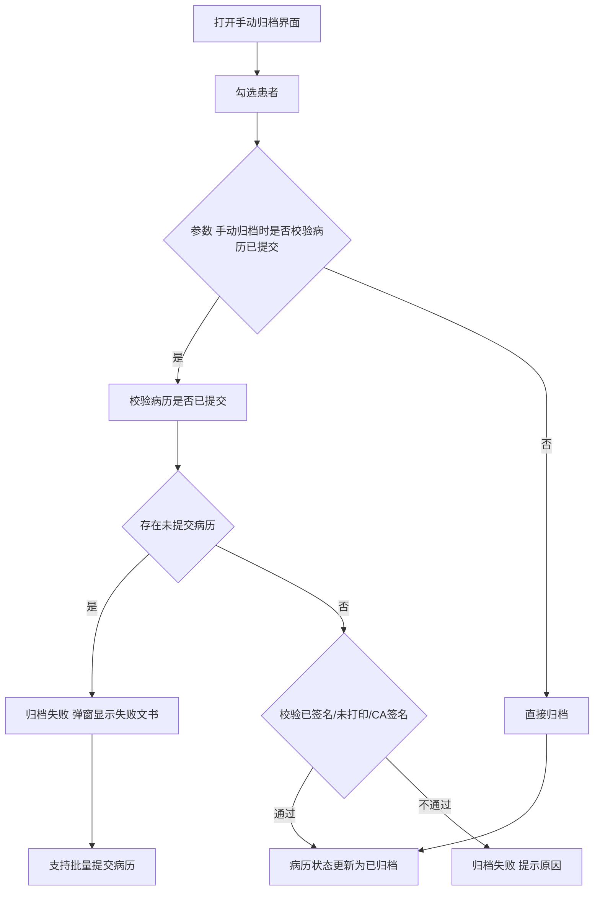
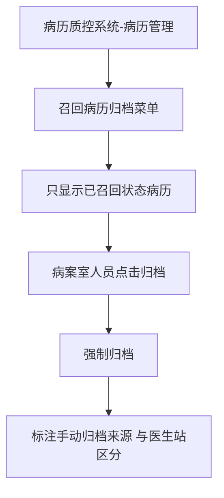

# BLGL-09-GDJY-002 病历手动归档 _ Analyst - Spec

> **需求编号**：BLGL-09-GDJY-002
> **父需求**：BLGL-09-GDJY
> **关联PM Spec**：BLGL-09-GDJY-002_病历手动归档_PM-spec.md
> **Spec版本**：V1.0
> **编写时间**：2026-08-15
> **编写人**：需求分析师

---

## 一、功能编号体系

### 1.1 功能层级结构

```
BLGL-09-GDJY-002-001: 手动归档校验
  ├─ BLGL-09-GDJY-002-001-01: 校验病历已提交
  ├─ BLGL-09-GDJY-002-001-02: 校验病历已签名/CA签名
  ├─ BLGL-09-GDJY-002-001-03: 校验未打印病历不允许归档
  └─ BLGL-09-GDJY-002-001-04: 归档失败弹窗批量提交

BLGL-09-GDJY-002-002: 质控系统手动归档
  └─ BLGL-09-GDJY-002-002-01: 召回病历归档菜单

BLGL-09-GDJY-002-003: 批量归档
  ├─ BLGL-09-GDJY-002-003-01: 批量归档按钮（COMMON283）
  └─ BLGL-09-GDJY-002-003-02: 批量扫码归档

BLGL-09-GDJY-002-004: 手动归档导出
  └─ BLGL-09-GDJY-002-004-01: 手动归档导出 Excel

BLGL-09-GDJY-002-005: 手动归档权限
  └─ BLGL-09-GDJY-002-005-01: 手动归档后不允许撤销归档
```

### 1.2 功能编号表

| REQ-ID | 功能名称 | 类型 | 优先级 | 说明 |
|--------|---------|------|--------|------|
| BLGL-09-GDJY-002-001 | 手动归档校验 | 功能 | P0 | 归档前校验 |
| BLGL-09-GDJY-002-001-01 | 校验病历已提交 | 子功能 | P0 | 无草稿/新建状态病历 |
| BLGL-09-GDJY-002-001-02 | 校验病历已签名/CA签名 | 子功能 | P0 | 缺少签名无法归档 |
| BLGL-09-GDJY-002-001-03 | 校验未打印病历 | 子功能 | P0 | 未打印不允许归档 |
| BLGL-09-GDJY-002-001-04 | 归档失败弹窗批量提交 | 子功能 | P1 | 失败弹窗显示文书及原因，支持批量提交 |
| BLGL-09-GDJY-002-002 | 质控系统手动归档 | 功能 | P1 | 召回病历归档菜单 |
| BLGL-09-GDJY-002-002-01 | 召回病历归档菜单 | 子功能 | P1 | 只显示已召回病历，强制归档，标注来源 |
| BLGL-09-GDJY-002-003 | 批量归档 | 功能 | P1 | 批量归档/扫码 |
| BLGL-09-GDJY-002-003-01 | 批量归档按钮 | 子功能 | P1 | COMMON283=0000 显示 |
| BLGL-09-GDJY-002-003-02 | 批量扫码归档 | 子功能 | P1 | 扫描住院号条形码，最多 100 个 |
| BLGL-09-GDJY-002-004 | 手动归档导出 | 功能 | P2 | 导出 Excel |
| BLGL-09-GDJY-002-004-01 | 手动归档导出 Excel | 子功能 | P2 | 前端分页请求组装导出 |
| BLGL-09-GDJY-002-005 | 手动归档权限 | 功能 | P1 | 手动归档后撤销控制 |
| BLGL-09-GDJY-002-005-01 | 手动归档后不允许撤销归档 | 子功能 | P1 | 参数为否时隐藏撤销归档按钮 |

---

## 二、核心业务流程

### 2.1 手动归档校验主流程



### 2.2 质控系统召回病历归档流程



---

## 三、功能规格说明

### BLGL-09-GDJY-002-001: 手动归档校验

#### 3.1.1 功能概述

手动归档时需要校验当前患者病历簿的病历是否都已提交（无草稿、新建状态病历）、患者签名是否都已签署。归档失败时弹窗显示失败的文书及原因，弹窗支持批量提交病历；无权限提交/病历不可提交时复选框置灰并显示原因。未打印的病历/病案首页不允许归档到病案室。无纸化归档校验增加 CA 签名校验。

#### 3.1.2 用户角色

| 角色 | 使用场景 | 权限要求 | 操作频率 |
|------|---------|---------|---------|
| 住院医生 | 手动归档病历 | 病历书写权限 | 中频 |
| 病案室管理员 | 手动归档/翻拍归档 | 病案室权限 | 中频 |

#### 3.1.3 业务流程（Given/When/Then）

**Scenario 1: 手动归档校验（主流程）**

```gherkin
Given:
  - 参数"手动归档时是否校验病历已提交"=是
  - 患者病历簿无草稿/新建状态病历

When:
  - 医生点击手动归档

Then:
  - 校验病历是否已提交（无草稿、新建状态病历）
  - 校验已签名/未打印/CA签名
  - 校验通过则病历状态更新为已归档
```

**Scenario 2: 业务异常——存在未提交病历**

```gherkin
Given:
  - 参数=是
  - 患者病历簿存在草稿/新建状态病历

When:
  - 点击手动归档

Then:
  - 归档失败
  - 弹窗显示失败的文书及原因（草稿、新建）
  - 弹窗支持批量提交病历
  - 无权限提交/不可提交的病历复选框置灰，鼠标移入显示原因
```

**Scenario 3: 数据异常——未打印/缺少CA签名**

```gherkin
Given:
  - 病历/病案首页未打印
  - 或病历缺少 CA 签名

When:
  - 点击手动归档

Then:
  - 未打印的病历/病案不允许归档
  - 缺少签名的病历无法通过审核或归档，需病案室翻拍后归档
```

**Scenario 4: 边界——归档时判断诊断证明**

```gherkin
Given:
  - 归档时判断是否有诊断证明

When:
  - 点击手动归档

Then:
  - 归档校验诊断证明
```

#### 3.1.4 数据字段定义

| 字段名 | 类型 | 必填 | 默认值 | 取值范围 | 说明 | 概念ID |
|--------|------|------|--------|---------|------|--------|
| 手动归档时是否校验病历已提交 | Boolean | 否 | 否 | 是/否 | 归档校验参数 | ⏳ 待确认 |
| inpatEmrSetFilingId | Long | 是 | - | - | 归档表主键（INP_EMR_ARCHIVE_ID，代码 InpatientEmrArchivePO） | ⏳ 待确认 |
| inpatRhbRecordId | Long | 是 | - | - | 病历簿 ID（INP_RHB_RECORD_ID，代码） | ⏳ 待确认 |
| statusCode | Long | 是 | - | 399058142/399058143/399291265 | 归档状态（INP_EMR_ARCHIVE_STATUS，代码 FilingStatusConstant） | ⏳ 待确认 |
| inpatEmrSetFilingAt | Date | 否 | - | - | 归档时间（INP_EMR_ARCHIVED_AT，代码） | ⏳ 待确认 |
| 归档人 | String | 否 | - | - | 归档操作人 | ⏳ 待确认 |

#### 3.1.5 验收标准

| AC编号 | 验收标准 | 对应REQ-ID | 验证方法 | 验证场景 |
|--------|---------|-----------|---------|---------|
| AC-001 | 手动归档校验已提交，失败弹窗显示文书并支持批量提交 | BLGL-09-GDJY-002-001 | 功能测试 | Scenario 1/2 |
| AC-002 | 未打印病历不允许归档 | BLGL-09-GDJY-002-001 | 功能测试 | Scenario 3 |

---

### BLGL-09-GDJY-002-002: 质控系统手动归档

#### 3.2.1 功能概述

病案室人员需要对已召回病历强制手动归档。将医生站的手动归档菜单挂到病历质控系统的病历管理分类下，去掉列表上方的筛选，只显示已召回状态的病历，菜单名为【召回病历归档】。召回病历归档菜单需要能看到所有科室已召回状态的患者，点击归档将病历强制归档，标注手动归档的来源和医生站的手动归档区分。

#### 3.2.2 用户角色

| 角色 | 使用场景 | 权限要求 | 操作频率 |
|------|---------|---------|---------|
| 病案室管理员 | 质控系统召回病历归档 | 病案室权限 | 中频 |

#### 3.2.3 业务流程（Given/When/Then）

**Scenario 1: 召回病历归档（主流程）**

```gherkin
Given:
  - 病历质控系统-病历管理-召回病历归档菜单

When:
  - 病案室人员打开菜单

Then:
  - 只显示已召回状态的患者病历
  - 能看到所有科室已召回状态的患者
  - 点击归档将病历强制归档
  - 标注手动归档来源，与医生站手动归档区分
```

#### 3.2.4 数据字段定义

| ⏳ 待确认 | 召回病历归档无独立业务字段 | 依赖归档状态（已召回） |

#### 3.2.5 验收标准

| AC编号 | 验收标准 | 对应REQ-ID | 验证方法 | 验证场景 |
|--------|---------|-----------|---------|---------|
| AC-003 | 质控系统召回病历归档菜单强制归档并标注来源 | BLGL-09-GDJY-002-002 | 功能测试 | Scenario 1 |

---

### BLGL-09-GDJY-002-003: 批量归档

#### 3.3.1 功能概述

归档查询菜单增加归档人查询条件，手动归档菜单增加批量扫码归档功能（扫描住院号条形码自动勾选，连续扫描最多 100 个后批量归档）。批量归档按钮显示受参数 COMMON283 控制（值为"0000"时显示）。列表每行带复选框，底部有批量归档按钮，勾选后一键提交。增加批量撤销归档菜单，归档状态查询条件默认为已归档，右下角新增【批量撤销归档】按钮。

#### 3.3.2 用户角色

| 角色 | 使用场景 | 权限要求 | 操作频率 |
|------|---------|---------|---------|
| 病案室管理员 | 批量扫码归档 | 病案室权限 | 高频 |

#### 3.3.3 业务流程（Given/When/Then）

**Scenario 1: 批量扫码归档（主流程）**

```gherkin
Given:
  - 手动归档菜单
  - 参数 COMMON283=0000（显示批量归档按钮）

When:
  - 扫描住院号条形码自动勾选
  - 连续扫描最多 100 个后批量归档

Then:
  - 批量勾选患者
  - 点击批量归档一键提交
```

**Scenario 2: 批量撤销归档**

```gherkin
Given:
  - 撤销归档菜单，归档状态查询条件默认为已归档

When:
  - 勾选已归档状态的患者
  - 点击批量撤销归档

Then:
  - 支持对所勾选患者批量撤销归档
  - 无撤销归档权限的患者批量按钮置灰并悬浮提示"存在无撤销归档权限的患者，请先取消勾选！"
```

**Scenario 3: 边界——无权限批量**

```gherkin
Given:
  - 勾选的患者中有无撤销归档权限的

When:
  - 点击批量撤销归档

Then:
  - 批量撤销归档按钮置灰
  - 悬浮提示存在无撤销归档权限的患者
```

#### 3.3.4 数据字段定义

| 字段名 | 类型 | 必填 | 默认值 | 取值范围 | 说明 | 概念ID |
|--------|------|------|--------|---------|------|--------|
| 归档人 | String | 否 | - | - | 归档查询新增查询条件 | ⏳ 待确认 |

#### 3.3.5 验收标准

| AC编号 | 验收标准 | 对应REQ-ID | 验证方法 | 验证场景 |
|--------|---------|-----------|---------|---------|
| AC-004 | 批量扫码归档最多 100 个，批量归档按钮受 COMMON283 控制 | BLGL-09-GDJY-002-003 | 功能测试 | Scenario 1 |
| AC-005 | 批量撤销归档无权限患者按钮置灰并提示 | BLGL-09-GDJY-002-003 | 功能测试 | Scenario 3 |

---

### BLGL-09-GDJY-002-004: 手动归档导出

#### 3.4.1 功能概述

手动归档增加导出按钮，导出 Excel 走前端导出，前端分页请求后端数据再进行组装后导出，前端增加导出进度条。因右侧窄屏布局问题，导出按钮放在左下方。

#### 3.4.2 用户角色

| 角色 | 使用场景 | 权限要求 | 操作频率 |
|------|---------|---------|---------|
| 病案室管理员 | 手动归档导出 | 病案室权限 | 中频 |

#### 3.4.3 业务流程（Given/When/Then）

**Scenario 1: 手动归档导出（主流程）**

```gherkin
Given:
  - 手动归档界面

When:
  - 点击导出按钮

Then:
  - 前端分页请求后端数据组装导出 Excel
  - 前端显示导出进度条
  - 导出按钮放在左下方
```

#### 3.4.4 数据字段定义

| ⏳ 待确认 | 导出无独立业务字段 | 依赖手动归档列表字段 |

#### 3.4.5 验收标准

| AC编号 | 验收标准 | 对应REQ-ID | 验证方法 | 验证场景 |
|--------|---------|-----------|---------|---------|
| AC-006 | 手动归档导出 Excel 成功，带进度条 | BLGL-09-GDJY-002-004 | 功能测试 | Scenario 1 |

---

### BLGL-09-GDJY-002-005: 手动归档权限

#### 3.5.1 功能概述

病历业务配置-住院病历归档新增参数"医生手动归档后是否允许撤销归档"，控制手动归档后是否允许撤销归档按钮的显示，值{是，否}默认是；只有参数设置为是时（EG015 出院患者限定时间（小时）内可操作撤销归档）才生效。参数为否时撤销归档按钮需要隐藏，该参数只作用医生站手动归档，不作用质控系统。

#### 3.5.2 用户角色

| 角色 | 使用场景 | 权限要求 | 操作频率 |
|------|---------|---------|---------|
| 病案管理员 | 配置撤销归档权限 | 配置权限 | 低频 |

#### 3.5.3 业务流程（Given/When/Then）

**Scenario 1: 手动归档后不允许撤销（主流程）**

```gherkin
Given:
  - 参数"医生手动归档后是否允许撤销归档"=否

When:
  - 医生手动归档后

Then:
  - 撤销归档按钮隐藏
  - 该参数只作用医生站手动归档，不作用质控系统
```

#### 3.5.4 数据字段定义

| 字段名 | 类型 | 必填 | 默认值 | 取值范围 | 说明 | 概念ID |
|--------|------|------|--------|---------|------|--------|
| 医生手动归档后是否允许撤销归档 | Boolean | 否 | 是 | 是/否 | 撤销归档权限参数 | ⏳ 待确认 |

#### 3.5.5 验收标准

| AC编号 | 验收标准 | 对应REQ-ID | 验证方法 | 验证场景 |
|--------|---------|-----------|---------|---------|
| AC-007 | 参数为否时隐藏撤销归档按钮，仅作用医生站 | BLGL-09-GDJY-002-005 | 功能测试 | Scenario 1 |
| AC-008 | 手动归档接口 emr_set_filing/update_batch 批量归档成功，病历状态更新为已归档（399058142） | BLGL-09-GDJY-002-001 | 接口测试 | Scenario 1 |
| AC-009 | 批量归档校验接口 emr_filing_by_hand/batch_check 返回批量校验结果（InpEmrBatchArchiveCheckOutputVO） | BLGL-09-GDJY-002-001 | 接口测试 | Scenario 1 |

---

## 四、排除范围

本需求不包含以下功能项：

1. **病历自动归档**（定时任务自动归档）—— BLGL-09-GDJY-001
2. **病历撤销归档**（撤销归档审批流程）—— BLGL-09-GDJY-003
3. **病历召回申请/召回审核** —— BLGL-09-GDJY-004/-005
4. **病历借阅流程** —— BLGL-09-GDJY-006
5. **三方病案系统对接** —— BLGL-09-GDJY-007
6. **归档校验与提醒** —— BLGL-09-GDJY-009
7. **归档配置与豁免** —— BLGL-09-GDJY-010

---

## 五、业务规则清单

| 规则ID | 规则名称 | 规则描述 | 来源 | 优先级 |
|--------|---------|---------|------|--------|
| BR-001 | 手动归档校验 | 手动归档时校验病历是否已提交（无草稿、新建状态病历），失败弹窗显示文书及原因，支持批量提交 |  | P0 |
| BR-002 | 未打印不允许归档 | 未打印的病历/病案首页不允许归档到病案室 |  | P0 |
| BR-003 | CA签名校验 | 无纸化归档校验增加 CA 签名校验，缺少签名无法通过审核或归档 | 4 | P0 |
| BR-004 | 召回病历归档 | 质控系统召回病历归档菜单只显示已召回病历，强制归档，标注来源 |  | P1 |
| BR-005 | 批量归档权限 | 批量归档按钮受 COMMON283 控制（值"0000"显示），批量扫码最多 100 个 | 0 | P1 |
| BR-006 | 批量撤销无权限 | 无撤销归档权限患者批量撤销按钮置灰，悬浮提示 | 2 | P1 |
| BR-007 | 手动归档撤销 | 医生手动归档后是否允许撤销归档，默认是，为否时隐藏撤销按钮（仅医生站） |  | P1 |
| BR-008 | 手动归档接口 | 手动归档批量接口 emr_set_filing/update_batch（入参 InpEmrManualArchiveInputAO），归档状态更新为已归档（399058142） | 代码 | P0 |
| BR-009 | 批量归档校验 | 批量归档校验接口 emr_filing_by_hand/batch_check 按 COMMON283 规则校验 | 代码 | P1 |

---

## 六、关联文档

| 文档类型 | 文档路径 | 说明 |
|---------|---------|------|
| 功能点Spec（模块级） | 上级目录 BLGL-09-GDJY 归档借阅功能点Spec.md（V1.0） | 模块级功能点索引 |
| 功能Spec（业务背景与设计） | 本目录 BLGL-09-GDJY-002_病历手动归档-Spec.md（V1.0） | 业务背景与目标 Spec |
| Analyst-Spec（分析规格） | 本目录 BLGL-09-GDJY-002_病历手动归档_Analyst-spec.md（V1.0）（本文档） | 分析规格 |
| PM-Spec（需求规格） | 本目录 BLGL-09-GDJY-002_病历手动归档_PM-spec.md（V0.1） | PM 产出的 Spec 文档 |
| data-model.md | 待产出 | 架构师产出的数据建模文档 |
| design.md | 待产出 | 架构师产出的技术方案文档 |
| api-contract.md | 待产出 | 开发经理产出的 API 契约文档 |

---

## 七、待确认问题清单

| 编号 | 问题描述 | 缺失信息 | 影响范围 | 建议补充方 |
|------|---------|---------|---------|-----------|
| Q-001 | 手动归档接口完整入参/出参 | API 契约 | -Spec 第5章 | 开发经理 |
| Q-002 | 批量提交接口路径 | API 契约 | 3.1.3 | 开发经理 |
| Q-003 | 手动归档校验/撤销参数概念 ID | 概念ID | 3.1.4/3.5.4 | 产品经理 |
| Q-004 | COMMON283 审签校验失效（6）根因 | 需求分析原文缺失 | 3.1.3 | 开发经理 |
| Q-005 | 归档人查询/批量扫码（0）的具体交互细节 | 需求分析原文 | 3.3.3 | 需求分析师 |
| Q-006 | 性能指标（批量归档响应时间） | 资料区无量化指标 | -Spec 第8章 | 产品经理 |

---

## 填写检查清单

| 序号 | 检查项 | 是否完成 |
|:----:|--------|:--------:|
| 1 | 功能编号带父子层级 | ✅ |
| 2 | 每个 REQ-ID 有功能概述和用户角色 | ✅ |
| 3 | 主流程至少 1 个 Given/When/Then 场景 | ✅ |
| 4 | 异常流程至少 3 个 Given/When/Then 场景 | ✅ |
| 5 | 边界流程至少 2 个 Given/When/Then 场景 | ✅ |
| 6 | 每个 Given/When/Then 内容具体，不模糊 | ✅ |
| 7 | 数据字段定义完整（字段名、类型、必填、说明、概念ID） | ✅ |
| 8 | 验收标准 AC 编号独立，可验证 | ✅ |
| 9 | 验收标准无"功能正常"等模糊表述 | ✅ |
| 10 | 排除范围明确列出 | ✅ |
| 11 | 业务规则清单列出所有规则，每条标注来源 | ✅ |
| 12 | 流程图使用 Mermaid 格式（≥2 个） | ✅ |
| 13 | 关联文档索引包含 Phase 1 功能点Spec | ✅ |
| 14 | 待确认问题清单汇总了全文所有 ⏳ 项 | ✅ |
| 15 | 全文无占位符 `< >` 残留 | ✅ |
| 16 | 全文陈述可溯源至资料区（S1~S10 溯源核查） | ✅ |
| 17 | 人工审核确认完成 | ⏳ 待确认 |

---

**文档状态**：⬜ 待审核
**维护责任**：需求分析师规范组
**下次更新**：根据评审反馈优化

---

## 版本历史

| 版本 | 日期 | 变更说明 | 编写人 |
|------|------|---------|--------|
| V1.0 | 2026-08-15 | 初始版本 | 需求分析师 |
