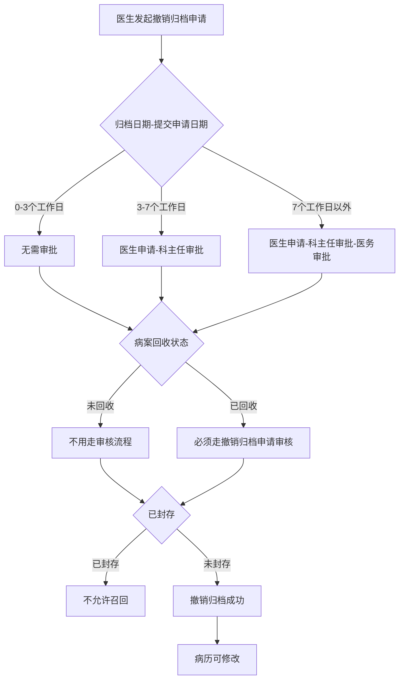
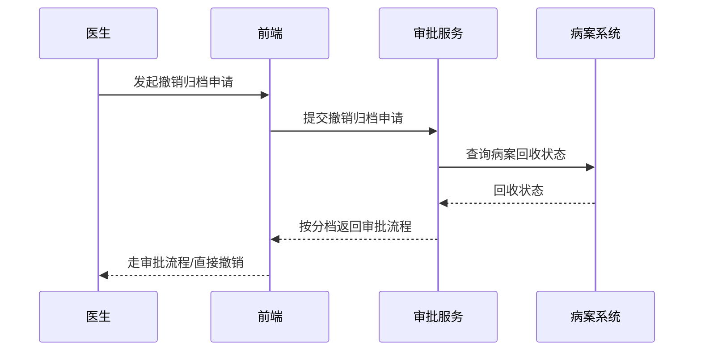

# BLGL-09-GDJY-003 病历撤销归档 - Spec

> **功能编号**：BLGL-09-GDJY-003
> **文档类型**：功能Spec（业务背景与设计）
> **文档版本**：V1.0
> **编写时间**：2026-08-15
> **编写人**：RACC

---

## 文档索引

#### 章节索引

**Spec（研发视角）**

| 章节号 | 章节名称 | 内容说明 |
|--------|---------|---------|
| 1、 | 文档概述 | 文档目的、文档范围、术语定义、阅读指南、参考文档 |
| 2、 | 功能背景与定位 | 功能背景、功能定位、目标用户、核心价值 |
| 3、 | 业务流程设计 | 主流程/异常流程/边界流程（Given/When/Then） |
| 4、 | 数据模型设计 | 核心数据结构、状态定义、系统参数定义 |
| 5、 | 接口契约设计 | API列表、接口详细设计、错误码定义 |
| 6、 | 技术方案设计 | 页面路径、技术栈、关键技术点、部署方案 |
| 7、 | 测试用例预设计 | 功能/边界/异常/性能测试用例 |
| 8、 | 非功能性要求 | 性能、安全、可用性、兼容性 |
| 9、 | 依赖与风险 | 外部依赖、风险项 |
| 10、 | 附录 | 流程图、时序图、参考文档 |

**PM-Spec（业务视角）**

| 章节号 | 章节名称 | 内容说明 |
|--------|---------|---------|
| 一 | 目标 | 功能定位与核心价值 |
| 二 | 约束 | 业务/技术/非功能性约束 |
| 三 | 验收标准 | 验收条件与验证方法 |
| 四 | 排除范围 | 本次不做项与明确边界 |
| 五 | 关键决策记录 | 方案决策与选型理由 |
| 六 | 优先级 | 优先级定义 |
| 七 | 关联文档 | 关联文档索引 |
| 附录 | 填写检查清单 | 质量检查 |

**Analyst-Spec（产品视角）**

| 章节号 | 章节名称 | 内容说明 |
|--------|---------|---------|
| 一 | 功能编号体系 | 功能编号与层级结构 |
| 二 | 核心业务流程 | 核心业务流程与时序 |
| 三 | 功能规格说明 | 详细功能规格与验收标准 |
| 四 | 排除范围 | 排除范围 |
| 五 | 业务规则清单 | 业务规则清单 |
| 六 | 关联文档 | 关联文档索引 |
| 七 | 待确认问题清单 | 待确认问题汇总 |
| - | 填写检查清单 | 质量检查 |

#### 版本历史

| 版本 | 日期 | 变更说明 | 编写人 |
|------|------|---------|--------|
| V1.0 | 2026-08-15 | 初始版本 | RACC |

#### 关联文档索引

| 序号 | 文档名称 | 文档类型 | 版本 | 位置 |
|------|---------|---------|------|------|
| 1 | BLGL-09-GDJY 归档借阅功能点Spec.md | 功能点Spec（模块级） | V1.0 | 上级目录 |
| 2 | BLGL-09-GDJY-003_病历撤销归档-Spec.md | 功能Spec（业务背景与设计）（本文档） | V1.0 | 本目录 |
| 3 | BLGL-09-GDJY-003_病历撤销归档_Analyst-spec.md | Analyst-Spec（分析规格） | V1.0 | 本目录 |
| 4 | BLGL-09-GDJY-003_病历撤销归档_PM-spec.md | PM-Spec（需求规格） | V0.1 | 本目录 |

---

## 1、文档概述

### 1.1、文档目的

本文档旨在明确"病历撤销归档"功能（BLGL-09-GDJY-003）的业务背景与设计方案，为需求分析、研发实现、测试验收及评审提供统一的业务上下文、设计口径与决策依据。

**具体目的包括**：

1. 梳理病历撤销归档功能的业务由来与历史需求演进脉络，说明"为什么要做"；
2. 明确功能的定位边界、目标用户与核心价值，回答"做成什么"；
3. 描述功能的业务流程、数据模型、接口契约与技术方案，回答"怎么做"；
4. 预设计测试用例并明确非功能性要求、依赖与风险，为研发与验收提供依据；
5. 作为 Analyst-Spec 的业务前提与设计输入，保证各层文档业务口径一致。

### 1.2、文档范围

#### 1.2.1 纳入范围

本文档覆盖病历撤销归档的完整业务背景与设计，包括：

- 撤销归档审批流程：按归档日期分档（0-3/3-7/7+工作日）走不同审批流
- 撤销归档回收状态判断：判断病案回收状态，已回收的必须撤销归档申请
- 封存病历不允许召回：已归档病历封存后不允许召回
- 整改单联动撤销归档：终末质控发送整改单自动撤销归档、整改完成自动恢复归档
- 批量撤销归档：批量将已归档病历回退至未归档状态
- 死亡患者撤销归档：死亡患者病历撤销归档

#### 1.2.2 排除范围

本文档不涉及以下内容（详见其他功能点或模块）：

- 病历自动归档（定时任务自动归档）—— BLGL-09-GDJY-001
- 病历手动归档（主动归档）—— BLGL-09-GDJY-002
- 病历召回申请/召回审核 —— BLGL-09-GDJY-004/-005
- 病历借阅流程 —— BLGL-09-GDJY-006
- 三方病案系统对接 —— BLGL-09-GDJY-007
- 归档校验与提醒 —— BLGL-09-GDJY-009

### 1.3、术语定义

| 术语 | 定义 |
|------|------|
| 撤销归档 | 将已归档病历回退为未归档状态，使病历可修改 |
| 病案回收状态 | 病案系统对已归档病历的回收状态（未回收/已回收） |
| 整改单 | 终末质控发送的整改要求，发送整改单自动撤销归档 |
| 归档日期-提交申请日期 | 撤销归档审批分档依据（0-3/3-7/7+工作日） |

### 1.4、阅读指南

- **章节关系**：第1~2章为业务全貌，第3~10章为设计实现层。与 Analyst-Spec、PM-Spec 互相引用保持一致。
- **读者对象**：产品经理/需求分析师读第1~2章；研发读第3~6、9~10章；测试读第3、7~8章；评审人员核对各层一致性。

### 1.5、参考文档

| 序号 | 文档名称 | 版本/日期 |
|------|---------|----------|
| 1 | 【历史需求】住院病历的历史需求.xlsx | - |
| 2 | BLGL-09-GDJY-003_病历撤销归档_PM-spec.md | V0.1 |
| 3 | BLGL-09-GDJY-003_病历撤销归档_Analyst-spec.md | V1.0 |
| 4 | BLGL-09-GDJY 归档借阅功能点Spec.md | V1.0 |

---

## 2、功能背景与定位

### 2.1 功能背景

病历撤销归档是归档借阅模块的纠错/调整通道，需满足：

- **现状痛点**：已归档病历未封存且未打印撤销归档无审批流程管控；病案回收（48小时）后病历质控打回，医生整改未完成需撤销归档；发送整改单后不支持自动召回
- **管理要求**：终末质控发送整改单自动撤销归档，整改完成自动恢复归档状态
- **历史需求演进**：撤销归档走审批流程分档→ 判断病案回收状态（1）→ 已归档封存后不允许召回→ 整改单联动自动撤销/恢复归档（0）

### 2.2 功能定位

"病历撤销归档"是 WiNEX 病历管理-归档借阅的纠错通道，定位为：

- **审批管控**：撤销归档按归档日期分档走审批流程
- **状态联动**：判断病案回收状态、封存状态
- **质控联动**：整改单自动撤销归档、整改完成自动恢复

### 2.3 目标用户

| 用户角色 | 主要使用场景 |
|---------|-------------|
| 住院医生 | 发起撤销归档申请 |
| 科主任 | 审批撤销归档（3-7/7+工作日） |
| 医务科 | 审批撤销归档（7 工作日以外） |
| 病案室管理员 | 审核撤销归档申请 |

### 2.4 核心价值

| 价值维度 | 价值描述 |
|---------|---------|
| 审批合规 | 撤销归档按归档时间分档走不同审批流 |
| 状态一致 | 判断病案回收/封存状态，避免误撤销 |
| 质控联动 | 整改单自动撤销/恢复归档 |

---

## 3、业务流程设计（Given/When/Then）

### 3.1 主流程

**Scenario 1: 撤销归档审批**

```gherkin
Given:
  - 已归档住院病历未封存且未打印
  - 医生发起撤销归档申请

When:
  - 提交撤销归档申请（归档日期-提交申请日期）

Then:
  - 0-3个工作日（节假日除外）：无需审批
  - 3-7个工作日内：审批流=医生申请-科主任审批
  - 7个工作日以外：审批流=医生申请-科主任审批-医务审批
```

### 3.2 异常流程

**Scenario 2: 业务异常——已回收病历未走审批**

```gherkin
Given:
  - 病案已回收（48小时）
  - 病历质控打回，医生整改未完成

When:
  - 医生申请撤销归档

Then:
  - 已回收的病历必须走撤销归档申请审核流程
  - 未回收的病历不用走审核流程
```

**Scenario 3: 数据异常——封存病历不允许召回**

```gherkin
Given:
  - 已归档病历已封存

When:
  - 发起召回/撤销归档

Then:
  - 已归档病历封存后不允许进行召回
```

**Scenario 4: 系统异常——撤销归档后归档失败**

```gherkin
Given:
  - 病历撤销归档后

When:
  - 医生发现归档失败

Then:
  - 需处理患者所有住院病历为未归档状态
```

### 3.3 边界流程

**Scenario 5: 边界——整改单联动撤销归档**

```gherkin
Given:
  - 已归档病历
  - 终末质控发送整改单（参数"整改单答复后自动归档"开启）

When:
  - 发送整改单

Then:
  - 自动撤销归档
  - 允许新增病历
  - 存在未答复整改单时禁止手动归档
  - 医生答复整改单后自动恢复已归档状态
```

**Scenario 6: 边界——批量撤销归档**

```gherkin
Given:
  - 需要批量将已归档病历回退至未归档状态

When:
  - 批量撤销归档

Then:
  - 批量将已归档病历回退至未归档状态
```

---

## 4、数据模型设计

### 4.1 核心数据结构

#### 4.1.1 核心保存请求

| 字段名 | 类型 | 必填 | 备注 |
|--------|------|------|------|
| inpRhbRecordId | Long | 是 | 住院病历患者就诊主记录 ID |
| 撤销归档申请日期 | Date | 是 | 归档日期-提交申请日期分档 |
| 审批流程 | String | 否 | 无需审批/科主任/科主任+医务 |

> ⏳ 待确认：撤销归档接口完整入参/出参以代码扫描和 API 契约为准。

#### 4.1.2 核心表/实体

| 表/实体 | 关键字段 | 说明 |
|---------|---------|------|
| INPATIENT_EMR_ARCHIVE（InpatientEmrArchivePO） | inpatEmrSetFilingId(INP_EMR_ARCHIVE_ID)、inpatRhbRecordId(INP_RHB_RECORD_ID)、statusCode(INP_EMR_ARCHIVE_STATUS)、inpatEmrSetFilingAt(INP_EMR_ARCHIVED_AT)、cancelArchiveFlag(CANCEL_ARCHIVE_FLAG) | 住院病历归档表（撤销归档标志 cancelArchiveFlag） |
| INP_EMR_ARCHIVE_RECALL（InpEmrArchiveRecallPO） | filingRecallId(INP_EMR_ARCH_RECALL_ID)、inpatEmrSetFilingId(INP_EMR_ARCHIVE_ID)、filingRecallStatusCode(INP_EMR_ARCH_RECALL_STATUS)、lastArchiveAt(LATEST_ARCHIVE_AT)、lastPlanArchiveAt(LATEST_PLAN_ARCHIVE_AT) | 召回申请/撤销归档关联 |

### 4.2 状态定义

| 状态码 | 状态名称 | 说明 |
|--------|---------|------|
| 399058142 | 已归档 | 病历归档状态（FilingStatusConstant.ARCHIVE，代码） |
| 399058143 | 未归档 | 病历归档状态（FilingStatusConstant.UNARCHIVE，代码） |
| 399291265 | 已召回 | 病历归档状态（FilingStatusConstant.RECALLED，代码） |
| - | 已封存 | 病历封存状态 |

### 4.3 系统参数定义

| 参数编码 | 参数名称 | 说明 |
|---------|---------|------|
| - | 整改单答复后自动归档 | 是/否，默认否 |
| EG015 | 出院患者限定时间（小时）内可操作撤销归档 | 撤销归档操作时限 |

---

## 5、接口契约设计

### 5.1 API列表

| 序号 | API名称（代码函数） | 路径 | 方法 | 说明 |
|:----:|---------|------|:----:|------|
| 1 | 更新病历归档信息（手动撤销归档） | /api/v1/app_record_inpatient/emr_inpatient/archive/cancel | POST | 手动撤销归档（入参 InpatEmrSetFilingUpdateInputAO） |
| 2 | 查询病历簿列表信息 | /api/v1/app_record_inpatient/emr_inpatient/emr_rhb_record_list/query/by_example | POST | 撤销归档查询（入参 statusCodes=已归档） |
| 3 | 查询归档区间召回修改明细 | /api/v1/app_record_inpatient/archive_between_modified_detail/query | POST | 撤销归档区间修改明细（入参 InpEmrArchiveModifiedInputAO，出参 List<InpatientEmrSetQueryVO>） |

### 5.2 接口详细设计

#### 5.2.1 手动撤销归档（archive/cancel）

**请求参数**:
```json
{
  "inpatEmrSetFilingId": "67890",
  "inpRhbRecordId": "12345",
  "cancelArchiveFlag": "1",
  "employeeId": "1001"
}
```

**返回值（成功）**:
```json
{
  "success": true,
  "data": null
}
```

> ⏳ 待确认：撤销归档接口字段以代码扫描（InpatEmrSetFilingUpdateInputAO）和 API 契约为准。

**返回值（失败）**:
```json
{
  "success": false,
  "message": "已归档病历封存后不允许召回",
  "data": null
}
```

### 5.3 错误码定义

| 错误码 | 错误信息 | 处理方式 |
|--------|---------|---------|
| ⏳ 待确认 | 已归档病历封存后不允许召回 | 阻止撤销归档 |
| ⏳ 待确认 | 已回收病历必须走撤销归档申请 | 引导走审批流程 |

---

## 6、技术方案设计

### 6.1 页面路径

- **页面路径**: 住院医生站→日常管理→病历归档→归档查询（撤销归档申请，src/router/EmrArchiving.js）；撤销归档审批界面
- **后端模块**: winning-emr-ipt-archive/winning-emr-ipt-archive-provider/controller/InpEmrArchiveController.java（archive/cancel 手动撤销归档、emr_rhb_record_list/query 查询）
- **前端 API**: winning-webui-inpatient-clinicalnote-pango/src/pages/ClinicalnoteArchiveManage/api/index.js（apiCancelArchive → emr_inpatient/archive/cancel、apiQueryInpatClinicalnoteRecord → emr_rhb_record_list/query/by_example）

### 6.2 技术栈

| 类别 | 技术 | 版本 |
|------|------|------|
| 前端框架 | Vue | 2.6.14 |
| 前端UI | element-ui | 2.13.0 |
| 后端框架 | Spring Boot（Java 17）+ JPA/Hibernate | - |
| RPC | winning-akso-rpc-rest | - |

### 6.3 关键技术点

- 撤销归档按归档日期-提交申请日期分档确定审批流程
- 病案回收状态判断：未回收不用走审核，已回收走审核
- 整改单联动：发送整改单自动撤销归档，答复后自动恢复归档

### 6.4 部署方案

⏳ 待确认：部署方案未在资料区中找到。

---

## 7、测试用例预设计

### 7.1 功能测试

| 用例编号 | 测试场景 | Given | When | Then |
|---------|---------|-------|------|------|
| TC-001 | 撤销归档审批分档 | 归档日期-提交申请日期 3-7 工作日 | 提交撤销归档申请 | 医生申请-科主任审批 |
| TC-002 | 撤销归档接口 | 已归档病历未封存 | 调用 archive/cancel | 病历回退为未归档状态 |

### 7.2 边界测试

| 用例编号 | 测试场景 | Given | When | Then |
|---------|---------|-------|------|------|
| TC-003 | 整改单联动 | 发送整改单 | 自动撤销归档 | 整改完成自动恢复归档 |
| TC-004 | 批量撤销归档 | 勾选已归档患者 | 调用批量撤销 | 批量回退未归档 |

### 7.3 异常测试

| 用例编号 | 测试场景 | Given | When | Then |
|---------|---------|-------|------|------|
| TC-005 | 已回收病历 | 病案已回收 | 撤销归档 | 必须走审核流程 |
| TC-006 | 封存病历撤销 | 病历已封存 | 撤销归档 | 不允许召回 |

### 7.4 性能测试

| 用例编号 | 测试场景 | 指标 |
|---------|---------|------|
| TC-007 | 撤销归档审批响应 | ⏳ 待确认：性能指标未在资料区中找到 |
| TC-008 | 撤销归档接口响应 | ⏳ 待确认：性能指标未在资料区中找到 |

---

## 8、非功能性要求

### 8.1 性能要求

| 指标 | 要求 |
|------|------|
| 撤销归档审批响应时间 | ⏳ 待确认 |

### 8.2 安全要求

| 要求 | 说明 |
|------|------|
| 审批权限 | 科主任/医务科/病案室分级审批 |

**医疗行业特殊要求**

| 要求 | 说明 |
|------|------|
| 病历完整性 | 撤销归档后病历可修改，整改完成恢复归档 |

### 8.3 可用性要求

| 指标 | 要求值 |
|------|--------|
| 可用性 | ⏳ 待确认 |

### 8.4 兼容性要求

| 类型 | 要求 |
|------|------|
| 分档规则 | 0-3/3-7/7+ 工作日分档，节假日除外 |

---

## 9、依赖与风险

### 9.1 外部依赖

| 依赖项 | 说明 |
|--------|------|
| 病案系统 | 病案回收状态判断 |
| 质控系统 | 整改单联动撤销/恢复归档 |

### 9.2 风险项

| 风险项 | 等级 | 说明 | 应对方案 |
|--------|------|------|---------|
| 审批漏配 | 中 | 撤销归档审批流程分档配置复杂 | 明确分档规则 |
| 状态不同步 | 中 | 撤销归档后归档状态异常 | 状态同步校验 |

---

## 10、附录

### 10.1 流程图



### 10.2 时序图



### 10.3 参考文档

- BLGL-09-GDJY 归档借阅功能点Spec.md（V1.0，第5章 BLGL-09-GDJY-003 行）
- 关联Spec: BLGL-09-GDJY-003_病历撤销归档_PM-spec.md、BLGL-09-GDJY-003_病历撤销归档_Analyst-spec.md

---

## 填写检查清单

| 序号 | 检查项 | 是否完成 |
|:----:|--------|:--------:|
| 1 | 章节索引与正文章节一致 | ✅ |
| 2 | 版本历史记录完整 | ✅ |
| 3 | 关联文档索引已登记全部Spec | ✅ |
| 4 | 文档目的明确回答"为什么做/做成什么/怎么做" | ✅ |
| 5 | 纳入范围/排除范围清晰 | ✅ |
| 6 | 术语定义覆盖关键概念，从资料区可溯源 | ✅ |
| 7 | 参考文档已登记 | ✅ |
| 8 | 功能背景基于法规/规范/需求来源组织 | ✅ |
| 9 | 功能定位体现业务价值（3~5个定位点） | ✅ |
| 10 | 目标用户角色覆盖完整，在需求原文中有出处 | ✅ |
| 11 | 核心价值可陈述，与 Phase 1 口径一致 | ✅ |
| 12 | 业务流程：主流程≥1、异常≥3、边界≥2，Given/When/Then 具体 | ✅ |
| 13 | 数据模型：字段/表/状态/参数可溯源 | ✅ |
| 14 | 接口契约：API列表+详细设计+错误码齐全或标记待确认 | ✅ |
| 15 | 技术方案：页面路径/技术栈/关键点/部署方案或标记待确认 | ✅ |
| 16 | 测试用例：功能/边界/异常/性能覆盖 | ✅ |
| 17 | 非功能性要求：性能/安全/可用性/兼容性指标可量化或标记待确认 | ✅ |
| 18 | 依赖与风险：外部依赖登记完整 | ✅ |
| 19 | 附录：流程图/时序图与正文流程一致 | ✅ |
| 20 | 全文无占位符 `< >` 残留 | ✅ |
| 21 | 全文陈述可溯源至资料区 | ✅ |
| 22 | 人工审核确认完成 | ⏳ 待确认 |

---

**文档状态**：⬜ 待审核
**维护责任**：RACC
**下次更新**：根据评审反馈优化
