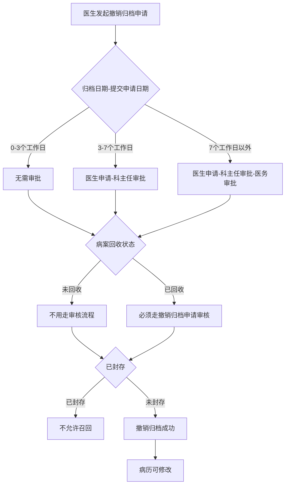
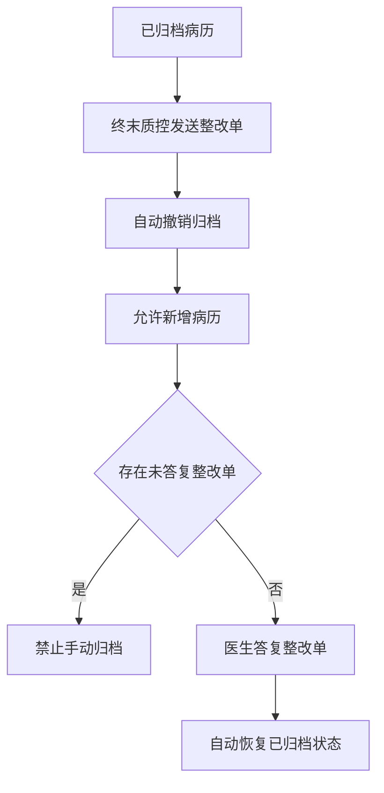

# BLGL-09-GDJY-003 病历撤销归档 _ Analyst - Spec

> **需求编号**：BLGL-09-GDJY-003
> **父需求**：BLGL-09-GDJY
> **关联PM Spec**：BLGL-09-GDJY-003_病历撤销归档_PM-spec.md
> **Spec版本**：V1.0
> **编写时间**：2026-08-15
> **编写人**：需求分析师

---

## 一、功能编号体系

### 1.1 功能层级结构

```
BLGL-09-GDJY-003-001: 撤销归档审批流程
  ├─ BLGL-09-GDJY-003-001-01: 0-3 工作日无需审批
  ├─ BLGL-09-GDJY-003-001-02: 3-7 工作日医生申请-科主任审批
  └─ BLGL-09-GDJY-003-001-03: 7 工作日以外医生申请-科主任-医务审批

BLGL-09-GDJY-003-002: 撤销归档状态判断
  ├─ BLGL-09-GDJY-003-002-01: 病案回收状态判断
  └─ BLGL-09-GDJY-003-002-02: 封存病历不允许召回

BLGL-09-GDJY-003-003: 整改单联动撤销归档
  ├─ BLGL-09-GDJY-003-003-01: 发送整改单自动撤销归档
  └─ BLGL-09-GDJY-003-003-02: 整改完成自动恢复归档

BLGL-09-GDJY-003-004: 批量撤销归档
  └─ BLGL-09-GDJY-003-004-01: 批量回退未归档状态
```

### 1.2 功能编号表

| REQ-ID | 功能名称 | 类型 | 优先级 | 说明 |
|--------|---------|------|--------|------|
| BLGL-09-GDJY-003-001 | 撤销归档审批流程 | 功能 | P0 | 按归档日期分档 |
| BLGL-09-GDJY-003-001-01 | 0-3 工作日无需审批 | 子功能 | P0 | 节假日除外 |
| BLGL-09-GDJY-003-001-02 | 3-7 工作日科主任审批 | 子功能 | P0 | 医生申请-科主任审批 |
| BLGL-09-GDJY-003-001-03 | 7 工作日外医务审批 | 子功能 | P0 | 医生申请-科主任-医务审批 |
| BLGL-09-GDJY-003-002 | 撤销归档状态判断 | 功能 | P0 | 回收/封存状态判断 |
| BLGL-09-GDJY-003-002-01 | 病案回收状态判断 | 子功能 | P0 | 已回收走审核，未回收不用走 |
| BLGL-09-GDJY-003-002-02 | 封存病历不允许召回 | 子功能 | P0 | 已归档封存后不允许召回 |
| BLGL-09-GDJY-003-003 | 整改单联动撤销归档 | 功能 | P1 | 整改单自动撤销/恢复归档 |
| BLGL-09-GDJY-003-003-01 | 发送整改单自动撤销归档 | 子功能 | P1 | 自动撤销并允许新增病历 |
| BLGL-09-GDJY-003-003-02 | 整改完成自动恢复归档 | 子功能 | P1 | 答复后自动恢复已归档 |
| BLGL-09-GDJY-003-004 | 批量撤销归档 | 功能 | P2 | 批量回退未归档 |
| BLGL-09-GDJY-003-004-01 | 批量回退未归档状态 | 子功能 | P2 | 批量将已归档病历回退 |

---

## 二、核心业务流程

### 2.1 撤销归档审批主流程



### 2.2 整改单联动撤销归档流程



---

## 三、功能规格说明

### BLGL-09-GDJY-003-001: 撤销归档审批流程

#### 3.1.1 功能概述

如归档的住院病历未封存且未打印也需要走审批流程（归档日期-提交申请日期）：0-3个工作日（节假日除外）无需审批；3-7个工作日内审批流=医生申请-科主任审批；7个工作日以外审批流=医生申请-科主任审批-医务审批。

#### 3.1.2 用户角色

| 角色 | 使用场景 | 权限要求 | 操作频率 |
|------|---------|---------|---------|
| 住院医生 | 发起撤销归档申请 | 病历书写权限 | 中频 |
| 科主任 | 审批撤销归档 | 科主任权限 | 中频 |
| 医务科 | 审批 7 工作日外撤销归档 | 医务权限 | 低频 |

#### 3.1.3 业务流程（Given/When/Then）

**Scenario 1: 3-7 工作日撤销归档（主流程）**

```gherkin
Given:
  - 已归档住院病历未封存且未打印
  - 归档日期-提交申请日期在 3-7 个工作日内

When:
  - 医生提交撤销归档申请

Then:
  - 审批流=医生申请-科主任审批
```

**Scenario 2: 0-3 工作日撤销归档**

```gherkin
Given:
  - 归档日期-提交申请日期在 0-3 个工作日内（节假日除外）

When:
  - 医生提交撤销归档申请

Then:
  - 无需审批
```

**Scenario 3: 7 工作日以外撤销归档**

```gherkin
Given:
  - 归档日期-提交申请日期在 7 个工作日以外

When:
  - 医生提交撤销归档申请

Then:
  - 审批流=医生申请-科主任审批-医务审批
```

**Scenario 4: 边界——节假日计算**

```gherkin
Given:
  - 撤销归档分档计算

When:
  - 计算工作日

Then:
  - 节假日除外
```

#### 3.1.4 数据字段定义

| 字段名 | 类型 | 必填 | 默认值 | 取值范围 | 说明 | 概念ID |
|--------|------|------|--------|---------|------|--------|
| 归档日期 | Date | 是 | - | - | 撤销归档分档 | ⏳ 待确认 |
| 提交申请日期 | Date | 是 | - | - | 撤销归档分档 | ⏳ 待确认 |
| inpatEmrSetFilingId | Long | 是 | - | - | 归档表主键（INP_EMR_ARCHIVE_ID，代码 InpatientEmrArchivePO） | ⏳ 待确认 |
| inpatRhbRecordId | Long | 是 | - | - | 病历簿 ID（INP_RHB_RECORD_ID，代码） | ⏳ 待确认 |
| statusCode | Long | 是 | - | 399058142/399058143 | 归档状态（INP_EMR_ARCHIVE_STATUS，代码 FilingStatusConstant） | ⏳ 待确认 |
| cancelArchiveFlag | Long | 否 | - | - | 撤销归档标记（CANCEL_ARCHIVE_FLAG，代码） | ⏳ 待确认 |

#### 3.1.5 验收标准

| AC编号 | 验收标准 | 对应REQ-ID | 验证方法 | 验证场景 |
|--------|---------|-----------|---------|---------|
| AC-001 | 撤销归档按分档走对应审批流程 | BLGL-09-GDJY-003-001 | 功能测试 | Scenario 1/2/3 |

---

### BLGL-09-GDJY-003-002: 撤销归档状态判断

#### 3.2.1 功能概述

病历召回时需要判断病案的回收状态：病案回收（48小时）→病历质控打回，病案撤销回收→病历自动归档（7天），医生还没有整改完时需要继续修改病历。未回收的不用走审核流程，已回收的需要走审核流程。已归档病历封存后不允许进行召回。

#### 3.2.2 用户角色

| 角色 | 使用场景 | 权限要求 | 操作频率 |
|------|---------|---------|---------|
| 住院医生 | 撤销归档申请 | 病历书写权限 | 中频 |
| 病案室管理员 | 撤销归档审核 | 病案室权限 | 中频 |

#### 3.2.3 业务流程（Given/When/Then）

**Scenario 1: 已回收病历走审核（主流程）**

```gherkin
Given:
  - 病案已回收（48小时）
  - 病历质控打回

When:
  - 医生申请撤销归档

Then:
  - 已回收的病历必须走撤销归档申请审核流程
```

**Scenario 2: 未回收病历不走审核**

```gherkin
Given:
  - 病案未回收

When:
  - 医生申请撤销归档

Then:
  - 未回收的病历不用走审核流程
```

**Scenario 3: 封存病历不允许召回**

```gherkin
Given:
  - 已归档病历已封存

When:
  - 发起召回

Then:
  - 已归档病历封存后不允许进行召回
```

#### 3.2.4 数据字段定义

| 字段名 | 类型 | 必填 | 默认值 | 取值范围 | 说明 | 概念ID |
|--------|------|------|--------|---------|------|--------|
| 病案回收状态 | String | 否 | - | 未回收/已回收 | 撤销归档判断 | ⏳ 待确认 |
| 封存状态 | String | 否 | - | 已封存/未封存 | 封存病历不允许召回 | ⏳ 待确认 |

#### 3.2.5 验收标准

| AC编号 | 验收标准 | 对应REQ-ID | 验证方法 | 验证场景 |
|--------|---------|-----------|---------|---------|
| AC-002 | 已回收病历走审核流程，未回收不用走 | BLGL-09-GDJY-003-002 | 功能测试 | Scenario 1/2 |
| AC-003 | 封存病历不允许召回 | BLGL-09-GDJY-003-002 | 功能测试 | Scenario 3 |

---

### BLGL-09-GDJY-003-003: 整改单联动撤销归档

#### 3.3.1 功能概述

新增全院参数"整改单答复后自动归档"（是/否，默认否）。已归档病历，终末质控发送整改单时自动撤销归档（已有流程）；发送整改单自动撤销归档后允许新增病历；参数开启后，存在未答复整改单时禁止手动归档，医生答复整改单后自动恢复已归档状态。病历质控整改归档锁定：存在待整改缺陷时病历不得归档，整改完成后方可进入归档流程。

#### 3.3.2 用户角色

| 角色 | 使用场景 | 权限要求 | 操作频率 |
|------|---------|---------|---------|
| 质控人员 | 发送整改单 | 质控权限 | 中频 |
| 住院医生 | 答复整改单 | 病历书写权限 | 中频 |

#### 3.3.3 业务流程（Given/When/Then）

**Scenario 1: 整改单自动撤销归档（主流程）**

```gherkin
Given:
  - 已归档病历
  - 参数"整改单答复后自动归档"开启

When:
  - 终末质控发送整改单

Then:
  - 自动撤销归档
  - 允许新增病历
```

**Scenario 2: 未答复整改单禁止归档**

```gherkin
Given:
  - 参数开启
  - 存在未答复整改单

When:
  - 医生手动归档

Then:
  - 禁止手动归档
```

**Scenario 3: 整改完成自动恢复归档**

```gherkin
Given:
  - 医生答复整改单

When:
  - 整改完成

Then:
  - 自动恢复已归档状态
```

**Scenario 4: 待整改缺陷锁定归档**

```gherkin
Given:
  - 病历存在待整改缺陷

When:
  - 归档

Then:
  - 病历不得归档
  - 整改完成后方可进入归档流程
```

#### 3.3.4 数据字段定义

| 字段名 | 类型 | 必填 | 默认值 | 取值范围 | 说明 | 概念ID |
|--------|------|------|--------|---------|------|--------|
| 整改单答复后自动归档 | Boolean | 否 | 否 | 是/否 | 整改单归档联动参数 | ⏳ 待确认 |

#### 3.3.5 验收标准

| AC编号 | 验收标准 | 对应REQ-ID | 验证方法 | 验证场景 |
|--------|---------|-----------|---------|---------|
| AC-004 | 发送整改单自动撤销归档，整改完成自动恢复 | BLGL-09-GDJY-003-003 | 集成测试 | Scenario 1/3 |
| AC-005 | 存在未答复整改单禁止手动归档 | BLGL-09-GDJY-003-003 | 功能测试 | Scenario 2 |

---

### BLGL-09-GDJY-003-004: 批量撤销归档

#### 3.4.1 功能概述

支持批量将已归档病历回退至未归档状态。撤销归档菜单与手动归档菜单同查询条件和查询结果，但归档状态查询条件默认为已归档，操作列只展示【归档】操作，右下角新增【批量撤销归档】按钮。

#### 3.4.2 用户角色

| 角色 | 使用场景 | 权限要求 | 操作频率 |
|------|---------|---------|---------|
| 病案室管理员 | 批量撤销归档 | 病案室权限 | 中频 |

#### 3.4.3 业务流程（Given/When/Then）

**Scenario 1: 批量撤销归档（主流程）**

```gherkin
Given:
  - 撤销归档菜单，归档状态查询条件默认为已归档

When:
  - 勾选已归档状态的患者
  - 点击批量撤销归档

Then:
  - 支持对所勾选患者批量撤销归档
  - 无撤销归档权限的患者批量按钮置灰并提示"存在无撤销归档权限的患者，请先取消勾选！"
```

**Scenario 2: 边界——无权限患者**

```gherkin
Given:
  - 勾选的患者中有无撤销归档权限的

When:
  - 点击批量撤销归档

Then:
  - 批量撤销归档按钮置灰
  - 悬浮提示存在无撤销归档权限的患者
```

#### 3.4.4 数据字段定义

| ⏳ 待确认 | 批量撤销归档无独立业务字段 | 依赖撤销归档权限 |

#### 3.4.5 验收标准

| AC编号 | 验收标准 | 对应REQ-ID | 验证方法 | 验证场景 |
|--------|---------|-----------|---------|---------|
| AC-006 | 批量撤销归档成功，无权限患者按钮置灰提示 | BLGL-09-GDJY-003-004 | 功能测试 | Scenario 1/2 |
| AC-007 | 撤销归档接口 archive/cancel 调用成功后病历回退为未归档状态（399058143） | BLGL-09-GDJY-003-001 | 接口测试 | Scenario 1 |

---

## 四、排除范围

本需求不包含以下功能项：

1. **病历自动归档**（定时任务自动归档）—— BLGL-09-GDJY-001
2. **病历手动归档**（主动归档）—— BLGL-09-GDJY-002
3. **病历召回申请/召回审核** —— BLGL-09-GDJY-004/-005
4. **病历借阅流程** —— BLGL-09-GDJY-006
5. **三方病案系统对接** —— BLGL-09-GDJY-007
6. **归档校验与提醒** —— BLGL-09-GDJY-009
7. **病历封存**（独立模块）—— BLGL-18-BLFC

---

## 五、业务规则清单

| 规则ID | 规则名称 | 规则描述 | 来源 | 优先级 |
|--------|---------|---------|------|--------|
| BR-001 | 撤销归档分档 | 0-3 工作日无需审批，3-7 工作日医生申请-科主任审批，7 工作日外医生申请-科主任-医务审批（节假日除外） |  | P0 |
| BR-002 | 回收状态判断 | 病历召回判断病案回收状态，未回收不用走审核，已回收必须走撤销归档申请 | 1 | P0 |
| BR-003 | 封存限制 | 已归档病历封存后不允许召回 |  | P0 |
| BR-004 | 整改单联动 | 发送整改单自动撤销归档并允许新增病历，未答复禁止手动归档，答复后自动恢复归档 | 0 | P1 |
| BR-005 | 整改锁定 | 存在待整改缺陷时病历不得归档，整改完成后方可归档 | 3 | P1 |
| BR-006 | 批量撤销 | 批量撤销归档无权限患者按钮置灰并提示 | 2 | P1 |
| BR-007 | 撤销归档接口 | 手动撤销归档接口 archive/cancel（入参 InpatEmrSetFilingUpdateInputAO 含 cancelArchiveFlag），归档状态回退为未归档（399058143） | 代码 | P0 |

---

## 六、关联文档

| 文档类型 | 文档路径 | 说明 |
|---------|---------|------|
| 功能点Spec（模块级） | 上级目录 BLGL-09-GDJY 归档借阅功能点Spec.md（V1.0） | 模块级功能点索引 |
| 功能Spec（业务背景与设计） | 本目录 BLGL-09-GDJY-003_病历撤销归档-Spec.md（V1.0） | 业务背景与目标 Spec |
| Analyst-Spec（分析规格） | 本目录 BLGL-09-GDJY-003_病历撤销归档_Analyst-spec.md（V1.0）（本文档） | 分析规格 |
| PM-Spec（需求规格） | 本目录 BLGL-09-GDJY-003_病历撤销归档_PM-spec.md（V0.1） | PM 产出的 Spec 文档 |
| data-model.md | 待产出 | 架构师产出的数据建模文档 |
| design.md | 待产出 | 架构师产出的技术方案文档 |
| api-contract.md | 待产出 | 开发经理产出的 API 契约文档 |

---

## 七、待确认问题清单

| 编号 | 问题描述 | 缺失信息 | 影响范围 | 建议补充方 |
|------|---------|---------|---------|-----------|
| Q-001 | 撤销归档申请/审核接口完整入参/出参 | API 契约 | -Spec 第5章 | 开发经理 |
| Q-002 | 撤销归档分档参数概念 ID | 概念ID | 3.1.4 | 产品经理 |
| Q-003 | 病案回收状态判断接口 | API 契约 | 3.2.3 | 开发经理 |
| Q-004 | 撤销归档后归档失败（1）根因 | 需求分析原文缺失 | 3.2.3 | 开发经理 |
| Q-005 | 批量撤销归档权限判断逻辑 | 需求分析原文 | 3.4.3 | 需求分析师 |
| Q-006 | 性能指标（撤销归档审批响应时间） | 资料区无量化指标 | -Spec 第8章 | 产品经理 |

---

## 填写检查清单

| 序号 | 检查项 | 是否完成 |
|:----:|--------|:--------:|
| 1 | 功能编号带父子层级 | ✅ |
| 2 | 每个 REQ-ID 有功能概述和用户角色 | ✅ |
| 3 | 主流程至少 1 个 Given/When/Then 场景 | ✅ |
| 4 | 异常流程至少 3 个 Given/When/Then 场景 | ✅ |
| 5 | 边界流程至少 2 个 Given/When/Then 场景 | ✅ |
| 6 | 每个 Given/When/Then 内容具体，不模糊 | ✅ |
| 7 | 数据字段定义完整（字段名、类型、必填、说明、概念ID） | ✅ |
| 8 | 验收标准 AC 编号独立，可验证 | ✅ |
| 9 | 验收标准无"功能正常"等模糊表述 | ✅ |
| 10 | 排除范围明确列出 | ✅ |
| 11 | 业务规则清单列出所有规则，每条标注来源 | ✅ |
| 12 | 流程图使用 Mermaid 格式（≥2 个） | ✅ |
| 13 | 关联文档索引包含 Phase 1 功能点Spec | ✅ |
| 14 | 待确认问题清单汇总了全文所有 ⏳ 项 | ✅ |
| 15 | 全文无占位符 `< >` 残留 | ✅ |
| 16 | 全文陈述可溯源至资料区（S1~S10 溯源核查） | ✅ |
| 17 | 人工审核确认完成 | ⏳ 待确认 |

---

**文档状态**：⬜ 待审核
**维护责任**：需求分析师规范组
**下次更新**：根据评审反馈优化

---

## 版本历史

| 版本 | 日期 | 变更说明 | 编写人 |
|------|------|---------|--------|
| V1.0 | 2026-08-15 | 初始版本 | 需求分析师 |
