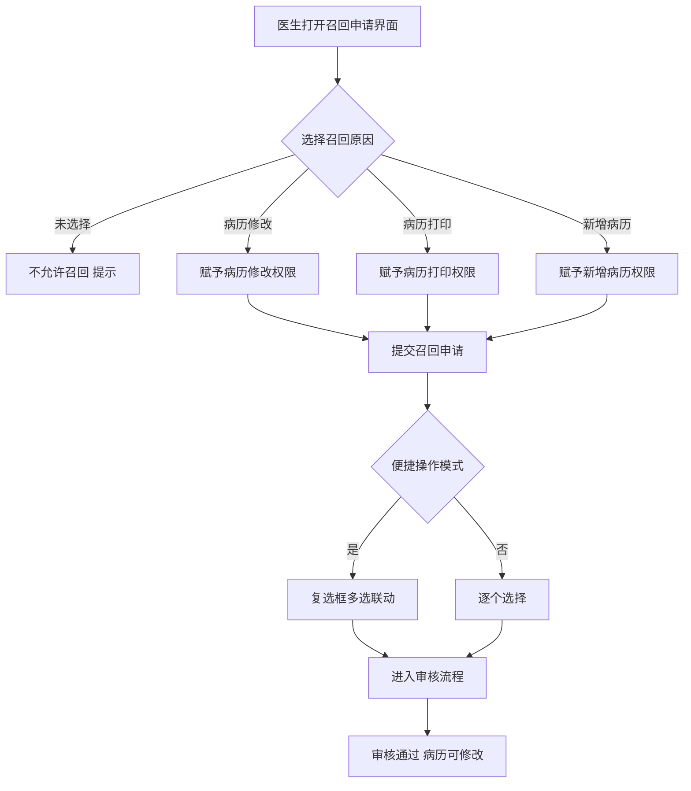
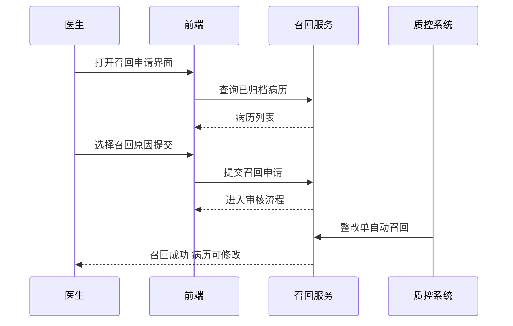

# BLGL-09-GDJY-004 病历召回申请 - Spec

> **功能编号**：BLGL-09-GDJY-004
> **文档类型**：功能Spec（业务背景与设计）
> **文档版本**：V1.0
> **编写时间**：2026-08-15
> **编写人**：RACC

---

## 文档索引

#### 章节索引

**Spec（研发视角）**

| 章节号 | 章节名称 | 内容说明 |
|--------|---------|---------|
| 1、 | 文档概述 | 文档目的、文档范围、术语定义、阅读指南、参考文档 |
| 2、 | 功能背景与定位 | 功能背景、功能定位、目标用户、核心价值 |
| 3、 | 业务流程设计 | 主流程/异常流程/边界流程（Given/When/Then） |
| 4、 | 数据模型设计 | 核心数据结构、状态定义、系统参数定义 |
| 5、 | 接口契约设计 | API列表、接口详细设计、错误码定义 |
| 6、 | 技术方案设计 | 页面路径、技术栈、关键技术点、部署方案 |
| 7、 | 测试用例预设计 | 功能/边界/异常/性能测试用例 |
| 8、 | 非功能性要求 | 性能、安全、可用性、兼容性 |
| 9、 | 依赖与风险 | 外部依赖、风险项 |
| 10、 | 附录 | 流程图、时序图、参考文档 |

**PM-Spec（业务视角）**

| 章节号 | 章节名称 | 内容说明 |
|--------|---------|---------|
| 一 | 目标 | 功能定位与核心价值 |
| 二 | 约束 | 业务/技术/非功能性约束 |
| 三 | 验收标准 | 验收条件与验证方法 |
| 四 | 排除范围 | 本次不做项与明确边界 |
| 五 | 关键决策记录 | 方案决策与选型理由 |
| 六 | 优先级 | 优先级定义 |
| 七 | 关联文档 | 关联文档索引 |
| 附录 | 填写检查清单 | 质量检查 |

**Analyst-Spec（产品视角）**

| 章节号 | 章节名称 | 内容说明 |
|--------|---------|---------|
| 一 | 功能编号体系 | 功能编号与层级结构 |
| 二 | 核心业务流程 | 核心业务流程与时序 |
| 三 | 功能规格说明 | 详细功能规格与验收标准 |
| 四 | 排除范围 | 排除范围 |
| 五 | 业务规则清单 | 业务规则清单 |
| 六 | 关联文档 | 关联文档索引 |
| 七 | 待确认问题清单 | 待确认问题汇总 |
| - | 填写检查清单 | 质量检查 |

#### 版本历史

| 版本 | 日期 | 变更说明 | 编写人 |
|------|------|---------|--------|
| V1.0 | 2026-08-15 | 初始版本 | RACC |

#### 关联文档索引

| 序号 | 文档名称 | 文档类型 | 版本 | 位置 |
|------|---------|---------|------|------|
| 1 | BLGL-09-GDJY 归档借阅功能点Spec.md | 功能点Spec（模块级） | V1.0 | 上级目录 |
| 2 | BLGL-09-GDJY-004_病历召回申请-Spec.md | 功能Spec（业务背景与设计）（本文档） | V1.0 | 本目录 |
| 3 | BLGL-09-GDJY-004_病历召回申请_Analyst-spec.md | Analyst-Spec（分析规格） | V1.0 | 本目录 |
| 4 | BLGL-09-GDJY-004_病历召回申请_PM-spec.md | PM-Spec（需求规格） | V0.1 | 本目录 |

---

## 1、文档概述

### 1.1、文档目的

本文档旨在明确"病历召回申请"功能（BLGL-09-GDJY-004）的业务背景与设计方案，为需求分析、研发实现、测试验收及评审提供统一的业务上下文、设计口径与决策依据。

**具体目的包括**：

1. 梳理病历召回申请功能的业务由来与历史需求演进脉络，说明"为什么要做"；
2. 明确功能的定位边界、目标用户与核心价值，回答"做成什么"；
3. 描述功能的业务流程、数据模型、接口契约与技术方案，回答"怎么做"；
4. 预设计测试用例并明确非功能性要求、依赖与风险，为研发与验收提供依据；
5. 作为 Analyst-Spec 的业务前提与设计输入，保证各层文档业务口径一致。

### 1.2、文档范围

#### 1.2.1 纳入范围

本文档覆盖病历召回申请的完整业务背景与设计，包括：

- 召回申请发起：召回原因选择（病历修改/打印/新增）、便捷操作模式、未选择召回原因不允许召回
- 召回申请原因管理：自定义召回原因、原因备注、原因配置页面
- 撤销召回：未审核的召回申请可撤回
- 召回界面优化：查看召回原因、待处理任务"去处理"按钮
- 转出科室召回：就诊科室筛选、转出患者可召回修改
- 质控整改自动召回：整改单自动召回病历文书
- 召回状态显示：未召回病历锁定图标、病历状态与召回状态分离
- 召回打印限制：限制一键全选、规范打印原因

#### 1.2.2 排除范围

本文档不涉及以下内容（详见其他功能点或模块）：

- 病历自动归档/手动归档 —— BLGL-09-GDJY-001/-002
- 病历撤销归档（撤销归档审批流程）—— BLGL-09-GDJY-003
- 病历召回审核（多级审批）—— BLGL-09-GDJY-005
- 病历借阅流程 —— BLGL-09-GDJY-006
- 三方病案系统对接 —— BLGL-09-GDJY-007
- 归档校验与提醒 —— BLGL-09-GDJY-009

### 1.3、术语定义

| 术语 | 定义 |
|------|------|
| 病历召回 | 已归档病历因修改/打印/新增需求，由医生发起召回申请，召回后病历可修改 |
| 召回原因 | 病历修改/病历打印/新增病历等，选择后赋予对应操作权限 |
| 便捷操作模式 | 召回参数配置参数，开启后召回申请页面首列增加复选框、多选操作及默认召回原因 |
| 质控整改自动召回 | 终末质控整改单发送后自动召回需要整改的病历文书 |

### 1.4、阅读指南

- **章节关系**：第1~2章为业务全貌，第3~10章为设计实现层。与 Analyst-Spec、PM-Spec 互相引用保持一致。
- **读者对象**：产品经理/需求分析师读第1~2章；研发读第3~6、9~10章；测试读第3、7~8章；评审人员核对各层一致性。

### 1.5、参考文档

| 序号 | 文档名称 | 版本/日期 |
|------|---------|----------|
| 1 | 【历史需求】住院病历的历史需求.xlsx | - |
| 2 | BLGL-09-GDJY-004_病历召回申请_PM-spec.md | V0.1 |
| 3 | BLGL-09-GDJY-004_病历召回申请_Analyst-spec.md | V1.0 |
| 4 | BLGL-09-GDJY 归档借阅功能点Spec.md | V1.0 |

---

## 2、功能背景与定位

### 2.1 功能背景

病历召回申请是归档借阅模块的核心操作入口（L1），需满足：

- **现状痛点**：病历召回操作繁琐，召回页面召回修改原因和召回打印原因写反；转出科室无法对患者归档病历召回修改；召回患者的几份病历后其他未召回病历无标识
- **管理要求**：医务科确认每份病历的召回原因，供后续统计分析；终末质控整改单需自动召回需要整改的病历文书
- **历史需求演进**：病历召回优化便捷操作模式→ 撤销召回→ 转出科室召回→ 质控整改自动召回→ 召回原因自定义/备注（7）

### 2.2 功能定位

"病历召回申请"是 WiNEX 病历管理-归档借阅的核心操作入口，定位为：

- **召回发起**：医生对已归档病历发起召回申请，选择召回原因
- **原因管控**：召回原因自定义/备注/便捷操作
- **质控联动**：整改单自动召回病历文书

### 2.3 目标用户

| 用户角色 | 主要使用场景 |
|---------|-------------|
| 住院医生 | 对已归档病历发起召回申请 |
| 医务科 | 配置/确认召回原因 |
| 质控人员 | 发送整改单自动召回 |

### 2.4 核心价值

| 价值维度 | 价值描述 |
|---------|---------|
| 召回高效 | 便捷操作模式、多选操作、默认召回原因 |
| 原因可溯 | 召回原因自定义/备注供统计分析 |
| 质控联动 | 整改单自动召回 |

---

## 3、业务流程设计（Given/When/Then）

### 3.1 主流程

**Scenario 1: 病历召回申请**

```gherkin
Given:
  - 已归档病历需修改/打印/新增
  - 医生有召回权限

When:
  - 医生打开召回申请界面
  - 选择召回原因（病历修改/打印/新增）

Then:
  - 未选择召回原因不允许召回
  - 选择召回原因后赋予对应操作权限
  - 提交召回申请进入审核流程
```

### 3.2 异常流程

**Scenario 2: 业务异常——未选择召回原因**

```gherkin
Given:
  - 医生打开召回申请界面
  - 未选择任何召回原因

When:
  - 点击提交召回申请

Then:
  - 不允许召回
  - 提示选择召回原因
```

**Scenario 3: 数据异常——转出科室无法召回**

```gherkin
Given:
  - 患者已转出科室
  - 病历已归档

When:
  - 转出科室医生申请召回

Then:
  - 原逻辑无法召回修改（问题）
  - 需支持按就诊科室查询包含已转出患者并申请召回
```

**Scenario 4: 系统异常——召回申请提交报错**

```gherkin
Given:
  - 医生提交召回申请

When:
  - 提交

Then:
  - 提交报错（问题）
  - 需排查召回申请提交逻辑
```

### 3.3 边界流程

**Scenario 5: 边界——便捷操作模式**

```gherkin
Given:
  - 召回参数配置"是否启用便捷操作模式"=是

When:
  - 打开召回申请页面

Then:
  - 首列增加复选框
  - 勾选目录自动选中召回新增原因并勾选其下属病历
  - 勾选表头自动勾选所有目录和病历
```

**Scenario 6: 边界——质控整改自动召回**

```gherkin
Given:
  - 患者病历处于已归档状态且需整改
  - 质控单配置为自动召回

When:
  - 医生接收到质控单

Then:
  - 系统自动调用召回接口
  - 按照需要整改的病历文书进行召回
  - 召回打印原因默认"病历补打印"，召回修改原因默认"质控整改"
```

---

## 4、数据模型设计

### 4.1 核心数据结构

#### 4.1.1 核心保存请求

| 字段名 | 类型 | 必填 | 备注 |
|--------|------|------|------|
| inpRhbRecordId | Long | 是 | 住院病历患者就诊主记录 ID |
| 召回原因 | String | 是 | 病历修改/打印/新增 |
| 原因备注 | String | 否 | 最大 500 字符 |
| 申请科室 | String | 否 | 召回申请时记录申请人当前登录科室 |

> ⏳ 待确认：召回申请接口完整入参/出参以代码扫描和 API 契约为准。

#### 4.1.2 核心表/实体

| 表/实体 | 关键字段 | 说明 |
|---------|---------|------|
| INP_EMR_ARCHIVE_RECALL（InpEmrArchiveRecallPO） | filingRecallId(INP_EMR_ARCH_RECALL_ID)、inpatEmrSetFilingId(INP_EMR_ARCHIVE_ID)、currentFilingAuditId(CURRENT_ARCH_RECALL_REVIEW_ID)、filingRecallStatusCode(INP_EMR_ARCH_RECALL_STATUS)、filingRecallReason(ARCH_RECALL_REASON)、reasonRemark(REASON_REMARK)、recallTypeCode(RECALL_TYPE_CODE)、lastArchiveAt(LATEST_ARCHIVE_AT)、lastPlanArchiveAt(LATEST_PLAN_ARCHIVE_AT) | 召回申请表（召回原因/备注/类型，代码） |
| INP_EMR_ARCHIVE_RECALL_DETAIL（InpEmrArchiveRecallDetailPO） | inpEmrArchRecallDetailId、inpEmrArchRecallId、inpEmrSetId、inpRhbRecordId、recallFlag(RECALL_FLAG)、inpEmrRecallActionItemId(INP_EMR_RECALL_ACTION_ITEM_ID)、inpEmrClassId | 召回明细表（召回流程与病历对应关系，代码） |
| INP_EMR_RECALL_ACTION_LOG（InpEmrRecallActionLogPO） | inpEmrRecallActionLogId、inpEmrArchRecallId、patientId、patientName、admissionNumber、employeeNo、actionCode、ipAddress、macAddress、encounterId | 召回操作日志表 |
| INP_EMR_RECALL_ACTION_ITEM（InpEmrRecallActionItemPO，定义态） | inpEmrRecallActionItemId、emrRecallActionItemCode、emrRecallActionItemName、recallActionTypeCode、recallActionTypeName、reviewFlag、enableFlag | 召回操作项目配置表（召回原因，代码） |

> 注：召回原因类型 RECALL_TYPE_CODE 枚举：399643271 病历召回 / 399643270 病理召回 / 399623249 召回打印。

### 4.2 状态定义

| 状态码 | 状态名称 | 说明 |
|--------|---------|------|
| - | 待审核 | 召回申请状态 |
| - | 审核通过 | 召回申请审核通过 |
| - | 退回 | 召回申请审核不通过 |
| 399058142 | 已归档 | 病历归档状态（FilingStatusConstant.ARCHIVE，代码） |
| 399291265 | 已召回 | 病历归档状态（FilingStatusConstant.RECALLED，代码） |

### 4.3 系统参数定义

| 参数编码 | 参数名称 | 说明 |
|---------|---------|------|
| - | 是否启用便捷操作模式 | 是/否，默认否 |
| COMMON111 | 申请病历召回的操作模式 | 单选/复选（全部）/复选（新增）/复选（修改）/复选（打印）/全选 |

---

## 5、接口契约设计

### 5.1 API列表

| 序号 | API名称（代码函数） | 路径 | 方法 | 说明 |
|:----:|---------|------|:----:|------|
| 1 | 提交归档召回申请单 | /api/v1/app_record_inpatient/emr_inpatient/emr_set_filing_recall/commit | POST | 提交召回申请（入参 InpatEmrSetFilingRecallSaveInputAO） |
| 2 | 保存归档召回申请单（保存、修改） | /api/v1/app_record_inpatient/emr_inpatient/emr_set_filing_recall/save | POST | 保存/修改召回申请 |
| 3 | 查询病历召回信息 | /api/v1/app_record_inpatient/inpatient_record_emr/recall/query_recall_authorization | POST | 召回授权查询（入参 InpatEncAuthorizationInputAO，出参 InpEmrArchiveRecallOutputVO） |
| 4 | 查询归档召回项目分类和召回项目 | /api/v1/app_record_inpatient/emr_inpatient/recall_action_type_and_item/query | POST | 召回原因/项目查询（出参 List<InpEmrRecallTypeItemGetOutputVO>） |
| 5 | 撤销召回申请 | /api/v1/app_record_inpatient/inpatient_emr/rhb_archive_apply/cancel | POST | 撤销召回申请（入参 InpEmrRhbRecordRecallCancelInputAO） |
| 6 | 查询病历召回列表 | /api/v1/app_record_inpatient/emr_inpatient/emr_set_filing_recall_step/query | POST | 召回查询列表（入参 InpatEmrFilingRecallStepQueryInputAO） |
| 7 | 查询归档召回详情 | /api/v1/app_record_inpatient/emr_inpatient/emr_filing_recall_detail/query | POST | 召回详情（入参 InpatEmrSetFilingRecallDetailQueryInputAO） |

### 5.2 接口详细设计

#### 5.2.1 提交归档召回申请单（emr_set_filing_recall/commit）

**请求参数**:
```json
{
  "inpRhbRecordId": "12345",
  "filingRecallReason": "病历修改;质控整改",
  "reasonRemark": "补充病理诊断",
  "recallTypeCode": "399643271",
  "allowNewEmr": false,
  "applyDeptId": "1001",
  "recallDetailList": [
    {
      "inpEmrSetId": "20001",
      "inpEmrRecallActionItemId": "30001",
      "recallFlag": "1"
    }
  ]
}
```

**返回值（成功）**:
```json
{
  "success": true,
  "data": null
}
```

> ⏳ 待确认：召回申请接口字段以代码扫描（InpatEmrSetFilingRecallSaveInputAO）和 API 契约为准（入参含是否允许新增病历，6）。

**返回值（失败）**:
```json
{
  "success": false,
  "message": "未选择召回原因不允许召回",
  "data": null
}
```

### 5.3 错误码定义

| 错误码 | 错误信息 | 处理方式 |
|--------|---------|---------|
| ⏳ 待确认 | 未选择召回原因不允许召回 | 提示选择召回原因 |
| ⏳ 待确认 | 已归档病历封存后不允许召回 | 阻止召回 |

---

## 6、技术方案设计

### 6.1 页面路径

- **页面路径**: 住院医生站→日常管理→病历归档→归档查询/召回查询（召回申请，src/router/EmrArchiving.js recall-application）
- **前端逻辑**: 便捷操作模式复选框交互、召回原因选择
- **后端模块**: winning-emr-ipt-archive/winning-emr-ipt-archive-provider/controller/InpEmrRecallController.java（提交/保存归档召回申请单、撤销召回申请、查询召回列表）
- **前端 API**: winning-webui-inpatient-clinicalnote-pango/src/pages/ClinicalnoteArchiveManage/api/index.js（apiInpatFilingRecallCommit → emr_set_filing_recall/commit、apiInpatFilingRecallSave → emr_set_filing_recall/save、cancelArchiveApply → rhb_archive_apply/cancel、queryRecallActionTypeAndItem → recall_action_type_and_item/query、queryFilingRecallDetail → emr_filing_recall_detail/query）

### 6.2 技术栈

| 类别 | 技术 | 版本 |
|------|------|------|
| 前端框架 | Vue | 2.6.14 |
| 前端UI | element-ui | 2.13.0 |
| 后端框架 | Spring Boot（Java 17）+ JPA/Hibernate | - |
| RPC | winning-akso-rpc-rest | - |

### 6.3 关键技术点

- 便捷操作模式下复选框多选联动：目录/病历/表头勾选自动选中
- 召回原因配置页面支持自定义新增，不能与已有项目重复，必填最大 100 字符
- 质控整改自动召回：调用召回接口按需召回病历文书

### 6.4 部署方案

⏳ 待确认：部署方案未在资料区中找到。

---

## 7、测试用例预设计

### 7.1 功能测试

| 用例编号 | 测试场景 | Given | When | Then |
|---------|---------|-------|------|------|
| TC-001 | 病历召回申请 | 已归档病历，医生有召回权限 | 选择召回原因并提交（emr_set_filing_recall/commit） | 召回申请提交进入审核 |
| TC-002 | 召回原因/项目查询 | 召回申请界面 | 调用 recall_action_type_and_item/query | 返回召回项目分类和召回项目 |

### 7.2 边界测试

| 用例编号 | 测试场景 | Given | When | Then |
|---------|---------|-------|------|------|
| TC-003 | 便捷操作模式 | 参数=是 | 勾选目录/表头 | 自动选中下属病历及原因 |
| TC-004 | 撤销召回申请 | 未审核的召回申请 | 调用 rhb_archive_apply/cancel | 撤销申请成功 |

### 7.3 异常测试

| 用例编号 | 测试场景 | Given | When | Then |
|---------|---------|-------|------|------|
| TC-005 | 未选择召回原因 | 未选召回原因 | 提交召回 | 不允许召回提示 |
| TC-006 | 召回授权查询 | 医生申请召回 | 调用 query_recall_authorization | 返回召回授权信息 |

### 7.4 性能测试

| 用例编号 | 测试场景 | 指标 |
|---------|---------|------|
| TC-007 | 召回申请响应 | ⏳ 待确认：性能指标未在资料区中找到 |
| TC-008 | 召回列表查询响应 | ⏳ 待确认：性能指标未在资料区中找到 |

---

## 8、非功能性要求

### 8.1 性能要求

| 指标 | 要求 |
|------|------|
| 召回申请响应时间 | ⏳ 待确认 |

### 8.2 安全要求

| 要求 | 说明 |
|------|------|
| 召回权限 | 召回申请需病历书写权限，无权限发起召回申请提示 |

**医疗行业特殊要求**

| 要求 | 说明 |
|------|------|
| 召回合规 | 召回原因选择后赋予对应操作权限，未选择原因不允许召回 |

### 8.3 可用性要求

| 指标 | 要求值 |
|------|--------|
| 可用性 | ⏳ 待确认 |

### 8.4 兼容性要求

| 类型 | 要求 |
|------|------|
| 科室维度 | 就诊科室筛选包含已转出患者 |
| 状态显示 | 病历状态与召回状态分离展示 |

---

## 9、依赖与风险

### 9.1 外部依赖

| 依赖项 | 说明 |
|--------|------|
| 质控系统 | 整改单自动召回 |
| 病案无纸化 | 无纸化召回对接 |

### 9.2 风险项

| 风险项 | 等级 | 说明 | 应对方案 |
|--------|------|------|---------|
| 召回权限误判 | 中 | 无权限发起召回申请 | 权限校验 |
| 一键全选失控 | 中 | 一键全选所有文书影响审批效率 | COMMON111 控制原因全选 |

---

## 10、附录

### 10.1 流程图



### 10.2 时序图



### 10.3 参考文档

- BLGL-09-GDJY 归档借阅功能点Spec.md（V1.0，第5章 BLGL-09-GDJY-004 行）
- 关联Spec: BLGL-09-GDJY-004_病历召回申请_PM-spec.md、BLGL-09-GDJY-004_病历召回申请_Analyst-spec.md

---

## 填写检查清单

| 序号 | 检查项 | 是否完成 |
|:----:|--------|:--------:|
| 1 | 章节索引与正文章节一致 | ✅ |
| 2 | 版本历史记录完整 | ✅ |
| 3 | 关联文档索引已登记全部Spec | ✅ |
| 4 | 文档目的明确回答"为什么做/做成什么/怎么做" | ✅ |
| 5 | 纳入范围/排除范围清晰 | ✅ |
| 6 | 术语定义覆盖关键概念，从资料区可溯源 | ✅ |
| 7 | 参考文档已登记 | ✅ |
| 8 | 功能背景基于法规/规范/需求来源组织 | ✅ |
| 9 | 功能定位体现业务价值（3~5个定位点） | ✅ |
| 10 | 目标用户角色覆盖完整，在需求原文中有出处 | ✅ |
| 11 | 核心价值可陈述，与 Phase 1 口径一致 | ✅ |
| 12 | 业务流程：主流程≥1、异常≥3、边界≥2，Given/When/Then 具体 | ✅ |
| 13 | 数据模型：字段/表/状态/参数可溯源 | ✅ |
| 14 | 接口契约：API列表+详细设计+错误码齐全或标记待确认 | ✅ |
| 15 | 技术方案：页面路径/技术栈/关键点/部署方案或标记待确认 | ✅ |
| 16 | 测试用例：功能/边界/异常/性能覆盖 | ✅ |
| 17 | 非功能性要求：性能/安全/可用性/兼容性指标可量化或标记待确认 | ✅ |
| 18 | 依赖与风险：外部依赖登记完整 | ✅ |
| 19 | 附录：流程图/时序图与正文流程一致 | ✅ |
| 20 | 全文无占位符 `< >` 残留 | ✅ |
| 21 | 全文陈述可溯源至资料区 | ✅ |
| 22 | 人工审核确认完成 | ⏳ 待确认 |

---

**文档状态**：⬜ 待审核
**维护责任**：RACC
**下次更新**：根据评审反馈优化
