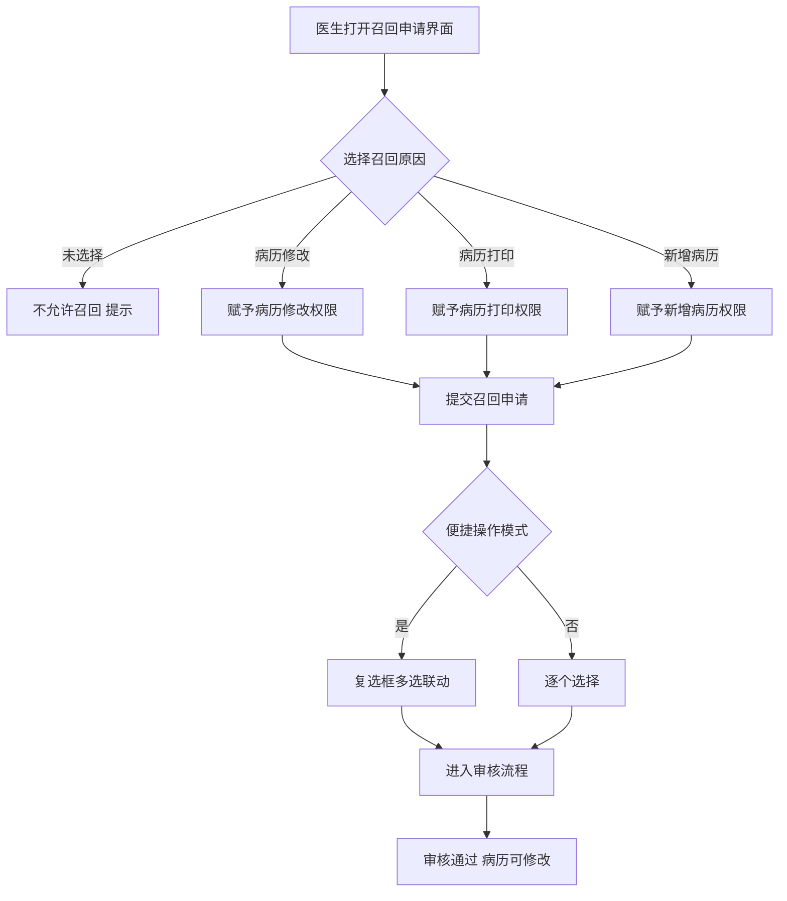
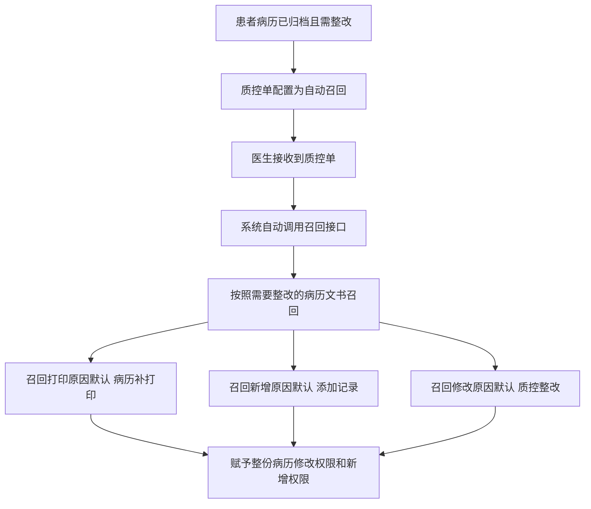

# BLGL-09-GDJY-004 病历召回申请 _ Analyst - Spec

> **需求编号**：BLGL-09-GDJY-004
> **父需求**：BLGL-09-GDJY
> **关联PM Spec**：BLGL-09-GDJY-004_病历召回申请_PM-spec.md
> **Spec版本**：V1.0
> **编写时间**：2026-08-15
> **编写人**：需求分析师

---

## 一、功能编号体系

### 1.1 功能层级结构

```
BLGL-09-GDJY-004-001: 召回申请发起
  ├─ BLGL-09-GDJY-004-001-01: 召回原因选择
  ├─ BLGL-09-GDJY-004-001-02: 未选择原因不允许召回
  └─ BLGL-09-GDJY-004-001-03: 原因备注

BLGL-09-GDJY-004-002: 召回原因管理
  ├─ BLGL-09-GDJY-004-002-01: 自定义召回原因配置
  └─ BLGL-09-GDJY-004-002-02: 便捷操作模式

BLGL-09-GDJY-004-003: 撤销召回
  └─ BLGL-09-GDJY-004-003-01: 未审核申请撤回

BLGL-09-GDJY-004-004: 转出科室召回
  ├─ BLGL-09-GDJY-004-004-01: 就诊科室筛选
  └─ BLGL-09-GDJY-004-004-02: 申请科室记录

BLGL-09-GDJY-004-005: 质控整改自动召回
  └─ BLGL-09-GDJY-004-005-01: 整改单自动召回

BLGL-09-GDJY-004-006: 召回状态显示
  ├─ BLGL-09-GDJY-004-006-01: 未召回病历锁定图标
  └─ BLGL-09-GDJY-004-006-02: 病历状态与召回状态分离
```

### 1.2 功能编号表

| REQ-ID | 功能名称 | 类型 | 优先级 | 说明 |
|--------|---------|------|--------|------|
| BLGL-09-GDJY-004-001 | 召回申请发起 | 功能 | P0 | 召回申请 |
| BLGL-09-GDJY-004-001-01 | 召回原因选择 | 子功能 | P0 | 病历修改/打印/新增，选择赋予权限 |
| BLGL-09-GDJY-004-001-02 | 未选择原因不允许召回 | 子功能 | P0 | 未选召回原因不允许召回 |
| BLGL-09-GDJY-004-001-03 | 原因备注 | 子功能 | P1 | 最大 500 字符 |
| BLGL-09-GDJY-004-002 | 召回原因管理 | 功能 | P1 | 自定义原因/便捷操作 |
| BLGL-09-GDJY-004-002-01 | 自定义召回原因配置 | 子功能 | P1 | 不能重复，必填最大100字符 |
| BLGL-09-GDJY-004-002-02 | 便捷操作模式 | 子功能 | P1 | 复选框多选联动 |
| BLGL-09-GDJY-004-003 | 撤销召回 | 功能 | P1 | 未审核撤回 |
| BLGL-09-GDJY-004-003-01 | 未审核申请撤回 | 子功能 | P1 | 未审核可撤回 |
| BLGL-09-GDJY-004-004 | 转出科室召回 | 功能 | P1 | 就诊科室筛选 |
| BLGL-09-GDJY-004-004-01 | 就诊科室筛选 | 子功能 | P1 | 包含已转出患者 |
| BLGL-09-GDJY-004-004-02 | 申请科室记录 | 子功能 | P1 | 记录当前登录科室 |
| BLGL-09-GDJY-004-005 | 质控整改自动召回 | 功能 | P1 | 整改单自动召回 |
| BLGL-09-GDJY-004-005-01 | 整改单自动召回 | 子功能 | P1 | 召回原因默认配置 |
| BLGL-09-GDJY-004-006 | 召回状态显示 | 功能 | P2 | 状态显示优化 |
| BLGL-09-GDJY-004-006-01 | 未召回病历锁定图标 | 子功能 | P2 | 锁定图标标识 |
| BLGL-09-GDJY-004-006-02 | 病历状态与召回状态分离 | 子功能 | P2 | 状态重叠显示 |

---

## 二、核心业务流程

### 2.1 召回申请主流程



### 2.2 质控整改自动召回流程



---

## 三、功能规格说明

### BLGL-09-GDJY-004-001: 召回申请发起

#### 3.1.1 功能概述

医生对已归档病历发起召回申请，选择召回原因（病历修改/病历打印/新增病历），召回原因选择后自动赋予对应操作权限。未选择召回原因不允许召回。召回发起页面新增备注字段，允许用户自定义录入，最大 500 字符。

#### 3.1.2 用户角色

| 角色 | 使用场景 | 权限要求 | 操作频率 |
|------|---------|---------|---------|
| 住院医生 | 对已归档病历发起召回申请 | 病历书写权限 | 中频 |

#### 3.1.3 业务流程（Given/When/Then）

**Scenario 1: 召回申请（主流程）**

```gherkin
Given:
  - 已归档病历需修改/打印/新增
  - 医生有召回权限

When:
  - 医生打开召回申请界面
  - 选择召回原因

Then:
  - 未选择召回原因不允许召回
  - 选择召回原因后赋予对应操作权限
  - 提交召回申请进入审核流程
```

**Scenario 2: 业务异常——未选择召回原因**

```gherkin
Given:
  - 医生打开召回申请界面
  - 未选择任何召回原因

When:
  - 点击提交召回申请

Then:
  - 不允许召回
  - 提示选择召回原因
```

**Scenario 3: 边界——原因备注**

```gherkin
Given:
  - 召回发起页面

When:
  - 录入原因备注

Then:
  - 备注最大 500 字符
  - 召回审核/查询表格新增"原因备注"字段
```

#### 3.1.4 数据字段定义

| 字段名 | 类型 | 必填 | 默认值 | 取值范围 | 说明 | 概念ID |
|--------|------|------|--------|---------|------|--------|
| 召回原因 | String | 是 | - | 病历修改/病历打印/新增病历/质控整改等 | 召回原因 | ⏳ 待确认 |
| 原因备注 | String | 否 | - | 最大500字符 | 召回原因备注 | ⏳ 待确认 |
| filingRecallId | Long | 是 | - | - | 召回申请表主键（INP_EMR_ARCH_RECALL_ID，代码 InpEmrArchiveRecallPO） | ⏳ 待确认 |
| inpatEmrSetFilingId | Long | 是 | - | - | 关联归档表 ID（INP_EMR_ARCHIVE_ID，代码） | ⏳ 待确认 |
| filingRecallStatusCode | Long | 是 | - | - | 召回申请状态（INP_EMR_ARCH_RECALL_STATUS，代码） | ⏳ 待确认 |
| filingRecallReason | String | 是 | - | 召回原因文本 | 召回原因（ARCH_RECALL_REASON，代码） | ⏳ 待确认 |
| reasonRemark | String | 否 | - | 最大500字符 | 原因备注（REASON_REMARK，代码） | ⏳ 待确认 |
| recallTypeCode | Long | 否 | - | 399643271病历召回/399643270病理召回/399623249召回打印 | 召回类型（RECALL_TYPE_CODE，代码） | ⏳ 待确认 |
| lastArchiveAt | Date | 否 | - | - | 上次归档时间（LATEST_ARCHIVE_AT，代码） | ⏳ 待确认 |
| lastPlanArchiveAt | Date | 否 | - | - | 上次计划归档时间（LATEST_PLAN_ARCHIVE_AT，代码） | ⏳ 待确认 |

#### 3.1.5 验收标准

| AC编号 | 验收标准 | 对应REQ-ID | 验证方法 | 验证场景 |
|--------|---------|-----------|---------|---------|
| AC-001 | 未选择召回原因不允许召回，选择后赋予对应权限 | BLGL-09-GDJY-004-001 | 功能测试 | Scenario 1/2 |
| AC-002 | 原因备注最大500字符，审核/查询显示 | BLGL-09-GDJY-004-001 | 功能测试 | Scenario 3 |

---

### BLGL-09-GDJY-004-002: 召回原因管理

#### 3.2.1 功能概述

召回原因配置页面支持自定义新增，新增时不能与已有的项目名称重复，必填，最大 100 字符，分类单选必填。召回时选择对应字段时自动给予权限。召回参数配置"是否启用便捷操作模式"，开启后召回申请页面首列增加复选框，支持多选操作及默认召回原因。

#### 3.2.2 用户角色

| 角色 | 使用场景 | 权限要求 | 操作频率 |
|------|---------|---------|---------|
| 医务科 | 配置召回原因 | 配置权限 | 低频 |
| 住院医生 | 召回申请便捷操作 | 病历书写权限 | 中频 |

#### 3.2.3 业务流程（Given/When/Then）

**Scenario 1: 自定义召回原因（主流程）**

```gherkin
Given:
  - 医务科打开召回原因配置页面

When:
  - 点击新增按钮自定义新增召回原因

Then:
  - 不能与已有项目名称重复
  - 必填，最大 100 字符
  - 分类单选必填
  - 召回时选择对应字段自动给予权限
```

**Scenario 2: 便捷操作模式**

```gherkin
Given:
  - 召回参数配置"是否启用便捷操作模式"=是

When:
  - 医生打开召回申请页面

Then:
  - 首列增加复选框
  - 勾选目录自动选中召回新增原因并勾选其下属病历
  - 勾选病历自动选中召回修改原因和打印原因
  - 勾选表头自动勾选所有目录和病历
  - 全部取消勾选时对应复选框取消
```

**Scenario 3: 操作模式参数**

```gherkin
Given:
  - 参数 COMMON111（申请病历召回的操作模式）

When:
  - 配置操作模式

Then:
  - 支持单选/复选（全部）/复选（新增）/复选（修改）/复选（打印）/全选
  - 控制召回申请菜单中列允许勾选的方式
```

#### 3.2.4 数据字段定义

| 字段名 | 类型 | 必填 | 默认值 | 取值范围 | 说明 | 概念ID |
|--------|------|------|--------|---------|------|--------|
| 召回原因名称 | String | 是 | - | 最大100字符 | 自定义召回原因 | ⏳ 待确认 |
| 是否启用便捷操作模式 | Boolean | 否 | 否 | 是/否 | 便捷操作模式参数 | ⏳ 待确认 |
| 申请病历召回的操作模式 | String | 否 | - | 单选/复选（全部/新增/修改/打印）/全选 | COMMON111 | ⏳ 待确认 |

#### 3.2.5 验收标准

| AC编号 | 验收标准 | 对应REQ-ID | 验证方法 | 验证场景 |
|--------|---------|-----------|---------|---------|
| AC-003 | 自定义召回原因不能重复，必填最大100字符 | BLGL-09-GDJY-004-002 | 功能测试 | Scenario 1 |
| AC-004 | 便捷操作模式复选框多选联动生效 | BLGL-09-GDJY-004-002 | 功能测试 | Scenario 2 |
| AC-005 | COMMON111 控制召回申请操作模式 | BLGL-09-GDJY-004-002 | 功能测试 | Scenario 3 |

---

### BLGL-09-GDJY-004-003: 撤销召回

#### 3.3.1 功能概述

病历召回查询和我的申请两个列表，如果此申请是由登录用户发起的，且没有经过任何人审核，操作栏里增加"撤回申请"按钮，点击弹出提示框"确认要撤回申请？"，点击确定后弹出提示"撤销申请成功"，则取消此次召回申请。发起召回申请时，若病历簿内有未提交的病历文书，给这些文书自动勾选上病历修改类的原因"病历书写未完成"。

#### 3.3.2 用户角色

| 角色 | 使用场景 | 权限要求 | 操作频率 |
|------|---------|---------|---------|
| 住院医生 | 撤回未审核的召回申请 | 病历书写权限 | 低频 |

#### 3.3.3 业务流程（Given/When/Then）

**Scenario 1: 撤销召回（主流程）**

```gherkin
Given:
  - 召回申请由登录用户发起
  - 未经任何人审核

When:
  - 医生点击操作栏"撤回申请"按钮

Then:
  - 弹出提示框"确认要撤回申请？"
  - 点击确定后弹出"撤销申请成功"
  - 取消此次召回申请
```

**Scenario 2: 未提交文书自动勾选**

```gherkin
Given:
  - 病历簿内有未提交的病历文书

When:
  - 发起召回申请

Then:
  - 自动勾选这些文书病历修改类原因"病历书写未完成"
```

#### 3.3.4 数据字段定义

| ⏳ 待确认 | 撤销召回无独立业务字段 | 依赖召回申请状态 |

#### 3.3.5 验收标准

| AC编号 | 验收标准 | 对应REQ-ID | 验证方法 | 验证场景 |
|--------|---------|-----------|---------|---------|
| AC-006 | 未审核召回申请可撤回，提示"撤销申请成功" | BLGL-09-GDJY-004-003 | 功能测试 | Scenario 1 |

---

### BLGL-09-GDJY-004-004: 转出科室召回

#### 3.4.1 功能概述

日常管理-归档查询页面可以查询到当前科室所有患者的病历记录，已归档患者可以申请召回。页面筛选条件【科室】改成【就诊科室】，能筛选在这个科室就诊过的患者（包含已转出患者）。召回申请时需要记录申请人当前登录的科室为申请科室。召回查询列表增加字段：申请科室。

#### 3.4.2 用户角色

| 角色 | 使用场景 | 权限要求 | 操作频率 |
|------|---------|---------|---------|
| 住院医生 | 转出科室患者召回修改 | 病历书写权限 | 中频 |

#### 3.4.3 业务流程（Given/When/Then）

**Scenario 1: 转出科室召回（主流程）**

```gherkin
Given:
  - 患者已转出科室
  - 病历已归档

When:
  - 医生按就诊科室筛选查询
  - 申请召回

Then:
  - 可以查询到在这个科室就诊过的患者（包含已转出患者）
  - 已归档患者可以申请召回
  - 召回申请时记录申请人当前登录科室为申请科室
  - 查询列表增加申请科室字段
```

#### 3.4.4 数据字段定义

| 字段名 | 类型 | 必填 | 默认值 | 取值范围 | 说明 | 概念ID |
|--------|------|------|--------|---------|------|--------|
| 申请科室 | String | 否 | - | - | 召回申请记录当前登录科室 | ⏳ 待确认 |
| 出区科室 | String | 否 | - | - | 查询列表科室字段改名 | ⏳ 待确认 |

#### 3.4.5 验收标准

| AC编号 | 验收标准 | 对应REQ-ID | 验证方法 | 验证场景 |
|--------|---------|-----------|---------|---------|
| AC-007 | 就诊科室筛选包含已转出患者，记录申请科室 | BLGL-09-GDJY-004-004 | 功能测试 | Scenario 1 |

---

### BLGL-09-GDJY-004-005: 质控整改自动召回

#### 3.5.1 功能概述

终末质控整改单发送后，若质控单配置为自动召回且适用的系统为病历归档系统，需要自动召回需要整改的病历文书。住院质控自动召回申请：当患者病历处于已归档且需要整改时，系统自动调用召回接口，按照需要整改的病历文书进行召回。召回打印原因默认"病历补打印"，召回新增原因默认"添加记录"，召回修改原因默认"质控整改"。整改单自动召回需赋予整份病历修改权限和新增权限。

#### 3.5.2 用户角色

| 角色 | 使用场景 | 权限要求 | 操作频率 |
|------|---------|---------|---------|
| 质控人员 | 发送整改单自动召回 | 质控权限 | 中频 |
| 住院医生 | 接收质控单后修改病历 | 病历书写权限 | 中频 |

#### 3.5.3 业务流程（Given/When/Then）

**Scenario 1: 整改单自动召回（主流程）**

```gherkin
Given:
  - 患者病历处于已归档状态且需整改
  - 质控单配置为自动召回

When:
  - 医生接收到质控单

Then:
  - 系统自动调用召回接口
  - 按照需要整改的病历文书进行召回
  - 召回打印原因默认"病历补打印"
  - 召回修改原因默认"质控整改"
  - 赋予整份病历修改权限和新增权限
```

**Scenario 2: 手动召回质控整改**

```gherkin
Given:
  - 病案新增页面

When:
  - 医生手动召回

Then:
  - 新增召回原因"质控整改"
  - 分类默认值为"病历修改"
```

#### 3.5.4 数据字段定义

| 字段名 | 类型 | 必填 | 默认值 | 取值范围 | 说明 | 概念ID |
|--------|------|------|--------|---------|------|--------|
| 召回打印原因 | String | 否 | 病历补打印 | - | 自动召回默认 | ⏳ 待确认 |
| 召回修改原因 | String | 否 | 质控整改 | - | 自动召回默认 | ⏳ 待确认 |
| 召回新增原因 | String | 否 | 添加记录 | - | 自动召回默认 | ⏳ 待确认 |

#### 3.5.5 验收标准

| AC编号 | 验收标准 | 对应REQ-ID | 验证方法 | 验证场景 |
|--------|---------|-----------|---------|---------|
| AC-008 | 整改单自动召回病历文书，召回原因默认配置生效 | BLGL-09-GDJY-004-005 | 集成测试 | Scenario 1 |

---

### BLGL-09-GDJY-004-006: 召回状态显示

#### 3.6.1 功能概述

当医生只召回患者的某几份病历，其他病历未召回时，患者病历列表中未召回的病历增加图标（锁定图标）标识病历未召回是锁定状态；病历编辑区域当病历是已归档状态时直接展示已归档图标。病历目录上的病历状态除了显示归档状态（已归档、已召回）外，还需要显示病历本身的状态（新建、草稿、已提交、审签中、待审签、审签通过），图标重叠显示，病历本身状态显示在最上层。

#### 3.6.2 用户角色

| 角色 | 使用场景 | 权限要求 | 操作频率 |
|------|---------|---------|---------|
| 住院医生 | 查看病历召回状态 | 病历书写权限 | 高频 |

#### 3.6.3 业务流程（Given/When/Then）

**Scenario 1: 未召回病历锁定图标（主流程）**

```gherkin
Given:
  - 医生只召回患者的某几份病历
  - 其他病历未召回

When:
  - 查看患者病历列表

Then:
  - 未召回的病历增加锁定图标
  - 标识病历未召回是锁定状态
  - 病历编辑区域已归档状态展示已归档图标
```

**Scenario 2: 病历状态分离显示**

```gherkin
Given:
  - 病历目录上的病历

When:
  - 展示病历状态

Then:
  - 除了归档状态（已归档、已召回）外，显示病历本身状态（新建、草稿、已提交、审签中、待审签、审签通过）
  - 图标重叠显示，病历本身状态显示在最上层
  - 鼠标悬浮按从左到右顺序显示全部图标意义
```

#### 3.6.4 数据字段定义

| ⏳ 待确认 | 召回状态显示无独立业务字段 | 依赖病历状态/归档状态 |

#### 3.6.5 验收标准

| AC编号 | 验收标准 | 对应REQ-ID | 验证方法 | 验证场景 |
|--------|---------|-----------|---------|---------|
| AC-009 | 未召回病历显示锁定图标 | BLGL-09-GDJY-004-006 | 功能测试 | Scenario 1 |
| AC-010 | 提交召回申请接口 emr_set_filing_recall/commit 调用成功后召回申请进入审核 | BLGL-09-GDJY-004-001 | 接口测试 | Scenario 1 |
| AC-010 | 病历状态与召回状态分离重叠显示 | BLGL-09-GDJY-004-006 | 功能测试 | Scenario 2 |

---

## 四、排除范围

本需求不包含以下功能项：

1. **病历自动归档/手动归档** —— BLGL-09-GDJY-001/-002
2. **病历撤销归档**（撤销归档审批流程）—— BLGL-09-GDJY-003
3. **病历召回审核**（多级审批）—— BLGL-09-GDJY-005
4. **病历借阅流程** —— BLGL-09-GDJY-006
5. **三方病案系统对接** —— BLGL-09-GDJY-007
6. **归档校验与提醒** —— BLGL-09-GDJY-009

---

## 五、业务规则清单

| 规则ID | 规则名称 | 规则描述 | 来源 | 优先级 |
|--------|---------|---------|------|--------|
| BR-001 | 召回原因必选 | 未选择召回原因不允许召回，选择召回原因后赋予对应操作权限 | 7 | P0 |
| BR-002 | 原因自定义 | 召回原因配置支持自定义新增，不能与已有项目重复，必填最大100字符 | 7 | P1 |
| BR-003 | 便捷操作 | 便捷操作模式开启后复选框多选联动，默认召回原因 |  | P1 |
| BR-004 | 撤销召回 | 未审核的召回申请可撤回，撤回成功提示"撤销申请成功" |  | P1 |
| BR-005 | 转出科室召回 | 就诊科室筛选包含已转出患者，记录申请科室为当前登录科室 |  | P1 |
| BR-006 | 整改自动召回 | 质控整改单自动召回病历文书，召回原因默认配置 |  | P1 |
| BR-007 | 操作模式 | COMMON111 控制召回申请操作模式（单选/复选/全选） | 5 | P1 |
| BR-008 | 状态显示 | 未召回病历锁定图标，病历状态与召回状态分离重叠显示 |  | P2 |
| BR-009 | 召回申请接口 | 提交召回申请接口 emr_set_filing_recall/commit（入参 InpatEmrSetFilingRecallSaveInputAO），召回类型 RECALL_TYPE_CODE 399643271病历召回/399643270病理召回/399623249召回打印 | 代码 | P0 |

---

## 六、关联文档

| 文档类型 | 文档路径 | 说明 |
|---------|---------|------|
| 功能点Spec（模块级） | 上级目录 BLGL-09-GDJY 归档借阅功能点Spec.md（V1.0） | 模块级功能点索引 |
| 功能Spec（业务背景与设计） | 本目录 BLGL-09-GDJY-004_病历召回申请-Spec.md（V1.0） | 业务背景与目标 Spec |
| Analyst-Spec（分析规格） | 本目录 BLGL-09-GDJY-004_病历召回申请_Analyst-spec.md（V1.0）（本文档） | 分析规格 |
| PM-Spec（需求规格） | 本目录 BLGL-09-GDJY-004_病历召回申请_PM-spec.md（V0.1） | PM 产出的 Spec 文档 |
| data-model.md | 待产出 | 架构师产出的数据建模文档 |
| design.md | 待产出 | 架构师产出的技术方案文档 |
| api-contract.md | 待产出 | 开发经理产出的 API 契约文档 |

---

## 七、待确认问题清单

| 编号 | 问题描述 | 缺失信息 | 影响范围 | 建议补充方 |
|------|---------|---------|---------|-----------|
| Q-001 | 召回申请接口完整入参/出参 | API 契约 | -Spec 第5章 | 开发经理 |
| Q-002 | 召回原因/原因备注概念 ID | 概念ID | 3.1.4 | 产品经理 |
| Q-003 | 召回申请提交报错（2）根因 | 需求分析原文缺失 | 3.2.3 | 开发经理 |
| Q-004 | 护理文书召回后修改权限（1） | 需求分析原文缺失 | 3.1.3 | 需求分析师 |
| Q-005 | 已复印病历召回提醒内容待医患办确认 | 需求分析原文缺失 | -Spec 第3章 | 医患办 |
| Q-006 | 性能指标（召回申请响应时间） | 资料区无量化指标 | -Spec 第8章 | 产品经理 |

---

## 填写检查清单

| 序号 | 检查项 | 是否完成 |
|:----:|--------|:--------:|
| 1 | 功能编号带父子层级 | ✅ |
| 2 | 每个 REQ-ID 有功能概述和用户角色 | ✅ |
| 3 | 主流程至少 1 个 Given/When/Then 场景 | ✅ |
| 4 | 异常流程至少 3 个 Given/When/Then 场景 | ✅ |
| 5 | 边界流程至少 2 个 Given/When/Then 场景 | ✅ |
| 6 | 每个 Given/When/Then 内容具体，不模糊 | ✅ |
| 7 | 数据字段定义完整（字段名、类型、必填、说明、概念ID） | ✅ |
| 8 | 验收标准 AC 编号独立，可验证 | ✅ |
| 9 | 验收标准无"功能正常"等模糊表述 | ✅ |
| 10 | 排除范围明确列出 | ✅ |
| 11 | 业务规则清单列出所有规则，每条标注来源 | ✅ |
| 12 | 流程图使用 Mermaid 格式（≥2 个） | ✅ |
| 13 | 关联文档索引包含 Phase 1 功能点Spec | ✅ |
| 14 | 待确认问题清单汇总了全文所有 ⏳ 项 | ✅ |
| 15 | 全文无占位符 `< >` 残留 | ✅ |
| 16 | 全文陈述可溯源至资料区（S1~S10 溯源核查） | ✅ |
| 17 | 人工审核确认完成 | ⏳ 待确认 |

---

**文档状态**：⬜ 待审核
**维护责任**：需求分析师规范组
**下次更新**：根据评审反馈优化

---

## 版本历史

| 版本 | 日期 | 变更说明 | 编写人 |
|------|------|---------|--------|
| V1.0 | 2026-08-15 | 初始版本 | 需求分析师 |
