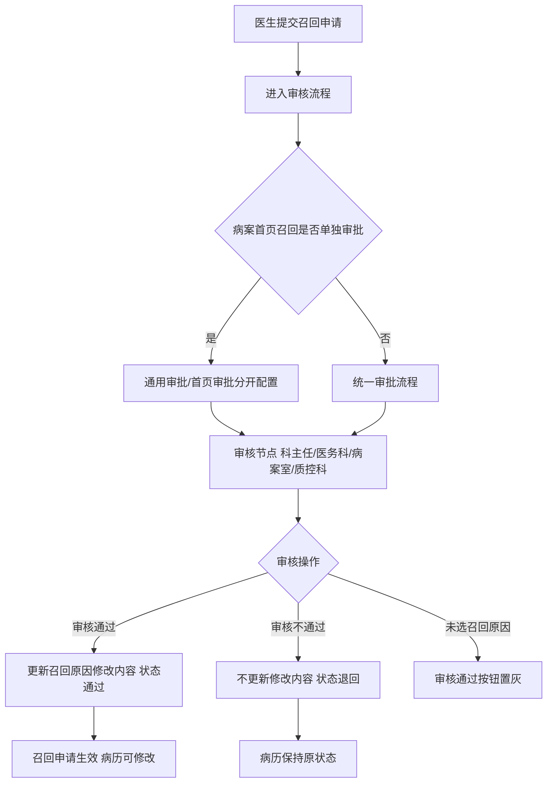
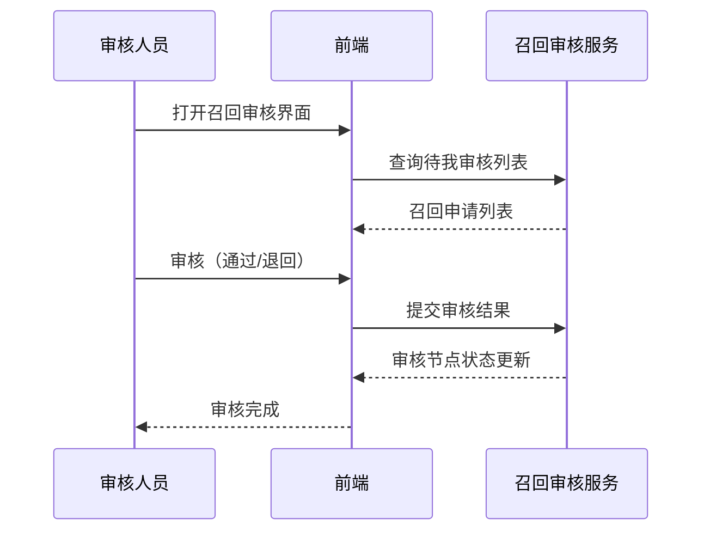

# BLGL-09-GDJY-005 病历召回审核 - Spec

> **功能编号**：BLGL-09-GDJY-005
> **文档类型**：功能Spec（业务背景与设计）
> **文档版本**：V1.0
> **编写时间**：2026-08-15
> **编写人**：RACC

---

## 文档索引

#### 章节索引

**Spec（研发视角）**

| 章节号 | 章节名称 | 内容说明 |
|--------|---------|---------|
| 1、 | 文档概述 | 文档目的、文档范围、术语定义、阅读指南、参考文档 |
| 2、 | 功能背景与定位 | 功能背景、功能定位、目标用户、核心价值 |
| 3、 | 业务流程设计 | 主流程/异常流程/边界流程（Given/When/Then） |
| 4、 | 数据模型设计 | 核心数据结构、状态定义、系统参数定义 |
| 5、 | 接口契约设计 | API列表、接口详细设计、错误码定义 |
| 6、 | 技术方案设计 | 页面路径、技术栈、关键技术点、部署方案 |
| 7、 | 测试用例预设计 | 功能/边界/异常/性能测试用例 |
| 8、 | 非功能性要求 | 性能、安全、可用性、兼容性 |
| 9、 | 依赖与风险 | 外部依赖、风险项 |
| 10、 | 附录 | 流程图、时序图、参考文档 |

**PM-Spec（业务视角）**

| 章节号 | 章节名称 | 内容说明 |
|--------|---------|---------|
| 一 | 目标 | 功能定位与核心价值 |
| 二 | 约束 | 业务/技术/非功能性约束 |
| 三 | 验收标准 | 验收条件与验证方法 |
| 四 | 排除范围 | 本次不做项与明确边界 |
| 五 | 关键决策记录 | 方案决策与选型理由 |
| 六 | 优先级 | 优先级定义 |
| 七 | 关联文档 | 关联文档索引 |
| 附录 | 填写检查清单 | 质量检查 |

**Analyst-Spec（产品视角）**

| 章节号 | 章节名称 | 内容说明 |
|--------|---------|---------|
| 一 | 功能编号体系 | 功能编号与层级结构 |
| 二 | 核心业务流程 | 核心业务流程与时序 |
| 三 | 功能规格说明 | 详细功能规格与验收标准 |
| 四 | 排除范围 | 排除范围 |
| 五 | 业务规则清单 | 业务规则清单 |
| 六 | 关联文档 | 关联文档索引 |
| 七 | 待确认问题清单 | 待确认问题汇总 |
| - | 填写检查清单 | 质量检查 |

#### 版本历史

| 版本 | 日期 | 变更说明 | 编写人 |
|------|------|---------|--------|
| V1.0 | 2026-08-15 | 初始版本 | RACC |

#### 关联文档索引

| 序号 | 文档名称 | 文档类型 | 版本 | 位置 |
|------|---------|---------|------|------|
| 1 | BLGL-09-GDJY 归档借阅功能点Spec.md | 功能点Spec（模块级） | V1.0 | 上级目录 |
| 2 | BLGL-09-GDJY-005_病历召回审核-Spec.md | 功能Spec（业务背景与设计）（本文档） | V1.0 | 本目录 |
| 3 | BLGL-09-GDJY-005_病历召回审核_Analyst-spec.md | Analyst-Spec（分析规格） | V1.0 | 本目录 |
| 4 | BLGL-09-GDJY-005_病历召回审核_PM-spec.md | PM-Spec（需求规格） | V0.1 | 本目录 |

---

## 1、文档概述

### 1.1、文档目的

本文档旨在明确"病历召回审核"功能（BLGL-09-GDJY-005）的业务背景与设计方案，为需求分析、研发实现、测试验收及评审提供统一的业务上下文、设计口径与决策依据。

**具体目的包括**：

1. 梳理病历召回审核功能的业务由来与历史需求演进脉络，说明"为什么要做"；
2. 明确功能的定位边界、目标用户与核心价值，回答"做成什么"；
3. 描述功能的业务流程、数据模型、接口契约与技术方案，回答"怎么做"；
4. 预设计测试用例并明确非功能性要求、依赖与风险，为研发与验收提供依据；
5. 作为 Analyst-Spec 的业务前提与设计输入，保证各层文档业务口径一致。

### 1.2、文档范围

#### 1.2.1 纳入范围

本文档覆盖病历召回审核的完整业务背景与设计，包括：

- 召回审核流程配置：多级审批流程（通用审批/首页审批）、质控科审核、快速召回模式
- 审核修改召回原因：允许修改召回申请的审核节点
- 审核意见显示：审核意见内容展示
- 召回审核查询：待我审核/我参与的，关键词/病案号/出院日期查询
- 批量审核：病历召回批量审核
- 召回审核报表：召回状态报表、审核字段设置

#### 1.2.2 排除范围

本文档不涉及以下内容（详见其他功能点或模块）：

- 病历自动归档/手动归档 —— BLGL-09-GDJY-001/-002
- 病历撤销归档 —— BLGL-09-GDJY-003
- 病历召回申请（召回原因选择/便捷操作）—— BLGL-09-GDJY-004
- 病历借阅流程 —— BLGL-09-GDJY-006
- 三方病案系统对接 —— BLGL-09-GDJY-007

### 1.3、术语定义

| 术语 | 定义 |
|------|------|
| 召回审核 | 病案室/科主任/医务科对召回申请进行多级审批 |
| RE005 | 开启快速召回模式设置参数 |
| 通用审批/首页审批 | 病案首页召回是否单独审批参数开启后，召回审批分为通用和首页两类流程 |
| 审核节点 | 业务科室主任/医务科主任/病案系统管理员等审核环节 |

### 1.4、阅读指南

- **章节关系**：第1~2章为业务全貌，第3~10章为设计实现层。与 Analyst-Spec、PM-Spec 互相引用保持一致。
- **读者对象**：产品经理/需求分析师读第1~2章；研发读第3~6、9~10章；测试读第3、7~8章；评审人员核对各层一致性。

### 1.5、参考文档

| 序号 | 文档名称 | 版本/日期 |
|------|---------|----------|
| 1 | 【历史需求】住院病历的历史需求.xlsx | - |
| 2 | BLGL-09-GDJY-005_病历召回审核_PM-spec.md | V0.1 |
| 3 | BLGL-09-GDJY-005_病历召回审核_Analyst-spec.md | V1.0 |
| 4 | BLGL-09-GDJY 归档借阅功能点Spec.md | V1.0 |

---

## 2、功能背景与定位

### 2.1 功能背景

病历召回审核是归档借阅模块的审批管控层，需满足：

- **现状痛点**：召回审核界面审核意见只显示"审核通过/退回"，未显示审核意见内容；召回审核界面申请时间筛选默认展示昨天数据但可配置；召回批量审核跳过第三级审核
- **管理要求**：病案首页召回需与普通病历分开设置审批流程；病历召回审核流程新增质控科审核
- **历史需求演进**：审核节点可修改召回原因→ 首页/普通病历分开审批→ 审核意见内容展示（6）→ 质控科审核

### 2.2 功能定位

"病历召回审核"是 WiNEX 病历管理-归档借阅的审批管控层，定位为：

- **多级审批**：召回申请多级审批（业务科室主任/医务科主任/病案室管理员/质控科）
- **流程配置**：通用审批/首页审批分开配置
- **审核可溯**：审核意见内容展示、审核节点状态

### 2.3 目标用户

| 用户角色 | 主要使用场景 |
|---------|-------------|
| 业务科室主任 | 审核召回申请（3-7/7+工作日） |
| 医务科主任 | 审核召回申请（7 工作日外/配置） |
| 病案室管理员 | 审核召回申请、修改召回原因 |
| 质控科 | 作为最后一个审核人 |

### 2.4 核心价值

| 价值维度 | 价值描述 |
|---------|---------|
| 审批合规 | 召回申请多级审批，首页/普通病历分开 |
| 审核透明 | 审核意见内容展示，状态可溯 |
| 权限可控 | 审核节点可修改召回原因 |

---

## 3、业务流程设计（Given/When/Then）

### 3.1 主流程

**Scenario 1: 病历召回审核**

```gherkin
Given:
  - 医生已提交召回申请
  - 审核人员（科主任/医务科/病案室）有审核权限

When:
  - 审核人员打开召回审核界面（待我审核）
  - 查看召回原因并审核

Then:
  - 审核通过则召回申请生效，病历可修改
  - 审核不通过则退回，病历保持原状态
```

### 3.2 异常流程

**Scenario 2: 业务异常——审核修改召回原因**

```gherkin
Given:
  - 参数"允许修改召回申请的审核节点"配置了当前节点
  - 审核人员有审核权限

When:
  - 打开召回审核详情页面

Then:
  - 可以对申请单中已选的召回原因进行修改
  - 点击审核不通过：不更新召回原因修改内容，审核节点状态更新为退回
  - 点击审核通过：更新召回原因修改内容，审核节点状态更新为通过
  - 未选中任何召回原因时审核通过按钮置灰
```

**Scenario 3: 数据异常——审核菜单找不到患者**

```gherkin
Given:
  - 医生提交召回申请

When:
  - 审核人员打开审核菜单

Then:
  - 找不到患者（问题）
  - 需排查召回申请与审核数据关联
```

**Scenario 4: 系统异常——批量审核跳过第三级审核**

```gherkin
Given:
  - 病历召回批量审核

When:
  - 执行批量审核

Then:
  - 跳过第三级审核（问题）
  - 需修复批量审核流程
```

### 3.3 边界流程

**Scenario 5: 边界——首页/普通病历分开审批**

```gherkin
Given:
  - 参数"病案首页召回是否单独审批"=是

When:
  - 配置召回审批流程

Then:
  - 召回审批维护分为【通用审批】和【首页审批】
  - 可以分别配置流程
  - 日常管理-归档查询和手动归档页面，普通病历和病案首页的召回分开
```

**Scenario 6: 边界——召回审核字段设置**

```gherkin
Given:
  - 病历召回状态报表/召回审核界面

When:
  - 点击操作栏"设置"按钮

Then:
  - 设置列表要显示哪些字段
  - 导出的 Excel 列表字段跟界面显示一致
  - 默认全选
```

---

## 4、数据模型设计

### 4.1 核心数据结构

#### 4.1.1 核心保存请求

| 字段名 | 类型 | 必填 | 备注 |
|--------|------|------|------|
| 召回申请 ID | Long | 是 | 召回申请标识 |
| 审核意见 | String | 否 | 审核人员意见 |
| 审核节点状态 | String | 否 | 通过/退回 |

> ⏳ 待确认：召回审核接口完整入参/出参以代码扫描和 API 契约为准。

#### 4.1.2 核心表/实体

| 表/实体 | 关键字段 | 说明 |
|---------|---------|------|
| INP_EMR_ARCHIVE_RECALL_REVIEW（InpEmrArchiveRecallReviewPO） | filingAuditId、filingProcessId(INP_EMR_ARCH_RECALL_PROC_ID)、inpEmrARPHistoryId(INP_EMR_ARP_HISTORY_ID)、filingRecallId、filingAuditAt(REVIEWED_AT)、filingAuditOption(ARCH_RECALL_REVIEW_COMMENT)、filingAuditResult(ARCH_RECALL_REVIEW_RESULT_CODE)、employeeRoleId(EMPLOYEE_TYPE_CODE)、seqNo | 召回审批表（审核意见/结果/节点，代码） |
| INP_EMR_ARCH_RECALL_PROCESS（InpEmrArchRecallProcessPO，定义态） | filingProcessId、filingProcessName、filingProcessDesc、expertiseTypeConceptId | 召回流程节点配置 |
| INP_EMR_ARCH_RECALL_ROLE（InpEmrArchRecallRolePO，定义态） | inpatEmrSetFilingProcRoleId、filingProcessId、inpatEmrSetFilingProcRoleCode | 召回流程角色配置 |
| INP_EMR_ARP_HISTORY（定义态） | versionNo | 召回流程版本快照 |

### 4.2 状态定义

| 状态码 | 状态名称 | 说明 |
|--------|---------|------|
| - | 待审核 | 召回申请待审核 |
| - | 审核通过 | 召回申请审核通过 |
| - | 退回 | 召回申请审核不通过 |

### 4.3 系统参数定义

| 参数编码 | 参数名称 | 说明 |
|---------|---------|------|
| RE005 | 开启快速召回模式设置 | 下拉值增加"首页召回" |
| - | 病案首页召回是否单独审批 | 是/否，默认否 |
| - | 允许修改召回申请的审核节点 | 默认无，多选：业务科室主任/医务科主任/病案系统管理员 |

---

## 5、接口契约设计

### 5.1 API列表

| 序号 | API名称（代码函数） | 路径 | 方法 | 说明 |
|:----:|---------|------|:----:|------|
| 1 | 多级审核归档召回申请 | /api/v1/app_record_inpatient/emr_inpatient/emr_filing_audit/review | POST | 召回审核（入参 InpatEmrSetFilingAuditReviewInputAO，出参 InpatientEmrCommonOutputVO） |
| 2 | 保存召回审核记录 | /api/v1/app_record_inpatient/emr_inpatient/archive_recall_review/save | POST | 保存召回审核记录（入参 InpatEmrSetFilingAuditSaveInputAO） |
| 3 | 查询病历召回列表 | /api/v1/app_record_inpatient/emr_inpatient/emr_set_filing_recall_step/query | POST | 召回审核列表（待我审核/我参与的，入参 InpatEmrFilingRecallStepQueryInputAO） |
| 4 | 校验当前审核节点是否具有修改召回原因权限 | /api/v1/app_record_inpatient/emr_inpatient/recall_review_modify_item_permission/check | POST | 审核节点修改召回原因权限校验 |
| 5 | 批量完成归档召回审核 | /api/v1/app_record_inpatient/emr_inpatient/archive_recall_last_review/batch_complete | POST | 批量召回审核（入参 InpEmrRecallLastBatchCompleteInputAO） |
| 6 | 导出病历召回状态报表 | /api/v1/app_record_inpatient/emr_inpatient/recall_status_report/export | POST | 召回状态报表导出 |
| 7 | 导出病案召回审核 | /api/v1/app_record_inpatient/emr_inpatient/recall_medical_archive_review/export | POST | 召回审核导出（入参 InpatEmrFilingRecallStepQueryInputAO） |

### 5.2 接口详细设计

#### 5.2.1 多级审核归档召回申请（emr_filing_audit/review）

**请求参数**:
```json
{
  "filingRecallId": "12345",
  "filingAuditResult": "1",
  "filingAuditOption": "同意召回修改",
  "filingRecallReasonList": ["病历修改", "质控整改"],
  "employeeRoleId": "科主任",
  "seqNo": 1
}
```

**返回值（成功）**:
```json
{
  "success": true,
  "data": null
}
```

> ⏳ 待确认：召回审核接口字段以代码扫描（InpatEmrSetFilingAuditReviewInputAO）和 API 契约为准。

**返回值（失败）**:
```json
{
  "success": false,
  "message": "未选中任何召回原因时审核通过按钮置灰",
  "data": null
}
```

### 5.3 错误码定义

| 错误码 | 错误信息 | 处理方式 |
|--------|---------|---------|
| ⏳ 待确认 | 未选中任何召回原因时审核通过按钮置灰 | 阻止审核通过 |

---

## 6、技术方案设计

### 6.1 页面路径

- **页面路径**: 住院医生站→日常管理→病历归档→召回审核（待我审核/我参与的，src/router/EmrArchiving.js recallApplyArchive）；病历质控系统→病历管理→病历召回状态报表
- **前端逻辑**: 召回审核查询（关键词/申请日期/出区时间）、字段设置
- **后端模块**: winning-emr-ipt-archive/winning-emr-ipt-archive-provider/controller/InpEmrRecallController.java（多级审核归档召回申请、保存召回审核记录、查询病历召回列表）
- **前端 API**: winning-webui-inpatient-clinicalnote-pango/src/pages/ClinicalnoteArchiveManage/api/index.js（apiInpatFilingAudit → emr_filing_audit/review、queryFilingRecallStep → emr_set_filing_recall_step/query、checkRecallReviewModifyItemPermission → recall_review_modify_item_permission/check、completeFilingRecallStep → archive_recall_last_review/batch_complete）

### 6.2 技术栈

| 类别 | 技术 | 版本 |
|------|------|------|
| 前端框架 | Vue | 2.6.14 |
| 前端UI | element-ui | 2.13.0 |
| 后端框架 | Spring Boot（Java 17）+ JPA/Hibernate | - |
| RPC | winning-akso-rpc-rest | - |

### 6.3 关键技术点

- 召回审批维护分为通用审批和首页审批，可分别配置流程
- 审核节点修改召回原因：审核通过更新修改内容，不通过不更新
- 召回审核列表展示审核意见内容

### 6.4 部署方案

⏳ 待确认：部署方案未在资料区中找到。

---

## 7、测试用例预设计

### 7.1 功能测试

| 用例编号 | 测试场景 | Given | When | Then |
|---------|---------|-------|------|------|
| TC-001 | 召回审核通过 | 医生提交召回申请，审核人有权限 | 审核通过（emr_filing_audit/review） | 召回申请生效，病历可修改 |
| TC-002 | 召回审核列表 | 召回审核界面 | 调用 emr_set_filing_recall_step/query | 返回待我审核/我参与列表 |

### 7.2 边界测试

| 用例编号 | 测试场景 | Given | When | Then |
|---------|---------|-------|------|------|
| TC-003 | 首页/普通病历分开审批 | 参数=是 | 配置审批流程 | 通用/首页分开配置 |
| TC-004 | 批量召回审核 | 待审核列表 | 调用 archive_recall_last_review/batch_complete | 批量审核完成 |

### 7.3 异常测试

| 用例编号 | 测试场景 | Given | When | Then |
|---------|---------|-------|------|------|
| TC-005 | 审核修改召回原因 | 节点可修改，未选原因 | 点击审核通过 | 审核通过按钮置灰 |
| TC-006 | 审核节点权限校验 | 审核节点配置 | 调用 recall_review_modify_item_permission/check | 返回是否有修改召回原因权限 |

### 7.4 性能测试

| 用例编号 | 测试场景 | 指标 |
|---------|---------|------|
| TC-007 | 召回审核列表查询 | ⏳ 待确认：性能指标未在资料区中找到 |
| TC-008 | 召回审核接口响应 | ⏳ 待确认：性能指标未在资料区中找到 |

---

## 8、非功能性要求

### 8.1 性能要求

| 指标 | 要求 |
|------|------|
| 召回审核列表查询时间 | ⏳ 待确认 |

### 8.2 安全要求

| 要求 | 说明 |
|------|------|
| 审核权限 | 业务科室主任/医务科主任/病案室管理员/质控科分级审核 |

**医疗行业特殊要求**

| 要求 | 说明 |
|------|------|
| 审核可溯 | 审核意见内容展示，审核节点状态可溯 |

### 8.3 可用性要求

| 指标 | 要求值 |
|------|--------|
| 可用性 | ⏳ 待确认 |

### 8.4 兼容性要求

| 类型 | 要求 |
|------|------|
| 审批流程 | 通用审批/首页审批兼容 |
| 审核角色 | 支持质控科质控员角色 |

---

## 9、依赖与风险

### 9.1 外部依赖

| 依赖项 | 说明 |
|--------|------|
| 病案系统 | 三方召回审批 |

### 9.2 风险项

| 风险项 | 等级 | 说明 | 应对方案 |
|--------|------|------|---------|
| 批量审核流程 | 中 | 批量审核跳过第三级审核 | 修复批量审核流程 |
| 审核数据缺失 | 中 | 审核菜单找不到患者 | 排查数据关联 |

---

## 10、附录

### 10.1 流程图



### 10.2 时序图



### 10.3 参考文档

- BLGL-09-GDJY 归档借阅功能点Spec.md（V1.0，第5章 BLGL-09-GDJY-005 行）
- 关联Spec: BLGL-09-GDJY-005_病历召回审核_PM-spec.md、BLGL-09-GDJY-005_病历召回审核_Analyst-spec.md

---

## 填写检查清单

| 序号 | 检查项 | 是否完成 |
|:----:|--------|:--------:|
| 1 | 章节索引与正文章节一致 | ✅ |
| 2 | 版本历史记录完整 | ✅ |
| 3 | 关联文档索引已登记全部Spec | ✅ |
| 4 | 文档目的明确回答"为什么做/做成什么/怎么做" | ✅ |
| 5 | 纳入范围/排除范围清晰 | ✅ |
| 6 | 术语定义覆盖关键概念，从资料区可溯源 | ✅ |
| 7 | 参考文档已登记 | ✅ |
| 8 | 功能背景基于法规/规范/需求来源组织 | ✅ |
| 9 | 功能定位体现业务价值（3~5个定位点） | ✅ |
| 10 | 目标用户角色覆盖完整，在需求原文中有出处 | ✅ |
| 11 | 核心价值可陈述，与 Phase 1 口径一致 | ✅ |
| 12 | 业务流程：主流程≥1、异常≥3、边界≥2，Given/When/Then 具体 | ✅ |
| 13 | 数据模型：字段/表/状态/参数可溯源 | ✅ |
| 14 | 接口契约：API列表+详细设计+错误码齐全或标记待确认 | ✅ |
| 15 | 技术方案：页面路径/技术栈/关键点/部署方案或标记待确认 | ✅ |
| 16 | 测试用例：功能/边界/异常/性能覆盖 | ✅ |
| 17 | 非功能性要求：性能/安全/可用性/兼容性指标可量化或标记待确认 | ✅ |
| 18 | 依赖与风险：外部依赖登记完整 | ✅ |
| 19 | 附录：流程图/时序图与正文流程一致 | ✅ |
| 20 | 全文无占位符 `< >` 残留 | ✅ |
| 21 | 全文陈述可溯源至资料区 | ✅ |
| 22 | 人工审核确认完成 | ⏳ 待确认 |

---

**文档状态**：⬜ 待审核
**维护责任**：RACC
**下次更新**：根据评审反馈优化
