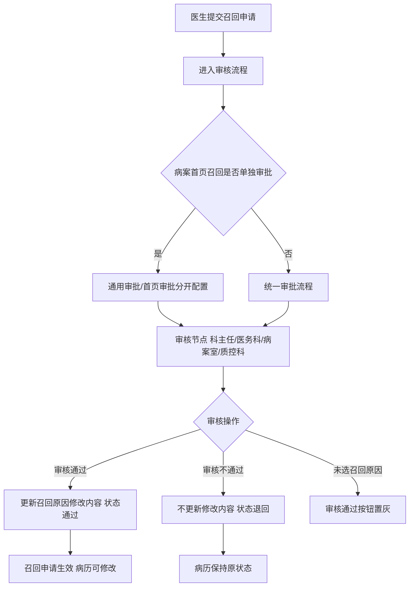
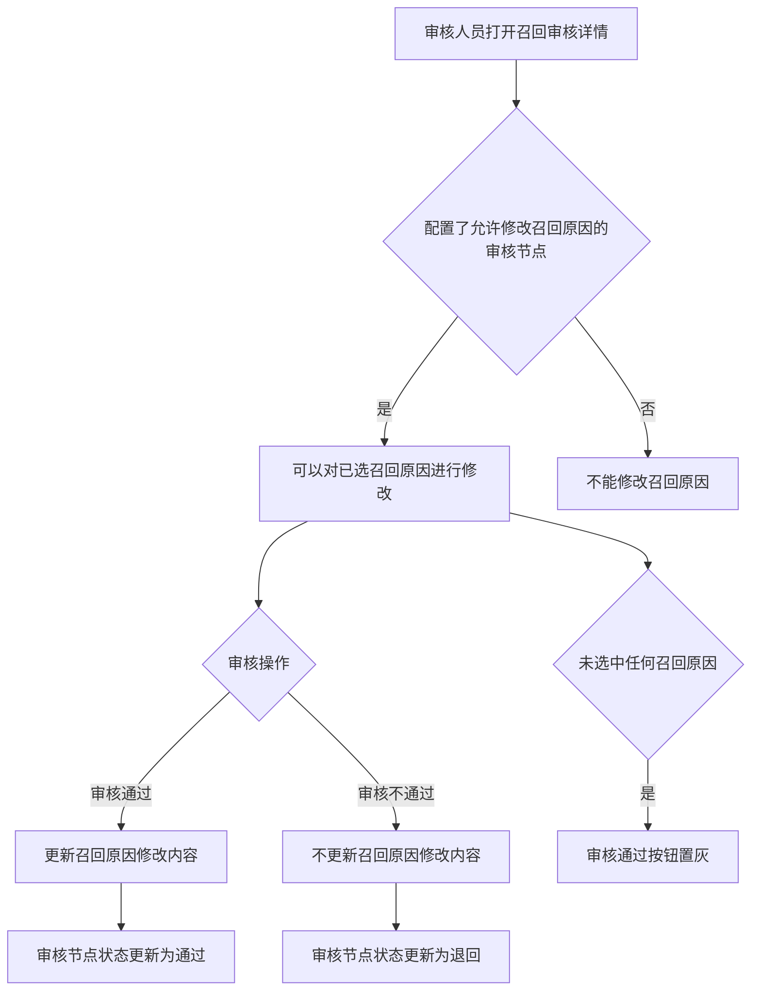

# BLGL-09-GDJY-005 病历召回审核 _ Analyst - Spec

> **需求编号**：BLGL-09-GDJY-005
> **父需求**：BLGL-09-GDJY
> **关联PM Spec**：BLGL-09-GDJY-005_病历召回审核_PM-spec.md
> **Spec版本**：V1.0
> **编写时间**：2026-08-15
> **编写人**：需求分析师

---

## 一、功能编号体系

### 1.1 功能层级结构

```
BLGL-09-GDJY-005-001: 召回审批流程配置
  ├─ BLGL-09-GDJY-005-001-01: 通用审批/首页审批分开配置
  ├─ BLGL-09-GDJY-005-001-02: 质控科审核（最后审核人）
  └─ BLGL-09-GDJY-005-001-03: RE005 快速召回模式

BLGL-09-GDJY-005-002: 审核修改召回原因
  └─ BLGL-09-GDJY-005-002-01: 允许修改召回原因的审核节点

BLGL-09-GDJY-005-003: 审核意见展示
  ├─ BLGL-09-GDJY-005-003-01: 审核意见内容展示
  └─ BLGL-09-GDJY-005-003-02: 审核节点状态

BLGL-09-GDJY-005-004: 召回审核查询
  ├─ BLGL-09-GDJY-005-004-01: 关键词/病案号/出院日期查询
  └─ BLGL-09-GDJY-005-004-02: 最后审核人/时间字段

BLGL-09-GDJY-005-005: 批量审核
  └─ BLGL-09-GDJY-005-005-01: 病历召回批量审核

BLGL-09-GDJY-005-006: 召回审核报表
  └─ BLGL-09-GDJY-005-006-01: 字段设置与导出
```

### 1.2 功能编号表

| REQ-ID | 功能名称 | 类型 | 优先级 | 说明 |
|--------|---------|------|--------|------|
| BLGL-09-GDJY-005-001 | 召回审批流程配置 | 功能 | P0 | 多级审批流程 |
| BLGL-09-GDJY-005-001-01 | 通用/首页审批分开配置 | 子功能 | P0 | 病案首页召回单独审批 |
| BLGL-09-GDJY-005-001-02 | 质控科审核 | 子功能 | P1 | 质控科为最后审核人 |
| BLGL-09-GDJY-005-001-03 | RE005 快速召回模式 | 子功能 | P1 | 下拉值增加首页召回 |
| BLGL-09-GDJY-005-002 | 审核修改召回原因 | 功能 | P0 | 审核节点修改召回原因 |
| BLGL-09-GDJY-005-002-01 | 允许修改召回原因的审核节点 | 子功能 | P0 | 审核通过更新、不通过不更新 |
| BLGL-09-GDJY-005-003 | 审核意见展示 | 功能 | P1 | 审核意见内容展示 |
| BLGL-09-GDJY-005-003-01 | 审核意见内容展示 | 子功能 | P1 | 不只显示"审核通过/退回" |
| BLGL-09-GDJY-005-003-02 | 审核节点状态 | 子功能 | P1 | 通过/退回状态 |
| BLGL-09-GDJY-005-004 | 召回审核查询 | 功能 | P1 | 审核查询 |
| BLGL-09-GDJY-005-004-01 | 关键词/病案号/出院日期查询 | 子功能 | P1 | 支持住院号/姓名/病案号检索 |
| BLGL-09-GDJY-005-004-02 | 最后审核人/时间字段 | 子功能 | P1 | 列表新增字段 |
| BLGL-09-GDJY-005-005 | 批量审核 | 功能 | P1 | 批量审核 |
| BLGL-09-GDJY-005-005-01 | 病历召回批量审核 | 子功能 | P1 | 不跳过第三级审核 |
| BLGL-09-GDJY-005-006 | 召回审核报表 | 功能 | P2 | 状态报表/字段设置 |
| BLGL-09-GDJY-005-006-01 | 字段设置与导出 | 子功能 | P2 | 设置按钮/Excel 导出一致 |

---

## 二、核心业务流程

### 2.1 召回审核主流程



### 2.2 审核修改召回原因流程



---

## 三、功能规格说明

### BLGL-09-GDJY-005-001: 召回审批流程配置

#### 3.1.1 功能概述

病历召回申请审批流程修改，首页和普通病历分开设置审批流程。参数"病案首页召回是否单独审批"为是时，召回审批维护分为【通用审批】和【首页审批】，可以分别配置流程。RE005 开启快速召回模式设置的下拉值增加"首页召回"。病历召回审核流程新增质控科审核，质控科审核是最后一个审核人。

#### 3.1.2 用户角色

| 角色 | 使用场景 | 权限要求 | 操作频率 |
|------|---------|---------|---------|
| 病案管理员 | 配置召回审批流程 | 配置权限 | 低频 |
| 质控科 | 召回审核（最后审核人） | 质控权限 | 中频 |

#### 3.1.3 业务流程（Given/When/Then）

**Scenario 1: 通用/首页审批分开（主流程）**

```gherkin
Given:
  - 参数"病案首页召回是否单独审批"=是

When:
  - 配置召回审批维护

Then:
  - 召回审批维护分为【通用审批】和【首页审批】
  - 可以分别配置流程
  - 日常管理-归档查询和手动归档页面，普通病历和病案首页的召回分开
```

**Scenario 2: 质控科审核**

```gherkin
Given:
  - 病历召回审核流程配置质控科审核

When:
  - 召回申请进入审核流程

Then:
  - 质控科审核是最后一个审核人
```

**Scenario 3: 边界——RE005 快速召回模式**

```gherkin
Given:
  - 召回参数配置 RE005 开启快速召回模式设置

When:
  - 配置下拉值

Then:
  - 下拉值增加"首页召回"
```

#### 3.1.4 数据字段定义

| 字段名 | 类型 | 必填 | 默认值 | 取值范围 | 说明 | 概念ID |
|--------|------|------|--------|---------|------|--------|
| 病案首页召回是否单独审批 | Boolean | 否 | 否 | 是/否 | 首页/普通病历分开审批 | ⏳ 待确认 |
| filingAuditId | Long | 是 | - | - | 召回审批表主键 | ⏳ 待确认 |
| filingProcessId | Long | 是 | - | - | 召回流程节点 ID（INP_EMR_ARCH_RECALL_PROC_ID，代码） | ⏳ 待确认 |
| filingRecallId | Long | 是 | - | - | 关联召回申请 ID | ⏳ 待确认 |
| filingAuditAt | Date | 否 | - | - | 审核时间（REVIEWED_AT，代码） | ⏳ 待确认 |
| filingAuditOption | String | 否 | - | 审核意见文本 | 审核意见（ARCH_RECALL_REVIEW_COMMENT，代码） | ⏳ 待确认 |
| filingAuditResult | Long | 是 | - | 通过/退回 | 审核结果（ARCH_RECALL_REVIEW_RESULT_CODE，代码） | ⏳ 待确认 |
| employeeRoleId | String | 否 | - | 审核角色 | 审核人角色（EMPLOYEE_TYPE_CODE，代码） | ⏳ 待确认 |
| seqNo | Integer | 否 | - | - | 审核节点序号 | ⏳ 待确认 |

#### 3.1.5 验收标准

| AC编号 | 验收标准 | 对应REQ-ID | 验证方法 | 验证场景 |
|--------|---------|-----------|---------|---------|
| AC-001 | 病案首页召回单独审批参数生效，通用/首页分开配置 | BLGL-09-GDJY-005-001 | 功能测试 | Scenario 1 |
| AC-002 | 质控科审核为最后一个审核人 | BLGL-09-GDJY-005-001 | 功能测试 | Scenario 2 |

---

### BLGL-09-GDJY-005-002: 审核修改召回原因

#### 3.2.1 功能概述

召回参数配置增加参数"允许修改召回申请的审核节点"，配置了允许修改召回审签的审核节点，操作人可以修改申请单的召回原因。点击审核不通过，不更新召回原因的修改内容，将审核节点状态更新为退回；点击审核通过，更新召回原因的修改内容，将审核节点状态更新为通过。未选中任何召回原因时审核通过按钮置灰。最后医生可以操作的病历权限以最终审核通过的病历和病历目录为准。

#### 3.2.2 用户角色

| 角色 | 使用场景 | 权限要求 | 操作频率 |
|------|---------|---------|---------|
| 病案室管理员 | 审核修改召回原因 | 病案室权限 | 中频 |

#### 3.2.3 业务流程（Given/When/Then）

**Scenario 1: 审核修改召回原因（主流程）**

```gherkin
Given:
  - 参数"允许修改召回申请的审核节点"配置了当前节点
  - 审核人员有审核权限

When:
  - 打开召回审核详情页面

Then:
  - 可以对申请单中已选的召回原因进行修改
  - 点击审核通过：更新召回原因修改内容，状态更新为通过
  - 点击审核不通过：不更新修改内容，状态更新为退回
  - 未选中任何召回原因时审核通过按钮置灰
```

**Scenario 2: 边界——审核通过按钮置灰**

```gherkin
Given:
  - 审核人员打开召回审核详情
  - 未选中任何召回原因

When:
  - 点击审核通过

Then:
  - 审核通过按钮置灰
```

#### 3.2.4 数据字段定义

| 字段名 | 类型 | 必填 | 默认值 | 取值范围 | 说明 | 概念ID |
|--------|------|------|--------|---------|------|--------|
| 允许修改召回申请的审核节点 | String | 否 | 无 | 业务科室主任/医务科主任/病案系统管理员（多选） | 审核节点参数 | ⏳ 待确认 |

#### 3.2.5 验收标准

| AC编号 | 验收标准 | 对应REQ-ID | 验证方法 | 验证场景 |
|--------|---------|-----------|---------|---------|
| AC-003 | 配置审核节点可修改召回原因，审核通过更新、不通过不更新，未选原因置灰 | BLGL-09-GDJY-005-002 | 功能测试 | Scenario 1/2 |

---

### BLGL-09-GDJY-005-003: 审核意见展示

#### 3.3.1 功能概述

病历归档后医生申请召回，审核老师在召回审核界面书写了审核意见，目前系统只显示"审核通过/退回"，希望把审核意见的内容也显示出来。日常管理-病历归档-召回查询-当前流程步骤：审核节点中，展示审核人员的审核意见。

#### 3.3.2 用户角色

| 角色 | 使用场景 | 权限要求 | 操作频率 |
|------|---------|---------|---------|
| 住院医生 | 查看召回审核意见 | 病历书写权限 | 中频 |
| 审核人员 | 书写审核意见 | 审核权限 | 中频 |

#### 3.3.3 业务流程（Given/When/Then）

**Scenario 1: 审核意见展示（主流程）**

```gherkin
Given:
  - 审核人员在召回审核界面书写了审核意见

When:
  - 医生查看召回查询-当前流程步骤

Then:
  - 审核节点中展示审核人员的审核意见内容
  - 不只显示"审核通过/退回"
```

#### 3.3.4 数据字段定义

| 字段名 | 类型 | 必填 | 默认值 | 取值范围 | 说明 | 概念ID |
|--------|------|------|--------|---------|------|--------|
| 审核意见 | String | 否 | - | - | 审核人员意见 | ⏳ 待确认 |

#### 3.3.5 验收标准

| AC编号 | 验收标准 | 对应REQ-ID | 验证方法 | 验证场景 |
|--------|---------|-----------|---------|---------|
| AC-004 | 召回查询展示审核意见内容 | BLGL-09-GDJY-005-003 | 功能测试 | Scenario 1 |

---

### BLGL-09-GDJY-005-004: 召回审核查询

#### 3.4.1 功能概述

召回审核功能里需要加按病案号搜索的功能（医生站），召回查询功能里需要加按出院日期查询的功能，列表里加召回时间和审核人字段。医生站召回审核：待我审核、我参与的新增查询关键词（支持住院号、姓名、病案号检索）、申请日期、出区时间；数据表格新增字段：出区时间、病案号。召回查询新增查询条件：出区时间；表格新增字段：最后审核人、最后审核时间。召回审核增加出院日期，申请日期支持排序。

#### 3.4.2 用户角色

| 角色 | 使用场景 | 权限要求 | 操作频率 |
|------|---------|---------|---------|
| 审核人员 | 查询待我审核/我参与审核 | 审核权限 | 中频 |

#### 3.4.3 业务流程（Given/When/Then）

**Scenario 1: 召回审核查询（主流程）**

```gherkin
Given:
  - 审核人员打开召回审核界面（待我审核/我参与的）

When:
  - 输入关键词（住院号/姓名/病案号）
  - 选择申请日期/出区时间

Then:
  - 查询结果按条件筛选
  - 数据表格展示出区时间、病案号字段
  - 召回查询列表展示最后审核人、最后审核时间
```

**Scenario 2: 申请日期排序**

```gherkin
Given:
  - 召回审核查询结果列表

When:
  - 点击申请日期列排序箭头

Then:
  - 支持正序或倒序排序
```

#### 3.4.4 数据字段定义

| 字段名 | 类型 | 必填 | 默认值 | 取值范围 | 说明 | 概念ID |
|--------|------|------|--------|---------|------|--------|
| 关键词 | String | 否 | - | 住院号/姓名/病案号 | 召回审核查询 | ⏳ 待确认 |
| 申请日期 | Date | 否 | - | - | 召回审核查询 | ⏳ 待确认 |
| 出区时间 | Date | 否 | - | - | 召回审核查询/字段 | ⏳ 待确认 |
| 病案号 | String | 否 | - | - | 召回审核字段 | ⏳ 待确认 |
| 最后审核人 | String | 否 | - | - | 召回查询字段 | ⏳ 待确认 |
| 最后审核时间 | Date | 否 | - | - | 召回查询字段 | ⏳ 待确认 |

#### 3.4.5 验收标准

| AC编号 | 验收标准 | 对应REQ-ID | 验证方法 | 验证场景 |
|--------|---------|-----------|---------|---------|
| AC-005 | 召回审核查询支持关键词/病案号/出院日期，列表展示最后审核人/时间 | BLGL-09-GDJY-005-004 | 功能测试 | Scenario 1 |
| AC-006 | 申请日期支持排序 | BLGL-09-GDJY-005-004 | 功能测试 | Scenario 2 |

---

### BLGL-09-GDJY-005-005: 批量审核

#### 3.5.1 功能概述

病历召回批量审核跳过第三级审核（问题需修复）。病历召回批量审核功能支持对多份召回申请批量审核。

#### 3.5.2 用户角色

| 角色 | 使用场景 | 权限要求 | 操作频率 |
|------|---------|---------|---------|
| 审核人员 | 批量审核召回申请 | 审核权限 | 中频 |

#### 3.5.3 业务流程（Given/When/Then）

**Scenario 1: 批量审核（主流程）**

```gherkin
Given:
  - 审核人员有待审核的召回申请

When:
  - 勾选多份申请并批量审核

Then:
  - 批量审核成功
  - 不跳过第三级审核
```

**Scenario 2: 异常——跳过第三级审核**

```gherkin
Given:
  - 病历召回批量审核

When:
  - 执行批量审核

Then:
  - 当前版本跳过第三级审核（问题）
  - 需修复批量审核流程
```

#### 3.5.4 数据字段定义

| ⏳ 待确认 | 批量审核无独立业务字段 | 依赖召回审核状态 |

#### 3.5.5 验收标准

| AC编号 | 验收标准 | 对应REQ-ID | 验证方法 | 验证场景 |
|--------|---------|-----------|---------|---------|
| AC-007 | 批量审核不跳过第三级审核 | BLGL-09-GDJY-005-005 | 功能测试 | Scenario 1 |

---

### BLGL-09-GDJY-005-006: 召回审核报表

#### 3.6.1 功能概述

病历质控系统→病历管理→病历召回状态报表，病历召回审核：查询出的结果列表参考全院查询列表，操作栏里增加"设置"按钮，设置列表要显示哪些字段，导出的 Excel 列表字段跟界面显示一致。病历召回状态报表/召回审核里设置按钮的选项跟现有列表字段保持一致，默认全选。

#### 3.6.2 用户角色

| 角色 | 使用场景 | 权限要求 | 操作频率 |
|------|---------|---------|---------|
| 病案管理员 | 配置召回审核报表字段 | 查看权限 | 低频 |

#### 3.6.3 业务流程（Given/When/Then）

**Scenario 1: 字段设置（主流程）**

```gherkin
Given:
  - 病历召回状态报表/召回审核界面

When:
  - 点击操作栏"设置"按钮

Then:
  - 设置列表要显示哪些字段
  - 导出的 Excel 列表字段跟界面显示一致
  - 默认全选
```

#### 3.6.4 数据字段定义

| ⏳ 待确认 | 召回审核报表无独立业务字段 | 依赖列表字段配置 |

#### 3.6.5 验收标准

| AC编号 | 验收标准 | 对应REQ-ID | 验证方法 | 验证场景 |
|--------|---------|-----------|---------|---------|
| AC-008 | 召回状态报表/审核字段设置与导出 Excel 一致 | BLGL-09-GDJY-005-006 | 功能测试 | Scenario 1 |
| AC-009 | 多级审核接口 emr_filing_audit/review 审核通过/退回更新召回审批状态 | BLGL-09-GDJY-005-001 | 接口测试 | Scenario 1 |

---

## 四、排除范围

本需求不包含以下功能项：

1. **病历自动归档/手动归档** —— BLGL-09-GDJY-001/-002
2. **病历撤销归档** —— BLGL-09-GDJY-003
3. **病历召回申请**（召回原因选择/便捷操作）—— BLGL-09-GDJY-004
4. **病历借阅流程** —— BLGL-09-GDJY-006
5. **三方病案系统对接** —— BLGL-09-GDJY-007
6. **归档校验与提醒** —— BLGL-09-GDJY-009

---

## 五、业务规则清单

| 规则ID | 规则名称 | 规则描述 | 来源 | 优先级 |
|--------|---------|---------|------|--------|
| BR-001 | 首页分开审批 | 病案首页召回是否单独审批，为是时召回审批维护分为通用审批和首页审批 |  | P0 |
| BR-002 | 审核修改原因 | 允许修改召回申请的审核节点可修改召回原因，审核通过更新、不通过不更新，未选原因置灰 |  | P0 |
| BR-003 | 质控科审核 | 召回审核流程新增质控科审核，质控科是最后一个审核人 |  | P1 |
| BR-004 | 审核意见展示 | 召回查询当前流程步骤审核节点展示审核人员审核意见 | 6 | P1 |
| BR-005 | 审核查询 | 召回审核支持关键词/病案号/出院日期查询，列表展示最后审核人/时间 |  | P1 |
| BR-006 | 批量审核 | 病历召回批量审核不跳过第三级审核 | 8 | P1 |
| BR-007 | 召回审核接口 | 多级审核接口 emr_filing_audit/review（入参 InpatEmrSetFilingAuditReviewInputAO），召回审批表 INP_EMR_ARCHIVE_RECALL_REVIEW 存储审核意见/结果 | 代码 | P0 |

---

## 六、关联文档

| 文档类型 | 文档路径 | 说明 |
|---------|---------|------|
| 功能点Spec（模块级） | 上级目录 BLGL-09-GDJY 归档借阅功能点Spec.md（V1.0） | 模块级功能点索引 |
| 功能Spec（业务背景与设计） | 本目录 BLGL-09-GDJY-005_病历召回审核-Spec.md（V1.0） | 业务背景与目标 Spec |
| Analyst-Spec（分析规格） | 本目录 BLGL-09-GDJY-005_病历召回审核_Analyst-spec.md（V1.0）（本文档） | 分析规格 |
| PM-Spec（需求规格） | 本目录 BLGL-09-GDJY-005_病历召回审核_PM-spec.md（V0.1） | PM 产出的 Spec 文档 |
| data-model.md | 待产出 | 架构师产出的数据建模文档 |
| design.md | 待产出 | 架构师产出的技术方案文档 |
| api-contract.md | 待产出 | 开发经理产出的 API 契约文档 |

---

## 七、待确认问题清单

| 编号 | 问题描述 | 缺失信息 | 影响范围 | 建议补充方 |
|------|---------|---------|---------|-----------|
| Q-001 | 召回审核接口完整入参/出参 | API 契约 | -Spec 第5章 | 开发经理 |
| Q-002 | 审核节点/审核意见概念 ID | 概念ID | 3.2.4/3.3.4 | 产品经理 |
| Q-003 | 审核菜单找不到患者（2/1687320）根因 | 需求分析原文缺失 | 3.2.3 | 开发经理 |
| Q-004 | 批量审核跳过第三级审核（8）根因 | 需求分析原文缺失 | 3.5.3 | 开发经理 |
| Q-005 | 质控科审核流程确认 | 需求分析原文"待确认" | 3.1.3 | 需求分析师 |
| Q-006 | 性能指标（召回审核列表查询时间） | 资料区无量化指标 | -Spec 第8章 | 产品经理 |

---

## 填写检查清单

| 序号 | 检查项 | 是否完成 |
|:----:|--------|:--------:|
| 1 | 功能编号带父子层级 | ✅ |
| 2 | 每个 REQ-ID 有功能概述和用户角色 | ✅ |
| 3 | 主流程至少 1 个 Given/When/Then 场景 | ✅ |
| 4 | 异常流程至少 3 个 Given/When/Then 场景 | ✅ |
| 5 | 边界流程至少 2 个 Given/When/Then 场景 | ✅ |
| 6 | 每个 Given/When/Then 内容具体，不模糊 | ✅ |
| 7 | 数据字段定义完整（字段名、类型、必填、说明、概念ID） | ✅ |
| 8 | 验收标准 AC 编号独立，可验证 | ✅ |
| 9 | 验收标准无"功能正常"等模糊表述 | ✅ |
| 10 | 排除范围明确列出 | ✅ |
| 11 | 业务规则清单列出所有规则，每条标注来源 | ✅ |
| 12 | 流程图使用 Mermaid 格式（≥2 个） | ✅ |
| 13 | 关联文档索引包含 Phase 1 功能点Spec | ✅ |
| 14 | 待确认问题清单汇总了全文所有 ⏳ 项 | ✅ |
| 15 | 全文无占位符 `< >` 残留 | ✅ |
| 16 | 全文陈述可溯源至资料区（S1~S10 溯源核查） | ✅ |
| 17 | 人工审核确认完成 | ⏳ 待确认 |

---

**文档状态**：⬜ 待审核
**维护责任**：需求分析师规范组
**下次更新**：根据评审反馈优化

---

## 版本历史

| 版本 | 日期 | 变更说明 | 编写人 |
|------|------|---------|--------|
| V1.0 | 2026-08-15 | 初始版本 | 需求分析师 |
