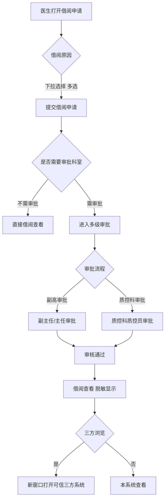
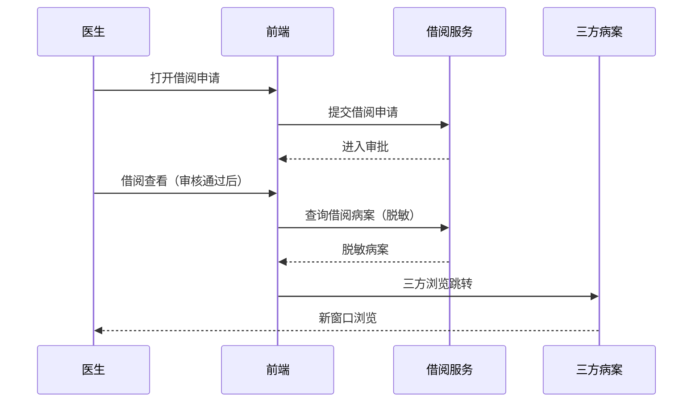

# BLGL-09-GDJY-006 病历借阅流程 - Spec

> **功能编号**：BLGL-09-GDJY-006
> **文档类型**：功能Spec（业务背景与设计）
> **文档版本**：V1.0
> **编写时间**：2026-08-15
> **编写人**：RACC

---

## 文档索引

#### 章节索引

**Spec（研发视角）**

| 章节号 | 章节名称 | 内容说明 |
|--------|---------|---------|
| 1、 | 文档概述 | 文档目的、文档范围、术语定义、阅读指南、参考文档 |
| 2、 | 功能背景与定位 | 功能背景、功能定位、目标用户、核心价值 |
| 3、 | 业务流程设计 | 主流程/异常流程/边界流程（Given/When/Then） |
| 4、 | 数据模型设计 | 核心数据结构、状态定义、系统参数定义 |
| 5、 | 接口契约设计 | API列表、接口详细设计、错误码定义 |
| 6、 | 技术方案设计 | 页面路径、技术栈、关键技术点、部署方案 |
| 7、 | 测试用例预设计 | 功能/边界/异常/性能测试用例 |
| 8、 | 非功能性要求 | 性能、安全、可用性、兼容性 |
| 9、 | 依赖与风险 | 外部依赖、风险项 |
| 10、 | 附录 | 流程图、时序图、参考文档 |

**PM-Spec（业务视角）**

| 章节号 | 章节名称 | 内容说明 |
|--------|---------|---------|
| 一 | 目标 | 功能定位与核心价值 |
| 二 | 约束 | 业务/技术/非功能性约束 |
| 三 | 验收标准 | 验收条件与验证方法 |
| 四 | 排除范围 | 本次不做项与明确边界 |
| 五 | 关键决策记录 | 方案决策与选型理由 |
| 六 | 优先级 | 优先级定义 |
| 七 | 关联文档 | 关联文档索引 |
| 附录 | 填写检查清单 | 质量检查 |

**Analyst-Spec（产品视角）**

| 章节号 | 章节名称 | 内容说明 |
|--------|---------|---------|
| 一 | 功能编号体系 | 功能编号与层级结构 |
| 二 | 核心业务流程 | 核心业务流程与时序 |
| 三 | 功能规格说明 | 详细功能规格与验收标准 |
| 四 | 排除范围 | 排除范围 |
| 五 | 业务规则清单 | 业务规则清单 |
| 六 | 关联文档 | 关联文档索引 |
| 七 | 待确认问题清单 | 待确认问题汇总 |
| - | 填写检查清单 | 质量检查 |

#### 版本历史

| 版本 | 日期 | 变更说明 | 编写人 |
|------|------|---------|--------|
| V1.0 | 2026-08-15 | 初始版本 | RACC |

#### 关联文档索引

| 序号 | 文档名称 | 文档类型 | 版本 | 位置 |
|------|---------|---------|------|------|
| 1 | BLGL-09-GDJY 归档借阅功能点Spec.md | 功能点Spec（模块级） | V1.0 | 上级目录 |
| 2 | BLGL-09-GDJY-006_病历借阅流程-Spec.md | 功能Spec（业务背景与设计）（本文档） | V1.0 | 本目录 |
| 3 | BLGL-09-GDJY-006_病历借阅流程_Analyst-spec.md | Analyst-Spec（分析规格） | V1.0 | 本目录 |
| 4 | BLGL-09-GDJY-006_病历借阅流程_PM-spec.md | PM-Spec（需求规格） | V0.1 | 本目录 |

---

## 1、文档概述

### 1.1、文档目的

本文档旨在明确"病历借阅流程"功能（BLGL-09-GDJY-006）的业务背景与设计方案，为需求分析、研发实现、测试验收及评审提供统一的业务上下文、设计口径与决策依据。

**具体目的包括**：

1. 梳理病历借阅流程功能的业务由来与历史需求演进脉络，说明"为什么要做"；
2. 明确功能的定位边界、目标用户与核心价值，回答"做成什么"；
3. 描述功能的业务流程、数据模型、接口契约与技术方案，回答"怎么做"；
4. 预设计测试用例并明确非功能性要求、依赖与风险，为研发与验收提供依据；
5. 作为 Analyst-Spec 的业务前提与设计输入，保证各层文档业务口径一致。

### 1.2、文档范围

#### 1.2.1 纳入范围

本文档覆盖病历借阅流程的完整业务背景与设计，包括：

- 借阅申请：借阅原因下拉、借阅病案首页、申请科室
- 借阅审核：多级审批、副高审批、不需审批科室、质控科角色
- 借阅查看：脱敏显示、借阅首页显示、三方浏览跳转
- 已归档病历借阅：已归档病历不允许直接查看，走借阅流程
- 借阅脱敏：打开即显示脱敏效果，不能看到病人姓名

#### 1.2.2 排除范围

本文档不涉及以下内容（详见其他功能点或模块）：

- 病历自动归档/手动归档 —— BLGL-09-GDJY-001/-002
- 病历撤销归档 —— BLGL-09-GDJY-003
- 病历召回申请/召回审核 —— BLGL-09-GDJY-004/-005
- 三方病案系统对接 —— BLGL-09-GDJY-007
- 归档查询与统计 —— BLGL-09-GDJY-008

### 1.3、术语定义

| 术语 | 定义 |
|------|------|
| 病案借阅 | 对已归档病历发起借阅申请，经审核后查看病案 |
| 借阅原因 | 病案借阅申请的下拉选项，取术语"病案借阅原因" |
| 脱敏显示 | 借阅查看时打开即显示脱敏效果，不能看到病人姓名 |
| BORROW001 | 病案借阅是否开启与卫宁60病案系统对接模式参数 |

### 1.4、阅读指南

- **章节关系**：第1~2章为业务全貌，第3~10章为设计实现层。与 Analyst-Spec、PM-Spec 互相引用保持一致。
- **读者对象**：产品经理/需求分析师读第1~2章；研发读第3~6、9~10章；测试读第3、7~8章；评审人员核对各层一致性。

### 1.5、参考文档

| 序号 | 文档名称 | 版本/日期 |
|------|---------|----------|
| 1 | 【历史需求】住院病历的历史需求.xlsx | - |
| 2 | BLGL-09-GDJY-006_病历借阅流程_PM-spec.md | V0.1 |
| 3 | BLGL-09-GDJY-006_病历借阅流程_Analyst-spec.md | V1.0 |
| 4 | BLGL-09-GDJY 归档借阅功能点Spec.md | V1.0 |

---

## 2、功能背景与定位

### 2.1 功能背景

病历借阅流程是归档借阅模块的调阅通道，需满足：

- **现状痛点**：借阅原因目前是文本输入框，需改为下拉选项；查看病案先看到病人姓名然后刷新成脱敏，评审专家要求打开即显示脱敏；借阅审核通过后仅支持本系统查看，无法跳转三方系统浏览
- **管理要求**：五级评审专家要求出院患者病历走病历借阅模式；已归档病历不允许直接查看需走借阅流程
- **历史需求演进**：借阅审批副高审批→ 借阅原因下拉→ 借阅脱敏（9）→ 三方浏览跳转（1）

### 2.2 功能定位

"病历借阅流程"是 WiNEX 病历管理-归档借阅的调阅通道，定位为：

- **借阅申请/审核/查看**：借阅申请（M01）、借阅审核（M02）、借阅查看（M03）全流程
- **合规调阅**：已归档病历走借阅流程，脱敏显示
- **审批配置**：副高审批、不需审批科室、质控科角色

### 2.3 目标用户

| 用户角色 | 主要使用场景 |
|---------|-------------|
| 住院医生 | 发起借阅申请/查看 |
| 审核人员 | 借阅审核（副主任/主任/质控科） |
| 病案管理员 | 配置借阅审批流程 |

### 2.4 核心价值

| 价值维度 | 价值描述 |
|---------|---------|
| 合规调阅 | 已归档病历走借阅流程，不能随意查看 |
| 隐私保护 | 借阅查看脱敏显示，保护病人隐私 |
| 三方浏览 | 借阅审核通过后跳转可信三方系统浏览 |

---

## 3、业务流程设计（Given/When/Then）

### 3.1 主流程

**Scenario 1: 病案借阅申请**

```gherkin
Given:
  - 医生需要借阅已归档病历/病案首页

When:
  - 打开病案借阅-借阅申请
  - 选择借阅原因（下拉选项，取"病案借阅原因"术语，支持多选）
  - 提交借阅申请

Then:
  - 借阅申请提交进入审核流程
  - 借阅审核界面的借阅原因显示所选原因的拼接内容（多个原因用；拼接）
```

### 3.2 异常流程

**Scenario 2: 业务异常——已归档病历不允许直接查看**

```gherkin
Given:
  - 病历已归档
  - 参数 EG004/BORROW001 配置

When:
  - 医生在病历查询/全院查询点击已归档病历查看

Then:
  - 操作栏"查看"或"详情"置灰
  - 鼠标悬浮提醒"已归档患者病历查询请走借阅流程"
```

**Scenario 3: 数据异常——借阅查看脱敏失效**

```gherkin
Given:
  - 病案借阅查看病案

When:
  - 打开病案

Then:
  - 原逻辑先看到病人姓名再刷新成脱敏（问题）
  - 需调整为打开即显示脱敏效果，不能看到病人姓名
```

**Scenario 4: 系统异常——三方浏览跳转失败**

```gherkin
Given:
  - 病案借阅审核通过
  - 当前为对接三方病案模式

When:
  - 点击"三方浏览"按钮

Then:
  - 新窗口打开可信三方系统的浏览页面
  - 跳转失败时提示
```

### 3.3 边界流程

**Scenario 5: 边界——不需审批科室**

```gherkin
Given:
  - 参数"病案借阅不需要审批的科室"配置了当前科室

When:
  - 该科室发起借阅申请

Then:
  - 不需要审批
  - 在借阅查看可以直接查看
```

**Scenario 6: 边界——借阅病案首页**

```gherkin
Given:
  - 日常管理-病案借阅-借阅申请

When:
  - 申请借阅病案首页

Then:
  - 有已创建的首页时才显示并可以选择
  - 借阅审核通过后，是病案系统的首页调用病案组件显示，是我们自己的首页显示我们的编辑器
```

---

## 4、数据模型设计

### 4.1 核心数据结构

#### 4.1.1 核心保存请求

| 字段名 | 类型 | 必填 | 备注 |
|--------|------|------|------|
| 借阅原因 | String | 是 | 下拉选项，支持多选 |
| 借阅科室 | String | 否 | 申请科室 |
| 借阅时限 | Integer | 否 | 借阅天数 |

> ⏳ 待确认：借阅申请接口完整入参/出参以代码扫描和 API 契约为准。

#### 4.1.2 核心表/实体

| 表/实体 | 关键字段 | 说明 |
|---------|---------|------|
| INP_EMR_BORROWING（InpatientEmrBorrowPO） | inpEmrBorrowingId(INP_EMR_BORROWING_ID)、inpEmrBorrowingStatus(BORROWING_FLAG)、encounterId、inpRhbRecordId、borrowingEffectiveAt(BORROWING_EFFECTIVE_AT)、borrowingInvalidAt(BORROWING_INVALID_AT)、borrowingDays(BORROWING_DAYS)、borrowingReason(ACTION_REASON)、borrowingReviewedFlag(REVIEWED_STATUS)、currentBorrowingReviewId(CURRENT_BORROWING_REVIEW_ID)、returnFlag(BORROWING_RETURN_FLAG)、applicantDeptId(APPLICANT_DEPT_ID) | 病案借阅主表（借阅状态/原因/时限/审核标志，代码） |
| INP_EMR_BORROWING_DETAIL（InpEmrBorrowingDetailPO） | inpEmrBorrowingDetailId、inpEmrBorrowingId、inpEmrSetId、encounterId、inpRhbRecordId、borrowingFlag | 借阅明细表（借阅文书，代码） |
| INP_EMR_BORROWING_REVIEW（InpEmrBorrowingReviewPO） | inpEmrBorrowingReviewId、inpEmrBorrowingHistoryId、inpEmrBorrowingId、borrowingReviewResultCode(REVIEW_ACTION_CODE)、borrowingReviewComment(REVIEW_COMMENT)、reviewedBy、employeeTypeCode、seqNo | 借阅审批表（审核结果/意见，代码） |
| INP_EMR_BORROWING_PROCESS（InpEmrBorrowingProcessPO，定义态） | inpEmrBorrowingProcId、inpEmrBorrowingProcName、inpEmrBorrowingProcDesc、seqNo | 借阅流程节点配置 |
| INP_EMR_BORROWING_ROLE（InpEmrBorrowingRolePO，定义态） | inpEmrBorrowingRoleId、inpEmrBorrowingProcId、inpEmrBorrowingRoleCode | 借阅流程角色配置 |
| INP_EMR_BORROWING_HISTORY（InpEmrBorrowingHistoryPO，定义态） | versionNo | 借阅流程版本快照 |

### 4.2 状态定义

| 状态码 | 状态名称 | 说明 |
|--------|---------|------|
| 399017135 | 审核通过 | 借阅审核通过状态（borrowingReviewedFlag） |
| - | 待审核 | 借阅申请待审核 |

### 4.3 系统参数定义

| 参数编码 | 参数名称 | 说明 |
|---------|---------|------|
| - | 病案借阅不需要审批的科室 | 配置的科室借阅不需审批 |
| BORROW001 | 病案借阅是否开启与卫宁60病案系统对接模式 | 已归档病历查看置灰判断 |
| EG004 | 病历查询、归档查询是否允许查看已归档病历详情 | 是/否 |

---

## 5、接口契约设计

### 5.1 API列表

| 序号 | API名称（代码函数） | 路径 | 方法 | 说明 |
|:----:|---------|------|:----:|------|
| 1 | 查询借阅申请列表 | /api/v1/app_record_inpatient/emr_inpatient/emr_rhb_borrowing/query/by_example | POST | 借阅申请列表（入参 DailyManageInpRhbRecordQueryInputAO，出参 WinPagedList<InpRhbRecordInfoOutputVO>） |
| 2 | 提交借阅申请 | /api/v1/app_record_inpatient/emr_inpatient/emr_borrowing/save | POST | 提交借阅申请（入参 InpatEmrSetBorrowingInputAO） |
| 3 | 根据条件查询借阅表 | /api/v1/app_record_inpatient/emr_inpatient/emr_borrowing/query/by_example | POST | 借阅列表（出参 WinPagedList<InpatientEmrBorrowingOutputVO>） |
| 4 | 手动归还借阅 | /api/v1/app_record_inpatient/emr_inpatient/emr_borrowing/return | POST | 归还借阅（入参 InpatientEmrBorrowingReturInputAO） |
| 5 | 多级审核借阅流程操作 | /api/v1/app_record_inpatient/emr_inpatient/emr_borrowing_process/review | POST | 借阅审核（入参 InpatientEmrBorrowingReviewInputAO，出参 InpatientEmrCommonOutputVO） |
| 6 | 待我审核列表 | /api/v1/app_record_inpatient/emr_inpatient/emr_borrowing_review/query/by_example | POST | 待我审核 |
| 7 | 我参与审核列表 | /api/v1/app_record_inpatient/emr_inpatient/emr_borrowing_my_review/query/by_example | POST | 我参与审核 |
| 8 | 查询借阅病历目录树及患者病历列表 | /api/v1/app_record_inpatient/emr_inpatient/emr_borrowing_class_tree/by_id | POST | 借阅查看（入参 InpatientEmrTypeQueryInputAO，出参 List<InpatientEmrTypeOutputVO>） |
| 9 | 撤销借阅申请 | /api/v1/app_record_inpatient/emr_inpatient/emr_borrowing/cancel | POST | 撤销借阅（入参 InpatEmrSetBorrowingInputAO） |
| 10 | 查询借阅详情及审批流程详情 | /api/v1/app_record_inpatient/emr_inpatient/emr_borrowing_info_process_detail/query | POST | 借阅详情（入参 InpEmrBorrowingAndProcessQueryInputAO，出参 InpEmrBorrowingAndProcessOutputVO） |
| 11 | 住院病历借阅列表查询 | /api/v1/app_record_inpatient/emr_inpatient/borrowing_list/query/by_example | POST | 借阅列表（入参 InpEmrBorrowingQueryInputAO） |

### 5.2 接口详细设计

#### 5.2.1 提交借阅申请（emr_borrowing/save）

**请求参数**:
```json
{
  "inpRhbRecordId": "12345",
  "borrowingReason": "科研教学;病历复印",
  "borrowingDays": 3,
  "applyDeptId": "1001",
  "borrowingDetailList": [
    {
      "inpEmrSetId": "20001",
      "borrowingFlag": "1"
    }
  ]
}
```

**返回值（成功）**:
```json
{
  "success": true,
  "data": null
}
```

> ⏳ 待确认：借阅接口字段以代码扫描（InpatEmrSetBorrowingInputAO）和 API 契约为准。

**返回值（失败）**:
```json
{
  "success": false,
  "message": "提交借阅申请失败",
  "data": null
}
```

### 5.3 错误码定义

| 错误码 | 错误信息 | 处理方式 |
|--------|---------|---------|
| ⏳ 待确认 | 已归档患者病历查询请走借阅流程 | 查看按钮置灰 |

---

## 6、技术方案设计

### 6.1 页面路径

- **页面路径**: 住院医生站→日常管理→病案借阅→借阅申请/借阅审核/借阅查看/借阅浏览（src/router/EmrBorrow.js borrowApply/borrowExamine/borrowBrowse/borrowCheck/copyMedical/medicalRecordDocTransfer）
- **前端逻辑**: 借阅原因下拉（术语"病案借阅原因"）、脱敏显示、三方浏览按钮
- **后端模块**: winning-emr-ipt-archive/winning-emr-ipt-archive-provider/controller/InpatientEmrBorrowingController.java（提交/查询/归还/审核/撤销借阅）
- **前端 API**: winning-webui-inpatient-clinicalnote-pango/src/pages/ClinicalnoteBorrow/api/index.js（getBorrowApplyList → emr_rhb_borrowing/query/by_example、saveBorrowApply → emr_borrowing/save、reviewBorrowApply → emr_borrowing_process/review、returnBorrow → emr_borrowing/return、getwBorrowTree → emr_borrowing_class_tree/by_id、cancelBorrowApply → emr_borrowing/cancel）

### 6.2 技术栈

| 类别 | 技术 | 版本 |
|------|------|------|
| 前端框架 | Vue | 2.6.14 |
| 前端UI | element-ui | 2.13.0 |
| 后端框架 | Spring Boot（Java 17）+ JPA/Hibernate | - |
| RPC | winning-akso-rpc-rest | - |

### 6.3 关键技术点

- 借阅原因由文本输入框改为下拉选项，选项值取术语"病案借阅原因"已启用术语值，支持多选
- 借阅查看打开即显示脱敏效果
- 借阅审核通过后"我的申请"列表新增三方浏览按钮，点击后新窗口打开可信三方系统

### 6.4 部署方案

⏳ 待确认：部署方案未在资料区中找到。

---

## 7、测试用例预设计

### 7.1 功能测试

| 用例编号 | 测试场景 | Given | When | Then |
|---------|---------|-------|------|------|
| TC-001 | 借阅申请 | 已归档病历 | 选择借阅原因提交（emr_borrowing/save） | 借阅申请进入审核 |
| TC-002 | 借阅申请列表 | 借阅申请界面 | 调用 emr_rhb_borrowing/query/by_example | 返回借阅申请列表 |
| TC-003 | 借阅审核 | 借阅申请待审核 | 调用 emr_borrowing_process/review | 借阅审核结果更新 |

### 7.2 边界测试

| 用例编号 | 测试场景 | Given | When | Then |
|---------|---------|-------|------|------|
| TC-004 | 不需审批科室 | 参数配置科室 | 发起借阅申请 | 无需审批直接查看 |
| TC-005 | 借阅归还 | 借阅已超期 | 调用 emr_borrowing/return | 借阅归还成功 |

### 7.3 异常测试

| 用例编号 | 测试场景 | Given | When | Then |
|---------|---------|-------|------|------|
| TC-006 | 已归档病历查看 | 已归档病历，参数配置 | 点击查看 | 查看按钮置灰提示走借阅 |
| TC-007 | 撤销借阅申请 | 借阅申请未审核 | 调用 emr_borrowing/cancel | 借阅申请撤销成功 |

### 7.4 性能测试

| 用例编号 | 测试场景 | 指标 |
|---------|---------|------|
| TC-008 | 借阅查看响应 | ⏳ 待确认：性能指标未在资料区中找到 |
| TC-009 | 借阅申请提交响应 | ⏳ 待确认：性能指标未在资料区中找到 |

---

## 8、非功能性要求

### 8.1 性能要求

| 指标 | 要求 |
|------|------|
| 借阅查看响应时间 | ⏳ 待确认 |

### 8.2 安全要求

| 要求 | 说明 |
|------|------|
| 隐私保护 | 借阅查看脱敏显示，不能看到病人姓名 |
| 借阅权限 | 借阅审核分级审批（副高/质控科） |

**医疗行业特殊要求**

| 要求 | 说明 |
|------|------|
| 合规调阅 | 已归档病历走借阅流程，不能随意查看 |

### 8.3 可用性要求

| 指标 | 要求值 |
|------|--------|
| 可用性 | ⏳ 待确认 |

### 8.4 兼容性要求

| 类型 | 要求 |
|------|------|
| 病案首页 | 病案系统首页调用病案组件，自有首页显示编辑器 |
| 三方浏览 | 借阅审核通过后支持跳转可信三方系统 |

---

## 9、依赖与风险

### 9.1 外部依赖

| 依赖项 | 说明 |
|--------|------|
| 三方病案系统 | 借阅浏览/三方跳转 |
| 术语系统 | 病案借阅原因术语 |

### 9.2 风险项

| 风险项 | 等级 | 说明 | 应对方案 |
|--------|------|------|---------|
| 脱敏失效 | 中 | 借阅查看先看到姓名再脱敏 | 打开即脱敏 |
| 越权查看 | 中 | 已归档病历直接查看 | 参数控制置灰 |

---

## 10、附录

### 10.1 流程图



### 10.2 时序图



### 10.3 参考文档

- BLGL-09-GDJY 归档借阅功能点Spec.md（V1.0，第5章 BLGL-09-GDJY-006 行）
- 关联Spec: BLGL-09-GDJY-006_病历借阅流程_PM-spec.md、BLGL-09-GDJY-006_病历借阅流程_Analyst-spec.md

---

## 填写检查清单

| 序号 | 检查项 | 是否完成 |
|:----:|--------|:--------:|
| 1 | 章节索引与正文章节一致 | ✅ |
| 2 | 版本历史记录完整 | ✅ |
| 3 | 关联文档索引已登记全部Spec | ✅ |
| 4 | 文档目的明确回答"为什么做/做成什么/怎么做" | ✅ |
| 5 | 纳入范围/排除范围清晰 | ✅ |
| 6 | 术语定义覆盖关键概念，从资料区可溯源 | ✅ |
| 7 | 参考文档已登记 | ✅ |
| 8 | 功能背景基于法规/规范/需求来源组织 | ✅ |
| 9 | 功能定位体现业务价值（3~5个定位点） | ✅ |
| 10 | 目标用户角色覆盖完整，在需求原文中有出处 | ✅ |
| 11 | 核心价值可陈述，与 Phase 1 口径一致 | ✅ |
| 12 | 业务流程：主流程≥1、异常≥3、边界≥2，Given/When/Then 具体 | ✅ |
| 13 | 数据模型：字段/表/状态/参数可溯源 | ✅ |
| 14 | 接口契约：API列表+详细设计+错误码齐全或标记待确认 | ✅ |
| 15 | 技术方案：页面路径/技术栈/关键点/部署方案或标记待确认 | ✅ |
| 16 | 测试用例：功能/边界/异常/性能覆盖 | ✅ |
| 17 | 非功能性要求：性能/安全/可用性/兼容性指标可量化或标记待确认 | ✅ |
| 18 | 依赖与风险：外部依赖登记完整 | ✅ |
| 19 | 附录：流程图/时序图与正文流程一致 | ✅ |
| 20 | 全文无占位符 `< >` 残留 | ✅ |
| 21 | 全文陈述可溯源至资料区 | ✅ |
| 22 | 人工审核确认完成 | ⏳ 待确认 |

---

**文档状态**：⬜ 待审核
**维护责任**：RACC
**下次更新**：根据评审反馈优化
