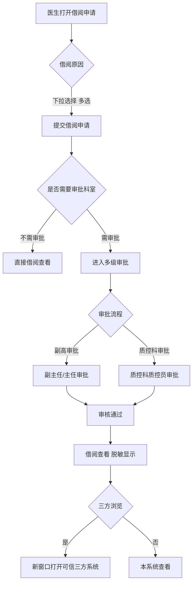
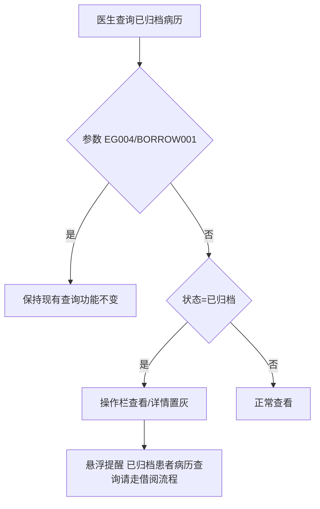

# BLGL-09-GDJY-006 病历借阅流程 _ Analyst - Spec

> **需求编号**：BLGL-09-GDJY-006
> **父需求**：BLGL-09-GDJY
> **关联PM Spec**：BLGL-09-GDJY-006_病历借阅流程_PM-spec.md
> **Spec版本**：V1.0
> **编写时间**：2026-08-15
> **编写人**：需求分析师

---

## 一、功能编号体系

### 1.1 功能层级结构

```
BLGL-09-GDJY-006-001: 借阅申请
  ├─ BLGL-09-GDJY-006-001-01: 借阅原因下拉
  ├─ BLGL-09-GDJY-006-001-02: 借阅病案首页
  └─ BLGL-09-GDJY-006-001-03: 申请科室

BLGL-09-GDJY-006-002: 借阅审核
  ├─ BLGL-09-GDJY-006-002-01: 多级审批（副高）
  ├─ BLGL-09-GDJY-006-002-02: 不需审批科室
  └─ BLGL-09-GDJY-006-002-03: 质控科角色

BLGL-09-GDJY-006-003: 借阅查看
  ├─ BLGL-09-GDJY-006-003-01: 脱敏显示
  ├─ BLGL-09-GDJY-006-003-02: 借阅首页显示
  └─ BLGL-09-GDJY-006-003-03: 三方浏览跳转

BLGL-09-GDJY-006-004: 已归档病历借阅控制
  ├─ BLGL-09-GDJY-006-004-01: 已归档病历查看置灰
  └─ BLGL-09-GDJY-006-004-02: 出院患者借阅模式
```

### 1.2 功能编号表

| REQ-ID | 功能名称 | 类型 | 优先级 | 说明 |
|--------|---------|------|--------|------|
| BLGL-09-GDJY-006-001 | 借阅申请 | 功能 | P0 | 借阅申请 |
| BLGL-09-GDJY-006-001-01 | 借阅原因下拉 | 子功能 | P0 | 下拉选项取术语"病案借阅原因" |
| BLGL-09-GDJY-006-001-02 | 借阅病案首页 | 子功能 | P1 | 有已创建首页时才显示 |
| BLGL-09-GDJY-006-001-03 | 申请科室 | 子功能 | P1 | 借阅申请科室 |
| BLGL-09-GDJY-006-002 | 借阅审核 | 功能 | P0 | 借阅审核 |
| BLGL-09-GDJY-006-002-01 | 多级审批（副高） | 子功能 | P0 | 副主任/主任审批，第一级别勾选 |
| BLGL-09-GDJY-006-002-02 | 不需审批科室 | 子功能 | P1 | 配置科室免审批 |
| BLGL-09-GDJY-006-002-03 | 质控科角色 | 子功能 | P1 | 399562049 质控科质控员角色 |
| BLGL-09-GDJY-006-003 | 借阅查看 | 功能 | P0 | 借阅查看 |
| BLGL-09-GDJY-006-003-01 | 脱敏显示 | 子功能 | P0 | 打开即脱敏，不能看到姓名 |
| BLGL-09-GDJY-006-003-02 | 借阅首页显示 | 子功能 | P1 | 病案组件/自有编辑器 |
| BLGL-09-GDJY-006-003-03 | 三方浏览跳转 | 子功能 | P1 | 审核通过后新窗口打开可信三方 |
| BLGL-09-GDJY-006-004 | 已归档病历借阅控制 | 功能 | P0 | 已归档病历走借阅流程 |
| BLGL-09-GDJY-006-004-01 | 已归档病历查看置灰 | 子功能 | P0 | EG004/BORROW001 控制 |
| BLGL-09-GDJY-006-004-02 | 出院患者借阅模式 | 子功能 | P1 | 区分在院/不在院调阅界面 |

---

## 二、核心业务流程

### 2.1 借阅申请主流程



### 2.2 已归档病历借阅控制流程



---

## 三、功能规格说明

### BLGL-09-GDJY-006-001: 借阅申请

#### 3.1.1 功能概述

住院医生站→日常管理→病案借阅→借阅申请：借阅原因由文本输入框改为下拉选项，选项值取术语"病案借阅原因"里已启用的术语值，支持多选；借阅审核界面的借阅原因显示申请时所选原因的拼接内容，多个原因之间用；拼接。借阅申请可以申请借阅病案首页，有已创建的首页时才显示并可以选择。

#### 3.1.2 用户角色

| 角色 | 使用场景 | 权限要求 | 操作频率 |
|------|---------|---------|---------|
| 住院医生 | 发起借阅申请 | 病历书写权限 | 中频 |

#### 3.1.3 业务流程（Given/When/Then）

**Scenario 1: 借阅申请（主流程）**

```gherkin
Given:
  - 医生需要借阅已归档病历/病案首页

When:
  - 打开借阅申请
  - 选择借阅原因（下拉，多选）
  - 提交申请

Then:
  - 借阅申请提交进入审核流程
  - 审核界面显示所选原因拼接内容（多个用；拼接）
```

**Scenario 2: 借阅病案首页**

```gherkin
Given:
  - 借阅申请界面
  - 患者有已创建的病案首页

When:
  - 申请借阅病案首页

Then:
  - 有已创建的首页时才显示并可以选择
```

**Scenario 3: 边界——借阅原因拼接**

```gherkin
Given:
  - 医生选择多个借阅原因

When:
  - 借阅审核界面显示借阅原因

Then:
  - 显示所选原因的拼接内容
  - 多个原因之间用；拼接
```

#### 3.1.4 数据字段定义

| 字段名 | 类型 | 必填 | 默认值 | 取值范围 | 说明 | 概念ID |
|--------|------|------|--------|---------|------|--------|
| 借阅原因 | String | 是 | - | 术语"病案借阅原因"多选 | 借阅原因 | ⏳ 待确认 |
| 借阅天数 | Integer | 否 | - | - | 借阅时限 | ⏳ 待确认 |
| inpEmrBorrowingId | Long | 是 | - | - | 借阅表主键（INP_EMR_BORROWING_ID，代码 InpatientEmrBorrowPO） | ⏳ 待确认 |
| inpEmrBorrowingStatus | Long | 是 | - | 借阅状态 | 借阅状态（BORROWING_FLAG，代码） | ⏳ 待确认 |
| borrowingReason | String | 是 | - | 借阅原因文本 | 借阅原因（ACTION_REASON，代码） | ⏳ 待确认 |
| borrowingDays | Integer | 否 | - | - | 借阅天数（BORROWING_DAYS，代码） | ⏳ 待确认 |
| borrowingEffectiveAt | Date | 否 | - | - | 借阅生效时间（BORROWING_EFFECTIVE_AT，代码） | ⏳ 待确认 |
| borrowingInvalidAt | Date | 否 | - | - | 借阅失效时间（BORROWING_INVALID_AT，代码） | ⏳ 待确认 |
| borrowingReviewedFlag | Long | 是 | - | 399017135审核通过 | 借阅审核标志（REVIEWED_STATUS，代码） | 399017135 |
| returnFlag | Long | 否 | - | - | 归还标志（BORROWING_RETURN_FLAG，代码） | ⏳ 待确认 |
| applicantDeptId | Long | 否 | - | - | 申请科室（APPLICANT_DEPT_ID，代码） | ⏳ 待确认 |

#### 3.1.5 验收标准

| AC编号 | 验收标准 | 对应REQ-ID | 验证方法 | 验证场景 |
|--------|---------|-----------|---------|---------|
| AC-001 | 借阅原因下拉多选，审核界面显示拼接内容 | BLGL-09-GDJY-006-001 | 功能测试 | Scenario 1/3 |
| AC-002 | 借阅病案首页有已创建首页时才显示 | BLGL-09-GDJY-006-001 | 功能测试 | Scenario 2 |

---

### BLGL-09-GDJY-006-002: 借阅审核

#### 3.2.1 功能概述

借阅审批流程改造：支持副高以上（副主任、主任）级别审批。借阅审批流程配置界面增加副主任、主任配置，多级审批流程下拉选项增加副主任医师、主任医师（主任、副主任只能在第一级别勾选）。根据配置，借阅审核支持专业技术职称是副主任医师和主任医师并且是申请科室的人员的审核。支持配置哪些科室的借阅不需要审核直接能借阅查看（参数"病案借阅不需要审批的科室"）。一级审批和多级审批支持选择角色【399562049 质控科质控员】。

#### 3.2.2 用户角色

| 角色 | 使用场景 | 权限要求 | 操作频率 |
|------|---------|---------|---------|
| 副主任/主任医师 | 借阅审核（第一级别） | 副高职称 | 中频 |
| 质控科质控员 | 借阅审核 | 质控科角色 | 中频 |

#### 3.2.3 业务流程（Given/When/Then）

**Scenario 1: 副高审批（主流程）**

```gherkin
Given:
  - 借阅审批流程配置界面已增加副主任、主任配置

When:
  - 借阅申请进入审批

Then:
  - 多级审批下拉选项增加副主任医师、主任医师（只能第一级别勾选）
  - 支持申请科室副高人员审核
```

**Scenario 2: 不需审批科室**

```gherkin
Given:
  - 参数"病案借阅不需要审批的科室"配置了当前科室

When:
  - 该科室发起借阅申请

Then:
  - 不需要审批
  - 在借阅查看可以直接查看
```

**Scenario 3: 质控科角色审批**

```gherkin
Given:
  - 一级审批/多级审批配置角色【399562049 质控科质控员】

When:
  - 流程配置该角色

Then:
  - 有质控科质控员角色的员工在对应节点有审批权限
```

#### 3.2.4 数据字段定义

| 字段名 | 类型 | 必填 | 默认值 | 取值范围 | 说明 | 概念ID |
|--------|------|------|--------|---------|------|--------|
| 病案借阅不需要审批的科室 | String | 否 | - | 临床业务科室多选 | 免审批科室参数 | ⏳ 待确认 |
| 质控科质控员角色 | String | 否 | - | 399562049 | 借阅审批角色 | 399562049 |

#### 3.2.5 验收标准

| AC编号 | 验收标准 | 对应REQ-ID | 验证方法 | 验证场景 |
|--------|---------|-----------|---------|---------|
| AC-003 | 借阅审批支持副高审批，第一级别勾选 | BLGL-09-GDJY-006-002 | 功能测试 | Scenario 1 |
| AC-004 | 配置科室免审批直接查看 | BLGL-09-GDJY-006-002 | 功能测试 | Scenario 2 |
| AC-005 | 借阅审批支持质控科质控员角色 | BLGL-09-GDJY-006-002 | 功能测试 | Scenario 3 |

---

### BLGL-09-GDJY-006-003: 借阅查看

#### 3.3.1 功能概述

病案借阅查看病案，互联互通评审专家要求打开即显示脱敏效果，不能看到病人姓名。借阅查看病案首页：审核通过后，是病案系统的首页就调用病案的组件显示，是自有首页就显示编辑器。借阅审核通过后"我的申请"列表中新增三方浏览按钮，点击后在新窗口打开可信三方系统的浏览页面。

#### 3.3.2 用户角色

| 角色 | 使用场景 | 权限要求 | 操作频率 |
|------|---------|---------|---------|
| 住院医生 | 借阅查看病案 | 借阅权限 | 中频 |

#### 3.3.3 业务流程（Given/When/Then）

**Scenario 1: 借阅脱敏显示（主流程）**

```gherkin
Given:
  - 借阅审核通过
  - 医生打开借阅查看

When:
  - 打开病案

Then:
  - 打开即显示脱敏效果
  - 不能看到病人姓名
```

**Scenario 2: 借阅首页显示**

```gherkin
Given:
  - 借阅审核通过
  - 申请借阅病案首页

When:
  - 医生打开借阅查看

Then:
  - 病案系统的首页调用病案组件显示
  - 自有首页显示编辑器
```

**Scenario 3: 三方浏览跳转**

```gherkin
Given:
  - 借阅审核通过（borrowingReviewedFlag == '399017135'）
  - 对接可信三方系统

When:
  - 医生在"我的申请"列表点击三方浏览按钮

Then:
  - 新窗口打开可信三方系统的浏览页面
```

#### 3.3.4 数据字段定义

| 字段名 | 类型 | 必填 | 默认值 | 取值范围 | 说明 | 概念ID |
|--------|------|------|--------|---------|------|--------|
| borrowingReviewedFlag | String | 否 | - | 399017135 | 借阅审核通过状态 | 399017135 |

#### 3.3.5 验收标准

| AC编号 | 验收标准 | 对应REQ-ID | 验证方法 | 验证场景 |
|--------|---------|-----------|---------|---------|
| AC-006 | 借阅查看打开即脱敏，不能看到病人姓名 | BLGL-09-GDJY-006-003 | 功能测试 | Scenario 1 |
| AC-007 | 借阅审核通过后三方浏览按钮跳转可信三方 | BLGL-09-GDJY-006-003 | 集成测试 | Scenario 3 |

---

### BLGL-09-GDJY-006-004: 已归档病历借阅控制

#### 3.4.1 功能概述

（五级病历）已归档病历不允许直接查看，走借阅流程。参数 EG004[是否允许查看本科室的已归档病历]修改名称为"病历查询、归档查询是否允许查看已归档病历详情"；科室病历查询、全院病历查询、归档查询页面（仅住院医生站）受参数 EG004 控制，配置为否时查询到的已归档病历，如果 BORROW001 为是，操作栏"查看"或"详情"置灰，悬浮提醒"已归档患者病历查询请走借阅流程"。出院患者病历查询需调整为借阅模式，区分在院与不在院患者调阅界面。

#### 3.4.2 用户角色

| 角色 | 使用场景 | 权限要求 | 操作频率 |
|------|---------|---------|---------|
| 住院医生 | 查询已归档病历 | 病历查询权限 | 高频 |

#### 3.4.3 业务流程（Given/When/Then）

**Scenario 1: 已归档病历查看置灰（主流程）**

```gherkin
Given:
  - 参数 EG004=否
  - 参数 BORROW001=是
  - 病历状态=已归档

When:
  - 医生在科室病历查询/全院查询/归档查询点击查看

Then:
  - 操作栏"查看"或"详情"置灰
  - 鼠标悬浮提醒"已归档患者病历查询请走借阅流程"
```

**Scenario 2: 边界——参数为是**

```gherkin
Given:
  - 参数 EG004=是

When:
  - 医生查询已归档病历

Then:
  - 保持现有查询功能不变
```

**Scenario 3: 出院患者借阅模式**

```gherkin
Given:
  - 出院患者病历查询

When:
  - 点击患者

Then:
  - 走病历借阅模式
  - 区分在院与不在院患者调阅界面
```

#### 3.4.4 数据字段定义

| 字段名 | 类型 | 必填 | 默认值 | 取值范围 | 说明 | 概念ID |
|--------|------|------|--------|---------|------|--------|
| 病历查询、归档查询是否允许查看已归档病历详情 | Boolean | 否 | - | 是/否 | EG004 | ⏳ 待确认 |
| 病案借阅是否开启与卫宁60病案系统对接模式 | Boolean | 否 | - | 是/否 | BORROW001 | ⏳ 待确认 |

#### 3.4.5 验收标准

| AC编号 | 验收标准 | 对应REQ-ID | 验证方法 | 验证场景 |
|--------|---------|-----------|---------|---------|
| AC-008 | 已归档病历查看/详情置灰，提示走借阅流程 | BLGL-09-GDJY-006-004 | 功能测试 | Scenario 1 |
| AC-009 | 出院患者病历查询走借阅模式，区分在院/不在院 | BLGL-09-GDJY-006-004 | 功能测试 | Scenario 3 |
| AC-010 | 借阅申请接口 emr_borrowing/save 调用成功后借阅申请进入审核，借阅审核接口 emr_borrowing_process/review 审核通过状态为 399017135 | BLGL-09-GDJY-006-001 | 接口测试 | Scenario 1 |

---

## 四、排除范围

本需求不包含以下功能项：

1. **病历自动归档/手动归档** —— BLGL-09-GDJY-001/-002
2. **病历撤销归档** —— BLGL-09-GDJY-003
3. **病历召回申请/召回审核** —— BLGL-09-GDJY-004/-005
4. **三方病案系统对接**（归档状态同步）—— BLGL-09-GDJY-007
5. **归档查询与统计** —— BLGL-09-GDJY-008
6. **病历复印/病案医生移交** —— 借阅相关菜单（不属于本次核心）

---

## 五、业务规则清单

| 规则ID | 规则名称 | 规则描述 | 来源 | 优先级 |
|--------|---------|---------|------|--------|
| BR-001 | 借阅原因下拉 | 借阅原因由文本输入框改为下拉选项，取术语"病案借阅原因"已启用术语值，支持多选；审核界面显示原因拼接（；分隔） |  | P0 |
| BR-002 | 副高审批 | 借阅审批支持副高以上（副主任、主任）级别审批，多级审批下拉增加副主任医师、主任医师（只能第一级别勾选） |  | P0 |
| BR-003 | 免审批科室 | 配置"病案借阅不需要审批的科室"的科室借阅不需审批可直接查看 |  | P1 |
| BR-004 | 借阅脱敏 | 借阅查看打开即显示脱敏效果，不能看到病人姓名 | 9 | P0 |
| BR-005 | 已归档病历借阅 | 已归档病历不允许直接查看，走借阅流程（EG004/BORROW001 控制置灰） | 5、1156441 | P0 |
| BR-006 | 三方浏览 | 借阅审核通过后"我的申请"列表新增三方浏览按钮，新窗口打开可信三方系统 | 1 | P1 |
| BR-007 | 借阅接口 | 借阅申请接口 emr_borrowing/save（入参 InpatEmrSetBorrowingInputAO），借阅表 INP_EMR_BORROWING（borrowingReason/borrowingDays/borrowingReviewedFlag），审核通过状态 399017135 | 代码 | P0 |

---

## 六、关联文档

| 文档类型 | 文档路径 | 说明 |
|---------|---------|------|
| 功能点Spec（模块级） | 上级目录 BLGL-09-GDJY 归档借阅功能点Spec.md（V1.0） | 模块级功能点索引 |
| 功能Spec（业务背景与设计） | 本目录 BLGL-09-GDJY-006_病历借阅流程-Spec.md（V1.0） | 业务背景与目标 Spec |
| Analyst-Spec（分析规格） | 本目录 BLGL-09-GDJY-006_病历借阅流程_Analyst-spec.md（V1.0）（本文档） | 分析规格 |
| PM-Spec（需求规格） | 本目录 BLGL-09-GDJY-006_病历借阅流程_PM-spec.md（V0.1） | PM 产出的 Spec 文档 |
| data-model.md | 待产出 | 架构师产出的数据建模文档 |
| design.md | 待产出 | 架构师产出的技术方案文档 |
| api-contract.md | 待产出 | 开发经理产出的 API 契约文档 |

---

## 七、待确认问题清单

| 编号 | 问题描述 | 缺失信息 | 影响范围 | 建议补充方 |
|------|---------|---------|---------|-----------|
| Q-001 | 借阅申请/审核/查看接口完整入参/出参 | API 契约 | -Spec 第5章 | 开发经理 |
| Q-002 | 借阅原因术语概念 ID | 概念ID | 3.1.4 | 产品经理 |
| Q-003 | 借阅脱敏规则（场景编码1001）完整配置 | 需求分析原文 | 3.3.3 | 需求分析师 |
| Q-004 | 借阅查看脱敏失效根因 | 需求分析原文缺失 | 3.2.3 | 开发经理 |
| Q-005 | 病案借阅配置（借阅时限/审批级别）完整参数 | 需求分析原文 | 3.2.3 | 需求分析师 |
| Q-006 | 性能指标（借阅查看响应时间） | 资料区无量化指标 | -Spec 第8章 | 产品经理 |

---

## 填写检查清单

| 序号 | 检查项 | 是否完成 |
|:----:|--------|:--------:|
| 1 | 功能编号带父子层级 | ✅ |
| 2 | 每个 REQ-ID 有功能概述和用户角色 | ✅ |
| 3 | 主流程至少 1 个 Given/When/Then 场景 | ✅ |
| 4 | 异常流程至少 3 个 Given/When/Then 场景 | ✅ |
| 5 | 边界流程至少 2 个 Given/When/Then 场景 | ✅ |
| 6 | 每个 Given/When/Then 内容具体，不模糊 | ✅ |
| 7 | 数据字段定义完整（字段名、类型、必填、说明、概念ID） | ✅ |
| 8 | 验收标准 AC 编号独立，可验证 | ✅ |
| 9 | 验收标准无"功能正常"等模糊表述 | ✅ |
| 10 | 排除范围明确列出 | ✅ |
| 11 | 业务规则清单列出所有规则，每条标注来源 | ✅ |
| 12 | 流程图使用 Mermaid 格式（≥2 个） | ✅ |
| 13 | 关联文档索引包含 Phase 1 功能点Spec | ✅ |
| 14 | 待确认问题清单汇总了全文所有 ⏳ 项 | ✅ |
| 15 | 全文无占位符 `< >` 残留 | ✅ |
| 16 | 全文陈述可溯源至资料区（S1~S10 溯源核查） | ✅ |
| 17 | 人工审核确认完成 | ⏳ 待确认 |

---

**文档状态**：⬜ 待审核
**维护责任**：需求分析师规范组
**下次更新**：根据评审反馈优化

---

## 版本历史

| 版本 | 日期 | 变更说明 | 编写人 |
|------|------|---------|--------|
| V1.0 | 2026-08-15 | 初始版本 | 需求分析师 |
