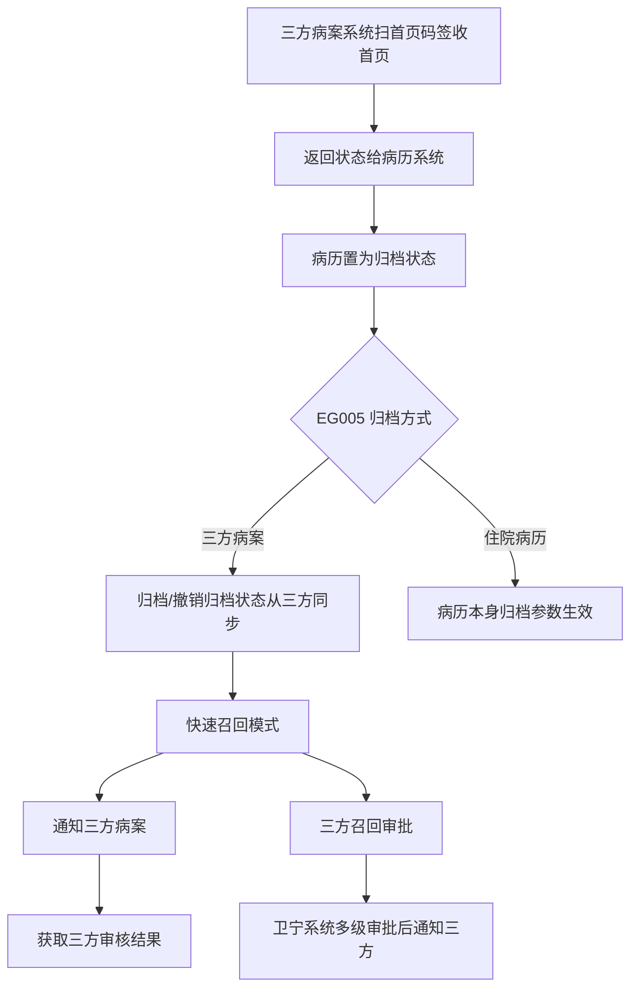
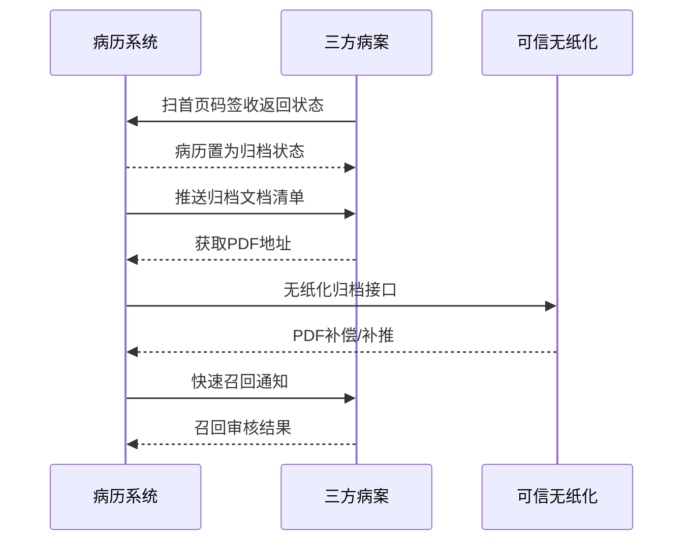

# BLGL-09-GDJY-007 三方病案系统对接 - Spec

> **功能编号**：BLGL-09-GDJY-007
> **文档类型**：功能Spec（业务背景与设计）
> **文档版本**：V1.0
> **编写时间**：2026-08-15
> **编写人**：RACC

---

## 文档索引

#### 章节索引

**Spec（研发视角）**

| 章节号 | 章节名称 | 内容说明 |
|--------|---------|---------|
| 1、 | 文档概述 | 文档目的、文档范围、术语定义、阅读指南、参考文档 |
| 2、 | 功能背景与定位 | 功能背景、功能定位、目标用户、核心价值 |
| 3、 | 业务流程设计 | 主流程/异常流程/边界流程（Given/When/Then） |
| 4、 | 数据模型设计 | 核心数据结构、状态定义、系统参数定义 |
| 5、 | 接口契约设计 | API列表、接口详细设计、错误码定义 |
| 6、 | 技术方案设计 | 页面路径、技术栈、关键技术点、部署方案 |
| 7、 | 测试用例预设计 | 功能/边界/异常/性能测试用例 |
| 8、 | 非功能性要求 | 性能、安全、可用性、兼容性 |
| 9、 | 依赖与风险 | 外部依赖、风险项 |
| 10、 | 附录 | 流程图、时序图、参考文档 |

**PM-Spec（业务视角）**

| 章节号 | 章节名称 | 内容说明 |
|--------|---------|---------|
| 一 | 目标 | 功能定位与核心价值 |
| 二 | 约束 | 业务/技术/非功能性约束 |
| 三 | 验收标准 | 验收条件与验证方法 |
| 四 | 排除范围 | 本次不做项与明确边界 |
| 五 | 关键决策记录 | 方案决策与选型理由 |
| 六 | 优先级 | 优先级定义 |
| 七 | 关联文档 | 关联文档索引 |
| 附录 | 填写检查清单 | 质量检查 |

**Analyst-Spec（产品视角）**

| 章节号 | 章节名称 | 内容说明 |
|--------|---------|---------|
| 一 | 功能编号体系 | 功能编号与层级结构 |
| 二 | 核心业务流程 | 核心业务流程与时序 |
| 三 | 功能规格说明 | 详细功能规格与验收标准 |
| 四 | 排除范围 | 排除范围 |
| 五 | 业务规则清单 | 业务规则清单 |
| 六 | 关联文档 | 关联文档索引 |
| 七 | 待确认问题清单 | 待确认问题汇总 |
| - | 填写检查清单 | 质量检查 |

#### 版本历史

| 版本 | 日期 | 变更说明 | 编写人 |
|------|------|---------|--------|
| V1.0 | 2026-08-15 | 初始版本 | RACC |

#### 关联文档索引

| 序号 | 文档名称 | 文档类型 | 版本 | 位置 |
|------|---------|---------|------|------|
| 1 | BLGL-09-GDJY 归档借阅功能点Spec.md | 功能点Spec（模块级） | V1.0 | 上级目录 |
| 2 | BLGL-09-GDJY-007_三方病案系统对接-Spec.md | 功能Spec（业务背景与设计）（本文档） | V1.0 | 本目录 |
| 3 | BLGL-09-GDJY-007_三方病案系统对接_Analyst-spec.md | Analyst-Spec（分析规格） | V1.0 | 本目录 |
| 4 | BLGL-09-GDJY-007_三方病案系统对接_PM-spec.md | PM-Spec（需求规格） | V0.1 | 本目录 |

---

## 1、文档概述

### 1.1、文档目的

本文档旨在明确"三方病案系统对接"功能（BLGL-09-GDJY-007）的业务背景与设计方案，为需求分析、研发实现、测试验收及评审提供统一的业务上下文、设计口径与决策依据。

**具体目的包括**：

1. 梳理三方病案系统对接功能的业务由来与历史需求演进脉络，说明"为什么要做"；
2. 明确功能的定位边界、目标用户与核心价值，回答"做成什么"；
3. 描述功能的业务流程、数据模型、接口契约与技术方案，回答"怎么做"；
4. 预设计测试用例并明确非功能性要求、依赖与风险，为研发与验收提供依据；
5. 作为 Analyst-Spec 的业务前提与设计输入，保证各层文档业务口径一致。

### 1.2、文档范围

#### 1.2.1 纳入范围

本文档覆盖三方病案系统对接的完整业务背景与设计，包括：

- 归档状态同步：三方病案系统扫首页码签收后置归档状态，撤销归档状态同步
- 快速召回通知三方：快速召回模式下召回申请/打印通知三方病案
- 三方召回审批：调用三方召回审批前在卫宁系统多级审批，完成后通知三方
- 可信无纸化对接：无纸化归档接口、补传/补推机制、自审按钮
- PDF 地址获取：住院病历归档时发消息给三方获取 PDF 地址
- 归档文档清单：推送归档文档清单给三方，排除未提交病历
- 退档流程：病历对接可信无纸化增加退档流程
- 按科室配置无纸化调用：MEDICAL032 控制科室范围

#### 1.2.2 排除范围

本文档不涉及以下内容（详见其他功能点或模块）：

- 病历自动归档/手动归档 —— BLGL-09-GDJY-001/-002
- 病历撤销归档 —— BLGL-09-GDJY-003
- 病历召回申请/召回审核 —— BLGL-09-GDJY-004/-005
- 病历借阅流程 —— BLGL-09-GDJY-006
- 归档校验与提醒 —— BLGL-09-GDJY-009

### 1.3、术语定义

| 术语 | 定义 |
|------|------|
| 三方病案系统 | 卫宁60病案系统/可信无纸化等外部病案系统，与病历系统通过接口对接 |
| EG005 | 住院病历归档方式，选项值新增"三方病案（三方触发）" |
| EG018 | 住院病历归档模式下对接无纸化参数 |
| MEDICAL032 | 三方无纸化接口地址配置 |
| 自审按钮 | 三方无纸化归档查询界面的医生自审按钮 |

### 1.4、阅读指南

- **章节关系**：第1~2章为业务全貌，第3~10章为设计实现层。与 Analyst-Spec、PM-Spec 互相引用保持一致。
- **读者对象**：产品经理/需求分析师读第1~2章；研发读第3~6、9~10章；测试读第3、7~8章；评审人员核对各层一致性。

### 1.5、参考文档

| 序号 | 文档名称 | 版本/日期 |
|------|---------|----------|
| 1 | 【历史需求】住院病历的历史需求.xlsx | - |
| 2 | BLGL-09-GDJY-007_三方病案系统对接_PM-spec.md | V0.1 |
| 3 | BLGL-09-GDJY-007_三方病案系统对接_Analyst-spec.md | V1.0 |
| 4 | BLGL-09-GDJY 归档借阅功能点Spec.md | V1.0 |

---

## 2、功能背景与定位

### 2.1 功能背景

三方病案系统对接是归档借阅模块的跨系统协同层，需满足：

- **现状痛点**：病历已归档但病案那边查不到归档数据；病案调用归档接口未实现归档；病历生成 PDF 存在失败情况，给到三方后缺失 PDF 数据
- **管理要求**：三方病案系统扫首页码签收首页后返回状态给病历系统，将患者病历置为归档状态；博石病案系统撤销归档也将状态给到病历系统
- **历史需求演进**：对接三方病案系统（1）→ 快速召回通知三方→ 三方召回审批（3）→ PDF 补偿机制（5）→ 按科室配置无纸化调用（8）

### 2.2 功能定位

"三方病案系统对接"是 WiNEX 病历管理-归档借阅的跨系统协同层，定位为：

- **状态同步**：三方病案归档/撤销归档状态同步
- **召回协同**：三方召回申请/审批流程协同
- **无纸化对接**：可信无纸化归档接口、PDF 补偿、自审按钮

### 2.3 目标用户

| 用户角色 | 主要使用场景 |
|---------|-------------|
| 住院医生 | 归档查询自审、召回申请 |
| 病案室管理员 | 三方病案协同归档/召回 |
| 三方病案系统 | 接收归档/召回状态与文档 |

### 2.4 核心价值

| 价值维度 | 价值描述 |
|---------|---------|
| 状态一致 | 病历归档/撤销归档状态与三方同步 |
| 协同召回 | 快速召回通知三方、三方召回审批 |
| 无纸化合规 | 无纸化归档接口、PDF 补偿机制 |

---

## 3、业务流程设计（Given/When/Then）

### 3.1 主流程

**Scenario 1: 三方病案触发归档**

```gherkin
Given:
  - 参数 EG005 = 三方病案（三方触发）
  - 现场实施配置归档查询一个菜单

When:
  - 三方病案系统扫首页码签收首页

Then:
  - 三方返回状态给病历系统
  - 病历系统将该患者病历置为归档状态
  - 病历归档状态和撤销归档状态都从三方病案系统同步
  - 病历本身归档设置参数不再起作用
```

### 3.2 异常流程

**Scenario 2: 业务异常——快速召回未通知三方**

```gherkin
Given:
  - 参数开启对接三方病案
  - 参数开启快速召回模式

When:
  - 发起快速召回申请/打印

Then:
  - 需要调用接口通知三方病案
  - 获取三方病案返回的审核结果
```

**Scenario 3: 数据异常——归档后病案查不到数据**

```gherkin
Given:
  - 病历已归档

When:
  - 病案系统查询归档数据

Then:
  - 病案那边查不到归档数据（问题）
  - 需排查归档状态同步
```

**Scenario 4: 系统异常——无纸化补推失败**

```gherkin
Given:
  - 可信无纸化对接 WINEX60

When:
  - 接口提示补推过程失败

Then:
  - 补推失败（问题）
  - 需排查接口与 PDF 生成
```

### 3.3 边界流程

**Scenario 5: 边界——三方召回审批**

```gherkin
Given:
  - EG005 = 三方病案（质控触发）

When:
  - 医生发起召回

Then:
  - 医生发起召回→住院病历审核→住院病历召回成功→通知三方召回状态
  - 调用三方召回审批前在卫宁系统进行多级审批（科主任审批和病案室审批）
```

**Scenario 6: 边界——按科室配置无纸化调用**

```gherkin
Given:
  - MEDICAL032 新增参数"MEDICAL032控制的科室范围"

When:
  - 病历归档

Then:
  - 选中科室归档时调 MEDICAL032 配置的三方地址上传病历文书
  - 未选中科室归档时不调三方地址
  - 配置科室自审时强制拦截未签名病历
```

---

## 4、数据模型设计

### 4.1 核心数据结构

#### 4.1.1 核心保存请求

| 字段名 | 类型 | 必填 | 备注 |
|--------|------|------|------|
| 归档文档清单 | - | 是 | 推送三方归档文档清单，排除未提交病历 |
| 就诊号 | String | 是 | 入参兼容 5x、60HIS 就诊号 |
| PDF 地址 | String | 否 | 三方获取 PDF 地址 |

> ⏳ 待确认：三方对接接口完整入参/出参以 API 契约为准。

#### 4.1.2 核心表/实体

| 表/实体 | 关键字段 | 说明 |
|---------|---------|------|
| INPATIENT_EMR_ARCHIVE（InpatientEmrArchivePO） | inpatEmrSetFilingId(INP_EMR_ARCHIVE_ID)、inpatRhbRecordId(INP_RHB_RECORD_ID)、statusCode(INP_EMR_ARCHIVE_STATUS)、inpatEmrSetFilingAt(INP_EMR_ARCHIVED_AT)、cancelArchiveFlag(CANCEL_ARCHIVE_FLAG) | 住院病历归档表（三方同步归档状态，代码） |
| INP_EMR_ARCHIVE_RECALL（InpEmrArchiveRecallPO） | filingRecallId(INP_EMR_ARCH_RECALL_ID)、filingRecallStatusCode(INP_EMR_ARCH_RECALL_STATUS)、filingRecallReason(ARCH_RECALL_REASON)、lastArchiveAt(LATEST_ARCHIVE_AT) | 召回申请表（三方召回状态同步，代码） |

### 4.2 状态定义

| 状态码 | 状态名称 | 说明 |
|--------|---------|------|
| 399058142 | 已归档 | 病历归档状态（FilingStatusConstant.ARCHIVE，代码） |
| 399058143 | 未归档 | 病历归档状态（FilingStatusConstant.UNARCHIVE，代码） |
| 399291265 | 已召回 | 病历归档状态（FilingStatusConstant.RECALLED，代码） |

### 4.3 系统参数定义

| 参数编码 | 参数名称 | 说明 |
|---------|---------|------|
| EG005 | 住院病历归档方式 | 选项值新增"三方病案（三方触发）"、"三方病案（质控触发）" |
| EG018 | 住院病历归档模式下对接无纸化 | 三方无纸化时显示上传按钮 |
| MEDICAL032 | 三方无纸化接口地址 | 新增参数"MEDICAL032控制的科室范围" |

---

## 5、接口契约设计

### 5.1 API列表

| 序号 | API名称（代码函数） | 路径 | 方法 | 说明 |
|:----:|---------|------|:----:|------|
| 1 | 三方通知归档 | InpatientEmrFilingEndpointImpl.updateInpEmrArchiveByTripartite（RPC） | - | 三方病案触发归档（记录域 RPC，代码） |
| 2 | 三方病案召回审核结果回写 | InpatientEmrFilingEndpointImpl.writeBackRecallReviewFromTripartite（RPC） | - | 三方召回审批结果回写 |
| 3 | 批量更新住院病历归档召回 | InpatientEmrFilingEndpointImpl.updateInpatientEmrSetFilingRecallBatch（RPC） | - | 三方召回状态批量更新 |
| 4 | 查询所有住院电子病历列表 | 2162-9001-01 | - | 提供给病案系统 |
| 5 | 根据病历标识更新无纸化状态 | 2162-9113-01 | - | 无纸化状态更新 |
| 6 | 更新无纸化状态 | /api/v1/record_emr/inpatient/emr_inpatient/emr_set_paperless_status/update | POST | 无纸化状态更新 |

### 5.2 接口详细设计

#### 5.2.1 无纸化状态更新（emr_set_paperless_status/update）

**请求参数**:
```json
{
  "emrSetId": "12345",
  "paperlessStatus": "已归档",
  "operatePeople": "张三"
}
```

**返回值（成功）**:
```json
{
  "success": true,
  "data": null
}
```

> ⏳ 待确认：三方对接接口字段以 API 契约为准（三方触发归档通过 RPC 端点 updateInpEmrArchiveByTripartite）。

**返回值（失败）**:
```json
{
  "success": false,
  "message": "更新无纸化状态失败",
  "data": null
}
```

### 5.3 错误码定义

| 错误码 | 错误信息 | 处理方式 |
|--------|---------|---------|
| ⏳ 待确认 | 补推过程失败 | 排查接口与 PDF 生成 |

---

## 6、技术方案设计

### 6.1 页面路径

- **页面路径**: 住院医生站→日常管理→病历归档→归档查询（自审按钮/上传按钮）
- **前端逻辑**: 归档查询界面自审按钮、上传按钮按参数控制
- **后端模块**: winning-emr-ipt/winning-emr-ipt-emrset/.../rest/InpatientEmrFilingEndpointImpl.java（三方通知归档、三方召回审核结果回写、批量更新归档召回）
- **MQ 消息**: 通知病案系统无纸化更新的 mq 消息
- **前端 API**: winning-webui-inpatient-clinicalnote-pango/src/api/global.js（queryHistoryList → inpatient_emr_archive/query/by_example）

### 6.2 技术栈

| 类别 | 技术 | 版本 |
|------|------|------|
| 前端框架 | Vue | 2.6.14 |
| 前端UI | element-ui | 2.13.0 |
| 后端框架 | Spring Boot（Java 17）+ JPA/Hibernate | - |
| RPC | winning-akso-rpc-rest | - |
| 消息 | MQ（无纸化更新通知） |

### 6.3 关键技术点

- 归档文档清单推送三方，排除未提交状态的病历；召回消息增加召回申请人账号/姓名/召回原因
- PDF 补偿机制：补传的病历无 PDF 时后台补偿生成，生成成功后调用患者信息推送三方病案接口
- 自审按钮：点击先判断是否存在未提交病历，有则弹窗提醒，医生点"审核"跳转三方界面

### 6.4 部署方案

⏳ 待确认：部署方案未在资料区中找到。

---

## 7、测试用例预设计

### 7.1 功能测试

| 用例编号 | 测试场景 | Given | When | Then |
|---------|---------|-------|------|------|
| TC-001 | 三方病案触发归档 | EG005=三方病案 | 三方签收首页（调用 updateInpEmrArchiveByTripartite） | 病历状态置为已归档 |
| TC-002 | 三方召回结果回写 | 三方召回审批完成 | 调用 writeBackRecallReviewFromTripartite | 病历召回状态更新 |

### 7.2 边界测试

| 用例编号 | 测试场景 | Given | When | Then |
|---------|---------|-------|------|------|
| TC-003 | 按科室配置无纸化调用 | MEDICAL032 控制科室范围 | 病历归档 | 选中科室调三方，未选中不调 |
| TC-004 | 三方批量更新召回 | 三方批量召回 | 调用 updateInpatientEmrSetFilingRecallBatch | 病历召回状态批量更新 |

### 7.3 异常测试

| 用例编号 | 测试场景 | Given | When | Then |
|---------|---------|-------|------|------|
| TC-005 | 快速召回未通知三方 | 开启三方+快速召回 | 发起召回 | 调用接口通知三方 |
| TC-006 | 无纸化状态更新失败 | 无纸化对接 | 调用 emr_set_paperless_status/update | 返回失败信息 |

### 7.4 性能测试

| 用例编号 | 测试场景 | 指标 |
|---------|---------|------|
| TC-007 | 三方对接接口响应 | ⏳ 待确认：性能指标未在资料区中找到 |
| TC-008 | 三方状态同步响应 | ⏳ 待确认：性能指标未在资料区中找到 |

---

## 8、非功能性要求

### 8.1 性能要求

| 指标 | 要求 |
|------|------|
| 三方对接接口响应时间 | ⏳ 待确认 |

### 8.2 安全要求

| 要求 | 说明 |
|------|------|
| 数据一致性 | 病历归档/撤销归档状态与三方同步 |

**医疗行业特殊要求**

| 要求 | 说明 |
|------|------|
| 无纸化合规 | 无纸化归档接口、PDF 补偿确保完整归档 |

### 8.3 可用性要求

| 指标 | 要求值 |
|------|--------|
| 可用性 | ⏳ 待确认 |

### 8.4 兼容性要求

| 类型 | 要求 |
|------|------|
| 就诊号 | 接口入参兼容 5x、60HIS 就诊号 |
| 归档模式 | EG005 兼容住院病历/60病案/60无纸化/三方病案/三方质控触发 |

---

## 9、依赖与风险

### 9.1 外部依赖

| 依赖项 | 说明 |
|--------|------|
| 卫宁60病案系统 | 首页质控/无纸化对接 |
| 可信无纸化 | 无纸化归档接口、补推机制 |
| 电信三方系统 | 召回审批结果回传 |

### 9.2 风险项

| 风险项 | 等级 | 说明 | 应对方案 |
|--------|------|------|---------|
| 状态不同步 | 中 | 病历归档但病案查不到 | 状态同步校验 |
| PDF 缺失 | 中 | 病历生成 PDF 失败导致三方缺失 | PDF 补偿机制 |

---

## 10、附录

### 10.1 流程图



### 10.2 时序图



### 10.3 参考文档

- BLGL-09-GDJY 归档借阅功能点Spec.md（V1.0，第5章 BLGL-09-GDJY-007 行）
- 关联Spec: BLGL-09-GDJY-007_三方病案系统对接_PM-spec.md、BLGL-09-GDJY-007_三方病案系统对接_Analyst-spec.md

---

## 填写检查清单

| 序号 | 检查项 | 是否完成 |
|:----:|--------|:--------:|
| 1 | 章节索引与正文章节一致 | ✅ |
| 2 | 版本历史记录完整 | ✅ |
| 3 | 关联文档索引已登记全部Spec | ✅ |
| 4 | 文档目的明确回答"为什么做/做成什么/怎么做" | ✅ |
| 5 | 纳入范围/排除范围清晰 | ✅ |
| 6 | 术语定义覆盖关键概念，从资料区可溯源 | ✅ |
| 7 | 参考文档已登记 | ✅ |
| 8 | 功能背景基于法规/规范/需求来源组织 | ✅ |
| 9 | 功能定位体现业务价值（3~5个定位点） | ✅ |
| 10 | 目标用户角色覆盖完整，在需求原文中有出处 | ✅ |
| 11 | 核心价值可陈述，与 Phase 1 口径一致 | ✅ |
| 12 | 业务流程：主流程≥1、异常≥3、边界≥2，Given/When/Then 具体 | ✅ |
| 13 | 数据模型：字段/表/状态/参数可溯源 | ✅ |
| 14 | 接口契约：API列表+详细设计+错误码齐全或标记待确认 | ✅ |
| 15 | 技术方案：页面路径/技术栈/关键点/部署方案或标记待确认 | ✅ |
| 16 | 测试用例：功能/边界/异常/性能覆盖 | ✅ |
| 17 | 非功能性要求：性能/安全/可用性/兼容性指标可量化或标记待确认 | ✅ |
| 18 | 依赖与风险：外部依赖登记完整 | ✅ |
| 19 | 附录：流程图/时序图与正文流程一致 | ✅ |
| 20 | 全文无占位符 `< >` 残留 | ✅ |
| 21 | 全文陈述可溯源至资料区 | ✅ |
| 22 | 人工审核确认完成 | ⏳ 待确认 |

---

**文档状态**：⬜ 待审核
**维护责任**：RACC
**下次更新**：根据评审反馈优化
