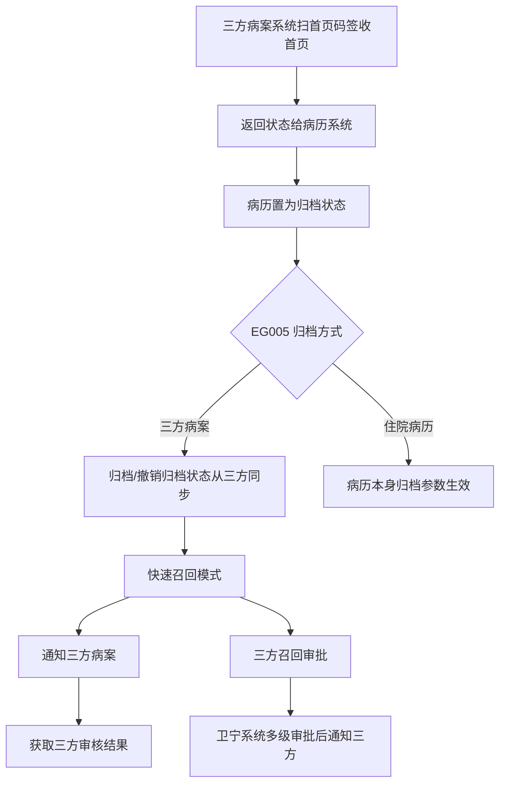
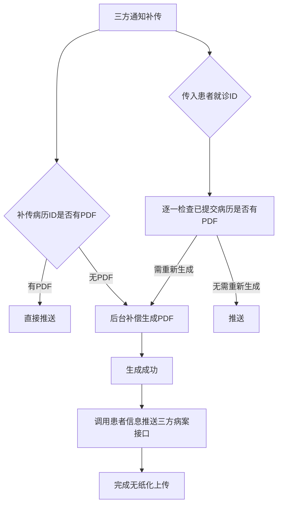

# BLGL-09-GDJY-007 三方病案系统对接 _ Analyst - Spec

> **需求编号**：BLGL-09-GDJY-007
> **父需求**：BLGL-09-GDJY
> **关联PM Spec**：BLGL-09-GDJY-007_三方病案系统对接_PM-spec.md
> **Spec版本**：V1.0
> **编写时间**：2026-08-15
> **编写人**：需求分析师

---

## 一、功能编号体系

### 1.1 功能层级结构

```
BLGL-09-GDJY-007-001: 归档状态同步
  ├─ BLGL-09-GDJY-007-001-01: 三方病案触发归档
  ├─ BLGL-09-GDJY-007-001-02: 撤销归档状态同步
  └─ BLGL-09-GDJY-007-001-03: EG005 三方病案模式

BLGL-09-GDJY-007-002: 快速召回通知三方
  └─ BLGL-09-GDJY-007-002-01: 快速召回模式通知三方

BLGL-09-GDJY-007-003: 三方召回审批
  └─ BLGL-09-GDJY-007-003-01: 卫宁系统多级审批后通知三方

BLGL-09-GDJY-007-004: 可信无纸化对接
  ├─ BLGL-09-GDJY-007-004-01: 无纸化归档接口
  ├─ BLGL-09-GDJY-007-004-02: PDF 补偿机制
  ├─ BLGL-09-GDJY-007-004-03: 自审按钮
  ├─ BLGL-09-GDJY-007-004-04: 归档文档清单推送
  └─ BLGL-09-GDJY-007-004-05: 按科室配置无纸化调用

BLGL-09-GDJY-007-005: 退档流程
  └─ BLGL-09-GDJY-007-005-01: 病历对接可信无纸化退档
```

### 1.2 功能编号表

| REQ-ID | 功能名称 | 类型 | 优先级 | 说明 |
|--------|---------|------|--------|------|
| BLGL-09-GDJY-007-001 | 归档状态同步 | 功能 | P0 | 三方触发归档/撤销同步 |
| BLGL-09-GDJY-007-001-01 | 三方病案触发归档 | 子功能 | P0 | 三方签收首页置归档 |
| BLGL-09-GDJY-007-001-02 | 撤销归档状态同步 | 子功能 | P0 | 博石病案撤销归档同步 |
| BLGL-09-GDJY-007-001-03 | EG005 三方病案模式 | 子功能 | P0 | 三方触发时病历参数不生效 |
| BLGL-09-GDJY-007-002 | 快速召回通知三方 | 功能 | P0 | 快速召回通知 |
| BLGL-09-GDJY-007-002-01 | 快速召回模式通知三方 | 子功能 | P0 | 召回申请/打印调用接口通知 |
| BLGL-09-GDJY-007-003 | 三方召回审批 | 功能 | P1 | 三方召回审批 |
| BLGL-09-GDJY-007-003-01 | 卫宁系统多级审批后通知三方 | 子功能 | P1 | 科主任/病案室审批 |
| BLGL-09-GDJY-007-004 | 可信无纸化对接 | 功能 | P0 | 无纸化对接 |
| BLGL-09-GDJY-007-004-01 | 无纸化归档接口 | 子功能 | P0 | 通知病案系统无纸化更新 MQ |
| BLGL-09-GDJY-007-004-02 | PDF 补偿机制 | 子功能 | P0 | 补传病历无 PDF 后台补偿生成 |
| BLGL-09-GDJY-007-004-03 | 自审按钮 | 子功能 | P1 | 先判断未提交病历再跳转三方 |
| BLGL-09-GDJY-007-004-04 | 归档文档清单推送 | 子功能 | P0 | 排除未提交病历 |
| BLGL-09-GDJY-007-004-05 | 按科室配置无纸化调用 | 子功能 | P1 | MEDICAL032 控制科室范围 |
| BLGL-09-GDJY-007-005 | 退档流程 | 功能 | P2 | 退档 |
| BLGL-09-GDJY-007-005-01 | 病历对接可信无纸化退档 | 子功能 | P2 | 退档流程 |

---

## 二、核心业务流程

### 2.1 三方病案触发归档主流程



### 2.2 无纸化 PDF 补偿流程



---

## 三、功能规格说明

### BLGL-09-GDJY-007-001: 归档状态同步

#### 3.1.1 功能概述

三方病案系统扫首页码签收首页后，返回状态给到病历系统，将该患者病历置为归档状态。博石病案系统撤销归档也将状态给到病历系统，病历系统进行撤销归档。不允许医生发起召回申请，只能在三方病案系统里操作撤销归档。EG005 新增选项值"三方病案（三方触发）"，此时病历的归档状态和撤销归档状态都从三方病案系统同步，病历本身的归档设置参数不再起作用（提供接口，入参同时兼容 5x、60HIS 的就诊号）。

#### 3.1.2 用户角色

| 角色 | 使用场景 | 权限要求 | 操作频率 |
|------|---------|---------|---------|
| 三方病案系统 | 触发归档/撤销归档 | 接口对接 | 高频 |
| 病案室管理员 | 归档查询查看状态 | 查看权限 | 中频 |

#### 3.1.3 业务流程（Given/When/Then）

**Scenario 1: 三方病案触发归档（主流程）**

```gherkin
Given:
  - 参数 EG005 = 三方病案（三方触发）
  - 现场实施配置归档查询一个菜单

When:
  - 三方病案系统扫首页码签收首页

Then:
  - 三方返回状态给病历系统
  - 病历系统将该患者病历置为归档状态
  - 病历归档状态和撤销归档状态都从三方同步
  - 病历本身归档设置参数不再起作用
```

**Scenario 2: 撤销归档状态同步**

```gherkin
Given:
  - EG005 = 三方病案（三方触发）

When:
  - 博石病案系统撤销归档

Then:
  - 撤销归档状态给到病历系统
  - 病历系统进行撤销归档
  - 不允许医生发起召回申请，只能在三方病案系统操作撤销归档
```

**Scenario 3: 边界——归档查询操作栏**

```gherkin
Given:
  - EG005 = 三方病案（三方触发）

When:
  - 打开归档查询界面

Then:
  - 操作栏只保留"查看"按钮
  - 屏蔽掉其余所有操作按钮
```

#### 3.1.4 数据字段定义

| 字段名 | 类型 | 必填 | 默认值 | 取值范围 | 说明 | 概念ID |
|--------|------|------|--------|---------|------|--------|
| 住院病历归档方式 | String | 否 | - | 住院病历/60病案/60无纸化/三方病案（三方触发）/三方病案（质控触发） | EG005 | ⏳ 待确认 |
| 就诊号 | String | 是 | - | 兼容 5x/60HIS | 三方对接入参 | ⏳ 待确认 |
| inpatEmrSetFilingId | Long | 是 | - | - | 归档表主键（INP_EMR_ARCHIVE_ID，代码） | ⏳ 待确认 |
| statusCode | Long | 是 | - | 399058142/399058143/399291265 | 归档状态（INP_EMR_ARCHIVE_STATUS，代码） | ⏳ 待确认 |
| filingRecallStatusCode | Long | 是 | - | - | 召回状态（INP_EMR_ARCH_RECALL_STATUS，代码 InpEmrArchiveRecallPO） | ⏳ 待确认 |

#### 3.1.5 验收标准

| AC编号 | 验收标准 | 对应REQ-ID | 验证方法 | 验证场景 |
|--------|---------|-----------|---------|---------|
| AC-001 | EG005=三方病案时病历归档/撤销归档状态从三方同步 | BLGL-09-GDJY-007-001 | 集成测试 | Scenario 1/2 |
| AC-002 | 三方病案模式归档查询操作栏只保留查看按钮 | BLGL-09-GDJY-007-001 | 功能测试 | Scenario 3 |

---

### BLGL-09-GDJY-007-002: 快速召回通知三方

#### 3.2.1 功能概述

前提条件：参数开启对接三方病案，参数开启快速召回模式。快速召回模式下的召回打印、召回申请、发起召回时也要调用接口通知三方病案，获取三方病案返回的审核结果。

#### 3.2.2 用户角色

| 角色 | 使用场景 | 权限要求 | 操作频率 |
|------|---------|---------|---------|
| 住院医生 | 快速召回 | 病历书写权限 | 中频 |
| 三方病案系统 | 接收召回通知 | 接口对接 | 中频 |

#### 3.2.3 业务流程（Given/When/Then）

**Scenario 1: 快速召回通知三方（主流程）**

```gherkin
Given:
  - 参数开启对接三方病案
  - 参数开启快速召回模式

When:
  - 发起快速召回申请/召回打印

Then:
  - 调用接口通知三方病案
  - 获取三方病案返回的审核结果
```

#### 3.2.4 数据字段定义

| ⏳ 待确认 | 快速召回通知无独立业务字段 | 依赖召回申请信息 |

#### 3.2.5 验收标准

| AC编号 | 验收标准 | 对应REQ-ID | 验证方法 | 验证场景 |
|--------|---------|-----------|---------|---------|
| AC-003 | 快速召回模式下召回申请/打印通知三方病案并获取审核结果 | BLGL-09-GDJY-007-002 | 集成测试 | Scenario 1 |

---

### BLGL-09-GDJY-007-003: 三方召回审批

#### 3.3.1 功能概述

病历对接三方无纸化归档，调用三方召回审批前需在卫宁系统进行多级审批，需实现在卫宁系统完成科主任审批和病案室审批后再通知三方。EG005 参数值为"三方病案（质控触发）"时，病历召回流程为：医生发起召回→住院病历审核→住院病历召回成功→通知三方召回状态。

#### 3.3.2 用户角色

| 角色 | 使用场景 | 权限要求 | 操作频率 |
|------|---------|---------|---------|
| 住院医生 | 发起召回 | 病历书写权限 | 中频 |
| 科主任/病案室 | 卫宁系统多级审批 | 审批权限 | 中频 |

#### 3.3.3 业务流程（Given/When/Then）

**Scenario 1: 三方召回审批（主流程）**

```gherkin
Given:
  - EG005 = 三方病案（质控触发）

When:
  - 医生发起召回

Then:
  - 医生发起召回→住院病历审核
  - 在卫宁系统完成科主任审批和病案室审批
  - 住院病历召回成功→通知三方召回状态
```

#### 3.3.4 数据字段定义

| ⏳ 待确认 | 三方召回审批无独立业务字段 | 依赖召回审批流程 |

#### 3.3.5 验收标准

| AC编号 | 验收标准 | 对应REQ-ID | 验证方法 | 验证场景 |
|--------|---------|-----------|---------|---------|
| AC-004 | 三方召回审批前在卫宁系统多级审批，完成后通知三方 | BLGL-09-GDJY-007-003 | 集成测试 | Scenario 1 |

---

### BLGL-09-GDJY-007-004: 可信无纸化对接

#### 3.4.1 功能概述

无纸化归档对接：通知病案系统无纸化更新的 MQ 消息及接口。PDF 补偿机制：三方通知补传时补传的病历 ID 无 PDF 时，若已存在 PDF 直接推送，若无需要后台补偿生成对应的 PDF，生成成功后调用患者信息推送三方病案接口完成无纸化上传。归档文档清单推送三方，排除未提交状态病历；召回消息增加召回申请人账号/姓名/召回原因。MEDICAL032 新增"控制的科室范围"，选中科室归档时调三方地址，未选中不调。

#### 3.4.2 用户角色

| 角色 | 使用场景 | 权限要求 | 操作频率 |
|------|---------|---------|---------|
| 住院医生 | 归档查询自审 | 病历书写权限 | 中频 |
| 三方无纸化 | 接收归档文档/PDF | 接口对接 | 高频 |

#### 3.4.3 业务流程（Given/When/Then）

**Scenario 1: PDF 补偿机制（主流程）**

```gherkin
Given:
  - 三方通知补传

When:
  - 补传的病历 ID 无 PDF

Then:
  - 若已存在 PDF 直接推送
  - 若无需要后台补偿生成对应的 PDF
  - 生成成功后调用患者信息推送三方病案接口完成无纸化上传
  - 传入患者就诊 ID 时逐一检查已提交病历是否已有 PDF
```

**Scenario 2: 归档文档清单推送**

```gherkin
Given:
  - 业务接收到三方归档通知

When:
  - 推送归档文档清单给三方

Then:
  - 归档文档清单中排除未提交状态的病历
  - 病历发起召回申请，召回消息增加召回申请人账号/姓名/召回原因
```

**Scenario 3: 自审按钮**

```gherkin
Given:
  - 归档查询界面

When:
  - 医生点击"自审"按钮

Then:
  - 先判断是否存在未提交病历
  - 有未提交病历则弹窗提醒"当前患者有以下病历未签名，是否审核？"
  - 医生点"取消"关闭弹窗，点"审核"关闭弹窗并跳转到三方界面
```

**Scenario 4: 按科室配置无纸化调用**

```gherkin
Given:
  - MEDICAL032 新增参数"MEDICAL032控制的科室范围"（默认科室全选）

When:
  - 病历归档

Then:
  - 选中科室归档时调 MEDICAL032 配置的三方地址上传病历文书
  - 未选中科室归档时不调三方地址
  - 配置科室自审时强制拦截未签名病历
```

#### 3.4.4 数据字段定义

| 字段名 | 类型 | 必填 | 默认值 | 取值范围 | 说明 | 概念ID |
|--------|------|------|--------|---------|------|--------|
| 归档文档清单 | - | 是 | - | 排除未提交病历 | 推送三方 | ⏳ 待确认 |
| MEDICAL032控制的科室范围 | String | 否 | 科室全选 | 多选科室 | 无纸化调用控制 | ⏳ 待确认 |

#### 3.4.5 验收标准

| AC编号 | 验收标准 | 对应REQ-ID | 验证方法 | 验证场景 |
|--------|---------|-----------|---------|---------|
| AC-005 | PDF 补偿机制：补传病历无 PDF 时后台补偿生成并推送三方 | BLGL-09-GDJY-007-004 | 集成测试 | Scenario 1 |
| AC-006 | 归档文档清单排除未提交病历，召回消息含申请人信息 | BLGL-09-GDJY-007-004 | 集成测试 | Scenario 2 |
| AC-007 | 自审按钮先判断未提交病历，弹窗提醒后跳转三方 | BLGL-09-GDJY-007-004 | 功能测试 | Scenario 3 |
| AC-008 | MEDICAL032 科室范围配置控制三方地址调用 | BLGL-09-GDJY-007-004 | 功能测试 | Scenario 4 |

---

### BLGL-09-GDJY-007-005: 退档流程

#### 3.5.1 功能概述

病历对接可信无纸化增加退档流程。

#### 3.5.2 用户角色

| 角色 | 使用场景 | 权限要求 | 操作频率 |
|------|---------|---------|---------|
| 病案室管理员 | 退档操作 | 病案室权限 | 低频 |

#### 3.5.3 业务流程（Given/When/Then）

**Scenario 1: 退档流程（主流程）**

```gherkin
Given:
  - 病历对接可信无纸化

When:
  - 病案室发起退档

Then:
  - 病历执行退档流程
  - ⏳ 待确认：退档具体交互流程资料区未明确
```

#### 3.5.4 数据字段定义

| ⏳ 待确认 | 退档流程无独立业务字段 | 依赖无纸化对接 |

#### 3.5.5 验收标准

| AC编号 | 验收标准 | 对应REQ-ID | 验证方法 | 验证场景 |
|--------|---------|-----------|---------|---------|
| AC-009 | 病历对接可信无纸化支持退档流程 | BLGL-09-GDJY-007-005 | 集成测试 | Scenario 1 |
| AC-010 | 三方通知归档 RPC（updateInpEmrArchiveByTripartite）调用后病历状态置为已归档，三方召回回写 RPC（writeBackRecallReviewFromTripartite）后病历召回状态更新 | BLGL-09-GDJY-007-001 | 接口测试 | Scenario 1 |

---

## 四、排除范围

本需求不包含以下功能项：

1. **病历自动归档/手动归档** —— BLGL-09-GDJY-001/-002
2. **病历撤销归档** —— BLGL-09-GDJY-003
3. **病历召回申请/召回审核** —— BLGL-09-GDJY-004/-005
4. **病历借阅流程** —— BLGL-09-GDJY-006
5. **归档校验与提醒** —— BLGL-09-GDJY-009
6. **归档查询与统计** —— BLGL-09-GDJY-008

---

## 五、业务规则清单

| 规则ID | 规则名称 | 规则描述 | 来源 | 优先级 |
|--------|---------|---------|------|--------|
| BR-001 | 三方触发归档 | EG005=三方病案（三方触发）时病历归档/撤销归档状态从三方同步，病历参数不生效 | 1、1282281 | P0 |
| BR-002 | 快速召回通知 | 快速召回模式下召回申请/打印调用接口通知三方病案，获取审核结果 |  | P0 |
| BR-003 | 三方召回审批 | 调用三方召回审批前在卫宁系统多级审批（科主任/病案室），完成后通知三方 | 3 | P1 |
| BR-004 | 文档清单 | 归档文档清单推送三方排除未提交病历，召回消息含申请人信息 | 9 | P0 |
| BR-005 | PDF 补偿 | 补传病历无 PDF 时后台补偿生成，生成成功后推送三方病案接口 | 5 | P0 |
| BR-006 | 科室无纸化 | MEDICAL032 控制的科室范围，选中科室归档调三方地址，未选中不调 | 8 | P1 |
| BR-007 | 自审拦截 | 自审按钮点击先判断未提交病历，弹窗提醒后跳转三方 |  | P1 |
| BR-008 | 三方RPC | 三方通知归档 RPC updateInpEmrArchiveByTripartite、三方召回回写 RPC writeBackRecallReviewFromTripartite（InpatientEmrFilingEndpointImpl） | 代码 | P0 |

---

## 六、关联文档

| 文档类型 | 文档路径 | 说明 |
|---------|---------|------|
| 功能点Spec（模块级） | 上级目录 BLGL-09-GDJY 归档借阅功能点Spec.md（V1.0） | 模块级功能点索引 |
| 功能Spec（业务背景与设计） | 本目录 BLGL-09-GDJY-007_三方病案系统对接-Spec.md（V1.0） | 业务背景与目标 Spec |
| Analyst-Spec（分析规格） | 本目录 BLGL-09-GDJY-007_三方病案系统对接_Analyst-spec.md（V1.0）（本文档） | 分析规格 |
| PM-Spec（需求规格） | 本目录 BLGL-09-GDJY-007_三方病案系统对接_PM-spec.md（V0.1） | PM 产出的 Spec 文档 |
| data-model.md | 待产出 | 架构师产出的数据建模文档 |
| design.md | 待产出 | 架构师产出的技术方案文档 |
| api-contract.md | 待产出 | 开发经理产出的 API 契约文档 |

---

## 七、待确认问题清单

| 编号 | 问题描述 | 缺失信息 | 影响范围 | 建议补充方 |
|------|---------|---------|---------|-----------|
| Q-001 | 三方对接接口完整入参/出参 | API 契约 | -Spec 第5章 | 开发经理 |
| Q-002 | 归档状态同步/PDF 补偿接口路径 | API 契约 | -Spec 第5章 | 开发经理 |
| Q-003 | MEDICAL032 参数概念 ID | 概念ID | 3.4.4 | 产品经理 |
| Q-004 | 病历归档但病案查不到根因 | 需求分析原文缺失 | 3.2.3 | 开发经理 |
| Q-005 | 归档后病案系统无上级医生签名（0） | 需求分析原文缺失 | -Spec 第3章 | 需求分析师 |
| Q-006 | 退档流程（5）具体交互 | 需求分析原文缺失 | 3.5.3 | 需求分析师 |
| Q-007 | 性能指标（三方对接接口响应时间） | 资料区无量化指标 | -Spec 第8章 | 产品经理 |

---

## 填写检查清单

| 序号 | 检查项 | 是否完成 |
|:----:|--------|:--------:|
| 1 | 功能编号带父子层级 | ✅ |
| 2 | 每个 REQ-ID 有功能概述和用户角色 | ✅ |
| 3 | 主流程至少 1 个 Given/When/Then 场景 | ✅ |
| 4 | 异常流程至少 3 个 Given/When/Then 场景 | ✅ |
| 5 | 边界流程至少 2 个 Given/When/Then 场景 | ✅ |
| 6 | 每个 Given/When/Then 内容具体，不模糊 | ✅ |
| 7 | 数据字段定义完整（字段名、类型、必填、说明、概念ID） | ✅ |
| 8 | 验收标准 AC 编号独立，可验证 | ✅ |
| 9 | 验收标准无"功能正常"等模糊表述 | ✅ |
| 10 | 排除范围明确列出 | ✅ |
| 11 | 业务规则清单列出所有规则，每条标注来源 | ✅ |
| 12 | 流程图使用 Mermaid 格式（≥2 个） | ✅ |
| 13 | 关联文档索引包含 Phase 1 功能点Spec | ✅ |
| 14 | 待确认问题清单汇总了全文所有 ⏳ 项 | ✅ |
| 15 | 全文无占位符 `< >` 残留 | ✅ |
| 16 | 全文陈述可溯源至资料区（S1~S10 溯源核查） | ✅ |
| 17 | 人工审核确认完成 | ⏳ 待确认 |

---

**文档状态**：⬜ 待审核
**维护责任**：需求分析师规范组
**下次更新**：根据评审反馈优化

---

## 版本历史

| 版本 | 日期 | 变更说明 | 编写人 |
|------|------|---------|--------|
| V1.0 | 2026-08-15 | 初始版本 | 需求分析师 |
