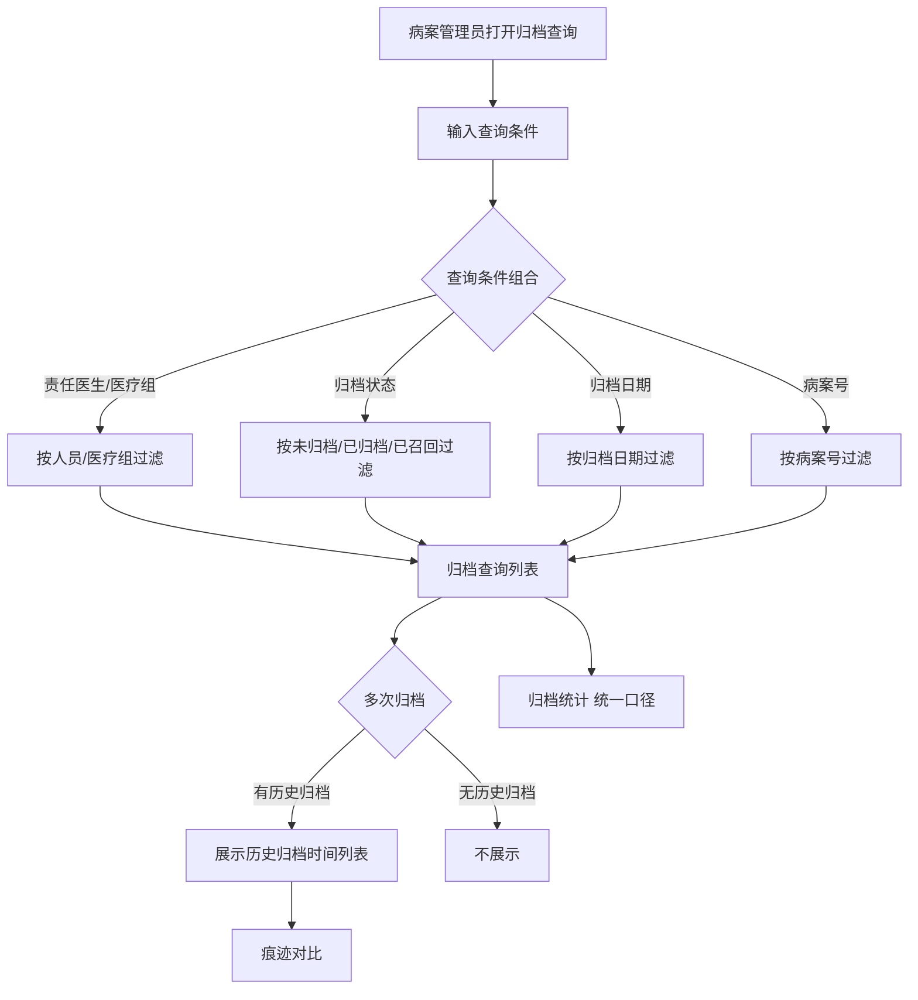
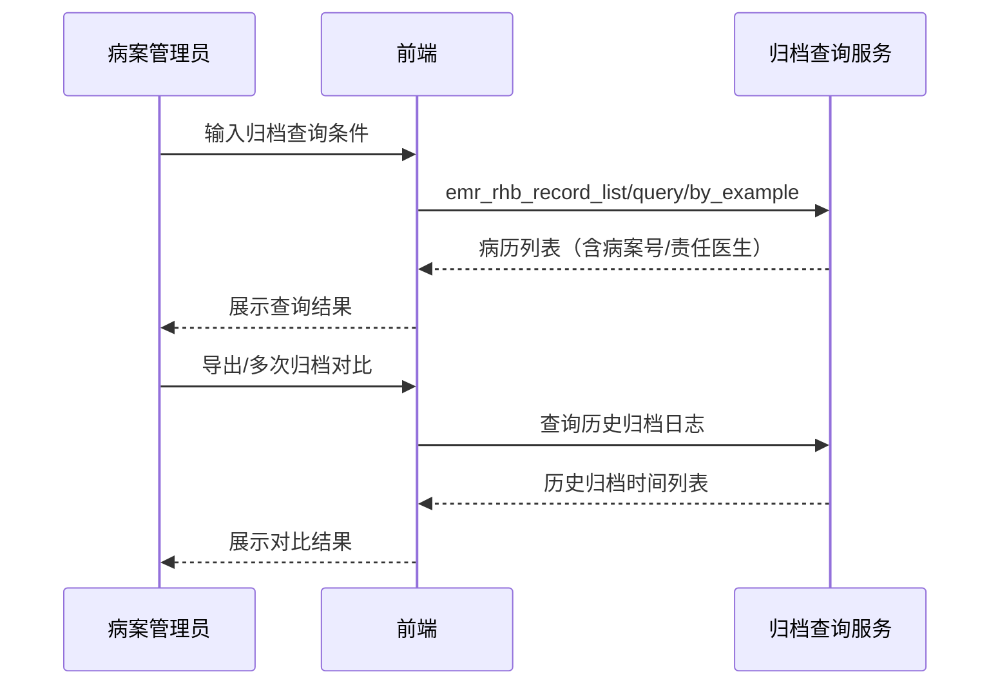

# BLGL-09-GDJY-008 归档查询与统计 - Spec

> **功能编号**：BLGL-09-GDJY-008
> **文档类型**：功能Spec（业务背景与设计）
> **文档版本**：V1.0
> **编写时间**：2026-08-15
> **编写人**：RACC

---

## 文档索引

#### 章节索引

**Spec（研发视角）**

| 章节号 | 章节名称 | 内容说明 |
|--------|---------|---------|
| 1、 | 文档概述 | 文档目的、文档范围、术语定义、阅读指南、参考文档 |
| 2、 | 功能背景与定位 | 功能背景、功能定位、目标用户、核心价值 |
| 3、 | 业务流程设计 | 主流程/异常流程/边界流程（Given/When/Then） |
| 4、 | 数据模型设计 | 核心数据结构、状态定义、系统参数定义 |
| 5、 | 接口契约设计 | API列表、接口详细设计、错误码定义 |
| 6、 | 技术方案设计 | 页面路径、技术栈、关键技术点、部署方案 |
| 7、 | 测试用例预设计 | 功能/边界/异常/性能测试用例 |
| 8、 | 非功能性要求 | 性能、安全、可用性、兼容性 |
| 9、 | 依赖与风险 | 外部依赖、风险项 |
| 10、 | 附录 | 流程图、时序图、参考文档 |

**PM-Spec（业务视角）**

| 章节号 | 章节名称 | 内容说明 |
|--------|---------|---------|
| 一 | 目标 | 功能定位与核心价值 |
| 二 | 约束 | 业务/技术/非功能性约束 |
| 三 | 验收标准 | 验收条件与验证方法 |
| 四 | 排除范围 | 本次不做项与明确边界 |
| 五 | 关键决策记录 | 方案决策与选型理由 |
| 六 | 优先级 | 优先级定义 |
| 七 | 关联文档 | 关联文档索引 |
| 附录 | 填写检查清单 | 质量检查 |

**Analyst-Spec（产品视角）**

| 章节号 | 章节名称 | 内容说明 |
|--------|---------|---------|
| 一 | 功能编号体系 | 功能编号与层级结构 |
| 二 | 核心业务流程 | 核心业务流程与时序 |
| 三 | 功能规格说明 | 详细功能规格与验收标准 |
| 四 | 排除范围 | 排除范围 |
| 五 | 业务规则清单 | 业务规则清单 |
| 六 | 关联文档 | 关联文档索引 |
| 七 | 待确认问题清单 | 待确认问题汇总 |
| - | 填写检查清单 | 质量检查 |

#### 版本历史

| 版本 | 日期 | 变更说明 | 编写人 |
|------|------|---------|--------|
| V1.0 | 2026-08-15 | 初始版本 | RACC |

#### 关联文档索引

| 序号 | 文档名称 | 文档类型 | 版本 | 位置 |
|------|---------|---------|------|------|
| 1 | BLGL-09-GDJY 归档借阅功能点Spec.md | 功能点Spec（模块级） | V1.0 | 上级目录 |
| 2 | BLGL-09-GDJY-008_归档查询与统计-Spec.md | 功能Spec（业务背景与设计）（本文档） | V1.0 | 本目录 |
| 3 | BLGL-09-GDJY-008_归档查询与统计_Analyst-spec.md | Analyst-Spec（分析规格） | V1.0 | 本目录 |
| 4 | BLGL-09-GDJY-008_归档查询与统计_PM-spec.md | PM-Spec（需求规格） | V0.1 | 本目录 |

---

## 1、文档概述

### 1.1、文档目的

本文档旨在明确"归档查询与统计"功能（BLGL-09-GDJY-008）的业务背景与设计方案，为需求分析、研发实现、测试验收及评审提供统一的业务上下文、设计口径与决策依据。

**具体目的包括**：

1. 梳理归档查询与统计功能的业务由来与历史需求演进脉络，说明"为什么要做"；
2. 明确功能的定位边界、目标用户与核心价值，回答"做成什么"；
3. 描述功能的业务流程、数据模型、接口契约与技术方案，回答"怎么做"；
4. 预设计测试用例并明确非功能性要求、依赖与风险，为研发与验收提供依据；
5. 作为 Analyst-Spec 的业务前提与设计输入，保证各层文档业务口径一致。

### 1.2、文档范围

#### 1.2.1 纳入范围

本文档覆盖归档查询与统计的完整业务背景与设计，包括：

- 归档查询：归档查询/手动归档/召回查询/召回审核菜单查询条件与列表字段
- 归档查询扩展：病案号字段、归档日期/归档时间/超时时间、医技报告/医嘱信息
- 归档统计：统一口径（出院超过3天去掉节假日）、患者和住院大夫统计
- 多次归档对比：病历数据导出、多次归档对比和上一次归档
- 病案首页归档纳入：病案首页的归档纳入病历归档流程
- 归档导出：归档查询增加归档日期查询条件及导出功能

#### 1.2.2 排除范围

本文档不涉及以下内容（详见其他功能点或模块）：

- 病历自动归档/手动归档 —— BLGL-09-GDJY-001/-002
- 病历撤销归档 —— BLGL-09-GDJY-003
- 病历召回申请/召回审核 —— BLGL-09-GDJY-004/-005
- 病历借阅流程 —— BLGL-09-GDJY-006
- 三方病案系统对接 —— BLGL-09-GDJY-007
- 归档校验与提醒 —— BLGL-09-GDJY-009

### 1.3、术语定义

| 术语 | 定义 |
|------|------|
| 归档查询 | 日常管理-病历归档下的归档查询菜单，查询已归档/未归档/已召回病历 |
| 归档统计 | 病历归档统计菜单，按科室和出区日期统计归档数量与归档率 |
| 应归档时间 | 取应自动归档的时间 |
| 超时时间 | 实际归档时间＞应归档时间时的时间差 |
| 痕迹对比 | 存在历史归档日志时，在当前病历上展示选择的归档日志时间后的痕迹 |

### 1.4、阅读指南

- **章节关系**：第1~2章为业务全貌，第3~10章为设计实现层。与 Analyst-Spec、PM-Spec 互相引用保持一致。
- **读者对象**：产品经理/需求分析师读第1~2章；研发读第3~6、9~10章；测试读第3、7~8章；评审人员核对各层一致性。

### 1.5、参考文档

| 序号 | 文档名称 | 版本/日期 |
|------|---------|----------|
| 1 | 【历史需求】住院病历的历史需求.xlsx | - |
| 2 | BLGL-09-GDJY-008_归档查询与统计_PM-spec.md | V0.1 |
| 3 | BLGL-09-GDJY-008_归档查询与统计_Analyst-spec.md | V1.0 |
| 4 | BLGL-09-GDJY 归档借阅功能点Spec.md | V1.0 |

---

## 2、功能背景与定位

### 2.1 功能背景

归档查询与统计是归档借阅模块的检索/分析层，需满足：

- **现状痛点**：归档查询/手动归档/召回查询等菜单查询条件不统一，缺少责任医生/医疗组/病案号等条件；归档统计口径不统一，缺少归档日期筛选
- **管理要求**：病案室老师需要将归档记录按照医疗组统计；避免归档后内容与召回后内容出现差异，需导出原始资料并支持对比
- **历史需求演进**：归档页面新增查询条件→ 增加医疗组属性→ 病案号字段（7）→ 归档统计统一口径（2）→ 归档日期查询及导出（5）

### 2.2 功能定位

"归档查询与统计"是 WiNEX 病历管理-归档借阅的检索/分析层，定位为：

- **多条件检索**：归档查询多条件组合检索（责任医生/医疗组/病案号/归档状态/归档日期）
- **统计口径**：归档统计统一口径（出院超过3天去掉节假日）、患者和住院大夫统计
- **追溯对比**：多次归档对比和上一次归档、痕迹对比

### 2.3 目标用户

| 用户角色 | 主要使用场景 |
|---------|-------------|
| 病案室管理员 | 归档查询/归档统计/多次归档对比 |
| 住院医生 | 归档查询/手动归档/召回查询 |
| 质控人员 | 病历完整性审核界面 |

### 2.4 核心价值

| 价值维度 | 价值描述 |
|---------|---------|
| 检索高效 | 多条件组合检索（责任医生/医疗组/病案号/归档日期） |
| 统计准确 | 归档统计统一口径，出院超过3天去掉节假日 |
| 追溯合规 | 多次归档对比、导出原始资料 |

---

## 3、业务流程设计（Given/When/Then）

### 3.1 主流程

**Scenario 1: 归档查询多条件检索**

```gherkin
Given:
  - 病案室管理员打开归档查询界面

When:
  - 输入查询条件（关键词/科室/病区/医疗组/归档状态/责任医生/归档日期）

Then:
  - 按条件组合检索归档病历
  - 列表展示病案号、责任医生、医疗组等字段
  - 表格字段支持勾选显示和排序
```

### 3.2 异常流程

**Scenario 2: 业务异常——多次归档后内容差异**

```gherkin
Given:
  - 患者病历经历过召回后再归档的多次归档情况

When:
  - 查看病历

Then:
  - 为避免归档后内容与召回后内容出现差异，需导出原始资料
  - 查看界面右侧支持查看之前归档时的病历并支持对比变化
```

**Scenario 3: 数据异常——归档查询医嘱单为空**

```gherkin
Given:
  - 归档查询界面

When:
  - 点击患者查看医嘱单

Then:
  - 医嘱单是空的（问题）
  - 需排查归档数据关联
```

**Scenario 4: 系统异常——归档统计口径不一致**

```gherkin
Given:
  - 归档统计菜单

When:
  - 统计归档数据

Then:
  - 口径不统一（问题）
  - 需统一口径（出院超过3天去掉节假日）
```

### 3.3 边界流程

**Scenario 5: 边界——归档时间/超时时间**

```gherkin
Given:
  - 归档查询界面

When:
  - 启用应归档时间/归档时间/超时时间字段

Then:
  - 应归档时间取应自动归档的时间
  - 归档时间取患者实际归档时间（多次归档取最新一次）
  - 超时时间：归档时间≤应归档时间则空，＞则取时间差
  - 超时时间显示格式按小时/天分级
```

**Scenario 6: 边界——病案首页归档纳入**

```gherkin
Given:
  - 有纸化模式下病案首页

When:
  - 病历归档和召回纳入病案首页

Then:
  - 召回申请界面新增病案首页监控类型
  - 病案首页已归档则不管什么状态都不允许修改
  - 归档查询-病历簿支持查看病案首页的病历
```

---

## 4、数据模型设计

### 4.1 核心数据结构

#### 4.1.1 核心保存请求

| 字段名 | 类型 | 必填 | 备注 |
|--------|------|------|------|
| dutyDoctIds | Array | 否 | 责任医生ID集合 |
| statusCodes | Array | 否 | 归档状态集合（399058143未归档/399058142已归档/399291265已召回） |
| caseNo | String | 否 | 病案号 |
| 归档日期 | Date | 否 | 归档查询新增条件 |

> ⏳ 待确认：归档查询接口完整入参/出参以代码扫描和 API 契约为准。

#### 4.1.2 核心表/实体

| 表/实体 | 关键字段 | 说明 |
|---------|---------|------|
| INPATIENT_EMR_ARCHIVE（InpatientEmrArchivePO） | inpatEmrSetFilingId(INP_EMR_ARCHIVE_ID)、inpatRhbRecordId(INP_RHB_RECORD_ID)、statusCode(INP_EMR_ARCHIVE_STATUS)、inpatEmrSetFilingAt(INP_EMR_ARCHIVED_AT)、inpatEmrSetFilingTypeCode(INP_EMR_ARCHIVE_TYPE_CODE)、deptId、cancelArchiveFlag(CANCEL_ARCHIVE_FLAG) | 住院病历归档表（归档查询数据源，代码） |
| INP_EMR_ARCHIVE_STATISTICS（InpEmrArchiveStatisticsPO） | filingCollectId、deptId、planFilingCollectNum(PLAN_ARCHIVE_EMR_COUNT)、manulFilingCollectNum(MAN_ARCHIVE_EMR_COUNT)、autoFilingCollectNum(AUTO_ARCHIVE_EMR_COUNT)、recallFilingCollectNum(RECALL_ARCHIVE_EMR_COUNT)、filingCollectDate(INP_EMR_ARCH_STAT_DATE)、dischargedFromWardDate(WARD_DISCHARGED_DATE) | 归档统计表（归档/召回率统计源，代码） |

### 4.2 状态定义

| 状态码 | 状态名称 | 说明 |
|--------|---------|------|
| 399058142 | 已归档 | 病历归档状态（FilingStatusConstant.ARCHIVE，代码） |
| 399058143 | 未归档 | 病历归档状态（FilingStatusConstant.UNARCHIVE，代码） |
| 399291265 | 已召回 | 病历归档状态（FilingStatusConstant.RECALLED，代码） |

### 4.3 系统参数定义

| ⏳ 待确认 | 归档查询与统计无独立参数 | 依赖归档状态/统计口径 |

---

## 5、接口契约设计

### 5.1 API列表

| 序号 | API名称（代码函数） | 路径 | 方法 | 说明 |
|:----:|---------|------|:----:|------|
| 1 | 查询病历簿列表信息 | /api/v1/app_record_inpatient/emr_inpatient/emr_rhb_record_list/query/by_example | POST | 归档查询（入参 InpatEmrRHBRecordListQueryByExampleInputAO，含 dutyDoctIds/statusCodes，出参 List<InpatEmrRHBRecordListQueryOutputVO> 含 dutyDoctName/caseNo） |
| 2 | 导出归档查询列表 Excel | /api/v1/app_record_inpatient/emr_inpatient/emr_rhb_record_list/export/by_example | POST | 归档查询导出 |
| 3 | 查询病历归档统计信息 | /api/v1/app_record_inpatient/emr_inpatient/emr_filing_collect/query/by_example | POST | 归档统计（入参 InpatientEmrFilingCollectQueryInputAO，出参 List<InpatientEmrFilingCollectQueryOutputVO>） |
| 4 | 导出病历归档统计信息 | /api/v1/app_record_inpatient/emr_inpatient/emr_filing_collect/export/by_example | POST | 归档统计导出 |
| 5 | 查询归档列表数据 | /api/v1/app_record_inpatient/inpatient_emr_archive/query/by_example | POST | 归档列表（入参 InpatientEmrArchiveQueryInputAO，出参 List<InpatientEmrArchiveOutputVO>） |
| 6 | 查询归档区间召回修改明细 | /api/v1/app_record_inpatient/archive_between_modified_detail/query | POST | 多次归档对比（入参 InpEmrArchiveModifiedInputAO，出参 List<InpatientEmrSetQueryVO>） |

### 5.2 接口详细设计

#### 5.2.1 查询病历簿列表信息（emr_rhb_record_list/query/by_example）

**请求参数**:
```json
{
  "keyword": "张三",
  "dutyDoctIds": ["1001", "1002"],
  "statusCodes": ["399058142"],
  "archiveDateStart": "2026-08-01",
  "archiveDateEnd": "2026-08-15",
  "caseNo": "GH20260101",
  "pageNo": 1,
  "pageSize": 20
}
```

**返回值（成功）**:
```json
{
  "success": true,
  "data": [
    {
      "inpRhbRecordId": "12345",
      "caseNo": "GH20260101",
      "dutyDoctName": "张三",
      "statusCode": "399058142",
      "archiveTime": "2026-08-14 10:00:00"
    }
  ]
}
```

> ⏳ 待确认：归档查询接口字段以代码扫描（InpatEmrRHBRecordListQueryOutputVO）和 API 契约为准。

**返回值（失败）**:
```json
{
  "success": false,
  "message": "查询病历列表失败",
  "data": null
}
```

### 5.3 错误码定义

| 错误码 | 错误信息 | 处理方式 |
|--------|---------|---------|
| ⏳ 待确认 | 查询归档病历失败 | 提示病案管理员重新查询 |

---

## 6、技术方案设计

### 6.1 页面路径

- **页面路径**: 住院医生站→日常管理→病历归档→归档查询/手动归档/召回查询/召回审核（src/router/EmrArchiving.js clinicalnoteQuery/manualArchive/recallArchive/recallApplyArchive）；病历质控系统→病历管理→归档统计（autoArchive）
- **前端逻辑**: 归档查询多条件检索、表格字段勾选显示和排序
- **后端模块**: winning-emr-ipt-archive/winning-emr-ipt-archive-provider/controller/InpEmrArchiveController.java（查询病历簿列表、导出归档查询列表、查询/导出归档统计、查询归档区间召回修改明细）
- **前端 API**: winning-webui-inpatient-clinicalnote-pango/src/pages/ClinicalnoteArchiveManage/api/index.js（apiQueryInpatClinicalnoteRecord → emr_rhb_record_list/query/by_example、apiQueryInpatClinicalnoteRecordExport → emr_rhb_record_list/export/by_example、apiInpatFilingCollectQu/Ex → emr_filing_collect/query|export/by_example）

### 6.2 技术栈

| 类别 | 技术 | 版本 |
|------|------|------|
| 前端框架 | Vue | 2.6.14 |
| 前端UI | element-ui | 2.13.0 |
| 后端框架 | Spring Boot（Java 17）+ JPA/Hibernate | - |
| RPC | winning-akso-rpc-rest | - |

### 6.3 关键技术点

- 归档查询接口入参新增 dutyDoctIds（责任医生ID集合）、statusCodes（归档状态集合）、出参 dutyDoctName、caseNo
- 归档统计统一口径：出院超过 3 天（出院医嘱）去掉节假日
- 多次归档对比：查看界面右侧展示前几次归档时间列表，支持痕迹对比

### 6.4 部署方案

⏳ 待确认：部署方案未在资料区中找到。

---

## 7、测试用例预设计

### 7.1 功能测试

| 用例编号 | 测试场景 | Given | When | Then |
|---------|---------|-------|------|------|
| TC-001 | 归档查询多条件 | 归档查询界面 | 输入责任医生/归档状态/归档日期 | 按条件组合检索 |
| TC-002 | 归档查询接口 | 归档查询界面 | 调用 emr_rhb_record_list/query/by_example | 返回病历簿列表（含病案号/责任医生） |

### 7.2 边界测试

| 用例编号 | 测试场景 | Given | When | Then |
|---------|---------|-------|------|------|
| TC-003 | 超时时间格式 | 归档时间＞应归档时间 | 展示超时时间 | 按小时/天分级格式显示 |
| TC-004 | 归档统计接口 | 归档统计界面 | 调用 emr_filing_collect/query/by_example | 返回归档统计（计划/手动/自动/召回数） |

### 7.3 异常测试

| 用例编号 | 测试场景 | Given | When | Then |
|---------|---------|-------|------|------|
| TC-005 | 多次归档对比 | 病历有多次归档 | 查看病历 | 展示历史归档时间列表支持对比 |
| TC-006 | 归档查询导出 | 归档查询界面 | 调用 emr_rhb_record_list/export/by_example | 导出 Excel 成功 |

### 7.4 性能测试

| 用例编号 | 测试场景 | 指标 |
|---------|---------|------|
| TC-007 | 归档查询响应 | ⏳ 待确认：性能指标未在资料区中找到 |
| TC-008 | 归档统计查询响应 | ⏳ 待确认：性能指标未在资料区中找到 |

---

## 8、非功能性要求

### 8.1 性能要求

| 指标 | 要求 |
|------|------|
| 归档查询响应时间 | ⏳ 待确认 |

### 8.2 安全要求

| 要求 | 说明 |
|------|------|
| 查询权限 | 归档查询按科室/全院范围控制 |

**医疗行业特殊要求**

| 要求 | 说明 |
|------|------|
| 数据追溯 | 多次归档对比、导出原始资料避免内容差异 |

### 8.3 可用性要求

| 指标 | 要求值 |
|------|--------|
| 可用性 | ⏳ 待确认 |

### 8.4 兼容性要求

| 类型 | 要求 |
|------|------|
| 查询条件 | 关键词/科室/病区/医疗组/归档状态/责任医生/归档日期兼容 |
| 病案首页 | 病案首页归档纳入病历归档流程 |

---

## 9、依赖与风险

### 9.1 外部依赖

| 依赖项 | 说明 |
|--------|------|
| 病案系统 | 病案号数据 |
| 患者费用接口 | 归档时欠费提醒 |

### 9.2 风险项

| 风险项 | 等级 | 说明 | 应对方案 |
|--------|------|------|---------|
| 统计口径 | 中 | 归档统计口径不统一 | 统一口径（出院超3天去掉节假日） |
| 数据关联 | 中 | 归档查询医嘱单为空 | 排查数据关联 |

---

## 10、附录

### 10.1 流程图



### 10.2 时序图



### 10.3 参考文档

- BLGL-09-GDJY 归档借阅功能点Spec.md（V1.0，第5章 BLGL-09-GDJY-008 行）
- 关联Spec: BLGL-09-GDJY-008_归档查询与统计_PM-spec.md、BLGL-09-GDJY-008_归档查询与统计_Analyst-spec.md

---

## 填写检查清单

| 序号 | 检查项 | 是否完成 |
|:----:|--------|:--------:|
| 1 | 章节索引与正文章节一致 | ✅ |
| 2 | 版本历史记录完整 | ✅ |
| 3 | 关联文档索引已登记全部Spec | ✅ |
| 4 | 文档目的明确回答"为什么做/做成什么/怎么做" | ✅ |
| 5 | 纳入范围/排除范围清晰 | ✅ |
| 6 | 术语定义覆盖关键概念，从资料区可溯源 | ✅ |
| 7 | 参考文档已登记 | ✅ |
| 8 | 功能背景基于法规/规范/需求来源组织 | ✅ |
| 9 | 功能定位体现业务价值（3~5个定位点） | ✅ |
| 10 | 目标用户角色覆盖完整，在需求原文中有出处 | ✅ |
| 11 | 核心价值可陈述，与 Phase 1 口径一致 | ✅ |
| 12 | 业务流程：主流程≥1、异常≥3、边界≥2，Given/When/Then 具体 | ✅ |
| 13 | 数据模型：字段/表/状态/参数可溯源 | ✅ |
| 14 | 接口契约：API列表+详细设计+错误码齐全或标记待确认 | ✅ |
| 15 | 技术方案：页面路径/技术栈/关键点/部署方案或标记待确认 | ✅ |
| 16 | 测试用例：功能/边界/异常/性能覆盖 | ✅ |
| 17 | 非功能性要求：性能/安全/可用性/兼容性指标可量化或标记待确认 | ✅ |
| 18 | 依赖与风险：外部依赖登记完整 | ✅ |
| 19 | 附录：流程图/时序图与正文流程一致 | ✅ |
| 20 | 全文无占位符 `< >` 残留 | ✅ |
| 21 | 全文陈述可溯源至资料区 | ✅ |
| 22 | 人工审核确认完成 | ⏳ 待确认 |

---

**文档状态**：⬜ 待审核
**维护责任**：RACC
**下次更新**：根据评审反馈优化
