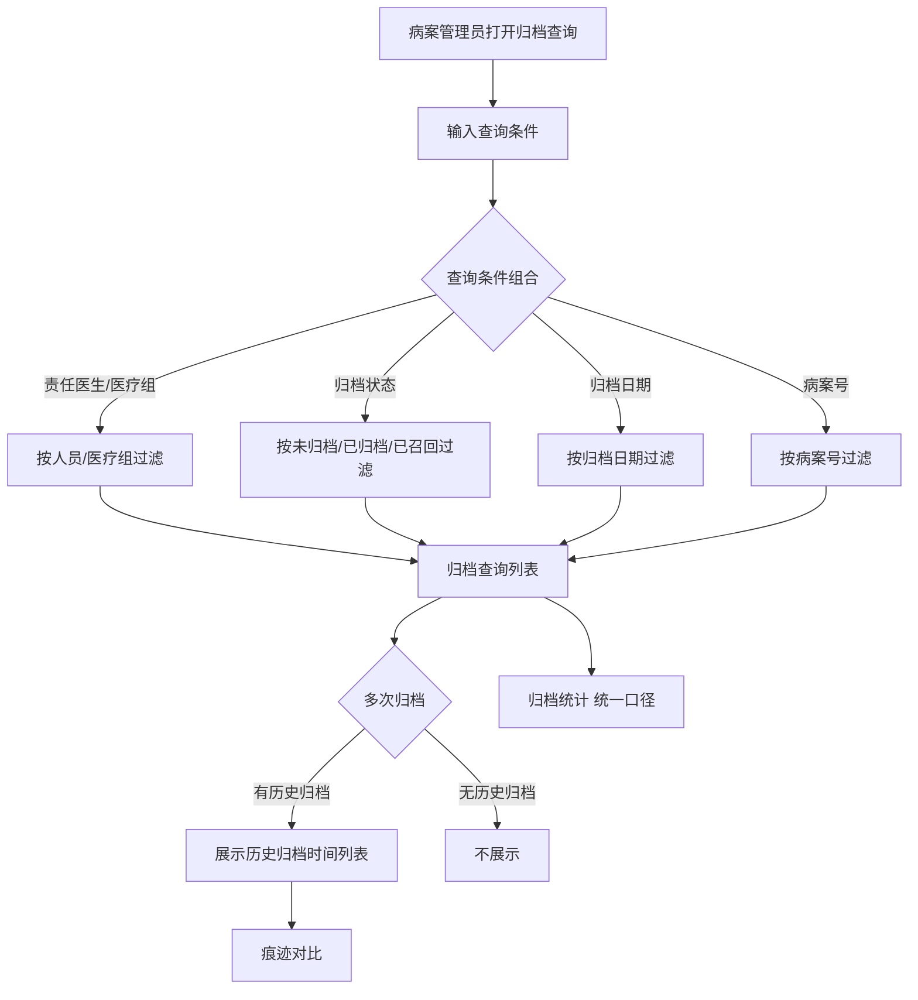
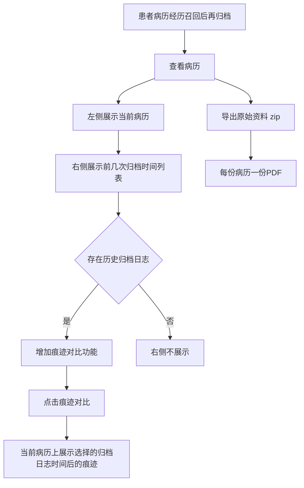

# BLGL-09-GDJY-008 归档查询与统计 _ Analyst - Spec

> **需求编号**：BLGL-09-GDJY-008
> **父需求**：BLGL-09-GDJY
> **关联PM Spec**：BLGL-09-GDJY-008_归档查询与统计_PM-spec.md
> **Spec版本**：V1.0
> **编写时间**：2026-08-15
> **编写人**：需求分析师

---

## 一、功能编号体系

### 1.1 功能层级结构

```
BLGL-09-GDJY-008-001: 归档查询
  ├─ BLGL-09-GDJY-008-001-01: 多条件检索（责任医生/医疗组/归档状态/归档日期）
  ├─ BLGL-09-GDJY-008-001-02: 病案号字段
  ├─ BLGL-09-GDJY-008-001-03: 应归档/归档/超时时间
  └─ BLGL-09-GDJY-008-001-04: 表格字段勾选显示/排序

BLGL-09-GDJY-008-002: 归档统计
  ├─ BLGL-09-GDJY-008-002-01: 统一口径（出院超3天去掉节假日）
  ├─ BLGL-09-GDJY-008-002-02: 患者/住院大夫统计
  └─ BLGL-09-GDJY-008-002-03: 归档日期查询条件

BLGL-09-GDJY-008-003: 多次归档对比
  ├─ BLGL-09-GDJY-008-003-01: 历史归档时间列表
  ├─ BLGL-09-GDJY-008-003-02: 痕迹对比
  └─ BLGL-09-GDJY-008-003-03: 导出原始资料

BLGL-09-GDJY-008-004: 病案首页归档纳入
  └─ BLGL-09-GDJY-008-004-01: 病案首页归档纳入病历归档流程
```

### 1.2 功能编号表

| REQ-ID | 功能名称 | 类型 | 优先级 | 说明 |
|--------|---------|------|--------|------|
| BLGL-09-GDJY-008-001 | 归档查询 | 功能 | P0 | 归档查询多条件 |
| BLGL-09-GDJY-008-001-01 | 多条件检索 | 子功能 | P0 | 责任医生/医疗组/归档状态/归档日期 |
| BLGL-09-GDJY-008-001-02 | 病案号字段 | 子功能 | P0 | CASE_NO 字段 |
| BLGL-09-GDJY-008-001-03 | 应归档/归档/超时时间 | 子功能 | P1 | 超时时间分级格式 |
| BLGL-09-GDJY-008-001-04 | 表格字段勾选显示/排序 | 子功能 | P1 | 字段可勾选显示和排序 |
| BLGL-09-GDJY-008-002 | 归档统计 | 功能 | P1 | 归档统计 |
| BLGL-09-GDJY-008-002-01 | 统一口径 | 子功能 | P1 | 出院超3天去掉节假日 |
| BLGL-09-GDJY-008-002-02 | 患者/住院大夫统计 | 子功能 | P1 | 增加统计项 |
| BLGL-09-GDJY-008-002-03 | 归档日期查询条件 | 子功能 | P1 | 归档查询/统计新增 |
| BLGL-09-GDJY-008-003 | 多次归档对比 | 功能 | P1 | 多次归档对比 |
| BLGL-09-GDJY-008-003-01 | 历史归档时间列表 | 子功能 | P1 | 右侧展示历史归档时间 |
| BLGL-09-GDJY-008-003-02 | 痕迹对比 | 子功能 | P1 | 展示选择的归档日志时间后的痕迹 |
| BLGL-09-GDJY-008-003-03 | 导出原始资料 | 子功能 | P1 | 导出 PDF zip 压缩包 |
| BLGL-09-GDJY-008-004 | 病案首页归档纳入 | 功能 | P1 | 病案首页归档纳入 |
| BLGL-09-GDJY-008-004-01 | 病案首页归档纳入病历归档流程 | 子功能 | P1 | 已归档首页不允许修改 |

---

## 二、核心业务流程

### 2.1 归档查询主流程



### 2.2 多次归档对比流程



---

## 三、功能规格说明

### BLGL-09-GDJY-008-001: 归档查询

#### 3.1.1 功能概述

手动归档、归档查询页面表格新增字段责任医生，所有表格字段支持勾选显示和排序；新增查询条件责任医生（支持多选）、归档状态（已归档、未归档、已召回，支持多选，默认为空）。日常管理-病历归档下的归档查询、手动归档、召回查询、召回审核菜单下所有查询条件增加"医疗组"选项。归档查询列表新增病案号列（INPATIENT_RHB_RECORD 的 CASE_NO 字段）。归档查询界面增加应归档时间、归档时间、超时时间列。

#### 3.1.2 用户角色

| 角色 | 使用场景 | 权限要求 | 操作频率 |
|------|---------|---------|---------|
| 病案室管理员 | 归档查询 | 查看权限 | 高频 |
| 住院医生 | 归档查询/手动归档/召回查询 | 病历书写权限 | 中频 |

#### 3.1.3 业务流程（Given/When/Then）

**Scenario 1: 归档查询多条件（主流程）**

```gherkin
Given:
  - 病案管理员打开归档查询界面

When:
  - 输入责任医生/归档状态/医疗组/归档日期/病案号条件

Then:
  - 按条件组合检索归档病历
  - 列表展示病案号、责任医生、医疗组字段
  - 表格字段支持勾选显示和排序
```

**Scenario 2: 超时时间**

```gherkin
Given:
  - 归档查询界面启用应归档/归档/超时时间字段

When:
  - 展示归档时间

Then:
  - 应归档时间取应自动归档的时间
  - 归档时间取实际归档时间（多次归档取最新一次）
  - 超时时间：归档时间≤应归档时间则空；＞则取时间差
  - 超时时间显示格式：<1小时显示XX分钟；1-24小时显示XX小时XX分钟；>1天显示XX天XX小时
```

**Scenario 3: 数据异常——医嘱单为空**

```gherkin
Given:
  - 归档查询界面

When:
  - 点击患者查看医嘱单

Then:
  - 医嘱单是空的（问题）
  - 需排查归档数据关联
```

#### 3.1.4 数据字段定义

| 字段名 | 类型 | 必填 | 默认值 | 取值范围 | 说明 | 概念ID |
|--------|------|------|--------|---------|------|--------|
| dutyDoctIds | Array | 否 | - | 责任医生ID集合 | 归档查询入参 | ⏳ 待确认 |
| statusCodes | Array | 否 | 空 | 399058143/399058142/399291265 | 归档状态集合 | ⏳ 待确认 |
| caseNo | String | 否 | - | - | 病案号（INPATIENT_RHB_RECORD.CASE_NO） | ⏳ 待确认 |
| 应归档时间 | Date | 否 | - | - | 应自动归档时间 | ⏳ 待确认 |
| 归档时间 | Date | 否 | - | - | 实际归档时间 | ⏳ 待确认 |
| 超时时间 | String | 否 | - | 分钟/小时/天 | 时间差格式 | ⏳ 待确认 |
| inpatEmrSetFilingId | Long | 否 | - | - | 归档表主键（INP_EMR_ARCHIVE_ID，代码 InpatientEmrArchivePO） | ⏳ 待确认 |
| inpatEmrSetFilingAt | Date | 否 | - | - | 归档时间（INP_EMR_ARCHIVED_AT，代码） | ⏳ 待确认 |
| inpatEmrSetFilingTypeCode | Long | 否 | - | 自动/手动归档类型 | 归档类型编码（INP_EMR_ARCHIVE_TYPE_CODE，代码） | ⏳ 待确认 |
| planFilingCollectNum | Integer | 否 | - | - | 计划归档数（PLAN_ARCHIVE_EMR_COUNT，代码 InpEmrArchiveStatisticsPO） | ⏳ 待确认 |
| autoFilingCollectNum | Integer | 否 | - | - | 自动归档数（AUTO_ARCHIVE_EMR_COUNT，代码） | ⏳ 待确认 |
| manulFilingCollectNum | Integer | 否 | - | - | 手动归档数（MAN_ARCHIVE_EMR_COUNT，代码） | ⏳ 待确认 |
| recallFilingCollectNum | Integer | 否 | - | - | 召回归档数（RECALL_ARCHIVE_EMR_COUNT，代码） | ⏳ 待确认 |

#### 3.1.5 验收标准

| AC编号 | 验收标准 | 对应REQ-ID | 验证方法 | 验证场景 |
|--------|---------|-----------|---------|---------|
| AC-001 | 归档查询多条件组合检索生效 | BLGL-09-GDJY-008-001 | 功能测试 | Scenario 1 |
| AC-002 | 超时时间按格式分级显示 | BLGL-09-GDJY-008-001 | 功能测试 | Scenario 2 |

---

### BLGL-09-GDJY-008-002: 归档统计

#### 3.2.1 功能概述

归档统计菜单统一口径：出院超过 3 天（出院医嘱）去掉节假日。归档统计要求增加患者和住院大夫名字统计。归档查询与统计增加归档日期查询条件及导出功能。

#### 3.2.2 用户角色

| 角色 | 使用场景 | 权限要求 | 操作频率 |
|------|---------|---------|---------|
| 病案室管理员 | 归档统计 | 查看权限 | 中频 |

#### 3.2.3 业务流程（Given/When/Then）

**Scenario 1: 归档统计统一口径（主流程）**

```gherkin
Given:
  - 病案管理员打开归档统计菜单

When:
  - 统计归档数据

Then:
  - 统一口径：出院超过 3 天（出院医嘱）去掉节假日
  - 增加患者和住院大夫名字统计
  - 支持归档日期查询条件
```

#### 3.2.4 数据字段定义

| ⏳ 待确认 | 归档统计无独立业务字段 | 依赖归档状态/统计口径 |

#### 3.2.5 验收标准

| AC编号 | 验收标准 | 对应REQ-ID | 验证方法 | 验证场景 |
|--------|---------|-----------|---------|---------|
| AC-003 | 归档统计统一口径（出院超3天去掉节假日），增加患者/住院大夫统计 | BLGL-09-GDJY-008-002 | 功能测试 | Scenario 1 |

---

### BLGL-09-GDJY-008-003: 多次归档对比

#### 3.3.1 功能概述

为避免归档后的内容与召回后内容出现差异，导出原始资料。全院查询界面查询全部患者并支持查看住院病历、导出住院病历 PDF（zip 压缩包，每份病历一份 PDF）。若患者病历经历过召回后再归档的多次归档情况，查看界面右侧支持查看之前归档时的病历并支持对比变化：选择一份病历，左侧展示当前病历，右侧展示前几次归档时时间列表；存在历史归档日志时增加【痕迹对比】功能，点击痕迹对比在当前病历上展示选择的归档日志时间后的痕迹。

#### 3.3.2 用户角色

| 角色 | 使用场景 | 权限要求 | 操作频率 |
|------|---------|---------|---------|
| 病案室管理员 | 多次归档对比 | 查看权限 | 中频 |

#### 3.3.3 业务流程（Given/When/Then）

**Scenario 1: 多次归档对比（主流程）**

```gherkin
Given:
  - 患者病历经历过召回后再归档的多次归档情况

When:
  - 查看病历

Then:
  - 左侧展示当前病历
  - 右侧展示前几次归档时时间列表
  - 存在历史归档日志时增加【痕迹对比】功能
  - 点击痕迹对比在当前病历上展示选择的归档日志时间后的痕迹
```

**Scenario 2: 导出原始资料**

```gherkin
Given:
  - 全院查询界面

When:
  - 导出住院病历 PDF

Then:
  - 导出为一个 zip 压缩包
  - 每份病历为一份 PDF
  - 病程导出是一份 PDF
```

#### 3.3.4 数据字段定义

| ⏳ 待确认 | 多次归档对比无独立业务字段 | 依赖归档日志 |

#### 3.3.5 验收标准

| AC编号 | 验收标准 | 对应REQ-ID | 验证方法 | 验证场景 |
|--------|---------|-----------|---------|---------|
| AC-004 | 多次归档支持对比历史归档，痕迹对比展示修改痕迹 | BLGL-09-GDJY-008-003 | 功能测试 | Scenario 1 |
| AC-005 | 导出住院病历 PDF zip 压缩包 | BLGL-09-GDJY-008-003 | 功能测试 | Scenario 2 |

---

### BLGL-09-GDJY-008-004: 病案首页归档纳入

#### 3.4.1 功能概述

有纸化模式下，病案首页按照病历的归档流程。病历归档和召回纳入病案首页：召回申请界面新增病案首页的监控类型，在病案首页的监控类型下可以召回病案首页；病案首页中调用病历中的病案首页的归档状态，如果已归档，则病案首页不管是什么状态都不允许修改；提供接口供病案查阅；归档查询-病历簿支持查看病案首页的病历。

#### 3.4.2 用户角色

| 角色 | 使用场景 | 权限要求 | 操作频率 |
|------|---------|---------|---------|
| 病案室管理员 | 病案首页归档查询 | 查看权限 | 中频 |

#### 3.4.3 业务流程（Given/When/Then）

**Scenario 1: 病案首页归档纳入（主流程）**

```gherkin
Given:
  - 有纸化模式下病案首页

When:
  - 病历归档和召回纳入病案首页

Then:
  - 召回申请界面新增病案首页监控类型
  - 病案首页已归档则不管什么状态都不允许修改
  - 归档查询-病历簿支持查看病案首页的病历
```

#### 3.4.4 数据字段定义

| ⏳ 待确认 | 病案首页归档纳入无独立业务字段 | 依赖病案首页归档状态 |

#### 3.4.5 验收标准

| AC编号 | 验收标准 | 对应REQ-ID | 验证方法 | 验证场景 |
|--------|---------|-----------|---------|---------|
| AC-006 | 病案首页归档纳入病历归档流程，已归档首页不允许修改 | BLGL-09-GDJY-008-004 | 功能测试 | Scenario 1 |
| AC-007 | 归档查询接口 emr_rhb_record_list/query/by_example 返回病历簿列表含病案号/责任医生，归档统计接口 emr_filing_collect/query/by_example 返回计划/手动/自动/召回归档数 | BLGL-09-GDJY-008-001 | 接口测试 | Scenario 1 |

---

## 四、排除范围

本需求不包含以下功能项：

1. **病历自动归档/手动归档** —— BLGL-09-GDJY-001/-002
2. **病历撤销归档** —— BLGL-09-GDJY-003
3. **病历召回申请/召回审核** —— BLGL-09-GDJY-004/-005
4. **病历借阅流程** —— BLGL-09-GDJY-006
5. **三方病案系统对接** —— BLGL-09-GDJY-007
6. **归档校验与提醒** —— BLGL-09-GDJY-009

---

## 五、业务规则清单

| 规则ID | 规则名称 | 规则描述 | 来源 | 优先级 |
|--------|---------|---------|------|--------|
| BR-001 | 归档查询条件 | 手动归档/归档查询表格新增责任医生字段，字段支持勾选显示和排序；查询条件责任医生（多选）、归档状态（多选） |  | P0 |
| BR-002 | 医疗组查询 | 归档查询/手动归档/召回查询/召回审核菜单查询条件增加医疗组选项，列表增加医疗组列 |  | P0 |
| BR-003 | 病案号字段 | 归档查询列表新增病案号列（CASE_NO），位于住院号之后 | 7 | P0 |
| BR-004 | 统计口径 | 归档统计统一口径：出院超过3天（出院医嘱）去掉节假日 | 2 | P1 |
| BR-005 | 超时时间 | 归档时间≤应归档时间则超时为空；＞则取时间差，按小时/天分级格式显示 | 8 | P1 |
| BR-006 | 多次归档对比 | 多次归档时右侧展示历史归档时间列表，支持痕迹对比 |  | P1 |
| BR-007 | 病案首页归档 | 病案首页已归档则不允许修改，归档查询支持查看病案首页 |  | P1 |
| BR-008 | 归档查询接口 | 归档查询接口 emr_rhb_record_list/query/by_example 入参 dutyDoctIds/statusCodes，出参 caseNo/dutyDoctName；归档统计表 INP_EMR_ARCHIVE_STATISTICS（PLAN/MAN/AUTO/RECALL_ARCHIVE_EMR_COUNT） | 代码 | P0 |

---

## 六、关联文档

| 文档类型 | 文档路径 | 说明 |
|---------|---------|------|
| 功能点Spec（模块级） | 上级目录 BLGL-09-GDJY 归档借阅功能点Spec.md（V1.0） | 模块级功能点索引 |
| 功能Spec（业务背景与设计） | 本目录 BLGL-09-GDJY-008_归档查询与统计-Spec.md（V1.0） | 业务背景与目标 Spec |
| Analyst-Spec（分析规格） | 本目录 BLGL-09-GDJY-008_归档查询与统计_Analyst-spec.md（V1.0）（本文档） | 分析规格 |
| PM-Spec（需求规格） | 本目录 BLGL-09-GDJY-008_归档查询与统计_PM-spec.md（V0.1） | PM 产出的 Spec 文档 |
| data-model.md | 待产出 | 架构师产出的数据建模文档 |
| design.md | 待产出 | 架构师产出的技术方案文档 |
| api-contract.md | 待产出 | 开发经理产出的 API 契约文档 |

---

## 七、待确认问题清单

| 编号 | 问题描述 | 缺失信息 | 影响范围 | 建议补充方 |
|------|---------|---------|---------|-----------|
| Q-001 | 归档查询接口完整入参/出参（dutyDoctIds/statusCodes/caseNo） | API 契约 | -Spec 第5章 | 开发经理 |
| Q-002 | 归档统计口径的完整定义 | 需求分析原文缺失 | 3.2.3 | 需求分析师 |
| Q-003 | 多次归档对比的痕迹对比实现细节 | 需求分析原文 | 3.3.3 | 需求分析师 |
| Q-004 | 归档查询医嘱单为空（0）根因 | 需求分析原文缺失 | 3.1.3 | 开发经理 |
| Q-005 | 病案首页归档纳入的接口定义 | API 契约 | 3.4.3 | 开发经理 |
| Q-006 | 性能指标（归档查询响应时间） | 资料区无量化指标 | -Spec 第8章 | 产品经理 |

---

## 填写检查清单

| 序号 | 检查项 | 是否完成 |
|:----:|--------|:--------:|
| 1 | 功能编号带父子层级 | ✅ |
| 2 | 每个 REQ-ID 有功能概述和用户角色 | ✅ |
| 3 | 主流程至少 1 个 Given/When/Then 场景 | ✅ |
| 4 | 异常流程至少 3 个 Given/When/Then 场景 | ✅ |
| 5 | 边界流程至少 2 个 Given/When/Then 场景 | ✅ |
| 6 | 每个 Given/When/Then 内容具体，不模糊 | ✅ |
| 7 | 数据字段定义完整（字段名、类型、必填、说明、概念ID） | ✅ |
| 8 | 验收标准 AC 编号独立，可验证 | ✅ |
| 9 | 验收标准无"功能正常"等模糊表述 | ✅ |
| 10 | 排除范围明确列出 | ✅ |
| 11 | 业务规则清单列出所有规则，每条标注来源 | ✅ |
| 12 | 流程图使用 Mermaid 格式（≥2 个） | ✅ |
| 13 | 关联文档索引包含 Phase 1 功能点Spec | ✅ |
| 14 | 待确认问题清单汇总了全文所有 ⏳ 项 | ✅ |
| 15 | 全文无占位符 `< >` 残留 | ✅ |
| 16 | 全文陈述可溯源至资料区（S1~S10 溯源核查） | ✅ |
| 17 | 人工审核确认完成 | ⏳ 待确认 |

---

**文档状态**：⬜ 待审核
**维护责任**：需求分析师规范组
**下次更新**：根据评审反馈优化

---

## 版本历史

| 版本 | 日期 | 变更说明 | 编写人 |
|------|------|---------|--------|
| V1.0 | 2026-08-15 | 初始版本 | 需求分析师 |
