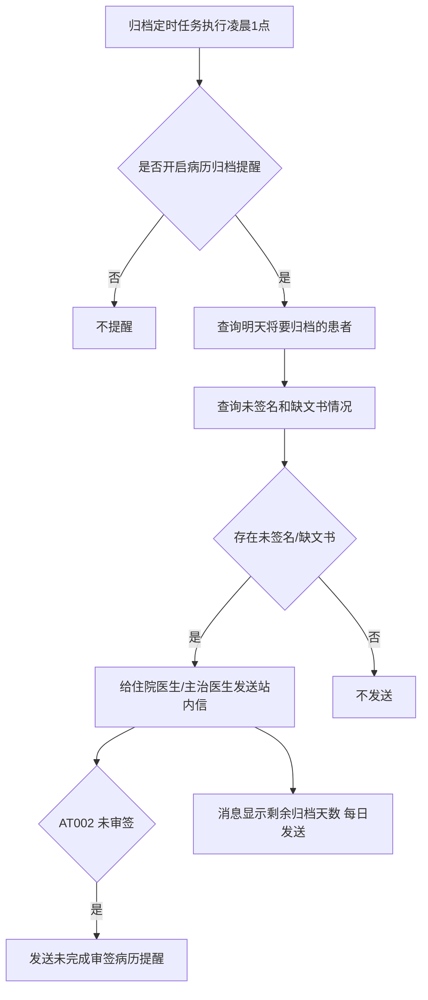
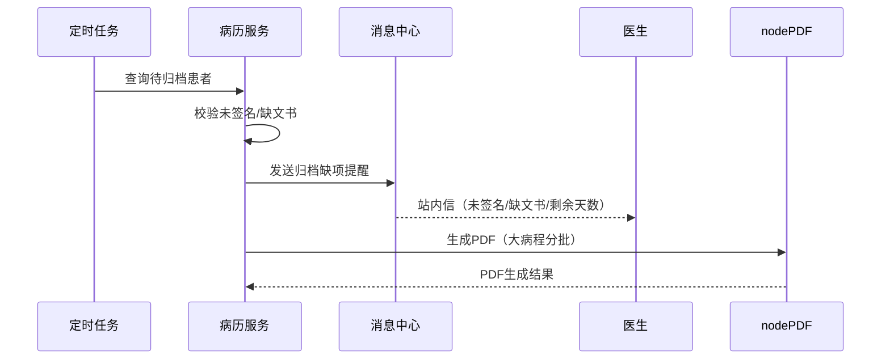

# BLGL-09-GDJY-009 归档校验与提醒 - Spec

> **功能编号**：BLGL-09-GDJY-009
> **文档类型**：功能Spec（业务背景与设计）
> **文档版本**：V1.0
> **编写时间**：2026-08-15
> **编写人**：RACC

---

## 文档索引

#### 章节索引

**Spec（研发视角）**

| 章节号 | 章节名称 | 内容说明 |
|--------|---------|---------|
| 1、 | 文档概述 | 文档目的、文档范围、术语定义、阅读指南、参考文档 |
| 2、 | 功能背景与定位 | 功能背景、功能定位、目标用户、核心价值 |
| 3、 | 业务流程设计 | 主流程/异常流程/边界流程（Given/When/Then） |
| 4、 | 数据模型设计 | 核心数据结构、状态定义、系统参数定义 |
| 5、 | 接口契约设计 | API列表、接口详细设计、错误码定义 |
| 6、 | 技术方案设计 | 页面路径、技术栈、关键技术点、部署方案 |
| 7、 | 测试用例预设计 | 功能/边界/异常/性能测试用例 |
| 8、 | 非功能性要求 | 性能、安全、可用性、兼容性 |
| 9、 | 依赖与风险 | 外部依赖、风险项 |
| 10、 | 附录 | 流程图、时序图、参考文档 |

**PM-Spec（业务视角）**

| 章节号 | 章节名称 | 内容说明 |
|--------|---------|---------|
| 一 | 目标 | 功能定位与核心价值 |
| 二 | 约束 | 业务/技术/非功能性约束 |
| 三 | 验收标准 | 验收条件与验证方法 |
| 四 | 排除范围 | 本次不做项与明确边界 |
| 五 | 关键决策记录 | 方案决策与选型理由 |
| 六 | 优先级 | 优先级定义 |
| 七 | 关联文档 | 关联文档索引 |
| 附录 | 填写检查清单 | 质量检查 |

**Analyst-Spec（产品视角）**

| 章节号 | 章节名称 | 内容说明 |
|--------|---------|---------|
| 一 | 功能编号体系 | 功能编号与层级结构 |
| 二 | 核心业务流程 | 核心业务流程与时序 |
| 三 | 功能规格说明 | 详细功能规格与验收标准 |
| 四 | 排除范围 | 排除范围 |
| 五 | 业务规则清单 | 业务规则清单 |
| 六 | 关联文档 | 关联文档索引 |
| 七 | 待确认问题清单 | 待确认问题汇总 |
| - | 填写检查清单 | 质量检查 |

#### 版本历史

| 版本 | 日期 | 变更说明 | 编写人 |
|------|------|---------|--------|
| V1.0 | 2026-08-15 | 初始版本 | RACC |

#### 关联文档索引

| 序号 | 文档名称 | 文档类型 | 版本 | 位置 |
|------|---------|---------|------|------|
| 1 | BLGL-09-GDJY 归档借阅功能点Spec.md | 功能点Spec（模块级） | V1.0 | 上级目录 |
| 2 | BLGL-09-GDJY-009_归档校验与提醒-Spec.md | 功能Spec（业务背景与设计）（本文档） | V1.0 | 本目录 |
| 3 | BLGL-09-GDJY-009_归档校验与提醒_Analyst-spec.md | Analyst-Spec（分析规格） | V1.0 | 本目录 |
| 4 | BLGL-09-GDJY-009_归档校验与提醒_PM-spec.md | PM-Spec（需求规格） | V0.1 | 本目录 |

---

## 1、文档概述

### 1.1、文档目的

本文档旨在明确"归档校验与提醒"功能（BLGL-09-GDJY-009）的业务背景与设计方案，为需求分析、研发实现、测试验收及评审提供统一的业务上下文、设计口径与决策依据。

**具体目的包括**：

1. 梳理归档校验与提醒功能的业务由来与历史需求演进脉络，说明"为什么要做"；
2. 明确功能的定位边界、目标用户与核心价值，回答"做成什么"；
3. 描述功能的业务流程、数据模型、接口契约与技术方案，回答"怎么做"；
4. 预设计测试用例并明确非功能性要求、依赖与风险，为研发与验收提供依据；
5. 作为 Analyst-Spec 的业务前提与设计输入，保证各层文档业务口径一致。

### 1.2、文档范围

#### 1.2.1 纳入范围

本文档覆盖归档校验与提醒的完整业务背景与设计，包括：

- 归档前校验：完整性校验、文件缺失、会诊记录缺失、未审签校验
- 归档缺项提醒：未签名文书、缺文书提醒，消息/短信/站内信
- 手动归档消息提醒：EG008 联动的手动归档消息提醒
- 归档提醒参数：AT001-AT003、EG016 参数配置
- PDF 生成：PDF 生成失败/下载失败、大病程分批生成 PDF
- 业务时间戳：病历无纸化归档新增业务时间戳字段

#### 1.2.2 排除范围

本文档不涉及以下内容（详见其他功能点或模块）：

- 病历自动归档/手动归档 —— BLGL-09-GDJY-001/-002
- 病历撤销归档 —— BLGL-09-GDJY-003
- 病历召回申请/召回审核 —— BLGL-09-GDJY-004/-005
- 病历借阅流程 —— BLGL-09-GDJY-006
- 三方病案系统对接 —— BLGL-09-GDJY-007
- 归档查询与统计 —— BLGL-09-GDJY-008

### 1.3、术语定义

| 术语 | 定义 |
|------|------|
| 完整性校验 | 归档前校验病历完整性（已提交/签名/文件缺失） |
| EG016 | 是否开启医生站病历归档缺项提醒参数 |
| AT001 | 患者归档提醒的病历查询范围参数 |
| AT002 | 患者归档提醒的病历查询范围（增加"未审签"下拉项） |
| AT003 | 患者归档提醒的发送人（增加"责任医生"下拉项） |
| nodePDF | 病历 PDF 生成服务，支持特殊字符（U+2600-U+26FF） |

### 1.4、阅读指南

- **章节关系**：第1~2章为业务全貌，第3~10章为设计实现层。与 Analyst-Spec、PM-Spec 互相引用保持一致。
- **读者对象**：产品经理/需求分析师读第1~2章；研发读第3~6、9~10章；测试读第3、7~8章；评审人员核对各层一致性。

### 1.5、参考文档

| 序号 | 文档名称 | 版本/日期 |
|------|---------|----------|
| 1 | 【历史需求】住院病历的历史需求.xlsx | - |
| 2 | BLGL-09-GDJY-009_归档校验与提醒_PM-spec.md | V0.1 |
| 3 | BLGL-09-GDJY-009_归档校验与提醒_Analyst-spec.md | V1.0 |
| 4 | BLGL-09-GDJY 归档借阅功能点Spec.md | V1.0 |

---

## 2、功能背景与定位

### 2.1 功能背景

归档校验与提醒是归档借阅模块的质量保障层（L1），需满足：

- **现状痛点**：电子病历归档时有会诊患者病历确认归档时总是提示"完整性校验不通过。会诊记录文件缺失"；病历流程中显示已审签完毕但归档时提示都未审签；病历生成 PDF 存在失败情况
- **管理要求**：归档前提醒未签名/缺文书的患者，给住院医生和主治医生发送站内信；归档缺项提醒消息显示患者剩余归档天数，每天发送且自动作废上一次消息
- **历史需求演进**：病历归档提醒→ 缺项短信提醒→ 手动归档消息提醒→ 未审签提醒（5）→ 消息模板优化每日发送（1）

### 2.2 功能定位

"归档校验与提醒"是 WiNEX 病历管理-归档借阅的质量保障层，定位为：

- **归档校验**：归档前完整性校验（已提交/签名/文件缺失）
- **缺项提醒**：归档前提醒未签名/缺文书/未审签患者
- **PDF 保障**：PDF 生成失败补偿、大病程分批生成

### 2.3 目标用户

| 用户角色 | 主要使用场景 |
|---------|-------------|
| 住院医生 | 接收归档缺项提醒，处理未签名/缺文书 |
| 主治医生 | 接收归档缺项提醒 |
| 病案室管理员 | 查看归档校验结果 |

### 2.4 核心价值

| 价值维度 | 价值描述 |
|---------|---------|
| 归档完整 | 归档前校验完整性，避免不完整归档 |
| 及时提醒 | 归档前缺项提醒（未签名/缺文书/未审签） |
| PDF 可靠 | PDF 生成失败补偿、大病程分批生成 |

---

## 3、业务流程设计（Given/When/Then）

### 3.1 主流程

**Scenario 1: 归档缺项提醒**

```gherkin
Given:
  - 参数"是否开启病历归档提醒"=是
  - EG005=否（病案归档未开启三方对接）

When:
  - 归档定时任务执行（凌晨1点）

Then:
  - 查询明天晚上将要归档的患者
  - 查询待归档患者存在未签名和缺文书情况（文书状态={新建、草稿、不能打印}，有未处理待书写任务）
  - 存在未签名/缺文书的患者，给住院医生和主治医生发送站内信
```

### 3.2 异常流程

**Scenario 2: 业务异常——完整性校验不通过**

```gherkin
Given:
  - 有会诊患者病历
  - 确认归档

When:
  - 电子病历归档

Then:
  - 总是提示"完整性校验不通过。会诊记录文件缺失"
  - 需排查会诊记录归档完整性
```

**Scenario 3: 数据异常——归档提醒配置不生效**

```gherkin
Given:
  - 病历归档提醒参数均已设置
  - 归档前有未提交的病历

When:
  - 归档提醒触发

Then:
  - 仍无提醒（问题）
  - 需排查参数配置/消息触发
```

**Scenario 4: 系统异常——PDF 生成失败**

```gherkin
Given:
  - 长期住院患者病程记录数据量大

When:
  - 归档生成 PDF

Then:
  - 无法生成 PDF（问题）
  - 需按大病程分批生成 PDF（默认超过100份分批，单批默认50份）
```

### 3.3 边界流程

**Scenario 5: 边界——未审签提醒**

```gherkin
Given:
  - 参数 AT002 配置了【未审签】
  - 参数 EG016 开启

When:
  - 查询符合 AT001 的预归档患者

Then:
  - 判断是否存在审签流程未结束的病历
  - 存在时发送提醒，加上"未完成审签病历xx份"
  - AT003 配置责任医生时提醒发送给患者信息维护的责任医生
```

**Scenario 6: 边界——消息模板每日发送**

```gherkin
Given:
  - 参数 EG016 配置为 true（缺项提醒）

When:
  - 归档缺项提醒发送

Then:
  - 消息模板改为显示患者剩余归档天数
  - 从只发一次改为每天发送
  - 自动作废上一次消息
```

---

## 4、数据模型设计

### 4.1 核心数据结构

#### 4.1.1 核心保存请求

| 字段名 | 类型 | 必填 | 备注 |
|--------|------|------|------|
| 病历状态 | String | 是 | 新建/草稿/已提交/审签中（归档校验） |
| 未签名文书 | Integer | 否 | 未签名病历份数 |
| 待书写文书 | Integer | 否 | 缺文书份数 |
| 剩余归档天数 | Integer | 否 | 消息显示剩余归档天数 |

> ⏳ 待确认：归档提醒接口完整入参/出参以代码扫描和 API 契约为准。

#### 4.1.2 核心表/实体

| 表/实体 | 关键字段 | 说明 |
|---------|---------|------|
| INPATIENT_EMR_ARCHIVE（InpatientEmrArchivePO） | inpatEmrSetFilingId(INP_EMR_ARCHIVE_ID)、inpatRhbRecordId(INP_RHB_RECORD_ID)、statusCode(INP_EMR_ARCHIVE_STATUS)、inpatEmrSetFilingAt(INP_EMR_ARCHIVED_AT) | 住院病历归档表（归档校验状态，代码） |
| INP_EMR_RECALL_MODIFIED_DETAIL（InpEmrRecallModifiedDetailPO） | inpEmrArchRecallId、inpEmrSetId、inpEmrRecordId、inpEmrSetTitle | 召回修改明细（归档校验关联，代码） |

### 4.2 状态定义

| 状态码 | 状态名称 | 说明 |
|--------|---------|------|
| - | 新建 | 文书状态（未签名判断，） |
| - | 草稿 | 文书状态（未签名判断，） |
| - | 不能打印 | 文书状态（未签名判断，） |
| 399058142 | 已归档 | 病历归档状态（FilingStatusConstant.ARCHIVE，代码） |

### 4.3 系统参数定义

| 参数编码 | 参数名称 | 说明 |
|---------|---------|------|
| EG016 | 是否开启医生站病历归档缺项提醒 | 是/否 |
| AT001 | 患者归档提醒的病历查询范围 | 预归档患者查询 |
| AT002 | 患者归档提醒的病历查询范围 | 增加"未审签"下拉项 |
| AT003 | 患者归档提醒的发送人 | 增加"责任医生"下拉项 |
| - | 是否开启病历归档提醒 | 是/否，默认否 |
| - | 是否开启手动归档的消息提醒 | 是/否，默认否，与 EG008 联动 |

---

## 5、接口契约设计

### 5.1 API列表

| 序号 | API名称（代码函数） | 路径 | 方法 | 说明 |
|:----:|---------|------|:----:|------|
| 1 | 归档校验 | /api/v1/app_record_inpatient/inpatient_emr_template/emr_filing_by_hand/check | POST | 归档前校验（入参 InpatientEmrSetInputAO，出参 InpEmrFilingCheckOutputVO） |
| 2 | 批量归档校验 | /api/v1/app_record_inpatient/inpatient_emr_template/emr_filing_by_hand/batch_check | POST | 批量归档校验（按 COMMON283 规则，入参 InpEmrBatchArchiveCheckInputAO，出参 InpEmrBatchArchiveCheckOutputVO） |
| 3 | 更新无纸化状态 | /api/v1/record_emr/inpatient/emr_inpatient/emr_set_paperless_status/update | POST | 无纸化状态 |
| 4 | 查询病历簿列表信息 | /api/v1/app_record_inpatient/emr_inpatient/emr_rhb_record_list/query/by_example | POST | 归档查询（待归档患者查询） |

### 5.2 接口详细设计

#### 5.2.1 归档校验（emr_filing_by_hand/check）

**请求参数**:
```json
{
  "inpRhbRecordId": "12345",
  "emrSetIdList": [],
  "inpatientEmrSetId": "20001"
}
```

**返回值（成功）**:
```json
{
  "success": true,
  "data": {
    "checkResult": "通过",
    "missingEmrList": [],
    "unsignedEmrList": []
  }
}
```

> ⏳ 待确认：归档校验接口字段以代码扫描（InpEmrFilingCheckOutputVO）和 API 契约为准。

**返回值（失败）**:
```json
{
  "success": false,
  "message": "完整性校验不通过。会诊记录文件缺失",
  "data": null
}
```

### 5.3 错误码定义

| 错误码 | 错误信息 | 处理方式 |
|--------|---------|---------|
| ⏳ 待确认 | 完整性校验不通过。会诊记录文件缺失 | 阻止归档，提示缺失 |

---

## 6、技术方案设计

### 6.1 页面路径

- **页面路径**: 住院医生站→日常管理→病历归档→归档查询/手动归档（src/router/EmrArchiving.js clinicalnoteQuery/manualArchive）；医生站工作站弹窗（待归档病历列表）
- **后台任务**: 归档定时任务（凌晨1点）查询明天将要归档的患者
- **后端模块**: winning-emr-ipt-archive/winning-emr-ipt-archive-provider/controller/InpEmrArchiveController.java（归档校验 emr_filing_by_hand/check、批量归档校验 batch_check）
- **消息通道**: 站内信/短信
- **前端 API**: winning-webui-inpatient-clinicalnote-pango/src/pages/ClinicalnoteArchiveManage/api/index.js（queryArchiveFailEmr → emr_filing_by_hand/check、batchCheckArchive → emr_filing_by_hand/batch_check）

### 6.2 技术栈

| 类别 | 技术 | 版本 |
|------|------|------|
| 前端框架 | Vue | 2.6.14 |
| 前端UI | element-ui | 2.13.0 |
| 后端框架 | Spring Boot（Java 17）+ JPA/Hibernate | - |
| PDF | nodePDF（支持特殊字符 U+2600-U+26FF） |

### 6.3 关键技术点

- 归档缺项提醒消息模板显示剩余归档天数，每天发送且自动作废上一次消息
- 大病程分批生成 PDF：默认超过100份病程分批生成，单批默认50份，完成后合并成一份完整的 PDF
- 未签名判断：文书状态={新建、草稿、不能打印}

### 6.4 部署方案

⏳ 待确认：部署方案未在资料区中找到。

---

## 7、测试用例预设计

### 7.1 功能测试

| 用例编号 | 测试场景 | Given | When | Then |
|---------|---------|-------|------|------|
| TC-001 | 归档缺项提醒 | 参数开启，患者有未签名/缺文书 | 归档定时任务执行 | 发送提醒给医生 |
| TC-002 | 归档校验接口 | 归档操作 | 调用 emr_filing_by_hand/check | 返回校验结果（InpEmrFilingCheckOutputVO） |

### 7.2 边界测试

| 用例编号 | 测试场景 | Given | When | Then |
|---------|---------|-------|------|------|
| TC-003 | 未审签提醒 | AT002=未审签 | 查询预归档患者 | 存在未审签则提醒 |
| TC-004 | 批量归档校验 | 批量归档 | 调用 emr_filing_by_hand/batch_check | 返回批量校验结果 |

### 7.3 异常测试

| 用例编号 | 测试场景 | Given | When | Then |
|---------|---------|-------|------|------|
| TC-005 | 完整性校验不通过 | 会诊记录文件缺失 | 确认归档 | 提示完整性校验不通过 |
| TC-006 | 大病程 PDF 生成 | 病程记录超100份 | 归档生成 PDF | 分批生成后合并成完整 PDF |

### 7.4 性能测试

| 用例编号 | 测试场景 | 指标 |
|---------|---------|------|
| TC-007 | 归档提醒批量发送 | ⏳ 待确认：性能指标未在资料区中找到 |
| TC-008 | 归档校验接口响应 | ⏳ 待确认：性能指标未在资料区中找到 |

---

## 8、非功能性要求

### 8.1 性能要求

| 指标 | 要求 |
|------|------|
| 归档提醒批量发送时间 | ⏳ 待确认 |

### 8.2 安全要求

| 要求 | 说明 |
|------|------|
| 提醒权限 | 归档缺项提醒发送给住院医生/主治医生/责任医生 |

**医疗行业特殊要求**

| 要求 | 说明 |
|------|------|
| 归档完整 | 归档前校验完整性，未签名/缺文书不完整归档 |

### 8.3 可用性要求

| 指标 | 要求值 |
|------|--------|
| 可用性 | ⏳ 待确认 |

### 8.4 兼容性要求

| 类型 | 要求 |
|------|------|
| PDF 特殊字符 | nodePDF 支持特殊字符 U+2600-U+26FF |
| 大病程 | 病程超长分批生成 PDF 后合并 |

---

## 9、依赖与风险

### 9.1 外部依赖

| 依赖项 | 说明 |
|--------|------|
| nodePDF 服务 | 病历 PDF 生成 |
| 消息中心 | 归档提醒站内信/短信 |

### 9.2 风险项

| 风险项 | 等级 | 说明 | 应对方案 |
|--------|------|------|---------|
| 校验误报 | 中 | 会诊记录文件缺失误报 | 排查完整性校验逻辑 |
| 提醒不触发 | 中 | 归档提醒配置不生效 | 排查参数/消息触发 |

---

## 10、附录

### 10.1 流程图



### 10.2 时序图



### 10.3 参考文档

- BLGL-09-GDJY 归档借阅功能点Spec.md（V1.0，第5章 BLGL-09-GDJY-009 行）
- 关联Spec: BLGL-09-GDJY-009_归档校验与提醒_PM-spec.md、BLGL-09-GDJY-009_归档校验与提醒_Analyst-spec.md

---

## 填写检查清单

| 序号 | 检查项 | 是否完成 |
|:----:|--------|:--------:|
| 1 | 章节索引与正文章节一致 | ✅ |
| 2 | 版本历史记录完整 | ✅ |
| 3 | 关联文档索引已登记全部Spec | ✅ |
| 4 | 文档目的明确回答"为什么做/做成什么/怎么做" | ✅ |
| 5 | 纳入范围/排除范围清晰 | ✅ |
| 6 | 术语定义覆盖关键概念，从资料区可溯源 | ✅ |
| 7 | 参考文档已登记 | ✅ |
| 8 | 功能背景基于法规/规范/需求来源组织 | ✅ |
| 9 | 功能定位体现业务价值（3~5个定位点） | ✅ |
| 10 | 目标用户角色覆盖完整，在需求原文中有出处 | ✅ |
| 11 | 核心价值可陈述，与 Phase 1 口径一致 | ✅ |
| 12 | 业务流程：主流程≥1、异常≥3、边界≥2，Given/When/Then 具体 | ✅ |
| 13 | 数据模型：字段/表/状态/参数可溯源 | ✅ |
| 14 | 接口契约：API列表+详细设计+错误码齐全或标记待确认 | ✅ |
| 15 | 技术方案：页面路径/技术栈/关键点/部署方案或标记待确认 | ✅ |
| 16 | 测试用例：功能/边界/异常/性能覆盖 | ✅ |
| 17 | 非功能性要求：性能/安全/可用性/兼容性指标可量化或标记待确认 | ✅ |
| 18 | 依赖与风险：外部依赖登记完整 | ✅ |
| 19 | 附录：流程图/时序图与正文流程一致 | ✅ |
| 20 | 全文无占位符 `< >` 残留 | ✅ |
| 21 | 全文陈述可溯源至资料区 | ✅ |
| 22 | 人工审核确认完成 | ⏳ 待确认 |

---

**文档状态**：⬜ 待审核
**维护责任**：RACC
**下次更新**：根据评审反馈优化
