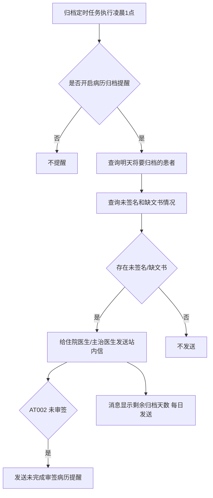
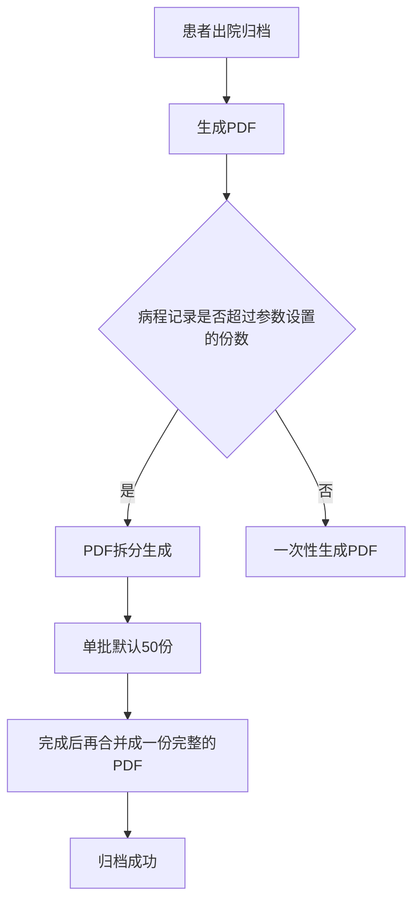

# BLGL-09-GDJY-009 归档校验与提醒 _ Analyst - Spec

> **需求编号**：BLGL-09-GDJY-009
> **父需求**：BLGL-09-GDJY
> **关联PM Spec**：BLGL-09-GDJY-009_归档校验与提醒_PM-spec.md
> **Spec版本**：V1.0
> **编写时间**：2026-08-15
> **编写人**：需求分析师

---

## 一、功能编号体系

### 1.1 功能层级结构

```
BLGL-09-GDJY-009-001: 归档前完整性校验
  ├─ BLGL-09-GDJY-009-001-01: 完整性校验（文件缺失）
  └─ BLGL-09-GDJY-009-001-02: 未审签校验

BLGL-09-GDJY-009-002: 归档缺项提醒
  ├─ BLGL-09-GDJY-009-002-01: 未签名文书提醒
  ├─ BLGL-09-GDJY-009-002-02: 缺文书提醒
  ├─ BLGL-09-GDJY-009-002-03: 未审签提醒（AT002）
  └─ BLGL-09-GDJY-009-002-04: 消息模板（剩余天数/每日发送）

BLGL-09-GDJY-009-003: 手动归档消息提醒
  └─ BLGL-09-GDJY-009-003-01: 与 EG008 联动

BLGL-09-GDJY-009-004: PDF 生成保障
  ├─ BLGL-09-GDJY-009-004-01: PDF 生成失败补偿
  └─ BLGL-09-GDJY-009-004-02: 大病程分批生成 PDF

BLGL-09-GDJY-009-005: 业务时间戳
  └─ BLGL-09-GDJY-009-005-01: 无纸化归档业务时间戳
```

### 1.2 功能编号表

| REQ-ID | 功能名称 | 类型 | 优先级 | 说明 |
|--------|---------|------|--------|------|
| BLGL-09-GDJY-009-001 | 归档前完整性校验 | 功能 | P0 | 归档前校验 |
| BLGL-09-GDJY-009-001-01 | 完整性校验 | 子功能 | P0 | 会诊记录文件缺失校验 |
| BLGL-09-GDJY-009-001-02 | 未审签校验 | 子功能 | P0 | 已审签但归档提示未审签 |
| BLGL-09-GDJY-009-002 | 归档缺项提醒 | 功能 | P0 | 缺项提醒 |
| BLGL-09-GDJY-009-002-01 | 未签名文书提醒 | 子功能 | P0 | 文书状态={新建、草稿、不能打印} |
| BLGL-09-GDJY-009-002-02 | 缺文书提醒 | 子功能 | P0 | 有未处理待书写任务 |
| BLGL-09-GDJY-009-002-03 | 未审签提醒 | 子功能 | P1 | AT002 配置未审签 |
| BLGL-09-GDJY-009-002-04 | 消息模板优化 | 子功能 | P1 | 剩余天数/每日发送 |
| BLGL-09-GDJY-009-003 | 手动归档消息提醒 | 功能 | P1 | 与 EG008 联动 |
| BLGL-09-GDJY-009-003-01 | 手动归档消息提醒 | 子功能 | P1 | 取 EG001/EG002 设置时间 |
| BLGL-09-GDJY-009-004 | PDF 生成保障 | 功能 | P1 | PDF 生成 |
| BLGL-09-GDJY-009-004-01 | PDF 生成失败补偿 | 子功能 | P1 | PDF 失败补偿 |
| BLGL-09-GDJY-009-004-02 | 大病程分批生成 PDF | 子功能 | P1 | 超100份分批，单批50份 |
| BLGL-09-GDJY-009-005 | 业务时间戳 | 功能 | P2 | 无纸化归档时间戳 |
| BLGL-09-GDJY-009-005-01 | 无纸化归档业务时间戳 | 子功能 | P2 | 业务时间戳字段 |

---

## 二、核心业务流程

### 2.1 归档缺项提醒主流程



### 2.2 大病程 PDF 生成流程



---

## 三、功能规格说明

### BLGL-09-GDJY-009-001: 归档前完整性校验

#### 3.1.1 功能概述

电子病历归档时进行完整性校验，有会诊患者病历确认归档时提示"完整性校验不通过。会诊记录文件缺失"（问题需修复）。病历流程中显示已审签完毕但归档时提示都未审签（问题需修复）。

#### 3.1.2 用户角色

| 角色 | 使用场景 | 权限要求 | 操作频率 |
|------|---------|---------|---------|
| 住院医生 | 归档操作 | 病历书写权限 | 中频 |
| 病案室管理员 | 归档校验 | 病案室权限 | 中频 |

#### 3.1.3 业务流程（Given/When/Then）

**Scenario 1: 完整性校验（主流程）**

```gherkin
Given:
  - 病历包含会诊记录

When:
  - 医生确认归档

Then:
  - 系统执行完整性校验
  - 校验通过则归档成功
```

**Scenario 2: 异常——完整性校验不通过**

```gherkin
Given:
  - 有会诊患者病历
  - 会诊记录文件缺失

When:
  - 确认归档

Then:
  - 总是提示"完整性校验不通过。会诊记录文件缺失"
  - 需排查会诊记录归档完整性
```

**Scenario 3: 异常——已审签但归档提示未审签**

```gherkin
Given:
  - 病历流程中显示已审签完毕

When:
  - 归档

Then:
  - 提示都未审签（问题）
  - 需排查审签状态与归档校验
```

#### 3.1.4 数据字段定义

| 字段名 | 类型 | 必填 | 默认值 | 取值范围 | 说明 | 概念ID |
|--------|------|------|--------|---------|------|--------|
| 病历完整性 | Boolean | 是 | - | 通过/不通过 | 完整性校验结果 | ⏳ 待确认 |
| inpatEmrSetFilingId | Long | 否 | - | - | 归档表主键（INP_EMR_ARCHIVE_ID，代码 InpatientEmrArchivePO） | ⏳ 待确认 |
| statusCode | Long | 否 | - | 399058142 | 归档状态（INP_EMR_ARCHIVE_STATUS，代码） | ⏳ 待确认 |
| 未签名文书 | Integer | 否 | - | - | 未签名病历份数 | ⏳ 待确认 |
| 待书写文书 | Integer | 否 | - | - | 缺文书份数 | ⏳ 待确认 |
| 剩余归档天数 | Integer | 否 | - | - | 消息显示剩余归档天数 | ⏳ 待确认 |

#### 3.1.5 验收标准

| AC编号 | 验收标准 | 对应REQ-ID | 验证方法 | 验证场景 |
|--------|---------|-----------|---------|---------|
| AC-001 | 归档前完整性校验生效，会诊记录缺失时提示 | BLGL-09-GDJY-009-001 | 功能测试 | Scenario 2 |

---

### BLGL-09-GDJY-009-002: 归档缺项提醒

#### 3.2.1 功能概述

病历业务配置→住院病历归档→基础参数配置新增"是否开启病历归档提醒"（是/否，默认否）。开启时归档定时任务（凌晨1点）查询明天晚上将要归档的患者，查询待归档患者存在未签名和缺文书情况：文书状态={新建、草稿、不能打印}为未签名；有未处理待书写任务为缺文书。未签名和缺文书的患者给住院医生和主治医生发送站内信。AT002 配置"未审签"时查询是否存在审签流程未结束的病历并提醒；AT003 配置责任医生时提醒发送给责任医生。消息模板显示患者剩余归档天数，每天发送且自动作废上一次消息。

#### 3.2.2 用户角色

| 角色 | 使用场景 | 权限要求 | 操作频率 |
|------|---------|---------|---------|
| 住院医生 | 接收归档缺项提醒 | 病历书写权限 | 高频 |
| 主治医生 | 接收归档缺项提醒 | 病历书写权限 | 高频 |
| 责任医生 | 接收提醒（AT003 配置） | 病历书写权限 | 高频 |

#### 3.2.3 业务流程（Given/When/Then）

**Scenario 1: 归档缺项提醒（主流程）**

```gherkin
Given:
  - 参数"是否开启病历归档提醒"=是
  - EG005=否

When:
  - 归档定时任务执行（凌晨1点）

Then:
  - 查询明天晚上将要归档的患者
  - 查询未签名（文书状态={新建、草稿、不能打印}）和缺文书（有未处理待书写任务）情况
  - 未签名和缺文书患者给住院医生和主治医生发送站内信
```

**Scenario 2: 未审签提醒**

```gherkin
Given:
  - 参数 AT002 配置了【未审签】
  - 参数 EG016 开启

When:
  - 查询符合 AT001 的预归档患者

Then:
  - 判断是否存在审签流程未结束的病历
  - 存在时发送提醒，加上"未完成审签病历xx份"
  - AT003 配置责任医生时提醒发送给责任医生
```

**Scenario 3: 消息模板优化**

```gherkin
Given:
  - 参数 EG016 配置为 true（缺项提醒）

When:
  - 归档缺项提醒发送

Then:
  - 消息模板显示患者剩余归档天数
  - 从只发一次改为每天发送
  - 自动作废上一次消息
```

**Scenario 4: 异常——提醒配置不生效**

```gherkin
Given:
  - 病历归档提醒参数均已设置
  - 归档前有未提交的病历

When:
  - 归档提醒触发

Then:
  - 仍无提醒（问题）
  - 需排查参数配置/消息触发
```

#### 3.2.4 数据字段定义

| 字段名 | 类型 | 必填 | 默认值 | 取值范围 | 说明 | 概念ID |
|--------|------|------|--------|---------|------|--------|
| 是否开启病历归档提醒 | Boolean | 否 | 否 | 是/否 | 归档提醒参数 | ⏳ 待确认 |
| AT002 | String | 否 | - | 未审签等 | 提醒查询范围 | ⏳ 待确认 |
| AT003 | String | 否 | - | 责任医生等 | 提醒发送人 | ⏳ 待确认 |
| 未签名文书 | Integer | 否 | - | - | 未签名病历份数 | ⏳ 待确认 |
| 剩余归档天数 | Integer | 否 | - | - | 消息显示剩余天数 | ⏳ 待确认 |

#### 3.2.5 验收标准

| AC编号 | 验收标准 | 对应REQ-ID | 验证方法 | 验证场景 |
|--------|---------|-----------|---------|---------|
| AC-002 | 归档缺项提醒发送给住院医生/主治医生 | BLGL-09-GDJY-009-002 | 功能测试 | Scenario 1 |
| AC-003 | AT002=未审签发送未完成审签病历提醒，AT003=责任医生发给责任医生 | BLGL-09-GDJY-009-002 | 功能测试 | Scenario 2 |
| AC-004 | 消息模板显示剩余归档天数，每日发送且作废上一次 | BLGL-09-GDJY-009-002 | 功能测试 | Scenario 3 |

---

### BLGL-09-GDJY-009-003: 手动归档消息提醒

#### 3.3.1 功能概述

在 基础上新增参数控制"EG008：病历不会自动归档的临床科室"下的病历文书是否开启病历归档消息提醒。参数"是否开启手动归档的消息提醒"（是/否，默认否），与 EG008 联动，设置为是时手动归档时间消息提醒取 EG001（病历首次归档时间）和 EG002（撤销后再次归档时间）的设置时间；死亡患者取 EG009/EG010。

#### 3.3.2 用户角色

| 角色 | 使用场景 | 权限要求 | 操作频率 |
|------|---------|---------|---------|
| 病案管理员 | 配置手动归档消息提醒 | 配置权限 | 低频 |

#### 3.3.3 业务流程（Given/When/Then）

**Scenario 1: 手动归档消息提醒（主流程）**

```gherkin
Given:
  - 参数"是否开启手动归档的消息提醒"=是
  - 参数 EG008 配置了科室

When:
  - 该科室病历超过设置时间未归档

Then:
  - 发送手动归档消息提醒
  - 提醒时间取 EG001/EG002 设置时间（死亡患者取 EG009/EG010）
```

#### 3.3.4 数据字段定义

| 字段名 | 类型 | 必填 | 默认值 | 取值范围 | 说明 | 概念ID |
|--------|------|------|--------|---------|------|--------|
| 是否开启手动归档的消息提醒 | Boolean | 否 | 否 | 是/否 | 手动归档提醒参数 | ⏳ 待确认 |

#### 3.3.5 验收标准

| AC编号 | 验收标准 | 对应REQ-ID | 验证方法 | 验证场景 |
|--------|---------|-----------|---------|---------|
| AC-005 | 手动归档消息提醒与 EG008 联动生效 | BLGL-09-GDJY-009-003 | 功能测试 | Scenario 1 |

---

### BLGL-09-GDJY-009-004: PDF 生成保障

#### 3.4.1 功能概述

针对大病程患者病历无法归档的优化处理：新增参数"病程超长时，需要分批生成 PDF 的份数"，当病程记录的文书超过参数设置的份数时，PDF 拆分生成，完成后再合并成一份完整的 PDF。默认超过 100 份病程就分批生成 PDF，单批病程默认 50 份（点击确定时需校验单批病程数不能大于总病程数）。长期住院患者病程记录数据量大无法生成 PDF 需合并处理。nodePDF 新增特殊字符（U+2600-U+26FF）显示功能。

#### 3.4.2 用户角色

| 角色 | 使用场景 | 权限要求 | 操作频率 |
|------|---------|---------|---------|
| 病案管理员 | 配置分批 PDF 参数 | 配置权限 | 低频 |
| 住院医生 | 归档生成 PDF | 病历书写权限 | 中频 |

#### 3.4.3 业务流程（Given/When/Then）

**Scenario 1: 大病程分批生成 PDF（主流程）**

```gherkin
Given:
  - 病程记录超过参数设置的份数（默认100份）

When:
  - 归档生成 PDF

Then:
  - PDF 拆分生成（单批默认50份）
  - 完成后再合并成一份完整的 PDF
  - 点击确定时校验单批病程数不能大于总病程数
```

**Scenario 2: 异常——病程无法生成 PDF**

```gherkin
Given:
  - 长期住院患者病程记录数据量大

When:
  - 归档生成 PDF

Then:
  - 无法生成 PDF（问题）
  - 需按大病程分批生成处理
```

**Scenario 3: PDF 特殊字符**

```gherkin
Given:
  - nodePDF 版本 20260625 以上

When:
  - 生成包含特殊字符的 PDF

Then:
  - 支持特殊字符（U+2600-U+26FF）显示
```

#### 3.4.4 数据字段定义

| 字段名 | 类型 | 必填 | 默认值 | 取值范围 | 说明 | 概念ID |
|--------|------|------|--------|---------|------|--------|
| 病程超长时分批生成 PDF 的份数 | Integer | 否 | 100 | - | 分批生成阈值 | ⏳ 待确认 |
| 单批病程数 | Integer | 否 | 50 | 不大于总病程数 | 分批大小 | ⏳ 待确认 |

#### 3.4.5 验收标准

| AC编号 | 验收标准 | 对应REQ-ID | 验证方法 | 验证场景 |
|--------|---------|-----------|---------|---------|
| AC-006 | 大病程分批生成 PDF 后合并成完整 PDF | BLGL-09-GDJY-009-004 | 集成测试 | Scenario 1 |
| AC-007 | PDF 支持特殊字符 U+2600-U+26FF | BLGL-09-GDJY-009-004 | 集成测试 | Scenario 3 |

---

### BLGL-09-GDJY-009-005: 业务时间戳

#### 3.5.1 功能概述

病历无纸化归档新增业务时间戳字段。

#### 3.5.2 用户角色

| 角色 | 使用场景 | 权限要求 | 操作频率 |
|------|---------|---------|---------|
| 病案室管理员 | 查看归档时间戳 | 查看权限 | 低频 |

#### 3.5.3 业务流程（Given/When/Then）

**Scenario 1: 业务时间戳（主流程）**

```gherkin
Given:
  - 病历无纸化归档

When:
  - 归档

Then:
  - 归档记录新增业务时间戳字段
  - ⏳ 待确认：时间戳字段具体定义资料区未明确
```

#### 3.5.4 数据字段定义

| ⏳ 待确认 | 业务时间戳字段 | 依赖归档记录表结构 |

#### 3.5.5 验收标准

| AC编号 | 验收标准 | 对应REQ-ID | 验证方法 | 验证场景 |
|--------|---------|-----------|---------|---------|
| AC-008 | 无纸化归档新增业务时间戳字段 | BLGL-09-GDJY-009-005 | 功能测试 | Scenario 1 |
| AC-009 | 归档校验接口 emr_filing_by_hand/check 返回校验结果（InpEmrFilingCheckOutputVO），批量校验接口 emr_filing_by_hand/batch_check 返回批量校验结果 | BLGL-09-GDJY-009-001 | 接口测试 | Scenario 1 |

---

## 四、排除范围

本需求不包含以下功能项：

1. **病历自动归档/手动归档** —— BLGL-09-GDJY-001/-002
2. **病历撤销归档** —— BLGL-09-GDJY-003
3. **病历召回申请/召回审核** —— BLGL-09-GDJY-004/-005
4. **病历借阅流程** —— BLGL-09-GDJY-006
5. **三方病案系统对接** —— BLGL-09-GDJY-007
6. **归档查询与统计** —— BLGL-09-GDJY-008

---

## 五、业务规则清单

| 规则ID | 规则名称 | 规则描述 | 来源 | 优先级 |
|--------|---------|---------|------|--------|
| BR-001 | 提醒前置条件 | 只有 EG005=否才能启用病历归档提醒功能，"是否开启病历归档提醒"默认否 |  | P0 |
| BR-002 | 未签名判断 | 未签名文书判断：文书状态={新建、草稿、不能打印} |  | P0 |
| BR-003 | 缺文书判断 | 缺文书判断：有未处理的待书写任务 |  | P0 |
| BR-004 | 提醒发送 | 未签名和缺文书患者给住院医生和主治医生发送站内信 |  | P0 |
| BR-005 | 手动归档提醒 | "是否开启手动归档的消息提醒"与 EG008 联动，提醒时间取 EG001/EG002 |  | P1 |
| BR-006 | 未审签提醒 | AT002 配置未审签时发送未完成审签病历提醒 | 5 | P1 |
| BR-007 | 消息模板 | 归档缺项提醒消息显示剩余归档天数，每天发送且自动作废上一次 | 1 | P1 |
| BR-008 | 大病程 PDF | 病程超100份分批生成PDF（单批50份），完成后合并成完整PDF | 0 | P1 |
| BR-009 | 归档校验接口 | 归档校验接口 emr_filing_by_hand/check（入参 InpatientEmrSetInputAO，出参 InpEmrFilingCheckOutputVO），批量校验接口 emr_filing_by_hand/batch_check（入参 InpEmrBatchArchiveCheckInputAO） | 代码 | P0 |

---

## 六、关联文档

| 文档类型 | 文档路径 | 说明 |
|---------|---------|------|
| 功能点Spec（模块级） | 上级目录 BLGL-09-GDJY 归档借阅功能点Spec.md（V1.0） | 模块级功能点索引 |
| 功能Spec（业务背景与设计） | 本目录 BLGL-09-GDJY-009_归档校验与提醒-Spec.md（V1.0） | 业务背景与目标 Spec |
| Analyst-Spec（分析规格） | 本目录 BLGL-09-GDJY-009_归档校验与提醒_Analyst-spec.md（V1.0）（本文档） | 分析规格 |
| PM-Spec（需求规格） | 本目录 BLGL-09-GDJY-009_归档校验与提醒_PM-spec.md（V0.1） | PM 产出的 Spec 文档 |
| data-model.md | 待产出 | 架构师产出的数据建模文档 |
| design.md | 待产出 | 架构师产出的技术方案文档 |
| api-contract.md | 待产出 | 开发经理产出的 API 契约文档 |

---

## 七、待确认问题清单

| 编号 | 问题描述 | 缺失信息 | 影响范围 | 建议补充方 |
|------|---------|---------|---------|-----------|
| Q-001 | 完整性校验接口完整入参/出参 | API 契约 | -Spec 第5章 | 开发经理 |
| Q-002 | 归档提醒参数（EG016/AT001-AT003）概念 ID | 概念ID | 3.2.4 | 产品经理 |
| Q-003 | 会诊记录文件缺失根因 | 需求分析原文缺失 | 3.1.3 | 开发经理 |
| Q-004 | 归档提醒配置不生效（6/1724281）根因 | 需求分析原文缺失 | 3.2.3 | 开发经理 |
| Q-005 | 病历无纸化归档业务时间戳字段定义 | 需求分析原文缺失 | 3.5.3 | 需求分析师 |
| Q-006 | 性能指标（归档提醒批量发送时间） | 资料区无量化指标 | -Spec 第8章 | 产品经理 |

---

## 填写检查清单

| 序号 | 检查项 | 是否完成 |
|:----:|--------|:--------:|
| 1 | 功能编号带父子层级 | ✅ |
| 2 | 每个 REQ-ID 有功能概述和用户角色 | ✅ |
| 3 | 主流程至少 1 个 Given/When/Then 场景 | ✅ |
| 4 | 异常流程至少 3 个 Given/When/Then 场景 | ✅ |
| 5 | 边界流程至少 2 个 Given/When/Then 场景 | ✅ |
| 6 | 每个 Given/When/Then 内容具体，不模糊 | ✅ |
| 7 | 数据字段定义完整（字段名、类型、必填、说明、概念ID） | ✅ |
| 8 | 验收标准 AC 编号独立，可验证 | ✅ |
| 9 | 验收标准无"功能正常"等模糊表述 | ✅ |
| 10 | 排除范围明确列出 | ✅ |
| 11 | 业务规则清单列出所有规则，每条标注来源 | ✅ |
| 12 | 流程图使用 Mermaid 格式（≥2 个） | ✅ |
| 13 | 关联文档索引包含 Phase 1 功能点Spec | ✅ |
| 14 | 待确认问题清单汇总了全文所有 ⏳ 项 | ✅ |
| 15 | 全文无占位符 `< >` 残留 | ✅ |
| 16 | 全文陈述可溯源至资料区（S1~S10 溯源核查） | ✅ |
| 17 | 人工审核确认完成 | ⏳ 待确认 |

---

**文档状态**：⬜ 待审核
**维护责任**：需求分析师规范组
**下次更新**：根据评审反馈优化

---

## 版本历史

| 版本 | 日期 | 变更说明 | 编写人 |
|------|------|---------|--------|
| V1.0 | 2026-08-15 | 初始版本 | 需求分析师 |
