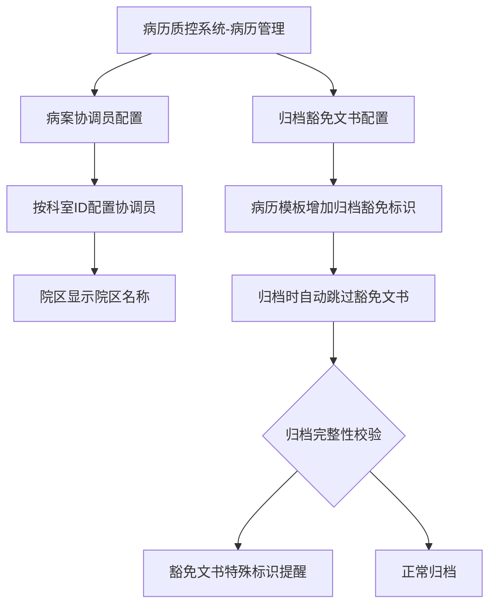
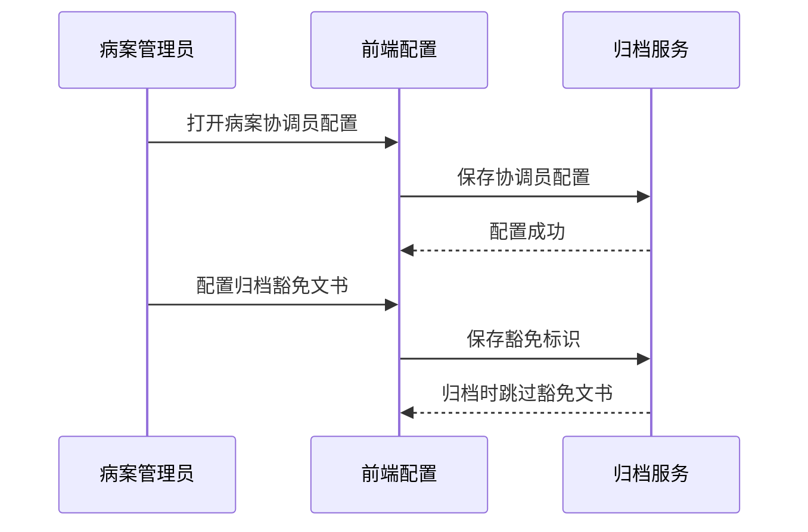

# BLGL-09-GDJY-010 归档配置与豁免 - Spec

> **功能编号**：BLGL-09-GDJY-010
> **文档类型**：功能Spec（业务背景与设计）
> **文档版本**：V1.0
> **编写时间**：2026-08-15
> **编写人**：RACC

---

## 文档索引

#### 章节索引

**Spec（研发视角）**

| 章节号 | 章节名称 | 内容说明 |
|--------|---------|---------|
| 1、 | 文档概述 | 文档目的、文档范围、术语定义、阅读指南、参考文档 |
| 2、 | 功能背景与定位 | 功能背景、功能定位、目标用户、核心价值 |
| 3、 | 业务流程设计 | 主流程/异常流程/边界流程（Given/When/Then） |
| 4、 | 数据模型设计 | 核心数据结构、状态定义、系统参数定义 |
| 5、 | 接口契约设计 | API列表、接口详细设计、错误码定义 |
| 6、 | 技术方案设计 | 页面路径、技术栈、关键技术点、部署方案 |
| 7、 | 测试用例预设计 | 功能/边界/异常/性能测试用例 |
| 8、 | 非功能性要求 | 性能、安全、可用性、兼容性 |
| 9、 | 依赖与风险 | 外部依赖、风险项 |
| 10、 | 附录 | 流程图、时序图、参考文档 |

**PM-Spec（业务视角）**

| 章节号 | 章节名称 | 内容说明 |
|--------|---------|---------|
| 一 | 目标 | 功能定位与核心价值 |
| 二 | 约束 | 业务/技术/非功能性约束 |
| 三 | 验收标准 | 验收条件与验证方法 |
| 四 | 排除范围 | 本次不做项与明确边界 |
| 五 | 关键决策记录 | 方案决策与选型理由 |
| 六 | 优先级 | 优先级定义 |
| 七 | 关联文档 | 关联文档索引 |
| 附录 | 填写检查清单 | 质量检查 |

**Analyst-Spec（产品视角）**

| 章节号 | 章节名称 | 内容说明 |
|--------|---------|---------|
| 一 | 功能编号体系 | 功能编号与层级结构 |
| 二 | 核心业务流程 | 核心业务流程与时序 |
| 三 | 功能规格说明 | 详细功能规格与验收标准 |
| 四 | 排除范围 | 排除范围 |
| 五 | 业务规则清单 | 业务规则清单 |
| 六 | 关联文档 | 关联文档索引 |
| 七 | 待确认问题清单 | 待确认问题汇总 |
| - | 填写检查清单 | 质量检查 |

#### 版本历史

| 版本 | 日期 | 变更说明 | 编写人 |
|------|------|---------|--------|
| V1.0 | 2026-08-15 | 初始版本 | RACC |

#### 关联文档索引

| 序号 | 文档名称 | 文档类型 | 版本 | 位置 |
|------|---------|---------|------|------|
| 1 | BLGL-09-GDJY 归档借阅功能点Spec.md | 功能点Spec（模块级） | V1.0 | 上级目录 |
| 2 | BLGL-09-GDJY-010_归档配置与豁免-Spec.md | 功能Spec（业务背景与设计）（本文档） | V1.0 | 本目录 |
| 3 | BLGL-09-GDJY-010_归档配置与豁免_Analyst-spec.md | Analyst-Spec（分析规格） | V1.0 | 本目录 |
| 4 | BLGL-09-GDJY-010_归档配置与豁免_PM-spec.md | PM-Spec（需求规格） | V0.1 | 本目录 |

---

## 1、文档概述

### 1.1、文档目的

本文档旨在明确"归档配置与豁免"功能（BLGL-09-GDJY-010）的业务背景与设计方案，为需求分析、研发实现、测试验收及评审提供统一的业务上下文、设计口径与决策依据。

**具体目的包括**：

1. 梳理归档配置与豁免功能的业务由来与历史需求演进脉络，说明"为什么要做"；
2. 明确功能的定位边界、目标用户与核心价值，回答"做成什么"；
3. 描述功能的业务流程、数据模型、接口契约与技术方案，回答"怎么做"；
4. 预设计测试用例并明确非功能性要求、依赖与风险，为研发与验收提供依据；
5. 作为 Analyst-Spec 的业务前提与设计输入，保证各层文档业务口径一致。

### 1.2、文档范围

#### 1.2.1 纳入范围

本文档覆盖归档配置与豁免的完整业务背景与设计，包括：

- 病案协调员配置模块：病历质控系统新增病案协调员配置
- 归档豁免文书：住院医师站支持配置病历不参与归档（如诊断证明）
- 归档状态图标：已归档/撤销归档/召回后状态图标显示
- 科主任标识：病案召回配置/时限锁定配置读取主数据科主任标识
- 病历审核界面：病历归档菜单下增加病历审核界面
- 归档提示信息：EG005=60无纸化时提示信息优化

#### 1.2.2 排除范围

本文档不涉及以下内容（详见其他功能点或模块）：

- 病历自动归档/手动归档 —— BLGL-09-GDJY-001/-002
- 病历撤销归档 —— BLGL-09-GDJY-003
- 病历召回申请/召回审核 —— BLGL-09-GDJY-004/-005
- 病历借阅流程 —— BLGL-09-GDJY-006
- 三方病案系统对接 —— BLGL-09-GDJY-007
- 归档查询与统计 —— BLGL-09-GDJY-008
- 归档校验与提醒 —— BLGL-09-GDJY-009

### 1.3、术语定义

| 术语 | 定义 |
|------|------|
| 病案协调员 | 病历质控系统病历管理下新增配置模块，管理协调员科室/院区 |
| 归档豁免文书 | 配置不参与归档的文书类型（如诊断证明、费用补充说明） |
| 主数据科主任标识 | 主数据下发的主任角色，用于病案审核/病历解锁审核权限判断 |

### 1.4、阅读指南

- **章节关系**：第1~2章为业务全貌，第3~10章为设计实现层。与 Analyst-Spec、PM-Spec 互相引用保持一致。
- **读者对象**：产品经理/需求分析师读第1~2章；研发读第3~6、9~10章；测试读第3、7~8章；评审人员核对各层一致性。

### 1.5、参考文档

| 序号 | 文档名称 | 版本/日期 |
|------|---------|----------|
| 1 | 【历史需求】住院病历的历史需求.xlsx | - |
| 2 | BLGL-09-GDJY-010_归档配置与豁免_PM-spec.md | V0.1 |
| 3 | BLGL-09-GDJY-010_归档配置与豁免_Analyst-spec.md | V1.0 |
| 4 | BLGL-09-GDJY 归档借阅功能点Spec.md | V1.0 |

---

## 2、功能背景与定位

### 2.1 功能背景

归档配置与豁免是归档借阅模块的配置支撑层，需满足：

- **现状痛点**：部分文书（如诊断证明）不应参与归档但无法配置；病历归档后部分不归档病历可新增修改删除
- **管理要求**：病案协调员配置需新增模块，按科室/院区管理；病案审核、病历解锁审核的科主任需读取主数据科主任标识而非角色
- **历史需求演进**：病案协调员配置→ 归档豁免文书（2、1252042）→ 科主任标识读取→ 归档提示信息优化（4）

### 2.2 功能定位

"归档配置与豁免"是 WiNEX 病历管理-归档借阅的配置支撑层，定位为：

- **协调员配置**：病案协调员按科室/院区配置
- **归档豁免**：配置不参与归档的文书类型
- **权限读取**：科主任标识从主数据读取

### 2.3 目标用户

| 用户角色 | 主要使用场景 |
|---------|-------------|
| 病案管理员 | 配置病案协调员/归档豁免文书 |
| 质控人员 | 病历审核界面 |
| 住院医生 | 归档后查看状态图标 |

### 2.4 核心价值

| 价值维度 | 价值描述 |
|---------|---------|
| 配置灵活 | 病案协调员/归档豁免按需配置 |
| 权限准确 | 科主任标识从主数据读取 |
| 状态清晰 | 归档/撤销归档/召回状态图标明确 |

---

## 3、业务流程设计（Given/When/Then）

### 3.1 主流程

**Scenario 1: 病案协调员配置**

```gherkin
Given:
  - 病历质控系统-病历管理菜单

When:
  - 打开"病案协调员配置"菜单

Then:
  - 新增病案协调员配置
  - 按科室 ID 配置（院区显示院区名称）
  - 功能实现参照"会诊管理系统→院总权限配置"
```

### 3.2 异常流程

**Scenario 2: 业务异常——归档豁免未生效**

```gherkin
Given:
  - 病历归档后部分不归档病历（如诊断证明）

When:
  - 查看归档状态

Then:
  - 归档豁免文书仍可新增修改删除（问题）
  - 需配置归档豁免标识
```

**Scenario 3: 数据异常——科主任权限判断错误**

```gherkin
Given:
  - 病案审核、病历解锁审核的科主任

When:
  - 判断审核权限

Then:
  - 原逻辑读取用户角色配置的业务科室主任（问题）
  - 需读取主数据下发的主任角色标识
```

**Scenario 4: 系统异常——EG005=60无纸化提示不明确**

```gherkin
Given:
  - 参数 EG005 设置为 60无纸化

When:
  - 医生使用归档菜单

Then:
  - 提示信息需优化为"已启用病案无纸化流程，当前界面不可使用，请配置启用'病案系统中的归档管理'菜单进行归档操作"
```

### 3.3 边界流程

**Scenario 5: 边界——归档状态图标**

```gherkin
Given:
  - 病历已归档/撤销归档/归档召回

When:
  - 查看病历内容图标

Then:
  - 已归档已打印：显示"已归档 已打印"
  - 撤销归档已打印：显示"撤销归档 已打印"
  - 病历撤销后撤销提交/保存/提交正常显示状态图标
```

**Scenario 6: 边界——病历审核界面**

```gherkin
Given:
  - 病历归档菜单下

When:
  - 打开病历审核界面

Then:
  - 可以根据职称、工号单独配置权限
  - 界面与归档查询保持一致
  - 病历未归档时操作列"审核"按钮置亮，已归档则置灰
```

---

## 4、数据模型设计

### 4.1 核心数据结构

#### 4.1.1 核心保存请求

| 字段名 | 类型 | 必填 | 备注 |
|--------|------|------|------|
| 科室ID | Long | 是 | 病案协调员配置 |
| 院区名称 | String | 否 | 显示院区名称 |
| 归档豁免标识 | Boolean | 否 | 文书是否豁免归档 |

> ⏳ 待确认：归档配置接口完整入参/出参以代码扫描和 API 契约为准。

#### 4.1.2 核心表/实体

| 表/实体 | 关键字段 | 说明 |
|---------|---------|------|
| INPATIENT_EMR_ARCHIVE（InpatientEmrArchivePO） | inpatEmrSetFilingId(INP_EMR_ARCHIVE_ID)、statusCode(INP_EMR_ARCHIVE_STATUS)、inpatEmrSetFilingTypeCode(INP_EMR_ARCHIVE_TYPE_CODE) | 住院病历归档表（归档配置状态，代码） |
| INP_EMR_RECALL_LIMIT（InpatientEmrRecallLimitPO，定义态） | inpEmrRecallLimitId、emrMrtMonitorId、emrMrtMonitorName、inpEmrDataElemName、conceptId、scopeCode | 召回修改限制配置表 |

### 4.2 状态定义

| 状态码 | 状态名称 | 说明 |
|--------|---------|------|
| - | 已归档 | 病历归档状态 |
| - | 撤销归档 | 病历撤销归档状态 |
| 399058142 | 已归档 | 病历归档状态（FilingStatusConstant.ARCHIVE，代码） |

### 4.3 系统参数定义

| 参数编码 | 参数名称 | 说明 |
|---------|---------|------|
| EG005 | 住院病历归档方式 | 60无纸化时提示信息优化 |
| - | 启用特定文书豁免归档 | 支持按科室配置豁免文书类型白名单 |

---

## 5、接口契约设计

### 5.1 API列表

| 序号 | API名称（代码函数） | 路径 | 方法 | 说明 |
|:----:|---------|------|:----:|------|
| 1 | 查询病历簿列表信息 | /api/v1/app_record_inpatient/emr_inpatient/emr_rhb_record_list/query/by_example | POST | 病历审核/归档查询 |
| 2 | 查询召回修改配置 | /api/v1/app_record_inpatient/emr_recall_limit/query | POST | 召回修改限制查询（出参 List<EmrRecallLimitQueryOutputVO>） |
| 3 | 查询住院召回归档流程配置 | /api/v1/app_record_inpatient/inpatient_emr/recall_filing_process_config/query/by_example | POST | 召回流程配置查询（出参 List<EmrRecallFilingProcessConfigQueryOutputVO>） |
| 4 | 保存召回修改配置（定义态） | /emr_recall_limit/save（winning-mas-record-inpatient InpatientEmrConfigController） | POST | 召回修改限制保存 |
| 5 | 借阅流程配置查询（定义态） | /api/v1/app_record_inpatient/inpatient_emr_borrowing_definition/borrowing_process/query | POST | 借阅流程配置 |

### 5.2 接口详细设计

#### 5.2.1 查询病历列表（病历审核/归档配置数据源）

**请求参数**:
```json
{
  "keyword": "张三",
  "statusCodes": ["399058143"],
  "pageNo": 1,
  "pageSize": 20
}
```

**返回值（成功）**:
```json
{
  "success": true,
  "data": [
    {
      "inpRhbRecordId": "12345",
      "statusCode": "399058143"
    }
  ]
}
```

> ⏳ 待确认：归档配置接口字段以代码扫描和 API 契约为准。

**返回值（失败）**:
```json
{
  "success": false,
  "message": "查询病历列表失败",
  "data": null
}
```

### 5.3 错误码定义

| 错误码 | 错误信息 | 处理方式 |
|--------|---------|---------|
| ⏳ 待确认 | 已启用病案无纸化流程，当前界面不可使用 | 提示配置病案系统归档管理 |

---

## 6、技术方案设计

### 6.1 页面路径

- **页面路径**: 病历质控系统→病历管理→病案协调员配置（src/router/EmrManage.js）；住院医生站→日常管理→病历归档→病历审核（src/router/EmrArchiving.js manager-archive）
- **前端逻辑**: 病案协调员配置参照会诊管理系统院总权限配置
- **后端模块**: winning-emr-ipt-archive/winning-emr-ipt-archive-provider/controller/InpEmrArchiveController.java（查询病历簿列表）+ winning-mas-record-inpatient/InpatientEmrConfigController.java（召回修改配置）+ InpatientEmrBorrowingDefinitionController.java（借阅流程配置）
- **前端 API**: winning-webui-admin-clinicalnote/src/api/clincalnote-archive.js（归档服务 API 封装）、src/api/CaseBusinessConfiguration/ArchiveBusinessConfiguration.js（召回流程/借阅流程配置）

### 6.2 技术栈

| 类别 | 技术 | 版本 |
|------|------|------|
| 前端框架 | Vue | 2.6.14 |
| 前端UI | element-ui | 2.13.0 |
| 后端框架 | Spring Boot（Java 17）+ JPA/Hibernate | - |
| RPC | winning-akso-rpc-rest | - |

### 6.3 关键技术点

- 病案协调员配置表模型申请科室 ID，院区显示院区名称
- 归档豁免：病历模板管理中增加"归档豁免"标识字段，归档时自动跳过豁免文书
- 科主任标识读取主数据下发角色，而非用户角色配置

### 6.4 部署方案

⏳ 待确认：部署方案未在资料区中找到。

---

## 7、测试用例预设计

### 7.1 功能测试

| 用例编号 | 测试场景 | Given | When | Then |
|---------|---------|-------|------|------|
| TC-001 | 病案协调员配置 | 病历质控系统病历管理 | 打开协调员配置 | 按科室/院区配置 |
| TC-002 | 召回修改配置查询 | 召回配置界面 | 调用 emr_recall_limit/query | 返回召回修改限制配置 |

### 7.2 边界测试

| 用例编号 | 测试场景 | Given | When | Then |
|---------|---------|-------|------|------|
| TC-003 | 归档状态图标 | 已归档/撤销归档/召回 | 查看病历内容图标 | 状态图标正确显示 |
| TC-004 | 召回流程配置查询 | 召回流程配置界面 | 调用 recall_filing_process_config/query/by_example | 返回召回流程配置 |

### 7.3 异常测试

| 用例编号 | 测试场景 | Given | When | Then |
|---------|---------|-------|------|------|
| TC-005 | 归档豁免未生效 | 未配置豁免标识 | 查看归档后文书 | 不归档文书仍可修改 |
| TC-006 | 借阅流程配置查询 | 借阅流程配置界面 | 调用 borrowing_process/query | 返回借阅流程配置 |

### 7.4 性能测试

| 用例编号 | 测试场景 | 指标 |
|---------|---------|------|
| TC-007 | 归档配置查询响应 | ⏳ 待确认：性能指标未在资料区中找到 |
| TC-008 | 召回流程配置查询响应 | ⏳ 待确认：性能指标未在资料区中找到 |

---

## 8、非功能性要求

### 8.1 性能要求

| 指标 | 要求 |
|------|------|
| 归档配置查询响应时间 | ⏳ 待确认 |

### 8.2 安全要求

| 要求 | 说明 |
|------|------|
| 配置权限 | 病案协调员/归档豁免配置需配置权限 |

**医疗行业特殊要求**

| 要求 | 说明 |
|------|------|
| 归档豁免合规 | 豁免文书（诊断证明等）不参与归档，需配置明确 |

### 8.3 可用性要求

| 指标 | 要求值 |
|------|--------|
| 可用性 | ⏳ 待确认 |

### 8.4 兼容性要求

| 类型 | 要求 |
|------|------|
| 科主任标识 | 读取主数据下发角色兼容 |
| 归档提示 | EG005=60无纸化提示信息优化 |

---

## 9、依赖与风险

### 9.1 外部依赖

| 依赖项 | 说明 |
|--------|------|
| 主数据系统 | 科主任标识 |

### 9.2 风险项

| 风险项 | 等级 | 说明 | 应对方案 |
|--------|------|------|---------|
| 豁免误配 | 中 | 归档豁免文书配置不当影响归档完整性 | 豁免标识+归档完整性校验提醒 |
| 权限误判 | 中 | 科主任权限读取错误 | 读取主数据科主任标识 |

---

## 10、附录

### 10.1 流程图



### 10.2 时序图



### 10.3 参考文档

- BLGL-09-GDJY 归档借阅功能点Spec.md（V1.0，第5章 BLGL-09-GDJY-010 行）
- 关联Spec: BLGL-09-GDJY-010_归档配置与豁免_PM-spec.md、BLGL-09-GDJY-010_归档配置与豁免_Analyst-spec.md

---

## 填写检查清单

| 序号 | 检查项 | 是否完成 |
|:----:|--------|:--------:|
| 1 | 章节索引与正文章节一致 | ✅ |
| 2 | 版本历史记录完整 | ✅ |
| 3 | 关联文档索引已登记全部Spec | ✅ |
| 4 | 文档目的明确回答"为什么做/做成什么/怎么做" | ✅ |
| 5 | 纳入范围/排除范围清晰 | ✅ |
| 6 | 术语定义覆盖关键概念，从资料区可溯源 | ✅ |
| 7 | 参考文档已登记 | ✅ |
| 8 | 功能背景基于法规/规范/需求来源组织 | ✅ |
| 9 | 功能定位体现业务价值（3~5个定位点） | ✅ |
| 10 | 目标用户角色覆盖完整，在需求原文中有出处 | ✅ |
| 11 | 核心价值可陈述，与 Phase 1 口径一致 | ✅ |
| 12 | 业务流程：主流程≥1、异常≥3、边界≥2，Given/When/Then 具体 | ✅ |
| 13 | 数据模型：字段/表/状态/参数可溯源 | ✅ |
| 14 | 接口契约：API列表+详细设计+错误码齐全或标记待确认 | ✅ |
| 15 | 技术方案：页面路径/技术栈/关键点/部署方案或标记待确认 | ✅ |
| 16 | 测试用例：功能/边界/异常/性能覆盖 | ✅ |
| 17 | 非功能性要求：性能/安全/可用性/兼容性指标可量化或标记待确认 | ✅ |
| 18 | 依赖与风险：外部依赖登记完整 | ✅ |
| 19 | 附录：流程图/时序图与正文流程一致 | ✅ |
| 20 | 全文无占位符 `< >` 残留 | ✅ |
| 21 | 全文陈述可溯源至资料区 | ✅ |
| 22 | 人工审核确认完成 | ⏳ 待确认 |

---

**文档状态**：⬜ 待审核
**维护责任**：RACC
**下次更新**：根据评审反馈优化
