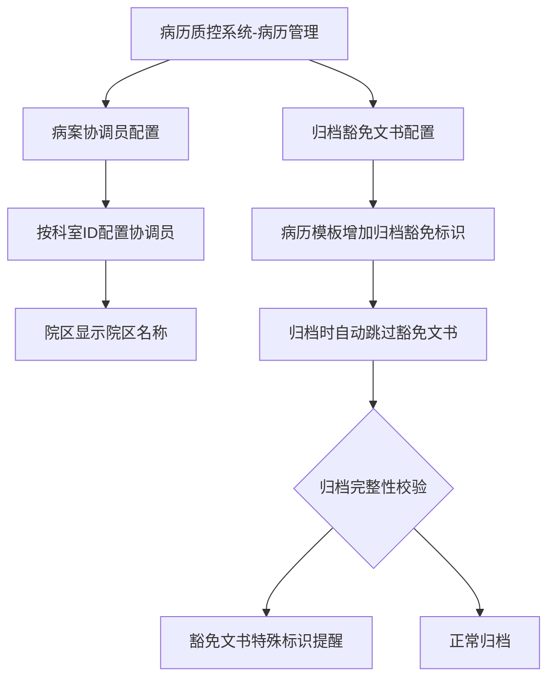
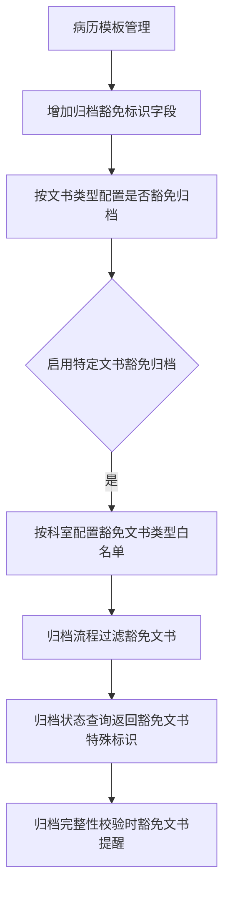

# BLGL-09-GDJY-010 归档配置与豁免 _ Analyst - Spec

> **需求编号**：BLGL-09-GDJY-010
> **父需求**：BLGL-09-GDJY
> **关联PM Spec**：BLGL-09-GDJY-010_归档配置与豁免_PM-spec.md
> **Spec版本**：V1.0
> **编写时间**：2026-08-15
> **编写人**：需求分析师

---

## 一、功能编号体系

### 1.1 功能层级结构

```
BLGL-09-GDJY-010-001: 病案协调员配置
  ├─ BLGL-09-GDJY-010-001-01: 协调员菜单
  └─ BLGL-09-GDJY-010-001-02: 科室/院区配置

BLGL-09-GDJY-010-002: 归档豁免文书
  ├─ BLGL-09-GDJY-010-002-01: 归档豁免标识
  ├─ BLGL-09-GDJY-010-002-02: 按科室配置豁免白名单
  └─ BLGL-09-GDJY-010-002-03: 归档跳过豁免文书

BLGL-09-GDJY-010-003: 归档状态图标
  └─ BLGL-09-GDJY-010-003-01: 已归档/撤销归档/召回状态图标

BLGL-09-GDJY-010-004: 科主任标识读取
  └─ BLGL-09-GDJY-010-004-01: 主数据科主任标识

BLGL-09-GDJY-010-005: 病历审核界面
  └─ BLGL-09-GDJY-010-005-01: 病历归档菜单下病历审核

BLGL-09-GDJY-010-006: 归档提示信息
  └─ BLGL-09-GDJY-010-006-01: EG005=60无纸化提示优化
```

### 1.2 功能编号表

| REQ-ID | 功能名称 | 类型 | 优先级 | 说明 |
|--------|---------|------|--------|------|
| BLGL-09-GDJY-010-001 | 病案协调员配置 | 功能 | P1 | 协调员配置 |
| BLGL-09-GDJY-010-001-01 | 协调员菜单 | 子功能 | P1 | 病历质控系统病历管理下新增 |
| BLGL-09-GDJY-010-001-02 | 科室/院区配置 | 子功能 | P1 | 按科室ID配置，院区显示院区名称 |
| BLGL-09-GDJY-010-002 | 归档豁免文书 | 功能 | P1 | 归档豁免 |
| BLGL-09-GDJY-010-002-01 | 归档豁免标识 | 子功能 | P1 | 病历模板增加归档豁免标识 |
| BLGL-09-GDJY-010-002-02 | 按科室配置豁免白名单 | 子功能 | P1 | 支持按科室配置豁免文书类型 |
| BLGL-09-GDJY-010-002-03 | 归档跳过豁免文书 | 子功能 | P1 | 归档流程过滤豁免文书 |
| BLGL-09-GDJY-010-003 | 归档状态图标 | 功能 | P2 | 状态图标显示 |
| BLGL-09-GDJY-010-003-01 | 状态图标 | 子功能 | P2 | 已归档/撤销归档/召回图标 |
| BLGL-09-GDJY-010-004 | 科主任标识读取 | 功能 | P1 | 主数据科主任标识 |
| BLGL-09-GDJY-010-004-01 | 主数据科主任标识 | 子功能 | P1 | 病案审核/病历解锁审核 |
| BLGL-09-GDJY-010-005 | 病历审核界面 | 功能 | P2 | 病历审核界面 |
| BLGL-09-GDJY-010-005-01 | 病历归档菜单下病历审核 | 子功能 | P2 | 职称/工号配置权限 |
| BLGL-09-GDJY-010-006 | 归档提示信息 | 功能 | P2 | 提示优化 |
| BLGL-09-GDJY-010-006-01 | EG005=60无纸化提示 | 子功能 | P2 | 提示配置病案系统归档管理 |

---

## 二、核心业务流程

### 2.1 病案协调员配置流程



### 2.2 归档豁免流程



---

## 三、功能规格说明

### BLGL-09-GDJY-010-001: 病案协调员配置

#### 3.1.1 功能概述

病历质控系统→病历管理菜单下新增菜单"病案协调员配置"，功能实现参照"会诊管理系统→院总权限配置"。表模型申请了科室 ID，先用科室 ID 代替科室编码；院区显示院区名称，不是院区别名。

#### 3.1.2 用户角色

| 角色 | 使用场景 | 权限要求 | 操作频率 |
|------|---------|---------|---------|
| 病案管理员 | 配置病案协调员 | 配置权限 | 低频 |

#### 3.1.3 业务流程（Given/When/Then）

**Scenario 1: 病案协调员配置（主流程）**

```gherkin
Given:
  - 病历质控系统-病历管理菜单

When:
  - 打开"病案协调员配置"菜单

Then:
  - 新增病案协调员配置
  - 按科室 ID 配置（院区显示院区名称）
```

#### 3.1.4 数据字段定义

| 字段名 | 类型 | 必填 | 默认值 | 取值范围 | 说明 | 概念ID |
|--------|------|------|--------|---------|------|--------|
| 科室ID | Long | 是 | - | - | 病案协调员配置 | ⏳ 待确认 |
| 院区名称 | String | 否 | - | - | 显示院区名称 | ⏳ 待确认 |
| inpatEmrSetFilingId | Long | 否 | - | - | 归档表主键（INP_EMR_ARCHIVE_ID，代码 InpatientEmrArchivePO） | ⏳ 待确认 |
| statusCode | Long | 否 | - | 399058142/399058143 | 归档状态（INP_EMR_ARCHIVE_STATUS，代码） | ⏳ 待确认 |
| emrMrtMonitorId | Long | 否 | - | - | 召回修改限制监控项（INP_EMR_RECALL_LIMIT，代码 InpatientEmrRecallLimitPO） | ⏳ 待确认 |
| conceptId | String | 否 | - | - | 召回修改限制数据元概念ID（INP_EMR_RECALL_LIMIT，代码） | ⏳ 待确认 |

#### 3.1.5 验收标准

| AC编号 | 验收标准 | 对应REQ-ID | 验证方法 | 验证场景 |
|--------|---------|-----------|---------|---------|
| AC-001 | 病案协调员配置按科室/院区生效 | BLGL-09-GDJY-010-001 | 功能测试 | Scenario 1 |

---

### BLGL-09-GDJY-010-002: 归档豁免文书

#### 3.2.1 功能概述

住院医师站支持配置病历不参与归档（如诊断证明）。在病历模板管理中增加"归档豁免"标识字段，支持按文书类型配置是否豁免归档控制；新增系统级开关"启用特定文书豁免归档"，支持按科室配置豁免文书类型白名单；归档时自动跳过豁免文书的归档处理；归档状态查询接口返回豁免文书特殊标识；增加归档完整性校验时的豁免文书提醒。

#### 3.2.2 用户角色

| 角色 | 使用场景 | 权限要求 | 操作频率 |
|------|---------|---------|---------|
| 病案管理员 | 配置归档豁免 | 配置权限 | 低频 |

#### 3.2.3 业务流程（Given/When/Then）

**Scenario 1: 归档豁免配置（主流程）**

```gherkin
Given:
  - 病历模板管理

When:
  - 在模板属性中增加"归档豁免"复选框

Then:
  - 勾选后该类型文书不受归档控制
  - 支持按科室配置豁免文书类型白名单
  - 归档时自动跳过豁免文书的归档处理
  - 归档状态查询返回豁免文书特殊标识
```

**Scenario 2: 异常——归档豁免未生效**

```gherkin
Given:
  - 病历归档后部分不归档病历（如诊断证明）

When:
  - 查看归档状态

Then:
  - 归档豁免文书仍可新增修改删除（问题）
  - 需配置归档豁免标识
```

#### 3.2.4 数据字段定义

| 字段名 | 类型 | 必填 | 默认值 | 取值范围 | 说明 | 概念ID |
|--------|------|------|--------|---------|------|--------|
| 归档豁免标识 | Boolean | 否 | 否 | 是/否 | 文书是否豁免归档 | ⏳ 待确认 |
| 启用特定文书豁免归档 | Boolean | 否 | - | 是/否 | 系统级开关 | ⏳ 待确认 |

#### 3.2.5 验收标准

| AC编号 | 验收标准 | 对应REQ-ID | 验证方法 | 验证场景 |
|--------|---------|-----------|---------|---------|
| AC-002 | 归档豁免文书配置生效，归档时自动跳过豁免文书 | BLGL-09-GDJY-010-002 | 功能测试 | Scenario 1 |

---

### BLGL-09-GDJY-010-003: 归档状态图标

#### 3.3.1 功能概述

已归档状态下，判断病历已打印，病历内容图标显示为"已归档 已打印"；撤销归档状态下判断病历已打印，图标显示为"撤销归档 已打印"；归档召回后状态图标显示"撤销归档 已打印"；病历撤销后病历撤销提交、保存、提交正常显示状态图标。备注：撤销归档是直接将患者撤销，不走申请，目前前端判断。

#### 3.3.2 用户角色

| 角色 | 使用场景 | 权限要求 | 操作频率 |
|------|---------|---------|---------|
| 住院医生 | 查看病历内容图标 | 病历书写权限 | 高频 |

#### 3.3.3 业务流程（Given/When/Then）

**Scenario 1: 归档状态图标（主流程）**

```gherkin
Given:
  - 病历已归档且已打印

When:
  - 查看病历内容图标

Then:
  - 显示"已归档 已打印"
  - 撤销归档状态下显示"撤销归档 已打印"
  - 病历撤销后撤销提交/保存/提交正常显示状态图标
```

#### 3.3.4 数据字段定义

| ⏳ 待确认 | 归档状态图标无独立业务字段 | 依赖归档状态/打印状态 |

#### 3.3.5 验收标准

| AC编号 | 验收标准 | 对应REQ-ID | 验证方法 | 验证场景 |
|--------|---------|-----------|---------|---------|
| AC-003 | 已归档/撤销归档/召回后病历内容图标正确显示 | BLGL-09-GDJY-010-003 | 功能测试 | Scenario 1 |

---

### BLGL-09-GDJY-010-004: 科主任标识读取

#### 3.4.1 功能概述

大同希望病案审核、病历解锁审核的科主任都要使用主数据的科主任标识，而非角色。病案召回配置、时限锁定配置读取主数据科主任标识；医生站-日常管理-召回审核-待我审核、病历解锁审核的审核权限需要依据登录员工是否有科主任标识进行判断和加载对应的审核数据。

#### 3.4.2 用户角色

| 角色 | 使用场景 | 权限要求 | 操作频率 |
|------|---------|---------|---------|
| 科主任 | 病案审核/病历解锁审核 | 主数据科主任标识 | 中频 |

#### 3.4.3 业务流程（Given/When/Then）

**Scenario 1: 科主任标识读取（主流程）**

```gherkin
Given:
  - 病案召回配置、时限锁定配置

When:
  - 病案审核/病历解锁审核

Then:
  - 读取主数据科主任标识而非用户角色
  - 依据登录员工是否有科主任标识判断和加载审核数据
```

**Scenario 2: 异常——科主任权限判断错误**

```gherkin
Given:
  - 病案审核、病历解锁审核的科主任

When:
  - 判断审核权限

Then:
  - 原逻辑读取用户角色配置的业务科室主任（问题）
  - 需读取主数据下发的主任角色标识
```

#### 3.4.4 数据字段定义

| ⏳ 待确认 | 科主任标识无独立业务字段 | 依赖主数据角色标识 |

#### 3.4.5 验收标准

| AC编号 | 验收标准 | 对应REQ-ID | 验证方法 | 验证场景 |
|--------|---------|-----------|---------|---------|
| AC-004 | 科主任审核权限读取主数据科主任标识 | BLGL-09-GDJY-010-004 | 功能测试 | Scenario 1 |

---

### BLGL-09-GDJY-010-005: 病历审核界面

#### 3.5.1 功能概述

线下需求：病历归档菜单下增加"病历审核"界面，可以根据职称、工号单独配置权限，界面与归档查询保持一致；病历未归档时操作列"审核"按钮置亮，已归档则置灰。

#### 3.5.2 用户角色

| 角色 | 使用场景 | 权限要求 | 操作频率 |
|------|---------|---------|---------|
| 审核人员 | 病历审核 | 按职称/工号配置权限 | 中频 |

#### 3.5.3 业务流程（Given/When/Then）

**Scenario 1: 病历审核界面（主流程）**

```gherkin
Given:
  - 病历归档菜单下

When:
  - 打开病历审核界面

Then:
  - 可以根据职称、工号单独配置权限
  - 界面与归档查询保持一致
  - 病历未归档时操作列"审核"按钮置亮
  - 已归档则置灰
```

#### 3.5.4 数据字段定义

| ⏳ 待确认 | 病历审核界面无独立业务字段 | 依赖归档查询字段 |

#### 3.5.5 验收标准

| AC编号 | 验收标准 | 对应REQ-ID | 验证方法 | 验证场景 |
|--------|---------|-----------|---------|---------|
| AC-005 | 病历审核界面按职称/工号配置权限，未归档审核按钮置亮、已归档置灰 | BLGL-09-GDJY-010-005 | 功能测试 | Scenario 1 |

---

### BLGL-09-GDJY-010-006: 归档提示信息

#### 3.6.1 功能概述

参数 EG005 设置为 60无纸化时，优化提示信息：已启用病案无纸化流程，当前界面不可使用，请配置启用"病案系统中的归档管理"菜单进行归档操作。

#### 3.6.2 用户角色

| 角色 | 使用场景 | 权限要求 | 操作频率 |
|------|---------|---------|---------|
| 住院医生 | 归档操作 | 病历书写权限 | 中频 |

#### 3.6.3 业务流程（Given/When/Then）

**Scenario 1: EG005=60无纸化提示（主流程）**

```gherkin
Given:
  - 参数 EG005 设置为 60无纸化

When:
  - 医生使用归档菜单

Then:
  - 提示"已启用病案无纸化流程，当前界面不可使用，请配置启用'病案系统中的归档管理'菜单进行归档操作"
```

#### 3.6.4 数据字段定义

| ⏳ 待确认 | 归档提示无独立业务字段 | 依赖 EG005 参数 |

#### 3.6.5 验收标准

| AC编号 | 验收标准 | 对应REQ-ID | 验证方法 | 验证场景 |
|--------|---------|-----------|---------|---------|
| AC-006 | EG005=60无纸化时提示信息优化 | BLGL-09-GDJY-010-006 | 功能测试 | Scenario 1 |
| AC-007 | 召回修改配置接口 emr_recall_limit/query 返回召回修改限制配置，召回流程配置接口 recall_filing_process_config/query/by_example 返回召回流程配置 | BLGL-09-GDJY-010-002 | 接口测试 | Scenario 1 |

---

## 四、排除范围

本需求不包含以下功能项：

1. **病历自动归档/手动归档** —— BLGL-09-GDJY-001/-002
2. **病历撤销归档** —— BLGL-09-GDJY-003
3. **病历召回申请/召回审核** —— BLGL-09-GDJY-004/-005
4. **病历借阅流程** —— BLGL-09-GDJY-006
5. **三方病案系统对接** —— BLGL-09-GDJY-007
6. **归档查询与统计** —— BLGL-09-GDJY-008
7. **归档校验与提醒** —— BLGL-09-GDJY-009

---

## 五、业务规则清单

| 规则ID | 规则名称 | 规则描述 | 来源 | 优先级 |
|--------|---------|---------|------|--------|
| BR-001 | 协调员配置 | 病历质控系统病历管理下新增病案协调员配置菜单 |  | P1 |
| BR-002 | 归档豁免 | 病历模板增加归档豁免标识，归档时自动跳过豁免文书 | 2 | P1 |
| BR-003 | 科主任标识 | 病案审核/病历解锁审核读取主数据科主任标识而非角色 |  | P1 |
| BR-004 | 状态图标 | 已归档已打印显示"已归档 已打印"，撤销归档显示"撤销归档 已打印" | 1 | P2 |
| BR-005 | 病历审核 | 病历归档菜单下病历审核界面按职称/工号配置权限 |  | P2 |
| BR-006 | 归档提示 | EG005=60无纸化时提示配置病案系统归档管理 | 4 | P2 |
| BR-007 | 配置接口 | 召回修改配置接口 emr_recall_limit/query（出参 List<EmrRecallLimitQueryOutputVO>）、召回流程配置接口 recall_filing_process_config/query/by_example（出参 List<EmrRecallFilingProcessConfigQueryOutputVO>）、借阅流程配置接口 borrowing_process/query | 代码 | P1 |

---

## 六、关联文档

| 文档类型 | 文档路径 | 说明 |
|---------|---------|------|
| 功能点Spec（模块级） | 上级目录 BLGL-09-GDJY 归档借阅功能点Spec.md（V1.0） | 模块级功能点索引 |
| 功能Spec（业务背景与设计） | 本目录 BLGL-09-GDJY-010_归档配置与豁免-Spec.md（V1.0） | 业务背景与目标 Spec |
| Analyst-Spec（分析规格） | 本目录 BLGL-09-GDJY-010_归档配置与豁免_Analyst-spec.md（V1.0）（本文档） | 分析规格 |
| PM-Spec（需求规格） | 本目录 BLGL-09-GDJY-010_归档配置与豁免_PM-spec.md（V0.1） | PM 产出的 Spec 文档 |
| data-model.md | 待产出 | 架构师产出的数据建模文档 |
| design.md | 待产出 | 架构师产出的技术方案文档 |
| api-contract.md | 待产出 | 开发经理产出的 API 契约文档 |

---

## 七、待确认问题清单

| 编号 | 问题描述 | 缺失信息 | 影响范围 | 建议补充方 |
|------|---------|---------|---------|-----------|
| Q-001 | 病案协调员配置/归档豁免配置接口 | API 契约 | -Spec 第5章 | 开发经理 |
| Q-002 | 归档豁免标识概念 ID | 概念ID | 3.2.4 | 产品经理 |
| Q-003 | 病案协调员配置表模型 | 数据模型 | 3.1.4 | 架构师 |
| Q-004 | 归档豁免文书（2）具体类型 | 需求分析原文缺失 | 3.2.3 | 需求分析师 |
| Q-005 | 病历审核界面权限配置逻辑 | 需求分析原文缺失 | 3.5.3 | 需求分析师 |
| Q-006 | 性能指标（归档配置查询响应时间） | 资料区无量化指标 | -Spec 第8章 | 产品经理 |

---

## 填写检查清单

| 序号 | 检查项 | 是否完成 |
|:----:|--------|:--------:|
| 1 | 功能编号带父子层级 | ✅ |
| 2 | 每个 REQ-ID 有功能概述和用户角色 | ✅ |
| 3 | 主流程至少 1 个 Given/When/Then 场景 | ✅ |
| 4 | 异常流程至少 3 个 Given/When/Then 场景 | ✅ |
| 5 | 边界流程至少 2 个 Given/When/Then 场景 | ✅ |
| 6 | 每个 Given/When/Then 内容具体，不模糊 | ✅ |
| 7 | 数据字段定义完整（字段名、类型、必填、说明、概念ID） | ✅ |
| 8 | 验收标准 AC 编号独立，可验证 | ✅ |
| 9 | 验收标准无"功能正常"等模糊表述 | ✅ |
| 10 | 排除范围明确列出 | ✅ |
| 11 | 业务规则清单列出所有规则，每条标注来源 | ✅ |
| 12 | 流程图使用 Mermaid 格式（≥2 个） | ✅ |
| 13 | 关联文档索引包含 Phase 1 功能点Spec | ✅ |
| 14 | 待确认问题清单汇总了全文所有 ⏳ 项 | ✅ |
| 15 | 全文无占位符 `< >` 残留 | ✅ |
| 16 | 全文陈述可溯源至资料区（S1~S10 溯源核查） | ✅ |
| 17 | 人工审核确认完成 | ⏳ 待确认 |

---

**文档状态**：⬜ 待审核
**维护责任**：需求分析师规范组
**下次更新**：根据评审反馈优化

---

## 版本历史

| 版本 | 日期 | 变更说明 | 编写人 |
|------|------|---------|--------|
| V1.0 | 2026-08-15 | 初始版本 | 需求分析师 |
