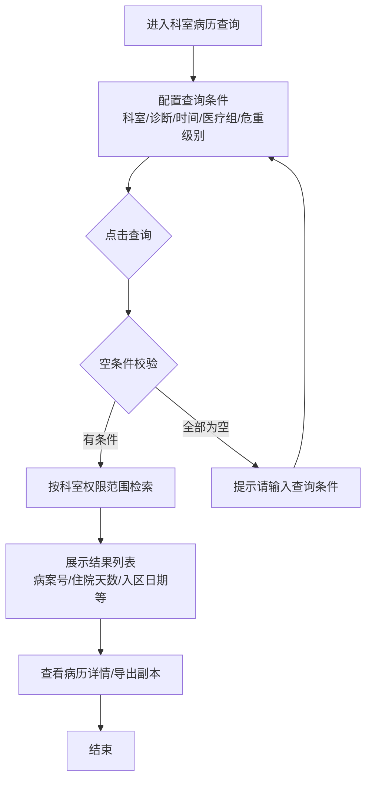
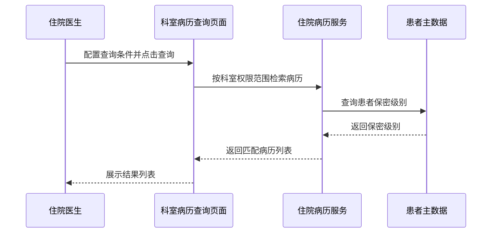

# BLGL-10-BLCX-001 科室病历查询-Spec

> **功能编号**：BLGL-10-BLCX-001
> **文档类型**：功能Spec（业务背景与设计）
> **文档版本**：V1.0
> **编写时间**：2026-08-14
> **编写人**：RACC

---

## 文档索引

本节提供本文档的章节结构索引与关联文档索引，便于读者快速定位与检索。

#### 章节索引

**Spec（研发视角）**

| 章节号 | 章节名称 |
|--------|---------|
| 1、 | 文档概述 |
| 2、 | 功能背景与定位 |
| 3、 | 业务流程设计 |
| 4、 | 数据模型设计 |
| 5、 | 接口契约设计 |
| 6、 | 技术方案设计 |
| 7、 | 测试用例预设计 |
| 8、 | 非功能性要求 |
| 9、 | 依赖与风险 |
| 10、 | 附录 |

> 第1~2章为业务层，第3~10章为设计层。资料区（功能清单 + 历史需求）信息不足的章节用 `⏳ 待确认` 标记，不编造。

**PM-Spec（需求规格）**

| 章节号 | 章节名称 |
|--------|---------|
| 一 | 目标 |
| 二 | 约束 |
| 三 | 验收标准 |
| 四 | 排除范围 |
| 五 | 关键决策记录 |
| 六 | 优先级 |
| 附录 | 填写检查清单 |

**Analyst-Spec（分析规格）**

| 章节号 | 章节名称 |
|--------|---------|
| 一 | 功能编号体系 |
| 二 | 核心业务流程 |
| 三 | 功能规格说明 |
| 四 | 排除范围 |
| 五 | 业务规则清单 |
| 六 | 关联文档 |
| 七 | 待确认问题清单 |
| - | 填写检查清单 | 检查项与完成状态 |

#### 版本历史

| 版本 | 日期 | 变更说明 | 编写人 |
|------|------|---------|--------|
| V1.0 | 2026-08-14 | 初始版本 | RACC |

#### 关联文档索引

| 序号 | 文档名称 | 文档类型 | 版本 | 位置 |
|------|---------|---------|------|------|
| 1 | BLGL-10-BLCX-001_科室病历查询-Spec.md | 功能Spec（业务背景与设计）（本文档） | V1.0 | 本目录 |
| 2 | BLGL-10-BLCX-001_科室病历查询_PM-spec.md | PM-Spec（需求规格） | V0.1 | 本目录 |
| 3 | BLGL-10-BLCX-001_科室病历查询_Analyst-spec.md | Analyst-Spec（分析规格） | V1.0 | 本目录 |
| 4 | BLGL-10-BLCX 10病历查询功能点Spec.md | 功能点Spec（模块级） | V1.1 | 上级目录 |

---

## 1、文档概述

### 1.1、文档目的

本文档旨在明确"科室病历查询"功能（BLGL-10-BLCX-001）的业务背景与设计方案，为需求分析、研发实现、测试验收及评审提供统一的业务上下文、设计口径与决策依据。

**具体目的包括**：

1. 梳理科室病历查询功能的业务由来与历史需求演进脉络，说明"为什么要做"
2. 明确功能的定位边界、目标用户与核心价值，回答"做成什么"
3. 描述功能的业务流程、数据模型、接口契约与技术方案，回答"怎么做"
4. 预设计测试用例并明确非功能性要求、依赖与风险，为研发与验收提供依据
5. 作为 Analyst-Spec（功能编号体系、功能详情、业务规则、验收标准等章节）的业务前提与设计输入，保证各层文档业务口径一致。

### 1.2、文档范围

#### 1.2.1 纳入范围

本文档覆盖科室病历查询的完整业务背景与设计，包括：

- 本科室权限范围内按多条件检索住院患者病历（诊断/手术/时间/医疗组/危重级别等）
- 查询结果列表展示（含住院天数、病案号、入区日期、出院结算日期等列）
- 查询条件编辑与执行、查询结果列选项设置
- 科室范围限定与保密患者权限控制
- 病历详情查看与导出副本（支撑能力，详见基础能力附录）

#### 1.2.2 排除范围

本文档不涉及以下内容（详见其他功能点或模块）：

- 全院病历查询（跨科室不限权限检索）—— BLGL-10-BLCX-002
- 病历结构化查询（按元素/段落检索）—— BLGL-10-BLCX-003
- 病历详情查看、导出副本、查询条件保存、列选项设置、科室分布概况、参数配置 —— Phase 1 功能点Spec 第6章基础能力（BC-BLCX-001~007）
- 病历书写、归档借阅、模板管理等 —— 其他模块

### 1.3、术语定义

| 术语 | 定义 |
|------|------|
| 科室病历查询 | 住院医生在本科室权限范围内对住院患者病历进行多条件检索的查询场景 |
| 科室权限范围 | 查询结果受医生所属科室权限限制，未授权科室的患者不可见 |
| 危重级别 | 患者当前床位卡的危重程度标识（病危/病重），用于筛选重点病人 |
| 保密患者 | 已配置保密级别的患者，仅保密级别达标的医生可查看 |
| 出院结算日期 | 患者办理结算后的出院时间；区别于医生开立出院医嘱的"出院时间" |
| 溯源水印 | 含电脑IP、工号、时间的界面水印，用于病历信息泄露溯源 |

> ⏳ 待确认：上述术语定义来自历史需求描述归纳，规范术语表待产品文档确认。

### 1.4、阅读指南

- **章节关系**：第1~2章为阅读铺垫与业务全貌（背景、定位、用户、价值）；第3~10章为设计实现层（流程、数据、接口、技术、测试、非功能、依赖风险、附录）。与 Analyst-Spec、PM-Spec 的详细规则/验收口径互相引用，保持一致。
- **读者对象**：
 - 产品经理/需求分析师：阅读第1~2章了解业务全貌，据此维护 PM-Spec 与功能清单
 - 研发：阅读第3~6章用于开发实现，第9~10章用于依赖评估与联调
 - 测试：阅读第3章、第7~8章用于用例设计与验收
 - 评审人员：以本文档为业务口径与设计基准，核对各层文档一致性。

### 1.5、参考文档

| 序号 | 文档名称 | 版本/日期 |
|------|---------|
| 1 | 【历史需求】住院病历的历史需求.xlsx | - |
| 2 | BLGL-10-BLCX-001_科室病历查询_PM-spec.md | V0.1 |
| 3 | BLGL-10-BLCX-001_科室病历查询_Analyst-spec.md | V1.0 |
| 4 | BLGL-10-BLCX 10病历查询功能点Spec.md | V1.1 |
| 5 | WiNEX-住院病历查询功能清单_20260330.md | 2026-03-30 |

---

## 2、功能背景与定位

### 2.1 功能背景

科室病历查询是住院病历管理模块中面向住院医生的日常病历检索入口，需满足：

- **管理要求**：住院医生需要在本部门业务范围内快速检索和定位患者病历，支持集中打印
- **现状痛点**：
 - 诊断检索失效：科室病历查询输入诊断关键字后无查询结果，前端字段名拼写错误（`diagonosisKey`）且未写入病历的诊断检索不到
 - 危重级别筛选无效：原接口同步入院登记危重级别，无法按患者当前床位卡危重级别筛选
 - 住院天数为空：固定从病案首页表查询，当医院使用病案系统病案首页时该表未落库导致为空
 - 查询结果列缺失：病案号、入区日期、出院结算日期等列缺失，需反复切换页面确认
 - 取消住院患者未过滤：患者取消入区后仍显示"已入院已入区"
- **历史需求演进**：从早期单一条件查询逐步演进——新增查询条件（身份证号/转出日期/病历状态/医疗组，）→ 新增诊断/手术/危重级别/离院方式等筛选（、615719、1386423、1722553）→ 结果列增强（病案号/入区日期/出院结算日期，、1653780、1585781）→ 权限与隐私控制（保密患者、溯源水印，、742219、1614724）

### 2.2 功能定位

"科室病历查询"是 WiNEX 病历管理-病历查询模块的核心检索能力之一，定位为：

- **本科室病历检索入口**：住院医生在本科室权限范围内快速定位患者病历
- **多维条件组合检索**：按诊断/手术/时间/医疗组/危重级别等多条件组合过滤
- **临床决策支撑**：通过危重级别、重点病人筛选辅助医生快速关注重点患者
- **病历查看前置环节**：查询结果承载详情查看、导出副本等后续操作

### 2.3 目标用户

| 用户角色 | 主要使用场景 |
|---------|-------------|
| 住院医生 | 在本科室权限范围内检索患者病历、查看详情、集中打印 |
| 医务科主任/科主任 | 查看本科室病历数据、查看既往病历（含已停用科室历史数据） |

### 2.4 核心价值

| 价值维度 | 价值描述 |
|---------|---------|
| 效率提升 | 多维条件组合检索帮助医生快速定位患者病历 |
| 权限合规 | 科室范围限定+保密患者控制，防止越权查看病历 |
| 信息准确 | 修正出院结算日期、住院天数取值口径，避免理解混淆 |
| 安全溯源 | 溯源水印支持病历信息泄露定位 |

---

## 3、业务流程设计（Given/When/Then）

> 场景从历史需求分析原文提取，每个场景有需求编号依据。

### 3.1 主流程

**Scenario 1: 科室病历多条件检索**

```gherkin
Given:
 - 住院医生已登录住院医生站并具有科室病历查询菜单权限
 - 医生所属科室已有住院患者病历数据
 - 系统已配置查询时间范围参数（COMMON201，默认3个月）

When:
 - 医生进入"日常管理-病历管理-科室病历查询"
 - 配置查询条件：科室、诊断、出院时间、医疗组等（多条件可组合）
 - 点击查询按钮

Then:
 - 系统在科室权限范围内检索匹配的患者病历
 - 结果列表展示患者病历信息（含病案号、住院天数、入区日期、出院结算日期等列）
 - 医生可点击查看病历详情或导出副本
```

### 3.2 异常流程

**Scenario 2: 业务异常——诊断检索失效**

```gherkin
Given:
 - 医生在科室病历查询输入诊断关键字
 - 前端传递字段名为 diagonosisKey（拼写错误）
 - 部分诊断尚未写入病历中

When:
 - 医生点击查询按钮

Then:
 - 系统返回无查询结果（诊断检索失效）
 - ⏳ 待确认：正确诊断字段名与未入病历诊断的检索逻辑待确认
```

**Scenario 3: 数据异常——住院天数为空**

```gherkin
Given:
 - 医院使用病案系统的病案首页（参数 COMMON072=否）
 - 病历系统的病案首页表 INP_EMR_MAHP 未落库

When:
 - 医生查询科室病历并查看结果列表

Then:
 - 住院天数列显示为空
 - 系统应根据 COMMON072 动态选择住院天数查询来源
```

**Scenario 4: 系统异常——查询界面打开空白**

```gherkin
Given:
 - 科室病历查询界面依赖的病历数据源服务异常或数据加载失败

When:
 - 医生打开科室病历查询界面

Then:
 - 界面显示空白，无法展示查询结果
 - ⏳ 待确认：界面空白时的错误提示与降级处理待确认
```

### 3.3 边界流程

**Scenario 5: 边界场景——取消住院患者**

```gherkin
Given:
 - 患者已取消入区
 - 参数 ADMITTED_CANCEL_DEL_CODE（新患者入区取消是否自动删除病历/病历簿）

When:
 - 医生查询科室病历

Then:
 - 参数值为是：该患者不再出现在查询列表中
 - 参数值为否（默认）：患者仍出现，在院状态列应反映取消状态而非"已入院已入区"
```

**Scenario 6: 边界场景——已停用科室历史病历**

```gherkin
Given:
 - 医院存在已停用科室，其历史病历数据仍存在

When:
 - 医生在科室病历查询选择已停用科室

Then:
 - 系统支持查询已停用科室的历史病历数据
 - 检索条件中已停用科室名称增加"（已停用）"标识
```

---

## 4、数据模型设计

> 数据模型信息来自代码扫描（`E:\39EMR\sr-next`）和历史需求。标注 `` 的表名/字段来自 PO 实体，标注 `` 的来自需求文本。

### 4.1 核心数据结构

#### 4.1.1 核心查询入参（DailyManageInpRhbRecordQueryInputAO）

| 字段名 | 类型 | 必填 | 备注 |
|--------|------|------|------|
| keySearch | String | 否 | 关键词检索 |
| deptIds | List<Long> | 否 | 科室范围（多选） |
| currentWardId | Long | 否 | 病区 |
| genderCode | Long | 否 | 性别 |
| admittedAtStart/End | Date | 否 | 入院日期范围 |
| admittedToWardAtStart/End | Date | 否 | 入区日期范围 |
| dischargedAtStart/End | Date | 否 | 出院日期范围 |
| dischargedFromWardAtStart/End | Date | 否 | 出区日期范围 |
| inpatientStatus | Long | 否 | 在院状态 |
| severityLevelCode | Long | 否 | 当前危重级别（病危/病重） |
| pathologicalStatus | Long | 否 | 病理状态 |
| medicalInsuranceCodes | List<Long> | 否 | 医保类型（多选 |
| dutyDoctId / nurseId | Long | 否 | 责任医生/责任护士 |
| diagnosisTypeCodes | List<Long> | 否 | 诊断类别 |
| diagonosisKey | String | 否 | 诊断检索关键字（**当前为拼写错误字段，正确为 diagnosisKey**） |
| emrName / emrMonitor | String/Long | 否 | 文书名称/监控类型 |
| admissionNumber | String | 否 | 住院号 |
| patientName | String | 否 | 姓名 |
| idCardNo | String | 否 | 身份证号 |
| medicalTeamIds | List<Long> | 否 | 医疗组（多选 |
| statusCode / sealedStatus | Long | 否 | 病历状态/封存状态 |
| surgeryDateStart | Date | 否 | 手术日期范围 |

> ⏳ 待确认：完整入参字段（出生日期、病案号、离院方式等新增条件）待接口契约文档补充。

#### 4.1.2 核心表/实体

| 表/实体 | 关键字段 | 说明 |
|---------|---------|------|
| INPATIENT_RHB_RECORD（InpatientRhbRecordPO） | INP_RHB_RECORD_ID、PATIENT_NAME、ENCOUNTER_ID、WARD_DISCHARGED_AT、DISCHARGED_AT、CURRENT_DEPT_ID、CURRENT_DEPT_NAME、ADMISSION_NUMBER、BED_NO | 病历簿记录表，科室病历查询主数据源 |
| INPATIENT_RHB_DIAGNOSIS（InpatientRhbDiagnosisPO） | INP_RHB_RECORD_ID、ENCOUNTER_ID、DIAGNOSIS_TYPE_CODE、DIAGNOSIS_PRI_SEC_CODE、DIAGNOSIS_CODE | 病历诊断表，支持全部诊断（主+次）检索 |
| INPATIENT_RECORD | CASE_NO | 病案号取值 |
| INPATIENT_SETTLEMENT | SETTLED_AT | 结算日期 |

> ⏳ 待确认：病案号/入区日期/出院结算日期列的字段映射待确认。

### 4.2 状态定义

| 状态码 | 状态名称 | 说明 |
|--------|---------|------|
| statusCode | 病历状态 | InpRhbRecordInfoOutputVO.statusCode |
| inpatientStatus | 在院状态 | 已入院入区等；取消入区患者按 ADMITTED_CANCEL_DEL_CODE 控制 |

> ⏳ 待确认：状态枚举值定义未在代码扫描中提取完整。

### 4.3 系统参数定义

| 参数编码 | 参数名称 | 说明 |
|---------|---------|------|
| COMMON201 | 病历查询相关功能最大允许查询多少个月的数据 | 默认3，控制查询时间范围 |
| COMMON072 | 住院病历是否启用病案首页参数 | 控制住院天数查询来源 |
| COMMON269 | 是否启用用户查询保密患者的功能 | 默认否，控制保密患者查询 |
| ADMITTED_CANCEL_DEL_CODE | 新患者入区取消是否自动删除病历/病历簿 | 默认否，控制取消入区患者显示 |

---

## 5、接口契约设计

> 接口信息来自代码扫描（`E:\39EMR\sr-next`）的 Controller + ApiPathConstants。标注 ``。

### 5.1 API列表

| 序号 | API名称（代码函数） | 路径 | 方法 | 说明 |
|:----:|---------|------|:----:|------|
| 1 | queryDailyManageInpRhbRecordByExample | /api/v1/app_record_inpatient/emr_inpatient/query_daily_manage_inp_rhb_record | POST | 日常管理-病历查询-查询数据 |
| 2 | exportDailyManageInpRhbRecord | /api/v1/app_record_inpatient/emr_inpatient/export_daily_manage_inp_rhb_record | POST | 日常管理-病历查询-导出 |
| 3 | queryBothDeptRecordList | /api/v1/app_record_inpatient/emr_inpatient/query_both_dept_record | POST | 科室病历双组查询（本科室患者+转科患者，） |
| 4 | queryInpRHBRecord | /api/v1/app_record_inpatient/emr_inpatient/emr_rhb_record/query_inp_rhb_record | POST | 获取患者病历簿列表 |
| 5 | getDailyManageInpRhbRecordStatistics | /api/v1/app_record_inpatient/emr_inpatient/inp_rhb_record/get_statistics_data | POST | 疑难病历人数/手术病历人数/科室分布情况 |
| 6 | getInpRhbRecordQueryConditionDataMonitor | /api/v1/app_record_inpatient/emr_inpatient/inp_rhb_record/get_query_condition_data_monitor | GET | 获取查询条件数据（监控类型） |
| 7 | getPatientExpenseAmount | /api/v1/app_record_inpatient/emr_inpatient/patient/get_patient_expense_amount | POST | 获取患者费用 |
| 8 | queryTagOptions | /api/v1/app_record_inpatient/emr_tags/query_tag_options | POST | 查询标签下拉数据（病种/术种，） |

> 前端实际请求前缀：`/inpatient-clinicalnote/api/v1/app_record_inpatient/`。

### 5.2 接口详细设计

#### 5.2.1 日常管理-病历查询-查询数据（queryDailyManageInpRhbRecordByExample）

**请求参数（DailyManageInpRhbRecordQueryInputAO）**:
```json
{
 "deptIds": [1001, 1002]
 "patientName": "张三"
 "diagonosisKey": "肺炎"
 "severityLevelCode": 1
 "admittedAtStart": "2026-05-01"
 "admittedAtEnd": "2026-08-01"
 "inpatientStatus": 1
 "pageNum": 1
 "pageSize": 20
}
```

**返回值（成功，WinPagedList<InpRhbRecordInfoOutputVO>）**:
```json
{
 "success": true
 "data": {
 "list": [
 {
 "encounterId": "1001"
 "admissionNumber": "IP123456"
 "patientName": "张三"
 "currentDeptName": "内科"
 "admittedAt": "2026-05-01"
 "dischargedAt": "2026-08-01"
 "genderName": "男"
 "age": "45"
 "dutyDoctName": "李医生"
 }
 ]
 "total": 5
 }
}
```

**返回值（失败）**:
```json
{
 "success": false
 "message": "查询失败"
 "data": null
}
```

> ⏳ 待确认：具体字段名/结构以接口契约文档为准，以上字段来自代码扫描的输入AO/输出VO。

### 5.3 错误码定义

| 错误码 | 错误信息 | 处理方式 |
|--------|---------|---------|
| ORA-00923 | 未找到要求的 FROM 关键字 |
| ⏳ 待确认 | 未经处理的异常 | 查询报"未经处理的异常" |

> ⏳ 待确认：业务错误码定义未在代码扫描中提取完整。

---

## 6、技术方案设计

### 6.1 页面路径

- **页面路径**: 住院医生站→日常管理→病历管理→科室病历查询
- **前端组件**: ClinicalnoteSearchManagement/index.vue → routerPages/ClinicalnoteSearch.vue（科室查询组件）
- **路由**: /clinicalnoteSearch（科室病历查询，EmrManage.js）
- **前端工程**: winning-webui-inpatient-clinicalnote-pango（Vue2 + element-ui）

### 6.2 技术栈

| 类别 | 技术 | 版本 |
|------|------|------|
| 前端框架 | Vue | 2.6.14 |
| 前端UI | element-ui | 2.13.0 |
| 后端框架 | Spring Boot（Java） | java.version 17 |
| 构建工具 | webpack / Maven | 前端 webpack + 后端 Maven |

### 6.3 关键技术点

- 诊断检索字段名修正：`diagonosisKey` → `diagnosisKey`（前端代码实际传递 diagonosisKey，后端 DTO 两个字段并存）
- 危重级别筛选改为按患者当前床位卡危重级别（护士站即时数据）而非入院登记
- 住院天数查询来源按 COMMON072 动态适配
- 诊断类别下拉分页参数 pageSize 过小导致选项截断，需调大
- 科室病历双组查询：本科室患者 + 转科患者（queryBothDeptRecordList）

### 6.4 部署方案

⏳ 待确认：部署方案未在资料区中找到。

---

## 7、测试用例预设计

> 测试用例从第3章业务流程和需求分析场景归纳。

### 7.1 功能测试

| 用例编号 | 测试场景 | Given | When | Then |
|---------|---------|-------|--------|
| TC-001 | 科室病历多条件检索 | 医生有科室权限、有病历数据 | 配置条件并点击查询 | 返回匹配病历列表 |
| TC-002 | 诊断检索 | 输入诊断关键字 | 点击查询 | 按诊断关键字筛选出患者 |
| TC-003 | 危重级别筛选 | 患者有当前危重级别 | 选择病危/病重筛选 | 按当前床位卡危重级别筛出患者 |

### 7.2 边界测试

| 用例编号 | 测试场景 | Given | When | Then |
|---------|---------|-------|--------|
| TC-004 | 取消住院患者 | 患者已取消入区 | 查询科室病历 | 按 ADMITTED_CANCEL_DEL_CODE 参数控制是否显示 |
| TC-005 | 已停用科室 | 选择已停用科室 | 点击查询 | 可查询历史病历，名称带"（已停用）" |

### 7.3 异常测试

| 用例编号 | 测试场景 | Given | When | Then |
|---------|---------|-------|--------|
| TC-006 | 住院天数为空 | 使用病案系统病案首页（COMMON072=否） | 查询查看列表 | 住院天数正确取值 |
| TC-007 | 界面空白 | 数据源异常 | 打开科室病历查询 | ⏳ 待确认：错误提示与降级处理 |

### 7.4 性能测试

| 用例编号 | 测试场景 | 指标 |
|---------|---------|
| TC-008 | 科室病历查询响应 |

---

## 8、非功能性要求

### 8.1 性能要求

| 指标 | 要求 |
|------|------|
| 查询响应时间 | ⏳ 待确认 |

### 8.2 安全要求

| 要求 | 说明 |
|------|------|
| 科室权限控制 | 查询结果受医生科室权限范围限制 |
| 保密患者控制 | 按员工保密级别过滤符合保密级别的患者数据 |
| 溯源水印 | 病历查询界面显示含IP+工号+时间的溯源水印 |

**医疗行业特殊要求**

| 要求 | 说明 |
|------|------|
| 病历信息泄露溯源 | 界面水印支持截图/拍照时的溯源追踪 |
| 模糊查询去空格 | 诊断/手术/文书名称模糊查询时去掉前后空格再匹配 |

### 8.3 可用性要求

| 指标 | 要求值 |
|------|--------|
| 可用性 | ⏳ 待确认 |

### 8.4 兼容性要求

| 类型 | 要求 |
|------|------|
| 病案首页来源适配 | 支持病历系统/病案系统两种病案首页来源（COMMON072） |
| 已停用科室数据 | 支持查询已停用科室的历史病历数据 |

---

## 9、依赖与风险

### 9.1 外部依赖

| 依赖项 | 说明 |
|--------|------|
| 病历系统病案首页数据 | 住院天数、病案首页数据 |
| 患者主数据（保密级别） | 患者/员工保密级别匹配 |
| 护士站危重级别数据 | 患者当前床位卡危重级别 |

### 9.2 风险项

| 风险项 | 等级 | 说明 | 应对方案 |
|--------|------|------|---------|
| 诊断检索失效 | 高 | 字段名拼写错误 + 未写入病历的诊断检索不到 | 修正字段名、明确检索口径 |
| 危重级别数据源不一致 | 中 | 护士站接口数据为即时数据，同步有延迟 | 明确数据刷新时机 |
| 取消入区患者显示偏差 | 中 | 参数控制不当时在院状态列显示错误 | 按参数逻辑刷新在院状态 |

---

## 10、附录

### 10.1 流程图



### 10.2 时序图



### 10.3 参考文档

- WiNEX-住院病历查询功能清单_20260330.md（H001、§3 参数配置、§6 功能边界）
- 【历史需求】住院病历的历史需求.xlsx（、1386423、1567209、1585781、1663893、1700409、1593810、736220、742219、1614724 等 35 条）
- BLGL-10-BLCX 10病历查询功能点Spec.md（V1.1，第5章 -001 行）
- 关联Spec: BLGL-10-BLCX-002_全院病历查询-Spec.md（同属查询场景，共享结果列表/详情/导出支撑能力）

---

## 填写检查清单

| 序号 | 检查项 | 是否完成 |
|:----:|--------|:--------:|
| 1 | 章节索引与正文章节一致 | ✅ |
| 2 | 版本历史记录完整 | ✅ |
| 3 | 关联文档索引已登记全部Spec | ✅ |
| 4 | 文档目的明确回答"为什么做/做成什么/怎么做" | ✅ |
| 5 | 纳入范围/排除范围清晰 | ✅ |
| 6 | 术语定义覆盖关键概念，从资料区可溯源 | ✅ |
| 7 | 参考文档已登记 | ✅ |
| 8 | 功能背景基于法规/规范/需求来源组织 | ✅ |
| 9 | 功能定位体现业务价值（3~5个定位点） | ✅ |
| 10 | 目标用户角色覆盖完整，在需求原文中有出处 | ✅ |
| 11 | 核心价值可陈述，与 Phase 1 口径一致 | ✅ |
| 12 | 业务流程：主流程≥1、异常≥3、边界≥2，Given/When/Then 具体 | ✅ |
| 13 | 数据模型：字段/表/状态/参数可溯源 | ✅ |
| 14 | 接口契约：API列表+详细设计+错误码齐全或标记待确认 | ✅ |
| 15 | 技术方案：页面路径/技术栈/关键点/部署方案或标记待确认 | ✅ |
| 16 | 测试用例：功能/边界/异常/性能覆盖 | ✅ |
| 17 | 非功能性要求：性能/安全/可用性/兼容性指标可量化或标记待确认 | ✅ |
| 18 | 依赖与风险：外部依赖登记完整 | ✅ |
| 19 | 附录：流程图/时序图与正文流程一致 | ✅ |
| 20 | 全文无占位符 `< >` 残留 | ✅ |
| 21 | 全文陈述可溯源至资料区 | ✅ |
| 22 | 人工审核确认完成 | ⏳ 待确认 |

---

**文档状态**：⬜ 待审核
**维护责任**：RACC
**下次更新**：根据评审反馈优化
