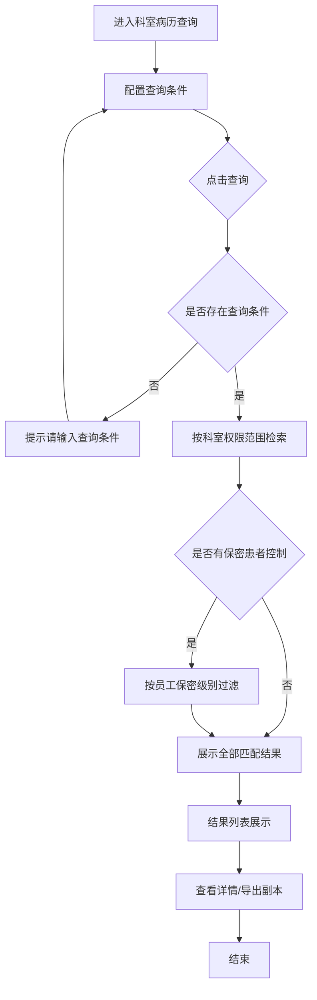
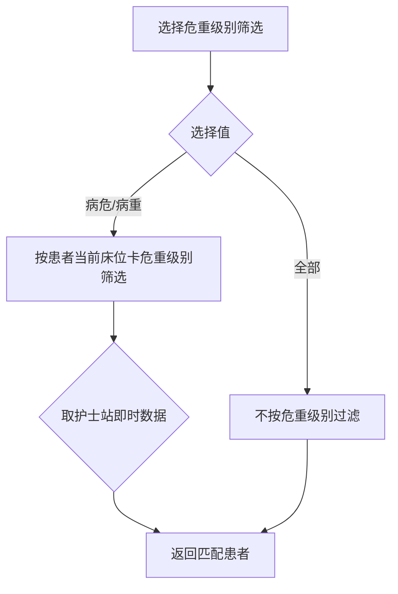

# BLGL-10-BLCX-001科室病历查询_ Analyst - Spec

> **需求编号**：BLGL-10-BLCX-001
> **父需求**：BLGL-10-BLCX
> **关联PM Spec**：BLGL-10-BLCX-001_科室病历查询_PM-spec.md
> **Spec版本**：V1.0
> **编写时间**：2026-08-14
> **编写人**：需求分析师

---

## 一、功能编号体系

### 1.1 功能层级结构

```
BLGL-10-BLCX-001: 科室病历查询
 ├─ BLGL-10-BLCX-001-01: 科室病历多条件检索
 │ ├─ -01-01: 查询条件配置（诊断/手术/时间/医疗组/危重级别）
 │ ├─ -01-02: 查询执行（科室权限范围限定 + 空条件校验）
 │ └─ -01-03: 结果列表展示（病案号/住院天数/入区日期/出院结算日期等列）
 ├─ BLGL-10-BLCX-001-02: 查询范围与权限控制
 │ ├─ -02-01: 科室范围限定
 │ ├─ -02-02: 保密患者权限过滤
 │ └─ -02-03: 已停用科室历史病历查询
 └─ BLGL-10-BLCX-001-03: 查询结果支撑操作
 ├─ -03-01: 病历详情查看（跳转）
 └─ -03-02: 导出副本（PDF/OFD/Excel/XML）
```

### 1.2 功能编号表

| REQ-ID | 功能名称 | 类型 | 优先级 | 说明 |
|--------|---------|------|--------|
| BLGL-10-BLCX-001-01 | 科室病历多条件检索 | 功能 | P0 | 科室权限范围内按多条件组合检索病历并展示结果列表 |
| BLGL-10-BLCX-001-01-01 | 查询条件配置 | 子功能 | P0 | 诊断/手术/时间/医疗组/危重级别等条件配置 |
| BLGL-10-BLCX-001-01-02 | 查询执行 | 子功能 | P0 | 按科室权限范围检索 + 空条件校验提醒 |
| BLGL-10-BLCX-001-01-03 | 结果列表展示 | 子功能 | P0 | 展示病案号/住院天数/入区日期/出院结算日期等列 |
| BLGL-10-BLCX-001-02 | 查询范围与权限控制 | 功能 | P0 | 科室范围限定、保密患者过滤、已停用科室历史数据 |
| BLGL-10-BLCX-001-02-01 | 科室范围限定 | 子功能 | P0 | 查询结果限定本科室权限范围 |
| BLGL-10-BLCX-001-02-02 | 保密患者权限过滤 | 子功能 | P0 | 按员工保密级别过滤患者 |
| BLGL-10-BLCX-001-02-03 | 已停用科室历史病历 | 子功能 | P1 | 支持查询已停用科室历史病历 |
| BLGL-10-BLCX-001-03 | 查询结果支撑操作 | 功能 | P1 | 详情查看与导出副本入口 |
| BLGL-10-BLCX-001-03-01 | 病历详情查看 | 子功能 | P1 | 查看病历详情（支撑能力） |
| BLGL-10-BLCX-001-03-02 | 导出副本 | 子功能 | P1 | 导出 PDF/OFD/Excel/XML（支撑能力） |

---

## 二、核心业务流程

### 2.1 科室病历多条件检索流程



### 2.2 危重级别筛选流程



---

## 三、功能规格说明

---

### BLGL-10-BLCX-001-01: 科室病历多条件检索

#### 3.1.1 功能概述

住院医生在本科室权限范围内按多条件组合检索住院患者病历，结果列表展示患者病历信息，支持查看详情与导出副本。检索条件包括科室、诊断、手术、时间范围、医疗组、危重级别等。

#### 3.1.2 用户角色

| 角色 | 使用场景 | 权限要求 | 操作频率 |
|------|---------|---------|---------|
| 住院医生 | 本科室权限范围内检索患者病历 | 科室病历查询菜单权限 + 科室权限范围 | 高频 |
| 医务科主任/科主任 | 查看本科室病历数据、查看既往病历 | 科室病历查询菜单权限 | 中频 |

#### 3.1.3 业务流程（Given/When/Then）

##### 主流程（至少 1 个）

**Scenario 1: 科室病历多条件检索**

```gherkin
Given:
 - 住院医生已登录且具有科室病历查询菜单权限
 - 医生所属科室已有住院患者病历数据
 - 系统已配置查询时间范围参数 COMMON201（默认3个月）

When:
 - 医生进入科室病历查询页面
 - 配置查询条件：科室、诊断、出院时间、医疗组（多条件组合）
 - 点击查询按钮

Then:
 - 系统在科室权限范围内检索匹配的患者病历
 - 结果列表展示患者病历信息（含病案号、住院天数、入区日期、出院结算日期）
 - 医生可点击查看病历详情或导出副本
```

##### 异常流程（至少 3 个）

**Scenario 2: 业务异常——诊断检索失效**

```gherkin
Given:
 - 医生输入诊断关键字
 - 前端传递字段名为 diagonosisKey（拼写错误）
 - 部分诊断尚未写入病历

When:
 - 医生点击查询按钮

Then:
 - 系统返回无查询结果（诊断检索失效）
 - ⏳ 待确认：正确字段名与未入病历诊断检索逻辑
```

**Scenario 3: 数据异常——住院天数为空**

```gherkin
Given:
 - 医院使用病案系统病案首页（COMMON072=否）
 - 病历系统病案首页表 INP_EMR_MAHP 未落库

When:
 - 医生查看查询结果列表

Then:
 - 住院天数列显示为空
 - 系统应按 COMMON072 动态选择住院天数查询来源
```

**Scenario 4: 系统异常——查询界面空白**

```gherkin
Given:
 - 病历数据源服务异常或数据加载失败

When:
 - 医生打开科室病历查询界面

Then:
 - 界面显示空白
 - ⏳ 待确认：错误提示与降级处理
```

##### 边界流程（至少 2 个）

**Scenario 5: 边界场景——空查询条件**

```gherkin
Given:
 - 医生未输入或选择任何查询条件

When:
 - 医生点击查询按钮

Then:
 - 系统页面上方弹出橙色轻提示【请输入查询条件】阻断查询
```

**Scenario 6: 边界场景——模糊查询前后空格**

```gherkin
Given:
 - 医生输入" 肺炎 "（含前后空格）

When:
 - 医生点击查询按钮

Then:
 - 系统去掉前后空格后按"肺炎"进行模糊匹配
```

#### 3.1.4 数据字段定义

> 字段名来自代码扫描（`E:\39EMR\sr-next`，标注 `` 的来自 `DailyManageInpRhbRecordQueryInputAO` 查询入参 / `InpRhbRecordInfoOutputVO` 结果输出）。

| 字段名 | 类型 | 必填 | 默认值 | 取值范围 | 说明 | 概念ID |
|--------|------|------|--------|---------|------|--------|
| diagonosisKey | String | 否 | 空 | - | 诊断检索关键字（拼写错误字段，正确为 diagnosisKey） | ⏳ 待确认 |
| deptIds | List\<Long\> | 否 | 当前科室 | 科室ID多选 | 科室范围限定 | ⏳ 待确认 |
| severityLevelCode | Long | 否 | 全部 | 病危/病重 | 当前危重级别筛选 | ⏳ 待确认 |
| admittedAtStart/End | Date | 否 | 近3个月 | COMMON201 限制 | 入院日期范围 | ⏳ 待确认 |
| dischargedAtStart/End | Date | 否 | - | - | 出院日期范围 | ⏳ 待确认 |
| patientName | String | 否 | 空 | - | 患者姓名 | ⏳ 待确认 |
| admissionNumber | String | 否 | 空 | - | 住院号 | ⏳ 待确认 |
| idCardNo | String | 否 | 空 | - | 身份证号 | ⏳ 待确认 |
| medicalTeamIds | List\<Long\> | 否 | 空 | 医疗组多选 | 医疗组筛选 | ⏳ 待确认 |
| currentDeptName | String | - | - | - | 结果列：当前科室 | ⏳ 待确认 |
| age | String | - | - | - | 结果列：年龄（InpRhbRecordInfoOutputVO） | ⏳ 待确认 |
| hospitalizationDays | Long | - | - | - | 结果列：住院天数 | ⏳ 待确认 |
| admittedToWardAt | Date | - | - | - | 结果列：入区日期 | ⏳ 待确认 |
| dischargedAt / dischargedFromWardAt | Date | - | - | - | 结果列：出院时间/出区时间 | ⏳ 待确认 |
| surgeryNames | String | - | - | - | 结果列：手术名称 | ⏳ 待确认 |
| dutyDoctName / dutyNursName | String | - | - | - | 结果列：责任医生/责任护士 | ⏳ 待确认 |
| statusCode / statusCodeDesc | Long/String | - | - | - | 结果列：病历状态 | ⏳ 待确认 |

> ⏳ 待确认：病案号（CASE_NO）、出院结算日期（结算时间）等新增列字段映射待接口契约文档补充。

#### 3.1.5 验收标准

| AC编号 | 验收标准 | 对应REQ-ID | 验证方法 | 验证场景 |
|--------|---------|-----------|--------|
| AC-001 | 配置科室+诊断+出院时间等条件查询，返回本科室权限范围内匹配病历，结果列含病案号/住院天数/入区日期/出院结算日期 | -001-01 | 功能测试 | Scenario 1 |
| AC-002 | 输入诊断关键字能按诊断筛选出患者，不再失效 | -001-01 | 功能测试 | Scenario 2 |
| AC-003 | 选择病危/病重能按当前床位卡危重级别筛出患者 | -001-01 | 功能测试 | Scenario 1 |
| AC-004 | 未选择任何条件时提示【请输入查询条件】并阻断 | -001-01 | 功能测试 | Scenario 5 |
| AC-005 | 模糊查询自动去掉前后空格后匹配 | -001-01 | 功能测试 | Scenario 6 |
| AC-006 | 使用病案系统病案首页时住院天数正确取值 | -001-01 | 集成测试 | Scenario 3 |

---

### BLGL-10-BLCX-001-02: 查询范围与权限控制

#### 3.2.1 功能概述

控制科室病历查询的数据范围：查询结果限定本科室权限范围；保密患者按员工保密级别过滤；支持查询已停用科室的历史病历数据。

#### 3.2.2 用户角色

| 角色 | 使用场景 | 权限要求 | 操作频率 |
|------|---------|---------|---------|
| 住院医生 | 本科室范围检索（受限） | 科室权限 + 保密级别达标 | 高频 |
| 医务科主任/科主任 | 查看本科室及已停用科室历史数据 | 科室病历查询菜单权限 | 中频 |

#### 3.2.3 业务流程（Given/When/Then）

##### 主流程

**Scenario 1: 保密患者权限过滤**

```gherkin
Given:
 - 系统已启用保密患者查询功能（参数 COMMON269=是）
 - 患者已定义保密级别（0~4级）
 - 员工已维护查看患者保密级别

When:
 - 医生执行科室病历查询

Then:
 - 系统按员工保密级别过滤患者数据
 - 员工以集合中最高的保密级别为准（如员工最高级别4，可查看0~4级患者）
```

##### 异常流程

**Scenario 2: 数据异常——保密患者配置缺失**

```gherkin
Given:
 - 参数 COMMON269 未配置或保密级别未设置

When:
 - 医生执行查询

Then:
 - 按系统默认逻辑处理（保密功能未启用时不进行保密过滤）
 - ⏳ 待确认：保密配置缺失时的默认行为
```

##### 边界流程

**Scenario 3: 边界场景——已停用科室**

```gherkin
Given:
 - 医院存在已停用科室，历史病历数据仍存在

When:
 - 医生选择已停用科室查询

Then:
 - 系统可查询到该科室历史病历
 - 检索条件中已停用科室名称增加"（已停用）"标识
```

#### 3.2.4 数据字段定义

| 字段名 | 类型 | 必填 | 默认值 | 取值范围 | 说明 | 概念ID |
|--------|------|------|--------|---------|------|--------|
| 保密级别 | Int | 否 | - | 0~4 | 患者保密级别（集合取最高） | ⏳ 待确认 |
| 员工保密级别 | Int | 否 | - | 0~4 | 员工查看患者的保密级别 | ⏳ 待确认 |

#### 3.2.5 验收标准

| AC编号 | 验收标准 | 对应REQ-ID | 验证方法 | 验证场景 |
|--------|---------|-----------|--------|
| AC-007 | 保密患者按员工保密级别过滤，未达标员工查不到保密患者 | -001-02 | 安全测试 | Scenario 1 |
| AC-008 | 选择已停用科室能查询到历史病历，名称带"（已停用）" | -001-02 | 功能测试 | Scenario 3 |

---

### BLGL-10-BLCX-001-03: 查询结果支撑操作

#### 3.3.1 功能概述

科室病历查询结果支持查看病历详情（跳转病历查看）与导出副本（PDF/OFD/Excel/XML），其中导出受角色权限与参数控制。本子功能点对应 Phase 1 基础能力（BC-BLCX-001、BC-BLCX-002），作为查询结果的支撑操作记录于此。

#### 3.3.2 用户角色

| 角色 | 使用场景 | 权限要求 | 操作频率 |
|------|---------|---------|---------|
| 住院医生 | 查看病历详情 | 查询菜单权限 | 高频 |
| 医务科/病案室 | 导出病历副本 | 导出角色权限（COMMON159） | 低频 |

#### 3.3.3 业务流程（Given/When/Then）

##### 主流程

**Scenario 1: 查看病历详情**

```gherkin
Given:
 - 医生在查询结果列表选中某患者

When:
 - 医生点击查看病历详情

Then:
 - 系统打开病历详情页面展示病历内容
```

##### 异常流程

**Scenario 2: 系统异常——导出报错**

```gherkin
Given:
 - 医生点击导出副本按钮
 - 导出服务异常

When:
 - 系统执行导出

Then:
 - 系统报"未经处理的异常"错误
 - ⏳ 待确认：导出错误提示与重试机制
```

##### 边界流程

**Scenario 3: 边界场景——导出数据量超限**

```gherkin
Given:
 - 查询结果超过 500 条

When:
 - 医生点击导出Excel

Then:
 - 系统按查询结果全量导出（前端分页组装），不再限制 499 条
```

#### 3.3.4 数据字段定义

> 导出接口来自代码扫描（标注 ``）。

| 字段名 | 类型 | 必填 | 默认值 | 取值范围 | 说明 | 概念ID |
|--------|------|------|--------|---------|------|--------|
| 导出格式 | String | 否 | PDF | PDF/OFD/Word/XML/HTML | 导出副本格式（COMMON179） | ⏳ 待确认 |
| exportDailyManageInpRhbRecord | - | 否 | - | - | 日常管理-病历查询-导出接口：/emr_inpatient/export_daily_manage_inp_rhb_record | ⏳ 待确认 |
| exportPdf / exportWord / queryXmlOrHtml | - | 否 | - | - | 导出PDF/Word/XML/HTML 接口：/emr_pdf_file/export/by_encounter_ids | ⏳ 待确认 |

#### 3.3.5 验收标准

| AC编号 | 验收标准 | 对应REQ-ID | 验证方法 | 验证场景 |
|--------|---------|-----------|--------|
| AC-009 | 点击查看能打开病历详情 | -001-03 | 功能测试 | Scenario 1 |
| AC-010 | 导出超过500条数据时按查询结果全量导出 | -001-03 | 集成测试 | Scenario 3 |

---

## 四、排除范围

本需求不包含以下功能项：

1. **全院病历查询** - 跨科室不限权限检索，属 BLGL-10-BLCX-002
2. **病历结构化查询** - 按元素/段落检索，属 BLGL-10-BLCX-003
3. **病历导出副本详细设计（格式/权限/水印）** - 属基础能力 BC-BLCX-002，本功能点仅记录支撑操作入口
4. **病历书写、归档借阅、模板管理** - 属其他模块

> 与 PM-Spec 第四章一致。对照 Phase 1 功能点Spec 第6章（基线能力），确保不越界。

---

## 五、业务规则清单

| 规则ID | 规则名称 | 规则描述 | 优先级 |
|--------|---------|---------|--------|
| BR-001 | 科室权限范围 | 科室病历查询结果受医生所属科室权限范围限制 | P0 |
| BR-002 | 保密患者过滤 | 员工保密级别以集合中最高级别为准，支持查看对应级别及以下患者 | P0 |
| BR-003 | 空条件校验 | 未选择或输入任何查询条件时，弹出【请输入查询条件】阻断查询 | P0 |
| BR-004 | 模糊查询去空格 | 诊断/手术/文书名称模糊查询时去掉前后空格再匹配 | P1 |
| BR-005 | 危重级别取值 | 危重级别按患者当前床位卡危重级别（护士站即时数据），选项为全部/病危/病重 | P1 |
| BR-006 | 住院天数取值 | 按 COMMON072 动态选择住院天数查询来源（病历系统/病案系统病案首页） | P1 |
| BR-007 | 取消入区患者显示 | 按 ADMITTED_CANCEL_DEL_CODE 参数控制取消入区患者是否显示 | P1 |
| BR-008 | 已停用科室 | 支持查询已停用科室历史病历，名称带"（已停用）"标识 | P1 |

---

## 六、关联文档

| 文档类型 | 文档路径 | 说明 |
|---------|---------|
| 功能点Spec | BLGL-10-BLCX 10病历查询功能点Spec.md（V1.1，上级目录） | Phase 1 功能点索引 |
| PM spec | 本目录 BLGL-10-BLCX-001_科室病历查询_PM-spec.md（V0.1） | PM 产出的 Spec 文档 |
| -Spec | 本目录 BLGL-10-BLCX-001_科室病历查询-Spec.md（V1.0） | 业务背景与目标 Spec |
| data-model.md | 待产出 | 架构师产出的数据建模文档 |
| design.md | 待产出 | 架构师产出的技术方案文档 |
| api-contract.md | 待产出 | 开发经理产出的 API 契约文档 |

---

## 七、待确认问题清单

| 编号 | 问题描述 | 缺失信息 | 影响范围 | 建议补充方 |
|------|---------|---------|--------|
| Q-001 | 诊断检索正确字段名与未入病历诊断检索逻辑 | diagnosisKey 字段规范、检索口径 | 3.1.3 Scenario 2、BR-001 | 开发/产品经理 |
| Q-002 | 查询界面空白时的错误提示与降级处理 | 界面异常处理方案 | 3.1.3 Scenario 4 | 产品经理 |
| Q-003 | 完整查询入参/接口契约结构 | API 请求/返回字段 | 第5章接口设计 | 开发经理 |
| Q-004 | 保密配置缺失时的默认行为 | COMMON269 未配置时的处理 | 3.2.3 Scenario 2 | 产品经理 |
| Q-005 | 导出错误提示与重试机制 | 导出异常处理 | 3.3.3 Scenario 2 | 开发/产品经理 |
| Q-006 | 概念ID、状态枚举、性能指标 | 字段概念ID、状态定义、SLA | 数据模型、非功能 | 架构师/产品经理 |

---

## 填写检查清单

| 序号 | 检查项 | 是否完成 |
|:----:|--------|:--------:|
| 1 | 功能编号带父子层级 | ✅ |
| 2 | 每个 REQ-ID 有功能概述和用户角色 | ✅ |
| 3 | 主流程至少 1 个 Given/When/Then 场景 | ✅ |
| 4 | 异常流程至少 3 个 Given/When/Then 场景 | ✅ |
| 5 | 边界流程至少 2 个 Given/When/Then 场景 | ✅ |
| 6 | 每个 Given/When/Then 内容具体，不模糊 | ✅ |
| 7 | 数据字段定义完整（字段名、类型、必填、说明、概念ID） | ✅ |
| 8 | 验收标准 AC 编号独立，可验证 | ✅ |
| 9 | 验收标准无"功能正常"等模糊表述 | ✅ |
| 10 | 排除范围明确列出 | ✅ |
| 11 | 业务规则清单列出所有规则，每条标注来源 | ✅ |
| 12 | 流程图使用 Mermaid 格式（≥2 个） | ✅ |
| 13 | 关联文档索引包含 Phase 1 功能点Spec | ✅ |
| 14 | 待确认问题清单汇总了全文所有 ⏳ 项 | ✅ |
| 15 | 全文无占位符 `< >` 残留 | ✅ |
| 16 | 全文陈述可溯源至资料区（S1~S10 溯源核查） | ✅ |
| 17 | 人工审核确认完成 | ⏳ 待确认 |

---

**文档状态**：⬜ 待审核
**维护责任**：需求分析师规范组
**下次更新**：根据评审反馈优化

---

## 版本历史

| 版本 | 日期 | 变更说明 | 编写人 |
|------|------|---------|--------|
| V1.0 | 2026-08-14 | 初始版本 | 需求分析师 |
