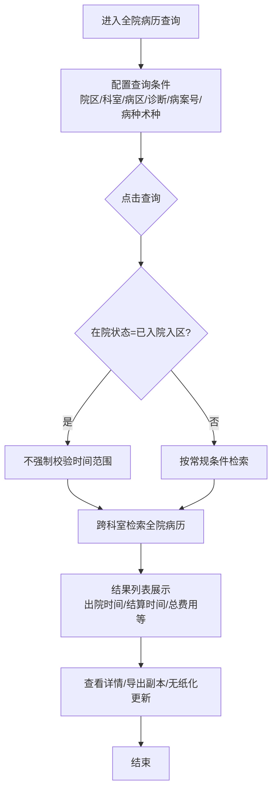
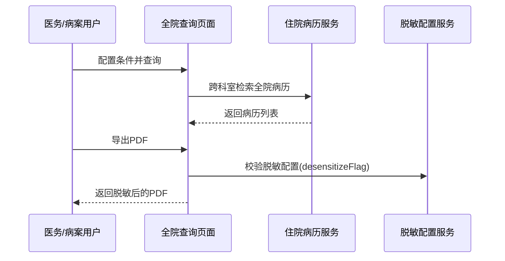

# BLGL-10-BLCX-002 全院病历查询-Spec

> **功能编号**：BLGL-10-BLCX-002
> **文档类型**：功能Spec（业务背景与设计）
> **文档版本**：V1.0
> **编写时间**：2026-08-14
> **编写人**：RACC

---

## 文档索引

#### 章节索引

**Spec（研发视角）**

| 章节号 | 章节名称 |
|--------|---------|
| 1、 | 文档概述 |
| 2、 | 功能背景与定位 |
| 3、 | 业务流程设计 |
| 4、 | 数据模型设计 |
| 5、 | 接口契约设计 |
| 6、 | 技术方案设计 |
| 7、 | 测试用例预设计 |
| 8、 | 非功能性要求 |
| 9、 | 依赖与风险 |
| 10、 | 附录 |

**PM-Spec（业务视角）**

| 章节号 | 章节名称 | 内容说明 |
|--------|---------|---------|
| 一 | 目标 | 功能定位与核心价值 |
| 二 | 约束 | 业务/技术/非功能性约束 |
| 三 | 验收标准 | 验收条件与验证方法 |
| 四 | 排除范围 | 本次不做项与明确边界 |
| 五 | 关键决策记录 | 方案决策与选型理由 |
| 六 | 优先级 | 优先级定义 |
| 七 | 关联文档 | 关联文档索引 |
| 附录 | 填写检查清单 | 质量检查 |

**Analyst-Spec（产品视角）**

| 章节号 | 章节名称 | 内容说明 |
|--------|---------|---------|
| 一 | 功能编号体系 | 功能编号与层级结构 |
| 二 | 核心业务流程 | 核心业务流程与时序 |
| 三 | 功能规格说明 | 详细功能规格与验收标准 |
| 四 | 排除范围 | 排除范围 |
| 五 | 业务规则清单 | 业务规则清单 |
| 六 | 关联文档 | 关联文档索引 |
| 七 | 待确认问题清单 | 待确认问题汇总 |
| - | 填写检查清单 | 质量检查 |

#### 版本历史

| 版本 | 日期 | 变更说明 | 编写人 |
|------|------|---------|--------|
| V1.0 | 2026-08-14 | 初始版本 | RACC |

#### 关联文档索引

| 序号 | 文档名称 | 文档类型 | 版本 | 位置 |
|------|---------|---------|------|------|
| 1 | BLGL-10-BLCX-002_全院病历查询-Spec.md | 功能Spec（业务背景与设计）（本文档） | V1.0 | 本目录 |
| 2 | BLGL-10-BLCX-002_全院病历查询_PM-spec.md | PM-Spec（需求规格） | V0.1 | 本目录 |
| 3 | BLGL-10-BLCX-002_全院病历查询_Analyst-spec.md | Analyst-Spec（分析规格） | V1.0 | 本目录 |
| 4 | BLGL-10-BLCX 10病历查询功能点Spec.md | 功能点Spec（模块级） | V1.1 | 上级目录 |

---

## 1、文档概述

### 1.1、文档目的

本文档旨在明确"全院病历查询"功能（BLGL-10-BLCX-002）的业务背景与设计方案，为需求分析、研发实现、测试验收及评审提供统一的业务上下文、设计口径与决策依据。

### 1.2、文档范围

#### 1.2.1 纳入范围

本文档覆盖全院病历查询的完整业务背景与设计，包括：

- 跨科室、不受医生科室权限限制的全院患者病历检索
- 查询条件编辑与自定义筛选条件（院区/科室/病区联动、病种/术种、病案号、医疗组等）
- 查询结果列表展示（出院时间/结算时间区分、总费用/结算日期、门诊医生/责任医生、入区日期等）
- 角色权限控制（按角色控制查看全院病历的权限）
- 导出副本（PDF/OFD/Excel/XML）、导出日志、PDF脱敏、无纸化文件更新
- 溯源水印与患者隐私保护

#### 1.2.2 排除范围

本文档不涉及以下内容（详见其他功能点或模块）：

- 科室病历查询（本科室权限范围检索）—— BLGL-10-BLCX-001
- 病历结构化查询（按元素/段落检索）—— BLGL-10-BLCX-003
- 病历详情查看、导出副本、查询条件保存、列选项设置、参数配置 —— Phase 1 功能点Spec 第6章基础能力（BC-BLCX-001~007）
- 病历书写、归档借阅、模板管理等 —— 其他模块

### 1.3、术语定义

| 术语 | 定义 |
|------|------|
| 全院病历查询 | 医务/病案/质控跨科室检索全院患者病历的查询场景，查询条件不受医生科室权限限制 |
| 全院查询角色权限 | 控制哪些角色可使用全院查询页面、不受科室权限控制 |
| 结算时间 | 患者办理结算后的出院时间；区别于医生开立出院医嘱的"出院时间" |
| 无纸化文件更新 | 病案室在全院查询页面一键触发 PDF 文件重新生成和上传 |
| 导出日志 | 监控"全院病历查询-导出副本"操作的日志，一份文书一条记录 |
| 病种/术种 | 与诊断/手术对应关系配置的筛选标签，满足三甲评审要求 |

> ⏳ 待确认：规范术语表待产品文档确认。

### 1.4、阅读指南

- **章节关系**：第1~2章为业务全貌，第3~10章为设计实现层。与 Analyst-Spec、PM-Spec 互相引用保持一致。
- **读者对象**：产品经理/需求分析师读第1~2章；研发读第3~6、9~10章；测试读第3、7~8章；评审人员核对各层一致性。

### 1.5、参考文档

| 序号 | 文档名称 | 版本/日期 |
|------|---------|
| 1 | 【历史需求】住院病历的历史需求.xlsx | - |
| 2 | BLGL-10-BLCX-002_全院病历查询_PM-spec.md | V0.1 |
| 3 | BLGL-10-BLCX-002_全院病历查询_Analyst-spec.md | V1.0 |
| 4 | BLGL-10-BLCX 10病历查询功能点Spec.md | V1.1 |
| 5 | WiNEX-住院病历查询功能清单_20260330.md | 2026-03-30 |

---

## 2、功能背景与定位

### 2.1 功能背景

全院病历查询是医务科/病案室/质控跨科室检索全院病历的核心入口，需满足：

- **管理要求**：医务科/病案室需要跨科室检索全院患者病历，支持查看详情并集中打印
- **现状痛点**：
 - 全院查询菜单权限：原仅按专业技术职务配置查看全院病历角色，与实际应用不符（医务管理人员多为临床医生）
 - 出院时间理解混淆：列表"出院时间"实为结算时间，与医生理解的出院医嘱时间不一致
 - 总费用为空、缺结算日期列
 - 查询条件受限：不支持病种/术种、病案号查询
 - 导出PDF脱敏配置不起效
- **历史需求演进**：从历史病历查询改名"全院查询"→ 查询条件增强（编辑查询条件、病案号、病种/术种、自定义筛选，、633465、1512515）→ 结果列增强（结算时间/出院时间区分、总费用、门诊医生、入区日期，、1507454、1610822、1653780）→ 权限与安全（角色权限、脱敏、水印、导出日志、无纸化更新，、1560323、1614724、1551356、1547797）

### 2.2 功能定位

"全院病历查询"是 WiNEX 病历管理-病历查询模块的全院级检索能力，定位为：

- **全院病历检索入口**：医务/病案/质控跨科室定位全院患者病历
- **不受科室权限限制**：按角色控制全院查询权限，非科室范围限制
- **质控/病案工作支撑**：满足三甲评审病种查询、无纸化文件管理、导出追溯
- **患者隐私保护**：导出脱敏、溯源水印、导出日志留痕

### 2.3 目标用户

| 用户角色 | 主要使用场景 |
|---------|-------------|
| 医务科主任/医务管理人员 | 跨科室查看全院病历、质量监管 |
| 病案室（主任/统计员/质控员/上报员） | 病案管理、无纸化文件补传、统计上报 |
| 质控系统用户 | 全院质控查询、病历抽查 |
| 医疗总值班 | 全院患者病历查看（含溯源水印） |

### 2.4 核心价值

| 价值维度 | 价值描述 |
|---------|---------|
| 全院统筹 | 跨科室全院病历检索，支撑医务/病案/质控全局视角 |
| 权限合规 | 按角色控制全院查询权限，替代职务配置 |
| 信息准确 | 出院时间/结算时间区分、总费用/结算日期取值修正 |
| 隐私安全 | 导出PDF脱敏、溯源水印、导出日志留痕 |
| 工作效率 | 无纸化文件更新一键补传，导出全量 |

---

## 3、业务流程设计（Given/When/Then）

### 3.1 主流程

**Scenario 1: 全院病历跨科室检索**

```gherkin
Given:
 - 用户具有全院查询菜单权限（按角色配置）
 - 系统已配置全院查询角色权限参数

When:
 - 用户进入"病历管理-全院病历查询"
 - 配置查询条件：院区、科室、病区、诊断、出院时间
 - 点击查询按钮

Then:
 - 系统跨科室检索全院匹配的患者病历
 - 结果列表展示（含出院时间/结算时间、总费用/结算日期、门诊医生/责任医生等列）
 - 用户可查看病历详情、导出副本、无纸化文件更新
```

### 3.2 异常流程

**Scenario 2: 业务异常——全院查询权限不足**

```gherkin
Given:
 - 用户角色未配置为可查看全院病历的角色

When:
 - 用户尝试进入全院病历查询

Then:
 - 系统不显示全院查询功能或限制访问
 - ⏳ 待确认：权限不足时的具体提示
```

**Scenario 3: 数据异常——查询报SQL错误**

```gherkin
Given:
 - 全院病历查询执行条件触发数据库查询

When:
 - 用户点击查询按钮

Then:
 - 系统报"未找到要求的 FROM 关键字"错误（ORA-00923）
 - ⏳ 待确认：具体 SQL 逻辑问题
```

**Scenario 4: 系统异常——导出PDF脱敏不起效**

```gherkin
Given:
 - 已配置全院查询脱敏设置（1003）

When:
 - 用户在全院查询导出PDF

Then:
 - 导出的PDF患者信息未脱敏（配置不起效）
 - 系统应排查前端调用链路，确保传递并处理 desensitizeFlag 标志
```

### 3.3 边界流程

**Scenario 5: 边界场景——在区患者时间限制**

```gherkin
Given:
 - 查询条件在院状态=已入院入区

When:
 - 用户执行查询

Then:
 - 系统不强制校验患者信息或日期范围（去掉必填限制）
```

**Scenario 6: 边界场景——已停用科室查询**

```gherkin
Given:
 - 医院存在已停用科室

When:
 - 用户在科室选项选择已停用科室

Then:
 - 系统支持查询已停用科室的病历信息
 - 科室名称后增加"（停用）"标识
```

---

## 4、数据模型设计

> 数据模型信息来自代码扫描（`E:\39EMR\sr-next`）和历史需求。标注 `` 的表名/字段来自 PO 实体或输入/输出 VO，标注 `` 的来自需求文本。

### 4.1 核心数据结构

#### 4.1.1 核心查询入参（DailyManageInpRhbRecordQueryInputAO）

全院病历查询与科室病历查询共用同一查询入参：

| 字段名 | 类型 | 必填 | 备注 |
|--------|------|------|------|
| keySearch | String | 否 | 关键词检索 |
| deptIds | List\<Long\> | 否 | 科室范围（多选，支持全院科室） |
| currentWardId | Long | 否 | 病区 |
| admittedAtStart/End | Date | 否 | 入院日期范围 |
| dischargedAtStart/End | Date | 否 | 出院日期范围 |
| dischargedFromWardAtStart/End | Date | 否 | 出区日期范围 |
| inpatientStatus | Long | 否 | 在院状态（已入院入区等） |
| severityLevelCode | Long | 否 | 当前危重级别 |
| medicalInsuranceCodes | List\<Long\> | 否 | 医保类型（多选） |
| diagnosisTypeCodes | List\<Long\> | 否 | 诊断类别 |
| diagonosisKey | String | 否 | 诊断检索关键字（拼写错误字段，正确为 diagnosisKey） |
| admissionNumber | String | 否 | 住院号 |
| patientName | String | 否 | 姓名 |
| idCardNo | String | 否 | 身份证号 |
| medicalTeamIds | List\<Long\> | 否 | 医疗组（多选） |
| surgeryDateStart | Date | 否 | 手术日期范围 |

> ⏳ 待确认：病案号（CASE_NO）、患者类型（医保/自费）、出院病种/术种等新增查询条件字段待接口契约文档补充。

#### 4.1.2 核心表/实体

| 表/实体 | 关键字段 | 说明 |
|---------|---------|------|
| INPATIENT_RHB_RECORD（InpatientRhbRecordPO） | ENCOUNTER_ID、PATIENT_NAME、ADMISSION_NUMBER、WARD_DISCHARGED_AT、DISCHARGED_AT、CURRENT_DEPT_ID、CURRENT_DEPT_NAME | 病历簿记录表，全院病历查询主数据源 |
| INPATIENT_RHB_DIAGNOSIS（InpatientRhbDiagnosisPO） | DIAGNOSIS_TYPE_CODE、DIAGNOSIS_PRI_SEC_CODE、DIAGNOSIS_CODE | 病历诊断表，落库全部诊断（主+次）支撑诊断检索 |
| INPATIENT_RECORD | CASE_NO | 病案号取值 |
| INPATIENT_SETTLEMENT | SETTLED_AT | 住院结算单，结算日期取值 |
| INPAT_REGISTER | 门诊医生 | 住院信息表，门诊医生/责任医生字段 |

> ⏳ 待确认：完整数据表清单待代码扫描或功能清单数据表清单补充。

### 4.2 状态定义

| 状态码 | 状态名称 | 说明 |
|--------|---------|------|
| statusCode | 病历状态 | InpRhbRecordInfoOutputVO.statusCode |
| inpatientStatus | 在院状态 | 已入院已入区；取消入区患者按 ADMITTED_CANCEL_DEL_CODE 参数控制 |

> ⏳ 待确认：状态枚举值定义未在代码扫描中提取完整。

### 4.3 系统参数定义

| 参数编码 | 参数名称 | 说明 |
|---------|---------|------|
| 全院查询角色权限 | 全院病历查询页面需要判断科室权限的角色 | 取用户角色控制全院查询功能 |
| 导出角色权限 | 允许在病历查询、全院查询等菜单中使用导出PDF相关功能的角色 | 默认医务科主任/超级管理员/病案室主任/统计员/质控员/上报员/病案系统管理员 |
| 病历簿出院时间取值方式 | 病历簿出院时间取值方式 | 下拉{出院结算时间，出院医嘱时间}，默认出院结算时间 |
| 脱敏配置 | 全院查询脱敏设置（1003） | 控制导出PDF脱敏 |
| ADMITTED_CANCEL_DEL_CODE | 新患者入区取消是否自动删除病历/病历簿 | 默认否，控制取消入区患者显示 |

---

## 5、接口契约设计

> 接口信息来自代码扫描（`E:\39EMR\sr-next`）的 Controller + ApiPathConstants。标注 ``。

### 5.1 API列表

| 序号 | API名称（代码函数） | 路径 | 方法 | 说明 |
|:----:|---------|------|:----:|------|
| 1 | queryDailyManageInpRhbRecordByExample | /api/v1/app_record_inpatient/emr_inpatient/query_daily_manage_inp_rhb_record | POST | 全院病历查询-查询数据（InpEmrRecordQueryController，tags: 全院病历查询） |
| 2 | exportDailyManageInpRhbRecord | /api/v1/app_record_inpatient/emr_inpatient/export_daily_manage_inp_rhb_record | POST | 全院病历查询-导出副本 |
| 3 | getDailyManageInpRhbRecordStatistics | /api/v1/app_record_inpatient/emr_inpatient/inp_rhb_record/get_statistics_data | POST | 全院病历查询-获取疑难病历人数/手术病历人数/科室分布 |
| 4 | saveManageEmrQueryParams | /api/v1/app_record_inpatient/emr_inpatient/chart/save_query_params | POST | 保存查询参数 |
| 5 | getDailyManageEmrHistoryQueryParams | /api/v1/app_record_inpatient/emr_inpatient/chart/get_history_params | POST | 获取历史查询参数 |
| 6 | getPatientExpenseAmount | /api/v1/app_record_inpatient/emr_inpatient/patient/get_patient_expense_amount | POST | 获取患者费用（总费用） |
| 7 | queryTagOptions | /api/v1/app_record_inpatient/emr_tags/query_tag_options | POST | 查询标签下拉数据（出院病种/术种，） |
| 8 | queryInpRHBRecord | /api/v1/app_record_inpatient/emr_inpatient/emr_rhb_record/query_inp_rhb_record | POST | 获取患者病历簿列表 |
| 9 | exportPdf / exportWord | /emr_pdf_file/export/by_encounter_ids / /emr_word_file/export/by_encounter_ids | POST | 导出PDF/Word |
| 10 | queryXmlOrHtml | /inp_emr_xml_html/query/by_example | POST | 导出XML/HTML |

> 前端实际请求前缀：`/inpatient-clinicalnote/api/v1/app_record_inpatient/`。

### 5.2 接口详细设计

#### 5.2.1 全院病历查询-查询数据（queryDailyManageInpRhbRecordByExample）

**请求参数（DailyManageInpRhbRecordQueryInputAO）**:
```json
{
 "deptIds": [1001, 1002, 1003]
 "patientName": "张三"
 "dischargedAtStart": "2026-05-01"
 "dischargedAtEnd": "2026-08-01"
 "medicalInsuranceCodes": [1, 2]
 "pageNum": 1
 "pageSize": 20
}
```

**返回值（成功，WinPagedList\<InpRhbRecordInfoOutputVO\>）**:
```json
{
 "success": true
 "data": {
 "list": [
 {
 "encounterId": "1001"
 "admissionNumber": "IP123456"
 "patientName": "张三"
 "currentDeptName": "内科"
 "admittedAt": "2026-05-01"
 "dischargedAt": "2026-08-01"
 "genderName": "男"
 "age": "45"
 }
 ]
 "total": 5
 }
}
```

**返回值（失败）**:
```json
{
 "success": false
 "message": "查询失败"
 "data": null
}
```

> ⏳ 待确认：出院时间/结算时间、总费用/结算日期、门诊医生等新增列字段映射待接口契约文档确认。

### 5.3 错误码定义

| 错误码 | 错误信息 | 处理方式 |
|--------|---------|---------|
| ORA-00923 | 未找到要求的 FROM 关键字 |

> ⏳ 待确认：业务错误码定义未在代码扫描中提取完整。

---

## 6、技术方案设计

### 6.1 页面路径

- **页面路径**: 住院医生站→日常管理→病历管理→全院病历查询；病历质控系统→病历管理→全院查询
- **路由**: /queryHospitalClinicalnote（全院病历查询，EmrManage.js）
- **前端组件**: ClinicalnoteSearchManagement/index.vue → routerPages/QueryHistoryClinicalnote.vue（全院查询组件）
- **前端工程**: winning-webui-inpatient-clinicalnote-pango（Vue2 + element-ui）

### 6.2 技术栈

| 类别 | 技术 | 版本 |
|------|------|------|
| 前端框架 | Vue | 2.6.14 |
| 前端UI | element-ui | 2.13.0 |
| 后端框架 | Spring Boot（Java） | java.version 17 |
| 构建工具 | webpack / Maven | 前端 webpack + 后端 Maven |

### 6.3 关键技术点

- 全院查询角色权限改为按用户角色配置，替代专业技术职务
- 出院时间/结算时间双列区分，按"病历簿出院时间取值方式"参数控制
- 导出PDF脱敏需正确传递 desensitizeFlag 标志
- 导出日志：一份文书一条记录
- 患者类型筛选改为多选
- 病种/术种标签查询：queryTagOptions 批量查询标签下拉数据

### 6.4 部署方案

⏳ 待确认：部署方案未在资料区中找到。

## 7、测试用例预设计

### 7.1 功能测试

| 用例编号 | 测试场景 | Given | When | Then |
|---------|---------|-------|--------|
| TC-001 | 全院病历跨科室检索 | 用户有全院查询权限 | 配置条件并查询 | 返回全院匹配病历 |
| TC-002 | 按病案号查询 | 输入病案号 | 点击查询 | 按病案号检索 |
| TC-003 | 病种/术种查询 | 配置病种标签 | 点击查询 | 按病种筛选病历 |

### 7.2 边界测试

| 用例编号 | 测试场景 | Given | When | Then |
|---------|---------|-------|--------|
| TC-004 | 在区患者时间限制 | 在院状态=已入院入区 | 执行查询 | 不强制校验日期范围 |
| TC-005 | 已停用科室 | 选择已停用科室 | 点击查询 | 可查询病历，名称带（停用） |

### 7.3 异常测试

| 用例编号 | 测试场景 | Given | When | Then |
|---------|---------|-------|--------|
| TC-006 | 权限不足 | 用户角色未配置 | 尝试进入全院查询 | 不显示全院查询功能 |
| TC-007 | SQL报错 | 触发查询 | 点击查询 | 修复 ORA-00923 |
| TC-008 | PDF脱敏不起效 | 已配置脱敏 | 导出PDF | PDF患者信息脱敏 |

### 7.4 性能测试

| 用例编号 | 测试场景 | 指标 |
|---------|---------|
| TC-009 | 全院病历查询响应 |

---

## 8、非功能性要求

### 8.1 性能要求

| 指标 | 要求 |
|------|------|
| 查询响应时间 | ⏳ 待确认 |

### 8.2 安全要求

| 要求 | 说明 |
|------|------|
| 全院查询角色权限 | 按用户角色控制全院查询功能 |
| 导出PDF脱敏 | 按脱敏配置脱敏患者信息 |
| 溯源水印 | 全院病历查询界面显示含IP+工号+时间的溯源水印 |

**医疗行业特殊要求**

| 要求 | 说明 |
|------|------|
| 患者隐私保护 | 前端隐私脱敏、电话号码映射 |
| 导出留痕 | 导出日志监控，一份文书一条记录 |

### 8.3 可用性要求

| 指标 | 要求值 |
|------|--------|
| 可用性 | ⏳ 待确认 |

### 8.4 兼容性要求

| 类型 | 要求 |
|------|------|
| 已停用科室 | 支持查询已停用科室病历 |
| 数据源适配 | 出院时间按参数选择出院结算时间/出院医嘱时间 |

---

## 9、依赖与风险

### 9.1 外部依赖

| 依赖项 | 说明 |
|--------|------|
| 患者主数据/脱敏配置 | 脱敏设置、电话号码映射 |
| 病种/术种标签配置 | 病种与诊断对应关系 |
| 无纸化PDF文件服务 | PDF文件重新生成和上传 |

### 9.2 风险项

| 风险项 | 等级 | 说明 | 应对方案 |
|--------|------|------|---------|
| 全院查询权限配置复杂 | 中 | 按角色配置，需与用户角色体系联动 | 明确角色清单与配置路径 |
| 数据量压力 | 中 | 全部诊断落库可能带来数据量压力 | 评估历史数据同步方案 |
| 导出性能 | 中 | 超过500条导出卡死 | 前端分页组装全量导出 |

---

## 10、附录

### 10.1 流程图



### 10.2 时序图



### 10.3 参考文档

- WiNEX-住院病历查询功能清单_20260330.md（H002、§3 参数配置、§6 功能边界）
- 【历史需求】住院病历的历史需求.xlsx（、334920、553923、633465、1512515、1475333、1507454、1560323、1614724、1551356、1547797、1034397、769669 等 114 条）
- BLGL-10-BLCX 10病历查询功能点Spec.md（V1.1，第5章 -002 行）
- 关联Spec: BLGL-10-BLCX-001_科室病历查询-Spec.md（同属查询场景，共享支撑能力）

---

## 填写检查清单

| 序号 | 检查项 | 是否完成 |
|:----:|--------|:--------:|
| 1 | 章节索引与正文章节一致 | ✅ |
| 2 | 版本历史记录完整 | ✅ |
| 3 | 关联文档索引已登记全部Spec | ✅ |
| 4 | 文档目的明确回答"为什么做/做成什么/怎么做" | ✅ |
| 5 | 纳入范围/排除范围清晰 | ✅ |
| 6 | 术语定义覆盖关键概念，从资料区可溯源 | ✅ |
| 7 | 参考文档已登记 | ✅ |
| 8 | 功能背景基于法规/规范/需求来源组织 | ✅ |
| 9 | 功能定位体现业务价值（3~5个定位点） | ✅ |
| 10 | 目标用户角色覆盖完整，在需求原文中有出处 | ✅ |
| 11 | 核心价值可陈述，与 Phase 1 口径一致 | ✅ |
| 12 | 业务流程：主流程≥1、异常≥3、边界≥2，Given/When/Then 具体 | ✅ |
| 13 | 数据模型：字段/表/状态/参数可溯源 | ✅ |
| 14 | 接口契约：API列表+详细设计+错误码齐全或标记待确认 | ✅ |
| 15 | 技术方案：页面路径/技术栈/关键点/部署方案或标记待确认 | ✅ |
| 16 | 测试用例：功能/边界/异常/性能覆盖 | ✅ |
| 17 | 非功能性要求：性能/安全/可用性/兼容性指标可量化或标记待确认 | ✅ |
| 18 | 依赖与风险：外部依赖登记完整 | ✅ |
| 19 | 附录：流程图/时序图与正文流程一致 | ✅ |
| 20 | 全文无占位符 `< >` 残留 | ✅ |
| 21 | 全文陈述可溯源至资料区 | ✅ |
| 22 | 人工审核确认完成 | ⏳ 待确认 |

---

**文档状态**：⬜ 待审核
**维护责任**：RACC
**下次更新**：根据评审反馈优化
