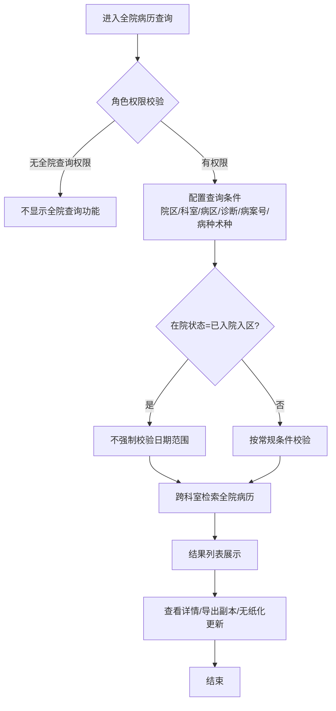
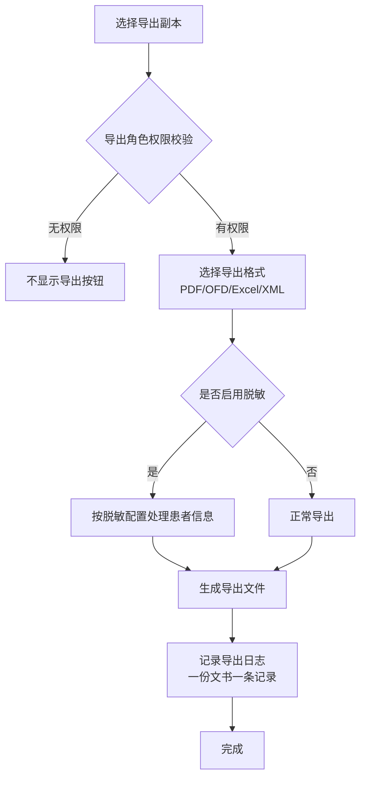

# BLGL-10-BLCX-002全院病历查询_ Analyst - Spec

> **需求编号**：BLGL-10-BLCX-002
> **父需求**：BLGL-10-BLCX
> **关联PM Spec**：BLGL-10-BLCX-002_全院病历查询_PM-spec.md
> **Spec版本**：V1.0
> **编写时间**：2026-08-14
> **编写人**：需求分析师

---

## 一、功能编号体系

### 1.1 功能层级结构

```
BLGL-10-BLCX-002: 全院病历查询
 ├─ BLGL-10-BLCX-002-01: 全院病历多条件检索
 │ ├─ -01-01: 查询条件配置（院区/科室/病区/诊断/病案号/病种术种/患者类型）
 │ ├─ -01-02: 查询执行（跨科室检索 + 角色权限校验）
 │ └─ -01-03: 结果列表展示（出院时间/结算时间/总费用/结算日期/门诊医生等列）
 ├─ BLGL-10-BLCX-002-02: 全院查询权限与数据范围
 │ ├─ -02-01: 全院查询角色权限控制
 │ ├─ -02-02: 在区患者时间校验豁免
 │ └─ -02-03: 已停用科室历史病历查询
 └─ BLGL-10-BLCX-002-03: 查询结果支撑操作
 ├─ -03-01: 导出副本（PDF/OFD/Excel/XML，含脱敏/权限/日志）
 ├─ -03-02: 无纸化文件更新
 └─ -03-03: 病历详情查看（跳转）
```

### 1.2 功能编号表

| REQ-ID | 功能名称 | 类型 | 优先级 | 说明 |
|--------|---------|------|--------|
| BLGL-10-BLCX-002-01 | 全院病历多条件检索 | 功能 | P0 | 跨科室检索全院病历并展示结果列表 |
| BLGL-10-BLCX-002-01-01 | 查询条件配置 | 子功能 | P0 | 院区/科室/病区/诊断/病案号/病种术种/患者类型 |
| BLGL-10-BLCX-002-01-02 | 查询执行 | 子功能 | P0 | 跨科室检索 + 角色权限校验 |
| BLGL-10-BLCX-002-01-03 | 结果列表展示 | 子功能 | P0 | 出院时间/结算时间/总费用/结算日期/门诊医生等列 |
| BLGL-10-BLCX-002-02 | 全院查询权限与数据范围 | 功能 | P0 | 角色权限、时间校验豁免、已停用科室 |
| BLGL-10-BLCX-002-02-01 | 全院查询角色权限控制 | 子功能 | P0 | 按角色控制全院查询功能 |
| BLGL-10-BLCX-002-02-02 | 在区患者时间校验豁免 | 子功能 | P1 | 已入院入区患者不校验日期范围 |
| BLGL-10-BLCX-002-02-03 | 已停用科室历史病历 | 子功能 | P1 | 支持查询已停用科室病历 |
| BLGL-10-BLCX-002-03 | 查询结果支撑操作 | 功能 | P1 | 导出副本、无纸化更新、详情查看 |
| BLGL-10-BLCX-002-03-01 | 导出副本 | 子功能 | P1 | 导出PDF/OFD/Excel/XML，含脱敏/权限/日志 |
| BLGL-10-BLCX-002-03-02 | 无纸化文件更新 | 子功能 | P1 | 一键触发PDF重新生成和上传 |
| BLGL-10-BLCX-002-03-03 | 病历详情查看 | 子功能 | P1 | 查看病历详情（支撑能力） |

---

## 二、核心业务流程

### 2.1 全院病历检索流程



### 2.2 导出副本流程



---

## 三、功能规格说明

---

### BLGL-10-BLCX-002-01: 全院病历多条件检索

#### 3.1.1 功能概述

医务/病案/质控用户在具备全院查询权限的前提下，跨科室检索全院患者病历。查询条件支持院区、科室、病区、诊断、病案号、病种/术种、患者类型结果列表展示完整患者病历信息。

#### 3.1.2 用户角色

| 角色 | 使用场景 | 权限要求 | 操作频率 |
|------|---------|---------|---------|
| 医务科主任/管理人员 | 跨科室查看全院病历、质量监管 | 全院查询角色权限 | 中频 |
| 病案室（主任/统计员/质控员/上报员） | 病案管理、统计上报 | 全院查询角色权限 | 高频 |
| 质控系统用户 | 全院质控查询 | 质控系统菜单权限 | 高频 |
| 医疗总值班 | 全院病历查看 | 全院查询权限 | 低频 |

#### 3.1.3 业务流程（Given/When/Then）

##### 主流程

**Scenario 1: 全院病历跨科室检索**

```gherkin
Given:
 - 用户角色已配置为可查看全院病历的角色
 - 系统已配置全院查询角色权限参数

When:
 - 用户进入"病历管理-全院病历查询"
 - 配置查询条件：院区、科室、病区、诊断、出院时间
 - 点击查询按钮

Then:
 - 系统跨科室检索全院匹配的患者病历
 - 结果列表展示（含出院时间、结算时间、总费用、结算日期、门诊医生等列）
 - 用户可查看病历详情、导出副本、无纸化文件更新
```

##### 异常流程

**Scenario 2: 业务异常——权限不足**

```gherkin
Given:
 - 用户角色未配置为可查看全院病历的角色

When:
 - 用户尝试进入全院病历查询

Then:
 - 系统不显示全院查询功能或限制访问
 - ⏳ 待确认：权限不足时的具体提示
```

**Scenario 3: 数据异常——SQL报错**

```gherkin
Given:
 - 全院病历查询执行条件触发数据库查询

When:
 - 用户点击查询按钮

Then:
 - 系统报"未找到要求的 FROM 关键字"错误（ORA-00923）
 - ⏳ 待确认：具体 SQL 逻辑问题
```

**Scenario 4: 系统异常——导出PDF脱敏不起效**

```gherkin
Given:
 - 已配置全院查询脱敏设置（1003）

When:
 - 用户在全院查询导出PDF

Then:
 - 导出的PDF患者信息未脱敏（配置不起效）
 - 系统应排查前端调用链路，确保传递并处理 desensitizeFlag 标志
```

##### 边界流程

**Scenario 5: 边界场景——在区患者时间限制**

```gherkin
Given:
 - 查询条件在院状态=已入院入区

When:
 - 用户执行查询

Then:
 - 系统不强制校验患者信息或日期范围（去掉必填限制）
```

**Scenario 6: 边界场景——已停用科室查询**

```gherkin
Given:
 - 医院存在已停用科室

When:
 - 用户在科室选项选择已停用科室

Then:
 - 系统支持查询已停用科室的病历信息
 - 科室名称后增加"（停用）"标识
```

#### 3.1.4 数据字段定义

> 字段名来自代码扫描（`E:\39EMR\sr-next`，标注 `` 的来自 `DailyManageInpRhbRecordQueryInputAO` 查询入参 / `InpRhbRecordInfoOutputVO` 结果输出）。

| 字段名 | 类型 | 必填 | 默认值 | 取值范围 | 说明 | 概念ID |
|--------|------|------|--------|---------|------|--------|
| deptIds | List\<Long\> | 否 | 空 | 科室ID多选 | 科室范围（多选，支持全院科室） | ⏳ 待确认 |
| keySearch | String | 否 | 空 | - | 关键词检索 | ⏳ 待确认 |
| dischargedAtStart/End | Date | 否 | - | - | 出院日期范围 | ⏳ 待确认 |
| inpatientStatus | Long | 否 | - | 在院/出院 | 在院状态 | ⏳ 待确认 |
| medicalInsuranceCodes | List\<Long\> | 否 | 空 | 医保类型多选 | 医保类型 | ⏳ 待确认 |
| surgeryDateStart | Date | 否 | - | - | 手术日期范围 | ⏳ 待确认 |
| currentDeptName / currentWardName | String | - | - | - | 结果列：当前科室/病区 | ⏳ 待确认 |
| dischargedAt / dischargedFromWardAt | Date | - | - | - | 结果列：出院时间/出区时间 | ⏳ 待确认 |
| expenseAmount | BigDecimal | - | - | - | 结果列：患者费用（总费用 | ⏳ 待确认 |
| hospitalizationDays | Long | - | - | - | 结果列：住院天数 | ⏳ 待确认 |
| dutyDoctName / dutyNursName | String | - | - | - | 结果列：责任医生/责任护士 | ⏳ 待确认 |
| medicalInsuranceName | String | - | - | - | 结果列：医保类型名称 | ⏳ 待确认 |
| hospitalAreaName | String | - | - | - | 结果列：院区 | ⏳ 待确认 |

> ⏳ 待确认：病案号（CASE_NO）、结算时间/结算日期（INPATIENT_SETTLEMENT.SETTLED_AT）、门诊医生（INPAT_REGISTER）、出院病种/术种（queryTagOptions）等新增列字段映射待接口契约文档补充。

#### 3.1.5 验收标准

| AC编号 | 验收标准 | 对应REQ-ID | 验证方法 | 验证场景 |
|--------|---------|-----------|--------|
| AC-001 | 配置院区/科室/诊断等条件查询，返回跨科室全院匹配病历，结果列含出院时间/结算时间/总费用/结算日期 | -002-01 | 功能测试 | Scenario 1 |
| AC-002 | 按病案号查询能检索到对应病历 | -002-01 | 功能测试 | Scenario 1 |
| AC-003 | 按病种/术种标签筛选返回匹配病历 | -002-01 | 功能测试 | Scenario 1 |
| AC-004 | 在院状态=已入院入区时查询不强制校验日期范围 | -002-01 | 功能测试 | Scenario 5 |
| AC-005 | 选择已停用科室能查询病历，名称带（停用） | -002-01 | 功能测试 | Scenario 6 |
| AC-006 | 未配置权限的用户不能使用全院查询功能 | -002-01 | 安全测试 | Scenario 2 |

---

### BLGL-10-BLCX-002-02: 全院查询权限与数据范围

#### 3.2.1 功能概述

控制全院查询的访问权限与数据范围：按用户角色控制全院查询功能；在区患者查询豁免时间校验；支持查询已停用科室的历史病历。

#### 3.2.2 用户角色

| 角色 | 使用场景 | 权限要求 | 操作频率 |
|------|---------|---------|---------|
| 医务科主任/管理人员 | 全院病历查看 | 角色配置（参数：全院病历查询页面需要判断科室权限的角色） | 中频 |
| 病案室/质控用户 | 全院病历管理 | 角色配置 | 高频 |

#### 3.2.3 业务流程（Given/When/Then）

##### 主流程

**Scenario 1: 角色权限控制**

```gherkin
Given:
 - 系统已配置全院查询角色权限参数（取用户角色）

When:
 - 用户尝试使用全院查询

Then:
 - 系统校验用户角色，配置的角色可使用全院查询功能
 - 未配置的角色不能使用
```

##### 异常流程

**Scenario 2: 数据异常——角色配置缺失**

```gherkin
Given:
 - 全院查询角色权限参数未配置

When:
 - 用户使用全院查询

Then:
 - ⏳ 待确认：参数未配置时的默认行为（是否默认全部开放或关闭）
```

##### 边界流程

**Scenario 3: 边界场景——在区患者查询**

```gherkin
Given:
 - 查询条件在院状态=已入院入区
 - 在区患者数量上限固定

When:
 - 用户执行查询

Then:
 - 系统不校验患者信息或日期范围必填
```

#### 3.2.4 数据字段定义

| 字段名 | 类型 | 必填 | 默认值 | 取值范围 | 说明 | 概念ID |
|--------|------|------|--------|---------|------|--------|
| 全院查询角色 | String | 否 | 空 | 用户角色术语 | 可查看全院病历的角色 | ⏳ 待确认 |

#### 3.2.5 验收标准

| AC编号 | 验收标准 | 对应REQ-ID | 验证方法 | 验证场景 |
|--------|---------|-----------|--------|
| AC-007 | 按角色配置的用户可使用全院查询，未配置角色不可用 | -002-02 | 安全测试 | Scenario 1 |
| AC-008 | 在区患者查询不强制校验日期范围 | -002-02 | 功能测试 | Scenario 3 |

---

### BLGL-10-BLCX-002-03: 查询结果支撑操作

#### 3.3.1 功能概述

全院病历查询结果支持导出副本（PDF/OFD/Excel/XML，含角色权限控制、PDF脱敏、导出日志）、无纸化文件更新（一键补传PDF）与病历详情查看。对应 Phase 1 基础能力（BC-BLCX-002、BC-BLCX-001）。

#### 3.3.2 用户角色

| 角色 | 使用场景 | 权限要求 | 操作频率 |
|------|---------|---------|---------|
| 病案室（主任/统计员/质控员/上报员） | 导出副本、无纸化更新 | 导出角色权限（COMMON159） | 中频 |
| 医务科主任 | 导出副本 | 导出角色权限 | 低频 |

#### 3.3.3 业务流程（Given/When/Then）

##### 主流程

**Scenario 1: 导出副本（含脱敏与日志）**

```gherkin
Given:
 - 用户具有导出角色权限
 - 已配置全院查询脱敏设置

When:
 - 用户选择导出副本并选择格式

Then:
 - 系统按脱敏配置处理患者信息后生成导出文件
 - 导出操作记录到导出日志（一份文书一条记录）
```

##### 异常流程

**Scenario 2: 系统异常——无纸化更新失败**

```gherkin
Given:
 - 病案室点击无纸化文件更新按钮
 - PDF重新生成服务异常

When:
 - 系统执行PDF重新生成和上传

Then:
 - ⏳ 待确认：更新失败时的提示与重试机制
```

##### 边界流程

**Scenario 3: 边界场景——导出数据量超限**

```gherkin
Given:
 - 查询结果超过 500 条

When:
 - 用户点击导出Excel

Then:
 - 系统按查询结果全量导出（前端分页组装），不再限制 499 条
```

#### 3.3.4 数据字段定义

> 导出接口来自代码扫描（标注 ``）。

| 字段名 | 类型 | 必填 | 默认值 | 取值范围 | 说明 | 概念ID |
|--------|------|------|--------|---------|------|--------|
| 导出格式 | String | 否 | PDF | PDF/OFD/Word/XML/HTML | 导出副本格式（COMMON179） | ⏳ 待确认 |
| desensitizeFlag | Boolean | 否 | 否 | true/false | 是否脱敏标志 | ⏳ 待确认 |
| exportDailyManageInpRhbRecord | - | 否 | - | - | 全院查询-导出副本：/emr_inpatient/export_daily_manage_inp_rhb_record | ⏳ 待确认 |
| exportPdf / exportWord / queryXmlOrHtml | - | 否 | - | - | 导出PDF/Word/XML/HTML：/emr_pdf_file/export/by_encounter_ids | ⏳ 待确认 |
| exportMainPagePdf | - | 否 | - | - | 导出病案首页PDF：/emr_mahp_pdf_file/export/by_encounter_ids | ⏳ 待确认 |

#### 3.3.5 验收标准

| AC编号 | 验收标准 | 对应REQ-ID | 验证方法 | 验证场景 |
|--------|---------|-----------|--------|
| AC-009 | 导出PDF时患者信息按脱敏配置脱敏 | -002-03 | 安全测试 | Scenario 1 |
| AC-010 | 导出副本操作记录到导出日志，一份文书一条记录 | -002-03 | 功能测试 | Scenario 1 |
| AC-011 | 无纸化文件更新能触发PDF重新生成和上传 | -002-03 | 集成测试 | Scenario 2 |
| AC-012 | 导出超过500条数据时按查询结果全量导出 | -002-03 | 集成测试 | Scenario 3 |

---

## 四、排除范围

本需求不包含以下功能项：

1. **科室病历查询** - 本科室权限范围检索，属 BLGL-10-BLCX-001
2. **病历结构化查询** - 按元素/段落检索，属 BLGL-10-BLCX-003
3. **病历详情查看详细设计** - 属基础能力 BC-BLCX-001
4. **病历书写、归档借阅、模板管理** - 属其他模块

> 与 PM-Spec 第四章一致。对照 Phase 1 功能点Spec 第6章（基线能力），确保不越界。

---

## 五、业务规则清单

| 规则ID | 规则名称 | 规则描述 | 优先级 |
|--------|---------|---------|--------|
| BR-001 | 全院查询角色权限 | 全院查询功能按用户角色配置控制，替代专业技术职务 | P0 |
| BR-002 | 跨科室检索 | 全院查询条件不受医生科室权限限制 | P0 |
| BR-003 | 出院时间/结算时间区分 | 出院时间=出院医嘱时间，结算时间=办理结算后的时间 | P1 |
| BR-004 | 全部诊断检索 | 诊断检索需检索病历中的全部诊断（主+次），INPATIENT_RHB_DIAGNOSIS 落库 | P1 |
| BR-005 | 病案号查询 | 患者信息查询条件增加病案号，取 INPATIENT_RECORD.CASE_NO | P1 |
| BR-006 | 导出脱敏 | 导出PDF患者信息按脱敏配置处理，传递 desensitizeFlag | P1 |
| BR-007 | 导出日志 | 导出副本操作记录日志，一份文书一条记录 | P1 |
| BR-008 | 在区患者时间豁免 | 在院状态=已入院入区时，去掉患者信息或日期范围必填限制 | P1 |
| BR-009 | 已停用科室 | 支持查询已停用科室病历，科室名称带"（停用）" | P1 |
| BR-010 | 患者类型多选 | 患者类型筛选支持多选（危重+输血等） | P1 |

---

## 六、关联文档

| 文档类型 | 文档路径 | 说明 |
|---------|---------|
| 功能点Spec | BLGL-10-BLCX 10病历查询功能点Spec.md（V1.1，上级目录） | Phase 1 功能点索引 |
| PM spec | 本目录 BLGL-10-BLCX-002_全院病历查询_PM-spec.md（V0.1） | PM 产出的 Spec 文档 |
| -Spec | 本目录 BLGL-10-BLCX-002_全院病历查询-Spec.md（V1.0） | 业务背景与目标 Spec |
| data-model.md | 待产出 | 架构师产出的数据建模文档 |
| design.md | 待产出 | 架构师产出的技术方案文档 |
| api-contract.md | 待产出 | 开发经理产出的 API 契约文档 |

---

## 七、待确认问题清单

| 编号 | 问题描述 | 缺失信息 | 影响范围 | 建议补充方 |
|------|---------|---------|--------|
| Q-001 | 权限不足时的具体提示 | 无权限访问提示方案 | 3.1.3 Scenario 2 | 产品经理 |
| Q-002 | SQL报错根因 | ORA-00923 具体 SQL 逻辑 | 3.1.3 Scenario 3 | 开发经理 |
| Q-003 | 脱敏配置不起效根因 | 前端调用链路、desensitizeFlag 传递 | 3.1.3 Scenario 4 | 开发/产品经理 |
| Q-004 | 无纸化更新失败提示 | 更新失败提示与重试机制 | 3.3.3 Scenario 2 | 产品经理 |
| Q-005 | 完整查询入参/接口契约 | API 请求/返回字段 | 第5章接口设计 | 开发经理 |
| Q-006 | 概念ID、状态枚举、性能指标 | 字段概念ID、状态定义、SLA | 数据模型、非功能 | 架构师/产品经理 |
| Q-007 | 角色配置缺失默认行为 | 参数未配置时全院查询开关 | 3.2.3 Scenario 2 | 产品经理 |

---

## 填写检查清单

| 序号 | 检查项 | 是否完成 |
|:----:|--------|:--------:|
| 1 | 功能编号带父子层级 | ✅ |
| 2 | 每个 REQ-ID 有功能概述和用户角色 | ✅ |
| 3 | 主流程至少 1 个 Given/When/Then 场景 | ✅ |
| 4 | 异常流程至少 3 个 Given/When/Then 场景 | ✅ |
| 5 | 边界流程至少 2 个 Given/When/Then 场景 | ✅ |
| 6 | 每个 Given/When/Then 内容具体，不模糊 | ✅ |
| 7 | 数据字段定义完整 | ✅ |
| 8 | 验收标准 AC 编号独立，可验证 | ✅ |
| 9 | 验收标准无"功能正常"等模糊表述 | ✅ |
| 10 | 排除范围明确列出 | ✅ |
| 11 | 业务规则清单列出所有规则，每条标注来源 | ✅ |
| 12 | 流程图使用 Mermaid 格式（≥2 个） | ✅ |
| 13 | 关联文档索引包含 Phase 1 功能点Spec | ✅ |
| 14 | 待确认问题清单汇总了全文所有 ⏳ 项 | ✅ |
| 15 | 全文无占位符 `< >` 残留 | ✅ |
| 16 | 全文陈述可溯源至资料区（S1~S10 溯源核查） | ✅ |
| 17 | 人工审核确认完成 | ⏳ 待确认 |

---

**文档状态**：⬜ 待审核
**维护责任**：需求分析师规范组
**下次更新**：根据评审反馈优化

---

## 版本历史

| 版本 | 日期 | 变更说明 | 编写人 |
|------|------|---------|--------|
| V1.0 | 2026-08-14 | 初始版本 | 需求分析师 |
