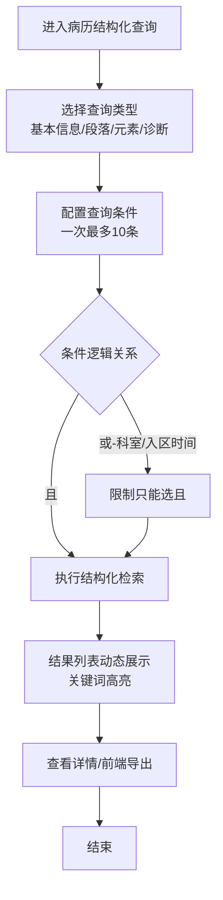
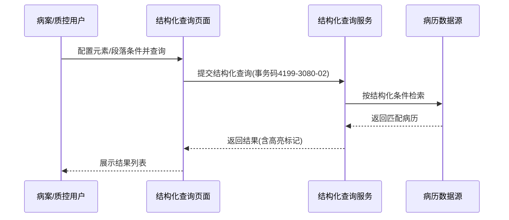

# BLGL-10-BLCX-003 病历结构化查询-Spec

> **功能编号**：BLGL-10-BLCX-003
> **文档类型**：功能Spec（业务背景与设计）
> **文档版本**：V1.0
> **编写时间**：2026-08-14
> **编写人**：RACC

---

## 文档索引

#### 章节索引

**Spec（研发视角）**

| 章节号 | 章节名称 |
|--------|---------|
| 1、 | 文档概述 |
| 2、 | 功能背景与定位 |
| 3、 | 业务流程设计 |
| 4、 | 数据模型设计 |
| 5、 | 接口契约设计 |
| 6、 | 技术方案设计 |
| 7、 | 测试用例预设计 |
| 8、 | 非功能性要求 |
| 9、 | 依赖与风险 |
| 10、 | 附录 |

**PM-Spec（业务视角）**

| 章节号 | 章节名称 | 内容说明 |
|--------|---------|---------|
| 一 | 目标 | 功能定位与核心价值 |
| 二 | 约束 | 业务/技术/非功能性约束 |
| 三 | 验收标准 | 验收条件与验证方法 |
| 四 | 排除范围 | 本次不做项与明确边界 |
| 五 | 关键决策记录 | 方案决策与选型理由 |
| 六 | 优先级 | 优先级定义 |
| 七 | 关联文档 | 关联文档索引 |
| 附录 | 填写检查清单 | 质量检查 |

**Analyst-Spec（产品视角）**

| 章节号 | 章节名称 | 内容说明 |
|--------|---------|---------|
| 一 | 功能编号体系 | 功能编号与层级结构 |
| 二 | 核心业务流程 | 核心业务流程与时序 |
| 三 | 功能规格说明 | 详细功能规格与验收标准 |
| 四 | 排除范围 | 排除范围 |
| 五 | 业务规则清单 | 业务规则清单 |
| 六 | 关联文档 | 关联文档索引 |
| 七 | 待确认问题清单 | 待确认问题汇总 |
| - | 填写检查清单 | 质量检查 |

#### 版本历史

| 版本 | 日期 | 变更说明 | 编写人 |
|------|------|---------|--------|
| V1.0 | 2026-08-14 | 初始版本 | RACC |

#### 关联文档索引

| 序号 | 文档名称 | 文档类型 | 版本 | 位置 |
|------|---------|---------|------|------|
| 1 | BLGL-10-BLCX-003_病历结构化查询-Spec.md | 功能Spec（业务背景与设计）（本文档） | V1.0 | 本目录 |
| 2 | BLGL-10-BLCX-003_病历结构化查询_PM-spec.md | PM-Spec（需求规格） | V0.1 | 本目录 |
| 3 | BLGL-10-BLCX-003_病历结构化查询_Analyst-spec.md | Analyst-Spec（分析规格） | V1.0 | 本目录 |
| 4 | BLGL-10-BLCX 10病历查询功能点Spec.md | 功能点Spec（模块级） | V1.1 | 上级目录 |

---

## 1、文档概述

### 1.1、文档目的

本文档旨在明确"病历结构化查询"功能（BLGL-10-BLCX-003）的业务背景与设计方案，为需求分析、研发实现、测试验收及评审提供统一的业务上下文、设计口径与决策依据。

### 1.2、文档范围

#### 1.2.1 纳入范围

本文档覆盖病历结构化查询的完整业务背景与设计，包括：

- 按病历元素/段落/基本信息/诊断信息多条件组合检索结构化病历数据
- 查询模板保存与共享（我的查询/共享查询）
- 查询条件运算符（等于/不等于/包含/不包含）与枚举类型查询
- 查询结果列表动态展示（按检索条件动态加列、空列自动隐藏、检索关键字高亮）
- 查询范围控制（科室全院选择、病案首页数据检索）
- 前端本地导出

#### 1.2.2 排除范围

本文档不涉及以下内容（详见其他功能点或模块）：

- 科室病历查询（本科室权限范围检索）—— BLGL-10-BLCX-001
- 全院病历查询（跨科室检索）—— BLGL-10-BLCX-002
- 病历详情查看、查询条件保存、列选项设置、参数配置 —— Phase 1 功能点Spec 第6章基础能力（BC-BLCX-001~007）
- 病历书写、归档借阅、模板管理等 —— 其他模块

### 1.3、术语定义

| 术语 | 定义 |
|------|------|
| 病历结构化查询 | 按病历元素/段落/基本信息/诊断信息等结构化数据检索住院病历的查询场景 |
| 元素 | 病历文书中的结构化数据单元（如主诉、体温等），分为"元素"和"病历分类→元素" |
| 段落 | 病历文书中的段落内容（如入院记录中的主诉），分为"段落"和"病历分类→段落" |
| 查询模板 | 保存的查询条件集合，支持"我的查询"和"共享查询" |
| 运算符 | 查询条件的关系运算：等于/不等于/包含/不包含 |
| 关键词高亮 | 检索结果中满足条件的元素/段落内容以黄色标注 |

> ⏳ 待确认：规范术语表待产品文档确认。

### 1.4、阅读指南

- **章节关系**：第1~2章为业务全貌，第3~10章为设计实现层。与 Analyst-Spec、PM-Spec 互相引用保持一致。
- **读者对象**：产品经理/需求分析师读第1~2章；研发读第3~6、9~10章；测试读第3、7~8章；评审人员核对各层一致性。

### 1.5、参考文档

| 序号 | 文档名称 | 版本/日期 |
|------|---------|
| 1 | 【历史需求】住院病历的历史需求.xlsx | - |
| 2 | BLGL-10-BLCX-003_病历结构化查询_PM-spec.md | V0.1 |
| 3 | BLGL-10-BLCX-003_病历结构化查询_Analyst-spec.md | V1.0 |
| 4 | BLGL-10-BLCX 10病历查询功能点Spec.md | V1.1 |
| 5 | WiNEX-住院病历查询功能清单_20260330.md | 2026-03-30 |

---

## 2、功能背景与定位

### 2.1 功能背景

病历结构化查询是病案室/质控/统计员按结构化数据检索病历的核心工具，需满足：

- **管理要求**：病案室/质控需要按病历元素、段落、诊断等结构化数据检索，支持保存查询条件反复使用
- **现状痛点**：
 - 科室选择受限：仅支持当前登录科室，病案室无法查询全院科室病历
 - 病案首页数据检索不到：结构化查询不支持病历中的首页数据
 - 空条件列/不包含列显示问题：查询结果列展示不完整
 - "或"逻辑查询卡死：科室、入区日期选"或"导致数据库阻塞
 - 关键词无高亮：五级评审要求检索关键字高亮
- **历史需求演进**：从新增结构化查询菜单→ 拆分段落查询/基本信息查询/模板保存（、308644、308648）→ 运算符增强（等于/不等于，、1288145）→ 结果展示优化（动态加列、空列隐藏、关键词高亮，、1538600、1115158）→ 查询范围与性能（全院科室、防"或"卡死，、1478659）→ 前端导出

### 2.2 功能定位

"病历结构化查询"是 WiNEX 病历管理-病历查询模块的结构化检索能力，定位为：

- **结构化数据检索入口**：按元素/段落/基本信息/诊断检索住院病历
- **精确检索工具**：等于/不等于/包含/不包含多运算符组合
- **查询模板复用**：我的查询/共享查询，支持保存反复使用
- **质控评级支撑**：满足电子病历五级评审高亮检索要求

### 2.3 目标用户

| 用户角色 | 主要使用场景 |
|---------|-------------|
| 病案室（统计员/质控员/上报员） | 按结构化数据检索病历、全院病历字段查询 |
| 质控系统用户 | 质控病历检索、缺陷定位 |
| 住院医生 | 按元素/段落检索本科室病历（具备全院查询角色的可查全院） |

### 2.4 核心价值

| 价值维度 | 价值描述 |
|---------|---------|
| 检索精准 | 按元素/段落/诊断结构化检索，等于/不等于/包含/不包含多运算符 |
| 效率复用 | 查询模板保存共享，反复使用 |
| 评级合规 | 关键词高亮满足电子病历五级评审 |
| 展示直观 | 结果列按检索条件动态展示、空列自动隐藏 |

---

## 3、业务流程设计（Given/When/Then）

### 3.1 主流程

**Scenario 1: 病历结构化多条件检索**

```gherkin
Given:
 - 用户已登录并具有病历结构化查询菜单权限
 - 病历数据已结构化落库（元素/段落表）

When:
 - 用户进入"病历管理-病历结构化查询"
 - 配置查询条件：基本信息（姓名/住院号/科室/病区）+ 段落/元素（主诉包含"咳嗽"）+ 诊断
 - 条件一次最多编辑 10 条
 - 点击查询按钮

Then:
 - 系统按结构化条件检索匹配的患者病历
 - 结果列表按检索条件动态展示对应列
 - 涉及文书内容的查询时，检索关键字在列表中黄色标注
```

### 3.2 异常流程

**Scenario 2: 业务异常——"或"逻辑数据库阻塞**

```gherkin
Given:
 - 用户选择科室、入区日期等条件

When:
 - 用户将条件间逻辑选择为"或"

Then:
 - 系统可能把全量数据查出来导致数据库阻塞、系统卡慢
 - 前端及后端限制科室、入区时间条件只能选"且"，不能选"或"
```

**Scenario 3: 数据异常——病案首页数据检索不到**

```gherkin
Given:
 - 用户选择病历分类为病案首页的内容查询

When:
 - 用户执行结构化查询

Then:
 - 系统查询无数据（结构化查询不支持病历中的首页数据检索）
 - 系统应先查询病历病案首页表，再查病案病案首页表数据
```

**Scenario 4: 系统异常——查询服务同步阻塞**

```gherkin
Given:
 - 查询数据量较大
 - 后端接口同步处理（事务码 4199-3080-02 调用查询服务）

When:
 - 用户点击查询按钮

Then:
 - 界面出现卡住无响应
 - 系统应增加"正在查询中"文字提示（当前仅按钮 loading）
```

### 3.3 边界流程

**Scenario 5: 边界场景——科室全院选择**

```gherkin
Given:
 - 用户角色配置为允许查询全院数据的角色（医生站病历结构化查询页面允许查询全院数据的角色参数）

When:
 - 用户在基本信息[科室]选择全院科室

Then:
 - 系统支持选择全院科室，移除科室选择数量限制（原最多10个）
```

**Scenario 6: 边界场景——空条件/不包含列展示**

```gherkin
Given:
 - 查询条件使用"包含"运算符但后方条件值为空
 - 查询条件使用"不包含"运算符

When:
 - 用户执行查询并查看结果列表

Then:
 - "包含"条件为空时，结果列表仍展示该列内容
 - "不包含"运算符时不隐藏该列（可对比查看哪些病历不含某内容）
```

---

## 4、数据模型设计

> 数据模型信息来自代码扫描（`E:\39EMR\sr-next`）和历史需求。标注 `` 的表名/字段来自 PO 实体或输入/输出 AO/VO，标注 `` 的来自需求文本。

### 4.1 核心数据结构

#### 4.1.1 核心查询入参（InpRhbStructuredRecordQueryInputAO + InpEmrQueryConditionInputAO）

| 字段名 | 类型 | 必填 | 备注 |
|--------|------|------|------|
| encounterIds | List\<Long\> | 否 | 就诊记录ID集合 |
| queryConditions | List\<InpEmrQueryConditionInputAO\> | 是 | 结构化查询条件集合 |
| apiVersion | String | 否 | 接口版本（V1/V2 |
| secrecyLevelCodes | List\<Long\> | 否 | 保密级别集合 |
| inpEmrQueryTemplateId | Long | 否 | 查询模板ID |
| inpEmrClassId | Long | 否 | 病历分类ID |
| queryFieldName | String | 否 | 查询字段名称 |
| queryFieldNo | String | 否 | 查询字段编号 |
| queryConditionTypeNo | String | 否 | 查询条件类型编号（基本信息/段落/元素） |
| queryConditionOperatorNo | String | 否 | 查询条件运算符编号（等于/不等于/包含/不包含） |
| queryConditionFactorValue | String | 否 | 查询条件值 |
| emrDataElemTypeId | Long | 否 | 数据元素类型ID（枚举类型） |
| seqNo | Integer | 否 | 条件序号 |

> ⏳ 待确认：条件一次最多 10 条的业务约束为需求约束，代码层以 seqNo 标识顺序。

#### 4.1.2 核心表/实体

| 表/实体 | 关键字段 | 说明 |
|---------|---------|------|
| EMR_MRT_DATA_ELEMENT_SECTION | 段落名称/概念ID | 段落表，支持名称和概念ID搜索 |
| INPATIENT_RHB_RECORD（InpatientRhbRecordPO） | ENCOUNTER_ID、PATIENT_NAME、DISCHARGED_AT | 病历簿表，结构化查询结果病历数据 |
| INPATIENT_RHB_DIAGNOSIS（InpatientRhbDiagnosisPO） | DIAGNOSIS_TYPE_CODE、DIAGNOSIS_CODE | 病历诊断表，诊断信息查询数据源 |
| 病历病案首页表 | - | 结构化查询病案首页数据来源 |
| 病案病案首页表 | - | 三方病案系统首页数据 |

> ⏳ 待确认：段落/元素结构化数据表（EMR_MRT_DATA_ELEMENT_*）的完整表清单待代码扫描补充。

### 4.2 状态定义

| 状态码 | 状态名称 | 说明 |
|--------|---------|------|
| inpatientStatus | 在院状态 | 在院/出院 |

> ⏳ 待确认：状态枚举值定义未在代码扫描中提取完整。

### 4.3 系统参数定义

| 参数编码 | 参数名称 | 说明 |
|---------|---------|------|
| 医生站病历结构化查询页面允许查询全院数据的角色 | 全院数据查询角色 | 配置角色后，该角色在结构化查询可选择全院科室 |
| COMMON228 | 病历结构化查询是否启用存储优化后的新接口 | 默认是，控制结构化查询接口 |

---
## 5、接口契约设计

> 接口信息来自代码扫描（`E:\39EMR\sr-next`）的 InpEmrStructuredController + InpEmrStructuredApiPathConstants。标注 ``。

### 5.1 API列表

| 序号 | API名称（代码函数） | 路径 | 方法 | 说明 |
|:----:|---------|------|:----:|------|
| 1 | queryInpRhbStructuredRecordByExample / V2 | /api/v1/app_record_inpatient/emr_structured/query/by_example（V1）/ /api/v2/app_record_inpatient/emr_structured/query/by_example（V2） | POST | 根据结构化参数查询病历簿（InpEmrStructuredController，tags: 病历结构化） |
| 2 | exportInpRhbStructuredRecordByExample | /api/v1/app_record_inpatient/emr_structured/query/export_structured_record | POST | 根据结构化参数导出病历簿 |
| 3 | saveInpEmrQueryTemplate | /api/v1/app_record_inpatient/inp_emr_query_template/save/by_example | POST | 保存结构化病历查询模板 |
| 4 | saveInpEmrQueryConditionByQueryTemplateId | /api/v1/app_record_inpatient/inp_emr_query_condition/save/by_id | POST | 根据模板ID保存查询条件 |
| 5 | queryGroupInpEmrQueryTemplate | /api/v1/app_record_inpatient/inp_emr_query_template/query/by_example | POST | 查询查询模板分组 |
| 6 | queryInpEmrQueryConditionByInpEmrQueryTemplateId | /api/v1/app_record_inpatient/inp_emr_query_condition/query/by_id | POST | 根据模板ID查询查询条件 |
| 7 | deleteInpEmrQueryConditionByQueryTemplateId | /api/v1/app_record_inpatient/inp_emr_query_condition/delete/by_id | POST | 根据模板ID删除查询条件 |
| 8 | queryInpEmrSetIdByConditions | /api/v1/app_record_inpatient/emr_inpatient_set_ids/query/by_example | POST | 根据条件查询有效的病历ID集合 |
| 9 | queryEmrMrtSectionDistictByExample | /api/v1/app_record_inpatient/emr_mrt_section/distinct/query/by_example | POST | 查询去重后的模板段落结构化数据 |
| 10 | queryEmrMrtElementDistictByExample | /api/v1/app_record_inpatient/emr_mrt_element/distinct/query/by_example | POST | 查询去重后的模板数据元结构化数据 |
| 11 | queryInpEmrQueryConditionByInpEmrQueryTemplateId（值域） | /api/v1/app_record_inpatient/emr_mrt_element_value/distinct/query/by_concept_id | POST | 根据查询元素概念ID查询值域 |

> 前端实际请求前缀：`/inpatient-clinicalnote/api/v1/app_record_inpatient/`。

### 5.2 接口详细设计

#### 5.2.1 结构化查询-查询病历簿（queryInpRhbStructuredRecordByExample）

**请求参数（InpRhbStructuredRecordQueryInputAO）**:
```json
{
 "encounterIds": []
 "queryConditions": [
 {
 "queryConditionTypeNo": "element"
 "queryFieldNo": "主诉"
 "queryConditionOperatorNo": "contains"
 "queryConditionFactorValue": "咳嗽"
 }
 ]
 "apiVersion": "v1"
 "secrecyLevelCodes": []
 "pageNum": 1
 "pageSize": 20
}
```

**返回值（成功，List\<InpRhbStructuredRecordOutputVO\>）**:
```json
{
 "success": true
 "data": [
 {
 "encounterId": "1001"
 "patientName": "张三"
 "inpRhbRecordId": "MR123"
 "sections": {"主诉": "咳嗽咳痰3天"}
 }
 ]
}
```

**返回值（失败）**:
```json
{
 "success": false
 "message": "查询失败"
 "data": null
}
```

> ⏳ 待确认：具体字段名/结构以接口契约文档为准，以上字段来自代码扫描的输入AO/输出VO。

### 5.3 错误码定义

| 错误码 | 错误信息 | 处理方式 |
|--------|---------|---------|
| ⏳ 待确认 | 查询段落数据报错 | 排查段落查询接口 |

> ⏳ 待确认：错误码定义未在代码扫描中提取完整。

---
## 6、技术方案设计

### 6.1 页面路径

- **页面路径**: 住院医生站→日常管理→病历管理→病历结构化查询
- **路由**: /structured-search（结构化查询，EmrManage.js）
- **前端组件**: pages/StructuredSearch/index.vue + api/index.js
- **前端工程**: winning-webui-inpatient-clinicalnote-pango（Vue2 + element-ui）
- **后端接口**: InpEmrStructuredController（tags: 病历结构化）

### 6.2 技术栈

| 类别 | 技术 | 版本 |
|------|------|------|
| 前端框架 | Vue | 2.6.14 |
| 前端UI | element-ui | 2.13.0 |
| 后端框架 | Spring Boot（Java） | java.version 17 |
| 构建工具 | webpack / Maven | 前端 webpack + 后端 Maven |
| 前端导出 | excel.worker.js（前端 worker） | - |

### 6.3 关键技术点

- 查询条件一次最多编辑 10 条，类型含基本信息/段落/元素
- 段落查询：查询段落表 EMR_MRT_DATA_ELEMENT_SECTION，支持名称和概念ID搜索
- 查询条件逻辑限制：科室、入区时间只能选"且"，防数据库阻塞
- 病案首页数据检索：先查病历病案首页表，再查病案病案首页表
- 枚举类型元素：等于/不等于运算符，前端拼接 code#文本 传给后端
- 结果列表动态加列、空列自动隐藏（住院号、姓名始终显示）
- 关键词高亮：只对指定元素/段落内的关键词高亮
- 前端本地导出：复用页面已展示的查询结果直接生成 Excel（excel.worker.js）
- 结构化查询接口 V1/V2 双版本：queryInpRhbStructuredRecordByExample / V2（COMMON228 控制启用新接口功能清单参数）

### 6.4 部署方案

⏳ 待确认：部署方案未在资料区中找到。

## 7、测试用例预设计

### 7.1 功能测试

| 用例编号 | 测试场景 | Given | When | Then |
|---------|---------|-------|--------|
| TC-001 | 结构化多条件检索 | 病历已结构化落库 | 配置基本信息+段落/元素+诊断条件并查询 | 返回匹配病历，结果列动态展示 |
| TC-002 | 查询模板保存 | 配置查询条件 | 另存为模板（我的/共享） | 模板保存成功，可复用 |
| TC-003 | 关键词高亮 | 主诉元素包含"咳嗽" | 查询后查看结果 | 主诉内"咳嗽"黄色高亮 |

### 7.2 边界测试

| 用例编号 | 测试场景 | Given | When | Then |
|---------|---------|-------|--------|
| TC-004 | 科室全院选择 | 用户配置为可查全院角色 | 选择全院科室 | 支持全院科室查询 |
| TC-005 | 空条件/不包含列 | "包含"后值为空 / "不包含" | 查看结果列表 | 列仍展示内容 |
| TC-006 | 固定列空值隐藏 | 患者别名全空 | 查询结果 | 患者别名列自动隐藏，住院号/姓名始终显示 |

### 7.3 异常测试

| 用例编号 | 测试场景 | Given | When | Then |
|---------|---------|-------|--------|
| TC-007 | "或"逻辑阻塞 | 选择科室、入区日期 | 选择"或"逻辑 | 限制只能选"且" |
| TC-008 | 病案首页检索无数据 | 选择病案首页分类 | 执行查询 | 先查病历首页表再查病案首页表 |

### 7.4 性能测试

| 用例编号 | 测试场景 | 指标 |
|---------|---------|
| TC-009 | 结构化查询响应 |

---

## 8、非功能性要求

### 8.1 性能要求

| 指标 | 要求 |
|------|------|
| 查询响应时间 | ⏳ 待确认 |

### 8.2 安全要求

| 要求 | 说明 |
|------|------|
| 查询范围控制 | 默认科室范围，按角色配置可查全院数据 |
| 保密患者控制 | 结构化查询支持保密患者控制 |

**医疗行业特殊要求**

| 要求 | 说明 |
|------|------|
| 五级评审合规 | 结构化检索关键词高亮 |
| 查询性能保障 | 防止"或"逻辑全表扫描导致阻塞 |

### 8.3 可用性要求

| 指标 | 要求值 |
|------|--------|
| 可用性 | ⏳ 待确认 |

### 8.4 兼容性要求

| 类型 | 要求 |
|------|------|
| 病案首页来源适配 | 支持病历系统/病案系统两种首页数据 |
| Oracle数据库 | CLOB字段不支持"="查询，选择类元素去掉等于/不等于 |

---

## 9、依赖与风险

### 9.1 外部依赖

| 依赖项 | 说明 |
|--------|------|
| 病历结构化数据落库 | 元素/段落数据需结构化落库 |
| 病案首页数据 | 病历/病案系统首页表 |
| 主数据角色配置 | 全院查询角色参数 |

### 9.2 风险项

| 风险项 | 等级 | 说明 | 应对方案 |
|--------|------|------|---------|
| 全表扫描性能风险 | 高 | "或"逻辑、无条件查询导致数据库阻塞 | 增加查询条件校验、限制"或"逻辑 |
| 病案首页检索兼容 | 中 | 三方病案系统首页数据源差异 | 分来源查询适配 |
| Oracle CLOB 限制 | 中 | CLOB 字段不支持"="查询 | 去掉选择类元素等于/不等于 |

---

## 10、附录

### 10.1 流程图



### 10.2 时序图



### 10.3 参考文档

- WiNEX-住院病历查询功能清单_20260330.md（H003、§3 参数配置、§6 功能边界）
- 【历史需求】住院病历的历史需求.xlsx（、195714、308644、308648、588659、1479966、1115158、1478659、1008822、1445058、1519812、1538600、1676737 等 46 条）
- BLGL-10-BLCX 10病历查询功能点Spec.md（V1.1，第5章 -003 行）
- 关联Spec: BLGL-10-BLCX-001_科室病历查询-Spec.md、BLGL-10-BLCX-002_全院病历查询-Spec.md（同属查询场景）

---

## 填写检查清单

| 序号 | 检查项 | 是否完成 |
|:----:|--------|:--------:|
| 1 | 章节索引与正文章节一致 | ✅ |
| 2 | 版本历史记录完整 | ✅ |
| 3 | 关联文档索引已登记全部Spec | ✅ |
| 4 | 文档目的明确回答"为什么做/做成什么/怎么做" | ✅ |
| 5 | 纳入范围/排除范围清晰 | ✅ |
| 6 | 术语定义覆盖关键概念，从资料区可溯源 | ✅ |
| 7 | 参考文档已登记 | ✅ |
| 8 | 功能背景基于法规/规范/需求来源组织 | ✅ |
| 9 | 功能定位体现业务价值（3~5个定位点） | ✅ |
| 10 | 目标用户角色覆盖完整，在需求原文中有出处 | ✅ |
| 11 | 核心价值可陈述，与 Phase 1 口径一致 | ✅ |
| 12 | 业务流程：主流程≥1、异常≥3、边界≥2，Given/When/Then 具体 | ✅ |
| 13 | 数据模型：字段/表/状态/参数可溯源 | ✅ |
| 14 | 接口契约：API列表+详细设计+错误码齐全或标记待确认 | ✅ |
| 15 | 技术方案：页面路径/技术栈/关键点/部署方案或标记待确认 | ✅ |
| 16 | 测试用例：功能/边界/异常/性能覆盖 | ✅ |
| 17 | 非功能性要求：性能/安全/可用性/兼容性指标可量化或标记待确认 | ✅ |
| 18 | 依赖与风险：外部依赖登记完整 | ✅ |
| 19 | 附录：流程图/时序图与正文流程一致 | ✅ |
| 20 | 全文无占位符 `< >` 残留 | ✅ |
| 21 | 全文陈述可溯源至资料区 | ✅ |
| 22 | 人工审核确认完成 | ⏳ 待确认 |

---

**文档状态**：⬜ 待审核
**维护责任**：RACC
**下次更新**：根据评审反馈优化
