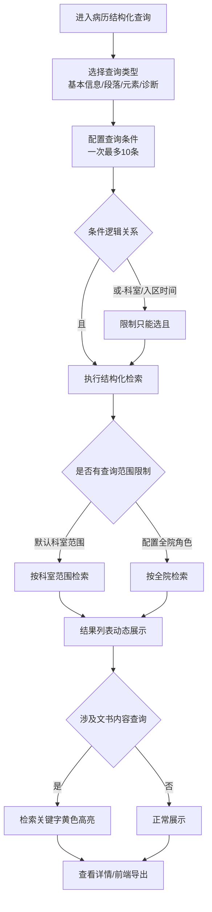
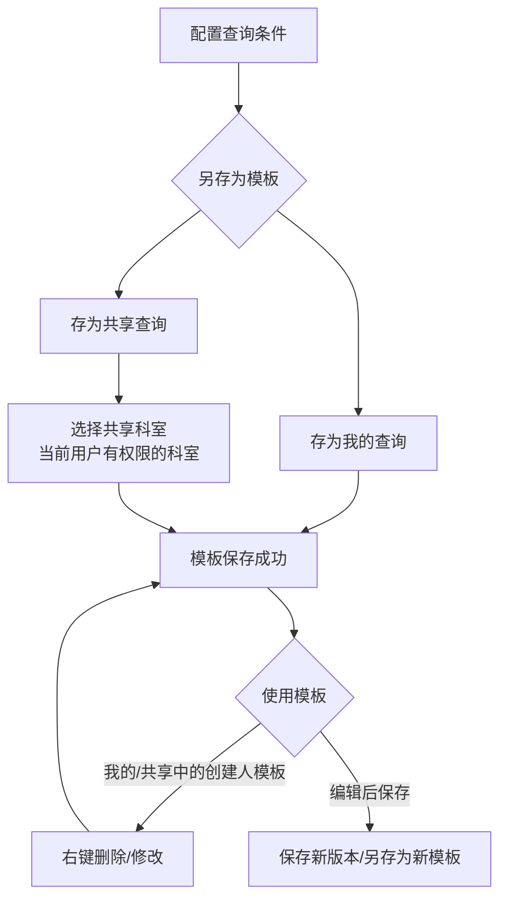

# BLGL-10-BLCX-003病历结构化查询_ Analyst - Spec

> **需求编号**：BLGL-10-BLCX-003
> **父需求**：BLGL-10-BLCX
> **关联PM Spec**：BLGL-10-BLCX-003_病历结构化查询_PM-spec.md
> **Spec版本**：V1.0
> **编写时间**：2026-08-14
> **编写人**：需求分析师

---

## 一、功能编号体系

### 1.1 功能层级结构

```
BLGL-10-BLCX-003: 病历结构化查询
 ├─ BLGL-10-BLCX-003-01: 结构化条件检索
 │ ├─ -01-01: 基本信息查询（姓名/住院号/科室/病区/日期/在院状态等）
 │ ├─ -01-02: 段落查询（段落/病历分类→段落）
 │ ├─ -01-03: 元素查询（元素/病历分类→元素，含枚举类型）
 │ ├─ -01-04: 诊断信息查询（初步/入院/出院/死亡/术前/术后诊断）
 │ └─ -01-05: 查询条件编辑与逻辑控制（一次10条、运算符、且/或限制）
 ├─ BLGL-10-BLCX-003-02: 查询模板保存与共享
 │ ├─ -02-01: 查询模板另存为（我的/共享）
 │ ├─ -02-02: 共享模板查看（按科室权限）
 │ └─ -02-03: 模板修改/删除
 ├─ BLGL-10-BLCX-003-03: 查询结果展示与导出
 │ ├─ -03-01: 结果列表动态展示（按检索条件动态加列、空列自动隐藏）
 │ ├─ -03-02: 检索关键字高亮
 │ └─ -03-03: 前端本地导出
 └─ BLGL-10-BLCX-003-04: 查询范围与性能控制
 ├─ -04-01: 科室全院选择（按角色）
 ├─ -04-02: 病案首页数据检索
 └─ -04-03: 防"或"逻辑阻塞
```

### 1.2 功能编号表

| REQ-ID | 功能名称 | 类型 | 优先级 | 说明 |
|--------|---------|------|--------|
| BLGL-10-BLCX-003-01 | 结构化条件检索 | 功能 | P0 | 按元素/段落/基本信息/诊断检索结构化病历 |
| BLGL-10-BLCX-003-01-01 | 基本信息查询 | 子功能 | P0 | 姓名/住院号/科室/病区/日期/在院状态 |
| BLGL-10-BLCX-003-01-02 | 段落查询 | 子功能 | P0 | 段落/病历分类→段落，名称+概念ID搜索 |
| BLGL-10-BLCX-003-01-03 | 元素查询 | 子功能 | P0 | 元素/病历分类→元素，含枚举类型 |
| BLGL-10-BLCX-003-01-04 | 诊断信息查询 | 子功能 | P1 | 初步/入院/出院/死亡/术前/术后诊断 |
| BLGL-10-BLCX-003-01-05 | 查询条件编辑与逻辑控制 | 子功能 | P0 | 一次10条、运算符、且/或限制 |
| BLGL-10-BLCX-003-02 | 查询模板保存与共享 | 功能 | P1 | 模板另存为、共享查看、修改删除 |
| BLGL-10-BLCX-003-02-01 | 模板另存为 | 子功能 | P1 | 存为我的/共享，共享选择科室 |
| BLGL-10-BLCX-003-02-02 | 共享模板查看 | 子功能 | P1 | 按科室权限查看共享模板 |
| BLGL-10-BLCX-003-02-03 | 模板修改/删除 | 子功能 | P1 | 我的/创建人的模板可右键修改删除 |
| BLGL-10-BLCX-003-03 | 查询结果展示与导出 | 功能 | P1 | 动态展示、关键词高亮、前端导出 |
| BLGL-10-BLCX-003-03-01 | 结果列表动态展示 | 子功能 | P1 | 按检索条件动态加列、空列自动隐藏 |
| BLGL-10-BLCX-003-03-02 | 检索关键字高亮 | 子功能 | P1 | 指定元素/段落内关键词黄色标注 |
| BLGL-10-BLCX-003-03-03 | 前端本地导出 | 子功能 | P1 | 复用页面数据生成Excel |
| BLGL-10-BLCX-003-04 | 查询范围与性能控制 | 功能 | P1 | 全院科室、病案首页检索、防阻塞 |
| BLGL-10-BLCX-003-04-01 | 科室全院选择 | 子功能 | P1 | 按角色配置支持全院科室 |
| BLGL-10-BLCX-003-04-02 | 病案首页数据检索 | 子功能 | P1 | 先查病历首页表再查病案首页表 |
| BLGL-10-BLCX-003-04-03 | 防"或"逻辑阻塞 | 子功能 | P1 | 科室/入区时间限制只能选"且" |

---

## 二、核心业务流程

### 2.1 结构化条件检索流程



### 2.2 查询模板保存流程



---

## 三、功能规格说明

---

### BLGL-10-BLCX-003-01: 结构化条件检索

#### 3.1.1 功能概述

按病历元素/段落/基本信息/诊断信息多条件组合检索住院病历的结构化数据。查询条件类型含基本信息、段落、元素、诊断信息，一次最多编辑 10 条，运算符支持等于/不等于/包含/不包含。

#### 3.1.2 用户角色

| 角色 | 使用场景 | 权限要求 | 操作频率 |
|------|---------|---------|---------|
| 病案室（统计员/质控员/上报员） | 按结构化数据检索病历、全院字段查询 | 结构化查询菜单权限 | 高频 |
| 质控系统用户 | 质控病历检索、缺陷定位 | 质控系统菜单权限 | 高频 |
| 住院医生 | 按元素/段落检索本科室病历 | 结构化查询菜单权限 | 中频 |

#### 3.1.3 业务流程（Given/When/Then）

##### 主流程

**Scenario 1: 结构化多条件检索**

```gherkin
Given:
 - 用户已登录并具有病历结构化查询菜单权限
 - 病历数据已结构化落库（元素/段落表）

When:
 - 用户进入"病历管理-病历结构化查询"
 - 配置查询条件：基本信息（姓名/住院号/科室/病区）+ 段落/元素（主诉包含"咳嗽"）+ 诊断
 - 条件一次最多编辑 10 条
 - 点击查询按钮

Then:
 - 系统按结构化条件检索匹配的患者病历
 - 结果列表按检索条件动态展示对应列
 - 涉及文书内容查询时，检索关键字在列表中黄色标注
```

##### 异常流程

**Scenario 2: 业务异常——"或"逻辑数据库阻塞**

```gherkin
Given:
 - 用户选择科室、入区日期等条件

When:
 - 用户将条件间逻辑选择为"或"

Then:
 - 系统可能把全量数据查出来导致数据库阻塞、系统卡慢
 - 前端及后端限制科室、入区时间条件只能选"且"，不能选"或"
```

**Scenario 3: 数据异常——病案首页数据检索不到**

```gherkin
Given:
 - 用户选择病历分类为病案首页的内容查询

When:
 - 用户执行结构化查询

Then:
 - 系统查询无数据（结构化查询不支持病历中的首页数据检索）
 - 系统应先查询病历病案首页表，再查病案病案首页表数据
```

**Scenario 4: 系统异常——查询服务同步阻塞**

```gherkin
Given:
 - 查询数据量较大
 - 后端接口同步处理（事务码 4199-3080-02）

When:
 - 用户点击查询按钮

Then:
 - 界面出现卡住无响应
 - 系统应增加"正在查询中"文字提示
```

##### 边界流程

**Scenario 5: 边界场景——枚举类型等于查询**

```gherkin
Given:
 - 元素类型为枚举类型

When:
 - 用户选择"等于"运算符并选中下拉选项

Then:
 - 前端拼接 code#文本 传给后端进行查询
```

**Scenario 6: 边界场景——Oracle CLOB字段**

```gherkin
Given:
 - 查询元素为选择类元素（单选框/复选框/单选下拉/多选下拉）

When:
 - 用户配置查询运算符

Then:
 - 去掉选择类元素的"等于""不等于"筛选（Oracle不允许CLOB字段使用=号）
```

#### 3.1.4 数据字段定义

> 字段名来自代码扫描（`E:\39EMR\sr-next`，标注 `` 的来自 `InpRhbStructuredRecordQueryInputAO` / `InpEmrQueryConditionInputAO` / `InpRhbStructuredRecordOutputVO`）。

| 字段名 | 类型 | 必填 | 默认值 | 取值范围 | 说明 | 概念ID |
|--------|------|------|--------|---------|------|--------|
| queryConditionTypeNo | String | 是 | - | 基本信息/段落/元素（类型编号） | 条件类型 | ⏳ 待确认 |
| queryConditionOperatorNo | String | 是 | - | 等于/不等于/包含/不包含（运算符编号） | 条件运算符 | ⏳ 待确认 |
| queryConditionFactorValue | String | 是 | - | - | 查询条件值 | ⏳ 待确认 |
| queryFieldNo / queryFieldName | String | 是 | - | - | 查询字段编号/名称 | ⏳ 待确认 |
| seqNo | Integer | 否 | - | 1~10 | 条件序号 | ⏳ 待确认 |
| encounterIds | List\<Long\> | 否 | 空 | - | 就诊记录ID集合 | ⏳ 待确认 |
| secrecyLevelCodes | List\<Long\> | 否 | 空 | 保密级别 | 保密级别集合 | ⏳ 待确认 |
| emrDataElemTypeId | Long | 否 | - | 枚举类型 | 数据元素类型ID | ⏳ 待确认 |
| inpatRhbRecordId / encounterId | Long | - | - | - | 结果列：病历簿ID/就诊ID（InpRhbStructuredRecordOutputVO | ⏳ 待确认 |
| patientName / age / admissionNumber | String | - | - | - | 结果列：患者姓名/年龄/住院号 | ⏳ 待确认 |
| deptName / currentWardName | String | - | - | - | 结果列：科室/病区 | ⏳ 待确认 |

#### 3.1.5 验收标准

| AC编号 | 验收标准 | 对应REQ-ID | 验证方法 | 验证场景 |
|--------|---------|-----------|--------|
| AC-001 | 配置基本信息+段落/元素+诊断条件查询，返回匹配病历，结果列动态展示 | -003-01 | 功能测试 | Scenario 1 |
| AC-002 | 查询条件一次最多编辑 10 条 | -003-01 | 功能测试 | Scenario 1 |
| AC-003 | 段落支持名称和概念ID搜索 | -003-01 | 功能测试 | Scenario 1 |
| AC-004 | 科室/入区时间条件限制只能选"且"，选择"或"被阻止 | -003-01 | 功能测试 | Scenario 2 |
| AC-005 | 选择病案首页分类查询能检索到数据 | -003-01 | 集成测试 | Scenario 3 |
| AC-006 | 枚举类型元素等于查询，前端拼接 code#文本 | -003-01 | 功能测试 | Scenario 5 |

---

### BLGL-10-BLCX-003-02: 查询模板保存与共享

#### 3.2.1 功能概述

支持将配置好的查询条件另存为查询模板（我的查询/共享查询），共享查询选择当前用户有权限的科室；我的查询和创建人是当前用户的共享模板支持修改/删除。

#### 3.2.2 用户角色

| 角色 | 使用场景 | 权限要求 | 操作频率 |
|------|---------|---------|---------|
| 病案室/质控用户 | 保存常用查询条件反复使用 | 结构化查询菜单权限 | 中频 |
| 住院医生 | 保存个人查询模板 | 结构化查询菜单权限 | 中频 |

#### 3.2.3 业务流程（Given/When/Then）

##### 主流程

**Scenario 1: 查询模板另存为**

```gherkin
Given:
 - 用户已配置查询条件

When:
 - 用户点击另存为查询模板
 - 选择存为"我的查询"或"共享查询"
 - 共享查询选择科室（当前用户有权限的科室）

Then:
 - 查询模板保存成功
 - 我的查询/共享查询列表可见
```

##### 异常流程

**Scenario 2: 业务异常——共享科室无权限**

```gherkin
Given:
 - 用户尝试共享模板给无权限科室

When:
 - 用户选择共享科室

Then:
 - ⏳ 待确认：无权限科室的选择限制与提示
```

##### 边界流程

**Scenario 3: 边界场景——模板修改保存**

```gherkin
Given:
 - 用户对我的查询或创建人是当前用户的共享查询模板进行编辑

When:
 - 用户点击保存或另存为

Then:
 - 可对查询模板进行新的保存，也可另存为新的查询模板
 - 我的查询/共享查询中创建人是当前用户的模板支持右键删除、修改
```

#### 3.2.4 数据字段定义

> 查询模板相关字段来自代码扫描（`E:\39EMR\sr-next`，标注 `` 的来自 InpEmrStructuredController 模板接口 + InpEmrQueryTemplateSaveInputAO）。

| 字段名 | 类型 | 必填 | 默认值 | 取值范围 | 说明 | 概念ID |
|--------|------|------|--------|---------|------|--------|
| 模板名称 | String | 是 | - | - | 查询模板名称 | ⏳ 待确认 |
| 所属范围 | String | 是 | 我的 | 我的/共享 | 模板所属范围 | ⏳ 待确认 |
| inpEmrQueryTemplateId | Long | 否 | - | - | 查询模板ID | ⏳ 待确认 |
| saveInpEmrQueryTemplate | - | 否 | - | - | 保存模板接口：/inp_emr_query_template/save/by_example | ⏳ 待确认 |
| saveInpEmrQueryConditionByQueryTemplateId | - | 否 | - | - | 按模板ID保存条件：/inp_emr_query_condition/save/by_id | ⏳ 待确认 |
| queryGroupInpEmrQueryTemplate | - | 否 | - | - | 查询模板分组：/inp_emr_query_template/query/by_example | ⏳ 待确认 |
| deleteInpEmrQueryConditionByQueryTemplateId | - | 否 | - | - | 按模板ID删除条件：/inp_emr_query_condition/delete/by_id | ⏳ 待确认 |
| 共享科室 | String | 否 | - | 用户有权限的科室 | 共享查询的科室范围 | ⏳ 待确认 |

#### 3.2.5 验收标准

| AC编号 | 验收标准 | 对应REQ-ID | 验证方法 | 验证场景 |
|--------|---------|-----------|--------|
| AC-007 | 查询模板支持另存为我的/共享查询，共享选择科室 | -003-02 | 功能测试 | Scenario 1 |
| AC-008 | 我的/创建人的模板支持右键删除、修改、另存 | -003-02 | 功能测试 | Scenario 3 |

---

### BLGL-10-BLCX-003-03: 查询结果展示与导出

#### 3.3.1 功能概述

查询结果列表按检索条件动态展示对应列；固定列空值自动隐藏（住院号、姓名始终显示）；涉及文书内容查询时关键词黄色高亮；导出改为前端本地导出。

#### 3.3.2 用户角色

| 角色 | 使用场景 | 权限要求 | 操作频率 |
|------|---------|---------|---------|
| 病案室/质控用户 | 查看检索结果、导出 | 结构化查询菜单权限 | 高频 |
| 住院医生 | 查看本科室检索结果 | 结构化查询菜单权限 | 中频 |

#### 3.3.3 业务流程（Given/When/Then）

##### 主流程

**Scenario 1: 结果列表动态展示与关键词高亮**

```gherkin
Given:
 - 用户执行结构化查询并返回结果

When:
 - 系统展示结果列表

Then:
 - 结果列表按检索条件动态增加对应列（如检索条件有主诉则展示主诉列）
 - 字段字数过多时，光标悬浮展示完整内容
 - 涉及文书内容查询时，符合条件的文书以黄色标注，文书内符合字眼黄色标注
```

##### 异常流程

**Scenario 2: 数据异常——固定列空值**

```gherkin
Given:
 - 查询结果中 6 个固定基础列（住院号/姓名/患者别名/性别/年龄/科室）部分全为空

When:
 - 系统展示结果列表

Then:
 - 全为空值的固定列自动隐藏
 - 住院号、姓名始终显示
```

##### 边界流程

**Scenario 3: 边界场景——前端导出**

```gherkin
Given:
 - 用户点击导出按钮

When:
 - 系统执行导出

Then:
 - 复用页面已展示的查询结果数据，在前端直接生成 Excel 文件
 - 不再调用后端服务端导出接口
```

#### 3.3.4 数据字段定义

> 导出接口来自代码扫描（标注 ``）。

| 字段名 | 类型 | 必填 | 默认值 | 取值范围 | 说明 | 概念ID |
|--------|------|------|--------|---------|------|--------|
| 固定基础列 | String | 否 | - | 住院号/姓名/患者别名/性别/年龄/科室 | 空值自动隐藏，住院号/姓名始终显示 | ⏳ 待确认 |
| 高亮关键词 | String | 否 | - | - | 指定元素/段落内关键词高亮 | ⏳ 待确认 |
| structuredExportExcel | - | 否 | - | - | 结构化导出接口：/emr_structured/query/export_structured_record | ⏳ 待确认 |
| excel.worker.js | - | 否 | - | - | 前端本地导出 worker | ⏳ 待确认 |

#### 3.3.5 验收标准

| AC编号 | 验收标准 | 对应REQ-ID | 验证方法 | 验证场景 |
|--------|---------|-----------|--------|
| AC-009 | 结果列表按检索条件动态展示对应列，字段过长悬浮展示 | -003-03 | 功能测试 | Scenario 1 |
| AC-010 | 涉及文书内容查询时，检索关键字黄色高亮 | -003-03 | 功能测试 | Scenario 1 |
| AC-011 | 全空值固定列自动隐藏，住院号/姓名始终显示 | -003-03 | 功能测试 | Scenario 2 |
| AC-012 | 导出复用页面数据前端生成Excel | -003-03 | 功能测试 | Scenario 3 |

---

### BLGL-10-BLCX-003-04: 查询范围与性能控制

#### 3.4.1 功能概述

控制结构化查询的数据范围与性能：按角色配置支持全院科室选择；病案首页数据检索适配；限制"或"逻辑防止数据库阻塞。

#### 3.4.2 用户角色

| 角色 | 使用场景 | 权限要求 | 操作频率 |
|------|---------|---------|---------|
| 病案室/质控用户 | 全院病历字段查询 | 配置为可查全院角色 | 高频 |
| 住院医生 | 本科室结构化查询 | 结构化查询菜单权限 | 中频 |

#### 3.4.3 业务流程（Given/When/Then）

##### 主流程

**Scenario 1: 科室全院选择**

```gherkin
Given:
 - 用户角色配置为"医生站病历结构化查询页面允许查询全院数据的角色"

When:
 - 用户在基本信息[科室]选择全院科室

Then:
 - 系统支持选择全院科室
 - 移除科室选择数量限制（原最多10个）
```

##### 异常流程

**Scenario 2: 数据异常——首页数据检索不到**

```gherkin
Given:
 - 用户选择病案首页分类

When:
 - 用户执行查询

Then:
 - 系统先查询病历病案首页表，再查病案病案首页表数据
```

##### 边界流程

**Scenario 3: 边界场景——"或"逻辑阻止**

```gherkin
Given:
 - 用户配置科室、入区日期条件

When:
 - 用户尝试选择"或"逻辑

Then:
 - 前端及后端限制只能选"且"，不能选"或"
```

#### 3.4.4 数据字段定义

| 字段名 | 类型 | 必填 | 默认值 | 取值范围 | 说明 | 概念ID |
|--------|------|------|--------|---------|------|--------|
| 全院查询角色 | String | 否 | 空 | 用户角色术语 | 允许查全院数据的角色 | ⏳ 待确认 |

#### 3.4.5 验收标准

| AC编号 | 验收标准 | 对应REQ-ID | 验证方法 | 验证场景 |
|--------|---------|-----------|--------|
| AC-013 | 配置为可查全院角色后，科室支持全院选择，移除10个限制 | -003-04 | 功能测试 | Scenario 1 |
| AC-014 | 病案首页分类查询能检索到数据 | -003-04 | 集成测试 | Scenario 2 |
| AC-015 | 科室/入区时间条件限制只能选"且" | -003-04 | 功能测试 | Scenario 3 |

---

## 四、排除范围

本需求不包含以下功能项：

1. **科室病历查询** - 本科室权限范围检索，属 BLGL-10-BLCX-001
2. **全院病历查询** - 跨科室检索，属 BLGL-10-BLCX-002
3. **病历详情查看详细设计** - 属基础能力 BC-BLCX-001
4. **病历书写、归档借阅、模板管理** - 属其他模块

> 与 PM-Spec 第四章一致。对照 Phase 1 功能点Spec 第6章（基线能力），确保不越界。

---

## 五、业务规则清单

| 规则ID | 规则名称 | 规则描述 | 优先级 |
|--------|---------|---------|--------|
| BR-001 | 条件数量上限 | 查询条件一次最多编辑 10 条 | P0 |
| BR-002 | 条件类型 | 查询条件类型含基本信息/段落/元素，诊断信息查询 | P0 |
| BR-003 | 运算符 | 元素查询支持等于/不等于/包含/不包含 | P0 |
| BR-004 | 逻辑限制 | 科室、入区时间条件只能选"且"，不能选"或" | P0 |
| BR-005 | 段落查询 | 段落查询 EMR_MRT_DATA_ELEMENT_SECTION 表，支持名称和概念ID搜索 | P1 |
| BR-006 | 模板共享 | 共享查询支持选择当前用户有权限的科室 | P1 |
| BR-007 | 关键词高亮 | 只对指定元素/段落内的关键词高亮，数值类型高亮满足条件的 | P1 |
| BR-008 | 空列隐藏 | 固定列全为空时自动隐藏，住院号/姓名始终显示 | P1 |
| BR-009 | 全院科室 | 按角色配置支持选择全院科室，移除科室数量限制 | P1 |
| BR-010 | 病案首页检索 | 先查病历病案首页表，再查病案病案首页表 | P1 |
| BR-011 | CLOB限制 | Oracle不允许CLOB字段用=号，选择类元素去掉等于/不等于 | P1 |
| BR-012 | 枚举类型 | 枚举类型元素等于查询时，前端拼接 code#文本 | P1 |

---

## 六、关联文档

| 文档类型 | 文档路径 | 说明 |
|---------|---------|
| 功能点Spec | BLGL-10-BLCX 10病历查询功能点Spec.md（V1.1，上级目录） | Phase 1 功能点索引 |
| PM spec | 本目录 BLGL-10-BLCX-003_病历结构化查询_PM-spec.md（V0.1） | PM 产出的 Spec 文档 |
| -Spec | 本目录 BLGL-10-BLCX-003_病历结构化查询-Spec.md（V1.0） | 业务背景与目标 Spec |
| data-model.md | 待产出 | 架构师产出的数据建模文档 |
| design.md | 待产出 | 架构师产出的技术方案文档 |
| api-contract.md | 待产出 | 开发经理产出的 API 契约文档 |

---

## 七、待确认问题清单

| 编号 | 问题描述 | 缺失信息 | 影响范围 | 建议补充方 |
|------|---------|---------|--------|
| Q-001 | 共享科室无权限时的选择限制与提示 | 权限校验方案 | 3.2.3 Scenario 2 | 产品经理 |
| Q-002 | 结构化查询完整接口契约 | API 请求/返回字段、路径 | 第5章接口设计 | 开发经理 |
| Q-003 | 查询段落数据报错根因 | 段落查询接口异常 | 5.3 错误码 | 开发经理 |
| Q-004 | "正在查询中"提示的具体样式 | 全页面/区域级提示方案 | 3.1.3 Scenario 4 | 产品经理 |
| Q-005 | 概念ID、状态枚举、性能指标 | 字段概念ID、状态定义、SLA | 数据模型、非功能 | 架构师/产品经理 |
| Q-006 | 全院科室角色配置缺失默认 | 参数未配置时默认科室范围 | 3.4.3 Scenario 1 | 产品经理 |

---

## 填写检查清单

| 序号 | 检查项 | 是否完成 |
|:----:|--------|:--------:|
| 1 | 功能编号带父子层级 | ✅ |
| 2 | 每个 REQ-ID 有功能概述和用户角色 | ✅ |
| 3 | 主流程至少 1 个 Given/When/Then 场景 | ✅ |
| 4 | 异常流程至少 3 个 Given/When/Then 场景 | ✅ |
| 5 | 边界流程至少 2 个 Given/When/Then 场景 | ✅ |
| 6 | 每个 Given/When/Then 内容具体，不模糊 | ✅ |
| 7 | 数据字段定义完整 | ✅ |
| 8 | 验收标准 AC 编号独立，可验证 | ✅ |
| 9 | 验收标准无"功能正常"等模糊表述 | ✅ |
| 10 | 排除范围明确列出 | ✅ |
| 11 | 业务规则清单列出所有规则，每条标注来源 | ✅ |
| 12 | 流程图使用 Mermaid 格式（≥2 个） | ✅ |
| 13 | 关联文档索引包含 Phase 1 功能点Spec | ✅ |
| 14 | 待确认问题清单汇总了全文所有 ⏳ 项 | ✅ |
| 15 | 全文无占位符 `< >` 残留 | ✅ |
| 16 | 全文陈述可溯源至资料区（S1~S10 溯源核查） | ✅ |
| 17 | 人工审核确认完成 | ⏳ 待确认 |

---

**文档状态**：⬜ 待审核
**维护责任**：需求分析师规范组
**下次更新**：根据评审反馈优化

---

## 版本历史

| 版本 | 日期 | 变更说明 | 编写人 |
|------|------|---------|--------|
| V1.0 | 2026-08-14 | 初始版本 | 需求分析师 |
