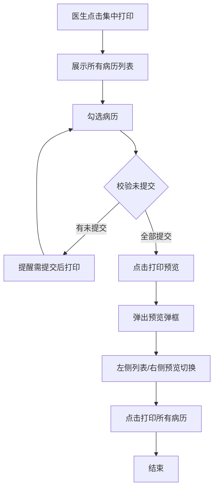
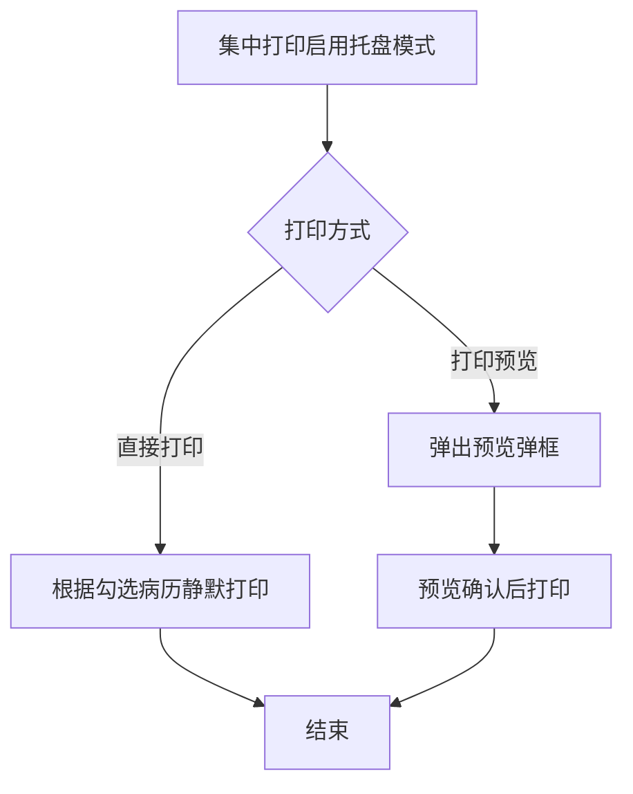

# BLGL-11-BLDY-001病历集中打印_ Analyst - Spec

> **需求编号**：BLGL-11-BLDY-001
> **父需求**：BLGL-11-BLDY
> **关联PM Spec**：BLGL-11-BLDY-001_病历集中打印_PM-spec.md
> **Spec版本**：V1.0
> **编写时间**：2026-08-14
> **编写人**：需求分析师

---

## 一、功能编号体系

#

## 1.1 功能层级结构

```
BLGL-11-BLDY-001: 病历集中打印
  ├─ BLGL-11-BLDY-001-01: 集中打印列表
  │   ├─ -01-01: 病历列表展示（含是否提交）
  │   ├─ -01-02: 病历名称搜索
  │   └─ -01-03: 按时间排序
  ├─ BLGL-11-BLDY-001-02: 打印校验与提醒
  │   ├─ -02-01: 未提交病历校验
  │   └─ -02-02: 未提交提醒
  ├─ BLGL-11-BLDY-001-03: 打印预览
  │   ├─ -03-01: 预览弹框（左侧列表/右侧预览）
  │   └─ -03-02: 切换预览/打印全部
  └─ BLGL-11-BLDY-001-04: 托盘模式
      ├─ -04-01: 静默打印
      └─ -04-02: 打印预览
```

#

## 1.2 功能编号表

| REQ-ID | 功能名称 | 类型 | 优先级 | 说明 |
|

----

----|

----

-----|

------|

----

----|

------|
| BLGL-11-BLDY-001-01 | 集中打印列表 | 功能 | P0 | 列表展示/搜索/排序 |
| BLGL-11-BLDY-001-01-01 | 病历列表展示 | 子功能 | P0 | 含是否提交 |
| BLGL-11-BLDY-001-01-02 | 病历名称搜索 | 子功能 | P1 | 模糊查询 |
| BLGL-11-BLDY-001-01-03 | 按时间排序 | 子功能 | P1 | 正序 |
| BLGL-11-BLDY-001-02 | 打印校验与提醒 | 功能 | P0 | 校验提醒 |
| BLGL-11-BLDY-001-02-01 | 未提交校验 | 子功能 | P0 | 勾选校验 |
| BLGL-11-BLDY-001-02-02 | 未提交提醒 | 子功能 | P0 | 提醒提交 |
| BLGL-11-BLDY-001-03 | 打印预览 | 功能 | P1 | 预览弹框 |
| BLGL-11-BLDY-001-03-01 | 预览弹框 | 子功能 | P1 | 列表/预览 |
| BLGL-11-BLDY-001-03-02 | 切换预览/打印 | 子功能 | P1 | 打印全部 |
| BLGL-11-BLDY-001-04 | 托盘模式 | 功能 | P1 | 托盘打印 |
| BLGL-11-BLDY-001-04-01 | 静默打印 | 子功能 | P1 | 直接打印 |
| BLGL-11-BLDY-001-04-02 | 打印预览 | 子功能 | P1 | 预览模式 |

---

## 二、核心业务流程

#

## 2.1 集中打印流程



#

## 2.2 托盘模式流程



---

## 三、功能规格说明

---

### BLGL-11-BLDY-001-01: 集中打印列表

#

#

## 3.1.1 功能概述

集中打印列表展示当前患者所有病历（含是否提交），支持病历名称模糊搜索、按时间正序排序。

#

#

## 3.1.2 用户角色

| 角色 | 使用场景 | 权限要求 | 操作频率 |
|

------|

----

-----|

----

-----|

----

-----|
| 住院医生 | 批量打印病历 | 打印权限 | 高频 |
| 病案管理员 | 病历集中输出 | 打印权限 | 中频 |

#

#

## 3.1.3 业务流程（Given/When/Then）

#

#### 主流程

**Scenario 1: 集中打印列表**

```gherkin
Given:
  - 医生有集中打印权限
  - 患者有已提交和未提交的病历

When:
  - 医生点击【集中打印】按钮
  - 病历列表展示当前患者的所有病历（含是否提交列）

Then:
  - 已提交的病历显示是
  - 未提交的病历显示否
  - 医生可勾选病历
```

#

#### 异常流程

**Scenario 2: 数据异常——预览页码错误**

```gherkin
Given:
  - 集中打印预览

When:
  - 预览打印

Then:
  - 显示页码错误（原问题）
  - ⏳ 待确认：页码数据类型问题```

#

#### 边界流程

**Scenario 3: 边界场景——按时间排序/搜索**

```gherkin
Given:
  - 集中打印界面

When:
  - 医生查看打印预览列表/搜索病历

Then:
  - 预览列表按病历时间正序排序
  - 病历名称检索框模糊查询
```

**Scenario 4: 边界场景——书写时间列**

```gherkin
Given:
  - 集中打印列表

When:
  - 医生查看列表

Then:
  - 首列新增书写时间，便于医生查阅
```

#

#

## 3.1.4 数据字段定义

> 字段名来自代码扫描（`E:\39EMR\sr-next`，标注 ``）。

| 字段名 | 类型 | 必填 | 默认值 | 取值范围 | 说明 | 概念ID |
|

----

----|

------|

------|

----

----|

----

-----|

------|

----

----|
| inpEmrSetId | Long | 是 | - | - | 病历ID| ⏳ 待确认 |
| emrName | String | 是 | - | - | 病历名称| ⏳ 待确认 |
| submitStatus | Long | 是 | - | 已提交/未提交 | 提交状态| ⏳ 待确认 |
| writeTime | Date | 否 | - | - | 书写时间| ⏳ 待确认 |

#

#

## 3.1.5 验收标准

| AC编号 | 验收标准 | 对应REQ-ID | 验证方法 | 验证场景 |
|

----

----|

----

-----|

----

----

---|

----

-----|

----

-----|
| AC-001 | 集中打印列表展示所有病历含是否提交状态 | -001-01 | 功能测试 | Scenario 1 |
| AC-002 | 预览列表按病历时间正序排序 | -001-01 | 功能测试 | Scenario 3 |
| AC-003 | 病历名称检索框模糊查询 | -001-01 | 功能测试 | Scenario 3 |

---

### BLGL-11-BLDY-001-02: 打印校验与提醒

#

#

## 3.2.1 功能概述

勾选病历点击确定时校验未提交病历，有未提交时提醒需提交后打印。

#

#

## 3.2.2 用户角色

| 角色 | 使用场景 | 权限要求 | 操作频率 |
|

------|

----

-----|

----

-----|

----

-----|
| 住院医生 | 集中打印校验 | 打印权限 | 高频 |

#

#

## 3.2.3 业务流程（Given/When/Then）

#

#### 主流程

**Scenario 1: 未提交病历校验**

```gherkin
Given:
  - 集中打印勾选了未提交病历

When:
  - 点击确定

Then:
  - 校验未提交的病历
  - 提醒"XX年XX月XX日XX时XX病程记录未提交，需提交后打印"
  - 列出所有未提交病历
```

#

#### 异常流程

**Scenario 2: 业务异常——无法集中打印**

```gherkin
Given:
  - 勾选的病历有未提交

When:
  - 点击确定

Then:
  - 提醒"以上病历没有提交，无法集中打印"
```

#

#

## 3.2.4 数据字段定义

| 字段名 | 类型 | 必填 | 默认值 | 取值范围 | 说明 | 概念ID |
|

----

----|

------|

------|

----

----|

----

-----|

------|

----

----|
| 未提交病历列表 | List | 是 | - | - | 校验结果| ⏳ 待确认 |

#

#

## 3.2.5 验收标准

| AC编号 | 验收标准 | 对应REQ-ID | 验证方法 | 验证场景 |
|

----

----|

----

-----|

----

----

---|

----

-----|

----

-----|
| AC-004 | 勾选未提交病历打印时提醒"以上病历没有提交，无法集中打印" | -001-02 | 功能测试 | Scenario 1/2 |

---

### BLGL-11-BLDY-001-03: 打印预览

#

#

## 3.3.1 功能概述

集中打印新增打印预览功能，左侧展示勾选的打印病历列表，右侧预览，切换列表同步切换预览。

#

#

## 3.3.2 用户角色

| 角色 | 使用场景 | 权限要求 | 操作频率 |
|

------|

----

-----|

----

-----|

----

-----|
| 住院医生 | 打印预览确认 | 打印权限 | 高频 |

#

#

## 3.3.3 业务流程（Given/When/Then）

#

#### 主流程

**Scenario 1: 打印预览**

```gherkin
Given:
  - 集中打印勾选病历

When:
  - 点击打印预览按钮

Then:
  - 弹出打印预览弹框
  - 左侧展示勾选的打印病历列表
  - 默认第一份病历预览
  - 切换左侧列表同步切换预览
  - 点击打印打印所有病历
```

#

#### 异常流程

**Scenario 2: 数据异常——批量打印缺失**

```gherkin
Given:
  - 批量打印

When:
  - 部分病历打印

Then:
  - 部分未打印病历在预览界面缺失（原问题）
  - ⏳ 待确认：预览缺失原因```

#

#

## 3.3.4 数据字段定义

| 字段名 | 类型 | 必填 | 默认值 | 取值范围 | 说明 | 概念ID |
|

----

----|

------|

------|

----

----|

----

-----|

------|

----

----|
| 打印病历列表 | List | 是 | - | - | 预览列表| ⏳ 待确认 |

#

#

## 3.3.5 验收标准

| AC编号 | 验收标准 | 对应REQ-ID | 验证方法 | 验证场景 |
|

----

----|

----

-----|

----

----

---|

----

-----|

----

-----|
| AC-005 | 打印预览左侧列表/右侧预览切换 | -001-03 | 功能测试 | Scenario 1 |

---

### BLGL-11-BLDY-001-04: 托盘模式

#

#

## 3.4.1 功能概述

集中打印启用托盘模式时支持静默打印和打印预览。

#

#

## 3.4.2 用户角色

| 角色 | 使用场景 | 权限要求 | 操作频率 |
|

------|

----

-----|

----

-----|

----

-----|
| 住院医生 | 托盘模式打印 | 打印权限 | 中频 |

#

#

## 3.4.3 业务流程（Given/When/Then）

#

#### 主流程

**Scenario 1: 托盘模式**

```gherkin
Given:
  - 参数"打印是否启用托盘模式"=是

When:
  - 集中打印

Then:
  - 直接打印：根据勾选病历直接静默打印
  - 打印预览：弹出预览弹框确认后打印
```

#

#

## 3.4.4 数据字段定义

| 字段名 | 类型 | 必填 | 默认值 | 取值范围 | 说明 | 概念ID |
|

----

----|

------|

------|

----

----|

----

-----|

------|

----

----|
| 托盘模式参数 | Boolean | 否 | 否 | 是/否 | 是否启用托盘模式| ⏳ 待确认 |

#

#

## 3.4.5 验收标准

| AC编号 | 验收标准 | 对应REQ-ID | 验证方法 | 验证场景 |
|

----

----|

----

-----|

----

----

---|

----

-----|

----

-----|
| AC-006 | 托盘模式支持静默打印/打印预览 | -001-04 | 功能测试 | Scenario 1 |

---

## 四、排除范围

本需求不包含以下功能项：

1. **单份与单病程打印** - 属 BLGL-11-BLDY-002
2. **打印模式与格式控制** - 属 BLGL-11-BLDY-003
3. **打印权限与归档控制** - 属 BLGL-11-BLDY-004
4. **打印实现与性能优化** - 属 BLGL-11-BLDY-005
5. **打印预览页数一致性、预览默认模式** - 属基础能力 BC-BLDY-005/008

> 与 PM-Spec 第四章一致。对照 Phase 1 功能点Spec 第6章（基线能力），确保不越界。

---

## 五、业务规则清单

| 规则ID | 规则名称 | 规则描述 | 优先级 |
|

----

----|

----

-----|

----

-----|

------|

----

----|
| BR-001 | 列表展示 | 集中打印列表展示所有病历含是否提交 | P0 |
| BR-002 | 未提交校验 | 勾选未提交病历提醒需提交后打印 | P0 |
| BR-003 | 打印预览 | 集中打印支持预览，左侧列表/右侧预览切换 | P1 |
| BR-004 | 排序 | 预览列表按病历时间正序排序 | P1 |
| BR-005 | 搜索 | 病历名称检索框模糊查询 | P1 |
| BR-006 | 托盘模式 | 参数控制静默打印/打印预览 | P1 |
| BR-007 | 书写时间列 | 首列新增书写时间 | P1 |

---

## 六、关联文档

| 文档类型 | 文档路径 | 说明 |
|

----

-----|

----

-----|

------|
| 功能点Spec | BLGL-11-BLDY 11病历打印功能点Spec.md（V2.0，上级目录） | Phase 1 功能点索引 |
| PM spec | 本目录 BLGL-11-BLDY-001_病历集中打印_PM-spec.md（V0.1） | PM 产出的 Spec 文档 |
| -Spec | 本目录 BLGL-11-BLDY-001_病历集中打印_Spec.md（V1.0） | 业务背景与目标 Spec |
| data-model.md | 待产出 | 架构师产出的数据建模文档 |
| design.md | 待产出 | 架构师产出的技术方案文档 |
| api-contract.md | 待产出 | 开发经理产出的 API 契约文档 |

---

## 七、待确认问题清单

| 编号 | 问题描述 | 缺失信息 | 影响范围 | 建议补充方 |
|

------|

----

-----|

----

-----|

----

-----|

----

----

---|
| Q-001 | 预览页码错误 | 页码数据类型问题 | 3.1.3 Scenario 2 | 开发经理 |
| Q-002 | 批量打印缺失 | 预览界面病历缺失原因 | 3.3.3 Scenario 2 | 开发经理 |
| Q-003 | 完整接口契约 | API 请求/返回字段 | 第5章接口设计 | 开发经理 |
| Q-004 | 概念ID、性能指标 | 字段概念ID、打印SLA | 数据模型、非功能 | 架构师/产品经理 |

---

## 填写检查清单

| 序号 | 检查项 | 是否完成 |
|:

----:|

----

----|:

----

----:|
| 1 | 功能编号带父子层级 | ✅ |
| 2 | 每个 REQ-ID 有功能概述和用户角色 | ✅ |
| 3 | 主流程至少 1 个 Given/When/Then 场景 | ✅ |
| 4 | 异常流程至少 3 个 Given/When/Then 场景 | ✅ |
| 5 | 边界流程至少 2 个 Given/When/Then 场景 | ✅ |
| 6 | 每个 Given/When/Then 内容具体，不模糊 | ✅ |
| 7 | 数据字段定义完整 | ✅ |
| 8 | 验收标准 AC 编号独立，可验证 | ✅ |
| 9 | 验收标准无"功能正常"等模糊表述 | ✅ |
| 10 | 排除范围明确列出 | ✅ |
| 11 | 业务规则清单列出所有规则，每条标注来源 | ✅ |
| 12 | 流程图使用 Mermaid 格式（≥2 个） | ✅ |
| 13 | 关联文档索引包含 Phase 1 功能点Spec | ✅ |
| 14 | 待确认问题清单汇总了全文所有 ⏳ 项 | ✅ |
| 15 | 全文无占位符 `< >` 残留 | ✅ |
| 16 | 全文陈述可溯源至资料区（S1~S10 溯源核查） | ✅ |
| 17 | 人工审核确认完成 | ⏳ 待确认 |

---

**文档状态**：⬜ 待审核
**维护责任**：需求分析师规范组
**下次更新**：根据评审反馈优化

---

## 版本历史

| 版本 | 日期 | 变更说明 | 编写人 |
|

------|

------|

----

-----|

----

----|
| V1.0 | 2026-08-14 | 初始版本 | 需求分析师 |
