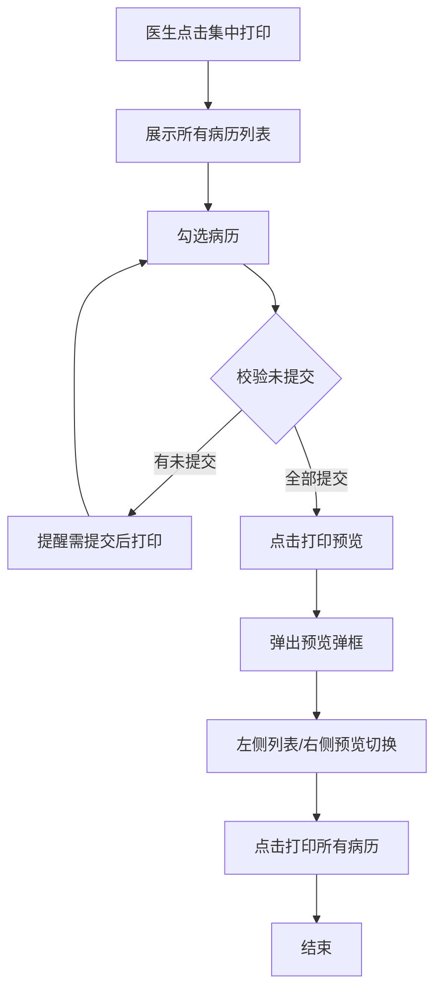
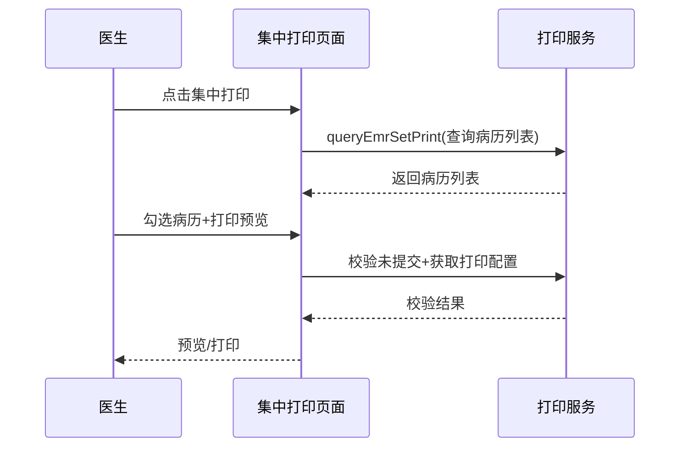

# BLGL-11-BLDY-001 病历集中打印 - Spec

> **功能编号**：BLGL-11-BLDY-001
> **文档类型**：功能Spec（业务背景与设计）
> **文档版本**：V1.0
> **编写时间**：2026-08-14
> **编写人**：RACC

---

## 文档索引

#

### 章节索引

**本文档（功能Spec：业务背景与设计）**

| 章节号 | 章节名称 | 内容说明 |
|

----

----|

----

-----|

----

-----|
| 第1章 | 文档概述 | 文档目的、文档范围、术语定义、阅读指南、参考文档 |
| 第2章 | 功能背景与定位 | 功能背景、功能定位、目标用户、核心价值 |
| 第3章 | 业务流程设计 | 主流程/异常流程/边界流程（Given/When/Then） |
| 第4章 | 数据模型设计 | 核心数据结构、状态定义、系统参数定义 |
| 第5章 | 接口契约设计 | API列表、接口详细设计、错误码定义 |
| 第6章 | 技术方案设计 | 页面路径、技术栈、关键技术点、部署方案 |
| 第7章 | 测试用例预设计 | 功能/边界/异常/性能测试用例 |
| 第8章 | 非功能性要求 | 性能、安全、可用性、兼容性 |
| 第9章 | 依赖与风险 | 外部依赖、风险项 |
| 第10章 | 附录 | 流程图、时序图、参考文档 |

**PM-Spec（需求规格）**：目标/约束/验收标准/排除范围/关键决策/优先级
**Analyst-Spec（分析规格）**：功能编号体系/核心业务流程/功能规格/排除范围/业务规则/关联文档/待确认问题

#

### 版本历史

| 版本 | 日期 | 变更说明 | 编写人 |
|

------|

------|

----

-----|

----

----|
| V1.0 | 2026-08-14 | 初始版本 | RACC |

#

### 关联文档索引

| 序号 | 文档名称 | 文档类型 | 版本 | 位置 |
|

------|

----

-----|

----

-----|

------|

------|
| 1 | BLGL-11-BLDY-001_病历集中打印_Spec.md | 功能Spec（业务背景与设计）（本文档） | V1.0 | 本目录 |
| 2 | BLGL-11-BLDY-001_病历集中打印_PM-spec.md | PM-Spec（需求规格） | V0.1 | 本目录 |
| 3 | BLGL-11-BLDY-001_病历集中打印_Analyst-spec.md | Analyst-Spec（分析规格） | V1.0 | 本目录 |
| 4 | BLGL-11-BLDY 11病历打印功能点Spec.md | 功能点Spec（模块级） | V2.0 | 上级目录 |

---

## 1、文档概述

#

## 1.1、文档目的

本文档旨在明确"病历集中打印"功能（BLGL-11-BLDY-001）的业务背景与设计方案，为需求分析、研发实现、测试验收及评审提供统一的业务上下文、设计口径与决策依据。

#

## 1.2、文档范围

#

#

## 1.2.1 纳入范围

本文档覆盖病历集中打印的完整业务背景与设计，包括：

- 集中打印展示所有病历列表（含未提交状态）
- 未提交病历打印提醒
- 打印预览功能（左侧列表/右侧预览切换）
- 病历名称搜索、按时间排序
- 集中打印托盘模式（静默打印/打印预览）

#

#

## 1.2.2 排除范围

本文档不涉及以下内容（详见其他功能点或模块）：

- 单份与单病程打印—— BLGL-11-BLDY-002
- 打印模式与格式控制—— BLGL-11-BLDY-003
- 打印权限与归档控制—— BLGL-11-BLDY-004
- 打印实现与性能优化—— BLGL-11-BLDY-005
- 打印预览页数一致性、预览默认模式 —— Phase 1 功能点Spec 第6章基础能力（BC-BLDY-005、008）

#

## 1.3、术语定义

| 术语 | 定义 |
|

------|

------|
| 病历集中打印 | 将患者所有病历批量打印的功能|
| 打印预览 | 打印前预览病历界面|
| 托盘模式 | 启用托盘打印模式，支持静默打印/打印预览|

> ⏳ 待确认：规范术语表待产品文档确认。

#

## 1.4、阅读指南


- **章节关系**：第1~2章为业务全貌，第3~10章为设计实现层。与 Analyst-Spec、PM-Spec 互相引用保持一致。

- **读者对象**：产品经理/需求分析师读第1~2章；研发读第3~6、9~10章；测试读第3、7~8章；评审人员核对各层一致性。

#

## 1.5、参考文档

| 序号 | 文档名称 | 版本/日期 |
|

------|

----

-----|

----

------|
| 1 | 【历史需求】住院病历的历史需求.xlsx | - |
| 2 | BLGL-11-BLDY-001_病历集中打印_PM-spec.md | V0.1 |
| 3 | BLGL-11-BLDY-001_病历集中打印_Analyst-spec.md | V1.0 |
| 4 | BLGL-11-BLDY 11病历打印功能点Spec.md | V2.0 |

---

## 2、功能背景与定位

#

## 2.1 功能背景

病历集中打印是病历批量输出的核心能力，需满足：


- **管理要求**：医生通过集中打印批量输出患者病历
- **现状痛点**：
  - 集中打印列表仅显示已提交病历，未提交病历不可见- 集中打印无预览功能- 集中打印无法按名称搜索、按时间排序
- **历史需求演进**：从集中打印基础建立→ 预览功能→ 搜索/排序→ 托盘模式优化→ 书写时间列

#

## 2.2 功能定位

"病历集中打印"是 WiNEX 病历管理-病历打印模块的核心输出能力，定位为：


- **批量打印入口**：一次打印患者所有病历

- **打印校验**：未提交病历提醒

- **预览交互**：打印前预览确认

#

## 2.3 目标用户

| 用户角色 | 主要使用场景 |
|

----

-----|

----

----

-----|
| 住院医生 | 批量打印患者病历 |
| 病案管理员 | 病历集中输出 |

#

## 2.4 核心价值

| 价值维度 | 价值描述 |
|

----

-----|

----

-----|
| 效率提升 | 一次批量打印所有病历|
| 校验完整 | 未提交病历提醒|
| 体验优化 | 预览/搜索/排序|

---

## 3、业务流程设计（Given/When/Then）

#

## 3.1 主流程

**Scenario 1: 病历集中打印**

```gherkin
Given:
  - 医生有集中打印权限
  - 患者有已提交和未提交的病历

When:
  - 医生点击【集中打印】按钮
  - 病历列表展示当前患者的所有病历（含是否提交列）
  - 勾选病历点击确定

Then:
  - 校验未提交的病历
  - 有未提交的病历提醒"以上病历没有提交，无法集中打印"
  - 全部提交则进入打印
```

#

## 3.2 异常流程

**Scenario 2: 业务异常——未提交病历提醒**

```gherkin
Given:
  - 集中打印勾选了未提交病历

When:
  - 点击确定

Then:
  - 提醒"XX年XX月XX日XX时XX病程记录未提交，需提交后打印"
  - 列出所有未提交病历
```

**Scenario 3: 数据异常——预览页码错误**

```gherkin
Given:
  - 集中打印预览

When:
  - 预览打印

Then:
  - 显示页码错误（原问题）
  - ⏳ 待确认：页码数据类型问题```

**Scenario 4: 系统异常——批量打印缺失**

```gherkin
Given:
  - 批量打印

When:
  - 部分病历打印

Then:
  - 部分未打印病历在预览界面缺失（原问题）
  - ⏳ 待确认：预览缺失原因```

#

## 3.3 边界流程

**Scenario 5: 边界场景——打印预览**

```gherkin
Given:
  - 集中打印勾选病历

When:
  - 点击打印预览按钮

Then:
  - 弹出打印预览弹框
  - 左侧展示勾选的打印病历列表
  - 默认第一份病历预览
  - 切换左侧列表同步切换预览
  - 点击打印打印所有病历
```

**Scenario 6: 边界场景——按时间排序/搜索**

```gherkin
Given:
  - 集中打印界面

When:
  - 医生查看打印预览列表/搜索病历

Then:
  - 预览列表按病历时间正序排序
  - 病历名称检索框模糊查询
```

---

## 4、数据模型设计

> 数据模型信息来自代码扫描（`E:\39EMR\sr-next`）和历史需求。标注 `` 的来自 PO 实体，标注 `` 的来自需求文本。

#

## 4.1 核心数据结构

#

#

## 4.1.1 核心表/实体

| 表/实体 | 关键字段 | 说明 |
|

----

-----|

----

-----|

------|
| INPATIENT_EMR_PRINT_LOG（InpatientEmrPrintLogPO） | 打印日志 | 集中打印日志|
| INP_EMR_SET_REPORTED_APPLY（InpEmrSetReportedApplyPO） | 上传申请 | 打印/上传申请|
| 病历簿表 | 病历状态 | 未提交/已提交判断|

> ⏳ 待确认：完整数据表清单待代码扫描或功能清单数据表清单补充。

#

## 4.2 状态定义

| 状态码 | 状态名称 | 说明 |
|

----

----|

----

-----|

------|
| 已提交 | 病历状态 | 可打印|
| 未提交 | 病历状态 | 提醒后需提交|

#

## 4.3 系统参数定义

| 参数编码 | 参数名称 | 说明 |
|

----

-----|

----

-----|

------|
| 打印是否启用托盘模式 | 托盘模式 | 默认否|

---

## 5、接口契约设计

> 接口信息来自代码扫描（`E:\39EMR\sr-next`）的 InpEmrPrintController。标注 ``。

#

## 5.1 API列表

| 序号 | API名称（代码函数） | 路径 | 方法 | 说明 |
|:

----:|

----

-----|

------|:

----:|

------|
| 1 | queryEmrSetPrint | /api/v1/app_record_inpatient/emr_set_print/query/by_example | POST | 查询打印页面（集中打印列表）|
| 2 | queryEmrSetPrintPage | /api/v1/app_record_inpatient/emr_set/print/page/query/by_example | POST | 打印页面查询|
| 3 | getPrintConfigInfo | /api/v1/app_record_inpatient/emr_inpatient/get_print_config_info | POST | 获取打印配置|
| 4 | addPrintLog | /api/v1/app_record_inpatient/emr_inpatient/print_log/add | POST | 打印日志新增|

> 前端实际请求前缀：`/inpatient-clinicalnote/api/v1/app_record_inpatient/`。

#

## 5.2 接口详细设计

#

#

## 5.2.1 查询打印页面（queryEmrSetPrint）

**请求参数**:
```json
{
  "encounterId": 1001,
  "printType": "batch",
  "pageNum": 1,
  "pageSize": 20
}
```

**返回值（成功）**:
```json
{
  "success": true,
  "data": {
    "list": [
      {
        "inpEmrSetId": 5001,
        "emrName": "入院记录",
        "submitStatus": 1,
        "writeTime": "2026-08-14 10:00"
      }
    ],
    "total": 5
  }
}
```

**返回值（失败）**:
```json
{
  "success": false,
  "message": "查询失败",
  "data": null
}
```

> ⏳ 待确认：具体字段名/结构以接口契约文档为准。

#

## 5.3 错误码定义

| 错误码 | 错误信息 | 处理方式 |
|

----

----|

----

-----|

----

-----|
| ⏳ 待确认 | 以上病历没有提交，无法集中打印 | 提醒未提交病历|

> ⏳ 待确认：业务错误码定义未在代码扫描中提取完整。

---

## 6、技术方案设计

#

## 6.1 页面路径


- **页面路径**: 住院医生站→病历打印→集中打印

- **前端组件**: InpBatchPrint/（批量打印）、NewIntegrationWindowBatchPrinter/（集成窗口批量打印）

- **后端接口**: InpEmrPrintController（tags: 病历打印）

#

## 6.2 技术栈

| 类别 | 技术 | 版本 |
|

------|

------|

------|
| 前端框架 | Vue | 2.6.14 |
| 前端UI | element-ui | 2.13.0 |
| 后端框架 | Spring Boot（Java） | java.version 17 |
| 构建工具 | webpack / Maven | 前端 webpack + 后端 Maven |

#

## 6.3 关键技术点

- 集中打印列表：展示所有病历含是否提交列- 未提交校验：勾选时校验并提醒- 打印预览：左侧列表/右侧预览切换- 排序/搜索：按病历时间正序、病历名称模糊查询- 托盘模式：参数控制静默打印/打印预览

#

## 6.4 部署方案

⏳ 待确认：部署方案未在资料区中找到。

---

## 7、测试用例预设计

#

## 7.1 功能测试

| 用例编号 | 测试场景 | Given | When | Then |
|

----

-----|

----

-----|

----

---|

------|

------|
| TC-001 | 集中打印列表 | 患者有已/未提交病历 | 点击集中打印 | 展示所有病历含提交状态|
| TC-002 | 未提交提醒 | 勾选未提交病历 | 点击确定 | 提醒无法集中打印|

#

## 7.2 边界测试

| 用例编号 | 测试场景 | Given | When | Then |
|

----

-----|

----

-----|

----

---|

------|

------|
| TC-003 | 打印预览 | 勾选病历 | 点击打印预览 | 左侧列表/右侧预览切换|
| TC-004 | 按时间排序/搜索 | 集中打印界面 | 查看/搜索 | 时间正序+名称模糊查询|

#

## 7.3 异常测试

| 用例编号 | 测试场景 | Given | When | Then |
|

----

-----|

----

-----|

----

---|

------|

------|
| TC-005 | 预览页码错误 | 集中打印预览 | 预览打印 | ⏳ 待确认：页码问题|
| TC-006 | 批量打印缺失 | 批量打印 | 部分打印 | ⏳ 待确认：预览缺失|

#

## 7.4 性能测试

| 用例编号 | 测试场景 | 指标 |
|

----

-----|

----

-----|

------|
| TC-007 | 集中打印响应 | ⏳ 待确认：性能指标未在资料区中找到 |

---

## 8、非功能性要求

#

## 8.1 性能要求

| 指标 | 要求 |
|

------|

------|
| 集中打印响应 | ⏳ 待确认 |

#

## 8.2 安全要求

| 要求 | 说明 |
|

------|

------|
| 打印权限 | 按打印权限控制|

**医疗行业特殊要求**

| 要求 | 说明 |
|

------|

------|
| 打印合规 | 未提交病历提醒保证打印内容完整|

#

## 8.3 可用性要求

| 指标 | 要求值 |
|

------|

----

----|
| 可用性 | ⏳ 待确认 |

#

## 8.4 兼容性要求

| 类型 | 要求 |
|

------|

------|
| 托盘模式兼容 | 参数控制托盘模式|

---

## 9、依赖与风险

#

## 9.1 外部依赖

| 依赖项 | 说明 |
|

----

----|

------|
| 编辑器 | 打印对接|

#

## 9.2 风险项

| 风险项 | 等级 | 说明 | 应对方案 |
|

----

----|

------|

------|

----

-----|
| 未提交遗漏 | 中 | 未提交病历被跳过| 校验提醒 |
| 预览缺失 | 中 | 批量打印部分缺失| 排查预览逻辑 |

---

## 10、附录

#

## 10.1 流程图



#

## 10.2 时序图



#

## 10.3 参考文档

- 【历史需求】住院病历的历史需求.xlsx- BLGL-11-BLDY 11病历打印功能点Spec.md（V2.0，第5章 -001 行）
- 关联Spec: BLGL-11-BLDY-002（单份打印）、-004（权限控制）

---

## 填写检查清单

| 序号 | 检查项 | 是否完成 |
|:

----:|

----

----|:

----

----:|
| 1 | 章节索引与正文章节一致 | ✅ |
| 2 | 版本历史记录完整 | ✅ |
| 3 | 关联文档索引已登记全部Spec | ✅ |
| 4 | 文档目的明确回答"为什么做/做成什么/怎么做" | ✅ |
| 5 | 纳入范围/排除范围清晰 | ✅ |
| 6 | 术语定义覆盖关键概念，从资料区可溯源 | ✅ |
| 7 | 参考文档已登记 | ✅ |
| 8 | 功能背景基于法规/规范/需求来源组织 | ✅ |
| 9 | 功能定位体现业务价值（3~5个定位点） | ✅ |
| 10 | 目标用户角色覆盖完整，在需求原文中有出处 | ✅ |
| 11 | 核心价值可陈述，与 Phase 1 口径一致 | ✅ |
| 12 | 业务流程：主流程≥1、异常≥3、边界≥2，Given/When/Then 具体 | ✅ |
| 13 | 数据模型：字段/表/状态/参数可溯源 | ✅ |
| 14 | 接口契约：API列表+详细设计+错误码齐全或标记待确认 | ✅ |
| 15 | 技术方案：页面路径/技术栈/关键点/部署方案或标记待确认 | ✅ |
| 16 | 测试用例：功能/边界/异常/性能覆盖 | ✅ |
| 17 | 非功能性要求：性能/安全/可用性/兼容性指标可量化或标记待确认 | ✅ |
| 18 | 依赖与风险：外部依赖登记完整 | ✅ |
| 19 | 附录：流程图/时序图与正文流程一致 | ✅ |
| 20 | 全文无占位符 `< >` 残留 | ✅ |
| 21 | 全文陈述可溯源至资料区 | ✅ |
| 22 | 人工审核确认完成 | ⏳ 待确认 |

---

**文档状态**：⬜ 待审核
**维护责任**：RACC
**下次更新**：根据评审反馈优化
