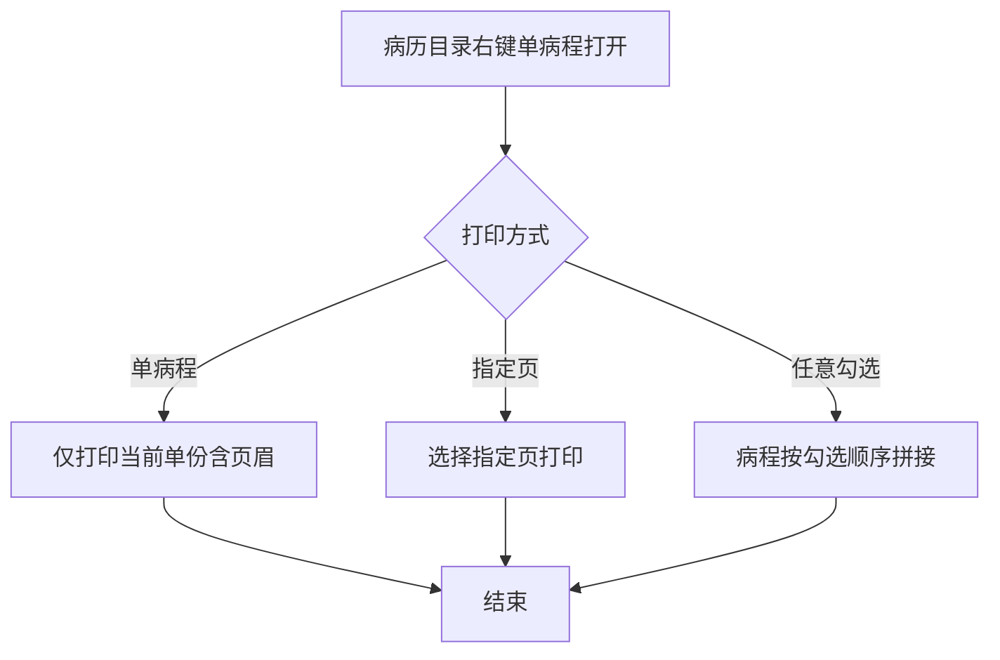
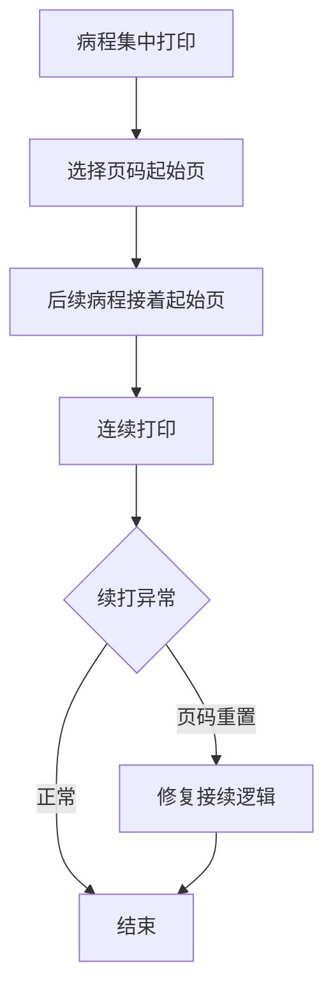

# BLGL-11-BLDY-002单份与单病程打印_ Analyst - Spec

> **需求编号**：BLGL-11-BLDY-002
> **父需求**：BLGL-11-BLDY
> **关联PM Spec**：BLGL-11-BLDY-002_单份与单病程打印_PM-spec.md
> **Spec版本**：V1.0
> **编写时间**：2026-08-14
> **编写人**：需求分析师

---

## 一、功能编号体系

#

## 1.1 功能层级结构

```
BLGL-11-BLDY-002: 单份与单病程打印
  ├─ BLGL-11-BLDY-002-01: 单病程打印
  │   ├─ -01-01: 右键单病程打开
  │   └─ -01-02: 仅打印当前单份
  ├─ BLGL-11-BLDY-002-02: 指定页打印
  │   └─ -02-01: 单份指定页
  ├─ BLGL-11-BLDY-002-03: 任意勾选合并打印
  │   └─ -03-01: 病程不连续勾选拼接
  └─ BLGL-11-BLDY-002-04: 病程续打
      └─ -04-01: 页码起始控制
```

#

## 1.2 功能编号表

| REQ-ID | 功能名称 | 类型 | 优先级 | 说明 |
|

----

----|

----

-----|

------|

----

----|

------|
| BLGL-11-BLDY-002-01 | 单病程打印 | 功能 | P0 | 右键单病程仅打单份 |
| BLGL-11-BLDY-002-01-01 | 右键单病程打开 | 子功能 | P0 | 打开当前单份 |
| BLGL-11-BLDY-002-01-02 | 仅打印当前单份 | 子功能 | P0 | 含页眉 |
| BLGL-11-BLDY-002-02 | 指定页打印 | 功能 | P1 | 指定页 |
| BLGL-11-BLDY-002-02-01 | 单份指定页 | 子功能 | P1 | 选择页 |
| BLGL-11-BLDY-002-03 | 任意勾选合并打印 | 功能 | P1 | 拼接 |
| BLGL-11-BLDY-002-03-01 | 病程拼接 | 子功能 | P1 | 顺序拼接 |
| BLGL-11-BLDY-002-04 | 病程续打 | 功能 | P1 | 页码续打 |
| BLGL-11-BLDY-002-04-01 | 页码起始控制 | 子功能 | P1 | 起始页 |

---

## 二、核心业务流程

#

## 2.1 单病程打印流程



#

## 2.2 病程续打流程



---

## 三、功能规格说明

---

### BLGL-11-BLDY-002-01: 单病程打印

#

#

## 3.1.1 功能概述

病历目录右键"单病程打开"，点击打印仅打印当前单份病程，内容包含页眉。

#

#

## 3.1.2 用户角色

| 角色 | 使用场景 | 权限要求 | 操作频率 |
|

------|

----

-----|

----

-----|

----

-----|
| 住院医生 | 单病程打印 | 打印权限 | 高频 |

#

#

## 3.1.3 业务流程（Given/When/Then）

#

#### 主流程

**Scenario 1: 单病程打印**

```gherkin
Given:
  - 医生在病历目录界面

When:
  - 医生右键选择"单病程打开"
  - 点击打印按钮

Then:
  - 只打印当前打开的单份病程
  - 打印内容包含页眉
```

#

#### 异常流程

**Scenario 2: 业务异常——单病程打印范围**

```gherkin
Given:
  - 医生右键单病程打开

When:
  - 点击打印按钮

Then:
  - 原逻辑调用全部病程预览界面（问题）
  - 应只打印当前单份病程
```

#

#### 边界流程

**Scenario 3: 边界场景——双击打开打印**

```gherkin
Given:
  - 医生双击打开病程

When:
  - 点击编辑栏打印/集中打印

Then:
  - ⏳ 待确认：默认打印所有已提交病程还是单份
```

#

#

## 3.1.4 数据字段定义

> 字段名来自代码扫描（`E:\39EMR\sr-next`，标注 ``）。

| 字段名 | 类型 | 必填 | 默认值 | 取值范围 | 说明 | 概念ID |
|

----

----|

------|

------|

----

----|

----

-----|

------|

----

----|
| inpEmrSetId | Long | 是 | - | - | 病历ID| ⏳ 待确认 |
| printType | String | 是 | - | single/batch | 打印类型| ⏳ 待确认 |

#

#

## 3.1.5 验收标准

| AC编号 | 验收标准 | 对应REQ-ID | 验证方法 | 验证场景 |
|

----

----|

----

-----|

----

----

---|

----

-----|

----

-----|
| AC-001 | 右键单病程打开打印仅当前单份含页眉 | -002-01 | 功能测试 | Scenario 1 |

---

### BLGL-11-BLDY-002-02: 指定页打印

#

#

## 3.2.1 功能概述

单份病历打印支持指定页打印，批量打印预览也支持指定页。

#

#

## 3.2.2 用户角色

| 角色 | 使用场景 | 权限要求 | 操作频率 |
|

------|

----

-----|

----

-----|

----

-----|
| 住院医生 | 指定页打印 | 打印权限 | 中频 |

#

#

## 3.2.3 业务流程（Given/When/Then）

#

#### 主流程

**Scenario 1: 指定页打印**

```gherkin
Given:
  - 单份病历打印

When:
  - 医生选择指定页

Then:
  - 打印指定页内容
  - 批量打印预览也支持指定页打印
```

#

#

## 3.2.4 数据字段定义

| 字段名 | 类型 | 必填 | 默认值 | 取值范围 | 说明 | 概念ID |
|

----

----|

------|

------|

----

----|

----

-----|

------|

----

----|
| 指定页 | List | 否 | - | 页号 | 指定页打印| ⏳ 待确认 |

#

#

## 3.2.5 验收标准

| AC编号 | 验收标准 | 对应REQ-ID | 验证方法 | 验证场景 |
|

----

----|

----

-----|

----

----

---|

----

-----|

----

-----|
| AC-002 | 单份打印支持指定页，批量预览也支持 | -002-02 | 功能测试 | Scenario 1 |

---

### BLGL-11-BLDY-002-03: 任意勾选合并打印

#

#

## 3.3.1 功能概述

集中打印支持病程不连续勾选合并打印，按勾选顺序连续拼接，页码从1开始。

#

#

## 3.3.2 用户角色

| 角色 | 使用场景 | 权限要求 | 操作频率 |
|

------|

----

-----|

----

-----|

----

-----|
| 住院医生 | 病程合并打印 | 打印权限 | 中频 |

#

#

## 3.3.3 业务流程（Given/When/Then）

#

#### 主流程

**Scenario 1: 任意病程合并打印**

```gherkin
Given:
  - 集中打印界面勾选"支持病程任意勾选打印"

When:
  - 医生不连续勾选病程

Then:
  - 病程按勾选顺序连续拼接打印
  - 页码从1开始
  - 每份病程打印模式按配置生效
```

#

#### 边界流程

**Scenario 2: 边界场景——连续勾选**

```gherkin
Given:
  - 未勾选支持任意勾选打印

When:
  - 医生勾选病程

Then:
  - 支持选择一份或连续几份
  - 不能勾选不连续的病程（勾选2和4，3自动勾选）
  - 勾选单份时页码从第一页开始
```

#

#

## 3.3.4 数据字段定义

| 字段名 | 类型 | 必填 | 默认值 | 取值范围 | 说明 | 概念ID |
|

----

----|

------|

------|

----

----|

----

-----|

------|

----

----|
| 支持病程任意勾选打印 | Boolean | 否 | 否 | 是/否 | 任意勾选参数| ⏳ 待确认 |

#

#

## 3.3.5 验收标准

| AC编号 | 验收标准 | 对应REQ-ID | 验证方法 | 验证场景 |
|

----

----|

----

-----|

----

----

---|

----

-----|

----

-----|
| AC-003 | 病程不连续勾选按勾选顺序拼接打印，页码从1开始 | -002-03 | 功能测试 | Scenario 1 |

---

### BLGL-11-BLDY-002-04: 病程续打

#

#

## 3.4.1 功能概述

病程集中打印选择页码起始页，后续病程接着起始页连续打印。

#

#

## 3.4.2 用户角色

| 角色 | 使用场景 | 权限要求 | 操作频率 |
|

------|

----

-----|

----

-----|

----

-----|
| 住院医生 | 病程续打 | 打印权限 | 中频 |

#

#

## 3.4.3 业务流程（Given/When/Then）

#

#### 主流程

**Scenario 1: 病程续打**

```gherkin
Given:
  - 病程集中打印

When:
  - 医生选择页码起始页

Then:
  - 后续病程接着起始页连续打印
```

#

#### 异常流程

**Scenario 2: 数据异常——续打页码重置**

```gherkin
Given:
  - 病程集中打印选择页码起始页

When:
  - 选中后续病历不接续打印

Then:
  - 页码重置为1（原问题）
  - ⏳ 待确认：续打页码接续逻辑```

#

#

## 3.4.4 数据字段定义

| 字段名 | 类型 | 必填 | 默认值 | 取值范围 | 说明 | 概念ID |
|

----

----|

------|

------|

----

----|

----

-----|

------|

----

----|
| 页码起始页 | Int | 否 | 1 | - | 续打起始页| ⏳ 待确认 |

#

#

## 3.4.5 验收标准

| AC编号 | 验收标准 | 对应REQ-ID | 验证方法 | 验证场景 |
|

----

----|

----

-----|

----

----

---|

----

-----|

----

-----|
| AC-004 | 病程续打选择页码起始页，后续接着起始页连续打印 | -002-04 | 功能测试 | Scenario 1 |

---

## 四、排除范围

本需求不包含以下功能项：

1. **病历集中打印** - 属 BLGL-11-BLDY-001
2. **打印模式与格式控制** - 属 BLGL-11-BLDY-003
3. **打印权限与归档控制** - 属 BLGL-11-BLDY-004
4. **打印实现与性能优化** - 属 BLGL-11-BLDY-005

> 与 PM-Spec 第四章一致。对照 Phase 1 功能点Spec 第6章（基线能力），确保不越界。

---

## 五、业务规则清单

| 规则ID | 规则名称 | 规则描述 | 优先级 |
|

----

----|

----

-----|

----

-----|

------|

----

----|
| BR-001 | 单病程打印 | 右键单病程打开仅打印当前单份含页眉 | P0 |
| BR-002 | 指定页打印 | 单份打印支持指定页，批量预览也支持 | P1 |
| BR-003 | 任意勾选 | 病程不连续勾选按顺序拼接打印 | P1 |
| BR-004 | 连续勾选 | 未开启任意勾选时支持连续勾选 | P1 |
| BR-005 | 续打页码 | 选择页码起始页，后续接着起始页连续打印 | P1 |

---

## 六、关联文档

| 文档类型 | 文档路径 | 说明 |
|

----

-----|

----

-----|

------|
| 功能点Spec | BLGL-11-BLDY 11病历打印功能点Spec.md（V2.0，上级目录） | Phase 1 功能点索引 |
| PM spec | 本目录 BLGL-11-BLDY-002_单份与单病程打印_PM-spec.md（V0.1） | PM 产出的 Spec 文档 |
| -Spec | 本目录 BLGL-11-BLDY-002_单份与单病程打印_Spec.md（V1.0） | 业务背景与目标 Spec |
| data-model.md | 待产出 | 架构师产出的数据建模文档 |
| design.md | 待产出 | 架构师产出的技术方案文档 |
| api-contract.md | 待产出 | 开发经理产出的 API 契约文档 |

---

## 七、待确认问题清单

| 编号 | 问题描述 | 缺失信息 | 影响范围 | 建议补充方 |
|

------|

----

-----|

----

-----|

----

-----|

----

----

---|
| Q-001 | 双击打开打印范围 | 双击打开默认打印单份还是全部 | 3.1.3 Scenario 3 | 产品经理 |
| Q-002 | 续打页码重置 | 页码接续逻辑 | 3.4.3 Scenario 2 | 开发经理 |
| Q-003 | 单病程打印缺失/重叠 | 单份打印异常 | 3.1.3 关联 | 开发经理 |
| Q-004 | 完整接口契约 | API 请求/返回字段 | 第5章接口设计 | 开发经理 |
| Q-005 | 概念ID、性能指标 | 字段概念ID、打印SLA | 数据模型、非功能 | 架构师/产品经理 |

---

## 填写检查清单

| 序号 | 检查项 | 是否完成 |
|:

----:|

----

----|:

----

----:|
| 1 | 功能编号带父子层级 | ✅ |
| 2 | 每个 REQ-ID 有功能概述和用户角色 | ✅ |
| 3 | 主流程至少 1 个 Given/When/Then 场景 | ✅ |
| 4 | 异常流程至少 3 个 Given/When/Then 场景 | ✅ |
| 5 | 边界流程至少 2 个 Given/When/Then 场景 | ✅ |
| 6 | 每个 Given/When/Then 内容具体，不模糊 | ✅ |
| 7 | 数据字段定义完整 | ✅ |
| 8 | 验收标准 AC 编号独立，可验证 | ✅ |
| 9 | 验收标准无"功能正常"等模糊表述 | ✅ |
| 10 | 排除范围明确列出 | ✅ |
| 11 | 业务规则清单列出所有规则，每条标注来源 | ✅ |
| 12 | 流程图使用 Mermaid 格式（≥2 个） | ✅ |
| 13 | 关联文档索引包含 Phase 1 功能点Spec | ✅ |
| 14 | 待确认问题清单汇总了全文所有 ⏳ 项 | ✅ |
| 15 | 全文无占位符 `< >` 残留 | ✅ |
| 16 | 全文陈述可溯源至资料区（S1~S10 溯源核查） | ✅ |
| 17 | 人工审核确认完成 | ⏳ 待确认 |

---

**文档状态**：⬜ 待审核
**维护责任**：需求分析师规范组
**下次更新**：根据评审反馈优化

---

## 版本历史

| 版本 | 日期 | 变更说明 | 编写人 |
|

------|

------|

----

-----|

----

----|
| V1.0 | 2026-08-14 | 初始版本 | 需求分析师 |
