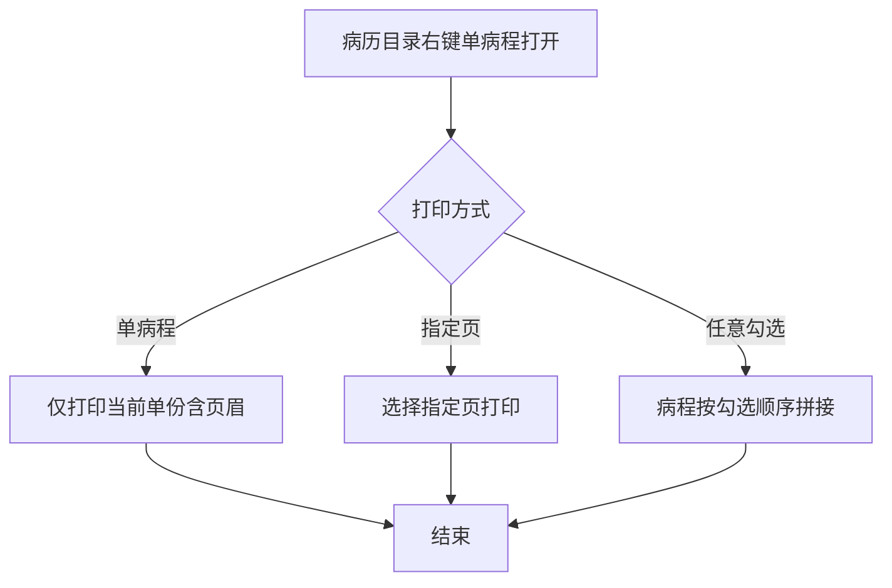
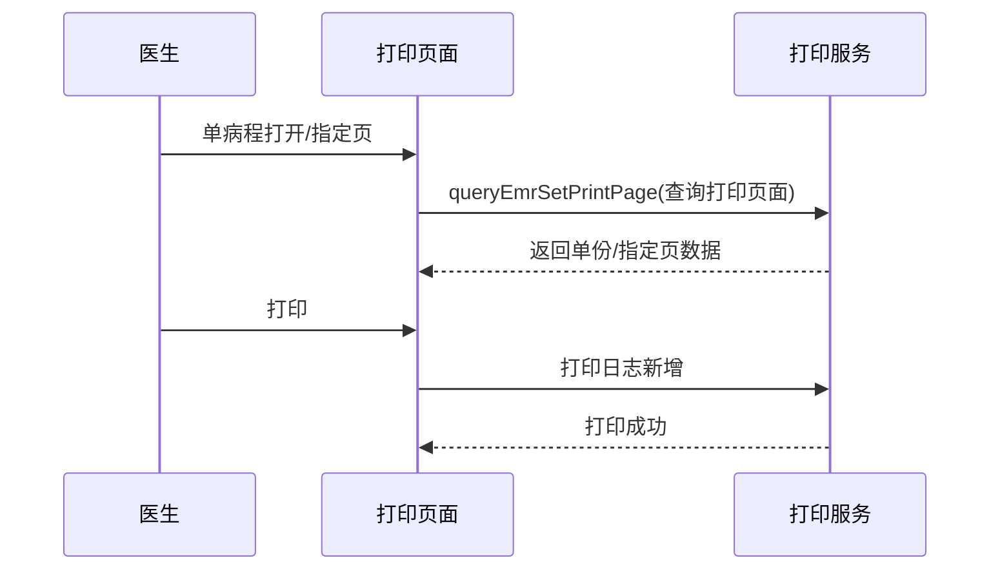

# BLGL-11-BLDY-002 单份与单病程打印 - Spec

> **功能编号**：BLGL-11-BLDY-002
> **文档类型**：功能Spec（业务背景与设计）
> **文档版本**：V1.0
> **编写时间**：2026-08-14
> **编写人**：RACC

---

## 文档索引

#

### 章节索引

**本文档（功能Spec：业务背景与设计）**

| 章节号 | 章节名称 | 内容说明 |
|

----

----|

----

-----|

----

-----|
| 第1章 | 文档概述 | 文档目的、文档范围、术语定义、阅读指南、参考文档 |
| 第2章 | 功能背景与定位 | 功能背景、功能定位、目标用户、核心价值 |
| 第3章 | 业务流程设计 | 主流程/异常流程/边界流程（Given/When/Then） |
| 第4章 | 数据模型设计 | 核心数据结构、状态定义、系统参数定义 |
| 第5章 | 接口契约设计 | API列表、接口详细设计、错误码定义 |
| 第6章 | 技术方案设计 | 页面路径、技术栈、关键技术点、部署方案 |
| 第7章 | 测试用例预设计 | 功能/边界/异常/性能测试用例 |
| 第8章 | 非功能性要求 | 性能、安全、可用性、兼容性 |
| 第9章 | 依赖与风险 | 外部依赖、风险项 |
| 第10章 | 附录 | 流程图、时序图、参考文档 |

**PM-Spec（需求规格）**：目标/约束/验收标准/排除范围/关键决策/优先级
**Analyst-Spec（分析规格）**：功能编号体系/核心业务流程/功能规格/排除范围/业务规则/关联文档/待确认问题

#

### 版本历史

| 版本 | 日期 | 变更说明 | 编写人 |
|

------|

------|

----

-----|

----

----|
| V1.0 | 2026-08-14 | 初始版本 | RACC |

#

### 关联文档索引

| 序号 | 文档名称 | 文档类型 | 版本 | 位置 |
|

------|

----

-----|

----

-----|

------|

------|
| 1 | BLGL-11-BLDY-002_单份与单病程打印_Spec.md | 功能Spec（业务背景与设计）（本文档） | V1.0 | 本目录 |
| 2 | BLGL-11-BLDY-002_单份与单病程打印_PM-spec.md | PM-Spec（需求规格） | V0.1 | 本目录 |
| 3 | BLGL-11-BLDY-002_单份与单病程打印_Analyst-spec.md | Analyst-Spec（分析规格） | V1.0 | 本目录 |
| 4 | BLGL-11-BLDY 11病历打印功能点Spec.md | 功能点Spec（模块级） | V2.0 | 上级目录 |

---

## 1、文档概述

#

## 1.1、文档目的

本文档旨在明确"单份与单病程打印"功能（BLGL-11-BLDY-002）的业务背景与设计方案，为需求分析、研发实现、测试验收及评审提供统一的业务上下文、设计口径与决策依据。

#

## 1.2、文档范围

#

#

## 1.2.1 纳入范围

本文档覆盖单份与单病程打印的完整业务背景与设计，包括：

- 单病程打印（病历目录右键单病程打印）
- 单份病历打印（指定页打印）
- 病程任意勾选合并打印
- 病程续打（页码起始控制）
- 指定页打印功能

#

#

## 1.2.2 排除范围

本文档不涉及以下内容（详见其他功能点或模块）：

- 病历集中打印—— BLGL-11-BLDY-001
- 打印模式与格式控制—— BLGL-11-BLDY-003
- 打印权限与归档控制—— BLGL-11-BLDY-004
- 打印实现与性能优化—— BLGL-11-BLDY-005

#

## 1.3、术语定义

| 术语 | 定义 |
|

------|

------|
| 单病程打印 | 病历目录右键"单病程打开"打印当前单份病程|
| 指定页打印 | 打印时选择指定页|
| 病程续打 | 病程集中打印选择页码起始页，后续接着起始页连续打印|
| 任意勾选合并打印 | 病程不连续勾选合并打印，按勾选顺序拼接|

> ⏳ 待确认：规范术语表待产品文档确认。

#

## 1.4、阅读指南


- **章节关系**：第1~2章为业务全貌，第3~10章为设计实现层。与 Analyst-Spec、PM-Spec 互相引用保持一致。

- **读者对象**：产品经理/需求分析师读第1~2章；研发读第3~6、9~10章；测试读第3、7~8章；评审人员核对各层一致性。

#

## 1.5、参考文档

| 序号 | 文档名称 | 版本/日期 |
|

------|

----

-----|

----

------|
| 1 | 【历史需求】住院病历的历史需求.xlsx | - |
| 2 | BLGL-11-BLDY-002_单份与单病程打印_PM-spec.md | V0.1 |
| 3 | BLGL-11-BLDY-002_单份与单病程打印_Analyst-spec.md | V1.0 |
| 4 | BLGL-11-BLDY 11病历打印功能点Spec.md | V2.0 |

---

## 2、功能背景与定位

#

## 2.1 功能背景

单份与单病程打印是病历单份输出的能力，需满足：


- **管理要求**：医生按需打印单份病程或指定页，用于病例讨论等场景
- **现状痛点**：
  - 右键单病程打开打印的是全部病程而非当前单份- 病程续打页码重置为1- 集中打印不支持病程任意勾选合并
- **历史需求演进**：从单病程打印→ 指定页打印→ 任意勾选合并→ 页码起始续打→ 续打修复

#

## 2.2 功能定位

"单份与单病程打印"是 WiNEX 病历管理-病历打印模块的单份输出能力，定位为：


- **单份打印**：单病程/单份病历打印

- **指定页打印**：选择指定页输出

- **续打拼接**：病程连续拼接打印

#

## 2.3 目标用户

| 用户角色 | 主要使用场景 |
|

----

-----|

----

----

-----|
| 住院医生 | 单病程打印、病例讨论资料打印 |

#

## 2.4 核心价值

| 价值维度 | 价值描述 |
|

----

-----|

----

-----|
| 按需打印 | 单病程/指定页按需输出|
| 灵活合并 | 任意病程勾选合并|
| 页码准确 | 续打页码接续|

---

## 3、业务流程设计（Given/When/Then）

#

## 3.1 主流程

**Scenario 1: 单病程打印**

```gherkin
Given:
  - 医生在病历目录界面

When:
  - 医生右键选择"单病程打开"
  - 点击打印按钮

Then:
  - 只打印当前打开的单份病程
  - 打印内容包含页眉
```

#

## 3.2 异常流程

**Scenario 2: 业务异常——单病程打印范围**

```gherkin
Given:
  - 医生右键单病程打开

When:
  - 点击打印按钮

Then:
  - 原逻辑调用全部病程预览界面（问题）
  - 应只打印当前单份病程
```

**Scenario 3: 数据异常——续打页码重置**

```gherkin
Given:
  - 病程集中打印选择页码起始页

When:
  - 选中后续病历不接续打印

Then:
  - 页码重置为1（原问题）
  - ⏳ 待确认：续打页码接续逻辑```

**Scenario 4: 系统异常——打印缺失**

```gherkin
Given:
  - 单病程打印

When:
  - 打印

Then:
  - ⏳ 待确认：单病程打印缺失/续打重叠```

#

## 3.3 边界流程

**Scenario 5: 边界场景——任意病程合并打印**

```gherkin
Given:
  - 集中打印界面勾选"支持病程任意勾选打印"

When:
  - 医生不连续勾选病程

Then:
  - 病程按勾选顺序连续拼接打印
  - 页码从1开始
  - 每份病程打印模式按配置生效
```

**Scenario 6: 边界场景——指定页打印**

```gherkin
Given:
  - 单份病历打印

When:
  - 医生选择指定页

Then:
  - 打印指定页内容
  - 批量打印预览也支持指定页打印
```

---

## 4、数据模型设计

> 数据模型信息来自代码扫描（`E:\39EMR\sr-next`）和历史需求。标注 `` 的来自 PO 实体，标注 `` 的来自需求文本。

#

## 4.1 核心数据结构

#

#

## 4.1.1 核心表/实体

| 表/实体 | 关键字段 | 说明 |
|

----

-----|

----

-----|

------|
| INPATIENT_EMR_PRINT_LOG（InpatientEmrPrintLogPO） | 打印日志 | 单份打印日志|

> ⏳ 待确认：完整数据表清单待代码扫描或功能清单数据表清单补充。

#

## 4.2 状态定义

| 状态码 | 状态名称 | 说明 |
|

----

----|

----

-----|

------|
| 页码起始 | 续打 | 页码起始控制|

#

## 4.3 系统参数定义

| 参数编码 | 参数名称 | 说明 |
|

----

-----|

----

-----|

------|
| 支持病程任意勾选打印 | 任意勾选 | 默认不勾选，不记忆|

---

## 5、接口契约设计

> 接口信息来自代码扫描（`E:\39EMR\sr-next`）的 InpEmrPrintController。标注 ``。

#

## 5.1 API列表

| 序号 | API名称（代码函数） | 路径 | 方法 | 说明 |
|:

----:|

----

-----|

------|:

----:|

------|
| 1 | queryEmrSetPrintPage | /api/v1/app_record_inpatient/emr_set/print/page/query/by_example | POST | 打印页面查询（单份/指定页）|
| 2 | getPrintConfigInfo | /api/v1/app_record_inpatient/emr_inpatient/get_print_config_info | POST | 获取打印配置|
| 3 | addPrintLog | /api/v1/app_record_inpatient/emr_inpatient/print_log/add | POST | 打印日志新增|

> 前端实际请求前缀：`/inpatient-clinicalnote/api/v1/app_record_inpatient/`。

#

## 5.2 接口详细设计

#

#

## 5.2.1 打印页面查询（queryEmrSetPrintPage）

**请求参数**:
```json
{
  "inpEmrSetId": 5001,
  "printType": "single",
  "pageNum": 1,
  "pageSize": 20
}
```

**返回值（成功）**:
```json
{
  "success": true,
  "data": {
    "list": [
      {
        "inpEmrSetId": 5001,
        "emrName": "病程记录",
        "pageStart": 1
      }
    ],
    "total": 1
  }
}
```

**返回值（失败）**:
```json
{
  "success": false,
  "message": "查询失败",
  "data": null
}
```

> ⏳ 待确认：具体字段名/结构以接口契约文档为准。

#

## 5.3 错误码定义

| 错误码 | 错误信息 | 处理方式 |
|

----

----|

----

-----|

----

-----|
| ⏳ 待确认 | 打印报错 | 提示并返回打印界面 |

> ⏳ 待确认：业务错误码定义未在代码扫描中提取完整。

---

## 6、技术方案设计

#

## 6.1 页面路径


- **页面路径**: 住院医生站→病历目录（右键单病程打开）；病历打印→单份打印

- **前端组件**: NewIntegrationWindowSinglePrinter/（集成窗口单打印）、NewWindowPrinter/（新窗口打印）

#

## 6.2 技术栈

| 类别 | 技术 | 版本 |
|

------|

------|

------|
| 前端框架 | Vue | 2.6.14 |
| 前端UI | element-ui | 2.13.0 |
| 后端框架 | Spring Boot（Java） | java.version 17 |
| 构建工具 | webpack / Maven | 前端 webpack + 后端 Maven |

#

## 6.3 关键技术点

- 单病程打印：右键单病程打开仅打印当前单份，含页眉- 指定页打印：单份打印支持指定页，批量预览也支持- 任意勾选合并：病程不连续勾选按顺序拼接打印，页码从1开始- 续打页码：选择页码起始页，后续病程接着起始页连续打印

#

## 6.4 部署方案

⏳ 待确认：部署方案未在资料区中找到。

---

## 7、测试用例预设计

#

## 7.1 功能测试

| 用例编号 | 测试场景 | Given | When | Then |
|

----

-----|

----

-----|

----

---|

------|

------|
| TC-001 | 单病程打印 | 病历目录右键单病程打开 | 点击打印 | 仅打印当前单份含页眉|
| TC-002 | 指定页打印 | 单份病历打印 | 选择指定页 | 打印指定页|

#

## 7.2 边界测试

| 用例编号 | 测试场景 | Given | When | Then |
|

----

-----|

----

-----|

----

---|

------|

------|
| TC-003 | 任意勾选合并 | 勾选支持任意勾选 | 不连续勾选病程 | 按顺序拼接，页码从1开始|
| TC-004 | 续打页码 | 选择页码起始页 | 后续病程打印 | 接着起始页连续打印|

#

## 7.3 异常测试

| 用例编号 | 测试场景 | Given | When | Then |
|

----

-----|

----

-----|

----

---|

------|

------|
| TC-005 | 续打页码重置 | 选中后续病历 | 不接续打印 | ⏳ 待确认：页码重置|
| TC-006 | 单病程打印缺失 | 单病程打印 | 打印 | ⏳ 待确认：缺失/重叠|

#

## 7.4 性能测试

| 用例编号 | 测试场景 | 指标 |
|

----

-----|

----

-----|

------|
| TC-007 | 单份打印响应 | ⏳ 待确认：性能指标未在资料区中找到 |

---

## 8、非功能性要求

#

## 8.1 性能要求

| 指标 | 要求 |
|

------|

------|
| 单份打印响应 | ⏳ 待确认 |

#

## 8.2 安全要求

| 要求 | 说明 |
|

------|

------|
| 打印权限 | 按打印权限控制|

**医疗行业特殊要求**

| 要求 | 说明 |
|

------|

------|
| 打印完整 | 单病程打印内容完整含页眉|

#

## 8.3 可用性要求

| 指标 | 要求值 |
|

------|

----

----|
| 可用性 | ⏳ 待确认 |

#

## 8.4 兼容性要求

| 类型 | 要求 |
|

------|

------|
| 单份打印兼容 | 单份/批量预览均支持指定页|

---

## 9、依赖与风险

#

## 9.1 外部依赖

| 依赖项 | 说明 |
|

----

----|

------|
| 编辑器 | 单份打印对接|

#

## 9.2 风险项

| 风险项 | 等级 | 说明 | 应对方案 |
|

----

----|

------|

------|

----

-----|
| 续打页码 | 中 | 页码重置为1| 修复接续逻辑 |
| 打印范围 | 中 | 单病程打全部病程| 限定单份 |

---

## 10、附录

#

## 10.1 流程图



#

## 10.2 时序图



#

## 10.3 参考文档

- 【历史需求】住院病历的历史需求.xlsx- BLGL-11-BLDY 11病历打印功能点Spec.md（V2.0，第5章 -002 行）
- 关联Spec: BLGL-11-BLDY-001（集中打印）、-003（格式控制）

---

## 填写检查清单

| 序号 | 检查项 | 是否完成 |
|:

----:|

----

----|:

----

----:|
| 1 | 章节索引与正文章节一致 | ✅ |
| 2 | 版本历史记录完整 | ✅ |
| 3 | 关联文档索引已登记全部Spec | ✅ |
| 4 | 文档目的明确回答"为什么做/做成什么/怎么做" | ✅ |
| 5 | 纳入范围/排除范围清晰 | ✅ |
| 6 | 术语定义覆盖关键概念，从资料区可溯源 | ✅ |
| 7 | 参考文档已登记 | ✅ |
| 8 | 功能背景基于法规/规范/需求来源组织 | ✅ |
| 9 | 功能定位体现业务价值（3~5个定位点） | ✅ |
| 10 | 目标用户角色覆盖完整，在需求原文中有出处 | ✅ |
| 11 | 核心价值可陈述，与 Phase 1 口径一致 | ✅ |
| 12 | 业务流程：主流程≥1、异常≥3、边界≥2，Given/When/Then 具体 | ✅ |
| 13 | 数据模型：字段/表/状态/参数可溯源 | ✅ |
| 14 | 接口契约：API列表+详细设计+错误码齐全或标记待确认 | ✅ |
| 15 | 技术方案：页面路径/技术栈/关键点/部署方案或标记待确认 | ✅ |
| 16 | 测试用例：功能/边界/异常/性能覆盖 | ✅ |
| 17 | 非功能性要求：性能/安全/可用性/兼容性指标可量化或标记待确认 | ✅ |
| 18 | 依赖与风险：外部依赖登记完整 | ✅ |
| 19 | 附录：流程图/时序图与正文流程一致 | ✅ |
| 20 | 全文无占位符 `< >` 残留 | ✅ |
| 21 | 全文陈述可溯源至资料区 | ✅ |
| 22 | 人工审核确认完成 | ⏳ 待确认 |

---

**文档状态**：⬜ 待审核
**维护责任**：RACC
**下次更新**：根据评审反馈优化
