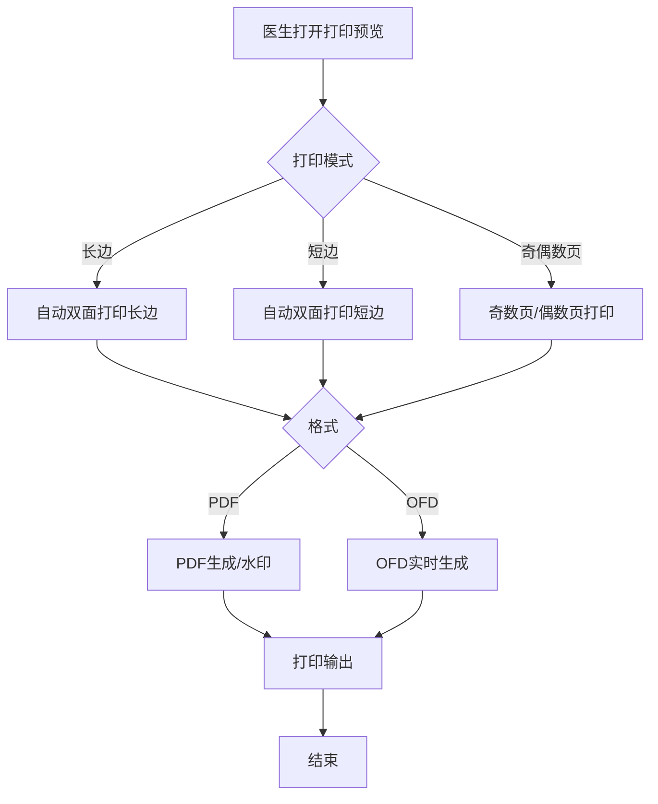
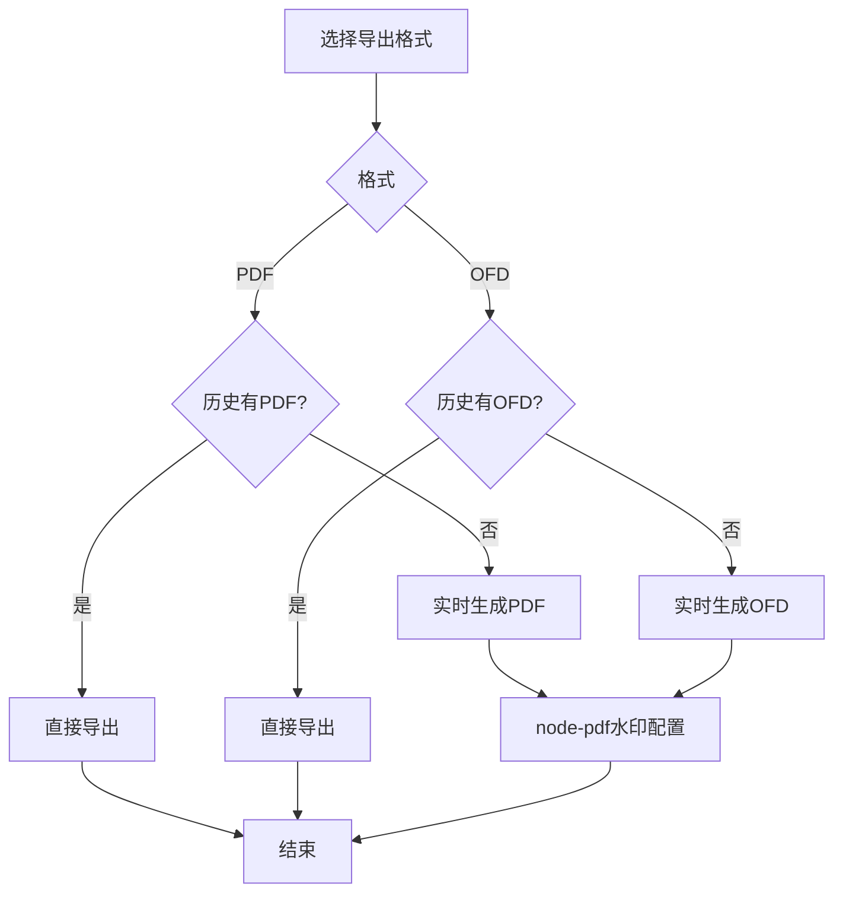

# BLGL-11-BLDY-003打印模式与格式控制_ Analyst - Spec

> **需求编号**：BLGL-11-BLDY-003
> **父需求**：BLGL-11-BLDY
> **关联PM Spec**：BLGL-11-BLDY-003_打印模式与格式控制_PM-spec.md
> **Spec版本**：V1.0
> **编写时间**：2026-08-14
> **编写人**：需求分析师

---

## 一、功能编号体系

#

## 1.1 功能层级结构

```
BLGL-11-BLDY-003: 打印模式与格式控制
  ├─ BLGL-11-BLDY-003-01: 打印模式控制
  │   ├─ -01-01: 长边/短边打印
  │   ├─ -01-02: 奇偶数页打印
  │   └─ -01-03: 空白页控制
  ├─ BLGL-11-BLDY-003-02: 输出格式控制
  │   ├─ -02-01: PDF/OFD格式生成
  │   └─ -02-02: node-pdf水印配置
  └─ BLGL-11-BLDY-003-03: 打印样式
      ├─ -03-01: 空行不打印
      ├─ -03-02: 中英文切换
      └─ -03-03: 默认设置保存
```

#

## 1.2 功能编号表

| REQ-ID | 功能名称 | 类型 | 优先级 | 说明 |
|

----

----|

----

-----|

------|

----

----|

------|
| BLGL-11-BLDY-003-01 | 打印模式控制 | 功能 | P0 | 长边/短边/奇偶/空白 |
| BLGL-11-BLDY-003-01-01 | 长边/短边打印 | 子功能 | P0 | 双面模式 |
| BLGL-11-BLDY-003-01-02 | 奇偶数页打印 | 子功能 | P1 | 手动双面 |
| BLGL-11-BLDY-003-01-03 | 空白页控制 | 子功能 | P1 | 偶数加空白 |
| BLGL-11-BLDY-003-02 | 输出格式控制 | 功能 | P0 | PDF/OFD/水印 |
| BLGL-11-BLDY-003-02-01 | PDF/OFD格式 | 子功能 | P0 | 实时生成 |
| BLGL-11-BLDY-003-02-02 | node-pdf水印 | 子功能 | P1 | WaterMark |
| BLGL-11-BLDY-003-03 | 打印样式 | 功能 | P1 | 空行/双语/默认 |
| BLGL-11-BLDY-003-03-01 | 空行不打印 | 子功能 | P1 | 标题无内容隐藏 |
| BLGL-11-BLDY-003-03-02 | 中英文切换 | 子功能 | P1 | 英文病程 |
| BLGL-11-BLDY-003-03-03 | 默认设置保存 | 子功能 | P1 | 双面默认 |

---

## 二、核心业务流程

#

## 2.1 打印模式控制流程



#

## 2.2 输出格式控制流程



---

## 三、功能规格说明

---

### BLGL-11-BLDY-003-01: 打印模式控制

#

#

## 3.1.1 功能概述

支持自动双面打印（长边/短边）模式、奇偶数页打印、空白页控制。

#

#

## 3.1.2 用户角色

| 角色 | 使用场景 | 权限要求 | 操作频率 |
|

------|

----

-----|

----

-----|

----

-----|
| 住院医生 | 打印模式选择 | 打印权限 | 高频 |

#

#

## 3.1.3 业务流程（Given/When/Then）

#

#### 主流程

**Scenario 1: 长边/短边打印**

```gherkin
Given:
  - 医生打开打印预览

When:
  - 医生选择打印模式

Then:
  - 选择"自动双面打印（长边）"以长边方式打印
  - 选择"自动双面打印（短边）"以短边方式打印
```

#

#### 异常流程

**Scenario 2: 业务异常——奇偶数页缺失**

```gherkin
Given:
  - 5X升级60

When:
  - 集中打印选奇偶数

Then:
  - 60不支持奇偶数打印（原问题）
  - 应增加"奇数页打印""偶数页打印"模式
```

**Scenario 3: 数据异常——空白页控制**

```gherkin
Given:
  - 双面打印模式

When:
  - 页码是偶数页

Then:
  - 前面自动新加一张空白页（奇数页不需要）
  - 空白页不算入页码
```

#

#### 边界流程

**Scenario 4: 边界场景——默认双面打印保存**

```gherkin
Given:
  - 医生设置打印模式

When:
  - 医生选择双面打印

Then:
  - 保存默认双面打印设置
  - 匹配旧系统及医生实际需求
```

#

#

## 3.1.4 数据字段定义

| 字段名 | 类型 | 必填 | 默认值 | 取值范围 | 说明 | 概念ID |
|

----

----|

------|

------|

----

----|

----

-----|

------|

----

----|
| 打印模式 | String | 是 | - | 长边/短边/奇偶 | 打印模式| ⏳ 待确认 |

#

#

## 3.1.5 验收标准

| AC编号 | 验收标准 | 对应REQ-ID | 验证方法 | 验证场景 |
|

----

----|

----

-----|

----

----

---|

----

-----|

----

-----|
| AC-001 | 选择自动双面打印（长边）以长边方式打印 | -003-01 | 功能测试 | Scenario 1 |
| AC-002 | 选择自动双面打印（短边）以短边方式打印 | -003-01 | 功能测试 | Scenario 1 |
| AC-003 | 集中打印支持奇数页/偶数页打印 | -003-01 | 功能测试 | Scenario 2 |
| AC-004 | 页码偶数时前面自动加空白页 | -003-01 | 功能测试 | Scenario 3 |

---

### BLGL-11-BLDY-003-02: 输出格式控制

#

#

## 3.2.1 功能概述

支持 PDF/OFD 格式生成（COMMON179 控制），node-pdf 水印配置（WaterMark 开关）。

#

#

## 3.2.2 用户角色

| 角色 | 使用场景 | 权限要求 | 操作频率 |
|

------|

----

-----|

----

-----|

----

-----|
| 病案管理员 | 导出格式选择 | 导出权限 | 中频 |

#

#

## 3.2.3 业务流程（Given/When/Then）

#

#### 主流程

**Scenario 1: OFD格式生成**

```gherkin
Given:
  - 全院查询选择导出OFD文件

When:
  - 历史未生成OFD文件

Then:
  - 点导出时实时生成OFD文件
  - PDF同理实时生成
```

#

#### 异常流程

**Scenario 2: 系统异常——OFD生成**

```gherkin
Given:
  - 全院查询选择导出OFD文件

When:
  - 历史未生成OFD文件

Then:
  - ⏳ 待确认：OFD生成异常处理
```

#

#### 边界流程

**Scenario 3: 边界场景——水印配置**

```gherkin
Given:
  - node-pdf 组件

When:
  - 配置水印

Then:
  - 水印开关API（WaterMark）默认关闭
  - 与编辑器水印渲染逻辑同步
```

#

#

## 3.2.4 数据字段定义

| 字段名 | 类型 | 必填 | 默认值 | 取值范围 | 说明 | 概念ID |
|

----

----|

------|

------|

----

----|

----

-----|

------|

----

----|
| 导出格式 | String | 是 | PDF | PDF/OFD | COMMON179| ⏳ 待确认 |
| WaterMark | Boolean | 否 | 关闭 | 开/关 | 水印开关| ⏳ 待确认 |

#

#

## 3.2.5 验收标准

| AC编号 | 验收标准 | 对应REQ-ID | 验证方法 | 验证场景 |
|

----

----|

----

-----|

----

----

---|

----

-----|

----

-----|
| AC-005 | 选择OFD格式时实时生成OFD文件 | -003-02 | 集成测试 | Scenario 1 |
| AC-006 | node-pdf 水印配置生效 | -003-02 | 集成测试 | Scenario 3 |

---

### BLGL-11-BLDY-003-03: 打印样式

#

#

## 3.3.1 功能概述

空行不打印（标题无内容自动隐藏）、中英文切换打印。

#

#

## 3.3.2 用户角色

| 角色 | 使用场景 | 权限要求 | 操作频率 |
|

------|

----

-----|

----

-----|

----

-----|
| 住院医生 | 打印样式控制 | 打印权限 | 中频 |

#

#

## 3.3.3 业务流程（Given/When/Then）

#

#### 主流程

**Scenario 1: 空行不打印**

```gherkin
Given:
  - 打印配置RE048

When:
  - 标题行无内容

Then:
  - 自动隐藏该行不打印
```

#

#### 边界流程

**Scenario 2: 边界场景——中英文切换**

```gherkin
Given:
  - 复星版本审签后

When:
  - 医生选择英文病程

Then:
  - 每个病程单独生成英文病程，单份不连续
  - 病历目录选择英文病程独立窗口打开
  - 不支持会诊记录生成
```

#

#

## 3.3.4 数据字段定义

| 字段名 | 类型 | 必填 | 默认值 | 取值范围 | 说明 | 概念ID |
|

----

----|

------|

------|

----

----|

----

-----|

------|

----

----|
| RE048 | Boolean | 否 | - | 是/否 | 空行是否参与打印| ⏳ 待确认 |

#

#

## 3.3.5 验收标准

| AC编号 | 验收标准 | 对应REQ-ID | 验证方法 | 验证场景 |
|

----

----|

----

-----|

----

----

---|

----

-----|

----

-----|
| AC-007 | 标题无内容时自动隐藏该行不打印 | -003-03 | 功能测试 | Scenario 1 |
| AC-008 | 中英文切换生成英文病程 | -003-03 | 功能测试 | Scenario 2 |

---

## 四、排除范围

本需求不包含以下功能项：

1. **病历集中打印** - 属 BLGL-11-BLDY-001
2. **单份与单病程打印** - 属 BLGL-11-BLDY-002
3. **打印权限与归档控制** - 属 BLGL-11-BLDY-004
4. **打印实现与性能优化** - 属 BLGL-11-BLDY-005
5. **空行不打印、中英文切换、默认设置保存、条码缩放** - 属基础能力 BC-BLDY-001/003/006/007

> 与 PM-Spec 第四章一致。对照 Phase 1 功能点Spec 第6章（基线能力），确保不越界。

---

## 五、业务规则清单

| 规则ID | 规则名称 | 规则描述 | 优先级 |
|

----

----|

----

-----|

----

-----|

------|

----

----|
| BR-001 | 长边/短边 | 自动双面打印长边/短边模式 | P0 |
| BR-002 | 奇偶数页 | 集中打印支持奇数页/偶数页 | P1 |
| BR-003 | 空白页 | 页码偶数时前面加空白页，不算页码 | P1 |
| BR-004 | OFD格式 | COMMON179控制PDF/OFD导出 | P0 |
| BR-005 | 水印 | node-pdf WaterMark开关默认关闭 | P1 |
| BR-006 | 空行不打印 | RE048控制空行不打印 | P1 |
| BR-007 | 中英文 | 英文病程独立生成，不支持会诊 | P1 |

---

## 六、关联文档

| 文档类型 | 文档路径 | 说明 |
|

----

-----|

----

-----|

------|
| 功能点Spec | BLGL-11-BLDY 11病历打印功能点Spec.md（V2.0，上级目录） | Phase 1 功能点索引 |
| PM spec | 本目录 BLGL-11-BLDY-003_打印模式与格式控制_PM-spec.md（V0.1） | PM 产出的 Spec 文档 |
| -Spec | 本目录 BLGL-11-BLDY-003_打印模式与格式控制_Spec.md（V1.0） | 业务背景与目标 Spec |
| data-model.md | 待产出 | 架构师产出的数据建模文档 |
| design.md | 待产出 | 架构师产出的技术方案文档 |
| api-contract.md | 待产出 | 开发经理产出的 API 契约文档 |

---

## 七、待确认问题清单

| 编号 | 问题描述 | 缺失信息 | 影响范围 | 建议补充方 |
|

------|

----

-----|

----

-----|

----

-----|

----

----

---|
| Q-001 | OFD生成异常处理 | OFD生成失败降级 | 3.2.3 Scenario 2 | 开发经理 |
| Q-002 | 打印模式接口契约 | 打印配置接口字段 | 第5章接口设计 | 开发经理 |
| Q-003 | 概念ID、性能指标 | 字段概念ID、生成SLA | 数据模型、非功能 | 架构师/产品经理 |

---

## 填写检查清单

| 序号 | 检查项 | 是否完成 |
|:

----:|

----

----|:

----

----:|
| 1 | 功能编号带父子层级 | ✅ |
| 2 | 每个 REQ-ID 有功能概述和用户角色 | ✅ |
| 3 | 主流程至少 1 个 Given/When/Then 场景 | ✅ |
| 4 | 异常流程至少 3 个 Given/When/Then 场景 | ✅ |
| 5 | 边界流程至少 2 个 Given/When/Then 场景 | ✅ |
| 6 | 每个 Given/When/Then 内容具体，不模糊 | ✅ |
| 7 | 数据字段定义完整 | ✅ |
| 8 | 验收标准 AC 编号独立，可验证 | ✅ |
| 9 | 验收标准无"功能正常"等模糊表述 | ✅ |
| 10 | 排除范围明确列出 | ✅ |
| 11 | 业务规则清单列出所有规则，每条标注来源 | ✅ |
| 12 | 流程图使用 Mermaid 格式（≥2 个） | ✅ |
| 13 | 关联文档索引包含 Phase 1 功能点Spec | ✅ |
| 14 | 待确认问题清单汇总了全文所有 ⏳ 项 | ✅ |
| 15 | 全文无占位符 `< >` 残留 | ✅ |
| 16 | 全文陈述可溯源至资料区（S1~S10 溯源核查） | ✅ |
| 17 | 人工审核确认完成 | ⏳ 待确认 |

---

**文档状态**：⬜ 待审核
**维护责任**：需求分析师规范组
**下次更新**：根据评审反馈优化

---

## 版本历史

| 版本 | 日期 | 变更说明 | 编写人 |
|

------|

------|

----

-----|

----

----|
| V1.0 | 2026-08-14 | 初始版本 | 需求分析师 |
