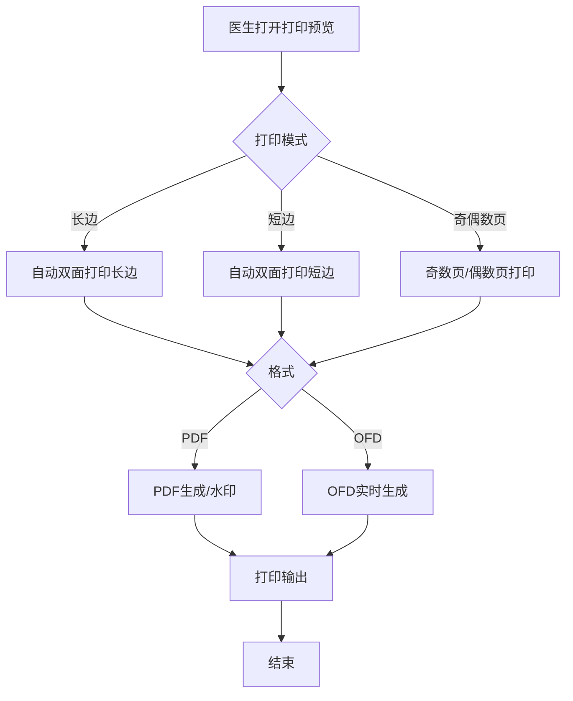
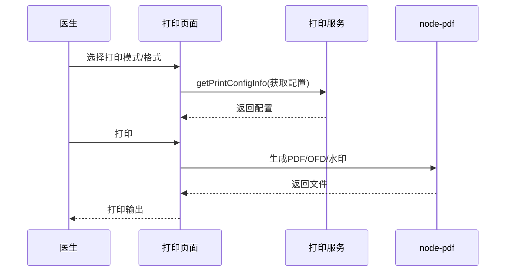

# BLGL-11-BLDY-003 打印模式与格式控制 - Spec

> **功能编号**：BLGL-11-BLDY-003
> **文档类型**：功能Spec（业务背景与设计）
> **文档版本**：V1.0
> **编写时间**：2026-08-14
> **编写人**：RACC

---

## 文档索引

#

### 章节索引

**本文档（功能Spec：业务背景与设计）**

| 章节号 | 章节名称 | 内容说明 |
|

----

----|

----

-----|

----

-----|
| 第1章 | 文档概述 | 文档目的、文档范围、术语定义、阅读指南、参考文档 |
| 第2章 | 功能背景与定位 | 功能背景、功能定位、目标用户、核心价值 |
| 第3章 | 业务流程设计 | 主流程/异常流程/边界流程（Given/When/Then） |
| 第4章 | 数据模型设计 | 核心数据结构、状态定义、系统参数定义 |
| 第5章 | 接口契约设计 | API列表、接口详细设计、错误码定义 |
| 第6章 | 技术方案设计 | 页面路径、技术栈、关键技术点、部署方案 |
| 第7章 | 测试用例预设计 | 功能/边界/异常/性能测试用例 |
| 第8章 | 非功能性要求 | 性能、安全、可用性、兼容性 |
| 第9章 | 依赖与风险 | 外部依赖、风险项 |
| 第10章 | 附录 | 流程图、时序图、参考文档 |

**PM-Spec（需求规格）**：目标/约束/验收标准/排除范围/关键决策/优先级
**Analyst-Spec（分析规格）**：功能编号体系/核心业务流程/功能规格/排除范围/业务规则/关联文档/待确认问题

#

### 版本历史

| 版本 | 日期 | 变更说明 | 编写人 |
|

------|

------|

----

-----|

----

----|
| V1.0 | 2026-08-14 | 初始版本 | RACC |

#

### 关联文档索引

| 序号 | 文档名称 | 文档类型 | 版本 | 位置 |
|

------|

----

-----|

----

-----|

------|

------|
| 1 | BLGL-11-BLDY-003_打印模式与格式控制_Spec.md | 功能Spec（业务背景与设计）（本文档） | V1.0 | 本目录 |
| 2 | BLGL-11-BLDY-003_打印模式与格式控制_PM-spec.md | PM-Spec（需求规格） | V0.1 | 本目录 |
| 3 | BLGL-11-BLDY-003_打印模式与格式控制_Analyst-spec.md | Analyst-Spec（分析规格） | V1.0 | 本目录 |
| 4 | BLGL-11-BLDY 11病历打印功能点Spec.md | 功能点Spec（模块级） | V2.0 | 上级目录 |

---

## 1、文档概述

#

## 1.1、文档目的

本文档旨在明确"打印模式与格式控制"功能（BLGL-11-BLDY-003）的业务背景与设计方案，为需求分析、研发实现、测试验收及评审提供统一的业务上下文、设计口径与决策依据。

#

## 1.2、文档范围

#

#

## 1.2.1 纳入范围

本文档覆盖打印模式与格式控制的完整业务背景与设计，包括：

- 长边/短边打印模式（自动双面打印长边/短边）
- 奇偶数页打印、空白页控制
- PDF/OFD 格式生成
- node-pdf 水印配置
- 空行不打印
- 中英文切换打印
- 默认双面打印设置保存

#

#

## 1.2.2 排除范围

本文档不涉及以下内容（详见其他功能点或模块）：

- 病历集中打印—— BLGL-11-BLDY-001
- 单份与单病程打印—— BLGL-11-BLDY-002
- 打印权限与归档控制—— BLGL-11-BLDY-004
- 打印实现与性能优化—— BLGL-11-BLDY-005
- 空行不打印、中英文切换、默认设置保存、条码缩放 —— Phase 1 功能点Spec 第6章基础能力（BC-BLDY-001、003、006、007）

#

## 1.3、术语定义

| 术语 | 定义 |
|

------|

------|
| 长边打印 | 正反面打印模式下正反面字体方向一致|
| 短边打印 | 正反面打印模式下正反面字体方向相反|
| 奇数页/偶数页打印 | 手动双面打印时先打印奇数页再打印偶数页|
| OFD格式 | 病历存储格式支持OFD|

> ⏳ 待确认：规范术语表待产品文档确认。

#

## 1.4、阅读指南


- **章节关系**：第1~2章为业务全貌，第3~10章为设计实现层。与 Analyst-Spec、PM-Spec 互相引用保持一致。

- **读者对象**：产品经理/需求分析师读第1~2章；研发读第3~6、9~10章；测试读第3、7~8章；评审人员核对各层一致性。

#

## 1.5、参考文档

| 序号 | 文档名称 | 版本/日期 |
|

------|

----

-----|

----

------|
| 1 | 【历史需求】住院病历的历史需求.xlsx | - |
| 2 | BLGL-11-BLDY-003_打印模式与格式控制_PM-spec.md | V0.1 |
| 3 | BLGL-11-BLDY-003_打印模式与格式控制_Analyst-spec.md | V1.0 |
| 4 | BLGL-11-BLDY 11病历打印功能点Spec.md | V2.0 |

---

## 2、功能背景与定位

#

## 2.1 功能背景

打印模式与格式控制是病历打印的输出呈现能力，需满足：


- **管理要求**：支持长边/短边打印，方便医生查看病历；手动双面打印需奇偶数页
- **现状痛点**：
  - 5X支持奇偶数打印，60不支持- 病历格式需支持OFD（五级要求）- 缺省双面打印设置未保存
- **历史需求演进**：从长边/短边打印→ 奇偶数页→ OFD格式→ 水印配置→ 空行不打印→ 中英文切换

#

## 2.2 功能定位

"打印模式与格式控制"是 WiNEX 病历管理-病历打印模块的输出呈现能力，定位为：


- **打印模式**：长边/短边/奇偶页/空白页控制

- **输出格式**：PDF/OFD 格式、水印配置

- **打印样式**：空行不打印、中英文切换

#

## 2.3 目标用户

| 用户角色 | 主要使用场景 |
|

----

-----|

----

----

-----|
| 住院医生 | 打印模式/格式选择 |
| 病案管理员 | 输出格式/水印配置 |

#

## 2.4 核心价值

| 价值维度 | 价值描述 |
|

----

-----|

----

-----|
| 打印灵活 | 长边/短边/奇偶页多模式|
| 格式合规 | PDF/OFD 输出、水印配置|
| 样式优化 | 空行不打印、中英文切换|

---

## 3、业务流程设计（Given/When/Then）

#

## 3.1 主流程

**Scenario 1: 长边/短边打印**

```gherkin
Given:
  - 医生打开打印预览

When:
  - 医生选择打印模式

Then:
  - 选择"自动双面打印（长边）"以长边方式打印
  - 选择"自动双面打印（短边）"以短边方式打印
```

#

## 3.2 异常流程

**Scenario 2: 业务异常——奇偶数页缺失**

```gherkin
Given:
  - 5X升级60

When:
  - 集中打印选奇偶数

Then:
  - 60不支持奇偶数打印（原问题）
  - 应增加"奇数页打印""偶数页打印"模式
```

**Scenario 3: 数据异常——空白页控制**

```gherkin
Given:
  - 双面打印模式

When:
  - 页码是偶数页

Then:
  - 前面自动新加一张空白页（奇数页不需要）
  - 空白页不算入页码
```

**Scenario 4: 系统异常——OFD生成**

```gherkin
Given:
  - 全院查询选择导出OFD文件

When:
  - 历史未生成OFD文件

Then:
  - 点导出时实时生成OFD文件
  - ⏳ 待确认：OFD生成异常处理
```

#

## 3.3 边界流程

**Scenario 5: 边界场景——中英文切换打印**

```gherkin
Given:
  - 复星版本审签后

When:
  - 医生选择英文病程

Then:
  - 每个病程单独生成英文病程，单份不连续
  - 病历目录选择英文病程独立窗口打开
  - 不支持会诊记录生成
```

**Scenario 6: 边界场景——默认双面打印保存**

```gherkin
Given:
  - 医生设置打印模式

When:
  - 医生选择双面打印

Then:
  - 保存默认双面打印设置
  - 匹配旧系统及医生实际需求
```

---

## 4、数据模型设计

> 数据模型信息来自代码扫描（`E:\39EMR\sr-next`）和历史需求。标注 `` 的来自 PO 实体，标注 `` 的来自需求文本。

#

## 4.1 核心数据结构

#

#

## 4.1.1 核心表/实体

| 表/实体 | 关键字段 | 说明 |
|

----

-----|

----

-----|

------|
| 打印配置表 | 打印模式/格式 | 打印模式配置|

> ⏳ 待确认：完整数据表清单待代码扫描或功能清单数据表清单补充。

#

## 4.2 状态定义

| 状态码 | 状态名称 | 说明 |
|

----

----|

----

-----|

------|
| 长边/短边 | 打印模式 | 自动双面打印|
| 奇数页/偶数页 | 打印模式 | 手动双面|

#

## 4.3 系统参数定义

| 参数编码 | 参数名称 | 说明 |
|

----

-----|

----

-----|

------|
| COMMON179 | 允许导出的病历格式 | PDF/OFD|
| RE048 | 空行是否参与打印 | 控制空行打印|

---

## 5、接口契约设计

> 接口信息来自代码扫描（`E:\39EMR\sr-next`）的 InpEmrPrintController。标注 ``。

#

## 5.1 API列表

| 序号 | API名称（代码函数） | 路径 | 方法 | 说明 |
|:

----:|

----

-----|

------|:

----:|

------|
| 1 | getPrintConfigInfo | /api/v1/app_record_inpatient/emr_inpatient/get_print_config_info | POST | 获取打印配置（打印模式/格式）|
| 2 | queryEmrSetPrint | /api/v1/app_record_inpatient/emr_set_print/query/by_example | POST | 查询打印页面|

> 前端实际请求前缀：`/inpatient-clinicalnote/api/v1/app_record_inpatient/`。

#

## 5.2 接口详细设计

#

#

## 5.2.1 获取打印配置（getPrintConfigInfo）

**请求参数**:
```json
{
  "encounterId": 1001,
  "configType": "printMode"
}
```

**返回值（成功）**:
```json
{
  "success": true,
  "data": {
    "printMode": "duplex_long_edge",
    "format": "PDF"
  }
}
```

**返回值（失败）**:
```json
{
  "success": false,
  "message": "查询失败",
  "data": null
}
```

> ⏳ 待确认：具体字段名/结构以接口契约文档为准。

#

## 5.3 错误码定义

| 错误码 | 错误信息 | 处理方式 |
|

----

----|

----

-----|

----

-----|
| ⏳ 待确认 | OFD生成失败 | 提示并重试|

> ⏳ 待确认：业务错误码定义未在代码扫描中提取完整。

---

## 6、技术方案设计

#

## 6.1 页面路径


- **页面路径**: 住院医生站→病历打印→打印模式/格式设置

- **前端组件**: InpBatchPrint/（批量打印）、NewWindowPrinter/（新窗口打印）

- **编辑器组件**: node-pdf（水印/PDF/OFD）

#

## 6.2 技术栈

| 类别 | 技术 | 版本 |
|

------|

------|

------|
| 前端框架 | Vue | 2.6.14 |
| 前端UI | element-ui | 2.13.0 |
| 后端框架 | Spring Boot（Java） | java.version 17 |
| 构建工具 | webpack / Maven | 前端 webpack + 后端 Maven |
| PDF/OFD | node-pdf | - |

#

## 6.3 关键技术点

- 长边/短边：自动双面打印（长边/短边）模式- 奇偶数页：增加"奇数页打印""偶数页打印"模式- 空白页：页码偶数时前面自动加空白页，不算入页码- OFD格式：COMMON179 控制导出 PDF/OFD，实时生成- 水印配置：node-pdf 水印开关 API（WaterMark，默认关闭）

#

## 6.4 部署方案

⏳ 待确认：部署方案未在资料区中找到。

---

## 7、测试用例预设计

#

## 7.1 功能测试

| 用例编号 | 测试场景 | Given | When | Then |
|

----

-----|

----

-----|

----

---|

------|

------|
| TC-001 | 长边打印 | 打印预览 | 选长边 | 正反面字体方向一致|
| TC-002 | 短边打印 | 打印预览 | 选短边 | 正反面字体方向相反|

#

## 7.2 边界测试

| 用例编号 | 测试场景 | Given | When | Then |
|

----

-----|

----

-----|

----

---|

------|

------|
| TC-003 | 奇偶数页 | 手动双面 | 选奇数页打印 | 先打奇数页再打偶数页|
| TC-004 | 空白页控制 | 页码偶数 | 双面打印 | 前面自动加空白页|

#

## 7.3 异常测试

| 用例编号 | 测试场景 | Given | When | Then |
|

----

-----|

----

-----|

----

---|

------|

------|
| TC-005 | OFD生成 | 选OFD格式 | 实时生成 | 生成OFD文件|
| TC-006 | 中英文切换 | 审签后 | 选英文病程 | 独立生成英文病程|

#

## 7.4 性能测试

| 用例编号 | 测试场景 | 指标 |
|

----

-----|

----

-----|

------|
| TC-007 | OFD/PDF生成响应 | ⏳ 待确认：性能指标未在资料区中找到 |

---

## 8、非功能性要求

#

## 8.1 性能要求

| 指标 | 要求 |
|

------|

------|
| OFD/PDF生成响应 | ⏳ 待确认 |

#

## 8.2 安全要求

| 要求 | 说明 |
|

------|

------|
| 水印合规 | node-pdf 水印配置|

**医疗行业特殊要求**

| 要求 | 说明 |
|

------|

------|
| 五级格式 | 病历存储格式支持OFD|

#

## 8.3 可用性要求

| 指标 | 要求值 |
|

------|

----

----|
| 可用性 | ⏳ 待确认 |

#

## 8.4 兼容性要求

| 类型 | 要求 |
|

------|

------|
| 5X兼容 | 60需支持5X的奇偶数打印|

---

## 9、依赖与风险

#

## 9.1 外部依赖

| 依赖项 | 说明 |
|

----

----|

------|
| node-pdf | 水印/PDF/OFD生成|
| 编辑器 | 打印格式对接|

#

## 9.2 风险项

| 风险项 | 等级 | 说明 | 应对方案 |
|

----

----|

------|

------|

----

-----|
| OFD兼容 | 中 | OFD格式生成兼容| 实时生成 |
| 打印模式复杂 | 中 | 多模式组合（长边/短边/奇偶/空白） | 模式参数化 |

---

## 10、附录

#

## 10.1 流程图



#

## 10.2 时序图



#

## 10.3 参考文档

- 【历史需求】住院病历的历史需求.xlsx- BLGL-11-BLDY 11病历打印功能点Spec.md（V2.0，第5章 -003 行）
- 关联Spec: BLGL-11-BLDY-001（集中打印）、-005（实现优化）

---

## 填写检查清单

| 序号 | 检查项 | 是否完成 |
|:

----:|

----

----|:

----

----:|
| 1 | 章节索引与正文章节一致 | ✅ |
| 2 | 版本历史记录完整 | ✅ |
| 3 | 关联文档索引已登记全部Spec | ✅ |
| 4 | 文档目的明确回答"为什么做/做成什么/怎么做" | ✅ |
| 5 | 纳入范围/排除范围清晰 | ✅ |
| 6 | 术语定义覆盖关键概念，从资料区可溯源 | ✅ |
| 7 | 参考文档已登记 | ✅ |
| 8 | 功能背景基于法规/规范/需求来源组织 | ✅ |
| 9 | 功能定位体现业务价值（3~5个定位点） | ✅ |
| 10 | 目标用户角色覆盖完整，在需求原文中有出处 | ✅ |
| 11 | 核心价值可陈述，与 Phase 1 口径一致 | ✅ |
| 12 | 业务流程：主流程≥1、异常≥3、边界≥2，Given/When/Then 具体 | ✅ |
| 13 | 数据模型：字段/表/状态/参数可溯源 | ✅ |
| 14 | 接口契约：API列表+详细设计+错误码齐全或标记待确认 | ✅ |
| 15 | 技术方案：页面路径/技术栈/关键点/部署方案或标记待确认 | ✅ |
| 16 | 测试用例：功能/边界/异常/性能覆盖 | ✅ |
| 17 | 非功能性要求：性能/安全/可用性/兼容性指标可量化或标记待确认 | ✅ |
| 18 | 依赖与风险：外部依赖登记完整 | ✅ |
| 19 | 附录：流程图/时序图与正文流程一致 | ✅ |
| 20 | 全文无占位符 `< >` 残留 | ✅ |
| 21 | 全文陈述可溯源至资料区 | ✅ |
| 22 | 人工审核确认完成 | ⏳ 待确认 |

---

**文档状态**：⬜ 待审核
**维护责任**：RACC
**下次更新**：根据评审反馈优化
