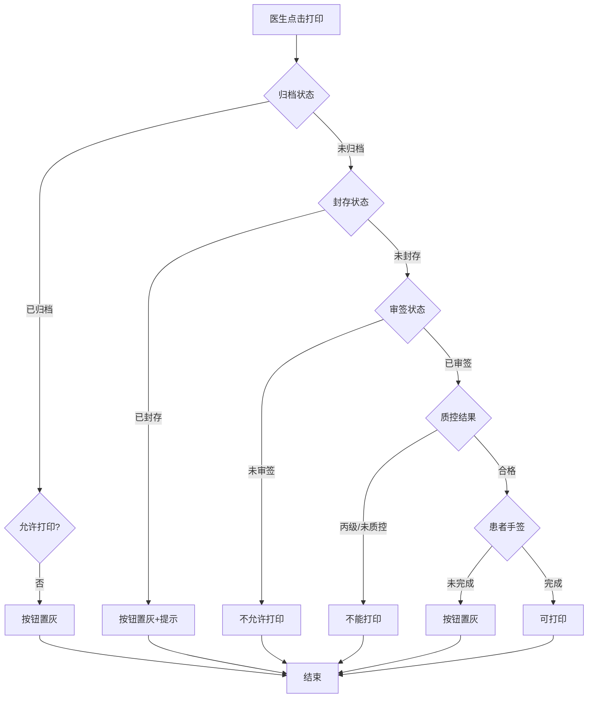
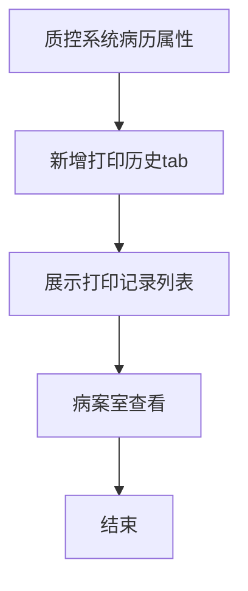

# BLGL-11-BLDY-004打印权限与归档控制_ Analyst - Spec

> **需求编号**：BLGL-11-BLDY-004
> **父需求**：BLGL-11-BLDY
> **关联PM Spec**：BLGL-11-BLDY-004_打印权限与归档控制_PM-spec.md
> **Spec版本**：V1.0
> **编写时间**：2026-08-14
> **编写人**：需求分析师

---

## 一、功能编号体系

#

## 1.1 功能层级结构

```
BLGL-11-BLDY-004: 打印权限与归档控制
  ├─ BLGL-11-BLDY-004-01: 归档/封存打印控制
  │   ├─ -01-01: 归档病历打印控制
  │   ├─ -01-02: 封存病历打印控制
  │   └─ -01-03: 已归档后允许打印监控类型
  ├─ BLGL-11-BLDY-004-02: 审签/手签打印控制
  │   ├─ -02-01: 审签通过后打印
  │   └─ -02-02: 患者手签后打印
  ├─ BLGL-11-BLDY-004-03: 质控打印限制
  │   └─ -03-01: 丙级/未质控/整改未答复
  ├─ BLGL-11-BLDY-004-04: 打印记录查看
  │   └─ -04-01: 质控系统打印历史
  └─ BLGL-11-BLDY-004-05: 打印权限控制
      └─ -05-01: 多系统入口打印权限
```

#

## 1.2 功能编号表

| REQ-ID | 功能名称 | 类型 | 优先级 | 说明 |
|

----

----|

----

-----|

------|

----

----|

------|
| BLGL-11-BLDY-004-01 | 归档/封存打印控制 | 功能 | P0 | 归档/封存 |
| BLGL-11-BLDY-004-01-01 | 归档打印控制 | 子功能 | P0 | 参数控制 |
| BLGL-11-BLDY-004-01-02 | 封存打印控制 | 子功能 | P0 | 按钮置灰 |
| BLGL-11-BLDY-004-01-03 | 归档后打印监控类型 | 子功能 | P1 | 配置监控类型 |
| BLGL-11-BLDY-004-02 | 审签/手签打印控制 | 功能 | P0 | 审签/手签 |
| BLGL-11-BLDY-004-02-01 | 审签后打印 | 子功能 | P0 | COMMON362 |
| BLGL-11-BLDY-004-02-02 | 患者手签后打印 | 子功能 | P0 | 手签校验 |
| BLGL-11-BLDY-004-03 | 质控打印限制 | 功能 | P1 | 质控限制 |
| BLGL-11-BLDY-004-03-01 | 丙级/未质控限制 | 子功能 | P1 | 阻止打印 |
| BLGL-11-BLDY-004-04 | 打印记录查看 | 功能 | P1 | 打印历史 |
| BLGL-11-BLDY-004-04-01 | 质控系统打印历史 | 子功能 | P1 | tab展示 |
| BLGL-11-BLDY-004-05 | 打印权限控制 | 功能 | P1 | 多系统权限 |
| BLGL-11-BLDY-004-05-01 | 多系统入口权限 | 子功能 | P1 | COMMON026/089 |

---

## 二、核心业务流程

#

## 2.1 打印校验流程



#

## 2.2 打印记录查看流程



---

## 三、功能规格说明

---

### BLGL-11-BLDY-004-01: 归档/封存打印控制

#

#

## 3.1.1 功能概述

已归档状态病历是否允许打印按参数控制，已封存病历不允许打印按钮置灰。

#

#

## 3.1.2 用户角色

| 角色 | 使用场景 | 权限要求 | 操作频率 |
|

------|

----

-----|

----

-----|

----

-----|
| 病案管理员 | 归档/封存打印控制 | 打印权限 | 中频 |

#

#

## 3.1.3 业务流程（Given/When/Then）

#

#### 主流程

**Scenario 1: 归档病历打印控制**

```gherkin
Given:
  - 参数"已归档状态的病历是否允许打印"已配置

When:
  - 医生尝试打印已归档病历

Then:
  - 参数=是：有剩余打印次数可打印
  - 参数=否：已归档病历都不能打印，打印按钮置灰
```

#

#### 异常流程

**Scenario 2: 业务异常——封存病历打印**

```gherkin
Given:
  - 患者病历状态已封存
  - 参数"已封存的病历允许打印的角色"=否

When:
  - 医生点击打印/集中打印

Then:
  - 打印按钮、集中打印按钮置灰
  - 鼠标移入显示"病历已封存，不允许打印"
```

#

#### 边界流程

**Scenario 3: 边界场景——归档后允许打印**

```gherkin
Given:
  - 参数"已归档后才允许打印的病历监控类型"已配置

When:
  - 医生打印配置监控类型的病历

Then:
  - 未归档前不允许打印
  - 打印按钮置灰提示"病历未归档，不允许打印"
```

**Scenario 4: 边界场景——归档患者集中打印**

```gherkin
Given:
  - 患者已归档

When:
  - 医生集中打印

Then:
  - 支持配置角色允许归档后继续打印病历
```

#

#

## 3.1.4 数据字段定义

| 字段名 | 类型 | 必填 | 默认值 | 取值范围 | 说明 | 概念ID |
|

----

----|

------|

------|

----

----|

----

-----|

------|

----

----|
| 已归档允许打印 | Boolean | 是 | 是 | 是/否 | 归档打印| ⏳ 待确认 |
| 已封存允许打印角色 | List | 是 | 无 | 角色 | 封存打印| ⏳ 待确认 |

#

#

## 3.1.5 验收标准

| AC编号 | 验收标准 | 对应REQ-ID | 验证方法 | 验证场景 |
|

----

----|

----

-----|

----

----

---|

----

-----|

----

-----|
| AC-001 | 归档参数=否时已归档病历打印按钮置灰 | -004-01 | 功能测试 | Scenario 1 |
| AC-002 | 封存病历打印按钮置灰，提示"病历已封存，不允许打印" | -004-01 | 功能测试 | Scenario 2 |
| AC-003 | 归档后允许打印监控类型未归档前不允许打印 | -004-01 | 功能测试 | Scenario 3 |

---

### BLGL-11-BLDY-004-02: 审签/手签打印控制

#

#

## 3.2.1 功能概述

审签通过才允许打印（COMMON362 监控类型），患者签名未完成不允许打印。

#

#

## 3.2.2 用户角色

| 角色 | 使用场景 | 权限要求 | 操作频率 |
|

------|

----

-----|

----

-----|

----

-----|
| 住院医生 | 打印（审签/手签校验） | 打印权限 | 高频 |

#

#

## 3.2.3 业务流程（Given/When/Then）

#

#### 主流程

**Scenario 1: 审签后打印**

```gherkin
Given:
  - 参数 COMMON362 审签通过才允许打印的病历监控类型

When:
  - 医生打印配置监控类型的病历

Then:
  - 审签通过后才允许打印
  - 未审签不允许打印
```

#

#### 异常流程

**Scenario 2: 数据异常——审签未通过**

```gherkin
Given:
  - COMMON362配置的病历未审签

When:
  - 医生打印

Then:
  - 不允许打印
  - ⏳ 待确认：未审签打印提示
```

#

#### 边界流程

**Scenario 3: 边界场景——患者手签**

```gherkin
Given:
  - 参数"未完成患者签名的病历是否允许打印"=不允许
  - 病历存在触发患者签名的数据元

When:
  - 医生打印

Then:
  - 患者签名未完成时打印按钮置灰
  - 鼠标移入显示不能打印原因
  - 集中打印也校验并显示原因
```

#

#

## 3.2.4 数据字段定义

| 字段名 | 类型 | 必填 | 默认值 | 取值范围 | 说明 | 概念ID |
|

----

----|

------|

------|

----

----|

----

-----|

------|

----

----|
| COMMON362 | List | 否 | 无 | 监控类型 | 审签后打印| ⏳ 待确认 |
| 手签打印 | Boolean | 否 | 允许 | 允许/不允许 | 患者手签| ⏳ 待确认 |

#

#

## 3.2.5 验收标准

| AC编号 | 验收标准 | 对应REQ-ID | 验证方法 | 验证场景 |
|

----

----|

----

-----|

----

----

---|

----

-----|

----

-----|
| AC-004 | COMMON362配置的监控类型未审签不允许打印 | -004-02 | 功能测试 | Scenario 1 |
| AC-005 | 患者签名未完成时打印按钮置灰 | -004-02 | 功能测试 | Scenario 3 |

---

### BLGL-11-BLDY-004-03: 质控打印限制

#

#

## 3.3.1 功能概述

环节质控结果为丙级/未质控/整改单未答复时病案首页不能打印。

#

#

## 3.3.2 用户角色

| 角色 | 使用场景 | 权限要求 | 操作频率 |
|

------|

----

-----|

----

-----|

----

-----|
| 医务部 | 质控打印限制 | 质控权限 | 中频 |

#

#

## 3.3.3 业务流程（Given/When/Then）

#

#### 主流程

**Scenario 1: 质控打印限制**

```gherkin
Given:
  - 环节质控结果为丙级/未质控

When:
  - 打印病案首页

Then:
  - 不能打印
  - 患者未进行环节质控不能打印
  - 最新一次环节质控结果为丙级不能打印
  - 整改单存在未答复项不能打印
```

#

#

## 3.3.4 数据字段定义

| 字段名 | 类型 | 必填 | 默认值 | 取值范围 | 说明 | 概念ID |
|

----

----|

------|

------|

----

----|

----

-----|

------|

----

----|
| 质控结果 | String | 是 | - | 合格/丙级/未质控 | 打印限制| ⏳ 待确认 |

#

#

## 3.3.5 验收标准

| AC编号 | 验收标准 | 对应REQ-ID | 验证方法 | 验证场景 |
|

----

----|

----

-----|

----

----

---|

----

-----|

----

-----|
| AC-006 | 质控丙级/未质控病历不能打印 | -004-03 | 功能测试 | Scenario 1 |

---

### BLGL-11-BLDY-004-04: 打印记录查看

#

#

## 3.4.1 功能概述

病历质控系统病历属性界面新增"打印历史"tab页签，展示病历打印记录列表。

#

#

## 3.4.2 用户角色

| 角色 | 使用场景 | 权限要求 | 操作频率 |
|

------|

----

-----|

----

-----|

----

-----|
| 病案室 | 查看打印记录 | 质控权限 | 中频 |

#

#

## 3.4.3 业务流程（Given/When/Then）

#

#### 主流程

**Scenario 1: 打印记录查看**

```gherkin
Given:
  - 病历质控系统病历属性界面

When:
  - 病案室查看打印记录

Then:
  - 新增"打印历史"tab页签
  - 展示病历打印记录列表
```

#

#

## 3.4.4 数据字段定义

| 字段名 | 类型 | 必填 | 默认值 | 取值范围 | 说明 | 概念ID |
|

----

----|

------|

------|

----

----|

----

-----|

------|

----

----|
| 打印历史tab | - | 否 | - | - | 质控系统打印记录| ⏳ 待确认 |

#

#

## 3.4.5 验收标准

| AC编号 | 验收标准 | 对应REQ-ID | 验证方法 | 验证场景 |
|

----

----|

----

-----|

----

----

---|

----

-----|

----

-----|
| AC-007 | 质控系统可查看打印记录 | -004-04 | 功能测试 | Scenario 1 |

---

### BLGL-11-BLDY-004-05: 打印权限控制

#

#

## 3.5.1 功能概述

除住院医生站外其他系统入口的打印权限控制（COMMON026/089）。

#

#

## 3.5.2 用户角色

| 角色 | 使用场景 | 权限要求 | 操作频率 |
|

------|

----

-----|

----

-----|

----

-----|
| 病案管理员 | 配置打印权限 | 配置权限 | 低频 |

#

#

## 3.5.3 业务流程（Given/When/Then）

#

#### 主流程

**Scenario 1: 打印权限控制**

```gherkin
Given:
  - 参数 COMMON026 除住院医生站外允许打印病历的其他系统入口

When:
  - 其他系统调用住院病历服务查看/编辑

Then:
  - 有打印权限时显示打印按钮
  - 不能打印的根据病历状态和角色权限判断置灰
```

#

#

## 3.5.4 数据字段定义

| 字段名 | 类型 | 必填 | 默认值 | 取值范围 | 说明 | 概念ID |
|

----

----|

------|

------|

----

----|

----

-----|

------|

----

----|
| COMMON026 | List | 否 | 病历质控系统 | 系统入口多选 | 其他系统打印权限| ⏳ 待确认 |

#

#

## 3.5.5 验收标准

| AC编号 | 验收标准 | 对应REQ-ID | 验证方法 | 验证场景 |
|

----

----|

----

-----|

----

----

---|

----

-----|

----

-----|
| AC-008 | 其他系统按权限显示打印按钮 | -004-05 | 功能测试 | Scenario 1 |

---

## 四、排除范围

本需求不包含以下功能项：

1. **病历集中打印** - 属 BLGL-11-BLDY-001
2. **单份与单病程打印** - 属 BLGL-11-BLDY-002
3. **打印模式与格式控制** - 属 BLGL-11-BLDY-003
4. **打印实现与性能优化** - 属 BLGL-11-BLDY-005
5. **打印记录查看实现** - 属基础能力 BC-BLDY-002

> 与 PM-Spec 第四章一致。对照 Phase 1 功能点Spec 第6章（基线能力），确保不越界。

---

## 五、业务规则清单

| 规则ID | 规则名称 | 规则描述 | 优先级 |
|

----

----|

----

-----|

----

-----|

------|

----

----|
| BR-001 | 归档打印 | 已归档状态病历是否允许打印按参数控制 | P0 |
| BR-002 | 封存打印 | 已封存病历不允许打印，按钮置灰提示 | P0 |
| BR-003 | 归档后打印 | 已归档后才允许打印的监控类型 | P1 |
| BR-004 | 审签打印 | COMMON362审签通过才允许打印 | P0 |
| BR-005 | 手签打印 | 患者签名未完成不允许打印 | P0 |
| BR-006 | 质控限制 | 丙级/未质控/整改未答复不能打印 | P1 |
| BR-007 | 打印记录 | 质控系统打印历史tab | P1 |
| BR-008 | 多系统权限 | 其他系统入口打印权限 | P1 |

---

## 六、关联文档

| 文档类型 | 文档路径 | 说明 |
|

----

-----|

----

-----|

------|
| 功能点Spec | BLGL-11-BLDY 11病历打印功能点Spec.md（V2.0，上级目录） | Phase 1 功能点索引 |
| PM spec | 本目录 BLGL-11-BLDY-004_打印权限与归档控制_PM-spec.md（V0.1） | PM 产出的 Spec 文档 |
| -Spec | 本目录 BLGL-11-BLDY-004_打印权限与归档控制_Spec.md（V1.0） | 业务背景与目标 Spec |
| data-model.md | 待产出 | 架构师产出的数据建模文档 |
| design.md | 待产出 | 架构师产出的技术方案文档 |
| api-contract.md | 待产出 | 开发经理产出的 API 契约文档 |

---

## 七、待确认问题清单

| 编号 | 问题描述 | 缺失信息 | 影响范围 | 建议补充方 |
|

------|

----

-----|

----

-----|

----

-----|

----

----

---|
| Q-001 | 未审签打印提示 | 未审签时的提示方案 | 3.2.3 Scenario 2 | 产品经理 |
| Q-002 | 权限校验接口契约 | 打印权限校验接口字段 | 第5章接口设计 | 开发经理 |
| Q-003 | 概念ID、性能指标 | 字段概念ID、校验SLA | 数据模型、非功能 | 架构师/产品经理 |

---

## 填写检查清单

| 序号 | 检查项 | 是否完成 |
|:

----:|

----

----|:

----

----:|
| 1 | 功能编号带父子层级 | ✅ |
| 2 | 每个 REQ-ID 有功能概述和用户角色 | ✅ |
| 3 | 主流程至少 1 个 Given/When/Then 场景 | ✅ |
| 4 | 异常流程至少 3 个 Given/When/Then 场景 | ✅ |
| 5 | 边界流程至少 2 个 Given/When/Then 场景 | ✅ |
| 6 | 每个 Given/When/Then 内容具体，不模糊 | ✅ |
| 7 | 数据字段定义完整 | ✅ |
| 8 | 验收标准 AC 编号独立，可验证 | ✅ |
| 9 | 验收标准无"功能正常"等模糊表述 | ✅ |
| 10 | 排除范围明确列出 | ✅ |
| 11 | 业务规则清单列出所有规则，每条标注来源 | ✅ |
| 12 | 流程图使用 Mermaid 格式（≥2 个） | ✅ |
| 13 | 关联文档索引包含 Phase 1 功能点Spec | ✅ |
| 14 | 待确认问题清单汇总了全文所有 ⏳ 项 | ✅ |
| 15 | 全文无占位符 `< >` 残留 | ✅ |
| 16 | 全文陈述可溯源至资料区（S1~S10 溯源核查） | ✅ |
| 17 | 人工审核确认完成 | ⏳ 待确认 |

---

**文档状态**：⬜ 待审核
**维护责任**：需求分析师规范组
**下次更新**：根据评审反馈优化

---

## 版本历史

| 版本 | 日期 | 变更说明 | 编写人 |
|

------|

------|

----

-----|

----

----|
| V1.0 | 2026-08-14 | 初始版本 | 需求分析师 |
