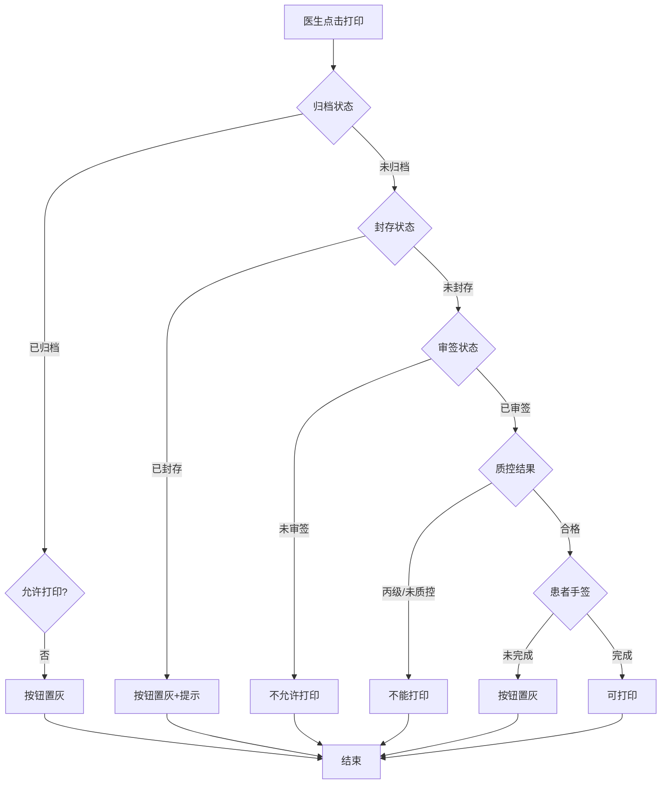
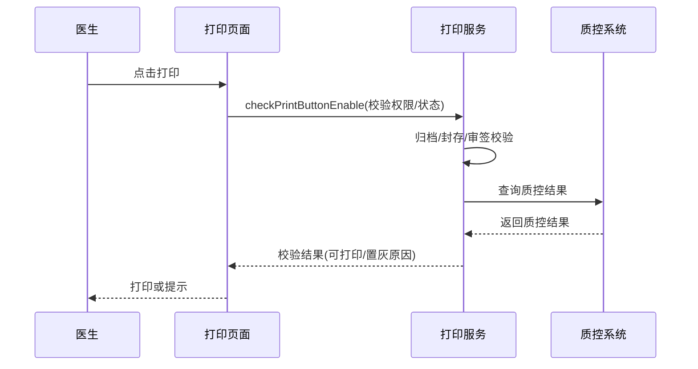

# BLGL-11-BLDY-004 打印权限与归档控制 - Spec

> **功能编号**：BLGL-11-BLDY-004
> **文档类型**：功能Spec（业务背景与设计）
> **文档版本**：V1.0
> **编写时间**：2026-08-14
> **编写人**：RACC

---

## 文档索引

#

### 章节索引

**本文档（功能Spec：业务背景与设计）**

| 章节号 | 章节名称 | 内容说明 |
|

----

----|

----

-----|

----

-----|
| 第1章 | 文档概述 | 文档目的、文档范围、术语定义、阅读指南、参考文档 |
| 第2章 | 功能背景与定位 | 功能背景、功能定位、目标用户、核心价值 |
| 第3章 | 业务流程设计 | 主流程/异常流程/边界流程（Given/When/Then） |
| 第4章 | 数据模型设计 | 核心数据结构、状态定义、系统参数定义 |
| 第5章 | 接口契约设计 | API列表、接口详细设计、错误码定义 |
| 第6章 | 技术方案设计 | 页面路径、技术栈、关键技术点、部署方案 |
| 第7章 | 测试用例预设计 | 功能/边界/异常/性能测试用例 |
| 第8章 | 非功能性要求 | 性能、安全、可用性、兼容性 |
| 第9章 | 依赖与风险 | 外部依赖、风险项 |
| 第10章 | 附录 | 流程图、时序图、参考文档 |

**PM-Spec（需求规格）**：目标/约束/验收标准/排除范围/关键决策/优先级
**Analyst-Spec（分析规格）**：功能编号体系/核心业务流程/功能规格/排除范围/业务规则/关联文档/待确认问题

#

### 版本历史

| 版本 | 日期 | 变更说明 | 编写人 |
|

------|

------|

----

-----|

----

----|
| V1.0 | 2026-08-14 | 初始版本 | RACC |

#

### 关联文档索引

| 序号 | 文档名称 | 文档类型 | 版本 | 位置 |
|

------|

----

-----|

----

-----|

------|

------|
| 1 | BLGL-11-BLDY-004_打印权限与归档控制_Spec.md | 功能Spec（业务背景与设计）（本文档） | V1.0 | 本目录 |
| 2 | BLGL-11-BLDY-004_打印权限与归档控制_PM-spec.md | PM-Spec（需求规格） | V0.1 | 本目录 |
| 3 | BLGL-11-BLDY-004_打印权限与归档控制_Analyst-spec.md | Analyst-Spec（分析规格） | V1.0 | 本目录 |
| 4 | BLGL-11-BLDY 11病历打印功能点Spec.md | 功能点Spec（模块级） | V2.0 | 上级目录 |

---

## 1、文档概述

#

## 1.1、文档目的

本文档旨在明确"打印权限与归档控制"功能（BLGL-11-BLDY-004）的业务背景与设计方案，为需求分析、研发实现、测试验收及评审提供统一的业务上下文、设计口径与决策依据。

#

## 1.2、文档范围

#

#

## 1.2.1 纳入范围

本文档覆盖打印权限与归档控制的完整业务背景与设计，包括：

- 归档病历是否允许打印控制
- 封存病历不允许打印
- 审签通过后打印（COMMON362）
- 患者手签后打印
- 质控结果限制打印（丙级/未质控）
- 打印记录查看（质控系统）
- 用户打印权限控制逻辑

#

#

## 1.2.2 排除范围

本文档不涉及以下内容（详见其他功能点或模块）：

- 病历集中打印—— BLGL-11-BLDY-001
- 单份与单病程打印—— BLGL-11-BLDY-002
- 打印模式与格式控制—— BLGL-11-BLDY-003
- 打印实现与性能优化—— BLGL-11-BLDY-005
- 打印记录查看实现 —— Phase 1 功能点Spec 第6章基础能力（BC-BLDY-002）

#

## 1.3、术语定义

| 术语 | 定义 |
|

------|

------|
| 归档打印控制 | 已归档状态的病历是否允许打印|
| 封存打印控制 | 已封存的病历允许打印的角色|
| 审签后打印 | 审签通过才允许打印的病历监控类型|
| 质控打印限制 | 环节质控丙级/未质控/整改未答复不能打印|

> ⏳ 待确认：规范术语表待产品文档确认。

#

## 1.4、阅读指南


- **章节关系**：第1~2章为业务全貌，第3~10章为设计实现层。与 Analyst-Spec、PM-Spec 互相引用保持一致。

- **读者对象**：产品经理/需求分析师读第1~2章；研发读第3~6、9~10章；测试读第3、7~8章；评审人员核对各层一致性。

#

## 1.5、参考文档

| 序号 | 文档名称 | 版本/日期 |
|

------|

----

-----|

----

------|
| 1 | 【历史需求】住院病历的历史需求.xlsx | - |
| 2 | BLGL-11-BLDY-004_打印权限与归档控制_PM-spec.md | V0.1 |
| 3 | BLGL-11-BLDY-004_打印权限与归档控制_Analyst-spec.md | V1.0 |
| 4 | BLGL-11-BLDY 11病历打印功能点Spec.md | V2.0 |

---

## 2、功能背景与定位

#

## 2.1 功能背景

打印权限与归档控制是病历打印的合规管控，需满足：


- **管理要求**：归档/封存/审签/手签/质控等多维打印控制
- **现状痛点**：
  - 归档病历打印无控制，已归档患者仍可集中打印- 封存病历医生站可打印- 质控丙级/未质控病历可打印- 质控系统无法查看打印记录
- **历史需求演进**：从归档打印控制→ 封存打印→ 审签后打印→ 患者手签→ 质控限制→ 打印记录

#

## 2.2 功能定位

"打印权限与归档控制"是 WiNEX 病历管理-病历打印模块的合规管控，定位为：


- **权限管控**：归档/封存/审签/手签/质控多维度打印控制

- **合规输出**：防止不合规病历打印

- **记录追溯**：打印记录查看

#

## 2.3 目标用户

| 用户角色 | 主要使用场景 |
|

----

-----|

----

----

-----|
| 病案管理员 | 归档/封存打印控制配置 |
| 医务部 | 质控打印限制 |
| 质控办 | 打印记录查看 |

#

## 2.4 核心价值

| 价值维度 | 价值描述 |
|

----

-----|

----

-----|
| 打印合规 | 归档/封存/审签/手签控制|
| 质控限制 | 丙级/未质控阻止打印|
| 记录追溯 | 打印记录查看|

---

## 3、业务流程设计（Given/When/Then）

#

## 3.1 主流程

**Scenario 1: 归档病历打印控制**

```gherkin
Given:
  - 参数"已归档状态的病历是否允许打印"已配置

When:
  - 医生尝试打印已归档病历

Then:
  - 参数=是：有剩余打印次数可打印
  - 参数=否：已归档病历都不能打印，打印按钮置灰
```

#

## 3.2 异常流程

**Scenario 2: 业务异常——封存病历打印**

```gherkin
Given:
  - 患者病历状态已封存
  - 参数"已封存的病历允许打印的角色"=否

When:
  - 医生点击打印/集中打印

Then:
  - 打印按钮、集中打印按钮置灰
  - 鼠标移入显示"病历已封存，不允许打印"
```

**Scenario 3: 数据异常——审签后打印**

```gherkin
Given:
  - 参数 COMMON362 审签通过才允许打印的病历监控类型

When:
  - 病历未审签通过

Then:
  - 不允许打印
  - ⏳ 待确认：未审签打印提示
```

**Scenario 4: 系统异常——质控限制**

```gherkin
Given:
  - 环节质控结果为丙级/未质控

When:
  - 打印病案首页

Then:
  - 不能打印（原问题）
  - 患者未质控/丙级/整改未答复均不能打印
```

#

## 3.3 边界流程

**Scenario 5: 边界场景——患者手签后打印**

```gherkin
Given:
  - 参数"未完成患者签名的病历是否允许打印"=不允许
  - 病历存在触发患者签名的数据元

When:
  - 医生打印

Then:
  - 患者签名未完成时打印按钮置灰
  - 鼠标移入显示不能打印原因
  - 集中打印也校验并显示原因
```

**Scenario 6: 边界场景——打印记录查看**

```gherkin
Given:
  - 病历质控系统病历属性界面

When:
  - 病案室查看打印记录

Then:
  - 新增"打印历史"tab页签
  - 展示病历打印记录列表
```

---

## 4、数据模型设计

> 数据模型信息来自代码扫描（`E:\39EMR\sr-next`）和历史需求。标注 `` 的来自 PO 实体，标注 `` 的来自需求文本。

#

## 4.1 核心数据结构

#

#

## 4.1.1 核心表/实体

| 表/实体 | 关键字段 | 说明 |
|

----

-----|

----

-----|

------|
| INPATIENT_EMR_PRINT_LOG（InpatientEmrPrintLogPO） | 打印日志 | 打印记录查看|
| 病历簿表 | 归档/封存/审签状态 | 打印控制判断|

> ⏳ 待确认：完整数据表清单待代码扫描或功能清单数据表清单补充。

#

## 4.2 状态定义

| 状态码 | 状态名称 | 说明 |
|

----

----|

----

-----|

------|
| 已归档 | 病历状态 | 按参数控制打印|
| 已封存 | 病历状态 | 不允许打印|
| 已审签 | 病历状态 | 审签后可打印|

#

## 4.3 系统参数定义

| 参数编码 | 参数名称 | 说明 |
|

----

-----|

----

-----|

------|
| 已归档状态的病历是否允许打印 | 归档打印 | 默认是|
| 已封存的病历允许打印的角色 | 封存打印角色 | 默认无|
| COMMON362 | 审签通过才允许打印的病历监控类型 | 审签控制|
| 未完成患者签名的病历是否允许打印 | 手签打印 | 默认允许|
| 已归档后才允许打印的病历监控类型 | 归档后打印 | 默认无|

---

## 5、接口契约设计

> 接口信息来自代码扫描（`E:\39EMR\sr-next`）的 InpEmrPrintController。标注 ``。

#

## 5.1 API列表

| 序号 | API名称（代码函数） | 路径 | 方法 | 说明 |
|:

----:|

----

-----|

------|:

----:|

------|
| 1 | queryInterceptPrint | /api/v1/app_record_inpatient/emr_set/intercept/print/query/by_example | POST | 拦截打印页面查询|
| 2 | checkPrintButtonEnable | /api/v1/app_record_inpatient/emr_inpatient/print_button_enable/check | POST | 打印按钮校验（权限/状态）|
| 3 | addPrintLog / batchAddPrintLog | /api/v1/app_record_inpatient/emr_inpatient/print_log/add、/batch/add | POST | 打印日志新增/批量新增|

> 前端实际请求前缀：`/inpatient-clinicalnote/api/v1/app_record_inpatient/`。

#

## 5.2 接口详细设计

#

#

## 5.2.1 打印按钮校验（checkPrintButtonEnable）

**请求参数**:
```json
{
  "inpEmrSetId": 5001,
  "printChannel": "doctorStation",
  "status": "sealed"
}
```

**返回值（成功）**:
```json
{
  "success": true,
  "data": {
    "enable": false,
    "reason": "病历已封存，不允许打印"
  }
}
```

**返回值（失败）**:
```json
{
  "success": false,
  "message": "校验失败",
  "data": null
}
```

> ⏳ 待确认：具体字段名/结构以接口契约文档为准。

#

## 5.3 错误码定义

| 错误码 | 错误信息 | 处理方式 |
|

----

----|

----

-----|

----

-----|
| ⏳ 待确认 | 病历已封存，不允许打印 | 按钮置灰|
| ⏳ 待确认 | 病历未归档，不允许打印 | 按钮置灰|

> ⏳ 待确认：业务错误码定义未在代码扫描中提取完整。

---

## 6、技术方案设计

#

## 6.1 页面路径


- **页面路径**: 住院医生站→病历打印；病历质控系统→病历属性（打印历史tab）

- **后端接口**: InpEmrPrintController（tags: 病历打印）

#

## 6.2 技术栈

| 类别 | 技术 | 版本 |
|

------|

------|

------|
| 前端框架 | Vue | 2.6.14 |
| 前端UI | element-ui | 2.13.0 |
| 后端框架 | Spring Boot（Java） | java.version 17 |
| 构建工具 | webpack / Maven | 前端 webpack + 后端 Maven |

#

## 6.3 关键技术点

- 归档打印：参数控制已归档病历是否可打印- 封存打印：参数角色控制，按钮置灰提示- 审签打印：COMMON362 监控类型审签后打印- 手签打印：患者签名未完成置灰- 质控限制：丙级/未质控/整改未答复阻止打印- 打印记录：质控系统打印历史tab

#

## 6.4 部署方案

⏳ 待确认：部署方案未在资料区中找到。

---

## 7、测试用例预设计

#

## 7.1 功能测试

| 用例编号 | 测试场景 | Given | When | Then |
|

----

-----|

----

-----|

----

---|

------|

------|
| TC-001 | 归档打印控制 | 参数=否 | 打印已归档病历 | 按钮置灰|
| TC-002 | 封存打印控制 | 病历已封存 | 打印 | 按钮置灰提示|

#

## 7.2 边界测试

| 用例编号 | 测试场景 | Given | When | Then |
|

----

-----|

----

-----|

----

---|

------|

------|
| TC-003 | 审签后打印 | COMMON362配置 | 未审签打印 | 不允许|
| TC-004 | 患者手签 | 参数=不允许 | 未手签打印 | 按钮置灰|

#

## 7.3 异常测试

| 用例编号 | 测试场景 | Given | When | Then |
|

----

-----|

----

-----|

----

---|

------|

------|
| TC-005 | 质控限制 | 丙级/未质控 | 打印首页 | 不能打印|
| TC-006 | 打印记录 | 质控系统 | 查看打印历史 | 展示打印记录|

#

## 7.4 性能测试

| 用例编号 | 测试场景 | 指标 |
|

----

-----|

----

-----|

------|
| TC-007 | 打印校验响应 | ⏳ 待确认：性能指标未在资料区中找到 |

---

## 8、非功能性要求

#

## 8.1 性能要求

| 指标 | 要求 |
|

------|

------|
| 打印校验响应 | ⏳ 待确认 |

#

## 8.2 安全要求

| 要求 | 说明 |
|

------|

------|
| 打印权限 | 多系统入口打印权限|

**医疗行业特殊要求**

| 要求 | 说明 |
|

------|

------|
| 打印合规 | 归档/封存/审签/手签/质控多维度控制|

#

## 8.3 可用性要求

| 指标 | 要求值 |
|

------|

----

----|
| 可用性 | ⏳ 待确认 |

#

## 8.4 兼容性要求

| 类型 | 要求 |
|

------|

------|
| 多系统兼容 | 除住院医生站外其他系统入口打印控制|

---

## 9、依赖与风险

#

## 9.1 外部依赖

| 依赖项 | 说明 |
|

----

----|

------|
| 病案系统 | 审核状态|
| 质控系统 | 质控结果|

#

## 9.2 风险项

| 风险项 | 等级 | 说明 | 应对方案 |
|

----

----|

------|

------|

----

-----|
| 打印失控 | 中 | 归档/封存病历可打印| 多维参数控制 |
| 质控限制复杂 | 中 | 丙级/未质控/整改多条件| 明确规则 |

---

## 10、附录

#

## 10.1 流程图



#

## 10.2 时序图



#

## 10.3 参考文档

- 【历史需求】住院病历的历史需求.xlsx- BLGL-11-BLDY 11病历打印功能点Spec.md（V2.0，第5章 -004 行）
- 关联Spec: BLGL-11-BLDY-001（集中打印）、-003（格式控制）

---

## 填写检查清单

| 序号 | 检查项 | 是否完成 |
|:

----:|

----

----|:

----

----:|
| 1 | 章节索引与正文章节一致 | ✅ |
| 2 | 版本历史记录完整 | ✅ |
| 3 | 关联文档索引已登记全部Spec | ✅ |
| 4 | 文档目的明确回答"为什么做/做成什么/怎么做" | ✅ |
| 5 | 纳入范围/排除范围清晰 | ✅ |
| 6 | 术语定义覆盖关键概念，从资料区可溯源 | ✅ |
| 7 | 参考文档已登记 | ✅ |
| 8 | 功能背景基于法规/规范/需求来源组织 | ✅ |
| 9 | 功能定位体现业务价值（3~5个定位点） | ✅ |
| 10 | 目标用户角色覆盖完整，在需求原文中有出处 | ✅ |
| 11 | 核心价值可陈述，与 Phase 1 口径一致 | ✅ |
| 12 | 业务流程：主流程≥1、异常≥3、边界≥2，Given/When/Then 具体 | ✅ |
| 13 | 数据模型：字段/表/状态/参数可溯源 | ✅ |
| 14 | 接口契约：API列表+详细设计+错误码齐全或标记待确认 | ✅ |
| 15 | 技术方案：页面路径/技术栈/关键点/部署方案或标记待确认 | ✅ |
| 16 | 测试用例：功能/边界/异常/性能覆盖 | ✅ |
| 17 | 非功能性要求：性能/安全/可用性/兼容性指标可量化或标记待确认 | ✅ |
| 18 | 依赖与风险：外部依赖登记完整 | ✅ |
| 19 | 附录：流程图/时序图与正文流程一致 | ✅ |
| 20 | 全文无占位符 `< >` 残留 | ✅ |
| 21 | 全文陈述可溯源至资料区 | ✅ |
| 22 | 人工审核确认完成 | ⏳ 待确认 |

---

**文档状态**：⬜ 待审核
**维护责任**：RACC
**下次更新**：根据评审反馈优化
