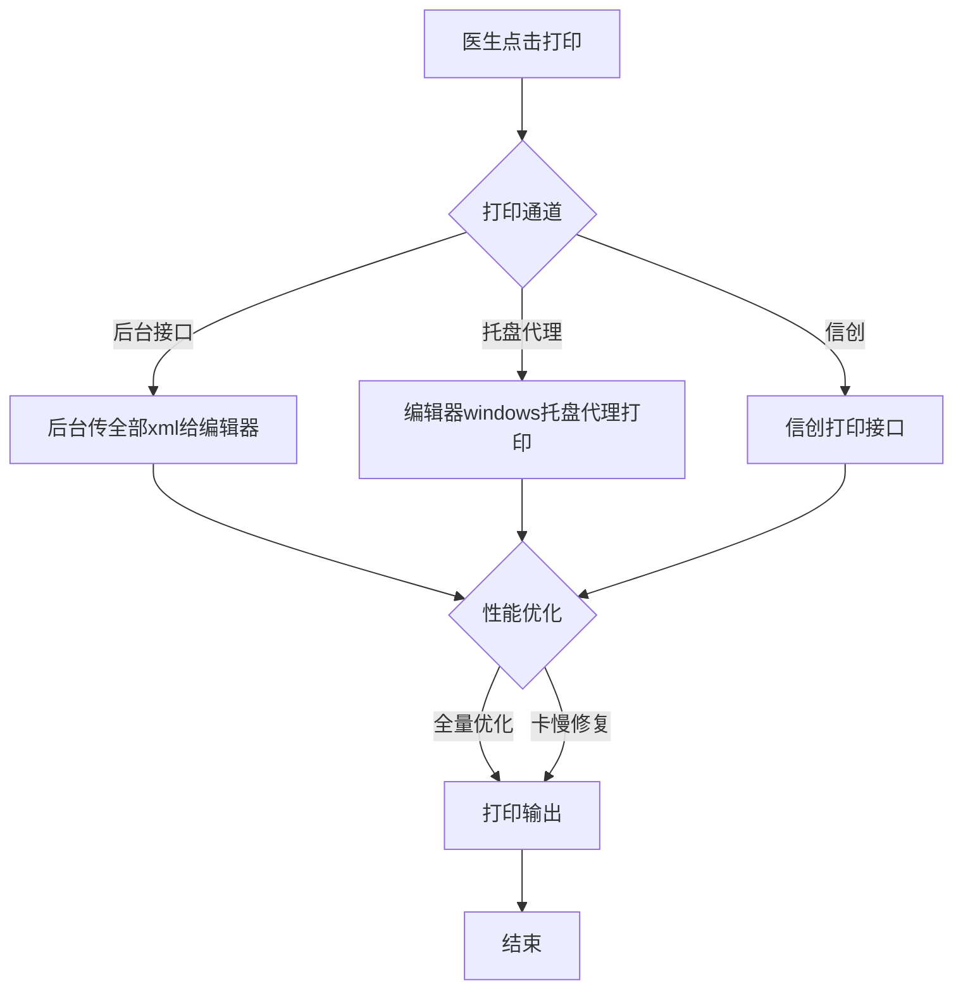
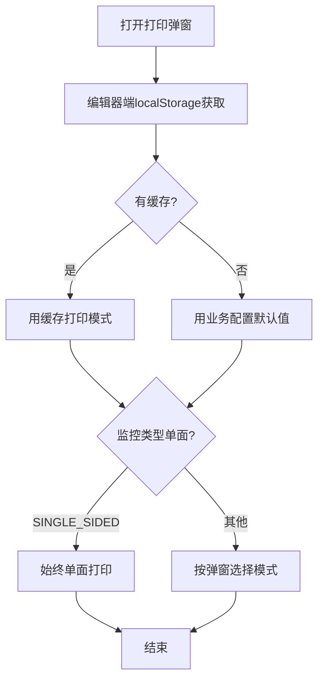

# BLGL-11-BLDY-005打印实现与性能优化_ Analyst - Spec

> **需求编号**：BLGL-11-BLDY-005
> **父需求**：BLGL-11-BLDY
> **关联PM Spec**：BLGL-11-BLDY-005_打印实现与性能优化_PM-spec.md
> **Spec版本**：V1.0
> **编写时间**：2026-08-14
> **编写人**：需求分析师

---

## 一、功能编号体系

#

## 1.1 功能层级结构

```
BLGL-11-BLDY-005: 打印实现与性能优化
  ├─ BLGL-11-BLDY-005-01: 后台接口打印
  │   ├─ -01-01: 后台传全部xml
  │   └─ -01-02: 编辑器对接打印
  ├─ BLGL-11-BLDY-005-02: 打印性能优化
  │   ├─ -02-01: 全量打印优化
  │   └─ -02-02: 卡慢修复
  ├─ BLGL-11-BLDY-005-03: 托盘代理打印
  │   ├─ -03-01: 托盘代理
  │   └─ -03-02: 启动自动启动托盘exe
  ├─ BLGL-11-BLDY-005-04: 信创打印
  │   └─ -04-01: 信创国产化改造
  └─ BLGL-11-BLDY-005-05: 打印异常处理
      └─ -05-01: 打印报错修复
```

#

## 1.2 功能编号表

| REQ-ID | 功能名称 | 类型 | 优先级 | 说明 |
|

----

----|

----

-----|

------|

----

----|

------|
| BLGL-11-BLDY-005-01 | 后台接口打印 | 功能 | P0 | 后台传xml |
| BLGL-11-BLDY-005-01-01 | 后台传全部xml | 子功能 | P0 | 前端加载不全优化 |
| BLGL-11-BLDY-005-01-02 | 编辑器对接 | 子功能 | P0 | 打印服务接口 |
| BLGL-11-BLDY-005-02 | 打印性能优化 | 功能 | P0 | 全量/卡慢 |
| BLGL-11-BLDY-005-02-01 | 全量打印优化 | 子功能 | P0 | 病程多时 |
| BLGL-11-BLDY-005-02-02 | 卡慢修复 | 子功能 | P1 | 性能 |
| BLGL-11-BLDY-005-03 | 托盘代理打印 | 功能 | P1 | 托盘 |
| BLGL-11-BLDY-005-03-01 | 托盘代理 | 子功能 | P1 | windows托盘 |
| BLGL-11-BLDY-005-03-02 | 启动托盘exe | 子功能 | P1 | 混合框架 |
| BLGL-11-BLDY-005-04 | 信创打印 | 功能 | P1 | 信创适配 |
| BLGL-11-BLDY-005-04-01 | 信创国产化 | 子功能 | P1 | 银河麒麟 |
| BLGL-11-BLDY-005-05 | 打印异常处理 | 功能 | P1 | 异常修复 |
| BLGL-11-BLDY-005-05-01 | 打印报错修复 | 子功能 | P1 | 报错处理 |

---

## 二、核心业务流程

#

## 2.1 后台接口打印流程



#

## 2.2 打印模式选择流程



---

## 三、功能规格说明

---

### BLGL-11-BLDY-005-01: 后台接口打印

#

#

## 3.1.1 功能概述

病程打印对接编辑器改为后台接口，后台传全部病程xml给编辑器。

#

#

## 3.1.2 用户角色

| 角色 | 使用场景 | 权限要求 | 操作频率 |
|

------|

----

-----|

----

-----|

----

-----|
| 住院医生 | 打印（后台接口） | 打印权限 | 高频 |

#

#

## 3.1.3 业务流程（Given/When/Then）

#

#### 主流程

**Scenario 1: 后台接口打印**

```gherkin
Given:
  - 病程未全部加载在病历目录

When:
  - 医生点击打印

Then:
  - 病程打印对接编辑器全部改为后台接口
  - 后台把全部的病程xml传给编辑器
```

#

#### 异常流程

**Scenario 2: 系统异常——前端加载不全**

```gherkin
Given:
  - 病程未全部加载

When:
  - 前端xml加载

Then:
  - 病程xml加载不完全（原问题）
  - 改为后台接口传全部xml
```

#

#

## 3.1.4 数据字段定义

> 字段名来自代码扫描（`E:\39EMR\sr-next`，标注 ``）。

| 字段名 | 类型 | 必填 | 默认值 | 取值范围 | 说明 | 概念ID |
|

----

----|

------|

------|

----

----|

----

-----|

------|

----

----|
| xmlContent | String | 是 | - | - | 病程xml数据| ⏳ 待确认 |

#

#

## 3.1.5 验收标准

| AC编号 | 验收标准 | 对应REQ-ID | 验证方法 | 验证场景 |
|

----

----|

----

-----|

----

----

---|

----

-----|

----

-----|
| AC-001 | 病程打印后台接口传全部xml给编辑器 | -005-01 | 集成测试 | Scenario 1 |

---

### BLGL-11-BLDY-005-02: 打印性能优化

#

#

## 3.2.1 功能概述

病程较多时全量打印优化，卡慢修复。

#

#

## 3.2.2 用户角色

| 角色 | 使用场景 | 权限要求 | 操作频率 |
|

------|

----

-----|

----

-----|

----

-----|
| 住院医生 | 打印（性能） | 打印权限 | 高频 |

#

#

## 3.2.3 业务流程（Given/When/Then）

#

#### 主流程

**Scenario 1: 全量打印优化**

```gherkin
Given:
  - 病程记录较多

When:
  - 医生打印

Then:
  - 全量打印优化
  - 不卡慢
```

#

#### 异常流程

**Scenario 2: 数据异常——机器无响应**

```gherkin
Given:
  - 个别电脑框架

When:
  - 点打印

Then:
  - 没反应（WMI服务问题）
  - ⏳ 待确认：打印任务导致无响应修复```

#

#

## 3.2.4 数据字段定义

| 字段名 | 类型 | 必填 | 默认值 | 取值范围 | 说明 | 概念ID |
|

----

----|

------|

------|

----

----|

----

-----|

------|

----

----|
| 全量打印 | Boolean | 否 | - | 是/否 | 全量优化| ⏳ 待确认 |

#

#

## 3.2.5 验收标准

| AC编号 | 验收标准 | 对应REQ-ID | 验证方法 | 验证场景 |
|

----

----|

----

-----|

----

----

---|

----

-----|

----

-----|
| AC-002 | 病程较多时全量打印优化不卡慢 | -005-02 | 性能测试 | Scenario 1 |

---

### BLGL-11-BLDY-005-03: 托盘代理打印

#

#

## 3.3.1 功能概述

编辑器windows托盘代理打印，启动混合框架自动启动托盘exe。

#

#

## 3.3.2 用户角色

| 角色 | 使用场景 | 权限要求 | 操作频率 |
|

------|

----

-----|

----

-----|

----

-----|
| 住院医生 | 托盘代理打印 | 打印权限 | 中频 |

#

#

## 3.3.3 业务流程（Given/When/Then）

#

#### 主流程

**Scenario 1: 托盘代理打印**

```gherkin
Given:
  - 病历签署后
  - 参数设置为浏览器模式

When:
  - 医生点击打印

Then:
  - 调编辑器新版的打印服务接口
  - 实现病历打印模板
```

#

#### 边界流程

**Scenario 2: 边界场景——启动托盘exe**

```gherkin
Given:
  - 启动混合框架

When:
  - 框架启动

Then:
  - 自动启动病历打印的托盘exe
```

#

#

## 3.3.4 数据字段定义

| 字段名 | 类型 | 必填 | 默认值 | 取值范围 | 说明 | 概念ID |
|

----

----|

------|

------|

----

----|

----

-----|

------|

----

----|
| 托盘exe | - | 否 | - | - | 托盘代理| ⏳ 待确认 |

#

#

## 3.3.5 验收标准

| AC编号 | 验收标准 | 对应REQ-ID | 验证方法 | 验证场景 |
|

----

----|

----

-----|

----

----

---|

----

-----|

----

-----|
| AC-003 | 托盘代理打印调编辑器打印服务 | -005-03 | 集成测试 | Scenario 1 |
| AC-004 | 启动混合框架自动启动托盘exe | -005-03 | 集成测试 | Scenario 2 |

---

### BLGL-11-BLDY-005-04: 信创打印

#

#

## 3.4.1 功能概述

信创国产化打印改造，信创环境调用信创打印接口。

#

#

## 3.4.2 用户角色

| 角色 | 使用场景 | 权限要求 | 操作频率 |
|

------|

----

-----|

----

-----|

----

-----|
| 住院医生 | 信创环境打印 | 打印权限 | 中频 |

#

#

## 3.4.3 业务流程（Given/When/Then）

#

#### 主流程

**Scenario 1: 信创打印**

```gherkin
Given:
  - 全60信创银河麒麟电脑系统

When:
  - 混合框架调用打印

Then:
  - 调用信创的打印接口
  - 前端对接病历打印，含病历打印、病程续打
```

#

#### 异常流程

**Scenario 2: 系统异常——信创打印**

```gherkin
Given:
  - 信创环境

When:
  - 混合框架调用打印

Then:
  - 应调用信创的打印接口
  - ⏳ 待确认：信创打印异常处理
```

#

#

## 3.4.4 数据字段定义

| 字段名 | 类型 | 必填 | 默认值 | 取值范围 | 说明 | 概念ID |
|

----

----|

------|

------|

----

----|

----

-----|

------|

----

----|
| 信创打印接口 | - | 否 | - | - | 信创适配| ⏳ 待确认 |

#

#

## 3.4.5 验收标准

| AC编号 | 验收标准 | 对应REQ-ID | 验证方法 | 验证场景 |
|

----

----|

----

-----|

----

----

---|

----

-----|

----

-----|
| AC-005 | 信创环境调用信创打印接口 | -005-04 | 集成测试 | Scenario 1 |

---

### BLGL-11-BLDY-005-05: 打印异常处理

#

#

## 3.5.1 功能概述

打印异常处理，打印报错修复。

#

#

## 3.5.2 用户角色

| 角色 | 使用场景 | 权限要求 | 操作频率 |
|

------|

----

-----|

----

-----|

----

-----|
| 住院医生 | 打印异常处理 | 打印权限 | 低频 |

#

#

## 3.5.3 业务流程（Given/When/Then）

#

#### 主流程

**Scenario 1: 打印报错**

```gherkin
Given:
  - 医生点击打印

When:
  - 打印程序报错

Then:
  - 提示"打印程序报错请联系管理员"
  - ⏳ 待确认：报错根因与修复
```

#

#### 边界流程

**Scenario 2: 边界场景——医保就诊id**

```gherkin
Given:
  - 病历提交生成pdf

When:
  - 生成pdf

Then:
  - 添加医保返回的就诊id字段
```

#

#

## 3.5.4 数据字段定义

| 字段名 | 类型 | 必填 | 默认值 | 取值范围 | 说明 | 概念ID |
|

----

----|

------|

------|

----

----|

----

-----|

------|

----

----|
| 医保就诊id | String | 否 | - | - | PDF医保字段| ⏳ 待确认 |

#

#

## 3.5.5 验收标准

| AC编号 | 验收标准 | 对应REQ-ID | 验证方法 | 验证场景 |
|

----

----|

----

-----|

----

----

---|

----

-----|

----

-----|
| AC-006 | 打印报错提示"打印程序报错请联系管理员" | -005-05 | 功能测试 | Scenario 1 |

---

## 四、排除范围

本需求不包含以下功能项：

1. **病历集中打印** - 属 BLGL-11-BLDY-001
2. **单份与单病程打印** - 属 BLGL-11-BLDY-002
3. **打印模式与格式控制** - 属 BLGL-11-BLDY-003
4. **打印权限与归档控制** - 属 BLGL-11-BLDY-004
5. **托盘打印兼容（win7/SVG）** - 属基础能力 BC-BLDY-004

> 与 PM-Spec 第四章一致。对照 Phase 1 功能点Spec 第6章（基线能力），确保不越界。

---

## 五、业务规则清单

| 规则ID | 规则名称 | 规则描述 | 优先级 |
|

----

----|

----

-----|

----

-----|

------|

----

----|
| BR-001 | 后台接口 | 病程打印对接编辑器改为后台接口传全部xml | P0 |
| BR-002 | 全量优化 | 病程较多时全量打印优化 | P0 |
| BR-003 | 托盘代理 | 编辑器windows托盘代理打印 | P1 |
| BR-004 | 启动托盘 | 启动混合框架自动启动托盘exe | P1 |
| BR-005 | 信创打印 | 信创国产化打印改造 | P1 |
| BR-006 | 打印模式 | 编辑器localStorage优先，SINGLE_SIDED始终单面 | P1 |
| BR-007 | 医保字段 | 提交生成的pdf添加医保就诊id | P1 |

---

## 六、关联文档

| 文档类型 | 文档路径 | 说明 |
|

----

-----|

----

-----|

------|
| 功能点Spec | BLGL-11-BLDY 11病历打印功能点Spec.md（V2.0，上级目录） | Phase 1 功能点索引 |
| PM spec | 本目录 BLGL-11-BLDY-005_打印实现与性能优化_PM-spec.md（V0.1） | PM 产出的 Spec 文档 |
| -Spec | 本目录 BLGL-11-BLDY-005_打印实现与性能优化_Spec.md（V1.0） | 业务背景与目标 Spec |
| data-model.md | 待产出 | 架构师产出的数据建模文档 |
| design.md | 待产出 | 架构师产出的技术方案文档 |
| api-contract.md | 待产出 | 开发经理产出的 API 契约文档 |

---

## 七、待确认问题清单

| 编号 | 问题描述 | 缺失信息 | 影响范围 | 建议补充方 |
|

------|

----

-----|

----

-----|

----

-----|

----

----

---|
| Q-001 | 机器无响应根因 | WMI服务问题修复 | 3.2.3 Scenario 2 | 开发经理 |
| Q-002 | 信创打印异常 | 信创打印失败处理 | 3.4.3 Scenario 2 | 开发经理 |
| Q-003 | 打印报错根因 | 打印程序报错原因 | 3.5.3 Scenario 1 | 开发经理 |
| Q-004 | 完整接口契约 | 打印接口字段 | 第5章接口设计 | 开发经理 |
| Q-005 | 概念ID、性能指标 | 字段概念ID、打印SLA | 数据模型、非功能 | 架构师/产品经理 |

---

## 填写检查清单

| 序号 | 检查项 | 是否完成 |
|:

----:|

----

----|:

----

----:|
| 1 | 功能编号带父子层级 | ✅ |
| 2 | 每个 REQ-ID 有功能概述和用户角色 | ✅ |
| 3 | 主流程至少 1 个 Given/When/Then 场景 | ✅ |
| 4 | 异常流程至少 3 个 Given/When/Then 场景 | ✅ |
| 5 | 边界流程至少 2 个 Given/When/Then 场景 | ✅ |
| 6 | 每个 Given/When/Then 内容具体，不模糊 | ✅ |
| 7 | 数据字段定义完整 | ✅ |
| 8 | 验收标准 AC 编号独立，可验证 | ✅ |
| 9 | 验收标准无"功能正常"等模糊表述 | ✅ |
| 10 | 排除范围明确列出 | ✅ |
| 11 | 业务规则清单列出所有规则，每条标注来源 | ✅ |
| 12 | 流程图使用 Mermaid 格式（≥2 个） | ✅ |
| 13 | 关联文档索引包含 Phase 1 功能点Spec | ✅ |
| 14 | 待确认问题清单汇总了全文所有 ⏳ 项 | ✅ |
| 15 | 全文无占位符 `< >` 残留 | ✅ |
| 16 | 全文陈述可溯源至资料区（S1~S10 溯源核查） | ✅ |
| 17 | 人工审核确认完成 | ⏳ 待确认 |

---

**文档状态**：⬜ 待审核
**维护责任**：需求分析师规范组
**下次更新**：根据评审反馈优化

---

## 版本历史

| 版本 | 日期 | 变更说明 | 编写人 |
|

------|

------|

----

-----|

----

----|
| V1.0 | 2026-08-14 | 初始版本 | 需求分析师 |
