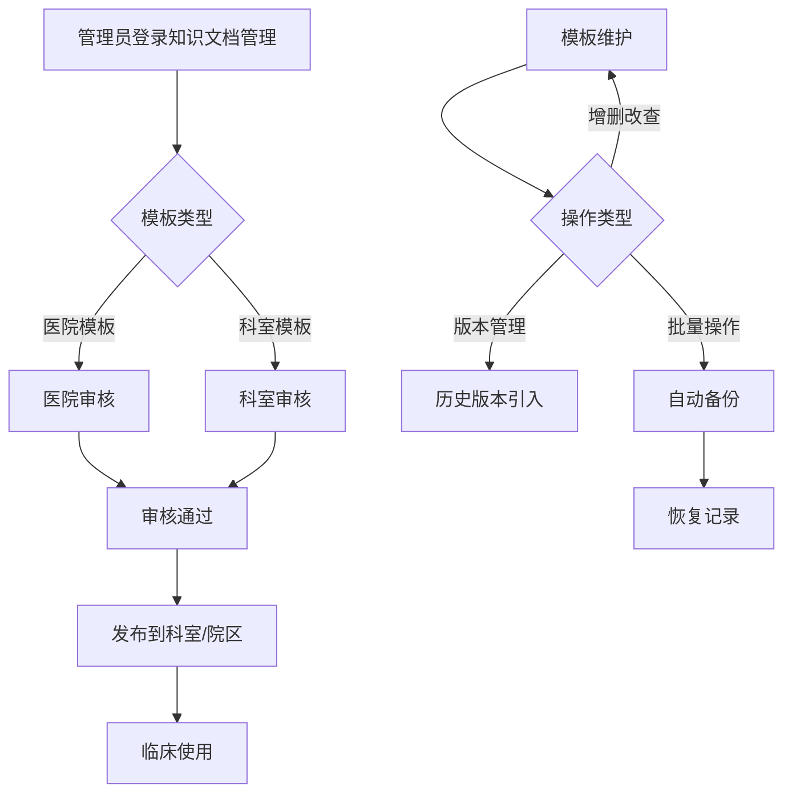
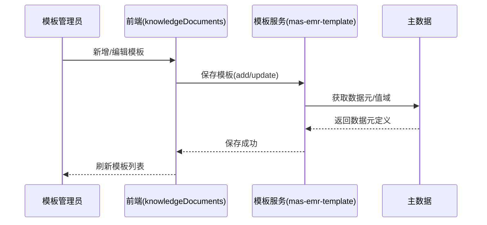

# BLGL-12-MBGL-001 知识文档管理-Spec

> **功能编号**：BLGL-12-MBGL-001
> **文档类型**：功能Spec（业务背景与设计）
> **文档版本**：V1.0
> **编写时间**：2026-08-13
> **编写人**：RACC

---

## 文档索引

本节提供本文档的章节结构索引与关联文档索引，便于读者快速定位与检索。

#### 章节索引

**Spec（研发视角）**

| 章节号 | 章节名称 |
|--------|---------|
| 1、 | 文档概述 |
| 2、 | 功能背景与定位 |
| 3、 | 业务流程设计 |
| 4、 | 数据模型设计 |
| 5、 | 接口契约设计 |
| 6、 | 技术方案设计 |
| 7、 | 测试用例预设计 |
| 8、 | 非功能性要求 |
| 9、 | 依赖与风险 |
| 10、 | 附录 |

**PM-Spec（需求规格）**

| 章节号 | 章节名称 |
|--------|---------|
| 一 | 目标 |
| 二 | 约束 |
| 三 | 验收标准 |
| 四 | 排除范围 |
| 五 | 关键决策记录 |
| 六 | 优先级 |
| 附录 | 填写检查清单 |

**Analyst-Spec（分析规格）**

| 章节号 | 章节名称 |
|--------|---------|
| 一 | 功能编号体系 |
| 二 | 核心业务流程 |
| 三 | 功能规格说明 |
| 四 | 排除范围 |
| 五 | 业务规则清单 |
| 六 | 关联文档 |
| 七 | 待确认问题清单 |
| - | 填写检查清单 | 检查项与完成状态 |

#### 版本历史

| 版本 | 日期 | 变更说明 | 编写人 |
|------|------|---------|--------|
| V1.0 | 2026-08-13 | 初始版本 | RACC |

#### 关联文档索引

| 序号 | 文档名称 | 文档类型 | 版本 | 位置 |
|------|---------|---------|------|------|
| 1 | BLGL-12-MBGL-001_知识文档管理-Spec.md | 功能Spec（业务背景与设计）（本文档） | V1.0 | 本目录 |
| 2 | BLGL-12-MBGL-001_知识文档管理_PM-spec.md | PM-Spec（需求规格） | V0.1 | 本目录 |
| 3 | BLGL-12-MBGL-001_知识文档管理_Analyst-spec.md | Analyst-Spec（分析规格） | V1.0 | 本目录 |
| 4 | BLGL-12-MBGL 12模板管理功能点Spec.md | 功能点Spec（模块级） | v1.0 | 上级目录 |

---

## 1、文档概述

### 1.1、文档目的

本文档旨在明确"知识文档管理"功能（BLGL-12-MBGL-001）的业务背景与设计方案，为需求分析、研发实现、测试验收及评审提供统一的业务上下文、设计口径与决策依据。

**具体目的包括**：

1. 梳理知识文档管理功能的业务由来与历史需求演进脉络，说明"为什么要做"
2. 明确功能的定位边界、目标用户与核心价值，回答"做成什么"
3. 描述功能的业务流程、数据模型、接口契约与技术方案，回答"怎么做"
4. 预设计测试用例并明确非功能性要求、依赖与风险，为研发与验收提供依据
5. 作为 SPEC（功能编号体系、功能详情、业务规则、验收标准等章节）的业务前提与设计输入，保证各层文档业务口径一致。

### 1.2、文档范围

#### 1.2.1 纳入范围

本文档覆盖知识文档管理的完整业务背景与设计，包括：

- 医院模板、科室模板的查询、新增、编辑、删除、启用/禁用
- 模板复制、导入导出、批量修改属性、查看详情
- 模板版本管理、模板图片管理
- 模板目录树管理、XML 批量操作记录与恢复。

#### 1.2.2 排除范围

本文档不涉及以下内容（详见其他功能点或模块）：

- 知识文档审核（待审核/审核通过/不通过/审核记录/无纸化设置）——归属 BLGL-12-MBGL-002 知识文档审核
- 知识文档发布（发布到科室/院区/取消发布）——归属 BLGL-12-MBGL-003 知识文档发布
- 个人模板管理、个人模板审核、成套模板管理——分别归属 BLGL-12-MBGL-004/005/006
- 数据元管理、病历分类管理、临床文档管理、临床段落管理——归属基础能力附录（BC-MBGL-001~004）。

### 1.3、术语定义

| 术语 | 定义 |
|------|------|
| 知识文档 | 医院/科室级别的病历模板，是模板治理的源头 |
| 医院模板 | 医院级别模板，业务范围类型 399017152 |
| 科室模板 | 科室级别模板，业务范围类型 399017152_dep |
| 模板目录 | 模板的目录树，支持一级/二级/三级层级 |
| 启用/禁用 | 模板启用状态：98175=启用，98176=禁用 |
| 版本管理 | 模板版本记录查询、历史版本引入、版本对比 |

### 1.4、阅读指南

- **章节关系**：第1~2章为阅读铺垫与业务全貌（背景、定位、用户、价值）；第3~10章为设计实现层（流程、数据、接口、技术、测试、非功能、依赖风险、附录），可直接用于研发与测试。与 Analyst-Spec、PM-Spec 的详细规则/验收口径互相引用，保持一致。
- **读者对象**：
 - 产品经理/需求分析师：阅读第1~2章了解业务全貌，据此维护 PM-Spec 与功能清单
 - 研发：阅读第3~6章用于开发实现，第9~10章用于依赖评估与联调
 - 测试：阅读第3章、第7~8章用于用例设计与验收
 - 评审人员：以本文档为业务口径与设计基准，核对各层文档一致性。

### 1.5、参考文档

| 序号 | 文档名称 | 版本/日期 |
|------|---------|
| 1 | 【历史需求】病历模版-0813.xlsx | 2026-08-13 |
| 2 | WiNEX-病历管理_模板管理功能清单_20260403.md | 2026-04-03 |
| 3 | BLGL-12-MBGL-001_知识文档管理_PM-spec.md | V0.1 |
| 4 | BLGL-12-MBGL-001_知识文档管理_Analyst-spec.md | V1.0 |
| 5 | BLGL-12-MBGL 12模板管理功能点Spec.md | v1.0 |

---

## 2、功能背景与定位

### 2.1 功能背景

知识文档管理是住院病历模板治理的源头，需满足：

- **管理要求**：建立医院模板、科室模板三级管理（医院模板/科室模板/个人模板），支持住院、门诊场景。
- **现状痛点**：
 - 模板失效提示文案需优化
 - 模板停用后无法预览，医生不知停用原因
 - 模板数量大于 20 个无法提交
 - 知识文档 XML 批量操作缺乏记录与恢复能力。
- **历史需求演进**：从知识文档基础维护（功能清单）→ 增加个人模板管理→ 新增病历模板目录（、1466861）→ XML 批量操作记录与恢复→ 模板停用预览。

### 2.2 功能定位

"知识文档管理"是 WiNEX 病历管理-模板管理 的模板维护能力，定位为：

- **医院/科室模板维护**：承载模板的增删改查、启停、复制、导入导出
- **模板版本与图片管理**：版本记录查询、历史版本引入、模板图片上传下载
- **模板目录管理**：模板目录树与病历目录结构管理
- **模板备份恢复**：XML 批量操作记录、单条/批量恢复、定期清理。

### 2.3 目标用户

| 用户角色 | 主要使用场景 |
|---------|-------------|
| 院级模板管理员 | 维护医院模板 |
| 科室模板管理员 | 维护科室模板 |
| 医务管理员 | 模板质量把关 |

### 2.4 核心价值

| 价值维度 | 价值描述 |
|---------|---------|
| 合规性 | 模板维护是病历书写模板的源头，保障模板质量 |
| 可追溯 | 版本管理与 XML 批量操作记录恢复，支持回退 |
| 效率提升 | 批量导入导出、批量修改属性、复制模板 |
| 数据安全 | 模板备份数据统一管理，定期清理一周前备份 |

---

## 3、业务流程设计（Given/When/Then）

### 3.1 主流程

**Scenario 1: 新增医院/科室模板**

```gherkin
Given:
 - 院级/科室模板管理员登录知识文档管理界面

When:
 - 点击新增，选择模板类型（医院模板/科室模板）、文档类型、监控类型
 - 编辑模板基本信息、模板内容、适用范围
 - 保存

Then:
 - 模板创建成功，进入知识文档列表
 - 科室模板需提交审核
```

### 3.2 异常流程

**Scenario 2: 模板失效提示（业务异常）**

```gherkin
Given:
 - 医生使用已失效模板

When:
 - 医生选择该模板新建病历

Then:
 - 提示模板失效原因，置灰确定按钮，仅允许预览
```

**Scenario 3: 模板数量超限（数据异常）**

```gherkin
Given:
 - 成套模板维护时模板数量大于 20 个

When:
 - 提交成套模板

Then:
 - 放开限制，模板数量支持到 100 条，不再拦截
```

**Scenario 4: XML 批量操作错误（系统异常）**

```gherkin
Given:
 - 对模板执行批量操作（内容处理/属性处理/样式处理）

When:
 - 批量操作执行有误或需要回退

Then:
 - 通过「恢复记录」将模板恢复至操作前版本
```

### 3.3 边界流程

**Scenario 5: 模板停用（多值/状态）**

```gherkin
Given:
 - 模板对应的院级模板已停止使用

When:
 - 新增病历文书界面选择该模板

Then:
 - 停用模板不允许新增，允许预览，置灰确定按钮
```

**Scenario 6: 恢复已恢复记录（未配置/极端值）**

```gherkin
Given:
 - 已恢复但恢复未成功/未生效的记录

When:
 - 点击「重新恢复」

Then:
 - 再次执行恢复，确认框展示上次恢复时间
```

---

## 4、数据模型设计

### 4.1 核心数据结构

#### 4.1.1 核心保存请求

⏳ 待确认：知识文档（模板）保存请求的完整字段结构未在资料区中给出，待来自 API 契约或数据建模。

#### 4.1.2 核心表/实体

| 表/实体 | 关键字段 | 说明 |
|---------|---------|------|
| 病历模板表 | 模板ID、模板名称、文档类型、监控类型、业务范围类型、启用状态 | 医院/科室模板存储 |

> ⏳ 待确认：病历模板表物理表名及字段全集未在资料区明确给出。

### 4.2 状态定义

| 状态码 | 状态名称 | 说明 |
|--------|---------|------|
| 98175 | 启用 | 模板/文档启用状态 |
| 98176 | 禁用 | 模板/文档禁用状态 |
| 152780 | 审核通过 | 模板审核通过状态 |
| 152781 | 审核不通过 | 模板审核不通过状态 |

### 4.3 系统参数定义

| 参数编码 | 参数名称 | 说明 |
|---------|---------|------|
| 业务范围类型-医院模板 | 399017152 | 医院级别模板 |
| 业务范围类型-科室模板 | 399017152_dep | 科室级别模板 |
| 另存个人模板时需清空的元素 | 参数 | 手术记录单另存模板时清空手术时间 |
| 多机构模式个人模板互通的机构 | 参数 | 个人模板多机构互通机构配置，默认空 |

---

## 5、接口契约设计

### 5.1 API列表

| 序号 | API名称（代码函数） | 路径 | 方法 | 说明 |
|:----:|---------|------|:----:|------|
| 1 | 病历模板分页列表查询 | /inpatient_emr_template/query/by_example | POST | 根据条件查询病历模板分页列表 |
| 2 | 新增住院病历模板 | /inpatient_emr_template/add | POST | 新增住院病历模板 |
| 3 | 修改住院病历模板 | /inpatient_emr_template/update/by_id | POST | 修改住院病历模板 |
| 4 | 删除病历模板 | /inpatient_emr_template/delete/by_id | POST | 删除病历模板 |
| 5 | 病历模板xml内容查询 | /emr_template/xml_content/query/by_id | POST | 病历模板xml内容查询 |
| 6 | 病历模板复制接口 | - | POST | 复制模板 |
| 7 | 导入模板 / 导出模板 / 批量导出模板 | - | POST | 模板导入导出 |
| 8 | 批量修改模板属性 | - | POST | 批量修改模板属性 |

### 5.2 接口详细设计

⏳ 待确认：接口完整请求/返回结构、错误码与示例值，待来自 API 契约文档或设计评审。

### 5.3 错误码定义

| 错误码 | 错误信息 | 处理方式 |
|--------|---------|---------|
| ⏳ 待确认 | 模板失效提示 | 置灰确定按钮，允许预览 |

> ⏳ 待确认：错误码编码值未在资料区中提供，待来自 API 契约。

---

## 6、技术方案设计

### 6.1 页面路径

- **页面路径**: winning-webui-emr-template/src/views/EmrTemplate/knowledgeDocuments.vue（知识文档管理）、knowledgeDocumentsDetails.vue（知识文档详情）
- **核心逻辑模块**: EmrTemplateController（模板维护）、EmrPersonalTemplateController（个人模板）

### 6.2 技术栈

| 类别 | 技术 | 版本 |
|------|------|------|
| 前端框架 | Vue（winning-webui-emr-template） | ⏳ 待确认 |
| 后端框架 | Java Spring Boot（winning-mds-emr-template / winning-mas-emr-template） | ⏳ 待确认 |

### 6.3 关键技术点

- 模板导入导出支持 JSON 格式，拖拽上传、批量导入
- 数据元导入导出支持 Excel 格式
- XML 批量操作前自动备份，恢复时覆盖式恢复，全程留痕。

### 6.4 部署方案

⏳ 待确认：部署方案未在资料区中提供。

---

## 7、测试用例预设计

### 7.1 功能测试

| 用例编号 | 测试场景 | Given | When | Then |
|---------|---------|-------|--------|
| TC-001 | 新增模板 | 管理员登录 | 新增医院模板 | 模板创建成功 |
| TC-002 | 批量启用禁用 | 选中多个模板 | 批量启用/禁用 | 模板状态批量更新 |

### 7.2 边界测试

| 用例编号 | 测试场景 | Given | When | Then |
|---------|---------|-------|--------|
| TC-003 | 停用模板 | 模板已停用 | 选择该模板新建 | 置灰确定，允许预览 |
| TC-004 | 模板数量超限 | 成套模板>20个 | 提交 | 放开到100条 |

### 7.3 异常测试

| 用例编号 | 测试场景 | Given | When | Then |
|---------|---------|-------|--------|
| TC-005 | 批量操作回退 | 批量操作有误 | 恢复记录 | 恢复至操作前版本 |
| TC-006 | 重复恢复 | 已恢复记录 | 重新恢复 | 再次执行恢复并留痕 |

### 7.4 性能测试

| 用例编号 | 测试场景 | 指标 |
|---------|---------|
| TC-007 | 模板列表查询 |

---

## 8、非功能性要求

### 8.1 性能要求

| 指标 | 要求 |
|------|------|
| 模板列表查询响应时间 | ⏳ 待确认 |

### 8.2 安全要求

| 要求 | 说明 |
|------|------|
| 权限控制 | 医院模板/科室模板/个人模板按角色控制菜单与页签显示 |

**医疗行业特殊要求**

| 要求 | 说明 |
|------|------|
| 模板质量 | 模板维护是病历书写源头，保障模板质量 |

### 8.3 可用性要求

| 指标 | 要求值 |
|------|--------|
| 可用性 | ⏳ 待确认 |

### 8.4 兼容性要求

| 类型 | 要求 |
|------|------|
| 多机构 | 个人模板多机构互通机构配置 |

---

## 9、依赖与风险

### 9.1 外部依赖

| 依赖项 | 说明 |
|--------|------|
| 主数据 | 数据元定义、值域配置、角色权限 |
| 术语系统 | 数据元值域获取 |

### 9.2 风险项

| 风险项 | 等级 | 说明 | 应对方案 |
|--------|------|------|---------|
| 其他科室模板默认全部数据量太大报错 | 中 | 查询默认加载全部数据量过大 | 需优化默认查询范围 |
| XML批量操作恢复覆盖 | 中 | 恢复覆盖当前模板内容 | 恢复前二次确认 |

---

## 10、附录

### 10.1 流程图



### 10.2 时序图



### 10.3 参考文档

- WiNEX-病历管理_模板管理功能清单_20260403.md（第2.1节 知识文档管理）
- 【历史需求】病历模版-0813.xlsx（、313496、1036925、1466861、1642472、1735916、1606227、347848、596116、1226493、810416）
- BLGL-12-MBGL 12模板管理功能点Spec.md（v1.0）
- 关联Spec: BLGL-12-MBGL-002_知识文档审核-Spec.md（模板审核）

---

## 填写检查清单

| 序号 | 检查项 | 是否完成 |
|:----:|--------|:--------:|
| 1 | 章节索引与正文章节一致 | ✅ |
| 2 | 版本历史记录完整 | ✅ |
| 3 | 关联文档索引已登记全部Spec | ✅ |
| 4 | 文档目的明确回答"为什么做/做成什么/怎么做" | ✅ |
| 5 | 纳入范围/排除范围清晰 | ✅ |
| 6 | 术语定义覆盖关键概念，从资料区可溯源 | ✅ |
| 7 | 参考文档已登记 | ✅ |
| 8 | 功能背景基于法规/规范/需求来源组织 | ✅ |
| 9 | 功能定位体现业务价值（3~5个定位点） | ✅ |
| 10 | 目标用户角色覆盖完整，在需求原文中有出处 | ✅ |
| 11 | 核心价值可陈述，与 Phase 1 口径一致 | ✅ |
| 12 | 业务流程：主流程≥1、异常≥3、边界≥2，Given/When/Then 具体 | ✅ |
| 13 | 数据模型：字段/表/状态/参数可溯源（概念ID/表名/参数编码） | ✅ |
| 14 | 接口契约：API列表+详细设计+错误码齐全（资料区有信息时）或标记待确认 | ✅ |
| 15 | 技术方案：页面路径/技术栈/关键点/部署方案（资料区有信息时）或标记待确认 | ✅ |
| 16 | 测试用例：功能/边界/异常/性能覆盖，与第3章场景对应 | ✅ |
| 17 | 非功能性要求：性能/安全/可用性/兼容性指标可量化或标记待确认 | ✅ |
| 18 | 依赖与风险：外部依赖登记完整，风险有具体应对方案或标记待确认 | ✅ |
| 19 | 附录：流程图/时序图与正文流程一致 | ✅ |
| 20 | 全文无占位符 `< >` 残留 | ✅ |
| 21 | 全文陈述可溯源至资料区，无来源的已标记 ⏳ | ✅ |
| 22 | 人工审核确认完成 | ⏳ 待确认 |

---

**文档状态**：⬜ 待审核
**维护责任**：RACC
**下次更新**：根据评审反馈优化
