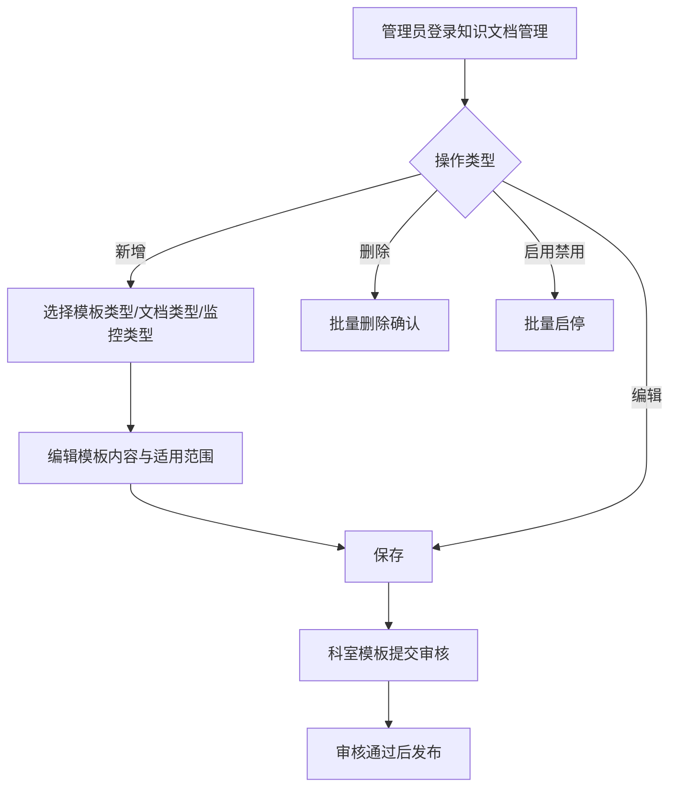
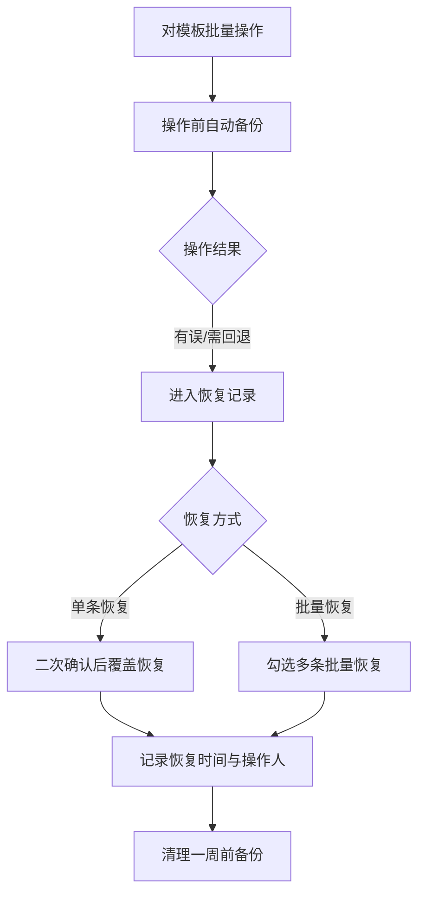

# BLGL-12-MBGL-001 知识文档管理_ Analyst - Spec

> **需求编号**：BLGL-12-MBGL-001
> **父需求**：BLGL-12-MBGL
> **关联PM Spec**：BLGL-12-MBGL-001_知识文档管理_PM-spec.md
> **Spec版本**：V1.0
> **编写时间**：2026-08-13
> **编写人**：需求分析师

---

## 一、功能编号体系

> 使用带父子层级的 `<功能编号>-ID` 编号，便于追溯和讨论。

### 1.1 功能层级结构

```
BLGL-12-MBGL-001: 知识文档管理
 ├─ BLGL-12-MBGL-001-01: 模板维护（增删改查/启停/复制）
 ├─ BLGL-12-MBGL-001-02: 模板导入导出
 └─ BLGL-12-MBGL-001-03: 模板版本与备份恢复
```

### 1.2 功能编号表

| REQ-ID | 功能名称 | 类型 | 优先级 | 说明 |
|--------|---------|------|--------|
| BLGL-12-MBGL-001-01 | 模板维护（增删改查/启停/复制） | 功能 | P0 | 医院/科室模板查询、新增、编辑、删除、启用禁用、复制 |
| BLGL-12-MBGL-001-02 | 模板导入导出 | 功能 | P1 | JSON批量导入导出、批量修改属性 |
| BLGL-12-MBGL-001-03 | 模板版本与备份恢复 | 功能 | P1 | 版本管理、图片管理、XML批量操作记录与恢复 |

---

## 二、核心业务流程

### 2.1 模板维护主流程



### 2.2 XML批量操作备份恢复流程



---

## 三、功能规格说明

---

### BLGL-12-MBGL-001-01: 模板维护（增删改查/启停/复制）

#### 3.1.1 功能概述

按条件查询医院模板、科室模板列表，支持按模板名称、文档类型、监控类型筛选；新增、编辑、删除、批量启用禁用、复制已有模板。

#### 3.1.2 用户角色

| 角色 | 使用场景 | 权限要求 | 操作频率 |
|------|---------|---------|---------|
| 院级模板管理员 | 维护医院模板 | 院级模板管理角色 399688123 | 中频 |
| 科室模板管理员 | 维护科室模板 | 科室模板管理角色 399688124 | 中频 |

#### 3.1.3 业务流程（Given/When/Then）

##### 主流程（至少 1 个）

**Scenario 1: 新增医院/科室模板**

```gherkin
Given:
 - 管理员登录知识文档管理界面

When:
 - 点击新增，选择模板类型（医院模板/科室模板）、文档类型、监控类型
 - 编辑模板基本信息、模板内容、适用范围
 - 保存

Then:
 - 模板创建成功，进入知识文档列表
 - 科室模板需提交审核
```

##### 异常流程（至少 3 个）

**Scenario 2: 模板失效提示（业务异常）**

```gherkin
Given:
 - 医生使用已失效模板

When:
 - 医生选择该模板新建病历

Then:
 - 提示模板失效原因
```

**Scenario 3: 模板数量超限（数据异常）**

```gherkin
Given:
 - 成套模板维护时模板数量大于20个

When:
 - 提交成套模板

Then:
 - 放开限制，模板数量支持到100条
```

**Scenario 4: 删除模板确认（系统异常/误操作）**

```gherkin
Given:
 - 管理员批量删除模板

When:
 - 多选模板并删除

Then:
 - 删除前进行确认提示
```

##### 边界流程（至少 2 个）

**Scenario 5: 停用模板（多值/状态）**

```gherkin
Given:
 - 模板对应的院级模板已停止使用

When:
 - 新增病历文书界面选择该模板

Then:
 - 停用模板不允许新增，允许预览，置灰确定按钮
```

**Scenario 6: 复制模板跨业务范围（边界）**

```gherkin
Given:
 - 复制已有模板创建新模板

When:
 - 选择复制模板

Then:
 - 支持跨业务范围复制
```

#### 3.1.4 数据字段定义

| 字段名 | 类型 | 必填 | 默认值 | 取值范围 | 说明 | 概念ID |
|--------|------|------|--------|---------|------|--------|
| 模板名称 | String | 是 | - | - | 模板名称 | ⏳ 待确认 |
| 文档类型 | - | - | - | - | 文档类型 | ⏳ 待确认 |
| 监控类型 | - | - | - | - | 监控类型 | ⏳ 待确认 |
| 业务范围类型 | - | - | - | 399017152_dep | 医院模板/科室模板 | ⏳ 待确认 |
| 启用状态 | Long | - | - | 98175/98176 | 启用/禁用 | ⏳ 待确认 |

#### 3.1.5 验收标准

| AC编号 | 验收标准 | 对应REQ-ID | 验证方法 | 验证场景 |
|--------|---------|-----------|--------|
| AC-001 | 管理员可新增/编辑/删除医院模板、科室模板 | BLGL-12-MBGL-001-01 | 功能测试 | Scenario 1 |
| AC-002 | 批量启用禁用后禁用模板在临床不可使用 | BLGL-12-MBGL-001-01 | 功能测试 | - |
| AC-003 | 停用模板允许预览置灰确定按钮 | BLGL-12-MBGL-001-01 | 功能测试 | Scenario 5 |

---

### BLGL-12-MBGL-001-02: 模板导入导出

#### 3.2.1 功能概述

批量导入JSON格式模板文件（支持拖拽上传），批量导出模板为JSON文件，批量修改模板属性（适用科室、适用病种、适用年龄等）。

#### 3.2.2 用户角色

| 角色 | 使用场景 | 权限要求 | 操作频率 |
|------|---------|---------|---------|
| 院级/科室模板管理员 | 模板导入导出 | 模板管理权限 | 低频 |

#### 3.2.3 业务流程（Given/When/Then）

##### 主流程（至少 1 个）

**Scenario 1: 批量导入模板**

```gherkin
Given:
 - 管理员进入知识文档管理

When:
 - 拖拽上传JSON格式模板文件
 - 批量导入

Then:
 - 模板批量导入成功
```

##### 异常流程（至少 3 个）

**Scenario 2: 导入格式错误（业务异常）**

```gherkin
Given:
 - 上传非JSON格式文件

When:
 - 导入模板

Then:
 - ⏳ 待确认：非JSON格式导入的提示处理未在资料区描述
```

**Scenario 3: 模板属性重复（数据异常）**

```gherkin
Given:
 - 模板保存时重复

When:
 - 保存模板

Then:
 - 增加防重复校验
```

**Scenario 4: 导入中断（系统异常）**

```gherkin
Given:
 - 批量导入过程异常

When:
 - 导入模板

Then:
 - ⏳ 待确认：导入中断处理未在资料区描述
```

##### 边界流程（至少 2 个）

**Scenario 5: 批量修改属性（多值）**

```gherkin
Given:
 - 多选模板

When:
 - 批量修改适用科室、适用病种、适用年龄

Then:
 - 批量修改成功
```

**Scenario 6: 批量导出（边界）**

```gherkin
Given:
 - 多选模板

When:
 - 批量导出为JSON文件

Then:
 - 导出成功
```

#### 3.2.4 数据字段定义

⏳ 待确认：模板导入导出字段结构未在资料区完整给出。

#### 3.2.5 验收标准

| AC编号 | 验收标准 | 对应REQ-ID | 验证方法 | 验证场景 |
|--------|---------|-----------|--------|
| AC-004 | 模板导入导出JSON格式，支持批量 | BLGL-12-MBGL-001-02 | 功能测试 | Scenario 1 |
| AC-005 | 模板保存时增加防重复校验 | BLGL-12-MBGL-001-02 | 功能测试 | Scenario 3 |

---

### BLGL-12-MBGL-001-03: 模板版本与备份恢复

#### 3.3.1 功能概述

查询模板版本记录、引入历史版本、版本对比；上传下载删除模板关联图片；XML批量操作前自动备份，支持单条/批量恢复、重新恢复、清理一周前备份。

#### 3.3.2 用户角色

| 角色 | 使用场景 | 权限要求 | 操作频率 |
|------|---------|---------|---------|
| 院级/科室模板管理员 | 版本管理与备份恢复 | 模板管理权限 | 低频 |

#### 3.3.3 业务流程（Given/When/Then）

##### 主流程（至少 1 个）

**Scenario 1: 单条恢复**

```gherkin
Given:
 - XML批量操作有误或需要回退

When:
 - 点击「恢复记录」
 - 弹出二次确认框

Then:
 - 确认后执行恢复，模板内容被备份版本覆盖
 - 记录状态变为「已恢复」，记录恢复时间与操作人
```

##### 异常流程（至少 3 个）

**Scenario 2: 恢复覆盖确认（业务异常）**

```gherkin
Given:
 - 恢复将覆盖当前模板内容

When:
 - 点击恢复记录

Then:
 - 二次确认提示"恢复后当前模板内容将被备份版本覆盖"
```

**Scenario 3: 混合批量恢复（数据异常）**

```gherkin
Given:
 - 勾选中含已恢复记录

When:
 - 点击批量恢复

Then:
 - 单独提示"其中 n 条将执行重新恢复"
```

**Scenario 4: 清理无符合数据（系统异常）**

```gherkin
Given:
 - 无一周前的备份数据

When:
 - 点击「清理一周前备份」

Then:
 - 提示"当前没有一周前的备份数据"
```

##### 边界流程（至少 2 个）

**Scenario 5: 重新恢复（边界）**

```gherkin
Given:
 - 已恢复但恢复未成功/未生效的记录

When:
 - 点击「重新恢复」

Then:
 - 再次执行恢复，确认框展示上次恢复时间
```

**Scenario 6: 清理物理删除（极端值）**

```gherkin
Given:
 - 存在一周前备份

When:
 - 点击清理一周前备份

Then:
 - 红色警示"删除后不可恢复、模板无法回退"，确认后物理删除
```

#### 3.3.4 数据字段定义

| 字段名 | 类型 | 必填 | 默认值 | 取值范围 | 说明 | 概念ID |
|--------|------|------|--------|---------|------|--------|
| 恢复状态 | - | - | - | 已恢复/未恢复 | 记录状态 | ⏳ 待确认 |
| 恢复时间 | Date | - | - | - | 最近恢复时间 | ⏳ 待确认 |
| 恢复操作人 | - | - | - | - | 恢复操作人 | ⏳ 待确认 |

#### 3.3.5 验收标准

| AC编号 | 验收标准 | 对应REQ-ID | 验证方法 | 验证场景 |
|--------|---------|-----------|--------|
| AC-006 | XML批量操作后可通过恢复记录回退至操作前版本 | BLGL-12-MBGL-001-03 | 功能测试 | Scenario 1 |
| AC-007 | 模板版本记录可查询、历史版本可引入 | BLGL-12-MBGL-001-03 | 功能测试 | - |
| AC-008 | 清理一周前备份物理删除不可找回 | BLGL-12-MBGL-001-03 | 功能测试 | Scenario 6 |

---

## 四、排除范围

本需求不包含以下功能项：

1. **知识文档审核** - 归属 BLGL-12-MBGL-002 知识文档审核
2. **知识文档发布** - 归属 BLGL-12-MBGL-003 知识文档发布
3. **个人模板管理、个人模板审核、成套模板管理** - 归属 BLGL-12-MBGL-004/005/006
4. **数据元管理、病历分类管理、临床文档管理、临床段落管理** - 归属基础能力附录

---

## 五、业务规则清单

| 规则ID | 规则名称 | 规则描述 | 优先级 |
|--------|---------|---------|--------|
| BR-001 | 三级管理 | 支持医院模板、科室模板、个人模板三级管理 | P0 |
| BR-002 | 审核流程 | 科室模板需科室审核，医院模板需医院审核 | P0 |
| BR-003 | 停用预览 | 停用模板不允许新增，允许预览 | P1 |
| BR-004 | 备份恢复 | 批量操作前自动备份，恢复需二次确认 | P1 |
| BR-005 | 数量放开 | 模板数量放开到100条 | P1 |

---

## 六、关联文档

| 文档类型 | 文档路径 | 说明 |
|---------|---------|
| 功能点Spec | BLGL-12-MBGL 12模板管理功能点Spec.md（v1.0，上级目录） | Phase 1 功能点索引 |
| PM spec | 本目录 BLGL-12-MBGL-001_知识文档管理_PM-spec.md（V0.1） | PM 产出的 Spec 文档 |
| -Spec | 本目录 BLGL-12-MBGL-001_知识文档管理-Spec.md（V1.0） | 业务背景与目标 Spec |
| data-model.md | 待产出 | 架构师产出的数据建模文档 |
| design.md | 待产出 | 架构师产出的技术方案文档 |
| api-contract.md | 待产出 | 开发经理产出的 API 契约文档 |

---

## 七、待确认问题清单

| 编号 | 问题描述 | 缺失信息 | 影响范围 | 建议补充方 |
|------|---------|---------|--------|
| Q-001 | 病历模板表物理表名及字段全集未给出 | 表名与字段 | 数据模型设计 | 架构师 |
| Q-002 | 模板导入导出/保存请求完整字段结构未给出 | 接口契约字段 | 接口契约设计 | 开发经理 |
| Q-003 | 模板列表查询性能指标未提供 | 性能指标 | 非功能性要求 | 产品经理/架构师 |
| Q-004 | 前端/后端技术栈版本号未提供 | 技术栈版本 | 技术方案设计 | 架构师 |
| Q-005 | 模板相关概念ID未给出 | 概念ID | 数据字段定义 | 需求分析师 |
| Q-006 | 导入格式错误/导入中断的处理未描述 | 异常处理 | 模板导入导出子功能点 | 需求分析师 |

---

## 填写检查清单

| 序号 | 检查项 | 是否完成 |
|:----:|--------|:--------:|
| 1 | 功能编号带父子层级 | ✅ |
| 2 | 每个 REQ-ID 有功能概述和用户角色 | ✅ |
| 3 | 主流程至少 1 个 Given/When/Then 场景 | ✅ |
| 4 | 异常流程至少 3 个 Given/When/Then 场景 | ✅ |
| 5 | 边界流程至少 2 个 Given/When/Then 场景 | ✅ |
| 6 | 每个 Given/When/Then 内容具体，不模糊 | ✅ |
| 7 | 数据字段定义完整（字段名、类型、必填、说明、概念ID） | ✅ |
| 8 | 验收标准 AC 编号独立，可验证 | ✅ |
| 9 | 验收标准无"功能正常"等模糊表述 | ✅ |
| 10 | 排除范围明确列出 | ✅ |
| 11 | 业务规则清单列出所有规则，每条标注来源 | ✅ |
| 12 | 流程图使用 Mermaid 格式（≥2 个） | ✅ |
| 13 | 关联文档索引包含 Phase 1 功能点Spec | ✅ |
| 14 | 待确认问题清单汇总了全文所有 ⏳ 项 | ✅ |
| 15 | 全文无占位符 `< >` 残留 | ✅ |
| 16 | 全文陈述可溯源至资料区（S1~S10 溯源核查） | ✅ |
| 17 | 人工审核确认完成 | ⏳ 待确认 |

---

**文档状态**：⬜ 待审核
**维护责任**：需求分析师规范组
**下次更新**：根据评审反馈优化

---

## 版本历史

| 版本 | 日期 | 变更说明 | 编写人 |
|------|------|---------|--------|
| V1.0 | 2026-08-13 | 初始版本 | 需求分析师 |
