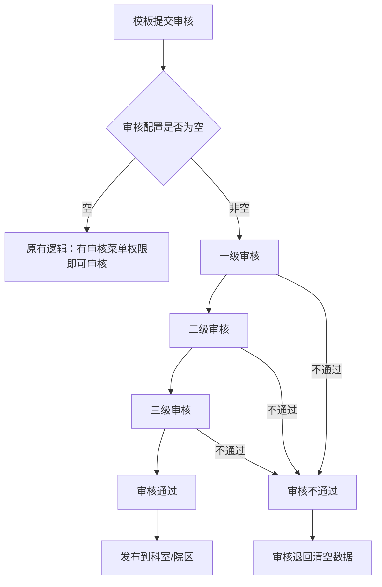
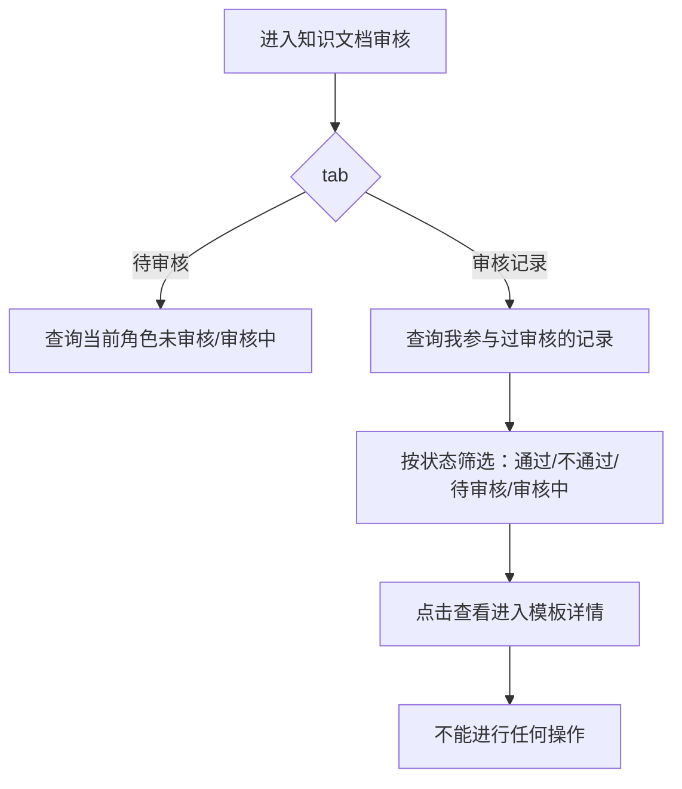

# BLGL-12-MBGL-002 知识文档审核_ Analyst - Spec

> **需求编号**：BLGL-12-MBGL-002
> **父需求**：BLGL-12-MBGL
> **关联PM Spec**：BLGL-12-MBGL-002_知识文档审核_PM-spec.md
> **Spec版本**：V1.0
> **编写时间**：2026-08-13
> **编写人**：需求分析师

---

## 一、功能编号体系

> 使用带父子层级的 `<功能编号>-ID` 编号，便于追溯和讨论。

### 1.1 功能层级结构

```
BLGL-12-MBGL-002: 知识文档审核
 ├─ BLGL-12-MBGL-002-01: 审核操作（待审核/通过/不通过）
 ├─ BLGL-12-MBGL-002-02: 审核记录查询
 └─ BLGL-12-MBGL-002-03: 审核配置与无纸化设置
```

### 1.2 功能编号表

| REQ-ID | 功能名称 | 类型 | 优先级 | 说明 |
|--------|---------|------|--------|
| BLGL-12-MBGL-002-01 | 审核操作（待审核/通过/不通过） | 功能 | P0 | 待审核查询、审核通过、审核不通过、批量操作、保存批注 |
| BLGL-12-MBGL-002-02 | 审核记录查询 | 功能 | P1 | 审核记录查询，待审核/审核记录 tab |
| BLGL-12-MBGL-002-03 | 审核配置与无纸化设置 | 功能 | P1 | 无纸化状态设置、科室审核配置、审核记录查询 |

---

## 二、核心业务流程

### 2.1 审核主流程



### 2.2 审核记录查询流程



---

## 三、功能规格说明

---

### BLGL-12-MBGL-002-01: 审核操作（待审核/通过/不通过）

#### 3.1.1 功能概述

查询待审核的模板列表，支持按医院模板、科室模板分类查询；批量审核通过/不通过，审核不通过填写原因；查看待审核模板XML内容，审核时保存批注信息。

#### 3.1.2 用户角色

| 角色 | 使用场景 | 权限要求 | 操作频率 |
|------|---------|---------|---------|
| 科室模板管理员 | 审核科室模板 | 有页面权限即可审核 | 中频 |
| 院级模板管理员 | 审核医院模板 | 有页面权限即可审核 | 中频 |

#### 3.1.3 业务流程（Given/When/Then）

##### 主流程（至少 1 个）

**Scenario 1: 审核通过**

```gherkin
Given:
 - 存在待审核模板

When:
 - 审核人查询待审核模板列表
 - 查看模板内容
 - 审核通过

Then:
 - 模板审核通过，进入发布流程
```

##### 异常流程（至少 3 个）

**Scenario 2: 审核不通过（业务异常）**

```gherkin
Given:
 - 审核模板

When:
 - 审核不通过，填写不通过原因

Then:
 - 模板审核不通过，记录不通过原因
```

**Scenario 3: 审核退回清空（数据异常）**

```gherkin
Given:
 - 审核退回

When:
 - 退回审核

Then:
 - 审核退回清空数据
```

**Scenario 4: 批量审核异常（系统异常）**

```gherkin
Given:
 - 批量审核模板

When:
 - 多选批量审核通过

Then:
 - 批量审核状态更新
```

##### 边界流程（至少 2 个）

**Scenario 5: 保存批注（多值）**

```gherkin
Given:
 - 审核模板

When:
 - 保存批注内容

Then:
 - 支持在模板上添加审核意见
```

**Scenario 6: 查看模板内容（边界）**

```gherkin
Given:
 - 待审核模板

When:
 - 预览待审核模板XML内容

Then:
 - 在线查看模板详情
```

#### 3.1.4 数据字段定义

| 字段名 | 类型 | 必填 | 默认值 | 取值范围 | 说明 | 概念ID |
|--------|------|------|--------|---------|------|--------|
| 审核状态 | - | - | - | 152780 | 审核通过/不通过 | ⏳ 待确认 |
| 审核意见 | String | 否 | - | - | 审核意见 | ⏳ 待确认 |
| 创建人 | String | - | - | - | createdName 字段 | ⏳ 待确认 |

#### 3.1.5 验收标准

| AC编号 | 验收标准 | 对应REQ-ID | 验证方法 | 验证场景 |
|--------|---------|-----------|--------|
| AC-001 | 待审核模板可查询，审核通过后进入发布流程 | BLGL-12-MBGL-002-01 | 功能测试 | Scenario 1 |
| AC-002 | 审核不通过时记录不通过原因 | BLGL-12-MBGL-002-01 | 功能测试 | Scenario 2 |
| AC-003 | 审核界面显示创建者信息 | BLGL-12-MBGL-002-01 | 功能测试 | - |

---

### BLGL-12-MBGL-002-02: 审核记录查询

#### 3.2.1 功能概述

科室知识文档审核新增待审核、审核记录 tab；待审核查询当前角色未审核、审核中的文档；审核记录查询我参与过审核的模板记录（审核通过/不通过/审核中/待审核），所有记录只有查看按钮。

#### 3.2.2 用户角色

| 角色 | 使用场景 | 权限要求 | 操作频率 |
|------|---------|---------|---------|
| 审核管理员 | 查询审核记录 | 有页面权限 | 低频 |

#### 3.2.3 业务流程（Given/When/Then）

##### 主流程（至少 1 个）

**Scenario 1: 审核记录查询**

```gherkin
Given:
 - 存在我参与过审核的模板

When:
 - 进入审核记录 tab
 - 按模板名称、文档类型、适用科室、状态筛选

Then:
 - 查询我参与过审核的模板记录，所有记录只有查看按钮
```

##### 异常流程（至少 3 个）

**Scenario 2: 查看历史记录（业务异常）**

```gherkin
Given:
 - 点击查看审核记录

When:
 - 进入模板详情

Then:
 - 不能进行任何操作
```

**Scenario 3: 状态筛选（数据异常）**

```gherkin
Given:
 - 审核记录含审核通过/不通过/待审核/审核中

When:
 - 按状态筛选（默认都勾选）

Then:
 - 正确筛选对应状态记录
```

**Scenario 4: 审核节点显示（系统异常）**

```gherkin
Given:
 - 待审核文档

When:
 - 查看待审核列表

Then:
 - 审核节点显示当前处于一、二、三级哪个节点，待审核角色显示当前节点待审核角色
```

##### 边界流程（至少 2 个）

**Scenario 5: 区分我的/共享模板（多值）**

```gherkin
Given:
 - 个人模板审核菜单

When:
 - 按模板范围查询

Then:
 - 查询分类：个人模板/科室模板，默认为空，选择后支持取消
```

**Scenario 6: 审核节点为空（边界）**

```gherkin
Given:
 - 待审核、审核配置数据不为空

When:
 - 当前人包含一级角色审批权限

Then:
 - 查询审批节点为空的数据
```

#### 3.2.4 数据字段定义

| 字段名 | 类型 | 必填 | 默认值 | 取值范围 | 说明 | 概念ID |
|--------|------|------|--------|---------|------|--------|
| 审核日期 | Date | - | - | - | 审核日期 | ⏳ 待确认 |
| 审核人 | - | - | - | - | 显示登录员工 | ⏳ 待确认 |
| 待审核节点 | - | - | - | - | 待审核节点 | ⏳ 待确认 |
| 待审核角色 | - | - | - | - | 待审核角色 | ⏳ 待确认 |

#### 3.2.5 验收标准

| AC编号 | 验收标准 | 对应REQ-ID | 验证方法 | 验证场景 |
|--------|---------|-----------|--------|
| AC-004 | 审核记录支持查询我参与过审核的模板，只有查看按钮 | BLGL-12-MBGL-002-02 | 功能测试 | Scenario 1 |
| AC-005 | 审核记录按状态筛选 | BLGL-12-MBGL-002-02 | 功能测试 | Scenario 3 |

---

### BLGL-12-MBGL-002-03: 审核配置与无纸化设置

#### 3.3.1 功能概述

批量设置模板无纸化上传状态（上传无纸化/不上传无纸化）；配置科室模板审核流程，支持按科室配置审核角色；查询历史审核记录。

#### 3.3.2 用户角色

| 角色 | 使用场景 | 权限要求 | 操作频率 |
|------|---------|---------|---------|
| 科室模板管理员 | 配置审核流程与无纸化 | 配置权限 | 低频 |

#### 3.3.3 业务流程（Given/When/Then）

##### 主流程（至少 1 个）

**Scenario 1: 无纸化状态批量设置**

```gherkin
Given:
 - 批量选中模板

When:
 - 批量设置无纸化上传状态

Then:
 - 支持上传无纸化/不上传无纸化
```

##### 异常流程（至少 3 个）

**Scenario 2: 审核配置校验（业务异常）**

```gherkin
Given:
 - 一级审核未设置值，二级审核设置了值

When:
 - 保存审核配置

Then:
 - 不能保存成功，提示"请完成前一个节点配置"
```

**Scenario 3: 审核配置为空（数据异常）**

```gherkin
Given:
 - 审核配置为空，未设置

When:
 - 提交个人模板审核

Then:
 - 走原有逻辑，有个人模板审核菜单权限即可审核
```

**Scenario 4: 审核角色配置（系统异常）**

```gherkin
Given:
 - 配置审核角色

When:
 - 按科室配置审核角色

Then:
 - 一个角色只能维护到一个节点中
```

##### 边界流程（至少 2 个）

**Scenario 5: 审核角色多选（多值）**

```gherkin
Given:
 - 每级审核角色配置

When:
 - 配置每级审核角色

Then:
 - 每级审核角色支持多选，一个角色只能维护到一个节点
```

**Scenario 6: 审核记录查询（边界）**

```gherkin
Given:
 - 历史审核记录

When:
 - 按时间、审核人、审核结果筛选

Then:
 - 查询历史审核记录
```

#### 3.3.4 数据字段定义

| 字段名 | 类型 | 必填 | 默认值 | 取值范围 | 说明 | 概念ID |
|--------|------|------|--------|---------|------|--------|
| 无纸化标识 | - | - | - | 98175/98176 | 上传/不上传无纸化 | ⏳ 待确认 |
| 审核角色 | - | - | - | 399688123 | 审核角色 | ⏳ 待确认 |

#### 3.3.5 验收标准

| AC编号 | 验收标准 | 对应REQ-ID | 验证方法 | 验证场景 |
|--------|---------|-----------|--------|
| AC-006 | 无纸化状态批量设置上传/不上传 | BLGL-12-MBGL-002-03 | 功能测试 | Scenario 1 |
| AC-007 | 多级审核配置前面节点为空时保存提示 | BLGL-12-MBGL-002-03 | 功能测试 | Scenario 2 |

---

## 四、排除范围

本需求不包含以下功能项：

1. **知识文档管理** - 归属 BLGL-12-MBGL-001 知识文档管理
2. **知识文档发布** - 归属 BLGL-12-MBGL-003 知识文档发布
3. **个人模板审核** - 归属 BLGL-12-MBGL-005 个人模板审核

---

## 五、业务规则清单

| 规则ID | 规则名称 | 规则描述 | 优先级 |
|--------|---------|---------|--------|
| BR-001 | 审核流程 | 科室模板需科室审核，医院模板需医院审核 | P0 |
| BR-002 | 审核权限 | 有页面权限即可审核 | P0 |
| BR-003 | 多级审核校验 | 前面节点必须有值才能保存 | P1 |
| BR-004 | 审核退回清空 | 审核退回清空数据 | P1 |
| BR-005 | 审核记录只读 | 审核记录只有查看按钮 | P1 |

---

## 六、关联文档

| 文档类型 | 文档路径 | 说明 |
|---------|---------|
| 功能点Spec | BLGL-12-MBGL 12模板管理功能点Spec.md（v1.0，上级目录） | Phase 1 功能点索引 |
| PM spec | 本目录 BLGL-12-MBGL-002_知识文档审核_PM-spec.md（V0.1） | PM 产出的 Spec 文档 |
| -Spec | 本目录 BLGL-12-MBGL-002_知识文档审核-Spec.md（V1.0） | 业务背景与目标 Spec |
| data-model.md | 待产出 | 架构师产出的数据建模文档 |
| design.md | 待产出 | 架构师产出的技术方案文档 |
| api-contract.md | 待产出 | 开发经理产出的 API 契约文档 |

---

## 七、待确认问题清单

| 编号 | 问题描述 | 缺失信息 | 影响范围 | 建议补充方 |
|------|---------|---------|--------|
| Q-001 | 模板审核记录表物理表名及字段全集未给出 | 表名与字段 | 数据模型设计 | 架构师 |
| Q-002 | 审核操作请求/返回结构未给出 | 接口契约字段 | 接口契约设计 | 开发经理 |
| Q-003 | 审核列表查询性能指标未提供 | 性能指标 | 非功能性要求 | 产品经理/架构师 |
| Q-004 | 前端/后端技术栈版本号未提供 | 技术栈版本 | 技术方案设计 | 架构师 |
| Q-005 | 审核相关概念ID未给出 | 概念ID | 数据字段定义 | 需求分析师 |

---

## 填写检查清单

| 序号 | 检查项 | 是否完成 |
|:----:|--------|:--------:|
| 1 | 功能编号带父子层级 | ✅ |
| 2 | 每个 REQ-ID 有功能概述和用户角色 | ✅ |
| 3 | 主流程至少 1 个 Given/When/Then 场景 | ✅ |
| 4 | 异常流程至少 3 个 Given/When/Then 场景 | ✅ |
| 5 | 边界流程至少 2 个 Given/When/Then 场景 | ✅ |
| 6 | 每个 Given/When/Then 内容具体，不模糊 | ✅ |
| 7 | 数据字段定义完整（字段名、类型、必填、说明、概念ID） | ✅ |
| 8 | 验收标准 AC 编号独立，可验证 | ✅ |
| 9 | 验收标准无"功能正常"等模糊表述 | ✅ |
| 10 | 排除范围明确列出 | ✅ |
| 11 | 业务规则清单列出所有规则，每条标注来源 | ✅ |
| 12 | 流程图使用 Mermaid 格式（≥2 个） | ✅ |
| 13 | 关联文档索引包含 Phase 1 功能点Spec | ✅ |
| 14 | 待确认问题清单汇总了全文所有 ⏳ 项 | ✅ |
| 15 | 全文无占位符 `< >` 残留 | ✅ |
| 16 | 全文陈述可溯源至资料区（S1~S10 溯源核查） | ✅ |
| 17 | 人工审核确认完成 | ⏳ 待确认 |

---

**文档状态**：⬜ 待审核
**维护责任**：需求分析师规范组
**下次更新**：根据评审反馈优化

---

## 版本历史

| 版本 | 日期 | 变更说明 | 编写人 |
|------|------|---------|--------|
| V1.0 | 2026-08-13 | 初始版本 | 需求分析师 |
