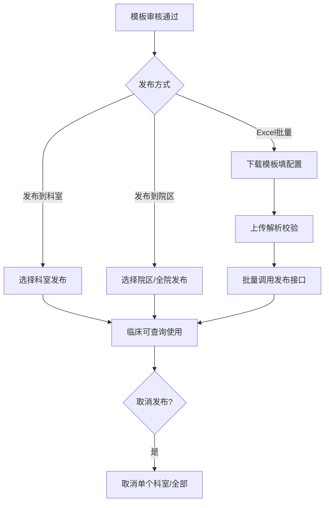
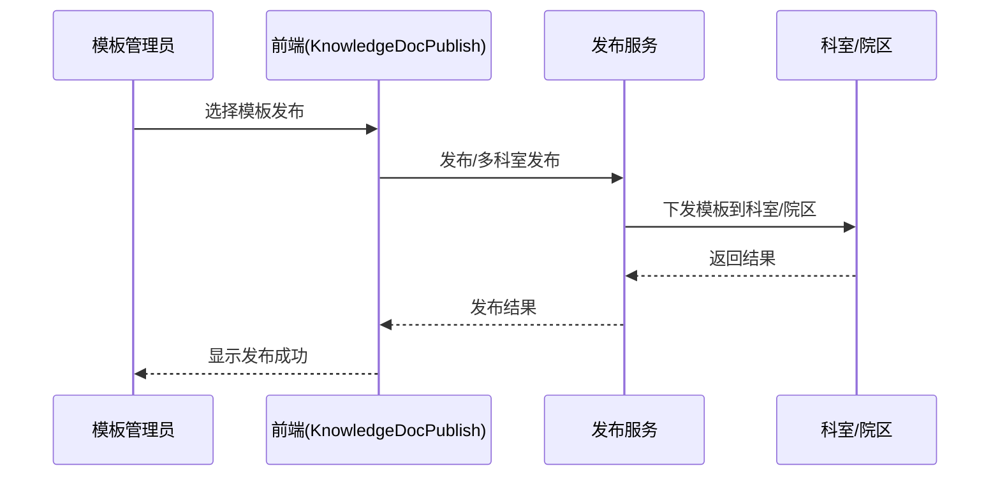

# BLGL-12-MBGL-003 知识文档发布-Spec

> **功能编号**：BLGL-12-MBGL-003
> **文档类型**：功能Spec（业务背景与设计）
> **文档版本**：V1.0
> **编写时间**：2026-08-13
> **编写人**：RACC

---

## 文档索引

本节提供本文档的章节结构索引与关联文档索引，便于读者快速定位与检索。

#### 章节索引

**Spec（研发视角）**

| 章节号 | 章节名称 |
|--------|---------|
| 1、 | 文档概述 |
| 2、 | 功能背景与定位 |
| 3、 | 业务流程设计 |
| 4、 | 数据模型设计 |
| 5、 | 接口契约设计 |
| 6、 | 技术方案设计 |
| 7、 | 测试用例预设计 |
| 8、 | 非功能性要求 |
| 9、 | 依赖与风险 |
| 10、 | 附录 |

**PM-Spec（需求规格）**

| 章节号 | 章节名称 |
|--------|---------|
| 一 | 目标 |
| 二 | 约束 |
| 三 | 验收标准 |
| 四 | 排除范围 |
| 五 | 关键决策记录 |
| 六 | 优先级 |
| 附录 | 填写检查清单 |

**Analyst-Spec（分析规格）**

| 章节号 | 章节名称 |
|--------|---------|
| 一 | 功能编号体系 |
| 二 | 核心业务流程 |
| 三 | 功能规格说明 |
| 四 | 排除范围 |
| 五 | 业务规则清单 |
| 六 | 关联文档 |
| 七 | 待确认问题清单 |
| - | 填写检查清单 | 检查项与完成状态 |

#### 版本历史

| 版本 | 日期 | 变更说明 | 编写人 |
|------|------|---------|--------|
| V1.0 | 2026-08-13 | 初始版本 | RACC |

#### 关联文档索引

| 序号 | 文档名称 | 文档类型 | 版本 | 位置 |
|------|---------|---------|------|------|
| 1 | BLGL-12-MBGL-003_知识文档发布-Spec.md | 功能Spec（业务背景与设计）（本文档） | V1.0 | 本目录 |
| 2 | BLGL-12-MBGL-003_知识文档发布_PM-spec.md | PM-Spec（需求规格） | V0.1 | 本目录 |
| 3 | BLGL-12-MBGL-003_知识文档发布_Analyst-spec.md | Analyst-Spec（分析规格） | V1.0 | 本目录 |
| 4 | BLGL-12-MBGL 12模板管理功能点Spec.md | 功能点Spec（模块级） | v1.0 | 上级目录 |

---

## 1、文档概述

### 1.1、文档目的

本文档旨在明确"知识文档发布"功能（BLGL-12-MBGL-003）的业务背景与设计方案，为需求分析、研发实现、测试验收及评审提供统一的业务上下文、设计口径与决策依据。

**具体目的包括**：

1. 梳理知识文档发布功能的业务由来与历史需求演进脉络，说明"为什么要做"
2. 明确功能的定位边界、目标用户与核心价值，回答"做成什么"
3. 描述功能的业务流程、数据模型、接口契约与技术方案，回答"怎么做"
4. 预设计测试用例并明确非功能性要求、依赖与风险，为研发与验收提供依据
5. 作为 SPEC（功能编号体系、功能详情、业务规则、验收标准等章节）的业务前提与设计输入，保证各层文档业务口径一致。

### 1.2、文档范围

#### 1.2.1 纳入范围

本文档覆盖知识文档发布的完整业务背景与设计，包括：

- 待发布模板查询、发布到科室、发布到院区、取消发布、查看发布范围、批量发布
- 模板目录筛选、多科室发布
- 已发布模板修改后重新审核发布、发布界面增加科室过滤
- Excel 导入批量发布。

#### 1.2.2 排除范围

本文档不涉及以下内容（详见其他功能点或模块）：

- 知识文档管理——归属 BLGL-12-MBGL-001
- 知识文档审核（待审核/通过/不通过/无纸化设置）——归属 BLGL-12-MBGL-002
- 个人模板管理、个人模板审核、成套模板管理——归属 BLGL-12-MBGL-004/005/006。

### 1.3、术语定义

| 术语 | 定义 |
|------|------|
| 知识文档发布 | 将审核通过的模板发布到指定科室/院区 |
| 发布到科室 | 将模板发布到指定科室，支持多科室批量发布 |
| 发布到院区 | 将模板发布到指定院区，支持全院发布 |
| 取消发布 | 取消已发布的模板，支持取消单个科室或全部发布 |
| 批量发布 | 通过导入Excel批量将模板发布到全院或多个科室 |

### 1.4、阅读指南

- **章节关系**：第1~2章为阅读铺垫与业务全貌（背景、定位、用户、价值）；第3~10章为设计实现层（流程、数据、接口、技术、测试、非功能、依赖风险、附录），可直接用于研发与测试。与 Analyst-Spec、PM-Spec 的详细规则/验收口径互相引用，保持一致。
- **读者对象**：
 - 产品经理/需求分析师：阅读第1~2章了解业务全貌，据此维护 PM-Spec 与功能清单
 - 研发：阅读第3~6章用于开发实现，第9~10章用于依赖评估与联调
 - 测试：阅读第3章、第7~8章用于用例设计与验收
 - 评审人员：以本文档为业务口径与设计基准，核对各层文档一致性。

### 1.5、参考文档

| 序号 | 文档名称 | 版本/日期 |
|------|---------|
| 1 | 【历史需求】病历模版-0813.xlsx | 2026-08-13 |
| 2 | WiNEX-病历管理_模板管理功能清单_20260403.md | 2026-04-03 |
| 3 | BLGL-12-MBGL-003_知识文档发布_PM-spec.md | V0.1 |
| 4 | BLGL-12-MBGL-003_知识文档发布_Analyst-spec.md | V1.0 |
| 5 | BLGL-12-MBGL 12模板管理功能点Spec.md | v1.0 |

---

## 2、功能背景与定位

### 2.1 功能背景

知识文档发布是住院病历模板下发的通道，需满足：

- **管理要求**：审核通过的模板发布到科室/院区，供临床使用。
- **现状痛点**：
 - 模板发布科室无规律，需要一个一个发布，操作效率低
 - 发布界面缺少科室过滤功能
 - 已发布模板修改后需重新审核发布。
- **历史需求演进**：从知识文档发布基础功能（功能清单）→ 模板目录筛选→ 多科室发布→ 发布优化→ Excel导入批量发布。

### 2.2 功能定位

"知识文档发布"是 WiNEX 病历管理-模板管理 的模板下发通道，定位为：

- **科室/院区发布**：发布到科室、发布到院区、多科室发布、取消发布
- **发布范围查询**：查询模板已发布的科室、院区信息
- **Excel批量发布**：导入规定格式Excel批量发布
- **发布信息透明**：发布界面显示创建者、科室过滤。

### 2.3 目标用户

| 用户角色 | 主要使用场景 |
|---------|-------------|
| 院级模板管理员 | 全院发布/多科室发布 |
| 科室模板管理员 | 科室模板发布 |

### 2.4 核心价值

| 价值维度 | 价值描述 |
|---------|---------|
| 效率提升 | Excel批量发布、多科室发布 |
| 灵活性 | 发布到科室/院区，取消发布 |
| 信息透明 | 发布界面显示创建者，科室过滤 |
| 一致性 | 已发布模板修改后需重新审核发布 |

---

## 3、业务流程设计（Given/When/Then）

### 3.1 主流程

**Scenario 1: 发布模板到科室**

```gherkin
Given:
 - 模板已审核通过

When:
 - 管理员查询可发布模板列表
 - 选择发布到科室，选择目标科室
 - 发布

Then:
 - 模板发布到指定科室，临床可查询使用
```

### 3.2 异常流程

**Scenario 2: 已发布模板修改后（业务异常）**

```gherkin
Given:
 - 已发布模板被修改

When:
 - 修改后

Then:
 - 需重新审核发布
```

**Scenario 3: Excel字段校验失败（数据异常）**

```gherkin
Given:
 - 导入Excel批量发布，必填字段为空

When:
 - 解析Excel

Then:
 - 提示"第X行：'{字段名}'不能为空"
```

**Scenario 4: Excel模板名称不存在（系统异常）**

```gherkin
Given:
 - Excel中模板名称不存在于系统

When:
 - 解析Excel

Then:
 - 提示"第X行：模板名称'{名称}'不存在"
```

### 3.3 边界流程

**Scenario 5: 多科室发布（多值）**

```gherkin
Given:
 - 科室模板发布页面

When:
 - 点击多科室发布按钮

Then:
 - 支持多科室发布
```

**Scenario 6: 取消发布（未配置/状态）**

```gherkin
Given:
 - 已发布模板

When:
 - 取消发布

Then:
 - 支持取消单个科室或全部发布
```

---

## 4、数据模型设计

### 4.1 核心数据结构

#### 4.1.1 核心保存请求

⏳ 待确认：发布请求结构未在资料区中完整给出，待来自 API 契约或数据建模。

#### 4.1.2 核心表/实体

| 表/实体 | 关键字段 | 说明 |
|---------|---------|------|
| 模板发布记录 | 模板ID、发布科室、发布院区、发布状态 | 发布范围存储 |

> ⏳ 待确认：模板发布记录表物理表名及字段全集未在资料区明确给出。

### 4.2 状态定义

⏳ 待确认：发布状态（已发布/已取消）未在资料区中作为状态码完整定义。

### 4.3 系统参数定义

⏳ 待确认：知识文档发布未在资料区中明确独立参数配置。

---

## 5、接口契约设计

### 5.1 API列表

| 序号 | API名称（代码函数） | 路径 | 方法 | 说明 |
|:----:|---------|------|:----:|------|
| 1 | 发布病历模板 | - | POST | 发布病历模板 |
| 2 | 取消发布病历模板 | - | POST | 取消发布病历模板 |
| 3 | 多科室发布 | - | POST | 多科室发布 |
| 4 | 查询科室列表（发布信息） | - | POST | 查询科室列表 |
| 5 | 多模板多科室发布 / 取消发布 | - | POST | 批量发布/取消 |
| 6 | 查询单份模板发布的机构和科室集合 | - | POST | 发布范围查询 |

### 5.2 接口详细设计

⏳ 待确认：接口完整请求/返回结构、错误码与示例值，待来自 API 契约文档或设计评审。

### 5.3 错误码定义

| 错误码 | 错误信息 | 处理方式 |
|--------|---------|---------|
| ⏳ 待确认 | 第X行：模板名称'{名称}'不存在 | Excel导入解析失败提示 |

> ⏳ 待确认：错误码编码值未在资料区中提供，待来自 API 契约。

---

## 6、技术方案设计

### 6.1 页面路径

- **页面路径**: winning-webui-emr-template/src/views/KnowledgeDocPublish/index.vue（知识文档发布）
- **核心逻辑模块**: EmrTemplatePublishController（发布）

### 6.2 技术栈

| 类别 | 技术 | 版本 |
|------|------|------|
| 前端框架 | Vue（winning-webui-emr-template） | ⏳ 待确认 |
| 后端框架 | Java Spring Boot（winning-mas-emr-template） | ⏳ 待确认 |

### 6.3 关键技术点

- Excel 批量发布：下载模板、上传解析、校验字段、批量调用已有发布接口
- 发布列表接口返回 creatorName 字段。

### 6.4 部署方案

⏳ 待确认：部署方案未在资料区中提供。

---

## 7、测试用例预设计

### 7.1 功能测试

| 用例编号 | 测试场景 | Given | When | Then |
|---------|---------|-------|--------|
| TC-001 | 发布到科室 | 审核通过模板 | 发布到科室 | 临床可查询 |
| TC-002 | Excel批量发布 | 上传规定格式Excel | 批量发布 | 成功项/失败项分别提示 |

### 7.2 边界测试

| 用例编号 | 测试场景 | Given | When | Then |
|---------|---------|-------|--------|
| TC-003 | 多科室发布 | 科室模板 | 多科室发布 | 支持多科室 |
| TC-004 | 取消发布 | 已发布模板 | 取消发布 | 取消单个/全部 |

### 7.3 异常测试

| 用例编号 | 测试场景 | Given | When | Then |
|---------|---------|-------|--------|
| TC-005 | Excel必填缺失 | 必填字段为空 | 解析 | 提示不能为空 |
| TC-006 | 模板名称不存在 | Excel模板名不存在 | 解析 | 提示不存在 |

### 7.4 性能测试

| 用例编号 | 测试场景 | 指标 |
|---------|---------|
| TC-007 | 批量发布 |

---

## 8、非功能性要求

### 8.1 性能要求

| 指标 | 要求 |
|------|------|
| 批量发布响应时间 | ⏳ 待确认 |

### 8.2 安全要求

| 要求 | 说明 |
|------|------|
| 权限控制 | 医院/科室模板按角色控制菜单显示 |

**医疗行业特殊要求**

| 要求 | 说明 |
|------|------|
| 模板一致性 | 已发布模板修改后需重新审核发布 |

### 8.3 可用性要求

| 指标 | 要求值 |
|------|--------|
| 可用性 | ⏳ 待确认 |

### 8.4 兼容性要求

| 类型 | 要求 |
|------|------|
| Excel格式 | 支持 .xlsx 或 .xls |

---

## 9、依赖与风险

### 9.1 外部依赖

| 依赖项 | 说明 |
|--------|------|
| 科室/院区 | 发布范围数据 |

### 9.2 风险项

| 风险项 | 等级 | 说明 | 应对方案 |
|--------|------|------|---------|
| Excel批量发布解析失败 | 中 | 模板名称/科室不匹配 | 逐行校验并提示具体错误 |

---

## 10、附录

### 10.1 流程图



### 10.2 时序图



### 10.3 参考文档

- WiNEX-病历管理_模板管理功能清单_20260403.md（第2.3节 知识文档发布）
- 【历史需求】病历模版-0813.xlsx（、1332022、1562282、1701490、607306）
- BLGL-12-MBGL 12模板管理功能点Spec.md（v1.0）
- 关联Spec: BLGL-12-MBGL-002_知识文档审核-Spec.md（审核通过后发布）

---

## 填写检查清单

| 序号 | 检查项 | 是否完成 |
|:----:|--------|:--------:|
| 1 | 章节索引与正文章节一致 | ✅ |
| 2 | 版本历史记录完整 | ✅ |
| 3 | 关联文档索引已登记全部Spec | ✅ |
| 4 | 文档目的明确回答"为什么做/做成什么/怎么做" | ✅ |
| 5 | 纳入范围/排除范围清晰 | ✅ |
| 6 | 术语定义覆盖关键概念，从资料区可溯源 | ✅ |
| 7 | 参考文档已登记 | ✅ |
| 8 | 功能背景基于法规/规范/需求来源组织 | ✅ |
| 9 | 功能定位体现业务价值（3~5个定位点） | ✅ |
| 10 | 目标用户角色覆盖完整，在需求原文中有出处 | ✅ |
| 11 | 核心价值可陈述，与 Phase 1 口径一致 | ✅ |
| 12 | 业务流程：主流程≥1、异常≥3、边界≥2，Given/When/Then 具体 | ✅ |
| 13 | 数据模型：字段/表/状态/参数可溯源（概念ID/表名/参数编码） | ✅ |
| 14 | 接口契约：API列表+详细设计+错误码齐全（资料区有信息时）或标记待确认 | ✅ |
| 15 | 技术方案：页面路径/技术栈/关键点/部署方案（资料区有信息时）或标记待确认 | ✅ |
| 16 | 测试用例：功能/边界/异常/性能覆盖，与第3章场景对应 | ✅ |
| 17 | 非功能性要求：性能/安全/可用性/兼容性指标可量化或标记待确认 | ✅ |
| 18 | 依赖与风险：外部依赖登记完整，风险有具体应对方案或标记待确认 | ✅ |
| 19 | 附录：流程图/时序图与正文流程一致 | ✅ |
| 20 | 全文无占位符 `< >` 残留 | ✅ |
| 21 | 全文陈述可溯源至资料区，无来源的已标记 ⏳ | ✅ |
| 22 | 人工审核确认完成 | ⏳ 待确认 |

---

**文档状态**：⬜ 待审核
**维护责任**：RACC
**下次更新**：根据评审反馈优化
