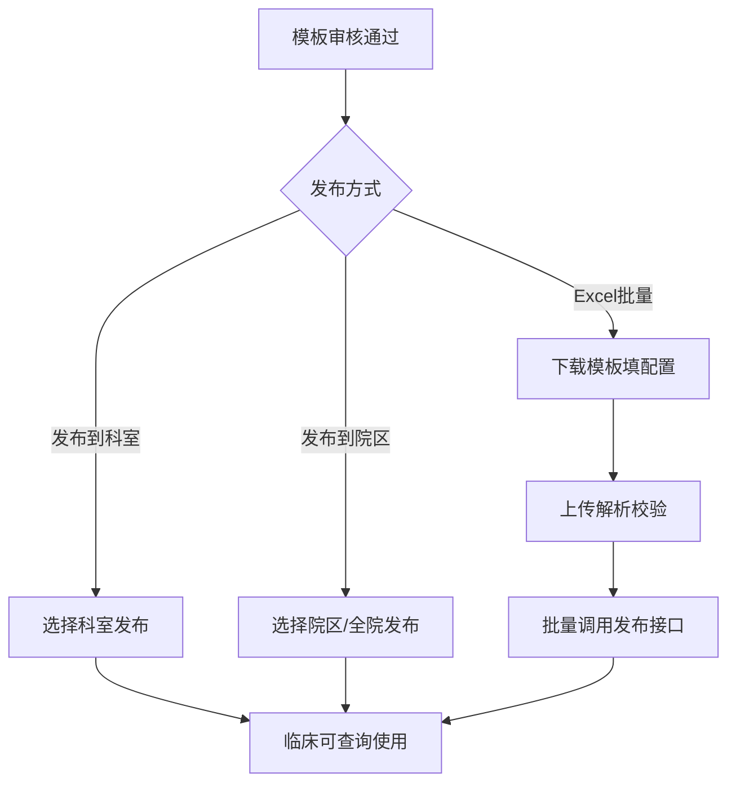
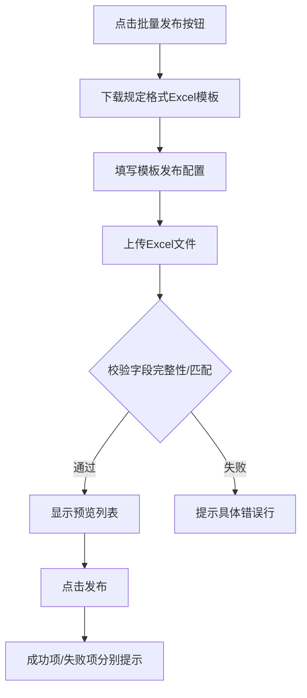

# BLGL-12-MBGL-003 知识文档发布_ Analyst - Spec

> **需求编号**：BLGL-12-MBGL-003
> **父需求**：BLGL-12-MBGL
> **关联PM Spec**：BLGL-12-MBGL-003_知识文档发布_PM-spec.md
> **Spec版本**：V1.0
> **编写时间**：2026-08-13
> **编写人**：需求分析师

---

## 一、功能编号体系

> 使用带父子层级的 `<功能编号>-ID` 编号，便于追溯和讨论。

### 1.1 功能层级结构

```
BLGL-12-MBGL-003: 知识文档发布
 ├─ BLGL-12-MBGL-003-01: 发布到科室/院区
 ├─ BLGL-12-MBGL-003-02: 取消发布与发布范围查询
 └─ BLGL-12-MBGL-003-03: Excel批量发布
```

### 1.2 功能编号表

| REQ-ID | 功能名称 | 类型 | 优先级 | 说明 |
|--------|---------|------|--------|
| BLGL-12-MBGL-003-01 | 发布到科室/院区 | 功能 | P1 | 发布到科室、发布到院区、多科室发布、批量发布 |
| BLGL-12-MBGL-003-02 | 取消发布与发布范围查询 | 功能 | P1 | 取消发布、查看发布范围 |
| BLGL-12-MBGL-003-03 | Excel批量发布 | 功能 | P1 | 导入Excel批量发布模板 |

---

## 二、核心业务流程

### 2.1 发布主流程



### 2.2 Excel批量发布流程



---

## 三、功能规格说明

---

### BLGL-12-MBGL-003-01: 发布到科室/院区

#### 3.1.1 功能概述

查询待发布模板列表（按医院模板、科室模板分类），发布到指定科室/院区，支持多科室批量发布、批量发布多个模板到多个科室。

#### 3.1.2 用户角色

| 角色 | 使用场景 | 权限要求 | 操作频率 |
|------|---------|---------|---------|
| 院级模板管理员 | 全院发布/多科室发布 | 院级模板管理角色 | 中频 |
| 科室模板管理员 | 科室模板发布 | 科室模板管理角色 | 中频 |

#### 3.1.3 业务流程（Given/When/Then）

##### 主流程（至少 1 个）

**Scenario 1: 发布到科室**

```gherkin
Given:
 - 模板已审核通过

When:
 - 查询可发布模板列表
 - 选择发布到科室，选择目标科室
 - 发布

Then:
 - 模板发布到指定科室，临床可查询使用
```

##### 异常流程（至少 3 个）

**Scenario 2: 已发布模板修改后（业务异常）**

```gherkin
Given:
 - 已发布模板被修改

When:
 - 修改后

Then:
 - 需重新审核发布
```

**Scenario 3: 模板目录筛选（数据异常）**

```gherkin
Given:
 - 知识文档发布新增查询条件模板目录

When:
 - 选择模板目录筛选

Then:
 - 按层级展示目录树，可选择一级、二级、三级
```

**Scenario 4: 无权限发布（系统异常）**

```gherkin
Given:
 - 无发布权限的医生

When:
 - 访问知识文档发布

Then:
 - 医院/科室模板按角色控制菜单显示
```

##### 边界流程（至少 2 个）

**Scenario 5: 多科室发布（多值）**

```gherkin
Given:
 - 科室模板发布页面

When:
 - 点击多科室发布按钮

Then:
 - 支持多科室发布
```

**Scenario 6: 全院发布（边界）**

```gherkin
Given:
 - 待发布模板

When:
 - 发布到院区，选择全院发布

Then:
 - 模板发布到全院
```

#### 3.1.4 数据字段定义

| 字段名 | 类型 | 必填 | 默认值 | 取值范围 | 说明 | 概念ID |
|--------|------|------|--------|---------|------|--------|
| 发布科室 | - | - | - | - | 目标科室 | ⏳ 待确认 |
| 发布院区 | - | - | - | - | 目标院区 | ⏳ 待确认 |
| 创建人 | String | - | - | - | creatorName 字段 | ⏳ 待确认 |

#### 3.1.5 验收标准

| AC编号 | 验收标准 | 对应REQ-ID | 验证方法 | 验证场景 |
|--------|---------|-----------|--------|
| AC-001 | 审核通过的模板可发布到科室/院区 | BLGL-12-MBGL-003-01 | 功能测试 | Scenario 1 |
| AC-002 | 多科室发布支持一次发布到多个科室 | BLGL-12-MBGL-003-01 | 功能测试 | Scenario 5 |

---

### BLGL-12-MBGL-003-02: 取消发布与发布范围查询

#### 3.2.1 功能概述

取消已发布的模板（支持取消单个科室或全部发布），查询模板已发布的科室、院区信息。

#### 3.2.2 用户角色

| 角色 | 使用场景 | 权限要求 | 操作频率 |
|------|---------|---------|---------|
| 院级/科室模板管理员 | 取消发布、查看发布范围 | 模板管理权限 | 低频 |

#### 3.2.3 业务流程（Given/When/Then）

##### 主流程（至少 1 个）

**Scenario 1: 取消发布**

```gherkin
Given:
 - 已发布模板

When:
 - 取消发布

Then:
 - 支持取消单个科室或全部发布
```

##### 异常流程（至少 3 个）

**Scenario 2: 取消单科室（业务异常）**

```gherkin
Given:
 - 模板已发布到多个科室

When:
 - 取消单个科室发布

Then:
 - 取消该科室发布，其他科室保持发布
```

**Scenario 3: 查看发布范围（数据异常）**

```gherkin
Given:
 - 已发布模板

When:
 - 查看发布范围

Then:
 - 查询模板已发布的科室、院区信息
```

**Scenario 4: 取消全部发布（系统异常）**

```gherkin
Given:
 - 模板已发布

When:
 - 取消全部发布

Then:
 - 全部取消
```

##### 边界流程（至少 2 个）

**Scenario 5: 取消发布后临床不可用（边界）**

```gherkin
Given:
 - 模板取消发布

When:
 - 临床查询模板

Then:
 - 取消发布的模板临床不可用
```

**Scenario 6: 发布范围详情（边界）**

```gherkin
Given:
 - 查看发布范围

When:
 - 查看发布详情

Then:
 - 查看发布详情
```

#### 3.2.4 数据字段定义

⏳ 待确认：发布范围字段结构未在资料区完整给出。

#### 3.2.5 验收标准

| AC编号 | 验收标准 | 对应REQ-ID | 验证方法 | 验证场景 |
|--------|---------|-----------|--------|
| AC-003 | 取消发布支持单个科室或全部 | BLGL-12-MBGL-003-02 | 功能测试 | Scenario 1 |
| AC-004 | 查看发布范围查询模板已发布科室院区 | BLGL-12-MBGL-003-02 | 功能测试 | Scenario 3 |

---

### BLGL-12-MBGL-003-03: Excel批量发布

#### 3.3.1 功能概述

通过导入规定格式Excel文件，批量将模板发布到全院或多个科室；下载模板、上传解析、校验字段、批量调用已有发布接口。

#### 3.3.2 用户角色

| 角色 | 使用场景 | 权限要求 | 操作频率 |
|------|---------|---------|---------|
| 院级模板管理员 | Excel批量发布 | 无权限时隐藏按钮 | 低频 |

#### 3.3.3 业务流程（Given/When/Then）

##### 主流程（至少 1 个）

**Scenario 1: Excel批量发布**

```gherkin
Given:
 - 用户进入病历模板发布页面

When:
 - 点击批量发布按钮，弹出导入弹窗
 - 下载规定格式Excel模板并填写配置
 - 上传Excel文件，点击导入
 - 系统解析校验，显示预览列表
 - 点击发布

Then:
 - 成功项显示"发布成功"，失败项显示失败原因
 - 关闭弹窗刷新模板发布列表
```

##### 异常流程（至少 3 个）

**Scenario 2: 必填字段为空（业务异常）**

```gherkin
Given:
 - Excel必填字段为空

When:
 - 解析Excel

Then:
 - 提示"第X行：'{字段名}'不能为空"
```

**Scenario 3: 模板名称不存在（数据异常）**

```gherkin
Given:
 - Excel模板名称不存在于系统

When:
 - 解析Excel

Then:
 - 提示"第X行：模板名称'{名称}'不存在"
```

**Scenario 4: 文件格式错误（系统异常）**

```gherkin
Given:
 - 上传非Excel格式文件

When:
 - 导入

Then:
 - 提示"请上传 Excel 文件（.xlsx 或 .xls）"
```

##### 边界流程（至少 2 个）

**Scenario 5: 多科室英文逗号（多值）**

```gherkin
Given:
 - 发布科室填多个

When:
 - 解析Excel

Then:
 - 多科室必须英文逗号隔开，格式错误提示"第X行：科室格式错误，请使用英文逗号分隔"
```

**Scenario 6: 取消批量发布（边界）**

```gherkin
Given:
 - 点击弹窗取消按钮

When:
 - 取消

Then:
 - 弹窗关闭，不执行任何发布操作
```

#### 3.3.4 数据字段定义

| 字段名 | 类型 | 必填 | 默认值 | 取值范围 | 说明 | 概念ID |
|--------|------|------|--------|---------|------|--------|
| 模板ID | - | 是 | - | - | 只能填一个，需匹配 | ⏳ 待确认 |
| 模板名称 | String | 是 | - | - | 只能填一个 | ⏳ 待确认 |
| 模板目录 | - | 是 | - | - | 模板所属目录名称 | ⏳ 待确认 |
| 监控类型 | - | 是 | - | - | 如入院记录、病程记录 | ⏳ 待确认 |
| 发布科室 | - | 否 | - | - | 多个英文逗号隔开 | ⏳ 待确认 |
| 是否全院发布 | - | 是 | - | - | 单选是/否 | ⏳ 待确认 |

#### 3.3.5 验收标准

| AC编号 | 验收标准 | 对应REQ-ID | 验证方法 | 验证场景 |
|--------|---------|-----------|--------|
| AC-005 | Excel批量发布成功项/失败项分别提示 | BLGL-12-MBGL-003-03 | 功能测试 | Scenario 1 |
| AC-006 | Excel必填字段为空提示不能为空 | BLGL-12-MBGL-003-03 | 功能测试 | Scenario 2 |
| AC-007 | Excel模板名称不存在提示不存在 | BLGL-12-MBGL-003-03 | 功能测试 | Scenario 3 |

---

## 四、排除范围

本需求不包含以下功能项：

1. **知识文档管理** - 归属 BLGL-12-MBGL-001 知识文档管理
2. **知识文档审核** - 归属 BLGL-12-MBGL-002 知识文档审核
3. **个人模板管理、个人模板审核、成套模板管理** - 归属 BLGL-12-MBGL-004/005/006

---

## 五、业务规则清单

| 规则ID | 规则名称 | 规则描述 | 优先级 |
|--------|---------|---------|--------|
| BR-001 | 发布前提 | 审核通过的模板才能发布 | P0 |
| BR-002 | 重新审核 | 已发布模板修改后需重新审核发布 | P1 |
| BR-003 | 必填校验 | Excel批量发布必填字段不能为空 | P1 |
| BR-004 | 多科室格式 | 多科室必须英文逗号隔开 | P1 |
| BR-005 | 取消发布 | 取消发布支持单个科室或全部 | P1 |

---

## 六、关联文档

| 文档类型 | 文档路径 | 说明 |
|---------|---------|
| 功能点Spec | BLGL-12-MBGL 12模板管理功能点Spec.md（v1.0，上级目录） | Phase 1 功能点索引 |
| PM spec | 本目录 BLGL-12-MBGL-003_知识文档发布_PM-spec.md（V0.1） | PM 产出的 Spec 文档 |
| -Spec | 本目录 BLGL-12-MBGL-003_知识文档发布-Spec.md（V1.0） | 业务背景与目标 Spec |
| data-model.md | 待产出 | 架构师产出的数据建模文档 |
| design.md | 待产出 | 架构师产出的技术方案文档 |
| api-contract.md | 待产出 | 开发经理产出的 API 契约文档 |

---

## 七、待确认问题清单

| 编号 | 问题描述 | 缺失信息 | 影响范围 | 建议补充方 |
|------|---------|---------|--------|
| Q-001 | 模板发布记录表物理表名及字段全集未给出 | 表名与字段 | 数据模型设计 | 架构师 |
| Q-002 | 发布请求/返回结构未给出 | 接口契约字段 | 接口契约设计 | 开发经理 |
| Q-003 | 发布状态（已发布/已取消）状态码未定义 | 状态码 | 数据模型 | 架构师 |
| Q-004 | 批量发布性能指标未提供 | 性能指标 | 非功能性要求 | 产品经理/架构师 |
| Q-005 | 发布相关概念ID未给出 | 概念ID | 数据字段定义 | 需求分析师 |

---

## 填写检查清单

| 序号 | 检查项 | 是否完成 |
|:----:|--------|:--------:|
| 1 | 功能编号带父子层级 | ✅ |
| 2 | 每个 REQ-ID 有功能概述和用户角色 | ✅ |
| 3 | 主流程至少 1 个 Given/When/Then 场景 | ✅ |
| 4 | 异常流程至少 3 个 Given/When/Then 场景 | ✅ |
| 5 | 边界流程至少 2 个 Given/When/Then 场景 | ✅ |
| 6 | 每个 Given/When/Then 内容具体，不模糊 | ✅ |
| 7 | 数据字段定义完整（字段名、类型、必填、说明、概念ID） | ✅ |
| 8 | 验收标准 AC 编号独立，可验证 | ✅ |
| 9 | 验收标准无"功能正常"等模糊表述 | ✅ |
| 10 | 排除范围明确列出 | ✅ |
| 11 | 业务规则清单列出所有规则，每条标注来源 | ✅ |
| 12 | 流程图使用 Mermaid 格式（≥2 个） | ✅ |
| 13 | 关联文档索引包含 Phase 1 功能点Spec | ✅ |
| 14 | 待确认问题清单汇总了全文所有 ⏳ 项 | ✅ |
| 15 | 全文无占位符 `< >` 残留 | ✅ |
| 16 | 全文陈述可溯源至资料区（S1~S10 溯源核查） | ✅ |
| 17 | 人工审核确认完成 | ⏳ 待确认 |

---

**文档状态**：⬜ 待审核
**维护责任**：需求分析师规范组
**下次更新**：根据评审反馈优化

---

## 版本历史

| 版本 | 日期 | 变更说明 | 编写人 |
|------|------|---------|--------|
| V1.0 | 2026-08-13 | 初始版本 | 需求分析师 |
