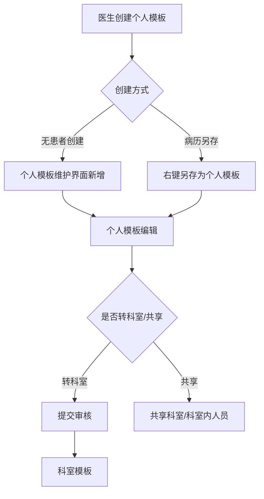
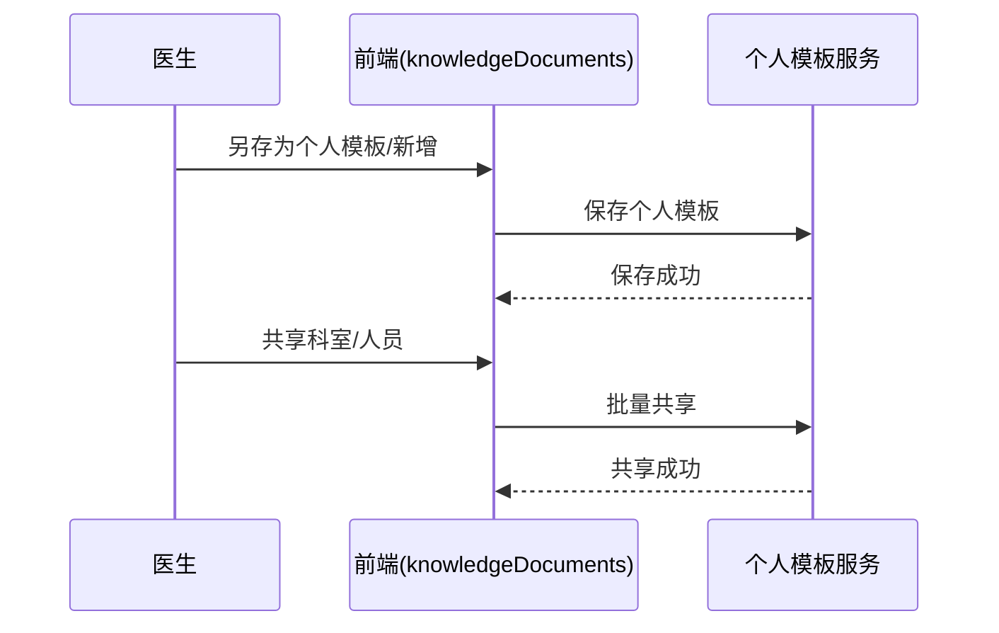

# BLGL-12-MBGL-004 个人模板管理-Spec

> **功能编号**：BLGL-12-MBGL-004
> **文档类型**：功能Spec（业务背景与设计）
> **文档版本**：V1.0
> **编写时间**：2026-08-13
> **编写人**：RACC

---

## 文档索引

本节提供本文档的章节结构索引与关联文档索引，便于读者快速定位与检索。

#### 章节索引

**Spec（研发视角）**

| 章节号 | 章节名称 |
|--------|---------|
| 1、 | 文档概述 |
| 2、 | 功能背景与定位 |
| 3、 | 业务流程设计 |
| 4、 | 数据模型设计 |
| 5、 | 接口契约设计 |
| 6、 | 技术方案设计 |
| 7、 | 测试用例预设计 |
| 8、 | 非功能性要求 |
| 9、 | 依赖与风险 |
| 10、 | 附录 |

**PM-Spec（需求规格）**

| 章节号 | 章节名称 |
|--------|---------|
| 一 | 目标 |
| 二 | 约束 |
| 三 | 验收标准 |
| 四 | 排除范围 |
| 五 | 关键决策记录 |
| 六 | 优先级 |
| 附录 | 填写检查清单 |

**Analyst-Spec（分析规格）**

| 章节号 | 章节名称 |
|--------|---------|
| 一 | 功能编号体系 |
| 二 | 核心业务流程 |
| 三 | 功能规格说明 |
| 四 | 排除范围 |
| 五 | 业务规则清单 |
| 六 | 关联文档 |
| 七 | 待确认问题清单 |
| - | 填写检查清单 | 检查项与完成状态 |

#### 版本历史

| 版本 | 日期 | 变更说明 | 编写人 |
|------|------|---------|--------|
| V1.0 | 2026-08-13 | 初始版本 | RACC |

#### 关联文档索引

| 序号 | 文档名称 | 文档类型 | 版本 | 位置 |
|------|---------|---------|------|------|
| 1 | BLGL-12-MBGL-004_个人模板管理-Spec.md | 功能Spec（业务背景与设计）（本文档） | V1.0 | 本目录 |
| 2 | BLGL-12-MBGL-004_个人模板管理_PM-spec.md | PM-Spec（需求规格） | V0.1 | 本目录 |
| 3 | BLGL-12-MBGL-004_个人模板管理_Analyst-spec.md | Analyst-Spec（分析规格） | V1.0 | 本目录 |
| 4 | BLGL-12-MBGL 12模板管理功能点Spec.md | 功能点Spec（模块级） | v1.0 | 上级目录 |

---

## 1、文档概述

### 1.1、文档目的

本文档旨在明确"个人模板管理"功能（BLGL-12-MBGL-004）的业务背景与设计方案，为需求分析、研发实现、测试验收及评审提供统一的业务上下文、设计口径与决策依据。

**具体目的包括**：

1. 梳理个人模板管理功能的业务由来与历史需求演进脉络，说明"为什么要做"
2. 明确功能的定位边界、目标用户与核心价值，回答"做成什么"
3. 描述功能的业务流程、数据模型、接口契约与技术方案，回答"怎么做"
4. 预设计测试用例并明确非功能性要求、依赖与风险，为研发与验收提供依据
5. 作为 SPEC（功能编号体系、功能详情、业务规则、验收标准等章节）的业务前提与设计输入，保证各层文档业务口径一致。

### 1.2、文档范围

#### 1.2.1 纳入范围

本文档覆盖个人模板管理的完整业务背景与设计，包括：

- 个人模板查询、新增、编辑、删除、转科室、模板树管理
- 个人模板共享（共享科室/取消共享、共享给科室内人员）
- 个人模板版本管理、一键升级、复制
- 另存为个人模板、无患者创建个人模板。

#### 1.2.2 排除范围

本文档不涉及以下内容（详见其他功能点或模块）：

- 个人模板审核（多级审核流程配置）——归属 BLGL-12-MBGL-005 个人模板审核
- 成套模板管理——归属 BLGL-12-MBGL-006 成套模板管理
- 知识文档管理/审核/发布——归属 BLGL-12-MBGL-001/002/003。

### 1.3、术语定义

| 术语 | 定义 |
|------|------|
| 个人模板 | 医生个人创建维护的模板，业务范围类型 399017158 |
| 门诊个人模板 / 住院个人模板 | 门诊/住院医生个人模板，399464665 |
| 共享 | 个人模板共享给科室或科室内人员 |
| 转科室 | 个人模板转为科室模板，提交审核 |
| 另存为个人模板 | 从病历右键另存为个人模板 |
| 版本管理 | 个人模板升级版本记录、历史版本查看复制 |

### 1.4、阅读指南

- **章节关系**：第1~2章为阅读铺垫与业务全貌（背景、定位、用户、价值）；第3~10章为设计实现层（流程、数据、接口、技术、测试、非功能、依赖风险、附录），可直接用于研发与测试。与 Analyst-Spec、PM-Spec 的详细规则/验收口径互相引用，保持一致。
- **读者对象**：
 - 产品经理/需求分析师：阅读第1~2章了解业务全貌，据此维护 PM-Spec 与功能清单
 - 研发：阅读第3~6章用于开发实现，第9~10章用于依赖评估与联调
 - 测试：阅读第3章、第7~8章用于用例设计与验收
 - 评审人员：以本文档为业务口径与设计基准，核对各层文档一致性。

### 1.5、参考文档

| 序号 | 文档名称 | 版本/日期 |
|------|---------|
| 1 | 【历史需求】病历模版-0813.xlsx | 2026-08-13 |
| 2 | WiNEX-病历管理_模板管理功能清单_20260403.md | 2026-04-03 |
| 3 | BLGL-12-MBGL-004_个人模板管理_PM-spec.md | V0.1 |
| 4 | BLGL-12-MBGL-004_个人模板管理_Analyst-spec.md | V1.0 |
| 5 | BLGL-12-MBGL 12模板管理功能点Spec.md | v1.0 |

---

## 2、功能背景与定位

### 2.1 功能背景

个人模板管理是住院病历医生个性化模板管理能力，需满足：

- **管理要求**：支持医院模板、科室模板、个人模板三级管理。
- **现状痛点**：
 - 缺少另存个人模板功能，个人模板需按模板分二级菜单
 - 个人模板共享只能共享给创建时所在科室
 - 个人模板需支持无患者情况下创建
 - 出区/出院患者病历需允许另存我的模板。
- **历史需求演进**：从增加个人模板管理→ 个人模板二级菜单→ 无患者创建→ 共享科室→ 版本管理→ 共享科室内人员→ 复制。

### 2.2 功能定位

"个人模板管理"是 WiNEX 病历管理-模板管理 的医生个性化模板能力，定位为：

- **个人模板维护**：查询、新增、编辑、删除、转科室、模板树管理
- **个人模板共享**：共享给科室、共享给科室内人员、取消共享
- **版本与复制**：版本管理、一键升级、复制
- **另存为个人模板**：从病历另存为个人模板，支持无患者创建。

### 2.3 目标用户

| 用户角色 | 主要使用场景 |
|---------|-------------|
| 住院医师 | 创建维护个人模板、另存为个人模板 |
| 被共享医生 | 使用他人共享的个人模板 |

### 2.4 核心价值

| 价值维度 | 价值描述 |
|---------|---------|
| 个性化 | 医生维护个人模板，提升病历书写效率 |
| 协作共享 | 个人模板共享科室/科室内人员 |
| 可追溯 | 个人模板版本管理，升级后内容可恢复 |
| 易用性 | 无患者创建个人模板、出区出院另存 |

---

## 3、业务流程设计（Given/When/Then）

### 3.1 主流程

**Scenario 1: 另存为个人模板**

```gherkin
Given:
 - 医生在病历主界面

When:
 - 右键病历，选择另存为个人模板
 - 选择共享（默认当前科室，支持多选）

Then:
 - 个人模板另存成功，可在个人模板维护界面编辑
```

### 3.2 异常流程

**Scenario 2: 非当前机构模板另存（业务异常）**

```gherkin
Given:
 - 其他机构的个人模板创建病历

When:
 - 右键另存模板

Then:
 - 另存模板菜单置灰，悬浮提示"当前使用的病历模板不是当前机构的模板，不能另存个人模板"
```

**Scenario 3: 共享查询不到未共享模板（数据异常）**

```gherkin
Given:
 - 个人模板未共享

When:
 - 查询个人模板审核

Then:
 - 增加只针对新增人当前科室筛选，共享及未共享的个人模板都能查询出来
```

**Scenario 4: 个人模板升级内容丢失（系统异常）**

```gherkin
Given:
 - 个人模板升级后内容丢失

When:
 - 查看历史版本

Then:
 - 可查看最近3次升级版本记录，复制粘贴历史版本内容到当前模板
```

### 3.3 边界流程

**Scenario 5: 共享给科室内人员（多值）**

```gherkin
Given:
 - 个人模板共享对话框

When:
 - 选择共享给科室内人员，选择科室和人员

Then:
 - 模板共享给指定个人，被共享医生可见
```

**Scenario 6: 无患者创建个人模板（未配置/边界）**

```gherkin
Given:
 - 无患者情况

When:
 - 在个人模板维护界面新增个人模板

Then:
 - 支持无患者创建个人模板，病案首页不能存个人模板
```

---

## 4、数据模型设计

### 4.1 核心数据结构

#### 4.1.1 核心保存请求

⏳ 待确认：个人模板保存请求结构未在资料区中完整给出，待来自 API 契约或数据建模。

#### 4.1.2 核心表/实体

| 表/实体 | 关键字段 | 说明 |
|---------|---------|------|
| 个人模板表 | 模板ID、模板名称、监控类型、业务范围类型、共享科室、版本号 | 个人模板存储 |

> ⏳ 待确认：个人模板表物理表名及字段全集未在资料区明确给出。

### 4.2 状态定义

⏳ 待确认：个人模板状态（待升级/已升级、共享/未共享）未在资料区中作为状态码完整定义。

### 4.3 系统参数定义

| 参数编码 | 参数名称 | 说明 |
|---------|---------|------|
| 业务范围类型-个人模板 | 399017158 | 医生个人模板 |
| 业务范围类型-门诊个人模板 | 399464665 | 门诊医生个人模板 |
| 业务范围类型-住院个人模板 | 399464667 | 住院医生个人模板 |
| 另存个人模板时需清空的元素 | 参数 | 手术记录单另存清空手术时间 |
| 多机构模式个人模板互通的机构 | 参数 | 个人模板多机构互通，默认空 |

---

## 5、接口契约设计

### 5.1 API列表

| 序号 | API名称（代码函数） | 路径 | 方法 | 说明 |
|:----:|---------|------|:----:|------|
| 1 | 根据条件住院个人模板分页列表 | - | POST | 住院个人模板列表查询 |
| 2 | 住院个人模板树 | - | POST | 个人模板树 |
| 3 | 修改住院病历模板 | /inpatient_emr_template/update/by_id | POST | 修改模板 |
| 4 | 病历模板复制接口 | - | POST | 复制模板 |
| 5 | 个人模板批量共享/启用 | - | POST | 个人模板共享/启停 |

### 5.2 接口详细设计

⏳ 待确认：接口完整请求/返回结构、错误码与示例值，待来自 API 契约文档或设计评审。

### 5.3 错误码定义

| 错误码 | 错误信息 | 处理方式 |
|--------|---------|---------|
| ⏳ 待确认 | 当前使用的病历模板不是当前机构的模板，不能另存个人模板 | 另存模板菜单置灰提示 |

> ⏳ 待确认：错误码编码值未在资料区中提供，待来自 API 契约。

---

## 6、技术方案设计

### 6.1 页面路径

- **页面路径**: winning-webui-emr-template/src/views/EmrTemplate/knowledgeDocuments.vue（个人模板）、knowledgeDocumentsDetails.vue（个人模板详情）
- **核心逻辑模块**: EmrPersonalTemplateController（个人模板）

### 6.2 技术栈

| 类别 | 技术 | 版本 |
|------|------|------|
| 前端框架 | Vue（winning-webui-emr-template） | ⏳ 待确认 |
| 后端框架 | Java Spring Boot（winning-mas-emr-template） | ⏳ 待确认 |

### 6.3 关键技术点

- 个人模板共享给科室内人员时新建 INP_EMR_MRT_SET_DOCT 表保存目标医生关联记录
- 个人模板一键升级，左侧展示当前模板，右侧展示升级后样式预览，支持复制
- 多机构模式个人模板互通，模板检索下放增加机构选择。

### 6.4 部署方案

⏳ 待确认：部署方案未在资料区中提供。

---

## 7、测试用例预设计

### 7.1 功能测试

| 用例编号 | 测试场景 | Given | When | Then |
|---------|---------|-------|--------|
| TC-001 | 另存个人模板 | 医生在病历主界面 | 右键另存为个人模板 | 另存成功可编辑 |
| TC-002 | 共享科室 | 个人模板 | 选择共享科室多选 | 共享成功 |

### 7.2 边界测试

| 用例编号 | 测试场景 | Given | When | Then |
|---------|---------|-------|--------|
| TC-003 | 无患者创建 | 无患者 | 新增个人模板 | 支持创建 |
| TC-004 | 共享科室内人员 | 个人模板 | 选择科室人员 | 被共享医生可见 |

### 7.3 异常测试

| 用例编号 | 测试场景 | Given | When | Then |
|---------|---------|-------|--------|
| TC-005 | 非当前机构另存 | 其他机构模板 | 右键另存 | 菜单置灰提示 |
| TC-006 | 升级内容丢失 | 个人模板升级 | 查看历史版本 | 可复制恢复 |

### 7.4 性能测试

| 用例编号 | 测试场景 | 指标 |
|---------|---------|
| TC-007 | 个人模板列表查询 |

---

## 8、非功能性要求

### 8.1 性能要求

| 指标 | 要求 |
|------|------|
| 个人模板列表查询响应时间 | ⏳ 待确认 |

### 8.2 安全要求

| 要求 | 说明 |
|------|------|
| 权限控制 | 个人模板按角色控制菜单显示 |

**医疗行业特殊要求**

| 要求 | 说明 |
|------|------|
| 痕迹清空 | 另存个人模板时清空痕迹 |

### 8.3 可用性要求

| 指标 | 要求值 |
|------|--------|
| 可用性 | ⏳ 待确认 |

### 8.4 兼容性要求

| 类型 | 要求 |
|------|------|
| 多机构互通 | 个人模板多机构互通机构配置 |

---

## 9、依赖与风险

### 9.1 外部依赖

| 依赖项 | 说明 |
|--------|------|
| 主数据 | 人员信息、机构信息 |

### 9.2 风险项

| 风险项 | 等级 | 说明 | 应对方案 |
|--------|------|------|---------|
| 个人模板升级内容丢失 | 中 | 升级后内容无法恢复 | 版本管理，可复制历史版本 |
| 多机构模板另存越界 | 中 | 其他机构模板被另存 | 另存菜单置灰 |

---

## 10、附录

### 10.1 流程图



### 10.2 时序图



### 10.3 参考文档

- WiNEX-病历管理_模板管理功能清单_20260403.md（第2.4节 个人模板管理）
- 【历史需求】病历模版-0813.xlsx（、616145、289424、860185、677639、239284、1567215、1625284、1545348、1545643、596116、347848、1390642、349182）
- BLGL-12-MBGL 12模板管理功能点Spec.md（v1.0）
- 关联Spec: BLGL-12-MBGL-005_个人模板审核-Spec.md（个人模板转科室审核）

---

## 填写检查清单

| 序号 | 检查项 | 是否完成 |
|:----:|--------|:--------:|
| 1 | 章节索引与正文章节一致 | ✅ |
| 2 | 版本历史记录完整 | ✅ |
| 3 | 关联文档索引已登记全部Spec | ✅ |
| 4 | 文档目的明确回答"为什么做/做成什么/怎么做" | ✅ |
| 5 | 纳入范围/排除范围清晰 | ✅ |
| 6 | 术语定义覆盖关键概念，从资料区可溯源 | ✅ |
| 7 | 参考文档已登记 | ✅ |
| 8 | 功能背景基于法规/规范/需求来源组织 | ✅ |
| 9 | 功能定位体现业务价值（3~5个定位点） | ✅ |
| 10 | 目标用户角色覆盖完整，在需求原文中有出处 | ✅ |
| 11 | 核心价值可陈述，与 Phase 1 口径一致 | ✅ |
| 12 | 业务流程：主流程≥1、异常≥3、边界≥2，Given/When/Then 具体 | ✅ |
| 13 | 数据模型：字段/表/状态/参数可溯源（概念ID/表名/参数编码） | ✅ |
| 14 | 接口契约：API列表+详细设计+错误码齐全（资料区有信息时）或标记待确认 | ✅ |
| 15 | 技术方案：页面路径/技术栈/关键点/部署方案（资料区有信息时）或标记待确认 | ✅ |
| 16 | 测试用例：功能/边界/异常/性能覆盖，与第3章场景对应 | ✅ |
| 17 | 非功能性要求：性能/安全/可用性/兼容性指标可量化或标记待确认 | ✅ |
| 18 | 依赖与风险：外部依赖登记完整，风险有具体应对方案或标记待确认 | ✅ |
| 19 | 附录：流程图/时序图与正文流程一致 | ✅ |
| 20 | 全文无占位符 `< >` 残留 | ✅ |
| 21 | 全文陈述可溯源至资料区，无来源的已标记 ⏳ | ✅ |
| 22 | 人工审核确认完成 | ⏳ 待确认 |

---

**文档状态**：⬜ 待审核
**维护责任**：RACC
**下次更新**：根据评审反馈优化
