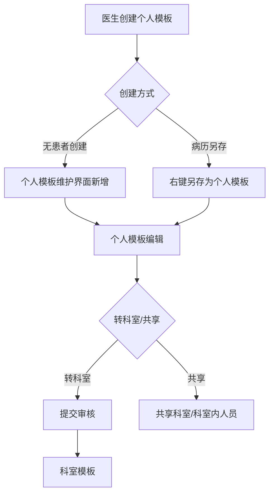
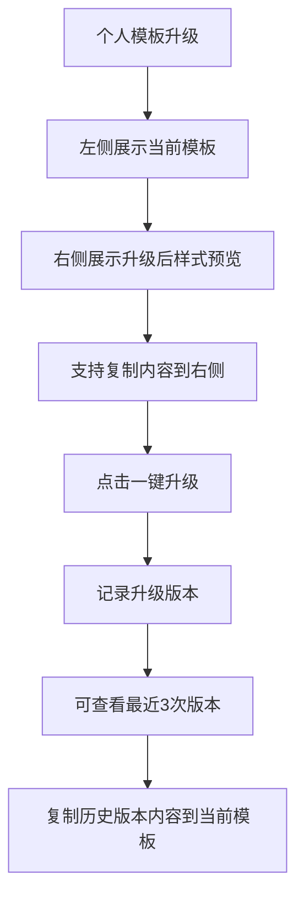

# BLGL-12-MBGL-004 个人模板管理_ Analyst - Spec

> **需求编号**：BLGL-12-MBGL-004
> **父需求**：BLGL-12-MBGL
> **关联PM Spec**：BLGL-12-MBGL-004_个人模板管理_PM-spec.md
> **Spec版本**：V1.0
> **编写时间**：2026-08-13
> **编写人**：需求分析师

---

## 一、功能编号体系

> 使用带父子层级的 `<功能编号>-ID` 编号，便于追溯和讨论。

### 1.1 功能层级结构

```
BLGL-12-MBGL-004: 个人模板管理
 ├─ BLGL-12-MBGL-004-01: 个人模板维护（增删改查/转科室/模板树）
 ├─ BLGL-12-MBGL-004-02: 个人模板共享
 └─ BLGL-12-MBGL-004-03: 个人模板版本与复制
```

### 1.2 功能编号表

| REQ-ID | 功能名称 | 类型 | 优先级 | 说明 |
|--------|---------|------|--------|
| BLGL-12-MBGL-004-01 | 个人模板维护（增删改查/转科室/模板树） | 功能 | P1 | 个人模板查询、新增、编辑、删除、转科室、模板树 |
| BLGL-12-MBGL-004-02 | 个人模板共享 | 功能 | P1 | 共享给科室、共享给科室内人员、取消共享 |
| BLGL-12-MBGL-004-03 | 个人模板版本与复制 | 功能 | P1 | 版本管理、一键升级、复制 |

---

## 二、核心业务流程

### 2.1 个人模板创建与共享流程



### 2.2 个人模板版本升级流程



---

## 三、功能规格说明

---

### BLGL-12-MBGL-004-01: 个人模板维护（增删改查/转科室/模板树）

#### 3.1.1 功能概述

查询当前用户个人模板列表（住院个人模板、门诊个人模板分类），新增、编辑、删除个人模板，转科室，个人模板树管理。

#### 3.1.2 用户角色

| 角色 | 使用场景 | 权限要求 | 操作频率 |
|------|---------|---------|---------|
| 住院医师 | 创建维护个人模板 | 有个人模板权限 | 高频 |

#### 3.1.3 业务流程（Given/When/Then）

##### 主流程（至少 1 个）

**Scenario 1: 无患者创建个人模板**

```gherkin
Given:
 - 无患者情况

When:
 - 在"日常管理/模板管理/个人模板维护"界面点击新增
 - 选择全院或科室模板
 - 编辑后另存为我的模板

Then:
 - 个人模板创建成功，支持编辑
```

##### 异常流程（至少 3 个）

**Scenario 2: 病案首页不能存个人模板（业务异常）**

```gherkin
Given:
 - 医生尝试存病案首页为个人模板

When:
 - 另存为个人模板

Then:
 - 病案首页不能存个人模板
```

**Scenario 3: 手术记录单另存清空时间（数据异常）**

```gherkin
Given:
 - 手术记录单另存为模板

When:
 - 另存个人模板

Then:
 - 清空手术开始时间和手术结束时间，不保存到模板内
```

**Scenario 4: 个人模板升级（系统异常）**

```gherkin
Given:
 - 个人模板升级后元素外内容不能自动升级带入

When:
 - 查看升级前后模板

Then:
 - 左侧展示当前模板，右侧展示升级后样式预览，支持复制
```

##### 边界流程（至少 2 个）

**Scenario 5: 转科室（多值）**

```gherkin
Given:
 - 个人模板

When:
 - 个人模板转科室

Then:
 - 转为科室模板，支持提交审核流程
```

**Scenario 6: 个人模板树管理（边界）**

```gherkin
Given:
 - 个人模板目录树

When:
 - 管理个人模板目录树

Then:
 - 支持新增、编辑、删除目录节点
```

#### 3.1.4 数据字段定义

| 字段名 | 类型 | 必填 | 默认值 | 取值范围 | 说明 | 概念ID |
|--------|------|------|--------|---------|------|--------|
| 业务范围类型 | - | - | - | 399017158 | 个人模板/门诊/住院 | ⏳ 待确认 |
| 监控类型 | - | - | - | - | 个人模板监控类型取母模板 | ⏳ 待确认 |

#### 3.1.5 验收标准

| AC编号 | 验收标准 | 对应REQ-ID | 验证方法 | 验证场景 |
|--------|---------|-----------|--------|
| AC-001 | 医生可新增/编辑/删除个人模板，支持无患者创建 | BLGL-12-MBGL-004-01 | 功能测试 | Scenario 1 |
| AC-002 | 病历右键另存为个人模板，另存后可编辑 | BLGL-12-MBGL-004-01 | 功能测试 | - |
| AC-003 | 手术记录单另存清空手术时间 | BLGL-12-MBGL-004-01 | 功能测试 | Scenario 3 |

---

### BLGL-12-MBGL-004-02: 个人模板共享

#### 3.2.1 功能概述

个人模板共享给科室（多选），共享给科室内人员（多选），取消共享删除勾选科室。

#### 3.2.2 用户角色

| 角色 | 使用场景 | 权限要求 | 操作频率 |
|------|---------|---------|---------|
| 住院医师 | 共享个人模板 | 当前登录人所有有权限科室 | 中频 |
| 被共享医生 | 使用共享模板 | 无 | 中频 |

#### 3.2.3 业务流程（Given/When/Then）

##### 主流程（至少 1 个）

**Scenario 1: 共享给科室**

```gherkin
Given:
 - 个人模板

When:
 - 点击共享，选择当前登录人所有有权限的科室，支持多选

Then:
 - 个人模板共享给所选科室
```

##### 异常流程（至少 3 个）

**Scenario 2: 共享给科室内人员（业务异常）**

```gherkin
Given:
 - 个人模板共享对话框

When:
 - 选择共享给科室内人员，选择科室和人员

Then:
 - 共享给指定个人，被共享医生可见
```

**Scenario 3: 共享查询不到未共享模板（数据异常）**

```gherkin
Given:
 - 个人模板未共享

When:
 - 查询个人模板审核

Then:
 - 增加只针对新增人当前科室筛选，共享及未共享都能查出
```

**Scenario 4: 取消共享（系统异常）**

```gherkin
Given:
 - 已共享个人模板

When:
 - 取消共享

Then:
 - 支持删除勾选的科室
```

##### 边界流程（至少 2 个）

**Scenario 5: 历史共享迁移（边界）**

```gherkin
Given:
 - 历史共享的模板数据

When:
 - 系统升级

Then:
 - 历史共享数据支持迁移，能继续使用
```

**Scenario 6: 共享模板重复共享（边界）**

```gherkin
Given:
 - 同一模板已共享给同一目标

When:
 - 重复共享

Then:
 - 给出友好提示，不产生重复记录
```

#### 3.2.4 数据字段定义

| 字段名 | 类型 | 必填 | 默认值 | 取值范围 | 说明 | 概念ID |
|--------|------|------|--------|---------|------|--------|
| 共享目标医生标识 | List | - | - | employeeId/employeeNo | 共享目标医生 | ⏳ 待确认 |
| 共享科室 | - | - | - | - | 共享科室 | ⏳ 待确认 |

#### 3.2.5 验收标准

| AC编号 | 验收标准 | 对应REQ-ID | 验证方法 | 验证场景 |
|--------|---------|-----------|--------|
| AC-004 | 个人模板共享给科室/科室内人员，被共享者可见 | BLGL-12-MBGL-004-02 | 功能测试 | Scenario 1、2 |
| AC-005 | 取消共享删除勾选科室 | BLGL-12-MBGL-004-02 | 功能测试 | Scenario 4 |

---

### BLGL-12-MBGL-004-03: 个人模板版本与复制

#### 3.3.1 功能概述

个人模板版本号管理（最近3次升级版本记录），一键升级，个人模板复制。

#### 3.3.2 用户角色

| 角色 | 使用场景 | 权限要求 | 操作频率 |
|------|---------|---------|---------|
| 住院医师 | 版本管理、复制模板 | 有个人模板权限 | 低频 |

#### 3.3.3 业务流程（Given/When/Then）

##### 主流程（至少 1 个）

**Scenario 1: 查看历史版本**

```gherkin
Given:
 - 个人模板已升级

When:
 - 点击"升级版本"按钮

Then:
 - 查看最近3次升级版本记录
 - 允许将历史版本内容复制粘贴到当前模板
```

##### 异常流程（至少 3 个）

**Scenario 2: 待升级模板隐藏按钮（业务异常）**

```gherkin
Given:
 - 当前个人模板是待升级状态

When:
 - 进入维护界面

Then:
 - 待升级的个人模板隐藏"升级版本"按钮
```

**Scenario 3: 普通编辑不记录版本（数据异常）**

```gherkin
Given:
 - 医生普通编辑保存个人模板

When:
 - 编辑保存

Then:
 - 普通的编辑保存不需要记录版本
```

**Scenario 4: 复制模板（系统异常）**

```gherkin
Given:
 - 个人模板

When:
 - 点击复制按钮

Then:
 - 复制为新的个人模板，若存在审核流程需重新审核
```

##### 边界流程（至少 2 个）

**Scenario 5: 复制后重新审核（边界）**

```gherkin
Given:
 - 个人模板复制后

When:
 - 使用复制模板

Then:
 - 若存在审核流程需重新审核才能使用
```

**Scenario 6: 一键升级（边界）**

```gherkin
Given:
 - 个人模板升级前

When:
 - 点击一键升级

Then:
 - 个人模板变成右侧升级后样式
```

#### 3.3.4 数据字段定义

| 字段名 | 类型 | 必填 | 默认值 | 取值范围 | 说明 | 概念ID |
|--------|------|------|--------|---------|------|--------|
| 版本号 | - | - | - | - | 个人模板升级版本 | ⏳ 待确认 |

#### 3.3.5 验收标准

| AC编号 | 验收标准 | 对应REQ-ID | 验证方法 | 验证场景 |
|--------|---------|-----------|--------|
| AC-006 | 个人模板升级后可查看最近3次版本，复制历史内容 | BLGL-12-MBGL-004-03 | 功能测试 | Scenario 1 |
| AC-007 | 个人模板复制后需重新审核才能使用 | BLGL-12-MBGL-004-03 | 功能测试 | Scenario 5 |

---

## 四、排除范围

本需求不包含以下功能项：

1. **个人模板审核** - 归属 BLGL-12-MBGL-005 个人模板审核
2. **成套模板管理** - 归属 BLGL-12-MBGL-006 成套模板管理
3. **知识文档管理/审核/发布** - 归属 BLGL-12-MBGL-001/002/003

---

## 五、业务规则清单

| 规则ID | 规则名称 | 规则描述 | 优先级 |
|--------|---------|---------|--------|
| BR-001 | 三级管理 | 支持医院模板、科室模板、个人模板三级管理 | P0 |
| BR-002 | 病案首页限制 | 病案首页不能存个人模板 | P1 |
| BR-003 | 共享范围 | 共享给科室/科室内人员，历史数据迁移 | P1 |
| BR-004 | 另存清空 | 手术记录单另存清空手术时间 | P1 |
| BR-005 | 痕迹清空 | 另存个人模板时清空痕迹 | P1 |
| BR-006 | 版本记录 | 升级记录版本，普通编辑不记录 | P1 |

---

## 六、关联文档

| 文档类型 | 文档路径 | 说明 |
|---------|---------|
| 功能点Spec | BLGL-12-MBGL 12模板管理功能点Spec.md（v1.0，上级目录） | Phase 1 功能点索引 |
| PM spec | 本目录 BLGL-12-MBGL-004_个人模板管理_PM-spec.md（V0.1） | PM 产出的 Spec 文档 |
| -Spec | 本目录 BLGL-12-MBGL-004_个人模板管理-Spec.md（V1.0） | 业务背景与目标 Spec |
| data-model.md | 待产出 | 架构师产出的数据建模文档 |
| design.md | 待产出 | 架构师产出的技术方案文档 |
| api-contract.md | 待产出 | 开发经理产出的 API 契约文档 |

---

## 七、待确认问题清单

| 编号 | 问题描述 | 缺失信息 | 影响范围 | 建议补充方 |
|------|---------|---------|--------|
| Q-001 | 个人模板表物理表名及字段全集未给出 | 表名与字段 | 数据模型设计 | 架构师 |
| Q-002 | 个人模板保存/共享请求结构未给出 | 接口契约字段 | 接口契约设计 | 开发经理 |
| Q-003 | 个人模板状态（待升级/已升级、共享/未共享）状态码未定义 | 状态码 | 数据模型 | 架构师 |
| Q-004 | 个人模板列表查询性能指标未提供 | 性能指标 | 非功能性要求 | 产品经理/架构师 |
| Q-005 | 个人模板相关概念ID未给出 | 概念ID | 数据字段定义 | 需求分析师 |

---

## 填写检查清单

| 序号 | 检查项 | 是否完成 |
|:----:|--------|:--------:|
| 1 | 功能编号带父子层级 | ✅ |
| 2 | 每个 REQ-ID 有功能概述和用户角色 | ✅ |
| 3 | 主流程至少 1 个 Given/When/Then 场景 | ✅ |
| 4 | 异常流程至少 3 个 Given/When/Then 场景 | ✅ |
| 5 | 边界流程至少 2 个 Given/When/Then 场景 | ✅ |
| 6 | 每个 Given/When/Then 内容具体，不模糊 | ✅ |
| 7 | 数据字段定义完整（字段名、类型、必填、说明、概念ID） | ✅ |
| 8 | 验收标准 AC 编号独立，可验证 | ✅ |
| 9 | 验收标准无"功能正常"等模糊表述 | ✅ |
| 10 | 排除范围明确列出 | ✅ |
| 11 | 业务规则清单列出所有规则，每条标注来源 | ✅ |
| 12 | 流程图使用 Mermaid 格式（≥2 个） | ✅ |
| 13 | 关联文档索引包含 Phase 1 功能点Spec | ✅ |
| 14 | 待确认问题清单汇总了全文所有 ⏳ 项 | ✅ |
| 15 | 全文无占位符 `< >` 残留 | ✅ |
| 16 | 全文陈述可溯源至资料区（S1~S10 溯源核查） | ✅ |
| 17 | 人工审核确认完成 | ⏳ 待确认 |

---

**文档状态**：⬜ 待审核
**维护责任**：需求分析师规范组
**下次更新**：根据评审反馈优化

---

## 版本历史

| 版本 | 日期 | 变更说明 | 编写人 |
|------|------|---------|--------|
| V1.0 | 2026-08-13 | 初始版本 | 需求分析师 |
