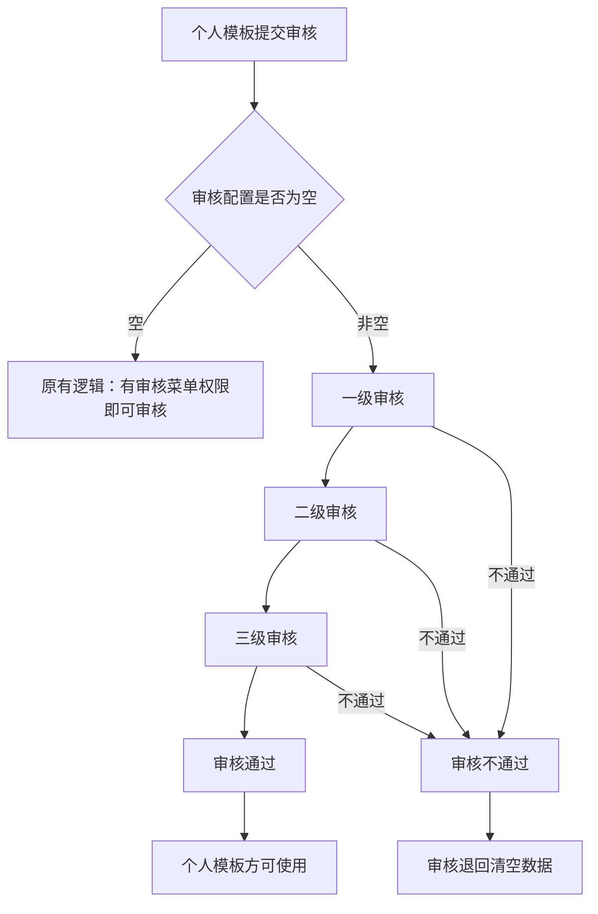
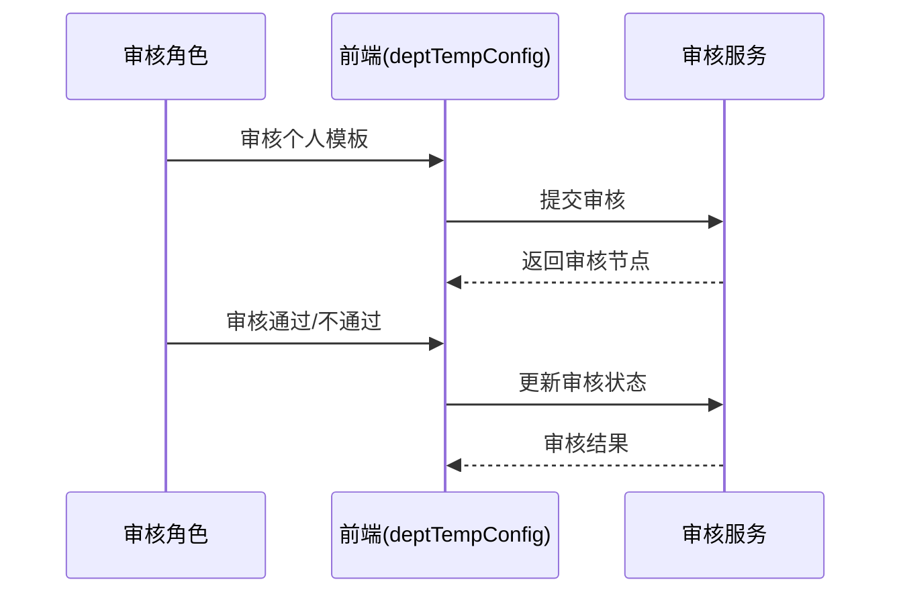

# BLGL-12-MBGL-005 个人模板审核-Spec

> **功能编号**：BLGL-12-MBGL-005
> **文档类型**：功能Spec（业务背景与设计）
> **文档版本**：V1.0
> **编写时间**：2026-08-13
> **编写人**：RACC

---

## 文档索引

本节提供本文档的章节结构索引与关联文档索引，便于读者快速定位与检索。

#### 章节索引

**Spec（研发视角）**

| 章节号 | 章节名称 |
|--------|---------|
| 1、 | 文档概述 |
| 2、 | 功能背景与定位 |
| 3、 | 业务流程设计 |
| 4、 | 数据模型设计 |
| 5、 | 接口契约设计 |
| 6、 | 技术方案设计 |
| 7、 | 测试用例预设计 |
| 8、 | 非功能性要求 |
| 9、 | 依赖与风险 |
| 10、 | 附录 |

**PM-Spec（需求规格）**

| 章节号 | 章节名称 |
|--------|---------|
| 一 | 目标 |
| 二 | 约束 |
| 三 | 验收标准 |
| 四 | 排除范围 |
| 五 | 关键决策记录 |
| 六 | 优先级 |
| 附录 | 填写检查清单 |

**Analyst-Spec（分析规格）**

| 章节号 | 章节名称 |
|--------|---------|
| 一 | 功能编号体系 |
| 二 | 核心业务流程 |
| 三 | 功能规格说明 |
| 四 | 排除范围 |
| 五 | 业务规则清单 |
| 六 | 关联文档 |
| 七 | 待确认问题清单 |
| - | 填写检查清单 | 检查项与完成状态 |

#### 版本历史

| 版本 | 日期 | 变更说明 | 编写人 |
|------|------|---------|--------|
| V1.0 | 2026-08-13 | 初始版本 | RACC |

#### 关联文档索引

| 序号 | 文档名称 | 文档类型 | 版本 | 位置 |
|------|---------|---------|------|------|
| 1 | BLGL-12-MBGL-005_个人模板审核-Spec.md | 功能Spec（业务背景与设计）（本文档） | V1.0 | 本目录 |
| 2 | BLGL-12-MBGL-005_个人模板审核_PM-spec.md | PM-Spec（需求规格） | V0.1 | 本目录 |
| 3 | BLGL-12-MBGL-005_个人模板审核_Analyst-spec.md | Analyst-Spec（分析规格） | V1.0 | 本目录 |
| 4 | BLGL-12-MBGL 12模板管理功能点Spec.md | 功能点Spec（模块级） | v1.0 | 上级目录 |

---

## 1、文档概述

### 1.1、文档目的

本文档旨在明确"个人模板审核"功能（BLGL-12-MBGL-005）的业务背景与设计方案，为需求分析、研发实现、测试验收及评审提供统一的业务上下文、设计口径与决策依据。

**具体目的包括**：

1. 梳理个人模板审核功能的业务由来与历史需求演进脉络，说明"为什么要做"
2. 明确功能的定位边界、目标用户与核心价值，回答"做成什么"
3. 描述功能的业务流程、数据模型、接口契约与技术方案，回答"怎么做"
4. 预设计测试用例并明确非功能性要求、依赖与风险，为研发与验收提供依据
5. 作为 SPEC（功能编号体系、功能详情、业务规则、验收标准等章节）的业务前提与设计输入，保证各层文档业务口径一致。

### 1.2、文档范围

#### 1.2.1 纳入范围

本文档覆盖个人模板审核的完整业务背景与设计，包括：

- 个人模板审核配置、审核角色配置、审核权限配置、审核流程启用
- 个人模板多级审核流程（一级/二级/三级审核，每级可配置审核角色）
- 个人模板审核查询优化（未共享模板可查询、区分我的/共享模板）。

#### 1.2.2 排除范围

本文档不涉及以下内容（详见其他功能点或模块）：

- 个人模板管理（增删改查/共享/版本）——归属 BLGL-12-MBGL-004 个人模板管理
- 知识文档审核（医院/科室模板审核）——归属 BLGL-12-MBGL-002 知识文档审核
- 成套模板管理——归属 BLGL-12-MBGL-006 成套模板管理。

### 1.3、术语定义

| 术语 | 定义 |
|------|------|
| 个人模板审核 | 个人模板转科室需经审核（一级/二级/三级） |
| 多级审核流程 | 一级、二级、三级审核节点，每级可配置审核角色 |
| 审核配置 | 配置个人模板审核流程、审核角色、审核权限 |
| 待我审核 | 审核列表"待审核"状态下的审核筛选，默认勾选 |

### 1.4、阅读指南

- **章节关系**：第1~2章为阅读铺垫与业务全貌（背景、定位、用户、价值）；第3~10章为设计实现层（流程、数据、接口、技术、测试、非功能、依赖风险、附录），可直接用于研发与测试。与 Analyst-Spec、PM-Spec 的详细规则/验收口径互相引用，保持一致。
- **读者对象**：
 - 产品经理/需求分析师：阅读第1~2章了解业务全貌，据此维护 PM-Spec 与功能清单
 - 研发：阅读第3~6章用于开发实现，第9~10章用于依赖评估与联调
 - 测试：阅读第3章、第7~8章用于用例设计与验收
 - 评审人员：以本文档为业务口径与设计基准，核对各层文档一致性。

### 1.5、参考文档

| 序号 | 文档名称 | 版本/日期 |
|------|---------|
| 1 | 【历史需求】病历模版-0813.xlsx | 2026-08-13 |
| 2 | WiNEX-病历管理_模板管理功能清单_20260403.md | 2026-04-03 |
| 3 | BLGL-12-MBGL-005_个人模板审核_PM-spec.md | V0.1 |
| 4 | BLGL-12-MBGL-005_个人模板审核_Analyst-spec.md | V1.0 |
| 5 | BLGL-12-MBGL 12模板管理功能点Spec.md | v1.0 |

---

## 2、功能背景与定位

### 2.1 功能背景

个人模板审核是住院病历个人模板规范化管理的关键环节，需满足：

- **管理要求**：个人模板转科室需经审核。
- **现状痛点**：
 - 个人模板未共享则查询不到，需优化查询
 - 个人模板审核需支持多级审核流程配置。
- **历史需求演进**：从个人模板审核配置（功能清单）→ 多级审核流程配置→ 审核查询优化→ 区分我的/共享模板。

### 2.2 功能定位

"个人模板审核"是 WiNEX 病历管理-模板管理 的个人模板规范化审核能力，定位为：

- **多级审核流程配置**：一级/二级/三级审核节点，每级可配置审核角色
- **审核角色权限配置**：按角色、职称、职务设置审核人，支持联合审核
- **审核流程启用**：启用或禁用个人模板审核流程
- **审核查询优化**：未共享模板可查询，区分我的/共享模板。

### 2.3 目标用户

| 用户角色 | 主要使用场景 |
|---------|-------------|
| 科室模板管理员 | 配置个人模板审核流程 |
| 审核角色（科主任等） | 审核个人模板 |

### 2.4 核心价值

| 价值维度 | 价值描述 |
|---------|---------|
| 规范化 | 个人模板多级审核，规范模板管理 |
| 灵活性 | 审核角色/流程灵活配置 |
| 可追溯 | 审核进展查看 |
| 易用性 | 未共享模板可查询 |

---

## 3、业务流程设计（Given/When/Then）

### 3.1 主流程

**Scenario 1: 个人模板多级审核**

```gherkin
Given:
 - 参数 COMMON015 配置了个人模板审核
 - 审核配置数据不为空

When:
 - 医生提交个人模板审核
 - 一级审核角色审核
 - 二级审核角色审核
 - 三级审核角色审核

Then:
 - 全部审核完成后个人模板方可使用
```

### 3.2 异常流程

**Scenario 2: 审核配置校验失败（业务异常）**

```gherkin
Given:
 - 一级审核未设置值，二级审核设置了值

When:
 - 保存审核配置

Then:
 - 不能保存成功，提示"请完成前一个节点配置"
```

**Scenario 3: 审核配置为空（数据异常）**

```gherkin
Given:
 - 审核配置为空，未设置

When:
 - 提交个人模板审核

Then:
 - 走原有逻辑，有个人模板审核菜单权限即可审核
```

**Scenario 4: 审核退回清空（系统异常）**

```gherkin
Given:
 - 审核退回

When:
 - 退回审核

Then:
 - 审核退回清空数据
```

### 3.3 边界流程

**Scenario 5: 待我审核筛选（多值）**

```gherkin
Given:
 - 个人模板审核列表，状态选"待审核"

When:
 - 增加审核筛选

Then:
 - 默认勾选"待我审核"
```

**Scenario 6: 区分我的/共享模板（未配置/边界）**

```gherkin
Given:
 - 个人模板审核菜单

When:
 - 按模板范围查询

Then:
 - 查询分类：个人模板/科室模板，默认为空，选择后支持取消
```

---

## 4、数据模型设计

### 4.1 核心数据结构

#### 4.1.1 核心保存请求

⏳ 待确认：审核配置保存请求结构未在资料区中完整给出，待来自 API 契约或数据建模。

#### 4.1.2 核心表/实体

| 表/实体 | 关键字段 | 说明 |
|---------|---------|------|
| 个人模板审核配置 | 审核节点、审核角色 | 审核流程配置 |

> ⏳ 待确认：个人模板审核配置表物理表名及字段全集未在资料区明确给出。

### 4.2 状态定义

| 状态码 | 状态名称 | 说明 |
|--------|---------|------|
| 152780 | 审核通过 | 审核通过状态 |
| 152781 | 审核不通过 | 审核不通过状态 |

### 4.3 系统参数定义

| 参数编码 | 参数名称 | 说明 |
|---------|---------|------|
| COMMON015 | 个人模板需要审核的业务节点 | 配置"另存我的模板"时个人和共享模板都需审核 |
| 审核角色-业务科主任 | 399296993 | 科主任角色 |
| 审核角色-数据质量管理员 | 862135 | 数据质量管理角色 |
| 审核角色-信息科管理员 | 399297329 | 信息科管理角色 |

---

## 5、接口契约设计

### 5.1 API列表

| 序号 | API名称（代码函数） | 路径 | 方法 | 说明 |
|:----:|---------|------|:----:|------|
| 1 | 查询审核配置表数据 | - | POST | 查询审核配置 |
| 2 | 修改审核配置表数据 | - | POST | 修改审核配置 |
| 3 | 查询模板审批节点信息 | - | POST | 审批节点查询 |

### 5.2 接口详细设计

⏳ 待确认：接口完整请求/返回结构、错误码与示例值，待来自 API 契约文档或设计评审。

### 5.3 错误码定义

| 错误码 | 错误信息 | 处理方式 |
|--------|---------|---------|
| ⏳ 待确认 | 请完成前一个节点配置 | 审核配置保存校验失败提示 |

> ⏳ 待确认：错误码编码值未在资料区中提供，待来自 API 契约。

---

## 6、技术方案设计

### 6.1 页面路径

- **页面路径**: winning-webui-emr-template/src/views/templateAuditMng/deptTempConfig/index.vue（个人模板审核配置）
- **核心逻辑模块**: EmrTemplateReviewController（审核）、EmrTemplateSettingController（审核配置）

### 6.2 技术栈

| 类别 | 技术 | 版本 |
|------|------|------|
| 前端框架 | Vue（winning-webui-emr-template） | ⏳ 待确认 |
| 后端框架 | Java Spring Boot（winning-mas-emr-template） | ⏳ 待确认 |

### 6.3 关键技术点

- 多级审核节点：一级角色审批权限查审批节点为空的数据，二级查审批节点为1的数据，三级查审批节点为2的数据
- 审核退回清空数据。

### 6.4 部署方案

⏳ 待确认：部署方案未在资料区中提供。

---

## 7、测试用例预设计

### 7.1 功能测试

| 用例编号 | 测试场景 | Given | When | Then |
|---------|---------|-------|--------|
| TC-001 | 多级审核 | 审核配置非空 | 提交个人模板 | 一级二级三级审核完成 |
| TC-002 | 审核配置 | 配置审核角色 | 保存配置 | 配置成功 |

### 7.2 边界测试

| 用例编号 | 测试场景 | Given | When | Then |
|---------|---------|-------|--------|
| TC-003 | 待我审核 | 状态选待审核 | 审核筛选 | 默认勾选待我审核 |
| TC-004 | 区分模板 | 个人模板审核菜单 | 按模板范围查询 | 个人/科室模板分类 |

### 7.3 异常测试

| 用例编号 | 测试场景 | Given | When | Then |
|---------|---------|-------|--------|
| TC-005 | 审核配置校验 | 一级未设二级已设 | 保存 | 提示完成前节点 |
| TC-006 | 审核退回 | 退回审核 | 退回 | 清空数据 |

### 7.4 性能测试

| 用例编号 | 测试场景 | 指标 |
|---------|---------|
| TC-007 | 审核列表查询 |

---

## 8、非功能性要求

### 8.1 性能要求

| 指标 | 要求 |
|------|------|
| 审核列表查询响应时间 | ⏳ 待确认 |

### 8.2 安全要求

| 要求 | 说明 |
|------|------|
| 权限控制 | 审核角色按角色、职称、职务设置审核人 |

**医疗行业特殊要求**

| 要求 | 说明 |
|------|------|
| 模板规范化 | 个人模板多级审核规范模板管理 |

### 8.3 可用性要求

| 指标 | 要求值 |
|------|--------|
| 可用性 | ⏳ 待确认 |

### 8.4 兼容性要求

| 类型 | 要求 |
|------|------|
| 配置兼容 | 审核配置为空走原有逻辑 |

---

## 9、依赖与风险

### 9.1 外部依赖

| 依赖项 | 说明 |
|--------|------|
| 主数据 | 审核角色、人员信息 |

### 9.2 风险项

| 风险项 | 等级 | 说明 | 应对方案 |
|--------|------|------|---------|
| 多级审核配置复杂 | 中 | 前面节点未设保存失败 | 校验提示 |

---

## 10、附录

### 10.1 流程图



### 10.2 时序图



### 10.3 参考文档

- WiNEX-病历管理_模板管理功能清单_20260403.md（第2.5节 个人模板审核）
- 【历史需求】病历模版-0813.xlsx（、349182、1467044）
- BLGL-12-MBGL 12模板管理功能点Spec.md（v1.0）
- 关联Spec: BLGL-12-MBGL-004_个人模板管理-Spec.md（个人模板转科室审核）

---

## 填写检查清单

| 序号 | 检查项 | 是否完成 |
|:----:|--------|:--------:|
| 1 | 章节索引与正文章节一致 | ✅ |
| 2 | 版本历史记录完整 | ✅ |
| 3 | 关联文档索引已登记全部Spec | ✅ |
| 4 | 文档目的明确回答"为什么做/做成什么/怎么做" | ✅ |
| 5 | 纳入范围/排除范围清晰 | ✅ |
| 6 | 术语定义覆盖关键概念，从资料区可溯源 | ✅ |
| 7 | 参考文档已登记 | ✅ |
| 8 | 功能背景基于法规/规范/需求来源组织 | ✅ |
| 9 | 功能定位体现业务价值（3~5个定位点） | ✅ |
| 10 | 目标用户角色覆盖完整，在需求原文中有出处 | ✅ |
| 11 | 核心价值可陈述，与 Phase 1 口径一致 | ✅ |
| 12 | 业务流程：主流程≥1、异常≥3、边界≥2，Given/When/Then 具体 | ✅ |
| 13 | 数据模型：字段/表/状态/参数可溯源（概念ID/表名/参数编码） | ✅ |
| 14 | 接口契约：API列表+详细设计+错误码齐全（资料区有信息时）或标记待确认 | ✅ |
| 15 | 技术方案：页面路径/技术栈/关键点/部署方案（资料区有信息时）或标记待确认 | ✅ |
| 16 | 测试用例：功能/边界/异常/性能覆盖，与第3章场景对应 | ✅ |
| 17 | 非功能性要求：性能/安全/可用性/兼容性指标可量化或标记待确认 | ✅ |
| 18 | 依赖与风险：外部依赖登记完整，风险有具体应对方案或标记待确认 | ✅ |
| 19 | 附录：流程图/时序图与正文流程一致 | ✅ |
| 20 | 全文无占位符 `< >` 残留 | ✅ |
| 21 | 全文陈述可溯源至资料区，无来源的已标记 ⏳ | ✅ |
| 22 | 人工审核确认完成 | ⏳ 待确认 |

---

**文档状态**：⬜ 待审核
**维护责任**：RACC
**下次更新**：根据评审反馈优化
