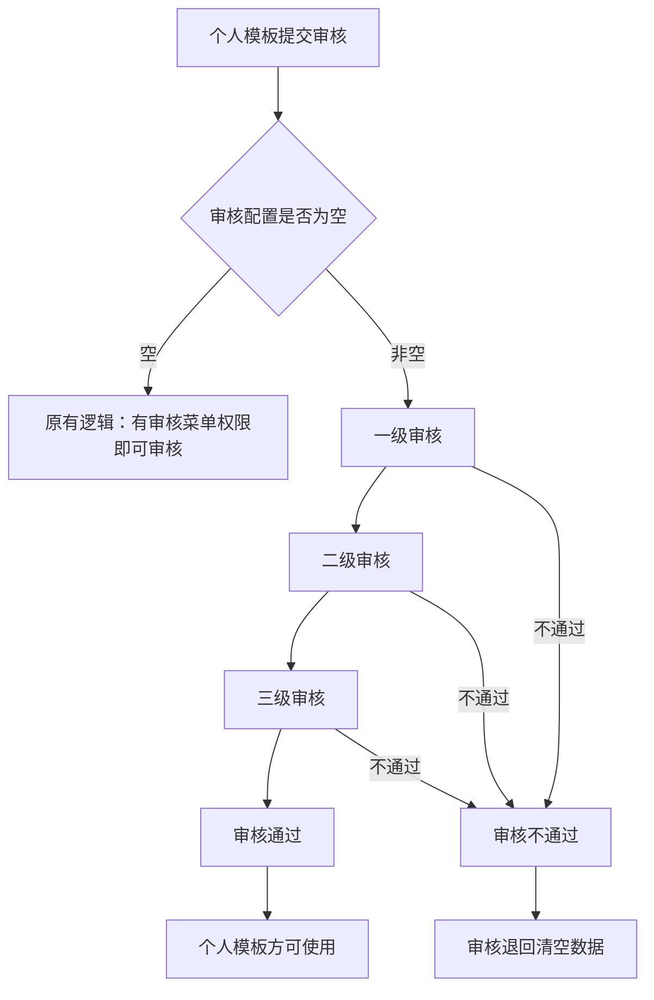
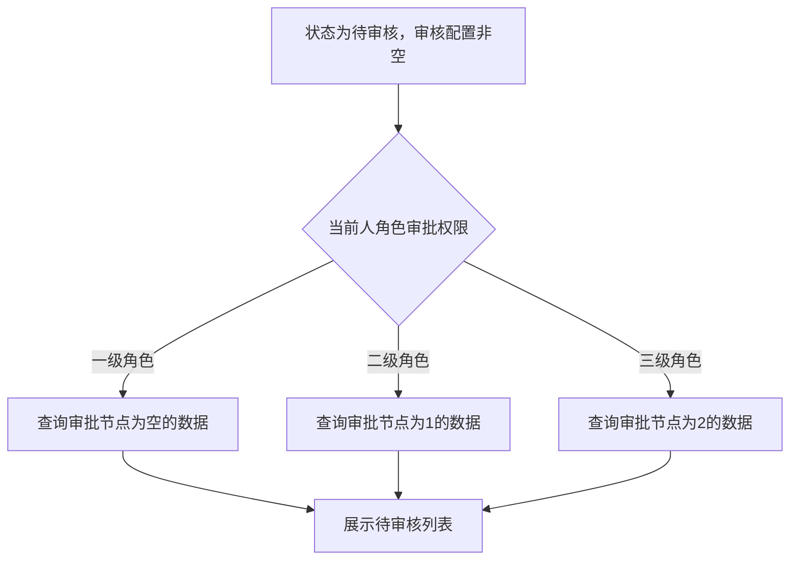

# BLGL-12-MBGL-005 个人模板审核_ Analyst - Spec

> **需求编号**：BLGL-12-MBGL-005
> **父需求**：BLGL-12-MBGL
> **关联PM Spec**：BLGL-12-MBGL-005_个人模板审核_PM-spec.md
> **Spec版本**：V1.0
> **编写时间**：2026-08-13
> **编写人**：需求分析师

---

## 一、功能编号体系

> 使用带父子层级的 `<功能编号>-ID` 编号，便于追溯和讨论。

### 1.1 功能层级结构

```
BLGL-12-MBGL-005: 个人模板审核
 ├─ BLGL-12-MBGL-005-01: 个人模板审核流程配置
 ├─ BLGL-12-MBGL-005-02: 审核角色与权限配置
 └─ BLGL-12-MBGL-005-03: 审核查询优化
```

### 1.2 功能编号表

| REQ-ID | 功能名称 | 类型 | 优先级 | 说明 |
|--------|---------|------|--------|
| BLGL-12-MBGL-005-01 | 个人模板审核流程配置 | 功能 | P1 | 一级/二级/三级审核流程配置，流程按角色设置 |
| BLGL-12-MBGL-005-02 | 审核角色与权限配置 | 功能 | P1 | 审核角色配置、审核权限配置、审核流程启用 |
| BLGL-12-MBGL-005-03 | 审核查询优化 | 功能 | P1 | 未共享模板可查询、区分我的/共享模板 |

---

## 二、核心业务流程

### 2.1 个人模板多级审核流程



### 2.2 审核节点过滤流程



---

## 三、功能规格说明

---

### BLGL-12-MBGL-005-01: 个人模板审核流程配置

#### 3.1.1 功能概述

配置个人模板审核流程，一级审核、二级审核、三级审核每级审核可灵活配置审核角色（审核本科室的还是审核全院的，可配置）。

#### 3.1.2 用户角色

| 角色 | 使用场景 | 权限要求 | 操作频率 |
|------|---------|---------|---------|
| 科室模板管理员 | 配置审核流程 | 配置权限 | 低频 |

#### 3.1.3 业务流程（Given/When/Then）

##### 主流程（至少 1 个）

**Scenario 1: 配置多级审核流程**

```gherkin
Given:
 - 定义态V2.0-模板审核

When:
 - 进入【住院个人模板审核配置】
 - 配置一级、二级、三级审核节点
 - 每级审核角色多选

Then:
 - 审核流程配置成功，流程按角色设置
```

##### 异常流程（至少 3 个）

**Scenario 2: 前面节点未设置（业务异常）**

```gherkin
Given:
 - 一级审核未设置值，二级审核设置了值

When:
 - 保存配置

Then:
 - 不能保存成功，提示"请完成前一个节点配置"
```

**Scenario 3: 审核配置为空（数据异常）**

```gherkin
Given:
 - 审核配置为空

When:
 - 提交个人模板审核

Then:
 - 走原有逻辑，有个人模板审核菜单权限即可审核
```

**Scenario 4: 审核退回清空（系统异常）**

```gherkin
Given:
 - 审核退回

When:
 - 退回审核

Then:
 - 审核退回清空数据
```

##### 边界流程（至少 2 个）

**Scenario 5: 一个角色一个节点（多值）**

```gherkin
Given:
 - 每级审核角色配置

When:
 - 配置审核角色

Then:
 - 每级审核角色支持多选，一个角色只能维护到一个节点中
```

**Scenario 6: 审核进展查看（边界）**

```gherkin
Given:
 - 根据参数COMMON015配置了审核

When:
 - 个人模板维护界面操作

Then:
 - 增加"审核进展"查看，点击弹框
```

#### 3.1.4 数据字段定义

| 字段名 | 类型 | 必填 | 默认值 | 取值范围 | 说明 | 概念ID |
|--------|------|------|--------|---------|------|--------|
| 审核节点 | - | - | - | 一级/二级/三级 | 审核节点 | ⏳ 待确认 |
| 审核角色 | - | - | - | - | 审核角色，支持多选 | ⏳ 待确认 |

#### 3.1.5 验收标准

| AC编号 | 验收标准 | 对应REQ-ID | 验证方法 | 验证场景 |
|--------|---------|-----------|--------|
| AC-001 | 支持一级/二级/三级审核流程配置 | BLGL-12-MBGL-005-01 | 功能测试 | Scenario 1 |
| AC-002 | 前面节点未设值保存提示 | BLGL-12-MBGL-005-01 | 功能测试 | Scenario 2 |

---

### BLGL-12-MBGL-005-02: 审核角色与权限配置

#### 3.2.1 功能概述

配置个人模板审核角色（按角色、职称、职务设置审核人），配置审核权限（联合审核配置），启用或禁用个人模板审核流程。

#### 3.2.2 用户角色

| 角色 | 使用场景 | 权限要求 | 操作频率 |
|------|---------|---------|---------|
| 科室模板管理员 | 配置审核角色权限 | 配置权限 | 低频 |

#### 3.2.3 业务流程（Given/When/Then）

##### 主流程（至少 1 个）

**Scenario 1: 配置审核角色**

```gherkin
Given:
 - 个人模板审核配置界面

When:
 - 按角色、职称、职务设置审核人

Then:
 - 审核角色配置成功
```

##### 异常流程（至少 3 个）

**Scenario 2: 审核权限配置（业务异常）**

```gherkin
Given:
 - 配置审核权限

When:
 - 联合审核配置

Then:
 - 审核权限配置成功
```

**Scenario 3: 审核流程启用（数据异常）**

```gherkin
Given:
 - 审核流程配置

When:
 - 启用或禁用个人模板审核流程

Then:
 - 审核流程启用/禁用成功
```

**Scenario 4: 审核角色重复（系统异常）**

```gherkin
Given:
 - 一个角色已维护到某节点

When:
 - 重复维护到另一节点

Then:
 - 一个角色只能维护到一个节点中
```

##### 边界流程（至少 2 个）

**Scenario 5: 审核角色多选（多值）**

```gherkin
Given:
 - 每级审核角色

When:
 - 配置审核角色

Then:
 - 每级审核角色支持多选
```

**Scenario 6: 审核全院的角色（边界）**

```gherkin
Given:
 - 审核角色配置

When:
 - 配置审核角色

Then:
 - 审核角色是审核本科室还是审核全院的，可配置
```

#### 3.2.4 数据字段定义

| 字段名 | 类型 | 必填 | 默认值 | 取值范围 | 说明 | 概念ID |
|--------|------|------|--------|---------|------|--------|
| 审核角色 | - | - | - | 399296993 | 审核角色 | ⏳ 待确认 |

#### 3.2.5 验收标准

| AC编号 | 验收标准 | 对应REQ-ID | 验证方法 | 验证场景 |
|--------|---------|-----------|--------|
| AC-003 | 审核角色按角色、职称、职务设置 | BLGL-12-MBGL-005-02 | 功能测试 | Scenario 1 |
| AC-004 | 一个角色只能维护到一个节点 | BLGL-12-MBGL-005-02 | 功能测试 | Scenario 4 |

---

### BLGL-12-MBGL-005-03: 审核查询优化

#### 3.3.1 功能概述

个人模板审核查询优化，未共享模板也能在新增模板的科室查询出来；个人模板审核菜单支持按模板范围查询（个人模板/科室模板），区分我的/共享模板。

#### 3.3.2 用户角色

| 角色 | 使用场景 | 权限要求 | 操作频率 |
|------|---------|---------|---------|
| 审核角色 | 查询个人模板审核 | 有审核权限 | 中频 |

#### 3.3.3 业务流程（Given/When/Then）

##### 主流程（至少 1 个）

**Scenario 1: 未共享模板可查询**

```gherkin
Given:
 - 参数开启个人模板需审核功能
 - 医生另存为个人模板，保存时选择"我的"，未共享

When:
 - 登录到个人模板维护审核菜单查询

Then:
 - 增加只针对新增人当前科室筛选，共享及未共享的个人模板都能查询出来
```

##### 异常流程（至少 3 个）

**Scenario 2: 共享模板走审核（业务异常）**

```gherkin
Given:
 - 个人模板共享给科室

When:
 - 审核

Then:
 - 审核流程依旧走个人模板的审核，走创建人创建时所属科室的科主任
```

**Scenario 3: 按模板范围查询（数据异常）**

```gherkin
Given:
 - 个人模板审核菜单

When:
 - 按模板范围查询

Then:
 - 查询分类：个人模板/科室模板，默认为空，选择后支持取消
```

**Scenario 4: 待我审核筛选（系统异常）**

```gherkin
Given:
 - 个人模板审核列表，状态选"待审核"

When:
 - 增加审核筛选

Then:
 - 默认勾选"待我审核"
```

##### 边界流程（至少 2 个）

**Scenario 5: 区分我的/共享模板（多值）**

```gherkin
Given:
 - 个人模板审核菜单

When:
 - 查看审核列表

Then:
 - 显示是我的模板还是共享模板
```

**Scenario 6: 未共享查询不到（边界）**

```gherkin
Given:
 - 个人模板未共享

When:
 - 查询

Then:
 - 优化后共享及未共享都能在新增模板的科室查询出来
```

#### 3.3.4 数据字段定义

| 字段名 | 类型 | 必填 | 默认值 | 取值范围 | 说明 | 概念ID |
|--------|------|------|--------|---------|------|--------|
| 模板范围 | - | - | 空 | 个人模板/科室模板 | 查询分类，默认为空 | ⏳ 待确认 |

#### 3.3.5 验收标准

| AC编号 | 验收标准 | 对应REQ-ID | 验证方法 | 验证场景 |
|--------|---------|-----------|--------|
| AC-005 | 未共享个人模板在审核菜单可查询 | BLGL-12-MBGL-005-03 | 功能测试 | Scenario 1 |
| AC-006 | 审核界面区分我的模板/共享模板 | BLGL-12-MBGL-005-03 | 功能测试 | Scenario 5 |

---

## 四、排除范围

本需求不包含以下功能项：

1. **个人模板管理** - 归属 BLGL-12-MBGL-004 个人模板管理
2. **知识文档审核** - 归属 BLGL-12-MBGL-002 知识文档审核
3. **成套模板管理** - 归属 BLGL-12-MBGL-006 成套模板管理

---

## 五、业务规则清单

| 规则ID | 规则名称 | 规则描述 | 优先级 |
|--------|---------|---------|--------|
| BR-001 | 多级审核 | 个人模板一级/二级/三级审核 | P1 |
| BR-002 | 节点校验 | 前面节点必须有值才能保存 | P1 |
| BR-003 | 角色唯一 | 一个角色只能维护到一个节点 | P1 |
| BR-004 | 审核退回清空 | 审核退回清空数据 | P1 |
| BR-005 | 共享走审核 | 个人模板共享给科室，审核走创建人科室科主任 | P1 |

---

## 六、关联文档

| 文档类型 | 文档路径 | 说明 |
|---------|---------|
| 功能点Spec | BLGL-12-MBGL 12模板管理功能点Spec.md（v1.0，上级目录） | Phase 1 功能点索引 |
| PM spec | 本目录 BLGL-12-MBGL-005_个人模板审核_PM-spec.md（V0.1） | PM 产出的 Spec 文档 |
| -Spec | 本目录 BLGL-12-MBGL-005_个人模板审核-Spec.md（V1.0） | 业务背景与目标 Spec |
| data-model.md | 待产出 | 架构师产出的数据建模文档 |
| design.md | 待产出 | 架构师产出的技术方案文档 |
| api-contract.md | 待产出 | 开发经理产出的 API 契约文档 |

---

## 七、待确认问题清单

| 编号 | 问题描述 | 缺失信息 | 影响范围 | 建议补充方 |
|------|---------|---------|--------|
| Q-001 | 个人模板审核配置表物理表名及字段全集未给出 | 表名与字段 | 数据模型设计 | 架构师 |
| Q-002 | 审核配置保存请求结构未给出 | 接口契约字段 | 接口契约设计 | 开发经理 |
| Q-003 | 审核列表查询性能指标未提供 | 性能指标 | 非功能性要求 | 产品经理/架构师 |
| Q-004 | 审核相关概念ID未给出 | 概念ID | 数据字段定义 | 需求分析师 |

---

## 填写检查清单

| 序号 | 检查项 | 是否完成 |
|:----:|--------|:--------:|
| 1 | 功能编号带父子层级 | ✅ |
| 2 | 每个 REQ-ID 有功能概述和用户角色 | ✅ |
| 3 | 主流程至少 1 个 Given/When/Then 场景 | ✅ |
| 4 | 异常流程至少 3 个 Given/When/Then 场景 | ✅ |
| 5 | 边界流程至少 2 个 Given/When/Then 场景 | ✅ |
| 6 | 每个 Given/When/Then 内容具体，不模糊 | ✅ |
| 7 | 数据字段定义完整（字段名、类型、必填、说明、概念ID） | ✅ |
| 8 | 验收标准 AC 编号独立，可验证 | ✅ |
| 9 | 验收标准无"功能正常"等模糊表述 | ✅ |
| 10 | 排除范围明确列出 | ✅ |
| 11 | 业务规则清单列出所有规则，每条标注来源 | ✅ |
| 12 | 流程图使用 Mermaid 格式（≥2 个） | ✅ |
| 13 | 关联文档索引包含 Phase 1 功能点Spec | ✅ |
| 14 | 待确认问题清单汇总了全文所有 ⏳ 项 | ✅ |
| 15 | 全文无占位符 `< >` 残留 | ✅ |
| 16 | 全文陈述可溯源至资料区（S1~S10 溯源核查） | ✅ |
| 17 | 人工审核确认完成 | ⏳ 待确认 |

---

**文档状态**：⬜ 待审核
**维护责任**：需求分析师规范组
**下次更新**：根据评审反馈优化

---

## 版本历史

| 版本 | 日期 | 变更说明 | 编写人 |
|------|------|---------|--------|
| V1.0 | 2026-08-13 | 初始版本 | 需求分析师 |
