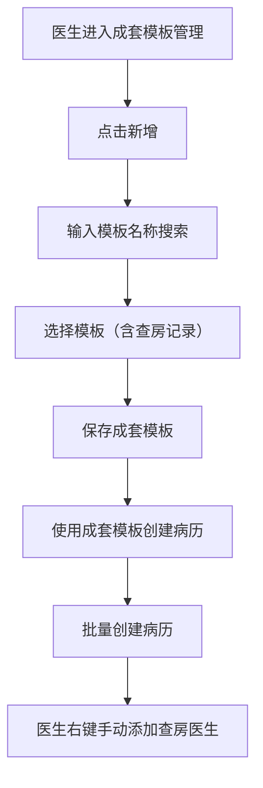
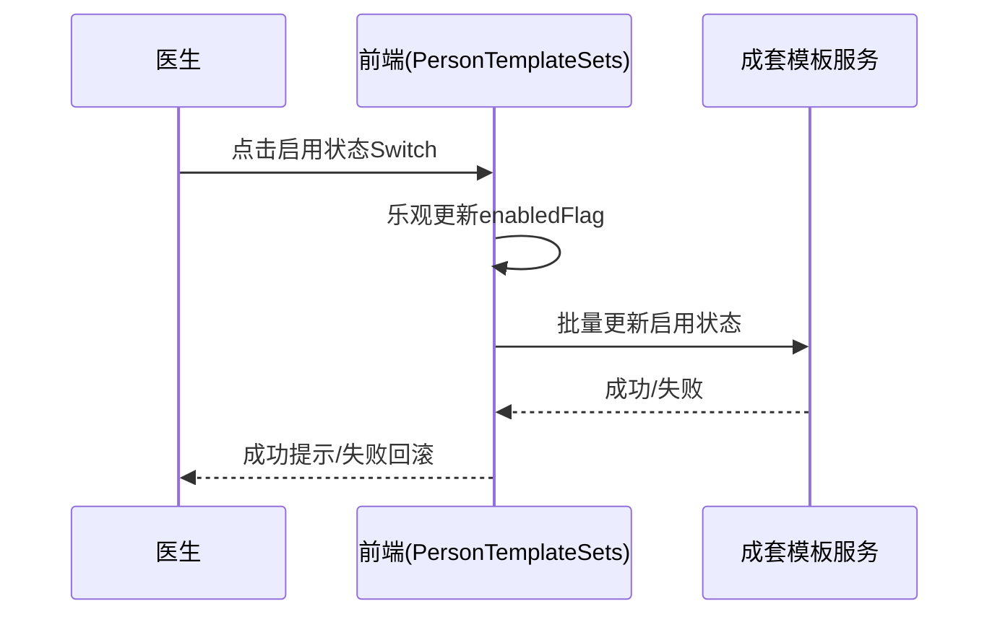

# BLGL-12-MBGL-006 成套模板管理-Spec

> **功能编号**：BLGL-12-MBGL-006
> **文档类型**：功能Spec（业务背景与设计）
> **文档版本**：V1.0
> **编写时间**：2026-08-13
> **编写人**：RACC

---

## 文档索引

本节提供本文档的章节结构索引与关联文档索引，便于读者快速定位与检索。

#### 章节索引

**Spec（研发视角）**

| 章节号 | 章节名称 |
|--------|---------|
| 1、 | 文档概述 |
| 2、 | 功能背景与定位 |
| 3、 | 业务流程设计 |
| 4、 | 数据模型设计 |
| 5、 | 接口契约设计 |
| 6、 | 技术方案设计 |
| 7、 | 测试用例预设计 |
| 8、 | 非功能性要求 |
| 9、 | 依赖与风险 |
| 10、 | 附录 |

**PM-Spec（需求规格）**

| 章节号 | 章节名称 |
|--------|---------|
| 一 | 目标 |
| 二 | 约束 |
| 三 | 验收标准 |
| 四 | 排除范围 |
| 五 | 关键决策记录 |
| 六 | 优先级 |
| 附录 | 填写检查清单 |

**Analyst-Spec（分析规格）**

| 章节号 | 章节名称 |
|--------|---------|
| 一 | 功能编号体系 |
| 二 | 核心业务流程 |
| 三 | 功能规格说明 |
| 四 | 排除范围 |
| 五 | 业务规则清单 |
| 六 | 关联文档 |
| 七 | 待确认问题清单 |
| - | 填写检查清单 | 检查项与完成状态 |

#### 版本历史

| 版本 | 日期 | 变更说明 | 编写人 |
|------|------|---------|--------|
| V1.0 | 2026-08-13 | 初始版本 | RACC |

#### 关联文档索引

| 序号 | 文档名称 | 文档类型 | 版本 | 位置 |
|------|---------|---------|------|------|
| 1 | BLGL-12-MBGL-006_成套模板管理-Spec.md | 功能Spec（业务背景与设计）（本文档） | V1.0 | 本目录 |
| 2 | BLGL-12-MBGL-006_成套模板管理_PM-spec.md | PM-Spec（需求规格） | V0.1 | 本目录 |
| 3 | BLGL-12-MBGL-006_成套模板管理_Analyst-spec.md | Analyst-Spec（分析规格） | V1.0 | 本目录 |
| 4 | BLGL-12-MBGL 12模板管理功能点Spec.md | 功能点Spec（模块级） | v1.0 | 上级目录 |

---

## 1、文档概述

### 1.1、文档目的

本文档旨在明确"成套模板管理"功能（BLGL-12-MBGL-006）的业务背景与设计方案，为需求分析、研发实现、测试验收及评审提供统一的业务上下文、设计口径与决策依据。

**具体目的包括**：

1. 梳理成套模板管理功能的业务由来与历史需求演进脉络，说明"为什么要做"
2. 明确功能的定位边界、目标用户与核心价值，回答"做成什么"
3. 描述功能的业务流程、数据模型、接口契约与技术方案，回答"怎么做"
4. 预设计测试用例并明确非功能性要求、依赖与风险，为研发与验收提供依据
5. 作为 SPEC（功能编号体系、功能详情、业务规则、验收标准等章节）的业务前提与设计输入，保证各层文档业务口径一致。

### 1.2、文档范围

#### 1.2.1 纳入范围

本文档覆盖成套模板管理的完整业务背景与设计，包括：

- 成套模板查询、新增、编辑、删除、启用禁用
- 列表"启用状态"直接编辑
- 查房记录加入成套模板
- 个人成套模板共享（共享给科室/科室内人员）
- 成套模板模板数量放开到 100 条。

#### 1.2.2 排除范围

本文档不涉及以下内容（详见其他功能点或模块）：

- 知识文档管理——归属 BLGL-12-MBGL-001
- 个人模板管理——归属 BLGL-12-MBGL-004
- 个人模板审核——归属 BLGL-12-MBGL-005。

### 1.3、术语定义

| 术语 | 定义 |
|------|------|
| 成套模板 | 将多个病历模板组合，快速创建一组相关病历 |
| 监控类型映射 | 成套模板与监控类型（文档类型）的关联 |
| 医生共享类型 | 共享到科室 / 共享到个人，mrtSetSharedCode=医生共享 399579577 |
| 模板范围 | 全院、科室、个人三种模板范围 |
| 查房记录 | 上级医师查房记录等监控类型，支持加入成套模板 |

### 1.4、阅读指南

- **章节关系**：第1~2章为阅读铺垫与业务全貌（背景、定位、用户、价值）；第3~10章为设计实现层（流程、数据、接口、技术、测试、非功能、依赖风险、附录），可直接用于研发与测试。与 Analyst-Spec、PM-Spec 的详细规则/验收口径互相引用，保持一致。
- **读者对象**：
 - 产品经理/需求分析师：阅读第1~2章了解业务全貌，据此维护 PM-Spec 与功能清单
 - 研发：阅读第3~6章用于开发实现，第9~10章用于依赖评估与联调
 - 测试：阅读第3章、第7~8章用于用例设计与验收
 - 评审人员：以本文档为业务口径与设计基准，核对各层文档一致性。

### 1.5、参考文档

| 序号 | 文档名称 | 版本/日期 |
|------|---------|
| 1 | 【历史需求】病历模版-0813.xlsx | 2026-08-13 |
| 2 | WiNEX-病历管理_模板管理功能清单_20260403.md | 2026-04-03 |
| 3 | BLGL-12-MBGL-006_成套模板管理_PM-spec.md | V0.1 |
| 4 | BLGL-12-MBGL-006_成套模板管理_Analyst-spec.md | V1.0 |
| 5 | BLGL-12-MBGL 12模板管理功能点Spec.md | v1.0 |

---

## 2、功能背景与定位

### 2.1 功能背景

成套模板管理是住院病历医生快速创建成套病历的能力，需满足：

- **管理要求**：医生将多个病历模板组合成成套模板，快速创建一组相关病历。
- **现状痛点**：
 - 成套模板维护列表中"启用状态"无法直接切换，操作成本高
 - 成套模板不能选择查房记录，无法满足医生日常所需
 - 个人成套模板只能共享给科室，不能共享给科室内个人
 - 模板数量大于 20 个无法提交。
- **历史需求演进**：从成套模板基础维护（功能清单）→ 模板数量放开到100条（、1606227）→ 查房记录加入成套模板（、1574162）→ 启用状态直接编辑→ 个人成套模板共享。

### 2.2 功能定位

"成套模板管理"是 WiNEX 病历管理-模板管理 的成套病历快速创建能力，定位为：

- **成套模板维护**：查询、新增、编辑、删除、启用禁用
- **启用状态直接编辑**：列表 Switch 直接切换启用状态
- **查房记录加入**：放开查房记录模板过滤限制
- **个人成套模板共享**：共享给科室/科室内人员。

### 2.3 目标用户

| 用户角色 | 主要使用场景 |
|---------|-------------|
| 住院医师 | 创建维护个人成套模板，快速创建病历 |
| 科室模板管理员 | 维护科室成套模板 |
| 被共享医生 | 使用他人共享的成套模板 |

### 2.4 核心价值

| 价值维度 | 价值描述 |
|---------|---------|
| 效率提升 | 成套模板快速创建一组相关病历 |
| 易用性 | 启用状态直接编辑，减少操作步骤 |
| 协作共享 | 个人成套模板共享给科室/科室内人员 |
| 灵活性 | 查房记录加入成套模板，放开限制 |

---

## 3、业务流程设计（Given/When/Then）

### 3.1 主流程

**Scenario 1: 新增成套模板**

```gherkin
Given:
 - 医生进入个人成套模板管理

When:
 - 点击新增，输入模板名称搜索
 - 选择查房记录模板加入成套模板
 - 保存

Then:
 - 成套模板创建成功，包含查房记录模板
```

### 3.2 异常流程

**Scenario 2: 启用状态切换失败（业务异常）**

```gherkin
Given:
 - 成套模板列表"启用状态"Switch

When:
 - 点击 Switch 切换，接口调用失败

Then:
 - 恢复 enabledFlag 为旧值，弹出"成套模板编辑失败"提示
```

**Scenario 3: 模板数量超限（数据异常）**

```gherkin
Given:
 - 成套模板维护时模板数量大于 20 个

When:
 - 提交成套模板

Then:
 - 放开到 100 条，不再限制
```

**Scenario 4: 查房记录过滤（系统异常）**

```gherkin
Given:
 - 查房记录模板被过滤（变更前）

When:
 - 搜索查房记录模板

Then:
 - 放开查房记录监控类型过滤，可搜索选择
```

### 3.3 边界流程

**Scenario 5: 共享给科室内人员（多值）**

```gherkin
Given:
 - 个人成套模板共享对话框

When:
 - 选择共享给科室内人员，选择科室和人员

Then:
 - 模板共享给指定个人，被共享医生可见
```

**Scenario 6: 启用状态直接编辑（未配置/状态）**

```gherkin
Given:
 - 成套模板列表

When:
 - 点击"启用状态"列 Switch 开关

Then:
 - 直接切换启用/禁用状态，无需确认弹窗
```

---

## 4、数据模型设计

### 4.1 核心数据结构

#### 4.1.1 核心保存请求

⏳ 待确认：成套模板保存请求结构未在资料区中完整给出，待来自 API 契约或数据建模。

#### 4.1.2 核心表/实体

| 表/实体 | 关键字段 | 说明 |
|---------|---------|------|
| 成套模板表 | inpEmrMrtSetId、inpEmrMrtSetName、enabledFlag | 成套模板存储 |
| INP_EMR_MRT_SET_DOCT | 医生标识 | 成套模板-医生关联表 |

> ⏳ 待确认：成套模板表物理表名及字段全集未在资料区明确给出。

### 4.2 状态定义

| 状态码 | 状态名称 | 说明 |
|--------|---------|------|
| 98360 | 启用 | 成套模板启用 |
| 98361 | 禁用 | 成套模板禁用 |
| 399579577 | 医生共享 | mrtSetSharedCode=医生共享 |
| 390033160 | 科室级别 | mrtSetSourceCode=科室级别 |

### 4.3 系统参数定义

⏳ 待确认：成套模板管理未在资料区中明确独立参数配置。

---

## 5、接口契约设计

### 5.1 API列表

| 序号 | API名称（代码函数） | 路径 | 方法 | 说明 |
|:----:|---------|------|:----:|------|
| 1 | 更新成套模板启用状态 | /emr_template_set/batch_enabled/update | POST | 批量更新启用状态 |

> ⏳ 待确认：成套模板查询/新增/编辑/删除接口未在代码中明确识别，待来自 API 契约文档。

### 5.2 接口详细设计

#### 5.2.1 更新成套模板启用状态（/emr_template_set/batch_enabled/update）

**请求参数**:
```json
{
 "inpEmrMrtSetIds": [0]
 "enabledFlag": 98360
}
```

> ⏳ 待确认：接口完整返回结构、错误码，待来自 API 契约文档或设计评审。

### 5.3 错误码定义

| 错误码 | 错误信息 | 处理方式 |
|--------|---------|---------|
| ⏳ 待确认 | 成套模板编辑失败 | 启用状态切换失败回滚提示 |

> ⏳ 待确认：错误码编码值未在资料区中提供，待来自 API 契约。

---

## 6、技术方案设计

### 6.1 页面路径

- **页面路径**: winning-webui-inpatient-clinicalnote-pango/src/pages/ClinicalnoteEmrTemplate/routerPages/PersonTemplateSets/index.vue（个人成套模板维护）、components/PersonSetsCom/EditDialog.vue（成套模板编辑）
- **核心逻辑模块**: InpEmrMrtSetController（成套模板）、InpEmrMrtSetService（成套模板服务）

### 6.2 技术栈

| 类别 | 技术 | 版本 |
|------|------|------|
| 前端框架 | Vue（winning-webui-inpatient-clinicalnote-pango） | ⏳ 待确认 |
| 后端框架 | Java Spring Boot（winning-mds-record-inpatient） | ⏳ 待确认 |

### 6.3 关键技术点

- 启用状态 Switch 乐观更新，调用批量更新启用状态接口，失败回滚
- 后端通过 filterEmrTemplateMonitorIds 参数过滤查房记录监控类型，放开限制
- 共享到个人时新建 INP_EMR_MRT_SET_DOCT 表保存医生关联记录。

### 6.4 部署方案

⏳ 待确认：部署方案未在资料区中提供。

---

## 7、测试用例预设计

### 7.1 功能测试

| 用例编号 | 测试场景 | Given | When | Then |
|---------|---------|-------|--------|
| TC-001 | 新增成套模板 | 医生进入成套模板管理 | 新增并选择模板 | 创建成功 |
| TC-002 | 查房记录加入 | 搜索查房记录模板 | 加入成套模板 | 可选择加入 |

### 7.2 边界测试

| 用例编号 | 测试场景 | Given | When | Then |
|---------|---------|-------|--------|
| TC-003 | 启用状态直接编辑 | 列表 Switch | 点击切换 | 直接切换状态 |
| TC-004 | 共享科室内人员 | 个人成套模板 | 共享给人员 | 被共享者可见 |

### 7.3 异常测试

| 用例编号 | 测试场景 | Given | When | Then |
|---------|---------|-------|--------|
| TC-005 | 启用状态切换失败 | Switch切换 | 接口失败 | 回滚+失败提示 |
| TC-006 | 模板数量超限 | 成套模板>20个 | 提交 | 放开到100条 |

### 7.4 性能测试

| 用例编号 | 测试场景 | 指标 |
|---------|---------|
| TC-007 | 成套模板列表查询 |

---

## 8、非功能性要求

### 8.1 性能要求

| 指标 | 要求 |
|------|------|
| 成套模板列表查询响应时间 | ⏳ 待确认 |

### 8.2 安全要求

| 要求 | 说明 |
|------|------|
| 权限控制 | 共享给个人的模板仅指定个人可见，不在科室级列表展示 |

**医疗行业特殊要求**

| 要求 | 说明 |
|------|------|
| 模板质量 | 成套模板快速创建病历，保障模板质量 |

### 8.3 可用性要求

| 指标 | 要求值 |
|------|--------|
| 可用性 | ⏳ 待确认 |

### 8.4 兼容性要求

| 类型 | 要求 |
|------|------|
| 历史数据兼容 | 已有成套模板不受影响，新功能仅影响新增和编辑 |

---

## 9、依赖与风险

### 9.1 外部依赖

| 依赖项 | 说明 |
|--------|------|
| 主数据 | 人员信息 |

### 9.2 风险项

| 风险项 | 等级 | 说明 | 应对方案 |
|--------|------|------|---------|
| 查房记录创建需录入查房医生 | 中 | 从成套模板批量创建不校验查房医生 | 由医生右键手动添加查房医生 |

---

## 10、附录

### 10.1 流程图



### 10.2 时序图



### 10.3 参考文档

- WiNEX-病历管理_模板管理功能清单_20260403.md（第2.6节 成套模板管理）
- 【历史需求】病历模版-0813.xlsx（、1606227、1509387、1535897、1574162、1625284）
- BLGL-12-MBGL 12模板管理功能点Spec.md（v1.0）
- 关联Spec: BLGL-12-MBGL-004_个人模板管理-Spec.md（个人模板组合成套模板）

---

## 填写检查清单

| 序号 | 检查项 | 是否完成 |
|:----:|--------|:--------:|
| 1 | 章节索引与正文章节一致 | ✅ |
| 2 | 版本历史记录完整 | ✅ |
| 3 | 关联文档索引已登记全部Spec | ✅ |
| 4 | 文档目的明确回答"为什么做/做成什么/怎么做" | ✅ |
| 5 | 纳入范围/排除范围清晰 | ✅ |
| 6 | 术语定义覆盖关键概念，从资料区可溯源 | ✅ |
| 7 | 参考文档已登记 | ✅ |
| 8 | 功能背景基于法规/规范/需求来源组织 | ✅ |
| 9 | 功能定位体现业务价值（3~5个定位点） | ✅ |
| 10 | 目标用户角色覆盖完整，在需求原文中有出处 | ✅ |
| 11 | 核心价值可陈述，与 Phase 1 口径一致 | ✅ |
| 12 | 业务流程：主流程≥1、异常≥3、边界≥2，Given/When/Then 具体 | ✅ |
| 13 | 数据模型：字段/表/状态/参数可溯源（概念ID/表名/参数编码） | ✅ |
| 14 | 接口契约：API列表+详细设计+错误码齐全（资料区有信息时）或标记待确认 | ✅ |
| 15 | 技术方案：页面路径/技术栈/关键点/部署方案（资料区有信息时）或标记待确认 | ✅ |
| 16 | 测试用例：功能/边界/异常/性能覆盖，与第3章场景对应 | ✅ |
| 17 | 非功能性要求：性能/安全/可用性/兼容性指标可量化或标记待确认 | ✅ |
| 18 | 依赖与风险：外部依赖登记完整，风险有具体应对方案或标记待确认 | ✅ |
| 19 | 附录：流程图/时序图与正文流程一致 | ✅ |
| 20 | 全文无占位符 `< >` 残留 | ✅ |
| 21 | 全文陈述可溯源至资料区，无来源的已标记 ⏳ | ✅ |
| 22 | 人工审核确认完成 | ⏳ 待确认 |

---

**文档状态**：⬜ 待审核
**维护责任**：RACC
**下次更新**：根据评审反馈优化
