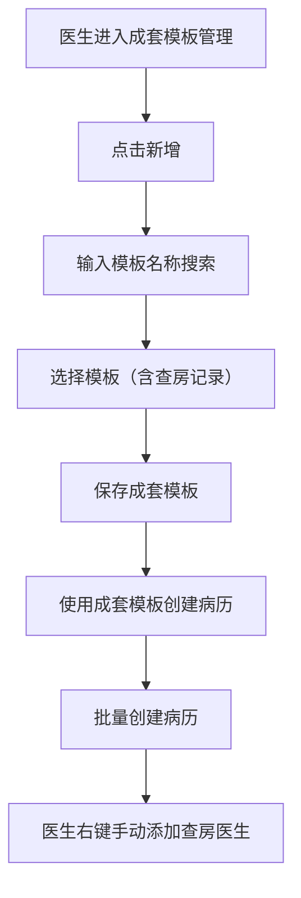
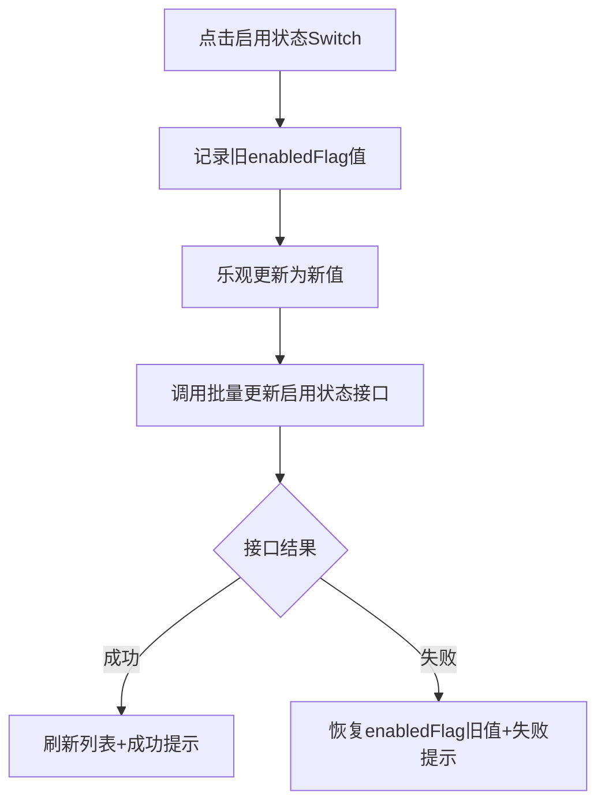

# BLGL-12-MBGL-006 成套模板管理_ Analyst - Spec

> **需求编号**：BLGL-12-MBGL-006
> **父需求**：BLGL-12-MBGL
> **关联PM Spec**：BLGL-12-MBGL-006_成套模板管理_PM-spec.md
> **Spec版本**：V1.0
> **编写时间**：2026-08-13
> **编写人**：需求分析师

---

## 一、功能编号体系

> 使用带父子层级的 `<功能编号>-ID` 编号，便于追溯和讨论。

### 1.1 功能层级结构

```
BLGL-12-MBGL-006: 成套模板管理
 ├─ BLGL-12-MBGL-006-01: 成套模板维护（增删改查/启停）
 ├─ BLGL-12-MBGL-006-02: 启用状态直接编辑
 └─ BLGL-12-MBGL-006-03: 查房记录加入与个人成套模板共享
```

### 1.2 功能编号表

| REQ-ID | 功能名称 | 类型 | 优先级 | 说明 |
|--------|---------|------|--------|
| BLGL-12-MBGL-006-01 | 成套模板维护（增删改查/启停） | 功能 | P1 | 查询、新增、编辑、删除、启用禁用 |
| BLGL-12-MBGL-006-02 | 启用状态直接编辑 | 功能 | P1 | 列表 Switch 直接切换启用状态 |
| BLGL-12-MBGL-006-03 | 查房记录加入与个人成套模板共享 | 功能 | P1 | 查房记录加入成套模板、共享科室/科室内人员 |

---

## 二、核心业务流程

### 2.1 成套模板创建流程



### 2.2 启用状态切换流程



---

## 三、功能规格说明

---

### BLGL-12-MBGL-006-01: 成套模板维护（增删改查/启停）

#### 3.1.1 功能概述

查询成套病历模板列表（按文档类型筛选），新增成套模板（配置基本信息、监控类型映射），编辑、删除、启用禁用。

#### 3.1.2 用户角色

| 角色 | 使用场景 | 权限要求 | 操作频率 |
|------|---------|---------|---------|
| 住院医师 | 维护个人成套模板 | 有个人模板权限 | 中频 |
| 科室模板管理员 | 维护科室成套模板 | 科室模板管理角色 | 中频 |

#### 3.1.3 业务流程（Given/When/Then）

##### 主流程（至少 1 个）

**Scenario 1: 新增成套模板**

```gherkin
Given:
 - 医生进入成套模板维护界面

When:
 - 点击新增，输入模板名称搜索
 - 选择模板加入成套模板
 - 保存

Then:
 - 成套模板创建成功
```

##### 异常流程（至少 3 个）

**Scenario 2: 模板数量超限（业务异常）**

```gherkin
Given:
 - 成套模板维护时模板数量大于20个

When:
 - 提交成套模板

Then:
 - 放开到100条，不再限制
```

**Scenario 3: 创建病历未完成（数据异常）**

```gherkin
Given:
 - 病历创建弹窗，成套模板创建病历未完成

When:
 - 创建病历

Then:
 - 提醒创建中，不能关闭弹窗
```

**Scenario 4: 删除成套模板（系统异常）**

```gherkin
Given:
 - 成套模板

When:
 - 批量删除

Then:
 - 删除成套模板
```

##### 边界流程（至少 2 个）

**Scenario 5: 启用禁用（多值）**

```gherkin
Given:
 - 成套模板

When:
 - 启用或禁用

Then:
 - 禁用后模板在临床不可使用
```

**Scenario 6: 监控类型映射（边界）**

```gherkin
Given:
 - 新增成套模板

When:
 - 配置监控类型映射

Then:
 - 成套模板与监控类型关联
```

#### 3.1.4 数据字段定义

| 字段名 | 类型 | 必填 | 默认值 | 取值范围 | 说明 | 概念ID |
|--------|------|------|--------|---------|------|--------|
| inpEmrMrtSetId | Long | 是 | - | - | 成套模板ID | ⏳ 待确认 |
| inpEmrMrtSetName | String | 是 | - | - | 成套模板名称 | ⏳ 待确认 |
| enabledFlag | Long | 是 | - | 98360/98361 | 启用/禁用 | ⏳ 待确认 |

#### 3.1.5 验收标准

| AC编号 | 验收标准 | 对应REQ-ID | 验证方法 | 验证场景 |
|--------|---------|-----------|--------|
| AC-001 | 成套模板可新增/编辑/删除，保存后包含所选模板 | BLGL-12-MBGL-006-01 | 功能测试 | Scenario 1 |
| AC-002 | 成套模板数量放开到100条 | BLGL-12-MBGL-006-01 | 功能测试 | Scenario 2 |

---

### BLGL-12-MBGL-006-02: 启用状态直接编辑

#### 3.2.1 功能概述

成套模板列表中"启用状态"列 Switch 开关直接切换启用/禁用状态，无需进入编辑弹窗；后端新增"更新启用状态"专用接口，仅接收模板ID和 enabledFlag。

#### 3.2.2 用户角色

| 角色 | 使用场景 | 权限要求 | 操作频率 |
|------|---------|---------|---------|
| 住院医师 | 切换个人成套模板启用状态 | 有编辑权限 | 中频 |
| 科室模板管理员 | 切换科室成套模板启用状态 | 有编辑权限 | 中频 |

#### 3.2.3 业务流程（Given/When/Then）

##### 主流程（至少 1 个）

**Scenario 1: 启用状态直接切换**

```gherkin
Given:
 - 成套模板列表"启用状态"列 Switch

When:
 - 点击 Switch 开关
 - 前端乐观更新，调用批量更新启用状态接口（传IDs+enabledFlag）

Then:
 - 成功刷新列表，弹出"成套模板编辑成功"提示
```

##### 异常流程（至少 3 个）

**Scenario 2: 切换失败回滚（业务异常）**

```gherkin
Given:
 - Switch 切换

When:
 - 接口调用失败

Then:
 - 恢复 enabledFlag 为旧值，弹出"成套模板编辑失败"提示
```

**Scenario 3: 全量更新字段清空（数据异常）**

```gherkin
Given:
 - 现有 save 接口为全量更新，inpEmrMrtSetName 有 @NotBlank 校验

When:
 - 仅更新单个字段

Then:
 - 列表类字段传 null 会被清空，需新增专用接口
```

**Scenario 4: 批量操作（系统异常）**

```gherkin
Given:
 - 入参使用 List 支持批量

When:
 - 批量切换启用状态

Then:
 - findAllByInpEmrMrtSetIdIn 批量查询，saveAll 批量保存，@Transactional 事务保证
```

##### 边界流程（至少 2 个）

**Scenario 5: 无需确认弹窗（边界）**

```gherkin
Given:
 - 切换启用状态

When:
 - 点击 Switch

Then:
 - 切换时不需要二次确认弹窗
```

**Scenario 6: 共用组件区分（边界）**

```gherkin
Given:
 - 个人成套模板和科室成套模板共用同一组件

When:
 - 通过 currentRoute prop 区分

Then:
 - 两处均支持直接切换
```

#### 3.2.4 数据字段定义

| 字段名 | 类型 | 必填 | 默认值 | 取值范围 | 说明 | 概念ID |
|--------|------|------|--------|---------|------|--------|
| inpEmrMrtSetIds | List | 是 | - | - | 成套模板ID列表 | ⏳ 待确认 |
| enabledFlag | Long | 是 | - | 98360/98361 | 启用状态 | ⏳ 待确认 |

#### 3.2.5 验收标准

| AC编号 | 验收标准 | 对应REQ-ID | 验证方法 | 验证场景 |
|--------|---------|-----------|--------|
| AC-003 | 启用状态 Switch 直接切换，失败回滚 | BLGL-12-MBGL-006-02 | 功能测试 | Scenario 1、2 |
| AC-004 | 切换时不需要二次确认弹窗 | BLGL-12-MBGL-006-02 | 功能测试 | Scenario 5 |

---

### BLGL-12-MBGL-006-03: 查房记录加入与个人成套模板共享

#### 3.3.1 功能概述

放开查房记录模板在成套模板维护中的过滤限制；个人成套模板共享给科室/科室内人员。

#### 3.3.2 用户角色

| 角色 | 使用场景 | 权限要求 | 操作频率 |
|------|---------|---------|---------|
| 住院医师 | 查房记录加入成套模板、共享 | 有个人模板权限 | 中频 |
| 被共享医生 | 使用共享成套模板 | 无 | 中频 |

#### 3.3.3 业务流程（Given/When/Then）

##### 主流程（至少 1 个）

**Scenario 1: 查房记录加入成套模板**

```gherkin
Given:
 - 医生进入个人成套模板管理

When:
 - 点击新增，输入模板名称搜索
 - 选择查房记录模板加入成套模板
 - 保存

Then:
 - 成套模板包含查房记录模板
```

##### 异常流程（至少 3 个）

**Scenario 2: 共享给科室内人员（业务异常）**

```gherkin
Given:
 - 个人成套模板共享对话框

When:
 - 选择共享给科室内人员，选择科室和人员

Then:
 - 共享给指定个人，被共享医生可见
```

**Scenario 3: 批量创建不校验查房医生（数据异常）**

```gherkin
Given:
 - 从成套模板批量创建病历

When:
 - 批量创建

Then:
 - 不再校验查房医生，由医生右键手动修改文书标题时添加查房医生
```

**Scenario 4: 查房记录过滤（系统异常）**

```gherkin
Given:
 - 查房记录模板被 filterEmrTemplateMonitorIds 过滤（变更前）

When:
 - 搜索查房记录模板

Then:
 - 移除过滤限制，可搜索选择
```

##### 边界流程（至少 2 个）

**Scenario 5: 共享到个人科室列表不展示（边界）**

```gherkin
Given:
 - 共享给科室内个人后

When:
 - 在科室成套模板管理中查看

Then:
 - 该模板不在科室级列表中展示，仅指定个人可见
```

**Scenario 6: 共享后默认禁用（边界）**

```gherkin
Given:
 - 共享完成后

When:
 - 查看目标处模板

Then:
 - 模板默认为禁用状态
```

#### 3.3.4 数据字段定义

| 字段名 | 类型 | 必填 | 默认值 | 取值范围 | 说明 | 概念ID |
|--------|------|------|--------|---------|------|--------|
| mrtSetSharedCode | - | - | - | 399579577 | 医生共享 | ⏳ 待确认 |
| mrtSetSourceCode | - | - | - | 390033160 | 科室级别 | ⏳ 待确认 |

#### 3.3.5 验收标准

| AC编号 | 验收标准 | 对应REQ-ID | 验证方法 | 验证场景 |
|--------|---------|-----------|--------|
| AC-005 | 查房记录模板可搜索并加入成套模板 | BLGL-12-MBGL-006-03 | 功能测试 | Scenario 1 |
| AC-006 | 个人成套模板共享给科室/科室内人员，被共享者可见 | BLGL-12-MBGL-006-03 | 功能测试 | Scenario 2 |
| AC-007 | 从成套模板批量创建病历不再校验查房医生 | BLGL-12-MBGL-006-03 | 功能测试 | Scenario 3 |

---

## 四、排除范围

本需求不包含以下功能项：

1. **知识文档管理** - 归属 BLGL-12-MBGL-001 知识文档管理
2. **个人模板管理** - 归属 BLGL-12-MBGL-004 个人模板管理
3. **个人模板审核** - 归属 BLGL-12-MBGL-005 个人模板审核

---

## 五、业务规则清单

| 规则ID | 规则名称 | 规则描述 | 优先级 |
|--------|---------|---------|--------|
| BR-001 | 组合创建 | 成套模板组合多个模板快速创建病历 | P1 |
| BR-002 | 乐观更新 | Switch 乐观更新，失败回滚 | P1 |
| BR-003 | 数量放开 | 成套模板数量放开到100条 | P1 |
| BR-004 | 共享可见性 | 共享给个人的模板仅指定个人可见 | P1 |
| BR-005 | 查房医生 | 批量创建不校验查房医生，由医生手动添加 | P1 |

---

## 六、关联文档

| 文档类型 | 文档路径 | 说明 |
|---------|---------|
| 功能点Spec | BLGL-12-MBGL 12模板管理功能点Spec.md（v1.0，上级目录） | Phase 1 功能点索引 |
| PM spec | 本目录 BLGL-12-MBGL-006_成套模板管理_PM-spec.md（V0.1） | PM 产出的 Spec 文档 |
| -Spec | 本目录 BLGL-12-MBGL-006_成套模板管理-Spec.md（V1.0） | 业务背景与目标 Spec |
| data-model.md | 待产出 | 架构师产出的数据建模文档 |
| design.md | 待产出 | 架构师产出的技术方案文档 |
| api-contract.md | 待产出 | 开发经理产出的 API 契约文档 |

---

## 七、待确认问题清单

| 编号 | 问题描述 | 缺失信息 | 影响范围 | 建议补充方 |
|------|---------|---------|--------|
| Q-001 | 成套模板表物理表名及字段全集未给出 | 表名与字段 | 数据模型设计 | 架构师 |
| Q-002 | 成套模板查询/新增/编辑/删除接口未在代码中识别 | 接口 | 接口契约设计 | 开发经理 |
| Q-003 | 成套模板列表查询性能指标未提供 | 性能指标 | 非功能性要求 | 产品经理/架构师 |
| Q-004 | 成套模板相关概念ID未给出 | 概念ID | 数据字段定义 | 需求分析师 |

---

## 填写检查清单

| 序号 | 检查项 | 是否完成 |
|:----:|--------|:--------:|
| 1 | 功能编号带父子层级 | ✅ |
| 2 | 每个 REQ-ID 有功能概述和用户角色 | ✅ |
| 3 | 主流程至少 1 个 Given/When/Then 场景 | ✅ |
| 4 | 异常流程至少 3 个 Given/When/Then 场景 | ✅ |
| 5 | 边界流程至少 2 个 Given/When/Then 场景 | ✅ |
| 6 | 每个 Given/When/Then 内容具体，不模糊 | ✅ |
| 7 | 数据字段定义完整（字段名、类型、必填、说明、概念ID） | ✅ |
| 8 | 验收标准 AC 编号独立，可验证 | ✅ |
| 9 | 验收标准无"功能正常"等模糊表述 | ✅ |
| 10 | 排除范围明确列出 | ✅ |
| 11 | 业务规则清单列出所有规则，每条标注来源 | ✅ |
| 12 | 流程图使用 Mermaid 格式（≥2 个） | ✅ |
| 13 | 关联文档索引包含 Phase 1 功能点Spec | ✅ |
| 14 | 待确认问题清单汇总了全文所有 ⏳ 项 | ✅ |
| 15 | 全文无占位符 `< >` 残留 | ✅ |
| 16 | 全文陈述可溯源至资料区（S1~S10 溯源核查） | ✅ |
| 17 | 人工审核确认完成 | ⏳ 待确认 |

---

**文档状态**：⬜ 待审核
**维护责任**：需求分析师规范组
**下次更新**：根据评审反馈优化

---

## 版本历史

| 版本 | 日期 | 变更说明 | 编写人 |
|------|------|---------|--------|
| V1.0 | 2026-08-13 | 初始版本 | 需求分析师 |
