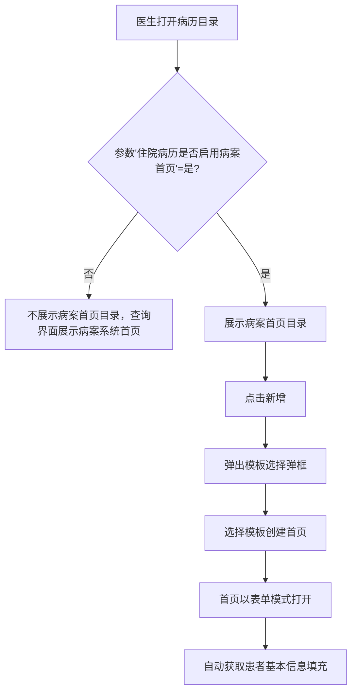
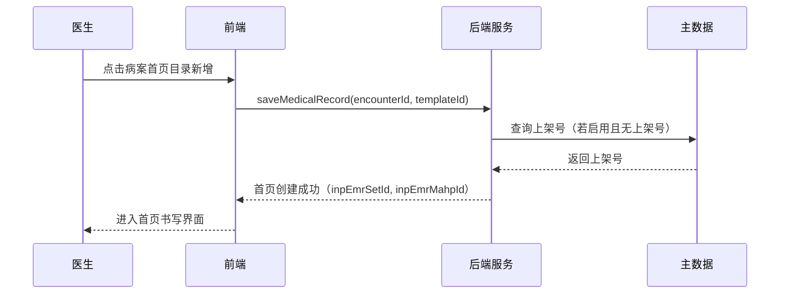

# BLGL-13-BASY-001 病案首页创建与目录管理 - Spec

> **功能编号**：BLGL-13-BASY-001
> **文档类型**：Spec（研发视角）
> **文档版本**：V1.0
> **编写时间**：2026-08-13
> **编写人**：RACC

---

## 文档索引

本节提供本文档的章节结构索引与关联文档索引，便于读者快速定位与检索。

#### 章节索引

**Spec（研发视角）**

| 章节号 | 章节名称 | 内容说明 |
|--------|---------|---------|
| 1、 | 文档概述 | 文档目的、文档范围、术语定义、阅读指南、参考文档 |
| 2、 | 功能背景与定位 | 功能背景、功能定位、目标用户、核心价值 |
| 3、 | 业务流程设计 | 主流程/异常流程/边界流程（Given/When/Then） |
| 4、 | 数据模型设计 | 核心数据结构、状态定义、系统参数定义 |
| 5、 | 接口契约设计 | API列表、接口详细设计、错误码定义 |
| 6、 | 技术方案设计 | 页面路径、技术栈、关键技术点、部署方案 |
| 7、 | 测试用例预设计 | 功能/边界/异常/性能测试用例 |
| 8、 | 非功能性要求 | 性能、安全、可用性、兼容性 |
| 9、 | 依赖与风险 | 外部依赖、风险项 |
| 10、 | 附录 | 流程图、时序图、参考文档 |

**PM-Spec（业务视角）**

| 章节号 | 章节名称 | 内容说明 |
|--------|---------|---------|
| 一 | 目标 | 功能定位与核心价值 |
| 二 | 约束 | 业务/技术/非功能性约束 |
| 三 | 验收标准 | 验收条件与验证方法 |
| 四 | 排除范围 | 本次不做项与明确边界 |
| 五 | 关键决策记录 | 方案决策与选型理由 |
| 六 | 优先级 | 优先级定义 |
| 七 | 关联文档 | 关联文档索引 |
| 附录 | 填写检查清单 | 质量检查 |

**Analyst-Spec（产品视角）**

| 章节号 | 章节名称 | 内容说明 |
|--------|---------|---------|
| 一 | 功能编号体系 | 带父子层级的编号树 |
| 二 | 核心业务流程 | Mermaid 流程图 |
| 三 | 功能规格说明 | 各子功能点的概述、用户角色、业务流程、验收标准 |
| 四 | 排除范围 | 本需求不包含的功能项 |
| 五 | 业务规则清单 | 规则ID、规则名称、规则描述、优先级 |
| 六 | 关联文档 | 文档类型、文档路径、说明 |
| 七 | 待确认问题清单 | 所有 ⏳ 待确认项的汇总 |
| - | 填写检查清单 | 检查项与完成状态 |

#### 版本历史

| 版本 | 日期 | 变更说明 | 编写人 |
|------|------|---------|--------|
| V1.0 | 2026-08-13 | 初始版本 | RACC |

#### 关联文档索引

| 序号 | 文档名称 | 文档类型 | 版本 | 位置 |
|------|---------|---------|------|------|
| 1 | BLGL-13-BASY-001_病案首页创建与目录管理_PM-spec.md | PM-Spec（业务视角） | V0.1 | 本目录 |
| 2 | BLGL-13-BASY-001_病案首页创建与目录管理_Analyst-spec.md | Analyst-Spec（产品视角） | V1.0 | 本目录 |
| 3 | BLGL-13-BASY-001_病案首页创建与目录管理-Spec.md | Spec（研发视角） | V1.0 | 本目录 |
| 4 | BLGL-13-BASY 13病案首页功能点Spec.md | 功能点Spec（模块级） | V1.0 | 上级目录 |

---

## 1、文档概述

### 1.1、文档目的

本文档旨在明确"病案首页创建与目录管理"功能（BLGL-13-BASY-001）的业务背景与设计方案，为需求分析、研发实现、测试验收及评审提供统一的业务上下文、设计口径与决策依据。

**具体目的包括**：

1. 梳理病案首页创建与目录管理功能的业务由来与历史需求演进脉络，说明"为什么要做"；
2. 明确功能的定位边界、目标用户与核心价值，回答"做成什么"；
3. 描述功能的业务流程、数据模型、接口契约与技术方案，回答"怎么做"；
4. 预设计测试用例并明确非功能性要求、依赖与风险，为研发与验收提供依据；
5. 作为 SPEC（功能编号体系、功能详情、业务规则、验收标准等章节）的业务前提与设计输入，保证各层文档业务口径一致。

### 1.2、文档范围

#### 1.2.1 纳入范围

本文档覆盖病案首页创建与目录管理的完整业务背景与设计，包括：

- 病案首页开启参数（住院病历是否启用病案首页）控制下的首页目录展示
- 病历目录上新建病案首页并弹出模板选择
- 病案首页在病历查询、全院查询、病历归档、病案借阅、护理病历查看等界面的目录展示
- 病案首页创建时调用编辑器表单模式（元素外不可编辑）
- 首页上架号生成（丽水，可选配置）

#### 1.2.2 排除范围

本文档不涉及以下内容（详见其他功能点或模块）：

- 病案首页的数据获取与录入（患者基本信息/诊断/手术/费用/重症）——见 BLGL-13-BASY-002~006
- 病案首页提交与校验——见 BLGL-13-BASY-007
- 首页模板配置管理——见 BLGL-12-MBGL 模板管理模块

### 1.3、术语定义

| 术语 | 定义 |
|------|------|
| 病案首页 | 住院患者住院期间诊疗信息的法定汇总文书，本模块的核心病历文书 |
| 病历目录 | 住院病历的文书导航目录，病案首页作为其中的监控类型文书展示 |
| 监控类型 | 病历文书的分类标识，用于区分病历文书类型（如病案首页），来源：功能清单 |
| 模板 | 病案首页的版式模板，创建首页时选择 |
| 表单模式 | 编辑器的一种模式，控制元素外不可编辑 |
| 上架号 | 病案上架编号，出院医嘱执行时生成，创建首页时读入 |
| 病案号 | 患者病案标识号，条形码展示内容 |

### 1.4、阅读指南

- **章节关系**：第1~2章为阅读铺垫与业务全貌（背景、定位、用户、价值）；第3~10章为设计实现层（流程、数据、接口、技术、测试、非功能、依赖风险、附录），可直接用于研发与测试。与 Analyst-Spec、PM-Spec 的详细规则/验收口径互相引用，保持一致。
- **读者对象**：
  - 产品经理/需求分析师：阅读第1~2章了解业务全貌，据此维护 PM-Spec 与功能清单；
  - 研发：阅读第3~6章用于开发实现，第9~10章用于依赖评估与联调；
  - 测试：阅读第3章、第7~8章用于用例设计与验收；
  - 评审人员：以本文档为业务口径与设计基准，核对各层文档一致性。

### 1.5、参考文档

| 序号 | 文档名称 | 版本/日期 |
|------|---------|----------|
| 1 | 【历史需求】病案首页需求-0727.xlsx | - |
| 2 | BLGL-13-BASY-001_病案首页创建与目录管理_PM-spec.md | V0.1 |
| 3 | BLGL-13-BASY-001_病案首页创建与目录管理_Analyst-spec.md | V1.0 |
| 4 | BLGL-13-BASY 13病案首页功能点Spec.md | V1.0 |
| 5 | WiNEX-病案首页_功能清单_20260325_162900.md | 2026-03-25 |

---

## 2、功能背景与定位

### 2.1 功能背景

病案首页创建与目录管理是病案首页模块的入口功能，需满足：

- **法规/规范依据**：病案首页是住院病历的法定文书，住院病历需包含病案首页
- **管理要求**：病案首页需与病历查询、全院查询、病历归档、病案借阅等界面联动展示
- **现状痛点**：病案首页目录展示受参数控制，参数关闭时病案首页在查询界面展示的是病案系统的首页，需与病历系统的首页区分
- **历史需求演进**：从"病历主界面展示病案首页目录"→"目录下创建首页病历"→"首页目录各个界面显示优化"→"首页调用编辑器表单模式"→"首页生成上架号"

### 2.2 功能定位

"病案首页创建与目录管理"是WiNEX病历管理-病案首页模块的入口功能，定位为：

- **入口定位**：病案首页的创建入口，医生通过病历目录新建首页
- **目录定位**：病案首页在各病历管理界面（查询/归档/借阅）的目录展示
- **开启定位**：通过参数控制病案首页功能是否启用
- **展示定位**：支持首页调用编辑器表单模式，控制元素外不可编辑

### 2.3 目标用户

| 用户角色 | 主要使用场景 |
|---------|-------------|
| 住院医生 | 在病历目录新建病案首页、选择模板、书写首页 |
| 病案室人员 | 在病案系统查看/借阅病案首页 |
| 护理人员 | 通过封装的护理病历查看界面查看住院病历的病案首页目录 |

### 2.4 核心价值

| 价值维度 | 价值描述 |
|---------|---------|
| 流程完整性 | 病案首页作为住院病历法定文书，创建入口与病历目录统一 |
| 一致性 | 病案首页目录在查询、全院查询、归档、借阅等界面统一展示 |
| 配置灵活性 | 参数控制首页是否启用、模板选择弹框 |

---

## 3、业务流程设计（Given/When/Then）

### 3.1 主流程

**Scenario 1: 病历目录创建病案首页**

```gherkin
Given:
  - 参数"住院病历是否启用病案首页" = 是
  - 患者处于住院状态，病历目录已加载

When:
  - 医生在病历目录点击病案首页目录的"新增"按钮
  - 系统弹出首页模板选择弹框
  - 医生选择模板并确认创建

Then:
  - 病案首页创建成功，进入书写界面
  - 首页以表单模式打开（元素外不可编辑）
  - 首页创建时自动获取患者基本信息填充首页字段
```

### 3.2 异常流程

**Scenario 2: 业务异常——参数未启用病案首页**

```gherkin
Given:
  - 参数"住院病历是否启用病案首页" = 否

When:
  - 医生在病历目录查找病案首页目录

Then:
  - 病历目录上不展示病案首页目录
  - 查询界面上病案首页目录展示的是病案系统的病案首页
```

**Scenario 3: 数据异常——患者无出院医嘱时创建首页（上架号场景）**

```gherkin
Given:
  - 已启用上架号功能（丽水需求）
  - 患者当前无有效出院医嘱

When:
  - 医生新建病案首页

Then:
  - 上架号数据元（399743775）为空
  - 不生成上架号，首页可继续创建
  - 待患者产生出院医嘱后再通过同步按钮生成上架号
```

**Scenario 4: 系统异常——模板加载失败**

```gherkin
Given:
  - 首页模板选择弹框加载时后端服务异常

When:
  - 医生点击病案首页目录"新增"按钮

Then:
  - 弹框加载失败提示
  - 首页不创建，病历目录状态保持不变
```

### 3.3 边界流程

**Scenario 5: 边界场景——患者多次住院上架号生成**

```gherkin
Given:
  - 患者同一就诊ID已生成上架号
  - 患者再次新建病案首页

When:
  - 医生新建病案首页

Then:
  - 已存在上架号时不重复生成
  - 同一就诊ID只生成一次，多次住院分别生成
```

**Scenario 6: 边界场景——首页创建时无有效出院医嘱（上架号初始生成）**

```gherkin
Given:
  - 患者存在有效出院医嘱（流转类型是死亡或出院）

When:
  - 医生创建病历首页

Then:
  - 生成上架号并插入到数据元（399743775）
  - 后续医嘱作废、取消入院或取消出区时不对已生成的上架号作废
```

---

## 4、数据模型设计

### 4.1 核心数据结构

#### 4.1.1 核心保存请求

| 字段名 | 类型 | 必填 | 备注 |
|--------|------|------|------|
| encounterId | Long | 是 | 患者就诊标识 |
| inpEmrSetId | Long | 是 | 病历ID（首页所属病历集） |
| inpEmrMahpId | Long | 是 | 首页主表ID |
| caseNo | String | 否 | 病案号（首页条形码展示） |
| caseOnShelfNo | String | 否 | 上架号（，概念ID 399743775） |

> 📌 字段来自历史（首页信息存储）与 740583（上架号），结合代码实体 InpEmrMahpPO 关键字段。

#### 4.1.2 核心表/实体

| 表/实体 | 关键字段 | 说明 |
|---------|---------|------|
| INP_EMR_MAHP | inpEmrMahpId, encounterId, inpEmrSetId, caseNo | 首页主表 |
| INPATIENT_EMR_SET | inpEmrSetId, monitorType | 病历集表，病案首页作为监控类型文书 |

### 4.2 状态定义

| 状态码 | 状态名称 | 说明 |
|--------|---------|------|
| ⏳ 待确认 | 新建/保存/提交状态 | 首页生命周期状态定义未在资料区完整找到，需确认 |

### 4.3 系统参数定义

| 参数编码 | 参数名称 | 说明 |
|---------|---------|------|
| 住院病历是否启用病案首页 | 病历业务配置-病案首页配置-基础配置，默认否 | 控制是否启用病案首页功能 |
| COMMON072 | 住院病历是否启用病案首页 | 控制首页目录在各界面展示 |
| COMMON039 | 生成PDF参数 | 提交首页时是否生成PDF |

---

## 5、接口契约设计

### 5.1 API列表

| 序号 | API名称（代码函数） | 路径 | 方法 | 说明 |
|:----:|---------|------|:----:|------|
| 1 | saveMedicalRecord | /api/v2/inp_emr_set/save_medical_record | POST | 创建病案首页（中天首页专用） |
| 2 | queryInpatientEmrMedicalArchive | /api/v1/emr_medical_archive/committed/by_example | POST | 查询已归档且首页已提交的就诊集合 |
| 3 | deleteInpatientMedicalArchiveById | /api/v1/emr/medical_archive/delete | POST | 病案首页删除 |

### 5.2 接口详细设计

#### 5.2.1 创建病案首页（saveMedicalRecord）

**请求参数**:
```json
{
  "encounterId": 123456,
  "templateId": 789,
  "hospitalSOID": 1000
}
```

**返回值（成功）**:
```json
{
  "success": true,
  "data": {
    "inpEmrSetId": 456,
    "inpEmrMahpId": 789
  }
}
```

**返回值（失败）**:
```json
{
  "success": false,
  "message": "模板加载失败，请稍后重试",
  "data": null
}
```

> 📌 接口路径与函数名来自代码仓库 InpatientEmrMahpApiPathConstants 与 InpatientMedicalArchiveController；入参/出参字段结构待与接口文档核对，部分字段为 `⏳ 待确认`。

### 5.3 错误码定义

| 错误码 | 错误信息 | 处理方式 |
|--------|---------|---------|
| ⏳ 待确认 | - | 错误码来自资料区中提及的异常处理描述，资料区无明确错误码定义 |

---

## 6、技术方案设计

### 6.1 页面路径

- **页面路径**: winning-webui-inpatient-clinicalnote-pango/src/pages/EmrCreatorAndWrite（创建与书写入口）
- **路由**: 病历目录-病案首页目录（EmrMedicalRecord 病历书写容器）
- **核心逻辑模块**: InpatientEmrMedicalArchiveController（saveMedicalRecord）、InpatientEmrMedicalArchiveService、InpatientEmrMedicalArchiveRepositoryImpl

### 6.2 技术栈

| 类别 | 技术 | 版本 |
|------|------|------|
| 前端框架 | Vue（winning-webui-inpatient-clinicalnote-pango） | ⏳ 待确认 |
| 后端框架 | Java Spring Boot + Akso MVC（@WinPostMapping） | ⏳ 待确认 |

### 6.3 关键技术点

- 首页创建时调用编辑器表单模式，控制元素外不可编辑
- 参数"住院病历是否启用病案首页"控制首页目录展示
- 上架号生成：根据就诊id查询有无出院医嘱，调用主数据接口获取上架号，同一就诊id唯一

### 6.4 部署方案

⏳ 待确认：部署方案未在资料区中找到

---

## 7、测试用例预设计

### 7.1 功能测试

| 用例编号 | 测试场景 | Given | When | Then |
|---------|---------|-------|------|------|
| TC-001 | 病历目录创建首页 | 参数启用=是，患者住院中 | 点击病案首页目录新增，选择模板 | 首页创建成功，进入表单模式书写界面 |
| TC-002 | 首页目录各界面展示 | 参数启用=是 | 打开病历查询/全院查询/归档/借阅界面 | 病案首页目录均展示 |

### 7.2 边界测试

| 用例编号 | 测试场景 | Given | When | Then |
|---------|---------|-------|------|------|
| TC-003 | 上架号不重复生成 | 同一就诊ID已有上架号 | 再次新建首页 | 上架号不重复生成 |
| TC-004 | 参数未启用 | 参数=否 | 打开病历目录 | 不展示病案首页目录 |

### 7.3 异常测试

| 用例编号 | 测试场景 | Given | When | Then |
|---------|---------|-------|------|------|
| TC-005 | 模板加载失败 | 后端服务异常 | 点击新增 | 提示加载失败，首页不创建 |
| TC-006 | 无出院医嘱创建首页 | 患者无有效出院医嘱 | 新建首页 | 上架号为空，首页可创建 |

### 7.4 性能测试

| 用例编号 | 测试场景 | 指标 |
|---------|---------|------|
| TC-007 | 首页创建响应时间 | ⏳ 待确认（资料区无性能指标） |

---

## 8、非功能性要求

### 8.1 性能要求

| 指标 | 要求 |
|------|------|
| 首页创建响应时间 | ⏳ 待确认 |

### 8.2 安全要求

| 要求 | 说明 |
|------|------|
| 首页书写权限控制 | 病案首页作为病历文书，需遵循病历权限管理 |

**医疗行业特殊要求**

| 要求 | 说明 |
|------|------|
| 病历文书不可篡改 | 首页提交后禁止直接修改，需走撤销/审批流程 |

### 8.3 可用性要求

| 指标 | 要求值 |
|------|--------|
| ⏳ 待确认 | - |

### 8.4 兼容性要求

| 类型 | 要求 |
|------|------|
| 前端浏览器 | ⏳ 待确认 |
| 病案系统对接 | 首页目录在查询界面展示病案系统首页（参数关闭时） |

---

## 9、依赖与风险

### 9.1 外部依赖

| 依赖项 | 说明 |
|--------|------|
| 病历目录/病历集 | 首页作为监控类型文书挂在病历目录下 |
| 模板系统 | 首页创建依赖模板选择 |
| 主数据 | 上架号生成依赖主数据接口 |

### 9.2 风险项

| 风险项 | 等级 | 说明 | 应对方案 |
|--------|------|------|---------|
| 参数兼容 | 中 | 参数切换时旧数据兼容性 | 切换编码体系时保留原对照关系 |
| 上架号唯一性 | 中 | 同一就诊ID上架号必须唯一 | 调用主数据确认同一就诊id唯一 |

---

## 10、附录

### 10.1 流程图



### 10.2 时序图



### 10.3 参考文档

- WiNEX-病案首页_功能清单_20260325_162900.md（第2.1节历史功能）
- 【历史需求】病案首页需求-0727.xlsx（、239716、239721、262969、740583 等）
- BLGL-13-BASY 13病案首页功能点Spec.md（V1.0）
- 关联Spec: BLGL-13-BASY-007 首页提交与校验 -Spec.md（提交流程衔接）

---

## 填写检查清单

| 序号 | 检查项 | 是否完成 |
|:----:|--------|:--------:|
| 1 | 章节索引与正文章节一致 | ✅ |
| 2 | 版本历史记录完整 | ✅ |
| 3 | 关联文档索引已登记全部Spec | ✅ |
| 4 | 文档目的明确回答"为什么做/做成什么/怎么做" | ✅ |
| 5 | 纳入范围/排除范围清晰 | ✅ |
| 6 | 术语定义覆盖关键概念，从资料区可溯源 | ✅ |
| 7 | 参考文档已登记 | ✅ |
| 8 | 功能背景基于法规/规范/需求来源组织 | ✅ |
| 9 | 功能定位体现业务价值（3~5个定位点） | ✅ |
| 10 | 目标用户角色覆盖完整，在需求原文中有出处 | ✅ |
| 11 | 核心价值可陈述，与 Phase 1 口径一致 | ✅ |
| 12 | 业务流程：主流程≥1、异常≥3、边界≥2，Given/When/Then 具体 | ✅ |
| 13 | 数据模型：字段/表/状态/参数可溯源（概念ID/表名/参数编码） | ✅（部分状态定义 ⏳） |
| 14 | 接口契约：API列表+详细设计+错误码齐全或标记待确认 | ✅（错误码 ⏳） |
| 15 | 技术方案：页面路径/技术栈/关键点/部署方案或标记待确认 | ✅ |
| 16 | 测试用例：功能/边界/异常/性能覆盖，与第3章场景对应 | ✅ |
| 17 | 非功能性要求：性能/安全/可用性/兼容性指标可量化或标记待确认 | ✅ |
| 18 | 依赖与风险：外部依赖登记完整，风险有具体应对方案或标记待确认 | ✅ |
| 19 | 附录：流程图/时序图与正文流程一致 | ✅ |
| 20 | 全文无占位符 `< >` 残留 | ✅ |
| 21 | 全文陈述可溯源至资料区，无来源的已标记 ⏳ | ✅ |
| 22 | 人工审核确认完成 | ⏳ 待确认 |

---

**文档状态**：⬜ 待审核
**维护责任**：RACC
**下次更新**：根据评审反馈优化
